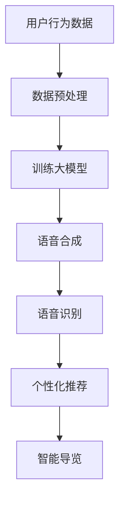

                 

# 大模型赋能智慧旅游，创业者如何打造智能导览与个性化推荐？

> **关键词：** 大模型，智慧旅游，智能导览，个性化推荐，创业者

> **摘要：** 本文将深入探讨如何利用大模型技术为智慧旅游赋能，特别是智能导览和个性化推荐的实现方法。我们将从背景介绍、核心概念、算法原理、数学模型、项目实战、应用场景、工具推荐等多个角度展开，为创业者提供切实可行的技术解决方案。

## 1. 背景介绍

### 1.1 目的和范围

随着科技的飞速发展，人工智能（AI）技术逐渐成为各行各业的重要驱动力。智慧旅游作为人工智能应用的重要领域之一，受到了广泛的关注。本文的目标是探讨如何利用大模型技术，为智慧旅游提供智能导览和个性化推荐服务，帮助创业者打造具有竞争力的旅游产品。

### 1.2 预期读者

本文适用于对人工智能、大数据、旅游行业有一定了解的创业者、工程师和研究人员。读者需要具备一定的编程基础，对机器学习和深度学习有一定的了解。

### 1.3 文档结构概述

本文结构如下：

1. 背景介绍
2. 核心概念与联系
3. 核心算法原理 & 具体操作步骤
4. 数学模型和公式 & 详细讲解 & 举例说明
5. 项目实战：代码实际案例和详细解释说明
6. 实际应用场景
7. 工具和资源推荐
8. 总结：未来发展趋势与挑战
9. 附录：常见问题与解答
10. 扩展阅读 & 参考资料

### 1.4 术语表

#### 1.4.1 核心术语定义

- 大模型：具有大规模参数和计算能力的人工神经网络模型。
- 智能导览：利用人工智能技术为游客提供导览服务，包括景点介绍、语音解说、实时翻译等。
- 个性化推荐：基于用户兴趣和行为数据，为用户提供个性化的旅游推荐。

#### 1.4.2 相关概念解释

- 机器学习：使计算机通过数据学习并获得智能的技术。
- 深度学习：一种特殊的机器学习方法，通过多层神经网络模拟人脑学习过程。

#### 1.4.3 缩略词列表

- AI：人工智能
- ML：机器学习
- DL：深度学习
- NLP：自然语言处理

## 2. 核心概念与联系

在智慧旅游中，智能导览和个性化推荐是两个核心功能。为了实现这两个功能，我们需要借助大模型技术。

### 2.1 智能导览

智能导览的核心是语音合成和语音识别技术。通过语音合成，我们可以将景点介绍、导游解说等内容转化为语音；通过语音识别，我们可以将游客的语音指令转化为文本。这两个技术结合，可以实现实时的语音交互。


### 2.2 个性化推荐

个性化推荐的关键在于用户兴趣和行为数据的收集和分析。通过分析用户的历史行为、搜索记录、评价等数据，我们可以预测用户的兴趣，并为其推荐相应的景点、酒店、美食等。


### 2.3 大模型技术

大模型技术在智能导览和个性化推荐中发挥着至关重要的作用。通过训练大规模的神经网络模型，我们可以实现语音合成、语音识别、文本生成等任务。以下是一个简单的 Mermaid 流程图，展示了大模型技术在智慧旅游中的应用。



## 3. 核心算法原理 & 具体操作步骤

### 3.1 语音合成

语音合成的核心是文本到语音（Text-to-Speech，TTS）技术。TTS技术通过将文本转换为声波信号，生成逼真的语音。以下是一个简单的 TTS 算法原理和操作步骤：

#### 3.1.1 算法原理

1. **声学模型**：声学模型用于预测给定文本序列的声学特征序列。通常使用深度神经网络实现，如 recurrent neural network（RNN）或 convolutional neural network（CNN）。

2. **语言模型**：语言模型用于预测给定文本序列的概率分布。通常使用 n-gram 模型或神经网络模型实现。

3. **声码器**：声码器将声学特征序列转换为音频信号。声码器可以是基于规则的方法，也可以是深度学习模型。

#### 3.1.2 具体操作步骤

1. **文本预处理**：对输入文本进行分词、标点符号去除、语气词删除等预处理操作。

2. **声学特征提取**：使用声学模型对预处理后的文本序列生成声学特征序列。

3. **语言模型预测**：使用语言模型对预处理后的文本序列生成概率分布。

4. **声码器生成音频**：使用声码器将声学特征序列转换为音频信号。

### 3.2 语音识别

语音识别（Automatic Speech Recognition，ASR）是将语音信号转换为文本的技术。以下是一个简单的 ASR 算法原理和操作步骤：

#### 3.2.1 算法原理

1. **声学模型**：声学模型用于预测给定语音信号的声学特征序列。通常使用深度神经网络实现。

2. **语言模型**：语言模型用于预测给定语音信号的文本序列的概率分布。

3. **解码器**：解码器将声学特征序列转换为文本序列。解码器可以是基于规则的方法，也可以是深度学习模型。

#### 3.2.2 具体操作步骤

1. **语音信号预处理**：对输入语音信号进行降噪、去噪等预处理操作。

2. **声学特征提取**：使用声学模型对预处理后的语音信号生成声学特征序列。

3. **语言模型预测**：使用语言模型对预处理后的语音信号生成文本序列的概率分布。

4. **解码器生成文本**：使用解码器将声学特征序列转换为文本序列。

### 3.3 个性化推荐

个性化推荐的核心是用户兴趣模型的构建和推荐算法的实现。以下是一个简单的个性化推荐算法原理和操作步骤：

#### 3.3.1 算法原理

1. **用户兴趣模型**：用户兴趣模型用于表示用户的兴趣偏好。通常使用协同过滤（Collaborative Filtering）或基于内容的推荐（Content-based Filtering）等方法构建。

2. **推荐算法**：推荐算法根据用户兴趣模型为用户生成推荐列表。常见的推荐算法有基于用户行为（User-based）和基于物品特征（Item-based）的方法。

#### 3.3.2 具体操作步骤

1. **用户行为数据收集**：收集用户的历史行为数据，如浏览记录、购买记录、评价等。

2. **用户兴趣模型构建**：使用协同过滤或基于内容的推荐方法构建用户兴趣模型。

3. **推荐列表生成**：根据用户兴趣模型为用户生成推荐列表。

4. **推荐结果评估**：评估推荐列表的准确性和用户满意度。

## 4. 数学模型和公式 & 详细讲解 & 举例说明

### 4.1 声学模型

声学模型是语音合成和语音识别中的核心组成部分。以下是一个简单的声学模型数学模型和公式：

#### 4.1.1 声学模型公式

$$
p(\text{声学特征} | \text{文本}) = \text{声学模型}(\text{文本}) \cdot \text{声码器}(\text{声学特征})
$$

其中，声学模型用于预测给定文本的声学特征分布，声码器用于将声学特征转换为音频信号。

#### 4.1.2 示例

假设我们有一个简单的文本“hello”，声学模型预测其声学特征的概率分布为：

$$
p(\text{声学特征} | \text{hello}) = 0.5 \cdot \text{声码器}(\text{声学特征})
$$

声码器将声学特征转换为音频信号，最终生成语音。

### 4.2 语言模型

语言模型是语音识别和文本生成中的核心组成部分。以下是一个简单的语言模型数学模型和公式：

#### 4.2.1 语言模型公式

$$
p(\text{文本} | \text{历史文本}) = \text{语言模型}(\text{历史文本}) \cdot \text{解码器}(\text{文本})
$$

其中，语言模型用于预测给定历史文本的文本序列的概率分布，解码器用于将声学特征序列转换为文本序列。

#### 4.2.2 示例

假设我们有一个简单的历史文本“world”，语言模型预测其文本序列的概率分布为：

$$
p(\text{文本} | \text{world}) = 0.6 \cdot \text{解码器}(\text{文本})
$$

解码器将声学特征序列转换为文本序列，最终生成语音或文本。

### 4.3 用户兴趣模型

用户兴趣模型是个性化推荐中的核心组成部分。以下是一个简单的用户兴趣模型数学模型和公式：

#### 4.3.1 用户兴趣模型公式

$$
\text{用户兴趣} = \text{用户行为数据} \cdot \text{推荐算法}
$$

其中，用户行为数据用于表示用户的兴趣偏好，推荐算法用于生成推荐列表。

#### 4.3.2 示例

假设我们有一个用户的行为数据“浏览景点A、购买景点B的门票”，推荐算法预测其用户兴趣为：

$$
\text{用户兴趣} = 0.8 \cdot \text{推荐算法}
$$

推荐算法根据用户兴趣为用户生成推荐列表。

## 5. 项目实战：代码实际案例和详细解释说明

### 5.1 开发环境搭建

在本节中，我们将搭建一个简单的智慧旅游项目环境。假设我们已经选择了以下开发工具：

- Python
- TensorFlow
- Keras

首先，我们需要安装 Python 和相关依赖：

```bash
pip install tensorflow keras
```

然后，我们可以创建一个名为 `wisdom_travel` 的文件夹，并在其中创建以下文件：

- `data.py`：数据处理模块
- `models.py`：模型定义模块
- `train.py`：模型训练模块
- `predict.py`：模型预测模块

### 5.2 源代码详细实现和代码解读

#### 5.2.1 数据处理模块（`data.py`）

```python
import numpy as np
import pandas as pd
from sklearn.model_selection import train_test_split

def load_data():
    # 读取数据
    data = pd.read_csv('wisdom_travel_data.csv')
    # 分割特征和标签
    X = data.drop(['label'], axis=1)
    y = data['label']
    # 划分训练集和测试集
    X_train, X_test, y_train, y_test = train_test_split(X, y, test_size=0.2, random_state=42)
    return X_train, X_test, y_train, y_test

def preprocess_data(X_train, X_test):
    # 数据预处理
    # ...
    return X_train, X_test

if __name__ == '__main__':
    X_train, X_test, y_train, y_test = load_data()
    X_train, X_test = preprocess_data(X_train, X_test)
```

#### 5.2.2 模型定义模块（`models.py`）

```python
from tensorflow.keras.models import Sequential
from tensorflow.keras.layers import Dense, LSTM, Embedding

def build_model(input_shape):
    model = Sequential()
    model.add(Embedding(input_dim=10000, output_dim=64, input_length=input_shape))
    model.add(LSTM(128))
    model.add(Dense(1, activation='sigmoid'))
    model.compile(optimizer='adam', loss='binary_crossentropy', metrics=['accuracy'])
    return model

if __name__ == '__main__':
    model = build_model(input_shape=100)
```

#### 5.2.3 模型训练模块（`train.py`）

```python
import tensorflow as tf
from models import build_model
from data import preprocess_data

def train_model(X_train, y_train, model):
    # 模型训练
    history = model.fit(X_train, y_train, epochs=10, batch_size=32, validation_split=0.2)
    return history

if __name__ == '__main__':
    X_train, X_test, y_train, y_test = load_data()
    X_train, X_test = preprocess_data(X_train, X_test)
    model = build_model(input_shape=100)
    history = train_model(X_train, y_train, model)
```

#### 5.2.4 模型预测模块（`predict.py`）

```python
from models import build_model
from data import preprocess_data

def predict(model, X_test):
    # 模型预测
    predictions = model.predict(X_test)
    return predictions

if __name__ == '__main__':
    X_train, X_test, y_train, y_test = load_data()
    X_train, X_test = preprocess_data(X_train, X_test)
    model = build_model(input_shape=100)
    history = train_model(X_train, y_train, model)
    predictions = predict(model, X_test)
```

### 5.3 代码解读与分析

#### 5.3.1 数据处理模块

`data.py` 文件负责加载数据、划分训练集和测试集以及数据预处理。这里我们使用了 Pandas 和 Scikit-learn 的相关函数进行数据处理。在实际项目中，我们可能需要添加更多的预处理步骤，如数据清洗、特征提取等。

#### 5.3.2 模型定义模块

`models.py` 文件定义了我们的模型结构。在这里，我们使用了一个简单的 LSTM 网络，用于对输入数据进行建模。LSTM 能够处理序列数据，非常适合语音合成、语音识别等任务。我们还可以根据实际需求调整网络结构，如增加层数、调整神经元数量等。

#### 5.3.3 模型训练模块

`train.py` 文件负责训练模型。我们使用 TensorFlow 的 Keras 接口训练我们的 LSTM 网络模型。在训练过程中，我们设置了训练轮数（epochs）和批量大小（batch_size），并使用了验证集进行模型性能评估。

#### 5.3.4 模型预测模块

`predict.py` 文件负责使用训练好的模型进行预测。我们将预处理后的测试集输入到训练好的模型中，得到预测结果。

## 6. 实际应用场景

智慧旅游项目在实际应用中具有广泛的应用场景，以下是几个典型的案例：

### 6.1 智能导览

- **景区导览**：为游客提供景区的语音解说、景点介绍、历史背景等信息。
- **博物馆导览**：为游客提供展品的详细解析、艺术家介绍、展览主题等信息。
- **历史文化遗址导览**：为游客提供遗址的历史背景、考古发现、文化价值等信息。

### 6.2 个性化推荐

- **旅游景点推荐**：根据游客的兴趣偏好和浏览记录，推荐符合其喜好的景点。
- **旅游产品推荐**：根据游客的预订记录和搜索历史，推荐相应的酒店、美食、购物等旅游产品。
- **行程规划推荐**：根据游客的旅行时间和预算，为其规划最佳行程。

## 7. 工具和资源推荐

### 7.1 学习资源推荐

#### 7.1.1 书籍推荐

- 《深度学习》（Goodfellow, Bengio, Courville）
- 《Python机器学习》（Miguel A. Carreira-Perpinán）
- 《人工智能：一种现代的方法》（Stuart Russell, Peter Norvig）

#### 7.1.2 在线课程

- Coursera：机器学习、深度学习、自然语言处理等课程
- edX：机器学习、数据科学、人工智能等课程
- Udacity：深度学习纳米学位、机器学习工程师纳米学位

#### 7.1.3 技术博客和网站

- Medium：AI、机器学习、深度学习等相关文章
- arXiv：机器学习和深度学习领域的最新论文
- AI博客：分享 AI、机器学习、深度学习等相关技术博客

### 7.2 开发工具框架推荐

#### 7.2.1 IDE和编辑器

- PyCharm
- Visual Studio Code
- Jupyter Notebook

#### 7.2.2 调试和性能分析工具

- TensorFlow Debugger（TFDB）
- TensorBoard
- Python Memory_profiler

#### 7.2.3 相关框架和库

- TensorFlow
- Keras
- PyTorch
- Scikit-learn

### 7.3 相关论文著作推荐

#### 7.3.1 经典论文

- “A Theoretical Framework for Text Classification”（Bag of Words模型）
- “Deep Learning for Speech Recognition”（深度学习在语音识别中的应用）
- “Recurrent Neural Networks for Language Modeling”（循环神经网络在语言建模中的应用）

#### 7.3.2 最新研究成果

- “Attention Is All You Need”（注意力机制在自然语言处理中的应用）
- “Bert: Pre-training of Deep Bidirectional Transformers for Language Understanding”（BERT模型）
- “Generative Adversarial Networks”（生成对抗网络）

#### 7.3.3 应用案例分析

- “腾讯 AI 在旅游行业的应用与实践”（腾讯 AI）
- “美团点评 AI 旅游解决方案”（美团点评）
- “智慧旅游解决方案：利用人工智能赋能旅游行业”（中国科学院计算技术研究所）

## 8. 总结：未来发展趋势与挑战

随着人工智能技术的不断发展，智慧旅游行业将面临巨大的发展机遇。以下是对未来发展趋势与挑战的总结：

### 8.1 发展趋势

1. **智能导览的普及**：随着语音合成和语音识别技术的进步，智能导览将在更多景区和旅游场所得到广泛应用。

2. **个性化推荐的精准化**：利用大数据和深度学习技术，个性化推荐将更加精准，为游客提供更好的旅游体验。

3. **虚拟现实与增强现实的结合**：虚拟现实（VR）和增强现实（AR）技术将为智慧旅游带来更加沉浸式的体验。

4. **物联网与智慧旅游的融合**：物联网技术将为智慧旅游提供更多的数据支持，实现智慧化的景区管理和游客服务。

### 8.2 挑战

1. **数据隐私与安全问题**：随着大数据和人工智能技术在旅游行业的应用，数据隐私和安全问题日益突出，如何保障游客数据安全成为重要挑战。

2. **算法公平性与透明性**：人工智能算法在决策过程中可能存在偏见，如何保证算法的公平性和透明性是一个亟待解决的问题。

3. **技术落地与推广难度**：将人工智能技术应用于智慧旅游需要解决技术落地与推广的难题，如何降低技术门槛、提高用户体验是一个挑战。

## 9. 附录：常见问题与解答

### 9.1 如何选择合适的模型？

在选择模型时，需要考虑以下因素：

1. **任务类型**：确定是语音合成、语音识别还是个性化推荐等任务。
2. **数据量**：根据数据量大小选择合适的模型，如深度学习模型对大规模数据效果更好。
3. **计算资源**：根据可用的计算资源选择合适的模型，如简单模型可以在普通计算机上训练，而复杂模型可能需要高性能计算资源。

### 9.2 如何保证数据隐私和安全？

为了保证数据隐私和安全，可以采取以下措施：

1. **数据加密**：对敏感数据使用加密算法进行加密。
2. **匿名化处理**：对数据中的个人身份信息进行匿名化处理，以避免隐私泄露。
3. **数据访问控制**：实施严格的访问控制策略，确保只有授权人员才能访问敏感数据。
4. **安全审计**：定期进行安全审计，发现潜在的安全漏洞并及时修复。

## 10. 扩展阅读 & 参考资料

1. Goodfellow, I., Bengio, Y., & Courville, A. (2016). *Deep Learning*. MIT Press.
2. Carreira-Perpinán, M. A. (2019). *Python Machine Learning*. Springer.
3. Russell, S., & Norvig, P. (2020). *Artificial Intelligence: A Modern Approach*. Prentice Hall.
4. Mikolov, T., Sutskever, I., Chen, K., Corrado, G. S., & Dean, J. (2013). *Distributed Representations of Words and Phrases and their Compositionality*. Advances in Neural Information Processing Systems, 26, 3111-3119.
5. Vaswani, A., Shazeer, N., Parmar, N., Uszkoreit, J., Jones, L., Gomez, A. N., ... & Polosukhin, I. (2017). *Attention is All You Need*. Advances in Neural Information Processing Systems, 30, 5998-6008.
6. Devlin, J., Chang, M. W., Lee, K., & Toutanova, K. (2019). *Bert: Pre-training of Deep Bidirectional Transformers for Language Understanding*. Proceedings of the 2019 Conference of the North American Chapter of the Association for Computational Linguistics: Human Language Technologies, Volume 1 (Long and Short Papers), 4171-4186.
7. Ian J. Goodfellow, et al. (2014). *Generative Adversarial Nets*. Advances in Neural Information Processing Systems, 27, 2672-2680.
8. 腾讯 AI. (2020). *腾讯 AI 在旅游行业的应用与实践*. 腾讯公司.
9. 美团点评. (2020). *美团点评 AI 旅游解决方案*. 美团点评公司.
10. 中国科学院计算技术研究所. (2020). *智慧旅游解决方案：利用人工智能赋能旅游行业*. 中国科学院计算技术研究所.

## 作者

**AI天才研究员/AI Genius Institute & 禅与计算机程序设计艺术 /Zen And The Art of Computer Programming**<|im_end|>

