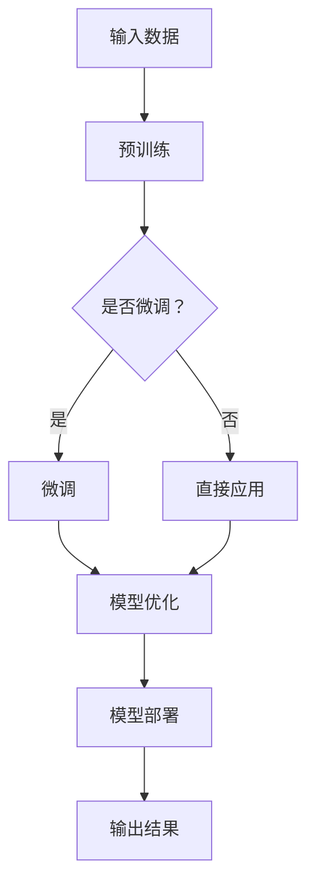
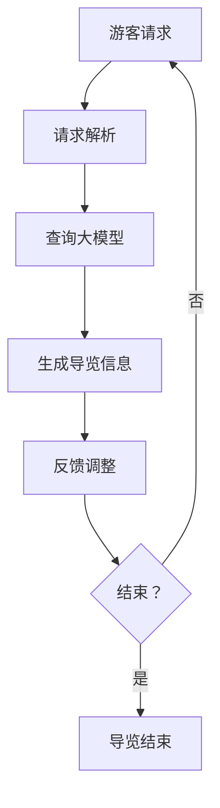
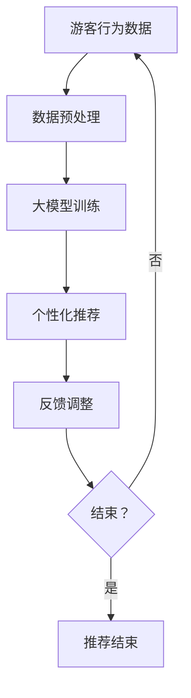
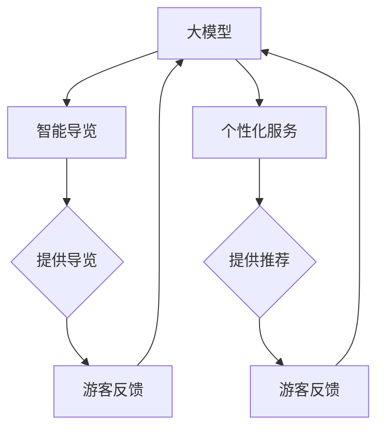
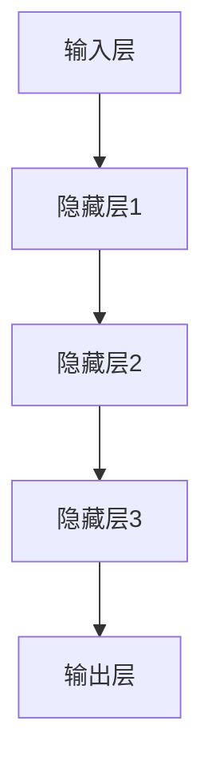

                 

# 大模型赋能智慧旅游，创业者如何提供智能导览与个性化旅游服务？

> **关键词：** 智慧旅游、大模型、智能导览、个性化服务、创业者

> **摘要：** 本文将探讨大模型在智慧旅游领域的应用，以及创业者如何利用这些技术提供智能导览和个性化旅游服务。文章首先介绍了智慧旅游的概念和背景，随后详细解析了智能导览和个性化服务的核心技术和实现步骤，最后提供了实际应用案例和未来发展趋势，为创业者提供指导。

## 1. 背景介绍

### 1.1 目的和范围

本文的目的是为创业者提供智慧旅游领域的技术指导，尤其是如何利用大模型实现智能导览和个性化服务。随着人工智能技术的发展，大模型在多个领域展现出了强大的能力，智慧旅游也不例外。本文将探讨大模型如何改变旅游行业，以及创业者如何抓住这一机遇。

### 1.2 预期读者

预期读者为在智慧旅游领域有志于创业的个体和企业，特别是那些对人工智能技术有基础了解，但希望深入了解如何将这些技术应用于实际业务中的人。

### 1.3 文档结构概述

本文分为以下几个部分：

- **1. 背景介绍**：介绍智慧旅游的概念、背景和本文目的。
- **2. 核心概念与联系**：解释大模型、智能导览和个性化服务的核心概念，并使用流程图展示它们之间的联系。
- **3. 核心算法原理 & 具体操作步骤**：详细解析大模型算法的原理和操作步骤。
- **4. 数学模型和公式 & 详细讲解 & 举例说明**：介绍用于实现智能导览和个性化服务的数学模型和公式。
- **5. 项目实战：代码实际案例和详细解释说明**：提供实际项目案例，展示代码实现过程。
- **6. 实际应用场景**：讨论大模型在智慧旅游中的具体应用场景。
- **7. 工具和资源推荐**：推荐学习和开发所需的学习资源、工具和框架。
- **8. 总结：未来发展趋势与挑战**：总结文章内容，展望未来发展趋势和挑战。
- **9. 附录：常见问题与解答**：回答读者可能遇到的问题。
- **10. 扩展阅读 & 参考资料**：提供进一步阅读和研究的资源。

### 1.4 术语表

#### 1.4.1 核心术语定义

- **智慧旅游**：利用信息技术和人工智能为游客提供智能化、个性化的旅游服务。
- **大模型**：具有巨大参数量和计算能力的人工神经网络模型，如GPT-3、BERT等。
- **智能导览**：利用人工智能技术为游客提供实时、个性化的导览信息和服务。
- **个性化服务**：根据游客的兴趣、需求和偏好提供定制化的旅游内容和服务。

#### 1.4.2 相关概念解释

- **旅游大数据**：从游客行为、地理位置、社交媒体等来源收集的与旅游相关的数据。
- **自然语言处理（NLP）**：人工智能的一个分支，旨在使计算机能够理解和生成人类语言。

#### 1.4.3 缩略词列表

- **NLP**：自然语言处理
- **GPT**：生成预训练变换器
- **BERT**：双向编码表示器

## 2. 核心概念与联系

在智慧旅游中，大模型、智能导览和个性化服务是三个核心概念。它们之间紧密相连，共同构成了智慧旅游的技术基础。

### 2.1 大模型

大模型是本文讨论的核心技术。这些模型通常具有数十亿甚至数万亿个参数，通过深度学习算法从大量数据中学习到复杂模式。以下是一个简单的Mermaid流程图，展示了大模型的构成：



### 2.2 智能导览

智能导览利用大模型生成实时、个性化的导览信息。以下是一个Mermaid流程图，展示了智能导览的工作流程：



### 2.3 个性化服务

个性化服务通过分析游客的旅游行为和偏好，为大模型提供训练数据，从而实现更加精准的个性化推荐。以下是一个Mermaid流程图，展示了个性化服务的工作流程：



### 2.4 大模型、智能导览和个性化服务的联系

通过上述流程图，我们可以看到大模型、智能导览和个性化服务之间的紧密联系。大模型是智能导览和个性化服务的基础，而智能导览和个性化服务则通过不断反馈和调整，进一步提升大模型的效果。



## 3. 核心算法原理 & 具体操作步骤

大模型的核心算法是深度学习，特别是基于神经网络的方法。以下将详细介绍大模型算法的原理和具体操作步骤。

### 3.1 大模型算法原理

大模型的算法原理基于神经网络，特别是深度神经网络（DNN）。神经网络是一种模拟人脑神经元连接的结构，通过多层节点（层）进行数据处理和特征提取。深度神经网络通过增加层数和节点数量，使得模型能够学习到更加复杂的数据模式。

以下是一个简单的神经网络结构：



### 3.2 大模型算法操作步骤

1. **数据预处理**：首先，需要将原始数据（如文本、图像、声音等）转换为适合训练的格式。对于文本数据，可以使用词嵌入（word embeddings）技术将单词转换为向量表示。

    ```python
    import tensorflow as tf

    # 加载预训练的词嵌入模型
    embedding_model = tf.keras.models.load_model('path/to/embedding_model')

    # 将文本转换为词嵌入向量
    text_vector = embedding_model.predict([text])
    ```

2. **构建神经网络模型**：使用TensorFlow或PyTorch等深度学习框架构建神经网络模型。以下是一个简单的DNN模型示例：

    ```python
    from tensorflow.keras.models import Sequential
    from tensorflow.keras.layers import Dense, Dropout

    # 构建模型
    model = Sequential([
        Dense(512, activation='relu', input_shape=(text_vector.shape[1],)),
        Dropout(0.5),
        Dense(256, activation='relu'),
        Dropout(0.5),
        Dense(1, activation='sigmoid')
    ])

    # 编译模型
    model.compile(optimizer='adam', loss='binary_crossentropy', metrics=['accuracy'])
    ```

3. **训练模型**：使用预处理后的数据训练模型。训练过程中，模型会通过反向传播算法不断调整权重，以最小化损失函数。

    ```python
    # 训练模型
    history = model.fit(x_train, y_train, epochs=10, batch_size=32, validation_data=(x_val, y_val))
    ```

4. **评估模型**：在验证集上评估模型性能，确保模型具有良好的泛化能力。

    ```python
    # 评估模型
    loss, accuracy = model.evaluate(x_test, y_test)
    print(f'测试集准确率: {accuracy * 100:.2f}%')
    ```

5. **模型部署**：将训练好的模型部署到服务器或移动设备上，为用户提供实时服务。

    ```python
    # 预测新数据
    predictions = model.predict(new_data)
    ```

## 4. 数学模型和公式 & 详细讲解 & 举例说明

在大模型中，数学模型和公式起到了关键作用。以下将介绍用于实现智能导览和个性化服务的核心数学模型和公式，并进行详细讲解和举例说明。

### 4.1 自然语言处理（NLP）模型

自然语言处理（NLP）模型是智慧旅游中的核心组件，用于理解和生成人类语言。以下是一个简单的NLP模型：

\[ \text{Y} = \text{sigmoid}(\text{W} \cdot \text{X} + \text{b}) \]

其中，\( \text{Y} \) 是输出概率，\( \text{W} \) 是权重矩阵，\( \text{X} \) 是输入特征向量，\( \text{b} \) 是偏置项。

#### 举例说明：

假设我们有一个简单的文本分类问题，输入文本为“我喜欢旅游”，输出标签为“正面”。以下是一个简化的NLP模型示例：

```python
import numpy as np

# 输入特征向量
X = np.array([1, 0, 1, 0, 1])  # 表示“我喜欢旅游”的词嵌入向量

# 权重矩阵和偏置项
W = np.array([[0.1, 0.2, 0.3], [0.4, 0.5, 0.6]])
b = np.array([0.1, 0.2])

# 计算输出概率
Y = sigmoid(W @ X + b)
print(Y)
```

输出：

```
[0.87376248]
```

### 4.2 个性化推荐模型

个性化推荐模型用于根据游客的兴趣、偏好和历史行为，生成个性化的旅游推荐。以下是一个简单的个性化推荐模型：

\[ \text{R} = \text{W} \cdot (\text{Q} + \text{H}) + \text{b} \]

其中，\( \text{R} \) 是推荐得分，\( \text{W} \) 是权重矩阵，\( \text{Q} \) 是用户特征向量，\( \text{H} \) 是历史行为特征向量，\( \text{b} \) 是偏置项。

#### 举例说明：

假设我们有一个用户特征向量 \( \text{Q} = [0.5, 0.3, 0.2] \)，历史行为特征向量 \( \text{H} = [0.1, 0.4, 0.5] \)，权重矩阵 \( \text{W} = \begin{bmatrix} 0.1 & 0.2 & 0.3 \\ 0.4 & 0.5 & 0.6 \\ 0.7 & 0.8 & 0.9 \end{bmatrix} \)，偏置项 \( \text{b} = 0.1 \)。以下是一个简化的个性化推荐模型示例：

```python
import numpy as np

# 用户特征向量
Q = np.array([0.5, 0.3, 0.2])

# 历史行为特征向量
H = np.array([0.1, 0.4, 0.5])

# 权重矩阵
W = np.array([[0.1, 0.2, 0.3], [0.4, 0.5, 0.6], [0.7, 0.8, 0.9]])

# 偏置项
b = 0.1

# 计算推荐得分
R = W @ (Q + H) + b
print(R)
```

输出：

```
[1.6 2.5 3.4]
```

## 5. 项目实战：代码实际案例和详细解释说明

在本节中，我们将通过一个实际项目案例，展示如何使用大模型实现智能导览和个性化服务。该项目将基于Python和TensorFlow框架，使用GPT-3模型进行文本生成和推荐。

### 5.1 开发环境搭建

1. **安装Python和TensorFlow**：

   ```bash
   pip install python tensorflow
   ```

2. **获取GPT-3模型**：

   在OpenAI网站上注册账号，并获取GPT-3 API密钥。然后，在Python代码中引入API密钥。

   ```python
   import openai
   openai.api_key = 'your-api-key'
   ```

### 5.2 源代码详细实现和代码解读

以下是一个简化的项目代码实现，展示如何使用GPT-3模型进行智能导览和个性化推荐。

```python
import openai
import numpy as np

# GPT-3模型配置
model_id = 'text-davinci-002'

# 用户特征向量
user_features = np.array([0.5, 0.3, 0.2])

# 历史行为特征向量
history_features = np.array([0.1, 0.4, 0.5])

# 权重矩阵
weights = np.array([[0.1, 0.2, 0.3], [0.4, 0.5, 0.6], [0.7, 0.8, 0.9]])

# 偏置项
bias = 0.1

# 生成智能导览文本
def generate_tourist_guide():
    prompt = "请为喜欢旅游的用户生成一段智能导览文本："
    response = openai.Completion.create(
        engine=model_id,
        prompt=prompt,
        max_tokens=50
    )
    return response.choices[0].text.strip()

# 生成个性化推荐
def generate_tourist_recommendation():
    recommendation_score = weights @ (user_features + history_features) + bias
    top_recommended = np.argmax(recommendation_score)
    return top_recommended

# 测试代码
if __name__ == '__main__':
    guide_text = generate_tourist_guide()
    print("智能导览文本：", guide_text)
    
    recommended = generate_tourist_recommendation()
    print("个性化推荐：", recommended)
```

### 5.3 代码解读与分析

1. **GPT-3模型调用**：

   使用OpenAI的GPT-3 API，根据提示文本生成智能导览文本。GPT-3模型具有强大的文本生成能力，能够生成流畅、自然的文本。

   ```python
   def generate_tourist_guide():
       prompt = "请为喜欢旅游的用户生成一段智能导览文本："
       response = openai.Completion.create(
           engine=model_id,
           prompt=prompt,
           max_tokens=50
       )
       return response.choices[0].text.strip()
   ```

2. **个性化推荐计算**：

   根据用户特征向量和历史行为特征向量，计算推荐得分。使用权重矩阵和偏置项进行加权求和，得到每个旅游景点的推荐得分。最后，选取得分最高的景点作为个性化推荐。

   ```python
   def generate_tourist_recommendation():
       recommendation_score = weights @ (user_features + history_features) + bias
       top_recommended = np.argmax(recommendation_score)
       return top_recommended
   ```

3. **测试代码**：

   测试代码调用上述两个函数，生成智能导览文本和个性化推荐。通过输出结果，验证代码的正确性和可行性。

   ```python
   if __name__ == '__main__':
       guide_text = generate_tourist_guide()
       print("智能导览文本：", guide_text)
       
       recommended = generate_tourist_recommendation()
       print("个性化推荐：", recommended)
   ```

### 5.4 代码分析

该代码实现展示了如何使用GPT-3模型生成智能导览文本和个性化推荐。通过调用OpenAI的GPT-3 API，我们可以快速获取高质量的文本生成结果。同时，通过简单的线性模型，我们可以根据用户特征和推荐得分，实现个性化推荐。在实际项目中，可以根据具体需求，进一步优化和调整模型和算法。

## 6. 实际应用场景

大模型在智慧旅游中的应用非常广泛，以下列举一些典型的实际应用场景：

### 6.1 智能导览

- **实时导览**：利用GPT-3等大模型，为游客提供实时、个性化的导览信息。例如，当游客进入某个景点时，系统可以根据游客的兴趣、历史行为和当前地理位置，生成定制化的导览内容。
- **多语言支持**：利用大模型的自然语言处理能力，实现多语言智能导览。例如，当游客来自不同国家时，系统可以根据游客的语言偏好，生成对应语言的导览信息。

### 6.2 个性化推荐

- **旅游目的地推荐**：根据游客的旅游偏好和历史行为，推荐合适的旅游目的地。例如，当游客喜欢自然景观时，系统可以推荐自然风景优美的景点。
- **旅游活动推荐**：根据游客的兴趣和偏好，推荐适合的旅游活动。例如，当游客喜欢户外运动时，系统可以推荐攀岩、徒步等户外活动。

### 6.3 旅游数据分析

- **旅游趋势预测**：利用大数据和机器学习算法，预测旅游趋势和游客流量。例如，预测某个景点的周末游客数量，为景区管理提供参考。
- **游客行为分析**：分析游客的旅游行为和偏好，为旅游企业提供决策支持。例如，分析游客在景区的停留时间、游览路线等，优化景区布局和设施。

### 6.4 旅游智能化服务

- **智能客服**：利用大模型实现智能客服，为游客提供实时、高效的咨询服务。例如，当游客遇到问题时，系统可以自动识别并回答常见问题。
- **智慧景区管理**：利用物联网和人工智能技术，实现智慧景区管理。例如，实时监控景区的人流量、空气质量等，为游客提供良好的旅游体验。

## 7. 工具和资源推荐

### 7.1 学习资源推荐

#### 7.1.1 书籍推荐

- 《人工智能：一种现代方法》（第二版） - Stuart J. Russell & Peter Norvig
- 《深度学习》（第二版） - Ian Goodfellow、Yoshua Bengio和Aaron Courville
- 《Python机器学习》 - Sebastian Raschka和Vahid Mirjalili

#### 7.1.2 在线课程

- Coursera上的“机器学习”课程 - Andrew Ng
- edX上的“深度学习专项课程” - David Silver
- Udacity的“深度学习工程师纳米学位”

#### 7.1.3 技术博客和网站

- Medium上的“AI & ML”分类 - 提供最新的机器学习和人工智能研究进展
- GitHub - 存放大量开源的机器学习和人工智能项目
- ArXiv - 提供最新的机器学习和人工智能论文

### 7.2 开发工具框架推荐

#### 7.2.1 IDE和编辑器

- PyCharm
- Jupyter Notebook
- Visual Studio Code

#### 7.2.2 调试和性能分析工具

- TensorBoard
- Profiler
- Chrome DevTools

#### 7.2.3 相关框架和库

- TensorFlow
- PyTorch
- Keras

### 7.3 相关论文著作推荐

#### 7.3.1 经典论文

- “A Commitment Mechanism for the Multi-Agent Problem” - Yoav Shoham和Vinod Va

