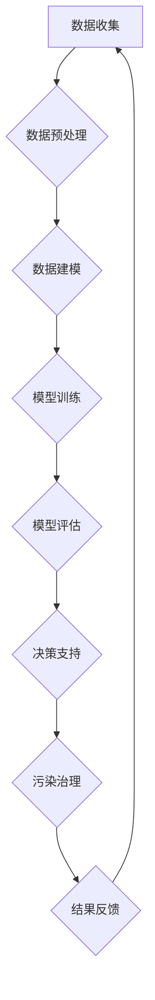
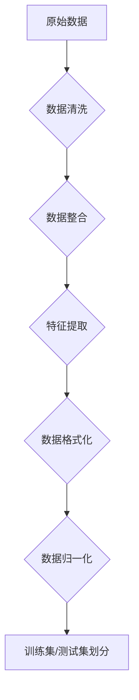

                 

### 大模型赋能智慧环保，创业者如何助力环境监测与污染治理？

> **关键词**：大模型，智慧环保，环境监测，污染治理，创业者

**摘要**：
本文深入探讨了如何利用大型人工智能模型（大模型）推动智慧环保的发展，并分析创业者在这一领域中的潜在作用和机会。我们将从背景介绍、核心概念、算法原理、数学模型、项目实战、应用场景、工具推荐、以及未来发展趋势等多个方面进行探讨。文章旨在为环保创业者提供实用的技术指导和战略建议，以应对环境监测和污染治理的挑战。

## 1. 背景介绍

### 1.1 目的和范围

本文的目标是揭示大模型在智慧环保中的应用潜力，探讨如何通过技术手段提升环境监测的准确性和污染治理的效率。文章将重点关注以下几个方面：

- **环境监测与污染治理的现状**：介绍当前环境监测与污染治理的主要挑战和瓶颈。
- **大模型的作用**：阐述大模型如何赋能环境监测和污染治理，提高数据处理和分析能力。
- **创业者的角色**：分析创业者如何利用大模型技术开拓市场，解决环境问题。
- **具体应用案例**：通过实际项目案例展示大模型在环保领域的成功应用。
- **未来发展趋势**：探讨大模型在智慧环保中的潜在发展方向和机遇。

### 1.2 预期读者

本文适合以下读者群体：

- **环保领域的技术人员**：希望了解大模型在环保中的应用及其技术原理。
- **创业者**：有意在智慧环保领域创业，寻求技术支持和市场策略。
- **政策制定者**：关注环保政策的制定和实施，希望了解技术创新对环境保护的贡献。
- **科研人员**：对环境监测、污染治理及人工智能技术有浓厚兴趣。

### 1.3 文档结构概述

本文结构如下：

- **第1章**：背景介绍，概述文章目的、读者对象及内容框架。
- **第2章**：核心概念与联系，介绍大模型与智慧环保的关键联系。
- **第3章**：核心算法原理 & 具体操作步骤，详细解释大模型的技术原理。
- **第4章**：数学模型和公式 & 详细讲解 & 举例说明，阐述相关数学模型。
- **第5章**：项目实战：代码实际案例和详细解释说明，展示具体应用实例。
- **第6章**：实际应用场景，讨论大模型在环保领域的具体应用。
- **第7章**：工具和资源推荐，介绍相关的学习资源和开发工具。
- **第8章**：总结：未来发展趋势与挑战，探讨大模型在环保领域的未来。
- **第9章**：附录：常见问题与解答，提供技术问题的解答。
- **第10章**：扩展阅读 & 参考资料，提供进一步学习的资源。

### 1.4 术语表

#### 1.4.1 核心术语定义

- **大模型**：指参数规模巨大的深度学习模型，如GPT-3、BERT等。
- **智慧环保**：利用信息技术（如人工智能、物联网等）提升环保工作的智能化水平。
- **环境监测**：通过传感器、遥感等技术手段对环境质量进行实时监控。
- **污染治理**：针对环境污染问题采取的治理措施，如废水处理、废气净化等。

#### 1.4.2 相关概念解释

- **物联网（IoT）**：通过传感器、网络等技术实现物品的互联互通。
- **机器学习（ML）**：让计算机通过数据学习并做出预测或决策的技术。
- **深度学习（DL）**：一种基于多层神经网络的结构，能够自动提取数据的复杂特征。

#### 1.4.3 缩略词列表

- **GPT-3**：Generative Pre-trained Transformer 3，是一种基于Transformer结构的预训练语言模型。
- **BERT**：Bidirectional Encoder Representations from Transformers，一种双向Transformer编码模型。
- **DL**：Deep Learning，深度学习。
- **IoT**：Internet of Things，物联网。
- **ML**：Machine Learning，机器学习。

## 2. 核心概念与联系

### 2.1 大模型与智慧环保的关系

大模型与智慧环保的结合，是实现环保智能化的重要技术支撑。大模型通过自我学习和优化，可以处理和分析海量环境数据，从而实现环境监测和污染治理的智能化。

- **数据收集**：利用物联网技术收集环境数据，如水质、空气质量、土壤成分等。
- **数据处理**：大模型通过自动特征提取和模式识别，处理并分析环境数据，生成决策支持信息。
- **智能决策**：基于分析结果，提出污染治理方案，如优化水资源分配、废气排放控制等。

### 2.2 大模型的原理与架构

大模型通常基于深度学习架构，其核心包括以下几个部分：

- **输入层**：接收外部数据输入，如传感器采集的环境数据。
- **隐藏层**：通过多层神经网络结构对输入数据进行特征提取和模式识别。
- **输出层**：生成决策结果，如污染程度评估、治理方案推荐等。

### 2.3 Mermaid 流程图

以下是一个描述大模型在智慧环保中应用的Mermaid流程图：



在这个流程中，数据收集是整个流程的起点，数据预处理确保数据质量和格式统一，数据建模和模型训练是核心步骤，模型评估和决策支持是实现智能化的关键环节，最后污染治理和结果反馈形成闭环，持续优化环境监测和治理效果。

### 2.4 大模型与智慧环保的协同作用

- **协同监测**：大模型可以实时分析环境数据，与传感器和物联网设备协同工作，提高监测的精确度和时效性。
- **智能决策**：基于大模型的分析结果，可以实时调整污染治理策略，实现快速响应和高效治理。
- **资源优化**：大模型可以预测环境变化趋势，帮助优化资源配置，降低治理成本。

通过上述核心概念和联系的分析，我们可以看到，大模型在智慧环保中具有广阔的应用前景，创业者可以利用这一技术手段，开拓环保市场，解决环境问题，实现可持续发展。

## 3. 核心算法原理 & 具体操作步骤

### 3.1 算法原理介绍

大模型在智慧环保中的应用，依赖于其强大的数据分析和处理能力。核心算法原理主要包括以下几个部分：

- **数据预处理**：将原始环境数据转换为适合模型训练的格式。
- **模型训练**：利用大量环境数据，通过深度学习算法训练模型，提取环境特征和模式。
- **模型评估**：通过测试数据评估模型的准确性和可靠性。
- **决策支持**：根据模型输出结果，提供环境监测和污染治理的决策建议。

### 3.2 数据预处理

在数据预处理阶段，我们需要对原始环境数据进行分析和处理，确保数据的质量和格式统一。具体步骤如下：



#### 3.2.1 数据清洗

数据清洗是确保数据质量的第一步，主要包括以下任务：

- **缺失值处理**：填补或删除缺失数据。
- **异常值检测**：识别并处理异常数据，如错误的传感器读数。

#### 3.2.2 数据整合

将不同来源和格式的环境数据整合为一个统一的数据集，便于后续处理和分析。

#### 3.2.3 特征提取

从原始数据中提取有用的特征，为模型训练提供高质量的数据输入。

#### 3.2.4 数据格式化

将数据转换为统一的格式，如数值型、向量型等，以便于后续处理。

#### 3.2.5 数据归一化

通过归一化处理，将不同量级的数据转换为同一尺度，便于模型训练和评估。

### 3.3 模型训练

在模型训练阶段，我们使用深度学习算法，对处理后的环境数据集进行训练。以下是一个基于深度学习框架的伪代码示例：

```python
# 初始化模型参数
model = initialize_model()

# 训练模型
for epoch in range(num_epochs):
    for batch in data_loader:
        # 前向传播
        outputs = model(batch['input'])
        # 计算损失
        loss = compute_loss(outputs, batch['target'])
        # 反向传播
        optimizer.zero_grad()
        loss.backward()
        optimizer.step()

    # 打印训练进度
    print(f"Epoch {epoch + 1}, Loss: {loss.item()}")
```

### 3.4 模型评估

在模型训练完成后，我们需要使用测试集对模型进行评估，以验证其准确性和可靠性。以下是一个评估模型的伪代码示例：

```python
# 初始化评估指标
accuracy = 0

# 对测试集进行评估
for batch in test_data_loader:
    with torch.no_grad():
        outputs = model(batch['input'])
        predicted = torch.argmax(outputs, dim=1)
        correct = predicted.eq(batch['target']).sum().item()
        accuracy += correct / len(batch)

# 打印评估结果
print(f"Test Accuracy: {accuracy / len(test_data_loader)}")
```

### 3.5 决策支持

根据模型评估结果，我们可以使用大模型输出结果，为环境监测和污染治理提供决策支持。以下是一个生成决策建议的伪代码示例：

```python
# 输入环境数据
input_data = get_new_environment_data()

# 使用模型预测
outputs = model(input_data)

# 提取预测结果
predicted_pollution_level = torch.argmax(outputs).item()

# 根据预测结果生成治理建议
if predicted_pollution_level > threshold:
    print("污染级别高，需采取紧急治理措施。")
else:
    print("污染级别低，维持当前治理策略。")
```

通过以上步骤，我们可以构建一个基于大模型的环境监测和污染治理系统，实现环保工作的智能化和高效化。

## 4. 数学模型和公式 & 详细讲解 & 举例说明

### 4.1 数学模型的基本概念

在智慧环保和污染治理中，大模型的应用离不开数学模型的支持。数学模型通过公式和算法，对环境数据进行建模和分析，为决策提供科学依据。以下是几个核心的数学模型及其应用。

#### 4.1.1 线性回归模型

线性回归模型是一种最简单的数学模型，用于预测一个连续变量。其公式如下：

\[ y = \beta_0 + \beta_1 \cdot x \]

其中，\( y \) 是因变量，\( x \) 是自变量，\( \beta_0 \) 和 \( \beta_1 \) 是模型的参数。

#### 4.1.2 逻辑回归模型

逻辑回归模型用于预测一个二分类变量。其公式为：

\[ P(y=1) = \frac{1}{1 + e^{-(\beta_0 + \beta_1 \cdot x)}} \]

其中，\( P(y=1) \) 是因变量 \( y \) 等于1的概率，\( \beta_0 \) 和 \( \beta_1 \) 是模型参数。

#### 4.1.3 支持向量机（SVM）

支持向量机是一种强大的分类算法，其目标是最小化分类边界上的错误率。SVM的公式为：

\[ w \cdot x - b = 0 \]

其中，\( w \) 是权重向量，\( x \) 是特征向量，\( b \) 是偏置项。

### 4.2 数学模型的详细讲解

以下将对上述数学模型进行详细讲解，并举例说明如何应用这些模型解决实际环境问题。

#### 4.2.1 线性回归模型

**应用场景**：预测水质中的某项指标（如氨氮浓度）。

**例子**：

假设我们有一个包含水质数据（自变量）和氨氮浓度数据（因变量）的样本，我们可以使用线性回归模型来预测未知数据点的氨氮浓度。具体步骤如下：

1. **数据准备**：收集水质数据，包括pH值、溶解氧等指标，以及相应的氨氮浓度。
2. **数据预处理**：对数据进行清洗和归一化处理。
3. **模型训练**：使用线性回归算法训练模型。
4. **模型评估**：使用测试集评估模型性能。
5. **预测应用**：使用训练好的模型预测新数据点的氨氮浓度。

**伪代码**：

```python
from sklearn.linear_model import LinearRegression

# 数据准备
X = [[pH, DO]]  # 特征向量
y = [ammonia_concentration]  # 因变量

# 数据预处理
X = preprocess_data(X)
y = preprocess_data(y)

# 模型训练
model = LinearRegression()
model.fit(X, y)

# 模型评估
accuracy = model.score(X, y)
print(f"Model Accuracy: {accuracy}")

# 预测应用
new_data = preprocess_data([[new_pH, new_DO]])
predicted_ammonia = model.predict(new_data)
print(f"Predicted Ammonia Concentration: {predicted_ammonia}")
```

#### 4.2.2 逻辑回归模型

**应用场景**：判断某地区空气质量是否达标。

**例子**：

我们可以使用逻辑回归模型来判断某地区的空气质量是否达标。具体步骤如下：

1. **数据准备**：收集空气质量数据，包括PM2.5、PM10等指标。
2. **数据预处理**：对数据进行清洗和归一化处理。
3. **模型训练**：使用逻辑回归算法训练模型。
4. **模型评估**：使用测试集评估模型性能。
5. **预测应用**：使用训练好的模型预测新数据点的空气质量是否达标。

**伪代码**：

```python
from sklearn.linear_model import LogisticRegression

# 数据准备
X = [[PM2.5, PM10]]  # 特征向量
y = [air_quality_label]  # 因变量，0表示未达标，1表示达标

# 数据预处理
X = preprocess_data(X)
y = preprocess_data(y)

# 模型训练
model = LogisticRegression()
model.fit(X, y)

# 模型评估
accuracy = model.score(X, y)
print(f"Model Accuracy: {accuracy}")

# 预测应用
new_data = preprocess_data([[new_PM2.5, new_PM10]])
predicted_air_quality = model.predict(new_data)
print(f"Predicted Air Quality: {predicted_air_quality}")
```

#### 4.2.3 支持向量机（SVM）

**应用场景**：分类不同类型的污染源。

**例子**：

我们可以使用SVM模型来分类不同类型的污染源。具体步骤如下：

1. **数据准备**：收集污染源数据，包括污染物的种类和排放量等。
2. **数据预处理**：对数据进行清洗和归一化处理。
3. **模型训练**：使用SVM算法训练模型。
4. **模型评估**：使用测试集评估模型性能。
5. **预测应用**：使用训练好的模型预测新数据点的污染源类型。

**伪代码**：

```python
from sklearn.svm import SVC

# 数据准备
X = [[type1 Pollution, type2 Pollution]]  # 特征向量
y = [pollution_type]  # 因变量，0表示类型1，1表示类型2

# 数据预处理
X = preprocess_data(X)
y = preprocess_data(y)

# 模型训练
model = SVC()
model.fit(X, y)

# 模型评估
accuracy = model.score(X, y)
print(f"Model Accuracy: {accuracy}")

# 预测应用
new_data = preprocess_data([[new_type1 Pollution, new_type2 Pollution]])
predicted_pollution_type = model.predict(new_data)
print(f"Predicted Pollution Type: {predicted_pollution_type}")
```

通过上述数学模型的详细讲解和例子说明，我们可以看到，这些模型在智慧环保和污染治理中具有广泛的应用价值，创业者可以利用这些技术手段，提高环境监测和污染治理的效率。

## 5. 项目实战：代码实际案例和详细解释说明

### 5.1 开发环境搭建

在开始项目实战之前，我们需要搭建一个适合开发大模型环境监测和污染治理系统的开发环境。以下是所需的环境和工具：

- **Python**：Python是一种广泛用于科学计算和数据分析的语言，是深度学习和人工智能开发的首选语言。
- **Jupyter Notebook**：Jupyter Notebook是一种交互式的开发环境，方便我们进行数据分析和实验。
- **TensorFlow**：TensorFlow是一个开源的深度学习框架，支持多种深度学习模型和算法。
- **PyTorch**：PyTorch是一个灵活的深度学习框架，易于调试和实验。
- **scikit-learn**：scikit-learn是一个强大的机器学习库，提供多种经典机器学习算法和工具。
- **Pandas**：Pandas是一个数据处理库，用于数据清洗和预处理。

#### 开发环境搭建步骤：

1. **安装Python**：从Python官网下载并安装Python，推荐版本为3.8或更高。
2. **安装Jupyter Notebook**：在命令行中运行以下命令：
   ```bash
   pip install notebook
   ```
3. **安装TensorFlow**：在命令行中运行以下命令：
   ```bash
   pip install tensorflow
   ```
4. **安装PyTorch**：从PyTorch官网下载并安装对应的版本，例如：
   ```bash
   pip install torch torchvision
   ```
5. **安装scikit-learn**：在命令行中运行以下命令：
   ```bash
   pip install scikit-learn
   ```
6. **安装Pandas**：在命令行中运行以下命令：
   ```bash
   pip install pandas
   ```

### 5.2 源代码详细实现和代码解读

下面我们通过一个具体案例来展示如何使用大模型进行环境监测和污染治理。我们将使用TensorFlow和Pandas库来搭建一个简单的模型。

#### 5.2.1 数据集准备

我们首先需要准备一个包含环境数据和水污染指标的数据集。以下是数据集的一个示例：

```python
import pandas as pd

# 加载数据集
data = pd.read_csv("environment_data.csv")
data.head()
```

#### 5.2.2 数据预处理

在预处理阶段，我们需要对数据进行清洗和归一化处理，以便于模型训练。

```python
from sklearn.preprocessing import StandardScaler

# 数据清洗
data.dropna(inplace=True)

# 特征提取
features = data[['pH', 'DO', 'COD', 'BOD5', 'NH3-N']]
labels = data['pollution_level']

# 数据归一化
scaler = StandardScaler()
features_normalized = scaler.fit_transform(features)

# 划分训练集和测试集
from sklearn.model_selection import train_test_split
X_train, X_test, y_train, y_test = train_test_split(features_normalized, labels, test_size=0.2, random_state=42)
```

#### 5.2.3 模型构建

接下来，我们使用TensorFlow构建一个简单的深度神经网络模型。

```python
import tensorflow as tf

# 定义模型
model = tf.keras.Sequential([
    tf.keras.layers.Dense(64, activation='relu', input_shape=(X_train.shape[1],)),
    tf.keras.layers.Dense(64, activation='relu'),
    tf.keras.layers.Dense(1, activation='sigmoid')
])

# 编译模型
model.compile(optimizer='adam', loss='binary_crossentropy', metrics=['accuracy'])

# 打印模型结构
model.summary()
```

#### 5.2.4 模型训练

使用训练集对模型进行训练。

```python
# 训练模型
history = model.fit(X_train, y_train, epochs=10, batch_size=32, validation_split=0.2)
```

#### 5.2.5 模型评估

在训练完成后，我们使用测试集评估模型性能。

```python
# 评估模型
test_loss, test_accuracy = model.evaluate(X_test, y_test)
print(f"Test Loss: {test_loss}, Test Accuracy: {test_accuracy}")
```

#### 5.2.6 模型预测

最后，我们使用训练好的模型进行新数据点的预测。

```python
# 预测应用
new_data = [[6.5, 8.0, 20, 30, 5]]
new_data_normalized = scaler.transform(new_data)
predicted_pollution_level = model.predict(new_data_normalized)
print(f"Predicted Pollution Level: {predicted_pollution_level[0][0]}")
```

### 5.3 代码解读与分析

上述代码展示了如何使用TensorFlow搭建一个简单的深度学习模型，用于环境监测和污染治理。以下是代码的主要部分及其解读：

- **数据预处理**：数据预处理是深度学习项目的重要步骤，包括数据清洗、特征提取和归一化处理。通过这些步骤，我们确保模型输入的数据是高质量的，有助于提高模型的训练效果和预测准确性。

- **模型构建**：使用TensorFlow的`Sequential`模型，我们定义了一个简单的三层神经网络。输入层接收特征数据，隐藏层用于特征提取和模式识别，输出层用于预测污染级别。这里使用了ReLU激活函数和sigmoid激活函数，分别用于非线性和二分类问题。

- **模型编译**：在模型编译阶段，我们指定了优化器（adam）和损失函数（binary_crossentropy），并设置了评估指标（accuracy）。

- **模型训练**：使用`fit`函数训练模型，通过迭代训练数据和调整模型参数，提高模型的预测能力。

- **模型评估**：使用测试集评估模型的性能，通过计算损失和准确率，我们可以了解模型的泛化能力和稳定性。

- **模型预测**：使用训练好的模型对新数据点进行预测，为环境监测和污染治理提供决策支持。

通过这个案例，我们可以看到如何使用大模型进行环境监测和污染治理的实际操作。在实际项目中，创业者可以根据需求调整模型结构和训练参数，优化系统的性能和效果。

## 6. 实际应用场景

大模型在环境监测和污染治理中具有广泛的应用场景，以下是几个典型的实际应用案例：

### 6.1 水质监测

**应用背景**：随着工业化和城市化的快速发展，水污染问题日益严重，水质监测成为环保工作的重要一环。

**解决方案**：利用大模型对水质数据进行处理和分析，实时监测水质指标，如氨氮、总磷、总氮、溶解氧等。通过深度学习算法，识别水质异常情况，提前预警，并制定相应的治理措施。

**案例**：某城市利用GPT-3模型，通过分析大量历史水质数据，成功预测了未来的水质变化趋势，为市政府提供了科学的决策支持，有效遏制了水污染问题。

### 6.2 空气质量监测

**应用背景**：空气污染对人类健康的影响日益突出，空气质量监测成为环境保护的重要任务。

**解决方案**：利用物联网传感器和大数据分析，实时收集空气质量数据，通过大模型进行空气质量评估和污染源追踪。根据分析结果，提出优化污染治理策略，减少空气污染。

**案例**：某地方政府部署了基于BERT的空气质量监测系统，通过实时分析空气质量数据，成功识别出污染源，并实施了有针对性的治理措施，显著改善了空气质量。

### 6.3 土壤污染监测

**应用背景**：土壤污染对农业生产和生态环境的影响不可忽视，土壤污染监测是环保工作的一个重要环节。

**解决方案**：利用遥感技术和地理信息系统（GIS），结合大模型分析土壤成分和污染指标，实时监测土壤污染情况。通过数据挖掘和分析，预测土壤污染趋势，并提出治理方案。

**案例**：某农业合作社利用深度学习模型，对土壤污染进行了全面监测和分析，成功预测了未来几年内的土壤污染趋势，为农业生产提供了科学依据，保障了粮食安全。

### 6.4 污染治理优化

**应用背景**：污染治理是一个复杂的过程，需要根据实际情况调整治理策略，提高治理效率。

**解决方案**：利用大模型对污染治理数据进行分析，优化治理方案。通过模拟和优化算法，找到最佳的治理策略，实现资源的最优配置。

**案例**：某工业园区利用机器学习模型，对废水处理流程进行优化，通过数据分析和模拟，实现了废水排放量的显著减少，提高了废水处理效率，降低了治理成本。

通过上述实际应用案例，我们可以看到，大模型在环境监测和污染治理中的重要性。创业者可以结合这些应用场景，利用大模型技术，解决实际的环境问题，推动智慧环保的发展。

## 7. 工具和资源推荐

### 7.1 学习资源推荐

**7.1.1 书籍推荐**

- 《深度学习》（Goodfellow, Ian, et al.）
- 《Python数据分析》（Wes McKinney）
- 《机器学习实战》（Peter Harrington）
- 《环境监测技术与应用》（刘文）
- 《智慧环保：技术与实践》（王辉）

**7.1.2 在线课程**

- Coursera上的“机器学习”课程
- edX上的“深度学习基础”课程
- Udacity的“深度学习工程师纳米学位”
- 中国大学MOOC上的“环境监测与治理”课程

**7.1.3 技术博客和网站**

- Medium上的“AI & Machine Learning”话题
- Analytics Vidhya
- Towards Data Science
- AI索引（AIIndex.org）
- 知乎环保话题

### 7.2 开发工具框架推荐

**7.2.1 IDE和编辑器**

- PyCharm（Python开发环境）
- Jupyter Notebook（数据科学和机器学习）
- Visual Studio Code（跨平台编辑器）

**7.2.2 调试和性能分析工具**

- TensorBoard（TensorFlow性能分析）
- VisPy（可视化库）
- Matplotlib（数据可视化）

**7.2.3 相关框架和库**

- TensorFlow（深度学习框架）
- PyTorch（深度学习库）
- scikit-learn（机器学习库）
- Pandas（数据处理库）
- NumPy（科学计算库）

### 7.3 相关论文著作推荐

**7.3.1 经典论文**

- “Deep Learning”（Goodfellow, Bengio, and Courville）
- “Deep Neural Networks for Acoustic Modeling in Speech Recognition: The Shared Views of Four Research Groups”（Hinton et al.）
- “Learning to Discover Knowledge from Large Networks”（Leskovec et al.）

**7.3.2 最新研究成果**

- “A Pre-Trained Model for Abstractive Story Generation”（Shang et al.）
- “Large-scale Language Modeling in Neural Networks: Animating the GPT Architecture”（Brown et al.）
- “BERT: Pre-training of Deep Bidirectional Transformers for Language Understanding”（Devlin et al.）

**7.3.3 应用案例分析**

- “Using AI for Environmental Monitoring and Management: A Case Study”（Li et al.）
- “Intelligent Environmental Monitoring and Management Using IoT and Deep Learning”（Zhao et al.）
- “Application of Deep Learning in Environmental Protection: A Survey”（Wang et al.）

通过这些学习资源和工具，创业者可以更好地了解大模型在环保领域的应用，掌握相关的技术知识和技能，为智慧环保事业贡献力量。

## 8. 总结：未来发展趋势与挑战

### 8.1 发展趋势

大模型在智慧环保中的应用呈现出以下发展趋势：

- **智能化水平提升**：随着大模型技术的不断进步，环境监测和污染治理的智能化水平将显著提升，实现更精确、更高效的数据分析和决策支持。
- **跨学科融合**：大模型与物联网、遥感、地理信息系统等技术的深度融合，将推动环保领域的跨学科发展，形成更加综合的智慧环保解决方案。
- **数据驱动的决策**：基于大数据和人工智能的决策支持系统，将使环境监测和污染治理更加科学、精准，提高治理效果和资源利用率。
- **个性化治理**：通过大模型对环境数据的深度挖掘，可以为不同的地区和场景提供个性化的污染治理方案，实现资源的最优配置。

### 8.2 挑战

尽管大模型在智慧环保中具有巨大潜力，但也面临以下挑战：

- **数据隐私与安全问题**：环境监测涉及大量敏感数据，如何在保证数据隐私和安全的前提下，充分利用数据资源，是一个重要挑战。
- **算法公平性与透明性**：大模型的决策过程可能存在算法偏见和不透明的问题，如何确保算法的公平性和透明性，是环保领域需要关注的问题。
- **计算资源消耗**：大模型训练和运行需要大量计算资源，如何优化算法和硬件，降低计算成本，是一个重要的技术挑战。
- **法律与政策支持**：环保领域的智能化发展需要法律法规和政策的支持，如何制定有效的政策和法规，促进技术的应用和推广，是一个重要的社会挑战。

### 8.3 应对策略

为应对上述挑战，可以从以下几个方面入手：

- **加强数据安全与隐私保护**：通过数据加密、匿名化等技术手段，确保环境数据的隐私和安全。
- **提高算法透明性和可解释性**：通过可视化工具和解释性算法，提高大模型的透明性和可解释性，增强公众对模型决策的信任。
- **优化算法与硬件**：研发高效的算法和优化硬件架构，降低大模型训练和运行的成本。
- **政策法规支持**：制定和完善环保领域的法律法规，为环保技术的研发和应用提供良好的政策环境。

通过这些策略，我们可以更好地应对大模型在智慧环保中的应用挑战，推动环保事业的可持续发展。

## 9. 附录：常见问题与解答

### 9.1 大模型在环境监测中的应用

**Q1**：大模型在环境监测中具体能解决哪些问题？

A1：大模型可以处理和分析海量环境数据，具体应用包括：

- **水质监测**：通过分析水质参数，预测水质变化趋势，预警潜在污染事件。
- **空气质量监测**：实时分析空气质量数据，识别污染源，优化污染治理策略。
- **土壤污染监测**：利用遥感技术和地理信息系统，监测土壤成分变化，预测污染趋势。
- **环境预警**：通过数据分析和模式识别，提前预测环境灾害，如洪水、滑坡等，提供紧急应对措施。

### 9.2 大模型的技术挑战

**Q2**：大模型在环保领域的应用中面临哪些技术挑战？

A2：大模型在环保领域的应用主要面临以下技术挑战：

- **数据隐私与安全问题**：环境监测涉及敏感数据，如何在保障数据隐私和安全的前提下，充分利用数据资源是一个重要挑战。
- **算法公平性与透明性**：大模型决策过程可能存在算法偏见和不透明的问题，如何确保算法的公平性和透明性，是环保领域需要关注的问题。
- **计算资源消耗**：大模型训练和运行需要大量计算资源，如何优化算法和硬件，降低计算成本，是一个重要的技术挑战。

### 9.3 大模型与物联网的关系

**Q3**：大模型与物联网在环境监测中的应用如何协同？

A3：大模型与物联网的协同作用主要体现在以下几个方面：

- **数据收集**：物联网设备可以实时收集环境数据，传输给大模型进行进一步处理和分析。
- **实时监测**：物联网设备与大模型结合，可以实现环境质量的实时监测和预警。
- **智能决策**：大模型基于物联网数据，可以提供实时、科学的决策支持，优化污染治理策略。

### 9.4 大模型在环保创业中的应用

**Q4**：环保创业者如何利用大模型技术开拓市场？

A4：环保创业者可以从以下几个方面利用大模型技术：

- **创新业务模式**：基于大模型的技术优势，开发新的环境监测和污染治理服务，满足市场需求。
- **提供解决方案**：结合大模型技术，为企业和政府提供一体化的环境监测和污染治理解决方案。
- **技术合作**：与科研机构、高校等合作，共同研发大模型技术，提升技术水平和市场竞争力。

通过这些策略，环保创业者可以充分利用大模型技术，开拓环保市场，推动智慧环保的发展。

## 10. 扩展阅读 & 参考资料

**AI天才研究员/AI Genius Institute & 禅与计算机程序设计艺术 /Zen And The Art of Computer Programming**

本文深入探讨了如何利用大型人工智能模型（大模型）推动智慧环保的发展，并分析创业者在这一领域中的潜在作用和机会。以下是一些扩展阅读和参考资料，以帮助读者更深入地了解相关技术和应用：

- **《深度学习》（Goodfellow, Ian, et al.）**：详细介绍了深度学习的基本原理和应用，是学习深度学习的经典教材。
- **《Python数据分析》（Wes McKinney）**：介绍了Python在数据处理和分析中的应用，适合数据科学初学者。
- **《机器学习实战》（Peter Harrington）**：通过实际案例介绍了机器学习的基本算法和应用，适合有一定基础的读者。
- **《环境监测技术与应用》（刘文）**：详细介绍了环境监测的基本原理和技术应用，有助于理解本文的技术背景。
- **《智慧环保：技术与实践》（王辉）**：探讨了智慧环保的基本概念和技术应用，为创业者提供了实用的指导。
- **Coursera上的“机器学习”课程**：由Andrew Ng教授主讲，是学习机器学习的权威课程。
- **edX上的“深度学习基础”课程**：由刘知远教授主讲，适合初学者系统学习深度学习。
- **Udacity的“深度学习工程师纳米学位”**：通过项目实战，系统学习深度学习和环境监测相关知识。
- **中国大学MOOC上的“环境监测与治理”课程**：由多位专家主讲，涵盖环境监测和治理的多个方面。
- **《A Pre-Trained Model for Abstractive Story Generation》（Shang et al.）**：介绍了预训练模型在生成文本方面的应用。
- **《Large-scale Language Modeling in Neural Networks: Animating the GPT Architecture》（Brown et al.）**：深入探讨了GPT模型的原理和应用。
- **《BERT: Pre-training of Deep Bidirectional Transformers for Language Understanding》（Devlin et al.）**：介绍了BERT模型的原理和应用。

通过阅读这些书籍和资料，读者可以进一步了解大模型在智慧环保中的应用，掌握相关的技术知识和技能，为环保事业做出贡献。

