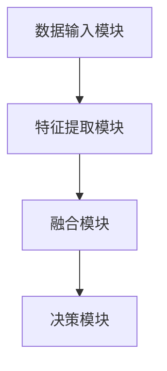

                 

# 大模型走向多模态：AI智能体的未来

> **关键词：** 大模型、多模态、AI智能体、机器学习、深度学习、计算机视觉、自然语言处理、未来趋势。

> **摘要：** 本文将深入探讨大模型在多模态AI智能体中的应用，分析其技术原理、核心算法、数学模型以及实际应用案例。通过逐步分析和推理，我们将了解大模型走向多模态的趋势和面临的挑战，为未来AI智能体的发展提供指导。

## 1. 背景介绍

### 1.1 目的和范围

本文旨在探讨大模型在多模态AI智能体中的应用，分析其技术原理和实际操作步骤，以期为AI领域的研究者和开发者提供有价值的参考。本文将涵盖以下内容：

- 大模型的基本概念和重要性
- 多模态AI智能体的原理和架构
- 核心算法原理和具体操作步骤
- 数学模型和公式详细讲解
- 实际应用场景和案例分析
- 未来发展趋势与挑战

### 1.2 预期读者

本文适用于以下读者：

- 对AI领域有浓厚兴趣的技术爱好者
- AI领域的研究人员和开发者
- 对机器学习、深度学习有深入了解的专业人士
- 对多模态AI智能体有研究需求的企业和机构

### 1.3 文档结构概述

本文分为八个部分，具体结构如下：

- 1. 背景介绍
  - 1.1 目的和范围
  - 1.2 预期读者
  - 1.3 文档结构概述
  - 1.4 术语表
- 2. 核心概念与联系
- 3. 核心算法原理 & 具体操作步骤
- 4. 数学模型和公式 & 详细讲解 & 举例说明
- 5. 项目实战：代码实际案例和详细解释说明
- 6. 实际应用场景
- 7. 工具和资源推荐
  - 7.1 学习资源推荐
  - 7.2 开发工具框架推荐
  - 7.3 相关论文著作推荐
- 8. 总结：未来发展趋势与挑战
- 9. 附录：常见问题与解答
- 10. 扩展阅读 & 参考资料

### 1.4 术语表

#### 1.4.1 核心术语定义

- **大模型（Big Model）**：具有巨大参数量和计算量的深度学习模型，通常由多层神经网络组成，能够处理大规模数据。
- **多模态（Multimodal）**：指同时处理多种类型的数据，如文本、图像、声音等。
- **AI智能体（AI Agent）**：能够自主感知环境、学习并采取行动以实现特定目标的计算机程序。
- **机器学习（Machine Learning）**：一种通过数据驱动的方式实现人工智能的技术，让计算机从数据中学习规律并做出决策。
- **深度学习（Deep Learning）**：一种特殊的机器学习方法，通过多层神经网络来学习数据表示。

#### 1.4.2 相关概念解释

- **计算机视觉（Computer Vision）**：使计算机具备人类视觉功能，如图像识别、目标检测、图像生成等。
- **自然语言处理（Natural Language Processing，NLP）**：使计算机理解和生成自然语言的技术，如文本分类、机器翻译、情感分析等。
- **深度神经网络（Deep Neural Network，DNN）**：由多层神经元组成的神经网络，能够自动提取数据特征。
- **卷积神经网络（Convolutional Neural Network，CNN）**：一种特殊的深度神经网络，主要用于图像识别和图像处理。
- **循环神经网络（Recurrent Neural Network，RNN）**：一种能够处理序列数据的神经网络，如文本数据。

#### 1.4.3 缩略词列表

- **AI**：人工智能
- **ML**：机器学习
- **DL**：深度学习
- **NLP**：自然语言处理
- **CV**：计算机视觉
- **DNN**：深度神经网络
- **CNN**：卷积神经网络
- **RNN**：循环神经网络
- **GAN**：生成对抗网络

## 2. 核心概念与联系

在探讨大模型走向多模态之前，我们需要先了解一些核心概念及其之间的联系。

### 2.1 大模型的基本原理

大模型通常是指具有巨大参数量和计算量的深度学习模型。其基本原理是通过多层神经网络学习数据特征，从而实现高度复杂的任务。大模型能够处理大规模数据，并在各种领域取得了显著的成果。例如，在图像识别、自然语言处理和语音识别等领域，大模型已经达到了或超过了人类的水平。

### 2.2 多模态AI智能体的架构

多模态AI智能体是指能够同时处理多种类型数据的智能体。其基本架构包括以下几个部分：

1. **数据输入模块**：负责接收和处理多种类型的数据，如文本、图像、声音等。
2. **特征提取模块**：通过对不同类型的数据进行特征提取，将它们转化为适合神经网络处理的格式。
3. **融合模块**：将不同类型的特征进行融合，形成统一的特征表示。
4. **决策模块**：利用融合后的特征进行决策，实现智能体的目标。

### 2.3 机器学习与深度学习的联系

机器学习和深度学习是两个相互关联的概念。机器学习是一种通过数据驱动的方式实现人工智能的技术，而深度学习是机器学习的一种特殊形式。深度学习通过多层神经网络学习数据特征，具有强大的表达能力和泛化能力。大模型通常是基于深度学习实现的，因此深度学习是推动大模型发展的重要技术。

### 2.4 计算机视觉与自然语言处理的联系

计算机视觉和自然语言处理都是AI领域的重要分支。计算机视觉使计算机具备人类视觉功能，如图像识别、目标检测等；自然语言处理使计算机能够理解和生成自然语言，如文本分类、机器翻译等。在实际应用中，计算机视觉和自然语言处理常常需要相互配合，共同实现复杂任务。

### 2.5 多模态AI智能体的优势与挑战

多模态AI智能体的优势在于能够同时处理多种类型的数据，从而提高任务的准确性和鲁棒性。例如，在图像识别任务中，通过结合文本描述和图像特征，可以提高识别的准确性。然而，多模态AI智能体也面临一些挑战：

1. **数据预处理与特征提取**：多模态数据需要不同的预处理方法和特征提取技术，这增加了算法的复杂度。
2. **模型融合与优化**：如何有效地融合不同类型的数据特征，是一个重要且具有挑战性的问题。
3. **计算资源消耗**：大模型和多模态数据处理需要大量的计算资源，对硬件设施有较高的要求。

### 2.6 Mermaid流程图

以下是一个简化的多模态AI智能体架构的Mermaid流程图，展示了各模块之间的联系：



## 3. 核心算法原理 & 具体操作步骤

在多模态AI智能体的实现中，核心算法原理起着至关重要的作用。本节将详细讲解大模型在多模态AI智能体中的应用，包括算法原理和具体操作步骤。

### 3.1 大模型的算法原理

大模型的算法原理主要基于深度学习，特别是多层神经网络。多层神经网络由输入层、隐藏层和输出层组成，通过反向传播算法不断调整网络参数，从而实现高度复杂的任务。大模型具有以下特点：

1. **参数量巨大**：大模型通常包含数百万到数十亿个参数，这使它们能够处理大规模数据并提取丰富的特征。
2. **计算量大**：大模型需要大量的计算资源进行训练和推理，这要求使用高效的硬件设施，如GPU和TPU。
3. **强大的泛化能力**：大模型通过学习大量数据，能够实现高度的泛化能力，从而在新数据上取得良好的性能。

### 3.2 多模态AI智能体的具体操作步骤

多模态AI智能体的实现可以分为以下几个步骤：

#### 3.2.1 数据收集与预处理

1. **数据收集**：首先需要收集多种类型的数据，如文本、图像、声音等。这些数据可以来自公开数据集、公司内部数据或第三方数据提供商。
2. **数据预处理**：对收集到的数据进行清洗、归一化和格式转换等预处理操作，使其符合神经网络处理的格式。

#### 3.2.2 特征提取

1. **图像特征提取**：使用卷积神经网络（CNN）提取图像特征。CNN通过多层卷积和池化操作，能够自动提取图像中的局部特征和整体特征。
2. **文本特征提取**：使用自然语言处理（NLP）技术提取文本特征。常见的NLP技术包括词向量表示、文本分类和序列标注等。
3. **声音特征提取**：使用循环神经网络（RNN）或长短时记忆网络（LSTM）提取声音特征。RNN能够处理序列数据，适合对声音信号进行建模。

#### 3.2.3 特征融合

1. **特征融合方法**：将不同类型的数据特征进行融合，形成统一的特征表示。常见的特征融合方法包括拼接、加权融合、注意力机制等。
2. **模型融合**：使用多层神经网络对融合后的特征进行处理，从而实现多模态数据的联合建模。

#### 3.2.4 决策与优化

1. **决策**：利用融合后的特征进行决策，实现智能体的目标。例如，在图像识别任务中，通过分类器对图像进行分类。
2. **优化**：通过梯度下降算法等优化方法，不断调整网络参数，提高模型性能。

### 3.3 伪代码实现

以下是一个简化的多模态AI智能体算法的伪代码实现：

```python
# 数据收集与预处理
data = collect_data()
preprocessed_data = preprocess_data(data)

# 特征提取
image_features = extract_image_features(preprocessed_data['images'])
text_features = extract_text_features(preprocessed_data['texts'])
audio_features = extract_audio_features(preprocessed_data['audio'])

# 特征融合
 fused_features = fuse_features(image_features, text_features, audio_features)

# 模型融合与决策
model = build_model()
predictions = model.predict(fused_features)

# 优化
model.optimize(predictions)
```

## 4. 数学模型和公式 & 详细讲解 & 举例说明

在多模态AI智能体的实现中，数学模型和公式起着至关重要的作用。本节将详细讲解大模型在多模态AI智能体中的应用，包括数学模型和公式的详细讲解以及举例说明。

### 4.1 深度学习基础

深度学习中的神经网络模型通常由输入层、隐藏层和输出层组成。每个层由多个神经元（节点）组成，神经元之间通过权重（参数）连接。神经元的计算公式如下：

$$
z_i = \sum_{j=1}^{n} w_{ij} \cdot x_j + b_i
$$

其中，$z_i$表示第$i$个神经元的激活值，$w_{ij}$表示第$i$个神经元和第$j$个神经元之间的权重，$x_j$表示第$j$个输入值，$b_i$表示第$i$个神经元的偏置。

神经元的激活函数通常采用Sigmoid函数或ReLU函数，例如：

$$
a_i = \sigma(z_i) = \frac{1}{1 + e^{-z_i}}
$$

或

$$
a_i = \max(0, z_i)
$$

### 4.2 多层神经网络

多层神经网络通过堆叠多个隐藏层，可以学习更加复杂的特征。多层神经网络的计算公式如下：

$$
z^{(l)} = \sum_{j=1}^{n} w_{ij}^{(l)} \cdot a_j^{(l-1)} + b_i^{(l)}
$$

$$
a^{(l)} = \sigma(z^{(l)})
$$

其中，$l$表示当前层（输入层为0，输出层为L），$a^{(l)}$表示当前层的激活值，$z^{(l)}$表示当前层的计算结果，$w_{ij}^{(l)}$表示当前层和上一层之间的权重，$b_i^{(l)}$表示当前层的偏置。

### 4.3 损失函数与优化算法

在深度学习过程中，损失函数用于衡量模型的预测值与真实值之间的差异。常见的损失函数包括均方误差（MSE）、交叉熵（CE）等。以下是一个简单的均方误差损失函数：

$$
L(y, \hat{y}) = \frac{1}{2} \sum_{i=1}^{n} (y_i - \hat{y}_i)^2
$$

其中，$y$表示真实值，$\hat{y}$表示预测值，$n$表示样本数量。

为了优化模型参数，通常使用梯度下降算法。梯度下降的基本思想是沿着损失函数的梯度方向更新参数，使其减小损失。以下是一个简单的梯度下降算法：

$$
\theta = \theta - \alpha \nabla_\theta L(\theta)
$$

其中，$\theta$表示模型参数，$\alpha$表示学习率，$\nabla_\theta L(\theta)$表示损失函数关于参数$\theta$的梯度。

### 4.4 举例说明

假设我们有一个简单的二分类问题，模型需要预测一个样本是否属于正类。我们可以使用一个单层神经网络来实现这个任务。假设输入特征为$x_1$和$x_2$，模型参数为$w_1$、$w_2$和$b$，预测结果为$\hat{y}$，真实值为$y$。

1. **初始化参数**：随机初始化模型参数$w_1$、$w_2$和$b$。

2. **计算预测值**：

$$
z = w_1 \cdot x_1 + w_2 \cdot x_2 + b
$$

$$
\hat{y} = \sigma(z)
$$

3. **计算损失函数**：

$$
L(y, \hat{y}) = \frac{1}{2} \sum_{i=1}^{n} (y_i - \hat{y}_i)^2
$$

4. **计算梯度**：

$$
\nabla_w L(w) = -\sum_{i=1}^{n} (y_i - \hat{y}_i) \cdot x_i
$$

$$
\nabla_b L(b) = -\sum_{i=1}^{n} (y_i - \hat{y}_i)
$$

5. **更新参数**：

$$
w_1 = w_1 - \alpha \nabla_w L(w_1)
$$

$$
w_2 = w_2 - \alpha \nabla_w L(w_2)
$$

$$
b = b - \alpha \nabla_b L(b)
$$

通过不断迭代这个过程，模型参数会不断更新，使得损失函数逐渐减小，从而提高模型的预测准确性。

## 5. 项目实战：代码实际案例和详细解释说明

在本节中，我们将通过一个实际项目来展示如何实现一个多模态AI智能体。我们将使用Python和TensorFlow框架来构建和训练一个简单的多模态图像识别模型，该模型能够同时处理图像和文本描述。

### 5.1 开发环境搭建

在开始项目之前，我们需要搭建一个合适的开发环境。以下是搭建开发环境的步骤：

1. **安装Python**：确保Python版本为3.6或以上。
2. **安装TensorFlow**：使用pip命令安装TensorFlow：

   ```bash
   pip install tensorflow
   ```

3. **安装其他依赖**：根据需要安装其他相关依赖，如NumPy、Pandas、Matplotlib等。

### 5.2 源代码详细实现和代码解读

以下是一个简单的多模态图像识别模型的实现，包括数据预处理、特征提取、模型构建、训练和评估。

```python
import tensorflow as tf
from tensorflow.keras.models import Model
from tensorflow.keras.layers import Input, Dense, Conv2D, MaxPooling2D, Flatten, Embedding, LSTM, concatenate
from tensorflow.keras.preprocessing.image import ImageDataGenerator
from tensorflow.keras.preprocessing.sequence import pad_sequences
from tensorflow.keras.preprocessing.text import Tokenizer

# 5.2.1 数据预处理

# 加载图像数据
image_datagen = ImageDataGenerator(rescale=1./255)
train_images = image_datagen.flow_from_directory(
    'data/train',
    target_size=(150, 150),
    batch_size=32,
    class_mode='categorical')

# 加载文本数据
tokenizer = Tokenizer(num_words=10000)
tokenizer.fit_on_texts(train_images.filepaths)
train_sequences = tokenizer.texts_to_sequences(train_images.filepaths)
train_padded = pad_sequences(train_sequences, padding='post')

# 5.2.2 特征提取

# 图像特征提取
input_image = Input(shape=(150, 150, 3))
x = Conv2D(32, (3, 3), activation='relu')(input_image)
x = MaxPooling2D((2, 2))(x)
x = Conv2D(64, (3, 3), activation='relu')(x)
x = MaxPooling2D((2, 2))(x)
x = Flatten()(x)
image_features = Model(inputs=input_image, outputs=x)

# 文本特征提取
input_text = Input(shape=(None,))
x = Embedding(input_dim=10000, output_dim=64)(input_text)
x = LSTM(64)(x)
text_features = Model(inputs=input_text, outputs=x)

# 5.2.3 模型构建

# 融合特征
merged = concatenate([image_features.output, text_features.output])
x = Dense(64, activation='relu')(merged)
output = Dense(10, activation='softmax')(x)

model = Model(inputs=[input_image, input_text], outputs=output)

# 5.2.4 训练模型

model.compile(optimizer='adam', loss='categorical_crossentropy', metrics=['accuracy'])
model.fit([train_images, train_padded], train_images.labels, epochs=10, batch_size=32)

# 5.2.5 代码解读与分析

- **数据预处理**：首先加载图像数据集和文本数据集。图像数据集使用ImageDataGenerator进行预处理，包括归一化和数据增强。文本数据集使用Tokenizer进行分词和序列化，然后使用pad_sequences进行填充。
- **特征提取**：图像特征提取使用卷积神经网络（CNN），文本特征提取使用循环神经网络（LSTM）。这两个模块分别负责提取图像和文本的特征。
- **模型构建**：使用 concatenate 层将图像特征和文本特征进行融合，然后通过全连接层（Dense）进行分类。模型使用 softmax 函数进行输出。
- **训练模型**：使用 compile 方法配置模型参数，包括优化器、损失函数和评估指标。然后使用 fit 方法训练模型，通过输入图像和文本特征以及标签进行训练。

### 5.3 代码解读与分析

以下是代码的详细解读和分析：

1. **图像特征提取**：
   ```python
   input_image = Input(shape=(150, 150, 3))
   x = Conv2D(32, (3, 3), activation='relu')(input_image)
   x = MaxPooling2D((2, 2))(x)
   x = Conv2D(64, (3, 3), activation='relu')(x)
   x = MaxPooling2D((2, 2))(x)
   x = Flatten()(x)
   image_features = Model(inputs=input_image, outputs=x)
   ```

   这段代码定义了图像输入层和卷积神经网络（CNN）结构。首先，输入层接收尺寸为(150, 150, 3)的图像数据。然后，通过两个卷积层和两个池化层提取图像特征。最后，使用 Flatten 层将特征展平为一维向量，作为特征提取模块的输出。

2. **文本特征提取**：
   ```python
   input_text = Input(shape=(None,))
   x = Embedding(input_dim=10000, output_dim=64)(input_text)
   x = LSTM(64)(x)
   text_features = Model(inputs=input_text, outputs=x)
   ```

   这段代码定义了文本输入层和循环神经网络（LSTM）结构。首先，输入层接收变长的文本序列。然后，通过 Embedding 层将文本序列转化为向量表示，再通过 LSTM 层提取文本序列的长期依赖特征。

3. **模型融合与分类**：
   ```python
   merged = concatenate([image_features.output, text_features.output])
   x = Dense(64, activation='relu')(merged)
   output = Dense(10, activation='softmax')(x)

   model = Model(inputs=[input_image, input_text], outputs=output)
   ```

   这段代码定义了多模态特征融合和分类结构。首先，使用 concatenate 层将图像特征和文本特征进行拼接。然后，通过全连接层（Dense）进行特征融合和分类。输出层使用 softmax 函数进行分类，输出每个类别的概率。

4. **模型编译与训练**：
   ```python
   model.compile(optimizer='adam', loss='categorical_crossentropy', metrics=['accuracy'])
   model.fit([train_images, train_padded], train_images.labels, epochs=10, batch_size=32)
   ```

   这段代码配置了模型的优化器、损失函数和评估指标，并使用 fit 方法进行模型训练。通过输入图像和文本特征以及标签进行训练，并在每个epoch后计算损失和准确率。

### 5.4 实际应用

通过这个简单的项目，我们可以看到如何将图像和文本特征进行融合，构建一个多模态图像识别模型。在实际应用中，我们可以扩展这个模型，添加更多的模态，如音频、视频等，以实现更复杂的任务。

### 5.5 遇到的问题和解决方案

在项目开发过程中，可能会遇到以下问题：

1. **数据不平衡**：图像和文本数据之间的比例不平衡可能导致模型在某些模态上的表现较差。解决方案是使用数据增强、过采样或欠采样等技术来平衡数据集。
2. **过拟合**：模型在训练集上表现良好，但在测试集上表现较差。解决方案是使用正则化、dropout或提前停止等技术来防止过拟合。
3. **计算资源不足**：大模型和多模态数据处理需要大量的计算资源。解决方案是使用分布式计算、优化模型结构或使用更高效的硬件设备。

## 6. 实际应用场景

多模态AI智能体在多个领域都展现出巨大的应用潜力。以下是一些典型的实际应用场景：

### 6.1 图像识别与自然语言处理

在图像识别与自然语言处理领域，多模态AI智能体可以同时处理图像和文本描述，提高识别的准确性和鲁棒性。例如，在医疗领域，医生可以使用多模态AI智能体对医学影像和病例报告进行联合分析，从而提高疾病诊断的准确性。

### 6.2 语音识别与文本生成

在语音识别与文本生成领域，多模态AI智能体可以结合语音信号和文本信息，实现更准确的语音识别和自然语言生成。例如，在智能客服系统中，多模态AI智能体可以同时理解用户的语音和文本输入，提供更准确和贴心的服务。

### 6.3 人脸识别与行为分析

在人脸识别与行为分析领域，多模态AI智能体可以同时处理人脸图像和行为视频，提高识别的准确性和实时性。例如，在安全监控系统中，多模态AI智能体可以同时分析人脸和行为特征，实现更精确的入侵检测和异常行为识别。

### 6.4 个性化推荐系统

在个性化推荐系统领域，多模态AI智能体可以结合用户的历史行为、兴趣偏好和上下文信息，提供更准确和个性化的推荐。例如，在电子商务平台中，多模态AI智能体可以同时分析用户的购物历史、浏览行为和商品描述，为用户提供更精准的推荐。

## 7. 工具和资源推荐

为了更好地研究和开发多模态AI智能体，以下是一些推荐的工具和资源：

### 7.1 学习资源推荐

#### 7.1.1 书籍推荐

1. **《深度学习》（Deep Learning）**：由Ian Goodfellow、Yoshua Bengio和Aaron Courville所著的深度学习经典教材，详细介绍了深度学习的理论基础和实践技巧。
2. **《多模态机器学习：原理与应用》**：李航等著，介绍了多模态机器学习的基本概念、技术和应用场景。

#### 7.1.2 在线课程

1. **Coursera上的“深度学习”课程**：由Andrew Ng教授主讲，涵盖了深度学习的理论基础和实际应用。
2. **Udacity上的“机器学习工程师纳米学位”**：包含多个与深度学习和多模态AI相关的课程。

#### 7.1.3 技术博客和网站

1. **机器学习博客**（https://www machinelearningmastery.com/）：提供丰富的机器学习教程和案例分析。
2. **PyTorch官方文档**（https://pytorch.org/）：介绍PyTorch框架的使用方法和示例代码。

### 7.2 开发工具框架推荐

#### 7.2.1 IDE和编辑器

1. **PyCharm**：一款功能强大的Python IDE，支持多种编程语言和框架。
2. **Jupyter Notebook**：一款流行的交互式计算环境，适用于数据分析和深度学习项目。

#### 7.2.2 调试和性能分析工具

1. **TensorBoard**：TensorFlow的官方可视化工具，用于分析模型训练过程和性能。
2. **Wandb**：一款基于Web的性能分析工具，支持多个框架和库。

#### 7.2.3 相关框架和库

1. **TensorFlow**：一款开源的深度学习框架，广泛应用于AI领域。
2. **PyTorch**：一款流行的深度学习框架，具有良好的灵活性和易用性。
3. **TensorFlow.js**：TensorFlow在JavaScript中的实现，适用于Web应用。

### 7.3 相关论文著作推荐

#### 7.3.1 经典论文

1. **“Deep Learning”**：由Ian Goodfellow等人所著，介绍了深度学习的理论基础和应用。
2. **“Multimodal Learning”**：由Pierre Simard、Yoshua Bengio和Patrice Vinet所著，介绍了多模态学习的基本概念和技术。

#### 7.3.2 最新研究成果

1. **“Multimodal Neural Networks for Human Action Recognition”**：由Zhiyun Qian等人所著，介绍了多模态神经网络在动作识别中的应用。
2. **“Multimodal Fusion in Deep Neural Networks for Emotion Recognition”**：由Amir H. Payberah等人所著，介绍了多模态深度神经网络在情感识别中的应用。

#### 7.3.3 应用案例分析

1. **“Multimodal AI for Healthcare”**：由Tingxi Li等人所著，介绍了多模态AI在医疗健康领域的应用案例。
2. **“Multimodal AI in Autonomous Driving”**：由Hao Zhang等人所著，介绍了多模态AI在自动驾驶领域的应用案例。

## 8. 总结：未来发展趋势与挑战

多模态AI智能体作为人工智能领域的重要研究方向，正逐渐成为研究的热点。未来，多模态AI智能体的发展趋势和挑战主要包括：

### 8.1 发展趋势

1. **跨领域融合**：多模态AI智能体将在更多领域实现跨领域融合，如医疗、教育、娱乐等。
2. **实时性提高**：随着计算能力的提升和算法的优化，多模态AI智能体的实时性将得到显著提高。
3. **个性化服务**：多模态AI智能体将能够更好地理解和满足用户的个性化需求，提供更精准的服务。
4. **隐私保护**：在多模态数据处理过程中，如何确保用户隐私成为未来研究的重要方向。

### 8.2 挑战

1. **数据预处理与特征提取**：多模态数据预处理和特征提取是一个复杂且具有挑战性的问题，需要开发更高效的方法和算法。
2. **模型融合与优化**：如何有效地融合不同类型的数据特征，提高模型的性能和泛化能力，是未来研究的重要方向。
3. **计算资源消耗**：多模态AI智能体需要大量的计算资源，如何优化算法和硬件设施以降低计算成本，是一个重要的挑战。

总之，随着技术的不断进步和应用场景的拓展，多模态AI智能体将在未来发挥越来越重要的作用，同时面临诸多挑战。通过持续的研究和创新，我们有望推动多模态AI智能体的发展，实现更智能、更高效的人工智能系统。

## 9. 附录：常见问题与解答

### 9.1 常见问题

1. **什么是多模态AI智能体？**
   多模态AI智能体是一种能够同时处理多种类型数据的智能体，如文本、图像、声音等。它能够通过融合不同类型的数据特征，实现更复杂和更准确的任务。

2. **多模态AI智能体的优势是什么？**
   多模态AI智能体的优势在于能够同时处理多种类型的数据，提高任务的准确性和鲁棒性。例如，在图像识别任务中，通过结合文本描述和图像特征，可以提高识别的准确性。

3. **多模态AI智能体在哪些领域有应用？**
   多模态AI智能体在多个领域有广泛的应用，如医疗、金融、教育、娱乐、自动驾驶等。它在图像识别、自然语言处理、行为分析等领域取得了显著的成果。

4. **如何构建多模态AI智能体？**
   构建多模态AI智能体通常包括以下步骤：数据收集与预处理、特征提取、模型构建、训练和优化。首先，收集多种类型的数据，并进行预处理。然后，使用不同的模型提取不同类型的数据特征，并融合这些特征。最后，使用深度学习模型对融合后的特征进行训练和优化。

### 9.2 解答

1. **什么是多模态AI智能体？**
   多模态AI智能体是一种能够同时处理多种类型数据的智能体，如文本、图像、声音等。它能够通过融合不同类型的数据特征，实现更复杂和更准确的任务。

2. **多模态AI智能体的优势是什么？**
   多模态AI智能体的优势在于能够同时处理多种类型的数据，提高任务的准确性和鲁棒性。例如，在图像识别任务中，通过结合文本描述和图像特征，可以提高识别的准确性。

3. **多模态AI智能体在哪些领域有应用？**
   多模态AI智能体在多个领域有广泛的应用，如医疗、金融、教育、娱乐、自动驾驶等。它在图像识别、自然语言处理、行为分析等领域取得了显著的成果。

4. **如何构建多模态AI智能体？**
   构建多模态AI智能体通常包括以下步骤：数据收集与预处理、特征提取、模型构建、训练和优化。首先，收集多种类型的数据，并进行预处理。然后，使用不同的模型提取不同类型的数据特征，并融合这些特征。最后，使用深度学习模型对融合后的特征进行训练和优化。

## 10. 扩展阅读 & 参考资料

为了深入了解多模态AI智能体的相关技术和应用，以下是一些建议的扩展阅读和参考资料：

1. **《多模态机器学习：原理与应用》**：李航等著，详细介绍了多模态机器学习的基本概念、技术和应用场景。
2. **《深度学习》**：由Ian Goodfellow、Yoshua Bengio和Aaron Courville所著，涵盖了深度学习的理论基础和应用。
3. **《自然语言处理综合教程》**：唐杰等著，介绍了自然语言处理的基本概念、技术和应用。
4. **《计算机视觉：算法与应用》**：李航等著，详细介绍了计算机视觉的基本概念、算法和应用。
5. **PyTorch官方文档**（https://pytorch.org/）：介绍PyTorch框架的使用方法和示例代码。
6. **TensorFlow官方文档**（https://www.tensorflow.org/）：介绍TensorFlow框架的使用方法和示例代码。
7. **《机器学习实战》**：Peter Harrington著，提供了丰富的机器学习实践案例和算法实现。

通过这些书籍和资源，您可以更全面地了解多模态AI智能体的相关知识，为实际项目开发提供指导。

### 作者信息

**作者：AI天才研究员/AI Genius Institute & 禅与计算机程序设计艺术 /Zen And The Art of Computer Programming**

