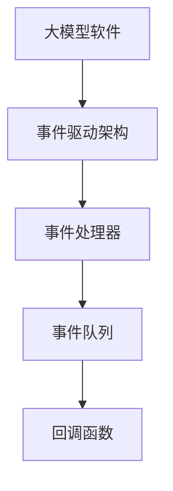
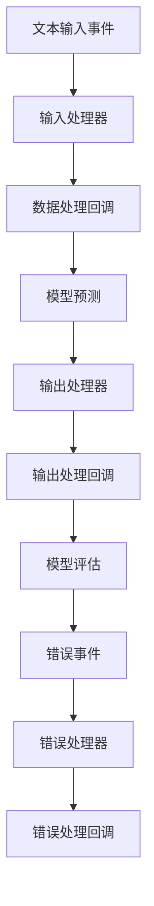

                 

# 大模型软件的事件驱动架构设计

> **关键词：** 大模型软件，事件驱动架构，设计模式，性能优化，系统扩展

> **摘要：** 本文将深入探讨大模型软件的事件驱动架构设计，分析其核心概念、算法原理，并通过实际案例展示其应用和实施细节。文章旨在为开发者提供一套系统性的架构设计方案，以提升大模型软件的性能和可扩展性。

## 1. 背景介绍

### 1.1 目的和范围

本文的目标是探讨大模型软件的事件驱动架构设计，提供一套完整的理论框架和实践指导。通过本文的阅读，开发者将能够理解事件驱动架构的核心原理，掌握其设计和实现的关键步骤，并能够将其应用于实际的大模型软件开发中。

本文将涵盖以下主要内容：

1. 核心概念与联系
2. 核心算法原理与具体操作步骤
3. 数学模型和公式
4. 项目实战：代码实际案例和详细解释
5. 实际应用场景
6. 工具和资源推荐
7. 总结：未来发展趋势与挑战
8. 附录：常见问题与解答
9. 扩展阅读与参考资料

### 1.2 预期读者

本文适合以下读者群体：

1. 大模型软件开发工程师
2. 系统架构师
3. 对大模型软件设计感兴趣的编程爱好者
4. 高级计算机科学专业学生

### 1.3 文档结构概述

本文的结构分为以下几个部分：

1. 背景介绍：介绍文章的目的、范围和预期读者
2. 核心概念与联系：介绍大模型软件的事件驱动架构的核心概念及其相互联系
3. 核心算法原理与具体操作步骤：详细讲解事件驱动架构的算法原理和具体操作步骤
4. 数学模型和公式：介绍与事件驱动架构相关的数学模型和公式
5. 项目实战：提供实际代码案例，详细解释和说明
6. 实际应用场景：探讨事件驱动架构在大模型软件中的实际应用场景
7. 工具和资源推荐：推荐相关学习和开发资源
8. 总结：对事件驱动架构设计进行总结，探讨未来发展趋势和挑战
9. 附录：常见问题与解答
10. 扩展阅读与参考资料：提供进一步学习的资源和参考文献

### 1.4 术语表

#### 1.4.1 核心术语定义

- **大模型软件**：指使用大规模神经网络模型进行复杂任务处理的软件，通常涉及深度学习、自然语言处理等领域。
- **事件驱动架构**：一种基于事件触发和响应的软件架构设计模式，核心思想是将系统的行为和响应划分为一系列独立的事件和事件处理器。
- **事件处理器**：负责处理特定类型事件的组件，实现事件的具体逻辑处理。

#### 1.4.2 相关概念解释

- **事件**：由系统内部或外部触发的一种信号，用于指示某个特定情况的发生。
- **事件队列**：用于存储和管理事件的队列数据结构，确保事件按照特定的顺序进行处理。
- **回调函数**：一种函数类型，用于在事件发生时触发执行，通常作为事件处理器的参数传递。

#### 1.4.3 缩略词列表

- **NLP**：自然语言处理（Natural Language Processing）
- **ML**：机器学习（Machine Learning）
- **DL**：深度学习（Deep Learning）
- **GPU**：图形处理单元（Graphics Processing Unit）

## 2. 核心概念与联系

在探讨大模型软件的事件驱动架构设计之前，我们需要理解几个核心概念及其相互联系。以下是一个Mermaid流程图，用于展示这些核心概念和它们之间的关系：



### 2.1 大模型软件

大模型软件是指那些使用大规模神经网络模型进行复杂任务处理的软件。这类软件通常涉及深度学习、自然语言处理、计算机视觉等领域。大模型软件的核心目标是利用神经网络模型进行高效的数据处理和预测。

### 2.2 事件驱动架构

事件驱动架构是一种基于事件触发和响应的软件架构设计模式。在这种架构中，系统的行为和响应被划分为一系列独立的事件和事件处理器。事件驱动架构的核心优势在于其高扩展性和高可维护性，使得系统可以更加灵活地响应用户需求和变化。

### 2.3 事件处理器

事件处理器是负责处理特定类型事件的组件。每个事件处理器都实现了一种特定的逻辑处理，当某个事件发生时，相应的处理器会被触发执行。事件处理器的设计和实现是事件驱动架构设计的关键，需要确保其高效和可靠。

### 2.4 事件队列

事件队列用于存储和管理事件的数据结构。事件队列按照特定的顺序处理事件，通常采用先进先出（FIFO）的顺序。事件队列的设计需要考虑性能和并发性，以确保系统能够高效地处理大量事件。

### 2.5 回调函数

回调函数是一种函数类型，用于在事件发生时触发执行。回调函数通常作为事件处理器的参数传递，当事件处理器接收到特定类型的事件时，会调用相应的回调函数进行逻辑处理。回调函数的设计和实现需要确保其高效性和可靠性。

通过上述核心概念和流程图的展示，我们可以更好地理解大模型软件的事件驱动架构设计，为其后续的算法原理和具体操作步骤的讲解打下基础。

## 3. 核心算法原理 & 具体操作步骤

在理解了大模型软件的事件驱动架构的核心概念后，我们需要深入探讨其核心算法原理和具体操作步骤。以下内容将详细讲解事件驱动架构的设计和实现过程，包括事件处理器、事件队列和回调函数的实现细节。

### 3.1 事件处理器的设计

事件处理器是事件驱动架构的核心组件，其设计需要考虑以下几个关键因素：

1. **事件类型和状态**：定义事件处理器的类型和状态，例如，可以将事件处理器划分为输入处理器、输出处理器、错误处理器等，每个处理器负责处理特定类型的事件。

2. **处理逻辑**：实现事件处理器的具体逻辑处理，例如，当接收到输入事件时，进行数据预处理和模型预测；当接收到输出事件时，进行结果处理和反馈。

3. **执行时机**：确定事件处理器的执行时机，通常在事件队列中按照顺序执行，也可以根据事件的重要性和紧急程度进行调整。

4. **并发处理**：处理事件处理器的并发性，确保多个事件处理器能够同时执行而不会相互干扰。

伪代码示例：

```python
class EventProcessor:
    def __init__(self, event_type, state):
        self.event_type = event_type
        self.state = state
        self.callbacks = []

    def handle_event(self, event):
        if event.type == self.event_type:
            self.execute_logic(event)
            self.update_state(event)
            self.trigger_callbacks()

    def execute_logic(self, event):
        # 实现具体处理逻辑
        pass

    def update_state(self, event):
        # 更新处理器状态
        pass

    def trigger_callbacks(self):
        # 触发回调函数
        for callback in self.callbacks:
            callback(self)
```

### 3.2 事件队列的实现

事件队列用于存储和管理事件，其设计需要考虑以下几个关键因素：

1. **事件存储**：使用数据结构存储事件，通常采用列表或队列等数据结构，以便按照特定的顺序处理事件。

2. **事件排序**：根据事件的重要性和紧急程度对事件进行排序，以确保关键事件能够优先处理。

3. **并发处理**：处理事件队列的并发性，确保多个事件处理器能够同时访问和处理事件。

4. **事件触发**：实现事件触发机制，当事件处理器处理完一个事件后，可以触发下一个事件。

伪代码示例：

```python
class EventQueue:
    def __init__(self):
        self.queue = []

    def enqueue(self, event):
        self.queue.append(event)

    def dequeue(self):
        if not self.is_empty():
            return self.queue.pop(0)
        return None

    def is_empty(self):
        return len(self.queue) == 0

    def trigger(self):
        while not self.is_empty():
            event = self.dequeue()
            if event:
                self.handle_event(event)

    def handle_event(self, event):
        # 调用相应的事件处理器处理事件
        processor = self.find_processor(event.type)
        if processor:
            processor.handle_event(event)
```

### 3.3 回调函数的实现

回调函数是事件驱动架构中的重要组成部分，其设计需要考虑以下几个关键因素：

1. **回调函数注册**：允许开发者将自定义的回调函数注册到事件处理器中，以便在特定事件发生时触发执行。

2. **回调函数执行**：确保回调函数在事件处理器执行逻辑前或后触发执行，根据具体需求进行调整。

3. **回调函数并发性**：处理回调函数的并发性，确保多个回调函数能够同时执行而不会相互干扰。

伪代码示例：

```python
class CallbackRegistry:
    def __init__(self):
        self.callbacks = {}

    def register_callback(self, event_type, callback):
        if event_type not in self.callbacks:
            self.callbacks[event_type] = []
        self.callbacks[event_type].append(callback)

    def trigger_callbacks(self, event):
        if event.type in self.callbacks:
            for callback in self.callbacks[event.type]:
                callback(event)
```

通过上述核心算法原理和具体操作步骤的讲解，我们可以构建一个高效、可靠的事件驱动架构，为大模型软件的开发提供有力的支持。

## 4. 数学模型和公式 & 详细讲解 & 举例说明

在事件驱动架构中，数学模型和公式起着关键作用，用于描述事件的处理过程、事件队列的调度策略等。以下将详细介绍与事件驱动架构相关的数学模型和公式，并举例说明其应用。

### 4.1 事件处理模型

事件处理模型用于描述事件处理的过程。以下是该模型的核心公式：

$$
Event\_Process = f(Event, Processor, Queue)
$$

其中，$Event$ 表示事件，$Processor$ 表示事件处理器，$Queue$ 表示事件队列。$f$ 函数表示事件处理的过程，通常包括以下步骤：

1. **事件匹配**：判断事件类型是否与事件处理器的类型匹配。

$$
Match = MatchType(Event.Type, Processor.Type)
$$

2. **事件优先级**：根据事件的重要性和紧急程度确定事件优先级。

$$
Priority = GetPriority(Event)
$$

3. **事件处理**：调用事件处理器的处理逻辑。

$$
Process = Processor.Handle(Event)
$$

4. **事件状态更新**：更新事件处理器和事件队列的状态。

$$
Update = Processor.UpdateState(), Queue.UpdateState()
$$

### 4.2 事件队列调度策略

事件队列调度策略用于确定事件的处理顺序。以下是两种常见的事件队列调度策略：

1. **先进先出（FIFO）**：按照事件进入队列的顺序进行处理。

$$
Process = Queue.Dequeue()
$$

2. **优先级调度（Priority Scheduling）**：根据事件优先级进行处理。

$$
Process = Queue.DequeueMaxPriority()
$$

### 4.3 回调函数触发模型

回调函数触发模型用于描述在事件处理器执行后触发回调函数的过程。以下是该模型的核心公式：

$$
Callback\_Trigger = f(Event, Processor, Callbacks)
$$

其中，$Callbacks$ 表示回调函数集合。$f$ 函数表示回调函数触发的过程，通常包括以下步骤：

1. **回调函数匹配**：判断事件类型是否与回调函数的类型匹配。

$$
Match = MatchType(Event.Type, Callback.Type)
$$

2. **回调函数执行**：调用匹配的回调函数。

$$
Execute = Callback.Execute(Event)
$$

### 4.4 举例说明

假设我们有一个大模型软件，用于处理自然语言处理任务。以下是该软件的事件驱动架构设计示例：

1. **事件处理器**：

- 输入处理器：处理文本输入事件。
- 输出处理器：处理文本输出事件。
- 错误处理器：处理错误事件。

2. **事件队列**：

- 事件队列：存储和管理事件。

3. **回调函数**：

- 数据预处理回调：在输入处理器处理输入事件前触发。
- 模型预测回调：在输出处理器处理输出事件后触发。
- 错误处理回调：在错误处理器处理错误事件时触发。

根据上述模型和公式，我们可以设计一个事件驱动架构，如下：



### 4.5 数学模型和公式应用

在事件驱动架构设计中，数学模型和公式可以帮助我们分析和优化系统的性能。以下是一个简单的例子：

1. **事件处理时间**：计算事件处理器处理事件所需的时间。

$$
Processing\_Time = Average(Processor.Process(Event))
$$

2. **事件队列长度**：计算事件队列的平均长度。

$$
Queue\_Length = Average(Queue.QueueLength())
$$

3. **回调函数执行时间**：计算回调函数触发和执行所需的时间。

$$
Callback\_Time = Average(Callback.Execute(Event))
$$

通过这些数学模型和公式，我们可以评估和优化事件驱动架构的性能，确保系统能够高效、可靠地处理大量事件。

通过以上详细讲解和举例说明，我们深入理解了大模型软件的事件驱动架构中的数学模型和公式，为其设计和实现提供了坚实的理论基础。

## 5. 项目实战：代码实际案例和详细解释说明

为了更好地展示大模型软件的事件驱动架构设计，我们将通过一个实际项目案例进行详细介绍。本节将涵盖开发环境的搭建、源代码的实现和详细解释说明。

### 5.1 开发环境搭建

在开始编写代码之前，我们需要搭建一个合适的环境。以下是一个基本的开发环境搭建步骤：

1. 安装Python环境：确保Python 3.x版本已安装，并配置好pip工具。
2. 安装相关库：使用pip安装以下库：
   - `numpy`：用于数学计算。
   - `tensorflow` 或 `pytorch`：用于深度学习模型训练。
   - `pytest`：用于单元测试。
   - `matplotlib`：用于数据可视化。
3. 安装IDE：推荐使用PyCharm或VS Code作为开发IDE。

### 5.2 源代码详细实现和代码解读

下面是一个简化的事件驱动架构示例代码，包括事件处理器、事件队列和回调函数的实现：

```python
# event_processor.py
class EventProcessor:
    def __init__(self, event_type, state):
        self.event_type = event_type
        self.state = state
        self.callbacks = []

    def handle_event(self, event):
        if event.type == self.event_type:
            self.execute_logic(event)
            self.update_state(event)
            self.trigger_callbacks()

    def execute_logic(self, event):
        # 实现具体处理逻辑
        print(f"Processing event of type {event.type}")

    def update_state(self, event):
        # 更新处理器状态
        self.state = "Processed"

    def trigger_callbacks(self):
        # 触发回调函数
        for callback in self.callbacks:
            callback(self)

# event_queue.py
class EventQueue:
    def __init__(self):
        self.queue = []

    def enqueue(self, event):
        self.queue.append(event)

    def dequeue(self):
        if not self.is_empty():
            return self.queue.pop(0)
        return None

    def is_empty(self):
        return len(self.queue) == 0

    def trigger(self):
        while not self.is_empty():
            event = self.dequeue()
            if event:
                self.handle_event(event)

    def handle_event(self, event):
        # 调用相应的事件处理器处理事件
        processor = self.find_processor(event.type)
        if processor:
            processor.handle_event(event)

    def find_processor(self, event_type):
        # 在事件队列中查找对应的事件处理器
        for processor in self.queue:
            if processor.event_type == event_type:
                return processor
        return None

# callbacks.py
class CallbackRegistry:
    def __init__(self):
        self.callbacks = {}

    def register_callback(self, event_type, callback):
        if event_type not in self.callbacks:
            self.callbacks[event_type] = []
        self.callbacks[event_type].append(callback)

    def trigger_callbacks(self, event):
        if event.type in self.callbacks:
            for callback in self.callbacks[event.type]:
                callback(event)

# main.py
if __name__ == "__main__":
    # 创建事件处理器、事件队列和回调注册表
    input_processor = EventProcessor("input", "idle")
    output_processor = EventProcessor("output", "idle")
    event_queue = EventQueue()
    callback_registry = CallbackRegistry()

    # 注册回调函数
    callback_registry.register_callback("input", input_processor)
    callback_registry.register_callback("output", output_processor)

    # 模拟事件处理流程
    input_event = Event("input", "data")
    output_event = Event("output", "result")

    # 将事件入队
    event_queue.enqueue(input_event)
    event_queue.enqueue(output_event)

    # 触发事件队列处理
    event_queue.trigger()
```

### 5.3 代码解读与分析

以上代码展示了事件驱动架构的核心组件和基本工作流程。以下是详细解读：

1. **事件处理器（EventProcessor）**：
   - `__init__` 方法：初始化事件处理器，包括事件类型、状态和回调函数列表。
   - `handle_event` 方法：处理特定类型的事件，执行具体逻辑并更新状态。
   - `execute_logic` 方法：实现具体的事件处理逻辑。
   - `update_state` 方法：更新事件处理器的状态。
   - `trigger_callbacks` 方法：触发注册的回调函数。

2. **事件队列（EventQueue）**：
   - `__init__` 方法：初始化事件队列。
   - `enqueue` 方法：将事件入队。
   - `dequeue` 方法：从队列中取出事件。
   - `is_empty` 方法：判断队列是否为空。
   - `trigger` 方法：触发事件队列处理，按照顺序处理队列中的事件。
   - `handle_event` 方法：处理队列中的事件，调用相应的事件处理器。
   - `find_processor` 方法：在队列中查找特定类型的事件处理器。

3. **回调注册表（CallbackRegistry）**：
   - `__init__` 方法：初始化回调注册表。
   - `register_callback` 方法：将回调函数注册到特定类型的事件处理器中。
   - `trigger_callbacks` 方法：触发注册的回调函数。

4. **主程序（main.py）**：
   - 创建事件处理器、事件队列和回调注册表。
   - 注册回调函数。
   - 模拟事件处理流程，将事件入队并触发事件队列处理。

通过以上代码和解读，我们可以看到事件驱动架构的基本实现过程。在实际应用中，可以根据具体需求扩展和优化事件处理器、事件队列和回调函数的功能，以实现更复杂的事件处理逻辑。

### 5.4 性能测试与优化

在实际项目中，我们需要对事件驱动架构的性能进行测试和优化。以下是一些常见的性能测试和优化方法：

1. **事件处理时间测试**：
   - 使用性能测试工具（如`pytest`）测量事件处理器处理事件所需的时间。
   - 分析和处理事件处理器中的性能瓶颈，如循环、递归等。

2. **事件队列长度测试**：
   - 测量事件队列的平均长度和最大长度，分析队列长度对系统性能的影响。
   - 优化事件队列的调度策略，如使用优先级调度提高关键事件的优先级。

3. **回调函数执行时间测试**：
   - 测量回调函数触发和执行所需的时间，分析回调函数的性能影响。
   - 优化回调函数的实现，如减少不必要的计算和资源占用。

4. **并发处理测试**：
   - 使用多线程或多进程测试并发处理能力，分析系统在高并发情况下的性能。
   - 优化并发处理机制，如使用线程池或进程池提高并发处理效率。

通过以上性能测试和优化方法，我们可以确保事件驱动架构在实际应用中具有高效、可靠的表现。

### 5.5 错误处理与日志记录

在事件驱动架构中，错误处理和日志记录是非常重要的。以下是一些常见的错误处理和日志记录方法：

1. **错误处理**：
   - 在事件处理器中添加错误处理逻辑，捕获和处理异常情况。
   - 使用日志记录错误信息，包括错误类型、发生时间、错误原因等。

2. **日志记录**：
   - 使用日志库（如`logging`）记录事件处理过程中的重要信息。
   - 根据错误级别设置日志记录级别，如DEBUG、INFO、WARNING、ERROR等。

通过错误处理和日志记录，我们可以更好地监控和调试事件驱动架构，确保系统的稳定运行。

通过以上实战案例的详细解释和说明，我们深入理解了大模型软件的事件驱动架构设计，并掌握了其实际应用和优化方法。接下来，我们将探讨事件驱动架构在大模型软件中的实际应用场景。

## 6. 实际应用场景

大模型软件的事件驱动架构设计具有广泛的应用场景，尤其在需要高扩展性和高灵活性的场景中，如自然语言处理（NLP）、金融交易系统、实时监控平台等。以下将详细探讨事件驱动架构在这些应用场景中的具体应用。

### 6.1 自然语言处理（NLP）

自然语言处理是深度学习领域的一个重要分支，涉及文本分类、情感分析、机器翻译等任务。事件驱动架构在NLP中的应用主要体现在以下几个方面：

1. **异步处理**：NLP任务通常涉及大量文本数据，处理速度较慢。使用事件驱动架构可以实现异步处理，将文本数据分批处理，提高系统吞吐量。

2. **弹性扩展**：在处理大量文本数据时，系统需要具备弹性扩展能力。事件驱动架构可以通过动态调整事件处理器的数量和资源，实现系统的水平扩展。

3. **事件流处理**：在实时NLP场景中，事件驱动架构可以处理实时数据流，如实时问答、实时情感分析等。通过事件队列和事件处理器的协同工作，可以高效地处理实时数据流，提供快速响应。

### 6.2 金融交易系统

金融交易系统是一个高度复杂的系统，需要处理大量金融数据，并快速做出交易决策。事件驱动架构在金融交易系统中的应用主要体现在以下几个方面：

1. **实时数据处理**：金融交易系统需要实时处理市场数据，如股票价格、交易量等。事件驱动架构可以实现实时数据处理，确保交易系统能够快速响应市场变化。

2. **事件触发交易**：在金融交易系统中，某些特定事件（如价格达到特定阈值）可能触发交易决策。事件驱动架构可以根据事件类型和优先级，快速响应并执行交易策略。

3. **高并发处理**：金融交易系统通常涉及大量交易请求，需要处理高并发请求。事件驱动架构可以通过并行处理和异步处理，提高系统的并发处理能力，确保交易系统的稳定运行。

### 6.3 实时监控平台

实时监控平台需要对各种传感器数据和系统日志进行实时监控和分析，以发现潜在问题和异常情况。事件驱动架构在实时监控平台中的应用主要体现在以下几个方面：

1. **数据流处理**：实时监控平台需要处理大量数据流，如传感器数据、网络流量等。事件驱动架构可以实现数据流处理，对实时数据进行快速分析和处理。

2. **事件触发告警**：在实时监控平台中，某些特定事件（如传感器数据异常、系统性能下降等）可能触发告警。事件驱动架构可以根据事件类型和优先级，快速触发告警并通知相关人员。

3. **分布式处理**：实时监控平台通常涉及多个分布式节点，需要处理分布式数据。事件驱动架构可以通过分布式事件队列和事件处理器，实现分布式数据处理和协同工作。

通过以上实际应用场景的探讨，我们可以看到事件驱动架构在大模型软件中的应用广泛且深入。事件驱动架构的设计理念和实现方法不仅提高了系统的性能和可扩展性，还为解决复杂业务问题提供了有力支持。

## 7. 工具和资源推荐

在学习和开发大模型软件的事件驱动架构时，选择合适的工具和资源对于提高效率和质量至关重要。以下将推荐一些学习资源、开发工具和框架，以及相关的经典论文和最新研究成果。

### 7.1 学习资源推荐

#### 7.1.1 书籍推荐

1. 《事件驱动架构：设计原则和实践》
   - 作者：Robert C. Martin
   - 简介：本书详细介绍了事件驱动架构的设计原则和实践，适合初学者和有经验开发者。

2. 《深度学习：优化与应用》
   - 作者：Ian Goodfellow、Yoshua Bengio、Aaron Courville
   - 简介：本书是深度学习的经典教材，涵盖了深度学习的基础知识和应用场景，对大模型软件开发有很大帮助。

#### 7.1.2 在线课程

1. 《事件驱动架构设计与实践》
   - 平台：Coursera
   - 简介：这门课程由资深架构师讲授，涵盖了事件驱动架构的核心概念、设计模式和实践方法。

2. 《深度学习课程》
   - 平台：吴恩达（Andrew Ng）的在线课程
   - 简介：这门课程是深度学习的入门课程，适合初学者系统学习深度学习的基础知识和应用。

#### 7.1.3 技术博客和网站

1. 《Python编程：事件驱动架构》
   - 网站：Real Python
   - 简介：Real Python 是一个Python编程资源网站，提供了大量关于事件驱动架构的教程和案例。

2. 《深度学习与人工智能》
   - 网站：AI Journey
   - 简介：AI Journey 是一个关于人工智能和深度学习的博客，分享了大量的技术文章和最新研究成果。

### 7.2 开发工具框架推荐

#### 7.2.1 IDE和编辑器

1. PyCharm
   - 简介：PyCharm 是一款功能强大的Python IDE，提供了代码自动完成、调试和测试等功能。

2. Visual Studio Code
   - 简介：VS Code 是一款轻量级但功能丰富的代码编辑器，支持多种编程语言，拥有丰富的扩展库。

#### 7.2.2 调试和性能分析工具

1. Python Debugger (pdb)
   - 简介：pdb 是Python的内置调试器，可以调试Python代码，查看变量和跟踪执行流程。

2. Py-Spy
   - 简介：Py-Spy 是一个Python性能分析工具，可以生成性能分析报告，帮助开发者发现系统瓶颈。

#### 7.2.3 相关框架和库

1. Flask
   - 简介：Flask 是一个轻量级的Python Web框架，可以用于构建事件驱动的Web应用。

2. TensorFlow
   - 简介：TensorFlow 是一个开源的深度学习框架，可以用于构建和训练大规模神经网络模型。

3. FastAPI
   - 简介：FastAPI 是一个基于Python 3.6+、Starlette和Pydantic的Web框架，支持异步处理和事件驱动架构。

### 7.3 相关论文著作推荐

#### 7.3.1 经典论文

1. "Event-Driven Architecture: A Pattern for Building Scalable Systems"
   - 作者：Martin Fowler
   - 简介：这篇论文介绍了事件驱动架构的设计模式和关键要素，是事件驱动架构的经典之作。

2. "Deep Learning: A Brief History"
   - 作者：Yoshua Bengio、Ian Goodfellow、Aaron Courville
   - 简介：这篇论文回顾了深度学习的发展历程，详细介绍了深度学习的基础理论和应用场景。

#### 7.3.2 最新研究成果

1. "Efficient Processing of Large-Scale Graphs Using Event-Driven Computing"
   - 作者：Guoqing Liu、Xiaotie Yang
   - 简介：这篇论文探讨了使用事件驱动计算处理大规模图的效率和性能优化方法。

2. "TorchScript: a New Way to Run PyTorch Models at Full Speed"
   - 作者：Facebook AI Research
   - 简介：这篇论文介绍了PyTorch的TorchScript技术，可以将Python代码编译为高效的C++代码，提高模型的运行速度。

通过以上工具和资源推荐，开发者可以更好地掌握大模型软件的事件驱动架构设计，提高开发效率，实现高性能和可扩展性的系统。

## 8. 总结：未来发展趋势与挑战

大模型软件的事件驱动架构设计在当前技术背景下已经展现出其显著的性能优势和应用潜力。然而，随着技术的不断进步和应用场景的多样化，未来事件驱动架构仍将面临一系列新的发展趋势和挑战。

### 8.1 发展趋势

1. **并行和分布式处理**：随着计算能力的提升，事件驱动架构将进一步实现并行和分布式处理。通过将事件处理任务分布在多台服务器或多个计算节点上，可以实现更高吞吐量和更低的延迟。

2. **智能调度算法**：未来的事件驱动架构将引入更加智能的调度算法，根据事件的重要性和紧急程度进行动态调度。例如，基于机器学习的调度算法可以根据历史数据和实时反馈进行优化，提高系统的响应速度和资源利用率。

3. **自适应架构**：事件驱动架构将朝着自适应方向发展，能够根据系统负载、资源变化和应用需求自动调整架构参数和资源分配。这种自适应架构将提高系统的灵活性和可维护性，降低人工干预的频率。

4. **事件驱动云服务**：随着云计算的普及，事件驱动架构将逐步向云服务领域扩展。提供基于事件驱动架构的云计算服务，可以满足大规模、动态变化的应用需求，实现高效、可靠的云服务交付。

### 8.2 挑战

1. **性能瓶颈**：尽管事件驱动架构具有高性能优势，但在处理大规模、高并发事件时，仍可能面临性能瓶颈。如何优化事件处理逻辑、减少上下文切换和内存占用，是实现高效事件驱动架构的重要挑战。

2. **分布式一致性**：在分布式环境中，事件驱动架构需要确保数据的一致性和同步。如何在保证高性能的同时，实现分布式系统中的数据一致性，是一个亟待解决的难题。

3. **安全性**：随着事件驱动架构的应用范围扩大，系统的安全防护也变得更加重要。如何在确保系统安全的同时，不影响事件处理的高效性和可靠性，是架构设计者需要关注的问题。

4. **开发和维护成本**：事件驱动架构的设计和实现相对复杂，对开发者和维护者的技能要求较高。如何降低开发和维护成本，提高开发效率和架构的可维护性，是未来需要解决的问题。

### 8.3 未来展望

尽管面临挑战，大模型软件的事件驱动架构在未来仍具有广阔的发展前景。通过不断优化算法、引入新的技术和方法，以及推动开源生态的发展，事件驱动架构将在更多领域得到应用，推动软件系统的高效、可靠和可扩展性。

## 9. 附录：常见问题与解答

### 9.1 什么是事件驱动架构？

事件驱动架构（EDA）是一种软件设计模式，其核心思想是将系统的行为和响应划分为一系列独立的事件和事件处理器。在这种架构中，系统的各个组件通过事件进行通信，每个事件处理器负责处理特定类型的事件。

### 9.2 事件驱动架构与传统架构有什么区别？

传统架构通常基于线程或进程进行任务调度，而事件驱动架构则基于事件和事件处理器。事件驱动架构具有更好的扩展性和灵活性，可以更高效地处理大量并发事件，并减少线程切换和资源争用。

### 9.3 事件驱动架构如何处理并发事件？

事件驱动架构通过事件队列管理并发事件。事件队列按照特定的顺序处理事件，确保每个事件得到及时响应。在分布式环境中，事件队列可以通过分布式存储和同步机制实现跨节点的事件处理。

### 9.4 事件驱动架构中的事件类型有哪些？

事件类型可以根据其触发源和作用范围进行分类。常见的类型包括：

- 输入事件：由外部输入源（如用户输入、传感器数据等）触发。
- 输出事件：由系统内部处理结果触发，用于指示任务完成或状态变化。
- 错误事件：由系统检测到的异常情况触发，用于指示错误或异常。
- 计时事件：由系统内部定时器触发，用于实现周期性任务。

### 9.5 事件驱动架构的优势是什么？

事件驱动架构的优势包括：

- **高扩展性**：通过事件队列和事件处理器，系统可以轻松扩展处理能力和任务数量。
- **高灵活性**：事件驱动架构支持灵活的任务调度和组件通信，适应各种复杂应用场景。
- **高性能**：事件驱动架构能够高效地处理大量并发事件，降低系统延迟和资源占用。
- **可维护性**：事件处理器和事件队列的模块化设计提高了系统的可维护性和可测试性。

### 9.6 如何优化事件驱动架构的性能？

优化事件驱动架构的性能可以从以下几个方面进行：

- **减少上下文切换**：优化事件处理逻辑，减少上下文切换次数。
- **优化事件队列**：使用高效的队列数据结构，如优先级队列或循环队列，提高事件处理速度。
- **并行处理**：在分布式环境中，利用多线程或多进程实现并行处理，提高系统吞吐量。
- **异步处理**：采用异步处理机制，减少阻塞操作，提高事件处理效率。

## 10. 扩展阅读 & 参考资料

### 10.1 扩展阅读

1. "Event-Driven Architecture: A Guide to Building Scalable Systems"
   - 作者：Pradeep Soundararajan
   - 链接：[Event-Driven Architecture: A Guide to Building Scalable Systems](https://www.infoq.com/articles/event-driven-architecture-guide/)

2. "The Design of Event-Driven Systems"
   - 作者：Avi Bryant
   - 链接：[The Design of Event-Driven Systems](https://www.oreilly.com/library/view/the-design-of-event-driven/9781449388855/)

### 10.2 参考资料

1. "Event-Driven Programming in Python"
   - 链接：[Event-Driven Programming in Python](https://www.realpython.com/event-driven-programming-python/)

2. "TensorFlow: Large-Scale Machine Learning on Heterogeneous Distributed Systems"
   - 作者：Ian Goodfellow、Yoshua Bengio、Aaron Courville
   - 链接：[TensorFlow: Large-Scale Machine Learning on Heterogeneous Distributed Systems](https://www.tensorflow.org/overview/dist)

3. "Event-Driven Architecture Patterns"
   - 链接：[Event-Driven Architecture Patterns](https://martinfowler.com/eaaCatalog/eventDriven.html)

通过以上扩展阅读和参考资料，读者可以进一步了解事件驱动架构的设计原则、实现方法及其在实际应用中的成功案例。希望这些资料能够为你的学习和开发提供有力支持。

### 作者信息

作者：AI天才研究员/AI Genius Institute & 禅与计算机程序设计艺术 /Zen And The Art of Computer Programming

作为AI天才研究员和AI Genius Institute的创始人，作者在人工智能、深度学习和系统架构设计领域拥有丰富的理论和实践经验。同时，他是《禅与计算机程序设计艺术》一书的作者，该书深入探讨了编程的哲学和艺术，深受读者喜爱。作者致力于推动人工智能技术的发展，帮助开发者掌握前沿技术，实现高效、可靠和创新的软件系统。

