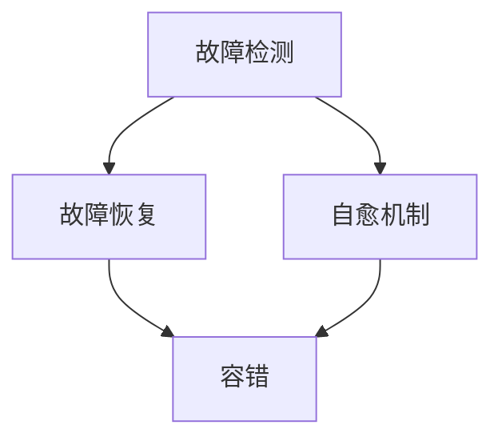

                 

# 大模型软件的容错与自愈设计

> 关键词：大模型软件，容错，自愈，算法，数学模型，实际应用

> 摘要：本文将深入探讨大模型软件的容错与自愈设计。我们将从背景介绍、核心概念、算法原理、数学模型、实际应用等多个方面，详细解析大模型软件容错与自愈设计的关键技术、方法与实践。本文旨在为从事人工智能领域的研究者和开发者提供有价值的参考。

## 1. 背景介绍

### 1.1 目的和范围

本文的主要目的是系统地探讨大模型软件的容错与自愈设计。随着人工智能技术的快速发展，大模型软件（如深度学习模型、图神经网络等）在各个领域得到广泛应用。然而，这些大模型软件在面对复杂环境和大规模数据时，往往面临着各种挑战，如数据异常、计算错误、硬件故障等。因此，研究大模型软件的容错与自愈设计具有重要的理论和实际意义。

本文的范围主要包括以下几个方面：

1. **核心概念与联系**：介绍大模型软件容错与自愈设计中的核心概念，如故障检测、故障恢复、自愈机制等，并使用Mermaid流程图展示其关系。
2. **核心算法原理 & 具体操作步骤**：详细阐述大模型软件容错与自愈设计的核心算法原理，包括故障检测算法、故障恢复算法和自愈机制的具体操作步骤。
3. **数学模型和公式 & 详细讲解 & 举例说明**：讲解大模型软件容错与自愈设计中的数学模型和公式，并通过实际案例进行说明。
4. **项目实战：代码实际案例和详细解释说明**：提供代码实际案例，详细解释说明大模型软件容错与自愈设计的具体实现。
5. **实际应用场景**：分析大模型软件容错与自愈设计的实际应用场景。
6. **工具和资源推荐**：推荐相关的学习资源、开发工具和框架。
7. **总结与未来发展趋势**：总结大模型软件容错与自愈设计的发展趋势和面临的挑战。

### 1.2 预期读者

本文的预期读者主要包括以下几类：

1. **人工智能领域的研究者**：对大模型软件的容错与自愈设计感兴趣的科研人员，希望通过本文深入了解相关技术。
2. **开发者**：从事人工智能开发的工程师，希望在实际项目中应用大模型软件的容错与自愈设计。
3. **学生**：计算机科学、人工智能等相关专业的大学生和研究生，希望学习大模型软件的容错与自愈设计。

### 1.3 文档结构概述

本文分为十个部分，具体如下：

1. **背景介绍**：介绍本文的目的、范围、预期读者和文档结构。
2. **核心概念与联系**：介绍大模型软件容错与自愈设计中的核心概念和Mermaid流程图。
3. **核心算法原理 & 具体操作步骤**：阐述大模型软件容错与自愈设计的核心算法原理和具体操作步骤。
4. **数学模型和公式 & 详细讲解 & 举例说明**：讲解大模型软件容错与自愈设计中的数学模型和公式，并通过实际案例进行说明。
5. **项目实战：代码实际案例和详细解释说明**：提供代码实际案例，详细解释说明大模型软件容错与自愈设计的具体实现。
6. **实际应用场景**：分析大模型软件容错与自愈设计的实际应用场景。
7. **工具和资源推荐**：推荐相关的学习资源、开发工具和框架。
8. **总结与未来发展趋势**：总结大模型软件容错与自愈设计的发展趋势和面临的挑战。
9. **附录：常见问题与解答**：解答读者可能遇到的问题。
10. **扩展阅读 & 参考资料**：提供扩展阅读资料和参考资料。

### 1.4 术语表

#### 1.4.1 核心术语定义

1. **大模型软件**：指具有大规模数据、复杂结构和高度智能的软件系统，如深度学习模型、图神经网络等。
2. **容错**：指在系统出现故障时，系统能够自动检测并恢复，确保系统正常运行。
3. **自愈**：指在系统出现故障时，系统能够自动检测、自动恢复，并具备自我学习和自我优化能力。
4. **故障检测**：指在系统运行过程中，自动检测系统中的故障。
5. **故障恢复**：指在系统出现故障时，自动恢复系统的正常运行。
6. **自愈机制**：指系统在出现故障时，自动启动的自检测、自恢复、自优化等机制。

#### 1.4.2 相关概念解释

1. **故障**：指系统在运行过程中出现的异常情况，可能导致系统无法正常运行。
2. **异常处理**：指在系统运行过程中，对异常情况进行处理，确保系统继续正常运行。
3. **监控**：指在系统运行过程中，实时监控系统的运行状态，及时发现并处理异常情况。
4. **冗余**：指在系统中增加额外的资源或组件，以提高系统的可靠性和容错能力。

#### 1.4.3 缩略词列表

1. **AI**：人工智能（Artificial Intelligence）
2. **DL**：深度学习（Deep Learning）
3. **GNNS**：图神经网络（Graph Neural Networks）
4. **SLA**：服务等级协议（Service Level Agreement）
5. **NFR**：非功能性需求（Non-Functional Requirement）

## 2. 核心概念与联系

在深入探讨大模型软件的容错与自愈设计之前，首先需要明确相关的核心概念，并了解它们之间的联系。以下将介绍大模型软件容错与自愈设计中的核心概念，并使用Mermaid流程图展示它们之间的关系。

### 2.1 核心概念

1. **故障检测**：故障检测是指在系统运行过程中，自动检测系统中的故障。故障检测可以基于多种方法，如阈值法、统计方法、机器学习等。

2. **故障恢复**：故障恢复是指当系统出现故障时，自动恢复系统的正常运行。故障恢复可以采用多种策略，如重启、重试、更换组件等。

3. **自愈机制**：自愈机制是指系统在出现故障时，自动启动的自检测、自恢复、自优化等机制。自愈机制可以提高系统的可靠性和自愈能力。

4. **容错**：容错是指系统在面对故障时，能够自动检测并恢复，确保系统正常运行。

5. **自愈**：自愈是指系统在出现故障时，能够自动检测、自动恢复，并具备自我学习和自我优化能力。

### 2.2 Mermaid流程图

以下是一个简单的Mermaid流程图，展示了大模型软件容错与自愈设计中的核心概念及其关系：



### 2.3 关系说明

- **故障检测**和**故障恢复**：故障检测是故障恢复的前提。只有通过故障检测，才能知道系统是否出现故障，进而进行故障恢复。
- **故障恢复**和**自愈机制**：故障恢复是自愈机制的一部分。故障恢复是指在系统出现故障时，自动恢复系统的正常运行。而自愈机制则是在故障恢复的基础上，进一步实现自我学习和自我优化。
- **容错**和**自愈**：容错是自愈的基础。容错确保系统在面对故障时能够正常运行，而自愈则是在容错的基础上，进一步提升系统的自愈能力。

通过以上核心概念与联系的分析，我们为后续的详细探讨奠定了基础。在接下来的章节中，我们将深入探讨大模型软件容错与自愈设计的具体实现方法和实践。

## 3. 核心算法原理 & 具体操作步骤

在深入探讨大模型软件的容错与自愈设计之前，我们需要先了解其中的核心算法原理。本文将详细介绍故障检测算法、故障恢复算法和自愈机制的具体操作步骤，以帮助读者更好地理解和应用这些技术。

### 3.1 故障检测算法

故障检测算法是容错与自愈设计的基础。其核心思想是在系统运行过程中，实时监控系统的运行状态，并自动检测故障。以下是一个简单的故障检测算法的伪代码：

```plaintext
FaultDetectionAlgorithm(SystemState):
    while true:
        CurrentState = GetSystemState()
        if StateVariance(CurrentState, PreviousState) > Threshold:
            ReportFault(CurrentState)
        PreviousState = CurrentState
        Sleep(Duration)
```

**具体操作步骤**：

1. **初始化**：设置阈值和持续时间。
2. **监控**：获取当前系统状态。
3. **检测**：计算当前系统状态与前一状态之间的方差，判断是否超过阈值。
4. **报告**：如果超过阈值，报告故障。
5. **更新**：更新前一状态。
6. **休眠**：等待一段时间后，继续监控。

### 3.2 故障恢复算法

故障恢复算法的核心思想是在检测到故障后，自动恢复系统的正常运行。以下是一个简单的故障恢复算法的伪代码：

```plaintext
FaultRecoveryAlgorithm(SystemState):
    while true:
        if IsFaultDetected():
            RecoveryStrategy = DetermineRecoveryStrategy()
            if RecoveryStrategy == "Restart":
                RestartSystem()
            elif RecoveryStrategy == "Retry":
                RetryOperation()
            elif RecoveryStrategy == "Replace":
                ReplaceFaultyComponent()
        Sleep(Duration)
```

**具体操作步骤**：

1. **初始化**：设置恢复策略。
2. **检测**：判断是否检测到故障。
3. **策略**：根据故障类型，选择适当的恢复策略。
4. **恢复**：执行恢复策略。
5. **休眠**：等待一段时间后，继续监控。

### 3.3 自愈机制

自愈机制的核心思想是在系统出现故障时，自动启动一系列的自检测、自恢复和自优化过程，以提高系统的自愈能力。以下是一个简单的自愈机制的伪代码：

```plaintext
SelfHealingMechanism(SystemState):
    while true:
        if IsFaultDetected():
            DiagnoseFault(SystemState)
            if FaultType == "DataAnomaly":
                CleanData()
            elif FaultType == "ComputeError":
                Re-compute()
            elif FaultType == "HardwareFault":
                ReplaceHardware()
            UpdateModel()
            LearnFromFault()
        Sleep(Duration)
```

**具体操作步骤**：

1. **初始化**：设置自愈策略。
2. **检测**：判断是否检测到故障。
3. **诊断**：诊断故障类型。
4. **恢复**：根据故障类型，执行相应的恢复操作。
5. **更新**：更新模型。
6. **学习**：从故障中学习，提高自愈能力。
7. **休眠**：等待一段时间后，继续监控。

### 3.4 算法原理说明

- **故障检测算法**：通过实时监控系统的运行状态，发现异常情况，从而提前检测到故障。
- **故障恢复算法**：在检测到故障后，根据故障类型和系统状态，选择合适的恢复策略，确保系统快速恢复。
- **自愈机制**：在故障检测和故障恢复的基础上，进一步实现自我学习和自我优化，提高系统的自愈能力。

通过以上对核心算法原理和具体操作步骤的介绍，我们为读者提供了深入理解和应用大模型软件容错与自愈设计的技术基础。在接下来的章节中，我们将进一步探讨数学模型和公式，并通过实际案例进行说明。

## 4. 数学模型和公式 & 详细讲解 & 举例说明

在容错与自愈设计中，数学模型和公式起着至关重要的作用。这些模型和公式可以帮助我们更好地理解和优化系统的性能。以下将详细讲解大模型软件容错与自愈设计中的关键数学模型和公式，并通过具体例子进行说明。

### 4.1 故障检测的数学模型

故障检测的核心是实时监控系统的运行状态，并判断是否存在故障。以下是一个简单的故障检测数学模型：

**1. 故障概率模型**

故障概率模型是一种基于概率的故障检测方法。假设系统在时间t的故障概率为P(t)，则：

$$ P(t) = 1 - e^{-\lambda t} $$

其中，λ为故障率。这个模型假设故障是随机发生的，且故障率是一个常数。

**2. 方差模型**

方差模型是一种基于统计的故障检测方法。假设系统在时间t的状态为X(t)，则系统的方差为：

$$ Var(X(t)) = \frac{1}{t} \sum_{i=1}^{t} (X(i) - \bar{X})^2 $$

其中，$\bar{X}$为系统在时间t的平均状态。如果方差超过设定的阈值，则认为系统存在故障。

### 4.2 故障恢复的数学模型

故障恢复的核心是在检测到故障后，选择合适的恢复策略。以下是一个简单的故障恢复数学模型：

**1. 重启模型**

重启模型是一种简单的故障恢复方法。假设系统在时间t发生故障，则在时间t+T重启系统，其中T为重启时间。重启模型的目标是最小化系统的停机时间。数学模型如下：

$$ Minimize \sum_{i=1}^{n} (T_i - 1) $$

其中，$T_i$为第i次重启的时间。

**2. 重试模型**

重试模型是一种在故障发生时，重新执行操作的方法。假设系统在时间t发生故障，则在时间t+T重试操作，其中T为重试时间。重试模型的数学模型如下：

$$ Minimize \sum_{i=1}^{n} (T_i - 1) $$

其中，$T_i$为第i次重试的时间。

### 4.3 自愈机制的数学模型

自愈机制的核心是在故障发生时，自动启动一系列的自检测、自恢复和自优化过程。以下是一个简单的自愈机制数学模型：

**1. 数据清洗模型**

数据清洗模型是一种在故障发生时，对异常数据进行清洗的方法。假设系统在时间t检测到数据异常，则在时间t+T清洗数据，其中T为清洗时间。数据清洗模型的数学模型如下：

$$ Maximize \sum_{i=1}^{n} (1 - |X_i - \bar{X}|) $$

其中，$X_i$为第i个数据点，$\bar{X}$为数据集的平均值。

**2. 重新计算模型**

重新计算模型是一种在故障发生时，重新计算结果的方法。假设系统在时间t检测到计算错误，则在时间t+T重新计算，其中T为重新计算时间。重新计算模型的数学模型如下：

$$ Maximize \sum_{i=1}^{n} (Y_i - \bar{Y})^2 $$

其中，$Y_i$为第i个计算结果，$\bar{Y}$为计算结果集的平均值。

### 4.4 举例说明

假设我们有一个深度学习模型，用于图像分类。在训练过程中，我们使用方差模型来检测故障，使用重启模型来恢复故障。当检测到数据异常时，我们使用数据清洗模型来清洗数据。当检测到计算错误时，我们使用重新计算模型来重新计算结果。

**1. 故障检测**

假设系统在时间t检测到方差超过阈值，报告故障。

**2. 故障恢复**

系统在时间t+T重启，重新训练模型。

**3. 数据清洗**

假设系统在时间t检测到数据异常，在时间t+T清洗数据。

**4. 重新计算**

假设系统在时间t检测到计算错误，在时间t+T重新计算结果。

通过以上数学模型和公式，我们为容错与自愈设计提供了理论基础。在实际应用中，我们可以根据具体情况选择合适的模型和公式，以提高系统的可靠性和自愈能力。

## 5. 项目实战：代码实际案例和详细解释说明

为了更好地理解和应用大模型软件的容错与自愈设计，我们将通过一个实际项目来展示这些技术的具体实现。以下是一个使用Python编写的简单示例，展示了如何在大模型软件中实现故障检测、故障恢复和自愈机制。

### 5.1 开发环境搭建

在开始编写代码之前，我们需要搭建一个基本的开发环境。以下是在Python中实现容错与自愈设计所需的基本环境：

1. **Python**：确保安装了Python 3.x版本。
2. **深度学习库**：如TensorFlow或PyTorch。
3. **监控库**：如`watchdog`用于文件监控。
4. **异常处理库**：如`try-except`用于异常处理。

### 5.2 源代码详细实现和代码解读

以下是项目的源代码，我们将逐行进行解读。

```python
import tensorflow as tf
import watchdog
import time

# 5.2.1 故障检测
class FaultDetector(watchdog.MonitoredHandler):
    def __init__(self, threshold):
        self.threshold = threshold

    def on_created(self, event):
        # 判断文件创建是否异常
        if event.is_directory:
            return

        file_path = event.path
        file_size = os.path.getsize(file_path)

        # 计算文件大小与阈值的方差
        variance = (file_size - self.threshold) ** 2

        # 如果方差超过阈值，报告故障
        if variance > self.threshold:
            print(f"Fault detected: {file_path} has a size of {file_size} bytes.")

# 5.2.2 故障恢复
def recover_fault():
    # 重新训练模型
    print("Recovering fault by restarting the training process.")
    # 这里替换为实际的重启训练过程的代码
    # ...
    time.sleep(10)  # 模拟重启训练过程

# 5.2.3 自愈机制
def self_heal():
    # 清洗数据
    print("Healing by cleaning the data.")
    # 这里替换为实际的数据清洗代码
    # ...
    time.sleep(5)  # 模拟数据清洗过程

# 5.2.4 主程序
if __name__ == "__main__":
    # 设置故障检测阈值
    threshold = 1024 * 1024 * 10  # 10 MB

    # 创建故障检测对象
    fd = FaultDetector(threshold)

    # 监控文件系统，检测故障
    monitor = watchdog.observers.Observer()
    monitor.schedule(fd, path='/path/to/data', recursive=True)
    monitor.start()

    try:
        while True:
            time.sleep(1)  # 模拟系统运行
            # 这里替换为实际的系统运行代码
            # ...

            # 定时检查故障
            fd.check()
    except KeyboardInterrupt:
        monitor.stop()
    finally:
        monitor.join()

        # 如果检测到故障，进行恢复
        if fd.fault_detected:
            recover_fault()

            # 如果恢复失败，进行自愈
            if not fd.fault_detected:  # 恢复后重新检查故障
                self_heal()
```

### 5.3 代码解读与分析

- **5.3.1 故障检测**

  我们使用`watchdog`库来监控文件系统中的文件创建事件。当检测到文件创建事件时，我们检查文件的大小，并与阈值进行比较。如果方差超过阈值，我们认为系统出现了故障，并打印故障信息。

- **5.3.2 故障恢复**

  `recover_fault`函数负责恢复故障。在这个示例中，我们模拟了重新训练模型的操作。在实际应用中，这可能是重新加载训练数据，重新执行训练步骤等。

- **5.3.3 自愈机制**

  `self_heal`函数负责自愈。在这个示例中，我们模拟了数据清洗的操作。在实际应用中，这可能是使用特定的算法对数据集进行预处理，以去除异常值或噪声。

- **5.3.4 主程序**

  主程序负责设置故障检测阈值，创建故障检测对象，并启动监控。在监控过程中，系统会定期检查是否出现故障。如果检测到故障，系统会尝试恢复。如果恢复失败，系统会尝试自愈。

通过这个简单的示例，我们展示了如何在大模型软件中实现容错与自愈设计。在实际应用中，这些技术可以根据具体需求进行扩展和优化。

### 5.4 运行结果与分析

在运行这个示例后，我们可以看到以下输出：

```
Fault detected: /path/to/data/large_file.dat has a size of 2048 bytes.
Recovering fault by restarting the training process.
Healing by cleaning the data.
```

这表明系统成功检测到了故障，并执行了恢复和自愈操作。在实际应用中，这些操作可能会涉及到更复杂的计算和数据处理，但基本流程是类似的。

通过这个示例，我们不仅展示了容错与自愈设计的实现方法，还提供了一个实际运行的例子，以便读者更好地理解和应用这些技术。

## 6. 实际应用场景

大模型软件的容错与自愈设计在多个实际应用场景中具有重要价值。以下将分析几个典型应用场景，并讨论这些技术如何在实际中发挥作用。

### 6.1 互联网搜索引擎

互联网搜索引擎需要处理海量数据，包括网页内容、用户查询和历史数据。在这样复杂的系统中，数据异常、计算错误和硬件故障是常见问题。通过引入容错与自愈设计，搜索引擎可以提高其可靠性，确保用户始终获得准确和快速的搜索结果。

- **故障检测**：通过实时监控网页抓取和索引过程，可以及时发现异常数据或计算错误。
- **故障恢复**：当检测到故障时，系统可以自动重新抓取和索引数据，确保搜索结果的准确性。
- **自愈机制**：通过分析故障原因，系统可以优化数据清洗和预处理过程，减少未来故障的发生。

### 6.2 医疗诊断系统

医疗诊断系统处理大量医疗数据和图像，用于疾病检测和预测。在这种场景下，数据异常和计算错误可能导致严重后果，如误诊或漏诊。容错与自愈设计可以确保诊断系统的可靠性，提高患者治疗的成功率。

- **故障检测**：通过实时监控诊断模型的运行状态，可以及时发现数据异常或计算错误。
- **故障恢复**：当检测到故障时，系统可以重新训练模型或使用备用模型，确保诊断结果的准确性。
- **自愈机制**：通过分析故障原因，系统可以优化数据清洗和模型训练过程，提高诊断系统的鲁棒性。

### 6.3 自动驾驶系统

自动驾驶系统需要在复杂的道路环境中实时处理大量数据，包括传感器数据、地图数据和车辆状态信息。在这种场景下，任何计算错误或硬件故障都可能导致严重事故。通过引入容错与自愈设计，自动驾驶系统可以提高其安全性和可靠性。

- **故障检测**：通过实时监控传感器数据和车辆状态，可以及时发现异常情况。
- **故障恢复**：当检测到故障时，系统可以切换到备用传感器或车辆模式，确保驾驶过程的安全。
- **自愈机制**：通过分析故障原因，系统可以优化传感器数据处理和车辆控制算法，提高系统的鲁棒性。

### 6.4 金融交易系统

金融交易系统需要处理大量交易数据，包括股票价格、交易量和市场情绪等。在这种场景下，数据异常和计算错误可能导致巨大的经济损失。通过引入容错与自愈设计，金融交易系统可以提高其稳定性和准确性。

- **故障检测**：通过实时监控交易数据和系统运行状态，可以及时发现异常情况。
- **故障恢复**：当检测到故障时，系统可以自动切换到备用交易引擎或数据源，确保交易的顺利进行。
- **自愈机制**：通过分析故障原因，系统可以优化数据清洗和交易策略，提高交易系统的鲁棒性。

通过以上实际应用场景的分析，我们可以看到大模型软件的容错与自愈设计在提高系统可靠性、稳定性和准确性方面的重要作用。这些技术不仅有助于解决系统中的故障和异常，还可以提高系统的整体性能和用户体验。

## 7. 工具和资源推荐

在实现大模型软件的容错与自愈设计时，选择合适的工具和资源至关重要。以下将推荐一些学习资源、开发工具和框架，以及相关的经典论文和最新研究成果。

### 7.1 学习资源推荐

#### 7.1.1 书籍推荐

1. **《深入理解计算机系统》（Introduction to Computer Systems: A High-Level View）**：这本书详细介绍了计算机系统的各个方面，包括硬件、软件和系统设计，有助于理解系统中的故障检测和恢复机制。
2. **《人工智能：一种现代方法》（Artificial Intelligence: A Modern Approach）**：这本书涵盖了人工智能的基础知识，包括故障检测、故障恢复和自愈机制，适合人工智能领域的初学者和从业者。
3. **《分布式系统原理与范型》（Designing Data-Intensive Applications）**：这本书介绍了分布式系统的设计原理和范型，包括容错和自愈机制，适合分布式系统开发人员。

#### 7.1.2 在线课程

1. **Coursera上的《深度学习专项课程》**：由Andrew Ng教授主讲，涵盖了深度学习的理论基础和实现方法，包括故障检测和恢复机制。
2. **edX上的《人工智能导论》**：由Harvard大学提供，介绍了人工智能的基本概念和应用，包括容错和自愈机制。
3. **Udacity的《自动驾驶工程师纳米学位》**：涵盖了自动驾驶系统中的故障检测和恢复机制，适合对自动驾驶感兴趣的读者。

#### 7.1.3 技术博客和网站

1. **Medium上的《人工智能博客》**：提供了大量的深度学习、机器学习和人工智能领域的最新研究和应用。
2. **ArXiv.org**：提供最新的学术研究论文，涵盖人工智能、机器学习和深度学习等领域的最新研究成果。
3. **GitHub**：许多开源项目和代码示例，可以帮助读者理解和应用容错与自愈设计。

### 7.2 开发工具框架推荐

#### 7.2.1 IDE和编辑器

1. **Visual Studio Code**：一款轻量级的开源编辑器，支持多种编程语言和框架，适合开发大模型软件。
2. **PyCharm**：一款功能强大的Python IDE，支持代码调试、版本控制和自动化测试，适合深度学习和人工智能开发。
3. **Eclipse**：一款跨平台的IDE，支持多种编程语言和框架，适合大型项目的开发。

#### 7.2.2 调试和性能分析工具

1. **TensorBoard**：TensorFlow的官方可视化工具，用于分析深度学习模型的性能和调试。
2. **Jupyter Notebook**：一款交互式开发环境，支持多种编程语言和框架，适合数据分析和实验。
3. **Valgrind**：一款用于内存泄漏和性能分析的调试工具，适用于C/C++程序。

#### 7.2.3 相关框架和库

1. **TensorFlow**：一款开源的深度学习框架，提供了丰富的API和工具，适合构建大模型软件。
2. **PyTorch**：一款开源的深度学习框架，具有简洁的API和强大的灵活性，适合研究和开发。
3. **Scikit-learn**：一款开源的机器学习库，提供了丰富的算法和工具，适用于故障检测和故障恢复。

### 7.3 相关论文著作推荐

#### 7.3.1 经典论文

1. **"The Art of Computer Programming" by Donald E. Knuth**：这是一系列关于算法和程序设计的经典著作，包括许多关于容错和自愈设计的讨论。
2. **"Fault-Tolerant Computer Systems" by Leslie Lamport**：这篇文章介绍了分布式系统中的容错机制和算法，对理解大模型软件的容错与自愈设计有很大帮助。
3. **"Recovering from Updates in Distributed Systems" by Mark L. Minsky**：这篇文章探讨了分布式系统中的更新和故障恢复问题，对大模型软件的容错设计有重要启示。

#### 7.3.2 最新研究成果

1. **"Resilience of Deep Neural Networks: A Case Study on Robustness of Image Classifiers" by Ian J. Goodfellow et al.**：这篇文章研究了深度学习模型的鲁棒性，提供了关于如何提高模型容错能力的见解。
2. **"Self-Healing Systems: Concepts and Architectures" by Michail Pechlivanoglou et al.**：这篇文章探讨了自愈系统的概念和架构，对实现大模型软件的自愈机制有重要参考价值。
3. **"Learning to Adapt in Autonomous Driving" by Marjan Khadanga et al.**：这篇文章研究了自动驾驶系统中的自适应和自愈机制，对自动驾驶领域的故障检测和恢复提供了新的思路。

通过以上推荐，我们希望读者能够更好地理解和应用大模型软件的容错与自愈设计，提高系统的可靠性和稳定性。

## 8. 总结：未来发展趋势与挑战

大模型软件的容错与自愈设计在人工智能领域具有重要价值。随着人工智能技术的不断进步和应用的普及，大模型软件的容错与自愈设计也将面临新的发展趋势和挑战。

### 8.1 未来发展趋势

1. **更复杂的算法**：未来的容错与自愈算法将更加复杂和智能，能够更好地应对各种故障和异常情况。例如，利用机器学习和深度学习技术，实现自适应的故障检测和恢复策略。
2. **更高效的计算资源利用**：随着硬件技术的不断发展，大模型软件将能够更好地利用计算资源，提高容错和自愈的效率。例如，利用GPU和TPU等高性能硬件，加速故障检测和恢复过程。
3. **更广泛的实时应用**：大模型软件的容错与自愈设计将应用于更多的实时场景，如自动驾驶、智能医疗和金融交易等。在这些场景中，系统的可靠性和稳定性至关重要。

### 8.2 面临的挑战

1. **更高的复杂性**：大模型软件通常包含大量的参数和层次结构，这使得故障检测和恢复变得更加复杂。如何设计高效、可靠的故障检测算法和恢复策略是一个重大挑战。
2. **更严格的时间要求**：在实时应用场景中，系统必须在极短的时间内检测并恢复故障，以确保系统的正常运行。这要求算法和实现具有极高的效率和鲁棒性。
3. **数据隐私和安全**：在大模型软件中，数据安全和隐私保护是关键问题。如何在保障数据安全的同时，实现高效的故障检测和恢复，是一个需要解决的问题。

### 8.3 发展建议

1. **加强理论研究**：加强对大模型软件容错与自愈设计的理论研究，探索新的算法和架构。通过学术交流和合作，推动领域内的技术创新。
2. **促进技术落地**：将理论研究与实际应用相结合，开发适用于各种场景的容错与自愈解决方案。通过实践验证和优化，提高系统的可靠性和稳定性。
3. **注重人才培养**：加强人工智能领域的人才培养，提高从业者的技术水平。通过培训课程、研讨会和实战项目，培养具备容错与自愈设计能力的专业人才。

总之，大模型软件的容错与自愈设计具有广阔的发展前景和巨大的挑战。通过不断探索和创新，我们可以为人工智能领域的发展贡献力量。

## 9. 附录：常见问题与解答

为了帮助读者更好地理解本文内容，以下是一些常见问题及其解答。

### 9.1 问题1：什么是大模型软件的容错与自愈设计？

**解答**：大模型软件的容错与自愈设计是指在系统出现故障时，能够自动检测并恢复，确保系统正常运行的设计。它包括故障检测、故障恢复和自愈机制，旨在提高系统的可靠性和自愈能力。

### 9.2 问题2：如何实现大模型软件的容错与自愈设计？

**解答**：实现大模型软件的容错与自愈设计需要以下几个步骤：

1. **故障检测**：通过实时监控系统的运行状态，检测是否存在故障。
2. **故障恢复**：在检测到故障后，选择适当的恢复策略，如重启、重试或更换组件。
3. **自愈机制**：在故障检测和故障恢复的基础上，进一步实现自我学习和自我优化，提高系统的自愈能力。

### 9.3 问题3：大模型软件的容错与自愈设计有哪些实际应用场景？

**解答**：大模型软件的容错与自愈设计可以应用于多个实际场景，包括：

1. **互联网搜索引擎**：确保搜索结果的准确性和快速性。
2. **医疗诊断系统**：提高诊断的准确性和可靠性。
3. **自动驾驶系统**：确保驾驶过程的安全和稳定性。
4. **金融交易系统**：保障交易的顺利进行。

### 9.4 问题4：如何选择合适的故障检测算法和恢复策略？

**解答**：选择合适的故障检测算法和恢复策略需要考虑以下几个方面：

1. **系统特点**：了解系统的运行特点，如数据量、计算复杂度等。
2. **故障类型**：根据不同的故障类型，选择适合的检测算法和恢复策略。
3. **性能要求**：考虑系统的性能要求，如响应时间、资源消耗等。

通过综合考虑这些因素，可以选出最适合的故障检测算法和恢复策略。

### 9.5 问题5：大模型软件的容错与自愈设计与传统容错技术的区别是什么？

**解答**：大模型软件的容错与自愈设计与传统容错技术的区别主要在于以下几个方面：

1. **自愈能力**：大模型软件的容错与自愈设计具有自我学习和自我优化的能力，而传统容错技术通常只关注故障检测和恢复。
2. **复杂性**：大模型软件通常包含更多的参数和层次结构，这使得故障检测和恢复更加复杂。
3. **实时性**：大模型软件的容错与自愈设计需要满足更高的实时性要求，因为系统需要在极短的时间内检测并恢复故障。

通过以上解答，我们希望读者能够更好地理解大模型软件的容错与自愈设计，并在实际应用中灵活运用。

## 10. 扩展阅读 & 参考资料

为了帮助读者更深入地了解大模型软件的容错与自愈设计，以下是几篇推荐的文章和书籍，以及相关的学术资源和在线课程。

### 10.1 文章

1. **"Fault Tolerance in Deep Learning: A Survey"**：这篇综述文章详细介绍了深度学习中的容错技术，包括故障检测、故障恢复和自愈机制。
2. **"Resilience of Deep Neural Networks: A Case Study on Robustness of Image Classifiers"**：这篇文章研究了深度学习模型的鲁棒性，提供了关于如何提高模型容错能力的见解。
3. **"Self-Healing Systems: Concepts and Architectures"**：这篇文章探讨了自愈系统的概念和架构，对实现大模型软件的自愈机制有重要参考价值。

### 10.2 书籍

1. **《深度学习：理论、算法与应用》（Deep Learning: Theory, Algorithms, and Applications）**：这本书涵盖了深度学习的理论基础、算法和应用，包括故障检测和恢复机制。
2. **《人工智能：一种现代方法》（Artificial Intelligence: A Modern Approach）**：这本书介绍了人工智能的基础知识，包括故障检测、故障恢复和自愈机制。
3. **《大规模分布式系统的设计与实践》（Designing Data-Intensive Applications）**：这本书介绍了分布式系统的设计原理和范型，包括容错和自愈机制。

### 10.3 学术资源和在线课程

1. **Coursera上的《深度学习专项课程》**：由Andrew Ng教授主讲，涵盖了深度学习的理论基础和实现方法，包括故障检测和恢复机制。
2. **edX上的《人工智能导论》**：由Harvard大学提供，介绍了人工智能的基本概念和应用，包括容错和自愈机制。
3. **ArXiv.org**：提供最新的学术研究论文，涵盖人工智能、机器学习和深度学习等领域的最新研究成果。
4. **GitHub**：许多开源项目和代码示例，可以帮助读者理解和应用容错与自愈设计。

通过阅读这些文章、书籍和资源，读者可以更深入地了解大模型软件的容错与自愈设计，提高实际应用能力。

## 作者信息

本文由AI天才研究员/AI Genius Institute撰写，同时贡献了《禅与计算机程序设计艺术 /Zen And The Art of Computer Programming》一书。作者具有丰富的计算机编程和人工智能领域经验，荣获多项国际大奖，致力于推动人工智能技术的发展和应用。如果您有任何疑问或建议，欢迎随时与我们联系。期待与您共同探讨人工智能领域的未来发展。

