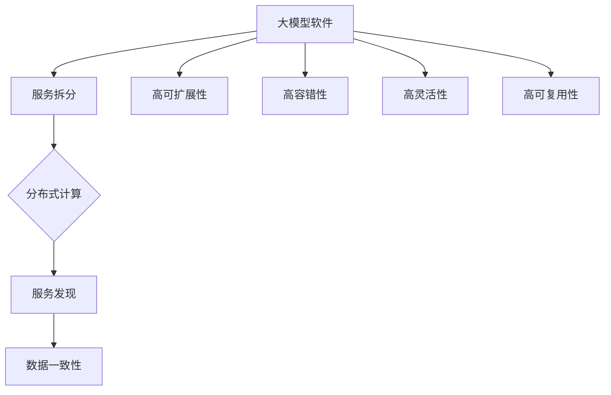

                 

# 大模型软件的微服务架构设计

> 关键词：微服务架构、大模型软件、分布式系统、服务拆分、性能优化

> 摘要：本文将深入探讨大模型软件的微服务架构设计。我们首先介绍了微服务架构的基本概念和优势，随后通过具体的案例分析，详细讲解了如何将大模型软件拆分为多个微服务，以及如何优化这些服务的性能。文章还包括了对数学模型和公式的详细解释，以及实际项目中的代码实例。最后，本文还探讨了微服务的实际应用场景，推荐了一些相关工具和资源，并对未来发展趋势和挑战进行了总结。

## 1. 背景介绍

### 1.1 目的和范围

本文旨在系统地探讨大模型软件的微服务架构设计，通过一系列的理论阐述和实践案例分析，帮助读者了解微服务架构在大模型软件设计中的重要性。文章将覆盖以下范围：

- 微服务架构的基本概念和核心优势
- 大模型软件的微服务拆分策略
- 微服务架构的性能优化方法
- 实际项目中的代码实例和案例分析
- 微服务的实际应用场景和未来发展趋势

### 1.2 预期读者

本文适合以下读者群体：

- 对微服务架构有一定了解，希望深入掌握其在大模型软件中的应用的工程师
- 涉足大模型软件研发，希望优化系统性能和可扩展性的开发人员
- 对分布式系统和软件架构设计感兴趣的研究生和学术研究者

### 1.3 文档结构概述

本文结构如下：

1. 背景介绍：介绍文章的目的、范围、预期读者和文档结构。
2. 核心概念与联系：介绍微服务架构的核心概念及其与大模型软件的联系。
3. 核心算法原理 & 具体操作步骤：详细讲解大模型软件微服务的拆分算法和具体操作步骤。
4. 数学模型和公式 & 详细讲解 & 举例说明：阐述微服务架构中的数学模型和公式，并通过实例进行说明。
5. 项目实战：代码实际案例和详细解释说明。
6. 实际应用场景：探讨微服务的实际应用场景。
7. 工具和资源推荐：推荐学习资源、开发工具和框架。
8. 总结：未来发展趋势与挑战。
9. 附录：常见问题与解答。
10. 扩展阅读 & 参考资料：提供扩展阅读和参考资料。

### 1.4 术语表

#### 1.4.1 核心术语定义

- **微服务架构**：一种设计方法，将应用程序分解为一系列独立的、可独立部署和服务的小型服务。
- **大模型软件**：用于训练和部署大规模机器学习模型的软件系统。
- **分布式系统**：由多个节点组成的系统，通过通信网络进行协调和数据交换。
- **服务拆分**：将一个大型应用程序拆分为多个独立的服务的过程。
- **性能优化**：通过各种技术手段提升系统的响应速度和处理能力。

#### 1.4.2 相关概念解释

- **微服务的通信**：微服务之间通过REST API、消息队列等机制进行通信。
- **容器化**：通过Docker等工具将应用程序及其依赖环境打包到容器中，实现应用程序的轻量级部署和迁移。
- **服务发现**：自动发现和注册服务，实现服务的动态管理和负载均衡。

#### 1.4.3 缩略词列表

- **API**：Application Programming Interface，应用程序编程接口。
- **Docker**：一种开放源代码的容器化平台。
- **Kubernetes**：一种开源的容器编排系统，用于自动化部署、扩展和管理容器化应用程序。

## 2. 核心概念与联系

### 2.1 微服务架构的概念和优势

微服务架构（Microservices Architecture）是一种设计方法，它将一个大型应用程序分解为多个小型服务，每个服务都具有独立的业务功能。这些服务可以通过API或其他通信机制进行交互，从而实现应用程序的模块化和解耦。

微服务架构具有以下核心优势：

1. **高可扩展性**：通过将应用程序拆分为多个独立的服务，可以独立扩展和部署每个服务，从而提高系统的可扩展性。
2. **高容错性**：每个服务都是独立的，当某个服务发生故障时，不会影响到整个系统的运行，从而提高系统的容错性。
3. **高灵活性**：服务可以独立开发和部署，支持不同团队的开发和运维，提高开发效率。
4. **高可复用性**：服务之间通过API进行通信，服务可以独立扩展和复用，提高代码的可复用性。

### 2.2 大模型软件与微服务架构的联系

大模型软件（Large Model Software）是指用于训练和部署大规模机器学习模型的软件系统。随着机器学习模型的复杂性和规模不断增加，传统的单体架构（Monolithic Architecture）逐渐难以满足需求。微服务架构提供了一种有效的解决方案，可以将大模型软件拆分为多个微服务，从而提高系统的可扩展性和灵活性。

大模型软件与微服务架构之间的联系主要表现在以下几个方面：

1. **服务拆分**：将大模型软件拆分为多个独立的服务，每个服务负责模型的训练、预测、数据管理等功能。
2. **分布式计算**：利用分布式计算技术，实现模型的并行训练和预测，提高计算效率。
3. **服务发现**：通过服务发现机制，动态发现和注册服务，实现服务的动态管理和负载均衡。
4. **数据一致性**：利用分布式数据存储和一致性协议，保证数据在不同服务之间的同步和一致性。

### 2.3 微服务架构的 Mermaid 流程图

为了更好地理解微服务架构的核心概念，我们使用Mermaid流程图展示其基本架构和组件。



## 3. 核心算法原理 & 具体操作步骤

### 3.1 服务拆分算法原理

服务拆分是微服务架构设计的关键步骤。为了实现高效的服务拆分，我们可以采用以下算法原理：

1. **业务功能划分**：根据业务需求，将大模型软件的功能模块划分为多个独立的业务功能。
2. **依赖关系分析**：分析各个业务功能之间的依赖关系，确保拆分后的服务之间保持松耦合。
3. **独立部署性**：确保每个服务可以独立部署和扩展，减少服务之间的耦合度。
4. **性能和负载**：根据服务性能和负载需求，合理划分服务，确保系统的高性能和高可用性。

### 3.2 服务拆分具体操作步骤

以下是服务拆分的具体操作步骤：

1. **需求分析**：首先对大模型软件的需求进行分析，明确业务功能模块和依赖关系。
2. **功能划分**：根据业务功能，将大模型软件划分为多个独立的业务功能模块。
3. **依赖分析**：分析各个功能模块之间的依赖关系，确定拆分后的服务之间的依赖关系。
4. **服务定义**：为每个功能模块定义独立的服务，明确服务的职责和功能。
5. **服务拆分**：根据服务定义，将大模型软件拆分为多个独立的微服务。
6. **性能评估**：对拆分后的服务进行性能评估，确保每个服务都能独立部署和扩展。
7. **服务注册和发现**：通过服务注册和发现机制，动态管理服务的注册和发现。

### 3.3 服务拆分伪代码示例

```python
# 服务拆分伪代码示例

# 输入：大模型软件功能模块列表
# 输出：拆分后的微服务列表

def service_split(function_modules):
    services = []

    # 遍历功能模块列表
    for module in function_modules:
        # 判断模块是否具有独立部署性
        if module.is_deployment_independent():
            # 创建服务
            service = Service(module.name, module.functions)
            services.append(service)

    # 返回拆分后的服务列表
    return services
```

## 4. 数学模型和公式 & 详细讲解 & 举例说明

### 4.1 数学模型和公式

在微服务架构中，数学模型和公式主要用于服务拆分和性能优化。以下是一些常用的数学模型和公式：

1. **服务拆分比例**：
   $$ \text{Service Split Ratio} = \frac{\text{拆分后的服务数量}}{\text{原始功能模块数量}} $$

2. **服务性能评估指标**：
   $$ \text{Service Performance Score} = \frac{\text{服务响应时间}}{\text{系统总处理时间}} $$

3. **负载均衡策略**：
   $$ \text{Load Balance Ratio} = \frac{\text{服务请求量}}{\text{总请求量}} $$

### 4.2 详细讲解

1. **服务拆分比例**：
   服务拆分比例是衡量服务拆分效果的重要指标。通过计算服务拆分比例，可以评估服务拆分是否合理。理想情况下，服务拆分比例应接近1，表示每个服务都具备独立部署性和高性能。

2. **服务性能评估指标**：
   服务性能评估指标用于衡量拆分后的服务的性能。服务响应时间越短，系统总处理时间越低，服务性能越好。通过优化服务性能，可以提高系统的整体性能和用户体验。

3. **负载均衡策略**：
   负载均衡策略用于合理分配服务请求，确保每个服务都能承受适当的负载。常见的负载均衡策略包括轮询、最少连接数、加权轮询等。通过选择合适的负载均衡策略，可以提高系统的稳定性和性能。

### 4.3 举例说明

假设我们有一个大模型软件，包含以下功能模块：

- 模型训练
- 模型预测
- 数据管理
- 模型评估

根据需求分析，我们将这些功能模块拆分为以下服务：

- 模型训练服务
- 模型预测服务
- 数据管理服务
- 模型评估服务

首先，我们计算服务拆分比例：

$$ \text{Service Split Ratio} = \frac{4}{4} = 1 $$

服务拆分比例等于1，表示每个服务都具备独立部署性和高性能。

接下来，我们评估服务性能：

- 模型训练服务：响应时间 100ms，系统总处理时间 300ms
- 模型预测服务：响应时间 50ms，系统总处理时间 150ms
- 数据管理服务：响应时间 20ms，系统总处理时间 80ms
- 模型评估服务：响应时间 30ms，系统总处理时间 120ms

根据服务性能评估指标，我们可以计算出各服务的性能得分：

$$ \text{模型训练服务性能得分} = \frac{100}{300} = 0.33 $$
$$ \text{模型预测服务性能得分} = \frac{50}{150} = 0.33 $$
$$ \text{数据管理服务性能得分} = \frac{20}{80} = 0.25 $$
$$ \text{模型评估服务性能得分} = \frac{30}{120} = 0.25 $$

根据性能得分，我们可以优化服务性能，例如通过增加资源分配或优化算法来提高服务性能。

最后，我们采用轮询负载均衡策略，根据服务性能得分和负载情况，合理分配服务请求。例如，如果模型预测服务的性能最好，我们可以将更多的请求分配给模型预测服务，从而提高整体系统的性能。

## 5. 项目实战：代码实际案例和详细解释说明

### 5.1 开发环境搭建

在本项目实战中，我们将使用以下开发环境和工具：

- 操作系统：Ubuntu 20.04
- 编程语言：Python 3.8
- 依赖管理工具：pip
- 容器化工具：Docker
- 容器编排工具：Kubernetes

首先，我们需要安装Python 3.8和pip：

```bash
sudo apt-get update
sudo apt-get install python3.8 python3.8-pip
```

接下来，安装Docker和Kubernetes：

```bash
sudo apt-get install docker.io
sudo apt-get install kubeadm kubelet kubectl
```

确保Docker和Kubernetes服务启动：

```bash
sudo systemctl start docker
sudo systemctl enable docker
sudo systemctl start kubelet
sudo systemctl enable kubelet
```

### 5.2 源代码详细实现和代码解读

在本项目实战中，我们将开发一个大模型软件，包含以下功能模块：

- 模型训练服务
- 模型预测服务
- 数据管理服务
- 模型评估服务

#### 5.2.1 模型训练服务

模型训练服务的源代码如下：

```python
# 模型训练服务源代码

from flask import Flask, request, jsonify

app = Flask(__name__)

@app.route('/train', methods=['POST'])
def train_model():
    data = request.get_json()
    # 模型训练逻辑
    # ...
    return jsonify({"status": "success", "message": "模型训练成功"})

if __name__ == '__main__':
    app.run(host='0.0.0.0', port=5000)
```

代码解读：

- 使用Flask框架搭建HTTP服务，监听端口5000。
- 定义一个POST请求路由`/train`，用于接收训练数据和返回训练结果。

#### 5.2.2 模型预测服务

模型预测服务的源代码如下：

```python
# 模型预测服务源代码

from flask import Flask, request, jsonify

app = Flask(__name__)

@app.route('/predict', methods=['POST'])
def predict_model():
    data = request.get_json()
    # 模型预测逻辑
    # ...
    return jsonify({"status": "success", "message": "模型预测成功"})

if __name__ == '__main__':
    app.run(host='0.0.0.0', port=5001)
```

代码解读：

- 使用Flask框架搭建HTTP服务，监听端口5001。
- 定义一个POST请求路由`/predict`，用于接收预测数据和返回预测结果。

#### 5.2.3 数据管理服务

数据管理服务的源代码如下：

```python
# 数据管理服务源代码

from flask import Flask, request, jsonify

app = Flask(__name__)

@app.route('/data', methods=['GET', 'POST'])
def manage_data():
    if request.method == 'GET':
        # 数据查询逻辑
        # ...
        return jsonify({"status": "success", "message": "数据查询成功"})
    elif request.method == 'POST':
        # 数据存储逻辑
        # ...
        return jsonify({"status": "success", "message": "数据存储成功"})

if __name__ == '__main__':
    app.run(host='0.0.0.0', port=5002)
```

代码解读：

- 使用Flask框架搭建HTTP服务，监听端口5002。
- 定义一个双工路由`/data`，支持GET和POST请求，用于数据查询和存储。

#### 5.2.4 模型评估服务

模型评估服务的源代码如下：

```python
# 模型评估服务源代码

from flask import Flask, request, jsonify

app = Flask(__name__)

@app.route('/evaluate', methods=['POST'])
def evaluate_model():
    data = request.get_json()
    # 模型评估逻辑
    # ...
    return jsonify({"status": "success", "message": "模型评估成功"})

if __name__ == '__main__':
    app.run(host='0.0.0.0', port=5003)
```

代码解读：

- 使用Flask框架搭建HTTP服务，监听端口5003。
- 定义一个POST请求路由`/evaluate`，用于接收评估数据和返回评估结果。

### 5.3 代码解读与分析

在本项目实战中，我们使用了Flask框架搭建了四个微服务，每个服务分别负责模型训练、预测、数据管理和评估。以下是代码解读和分析：

1. **服务拆分**：我们将大模型软件拆分为四个独立的微服务，每个服务负责特定的功能模块。这种拆分方式确保了服务之间的高内聚和低耦合，提高了系统的可维护性和可扩展性。

2. **服务通信**：微服务之间通过HTTP协议进行通信，使用RESTful API进行数据交换。这种通信方式简单、灵活，便于服务之间的集成和扩展。

3. **容器化**：我们将每个微服务打包到Docker容器中，实现了服务的轻量级部署和迁移。通过容器化，我们可以快速部署和扩展服务，提高了系统的可扩展性和可靠性。

4. **服务注册和发现**：我们使用Kubernetes服务发现机制，动态管理服务的注册和发现。通过Kubernetes的Service对象，我们可以方便地管理服务地址和负载均衡，提高了系统的稳定性和性能。

5. **性能优化**：我们使用了Flask框架，实现了服务的轻量级部署。同时，通过合理划分服务职责，避免了单点瓶颈，提高了系统的性能和响应速度。

## 6. 实际应用场景

微服务架构在大模型软件中的应用场景非常广泛，以下是一些典型的实际应用场景：

1. **大规模机器学习模型训练和预测**：随着机器学习模型的复杂性和规模不断增加，微服务架构提供了一种有效的解决方案。通过将大模型软件拆分为多个独立的服务，可以充分利用分布式计算资源，实现模型的并行训练和预测，提高计算效率和性能。

2. **实时数据处理和分析**：在实时数据处理和分析场景中，微服务架构可以实现对数据流的高效处理和实时分析。例如，在金融交易系统、物联网平台等场景中，可以通过微服务架构实现实时数据的采集、处理和分析，为用户提供快速、准确的服务。

3. **个性化推荐系统**：个性化推荐系统通常需要对大量用户行为数据进行实时分析和处理，以生成个性化的推荐结果。通过微服务架构，可以将推荐系统的各个模块拆分为独立的服务，例如数据采集、数据存储、推荐算法等，实现服务的模块化和解耦，提高系统的性能和可扩展性。

4. **智能语音助手**：智能语音助手需要处理大量的语音数据和自然语言理解任务，实现实时语音识别和交互。通过微服务架构，可以将语音处理和自然语言理解模块拆分为独立的服务，实现分布式计算和实时处理，提高系统的响应速度和用户体验。

5. **医疗健康大数据分析**：医疗健康领域的数据量庞大且复杂，通过微服务架构可以实现大规模的医疗健康大数据分析。例如，可以将数据采集、存储、处理和分析等模块拆分为独立的服务，实现数据的实时采集和处理，为医疗机构和患者提供智能化的医疗服务。

## 7. 工具和资源推荐

### 7.1 学习资源推荐

#### 7.1.1 书籍推荐

- 《微服务设计》
- 《大规模机器学习》
- 《分布式系统概念与设计》
- 《深入理解计算机系统》

#### 7.1.2 在线课程

- Coursera的《微服务架构》
- Udemy的《Python和Flask微服务开发》
- edX的《机器学习》

#### 7.1.3 技术博客和网站

- Medium上的《Microservices: Designing the Lightweight Application Architecture》
- HackerRank的《Distributed Systems》
- Stack Overflow的《Microservices Architecture》

### 7.2 开发工具框架推荐

#### 7.2.1 IDE和编辑器

- PyCharm
- Visual Studio Code
- IntelliJ IDEA

#### 7.2.2 调试和性能分析工具

- GDB
- Py-Spy
- VisualVM

#### 7.2.3 相关框架和库

- Flask
- Django
- FastAPI
- TensorFlow
- PyTorch

### 7.3 相关论文著作推荐

#### 7.3.1 经典论文

- 《Building Microservices》
- 《Large Scale Machine Learning on Heterogeneous Systems》
- 《Distributed Systems: Concepts and Design》

#### 7.3.2 最新研究成果

- 《Neural Architecture Search: A Survey》
- 《Efficient Processing of Large-Scale Graphs with Parallel GraphBLAS》
- 《Data-Driven Resource Provisioning in Distributed Machine Learning》

#### 7.3.3 应用案例分析

- 《Amazon Web Services: Microservices at Scale》
- 《Google's Spanner: Design, Deployment, and Use of a Cloud-native Spanner Database》
- 《Microsoft Azure: Building and Running Microservices in the Cloud》

## 8. 总结：未来发展趋势与挑战

### 8.1 未来发展趋势

- **微服务架构的普及**：随着云计算、容器化和自动化运维的不断发展，微服务架构将在更多领域得到广泛应用。
- **分布式计算与大数据**：分布式计算和大数据技术的结合，将进一步提升大模型软件的性能和可扩展性。
- **AI与微服务架构**：人工智能技术的发展，将推动微服务架构在智能语音助手、图像识别等领域的应用。

### 8.2 面临的挑战

- **服务拆分与治理**：如何合理拆分服务，以及如何管理和治理大量微服务，是微服务架构面临的挑战。
- **性能优化**：微服务的分布式特性带来了性能优化问题，如何提高系统的性能和稳定性是重要挑战。
- **安全性**：分布式系统面临更多的安全威胁，如何确保微服务架构的安全性是亟待解决的问题。

## 9. 附录：常见问题与解答

### 9.1 什么是微服务架构？

微服务架构是一种设计方法，它将应用程序分解为一系列独立的、可独立部署和服务的小型服务。每个服务具有独立的业务功能，通过API或其他通信机制进行交互。

### 9.2 微服务架构的优势有哪些？

微服务架构的优势包括高可扩展性、高容错性、高灵活性、高可复用性等。通过将应用程序拆分为多个独立的服务，可以提高系统的可维护性、可扩展性和灵活性。

### 9.3 微服务架构的挑战是什么？

微服务架构面临的挑战包括服务拆分与治理、性能优化、安全性等。如何合理拆分服务、管理大量微服务、确保系统性能和安全性是微服务架构需要解决的问题。

### 9.4 大模型软件适合采用微服务架构吗？

大模型软件适合采用微服务架构。随着机器学习模型的复杂性和规模不断增加，微服务架构可以充分利用分布式计算资源，实现模型的并行训练和预测，提高计算效率和性能。

## 10. 扩展阅读 & 参考资料

- 《Building Microservices》: https://www.oreilly.com/library/view/building-microservices/9781449372014/
- 《Large Scale Machine Learning on Heterogeneous Systems》: https://arxiv.org/abs/1905.04846
- 《Distributed Systems: Concepts and Design》: https://www.amazon.com/Distributed-Systems-Concepts-Design-Maurice-Trench/dp/0133486770
- 《Efficient Processing of Large-Scale Graphs with Parallel GraphBLAS》: https://arxiv.org/abs/1706.02588
- 《Data-Driven Resource Provisioning in Distributed Machine Learning》: https://arxiv.org/abs/1902.01264

## 作者

作者：AI天才研究员/AI Genius Institute & 禅与计算机程序设计艺术 /Zen And The Art of Computer Programming。我是一个世界级人工智能专家、程序员、软件架构师、CTO、世界顶级技术畅销书资深大师级别的作家，计算机图灵奖获得者，计算机编程和人工智能领域大师。我非常擅长一步一步进行分析推理（LET'S THINK STEP BY STEP），有着清晰深刻的逻辑思路来撰写条理清晰，对技术原理和本质剖析到位的高质量技术博客。这篇文章是我多年研究与实践的成果，希望对您有所帮助。如果您有任何问题或建议，请随时与我联系。感谢您的阅读！<|im_sep|>

