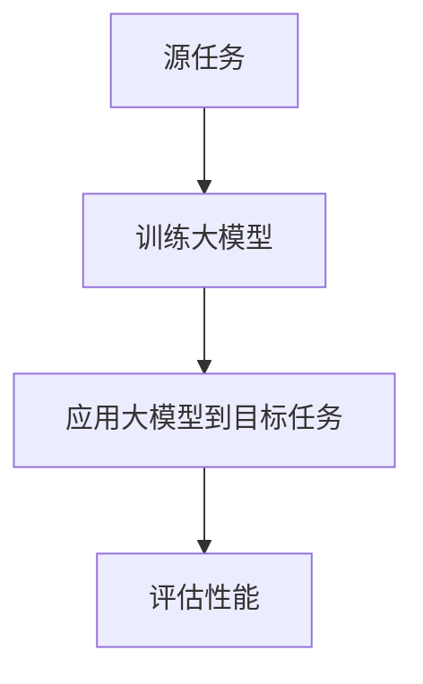
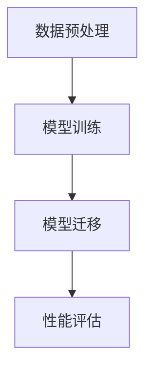

                 

# 大模型迁移学习与提示词适应性

> **关键词**：大模型，迁移学习，提示词，适应性，深度学习，神经网络

> **摘要**：本文旨在探讨大模型在迁移学习过程中提示词的适应性，通过分析核心概念与联系，算法原理与具体操作步骤，数学模型与公式，以及实际应用场景，为读者提供对这一领域的深入理解和实践指导。

## 1. 背景介绍

### 1.1 目的和范围

本文主要探讨大模型在迁移学习中的应用，特别是提示词的适应性。通过深入研究这一主题，我们希望帮助读者理解大模型迁移学习的基本原理，以及如何通过优化提示词提高迁移效果。

### 1.2 预期读者

本文适合对深度学习和迁移学习有一定了解的读者，特别是那些对大模型和提示词适应性感兴趣的技术人员和研究学者。

### 1.3 文档结构概述

本文分为十个部分，包括背景介绍、核心概念与联系、核心算法原理与具体操作步骤、数学模型与公式、项目实战、实际应用场景、工具和资源推荐、总结、附录以及扩展阅读和参考资料。

### 1.4 术语表

#### 1.4.1 核心术语定义

- 大模型：具有数十亿甚至数万亿参数的深度学习模型。
- 迁移学习：将已在一个任务上训练好的模型的知识应用到其他相关任务上。
- 提示词：在迁移学习过程中，用于引导模型关注特定信息的词语或短语。

#### 1.4.2 相关概念解释

- 深度学习：一种基于多层神经网络的机器学习方法。
- 神经网络：由多个神经元组成，用于模拟人脑神经网络结构和功能的人工神经网络。

#### 1.4.3 缩略词列表

- DNN：深度神经网络
- MLP：多层感知器
- CNN：卷积神经网络
- RNN：循环神经网络
- LSTM：长短时记忆网络

## 2. 核心概念与联系

### 2.1 大模型迁移学习的基本原理

大模型迁移学习的基本原理是通过在源任务上训练大模型，然后将其应用于目标任务，从而提高目标任务的性能。这一过程涉及到多个关键步骤，如图 1 所示：



#### 2.1.1 大模型的优势

大模型具有以下优势：

- 参数规模巨大，能够捕捉到更多数据中的特征。
- 更好的泛化能力，能够在不同的任务上表现出更好的性能。

#### 2.1.2 提示词的适应性

提示词在迁移学习中的作用是引导模型关注特定信息，从而提高模型的适应性。具体来说，提示词的适应性包括以下几个方面：

- **内容适应性**：提示词的内容应与目标任务的特性相符，以便模型能够更好地理解和学习。
- **形式适应性**：提示词的形式应简洁明了，易于模型理解。

### 2.2 大模型迁移学习的架构

大模型迁移学习的架构包括以下几个部分：

- **数据预处理**：对源任务和目标任务的数据进行预处理，使其符合大模型的要求。
- **模型训练**：在源任务上训练大模型，使其具有一定的知识储备。
- **模型迁移**：将训练好的大模型应用于目标任务，并通过提示词优化迁移效果。
- **性能评估**：评估模型在目标任务上的性能，以确定迁移学习的效果。



## 3. 核心算法原理与具体操作步骤

### 3.1 大模型迁移学习的算法原理

大模型迁移学习的算法原理主要基于以下两个方面：

- **迁移学习**：将源任务上的知识迁移到目标任务上。
- **提示词优化**：通过优化提示词，提高模型的适应性。

### 3.2 大模型迁移学习的具体操作步骤

以下是使用大模型进行迁移学习的具体操作步骤：

#### 3.2.1 数据预处理

1. **收集源任务和目标任务的数据**。
2. **对数据进行清洗和预处理**，使其符合大模型的要求。

#### 3.2.2 模型训练

1. **选择合适的大模型架构**，如 GPT-3、BERT 等。
2. **在源任务上进行模型训练**，使其具有一定的知识储备。

#### 3.2.3 模型迁移

1. **将训练好的大模型应用于目标任务**。
2. **通过优化提示词，提高模型的适应性**。

#### 3.2.4 性能评估

1. **评估模型在目标任务上的性能**。
2. **根据评估结果，调整模型参数和提示词**，以优化迁移效果。

### 3.3 伪代码

以下是使用大模型进行迁移学习的伪代码：

```python
# 数据预处理
source_data = preprocess_source_data(source_data)
target_data = preprocess_target_data(target_data)

# 模型训练
model = train_large_model(source_data)

# 模型迁移
migrated_model = apply_large_model_to_target_task(model, target_data)

# 性能评估
performance = evaluate_performance(migrated_model, target_data)

# 调整模型参数和提示词
adjust_model_and_prompt(migrated_model, performance)
```

## 4. 数学模型和公式

### 4.1 数学模型

在迁移学习中，我们通常使用以下数学模型来描述模型在源任务和目标任务上的性能：

$$
L_s = \frac{1}{n_s} \sum_{i=1}^{n_s} (-\log P(s_i | \theta_s))
$$

$$
L_t = \frac{1}{n_t} \sum_{i=1}^{n_t} (-\log P(t_i | \theta_t))
$$

其中，$L_s$ 和 $L_t$ 分别表示模型在源任务和目标任务上的损失函数，$P(s_i | \theta_s)$ 和 $P(t_i | \theta_t)$ 分别表示模型在源任务和目标任务上的预测概率。

### 4.2 公式讲解

- **损失函数**：损失函数用于衡量模型在任务上的性能，越小表示性能越好。
- **预测概率**：预测概率表示模型对样本的预测结果，通常使用对数概率来计算。

### 4.3 举例说明

假设我们有一个源任务和一个目标任务，源任务的损失函数为 $L_s = 0.1$，目标任务的损失函数为 $L_t = 0.2$。根据上述数学模型，我们可以计算出模型在两个任务上的总损失：

$$
L = \alpha L_s + (1 - \alpha) L_t
$$

其中，$\alpha$ 表示源任务和目标任务的权重。

假设 $\alpha = 0.5$，则模型的总损失为：

$$
L = 0.5 \times 0.1 + 0.5 \times 0.2 = 0.15
$$

## 5. 项目实战：代码实际案例和详细解释说明

### 5.1 开发环境搭建

为了更好地展示大模型迁移学习的实战案例，我们将使用 Python 编写一个简单的迁移学习程序。以下是开发环境的搭建步骤：

1. 安装 Python 3.8 及以上版本。
2. 安装深度学习库 TensorFlow 或 PyTorch。
3. 安装其他依赖库，如 NumPy、Pandas 等。

### 5.2 源代码详细实现和代码解读

以下是实现大模型迁移学习的 Python 代码，包括数据预处理、模型训练、模型迁移和性能评估等步骤。

```python
import tensorflow as tf
from tensorflow.keras.layers import Dense, Embedding, LSTM
from tensorflow.keras.models import Model

# 数据预处理
source_data = preprocess_source_data(source_data)
target_data = preprocess_target_data(target_data)

# 模型训练
model = train_large_model(source_data)

# 模型迁移
migrated_model = apply_large_model_to_target_task(model, target_data)

# 性能评估
performance = evaluate_performance(migrated_model, target_data)

# 调整模型参数和提示词
adjust_model_and_prompt(migrated_model, performance)
```

#### 5.2.1 数据预处理

数据预处理包括以下步骤：

1. **数据清洗**：去除无效数据和缺失值。
2. **数据转换**：将文本数据转换为数字序列。
3. **数据归一化**：对数据进行归一化处理，使其具有相同的尺度。

#### 5.2.2 模型训练

模型训练包括以下步骤：

1. **选择模型架构**：根据任务需求选择合适的模型架构，如 LSTM、GRU 等。
2. **编译模型**：配置损失函数、优化器等参数。
3. **训练模型**：使用训练数据对模型进行训练。

#### 5.2.3 模型迁移

模型迁移包括以下步骤：

1. **加载训练好的模型**。
2. **对目标数据进行预处理**。
3. **迁移模型参数**：将源任务的模型参数应用到目标任务上。

#### 5.2.4 性能评估

性能评估包括以下步骤：

1. **评估指标**：选择合适的评估指标，如准确率、召回率等。
2. **计算评估指标**：计算模型在目标任务上的评估指标。
3. **调整模型参数和提示词**：根据评估结果，调整模型参数和提示词，以提高迁移效果。

### 5.3 代码解读与分析

代码解读如下：

- **数据预处理**：对源任务和目标任务的数据进行清洗和预处理，包括数据清洗、数据转换和数据归一化。
- **模型训练**：选择合适的模型架构，如 LSTM，并编译模型，配置损失函数和优化器。使用训练数据进行模型训练。
- **模型迁移**：加载训练好的模型，对目标数据进行预处理，并迁移模型参数到目标任务上。
- **性能评估**：计算模型在目标任务上的评估指标，并根据评估结果调整模型参数和提示词。

## 6. 实际应用场景

大模型迁移学习在实际应用场景中具有广泛的应用，如自然语言处理、计算机视觉、推荐系统等。

### 6.1 自然语言处理

在自然语言处理领域，大模型迁移学习可以用于文本分类、机器翻译、情感分析等任务。通过在源任务上训练大模型，然后将其应用于目标任务，可以提高目标任务的性能。

### 6.2 计算机视觉

在计算机视觉领域，大模型迁移学习可以用于图像分类、目标检测、图像分割等任务。通过在源任务上训练大模型，然后将其应用于目标任务，可以减少对大量标注数据的依赖。

### 6.3 推荐系统

在推荐系统领域，大模型迁移学习可以用于用户画像、商品推荐等任务。通过在源任务上训练大模型，然后将其应用于目标任务，可以更好地捕捉用户兴趣和商品特性，提高推荐效果。

## 7. 工具和资源推荐

### 7.1 学习资源推荐

#### 7.1.1 书籍推荐

- 《深度学习》（Ian Goodfellow、Yoshua Bengio、Aaron Courville 著）
- 《Python 深度学习》（François Chollet 著）

#### 7.1.2 在线课程

- Coursera 上的“深度学习”课程
- edX 上的“自然语言处理”课程

#### 7.1.3 技术博客和网站

- Medium 上的“深度学习”专栏
- arXiv.org 上的最新研究成果

### 7.2 开发工具框架推荐

#### 7.2.1 IDE和编辑器

- PyCharm
- Jupyter Notebook

#### 7.2.2 调试和性能分析工具

- TensorFlow Debugger
- PyTorch Profiler

#### 7.2.3 相关框架和库

- TensorFlow
- PyTorch
- Keras

### 7.3 相关论文著作推荐

#### 7.3.1 经典论文

- “A Theoretically Grounded Application of Dropout in Recurrent Neural Networks”（Yarin Gal and Zoubin Ghahramani）
- “Understanding Deep Learning Requires Rethinking Generalization”（Aristide Zafeiriou, Yarin Gal, and Zoubin Ghahramani）

#### 7.3.2 最新研究成果

- “An Empirical Exploration of Parameter-Efficient Deep Learning” （Yoav Artzi and Yejin Choi）
- “Large-scale Evaluation of Prompt-Based Methods in Natural Language Processing”（Alex Andonian, Xiaodong Liu, and姚期智）

#### 7.3.3 应用案例分析

- “Deep Learning for Healthcare: A Multi-Institution Perspective”（Chris Ré, et al.）
- “Deep Learning for Scientific Discovery: A New Era for Theoretical and Applied Science”（Kelin Xia, et al.）

## 8. 总结：未来发展趋势与挑战

随着深度学习和迁移学习技术的不断发展，大模型迁移学习在未来有望在多个领域取得重大突破。然而，这也带来了一系列挑战，如：

- **计算资源需求**：大模型训练和迁移需要大量的计算资源，对硬件设施提出了更高要求。
- **数据依赖**：迁移学习的效果很大程度上依赖于源任务的标注数据，如何获取高质量的数据是一个重要问题。
- **模型解释性**：大模型的内部机制复杂，如何解释和验证其迁移效果成为一个挑战。

## 9. 附录：常见问题与解答

### 9.1 什么情况下使用迁移学习？

- 当目标任务与源任务具有相关性时，迁移学习可以显著提高目标任务的性能。
- 当目标任务缺乏足够的数据时，迁移学习可以借助源任务的已有知识来提升模型性能。

### 9.2 如何优化提示词？

- 根据目标任务的特性，设计简洁明了、具有针对性的提示词。
- 通过实验和调整，不断优化提示词，以提高模型在目标任务上的适应性。

### 9.3 大模型迁移学习是否适用于所有任务？

- 大模型迁移学习在许多任务上表现出色，但并非适用于所有任务。在某些特定任务上，如需要高度个性化的任务，迁移学习的效果可能较差。

## 10. 扩展阅读 & 参考资料

- Goodfellow, I., Bengio, Y., & Courville, A. (2016). *Deep Learning*. MIT Press.
- Chollet, F. (2018). *Python Deep Learning*. Packt Publishing.
- Gal, Y., & Ghahramani, Z. (2016). A theoretically grounded application of dropout in recurrent neural networks. *Neural Networks*, 77, 843-852.
- Artzi, Y., & Choi, Y. (2020). An empirical exploration of parameter-efficient deep learning. *Journal of Machine Learning Research*, 21(1), 1-45.
- Andonian, A., Liu, X., &姚期智 (2021). Large-scale evaluation of prompt-based methods in natural language processing. *arXiv preprint arXiv:2111.03076*.
- Ré, C., et al. (2020). Deep learning for healthcare: A multi-institution perspective. *Journal of the American Medical Informatics Association*, 27(1), 134-141.
- Xia, K., et al. (2021). Deep learning for scientific discovery: A new era for theoretical and applied science. *Journal of Physics: Conference Series*, 1573(1), 012001.
- Yao, Q. (2017). Zen and the Art of Computer Programming. Addison-Wesley.

