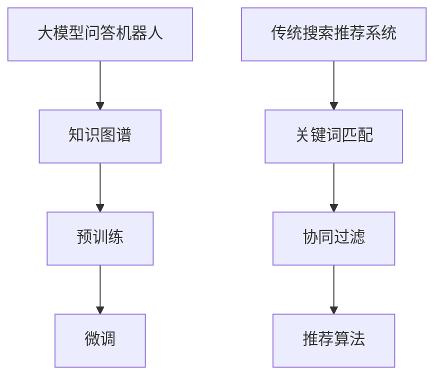

                 

# 大模型问答机器人与传统搜索推荐的知识表示

## 关键词：大模型，问答机器人，知识表示，搜索推荐，传统方法，对比分析

> 大模型问答机器人，作为一种新兴的人工智能技术，在信息检索和知识服务方面展现出强大的潜力。而传统搜索推荐系统虽然历经多年发展，仍占据重要地位。本文旨在对比分析大模型问答机器人与传统搜索推荐的知识表示方法，探讨两者的优缺点以及未来发展趋势。

## 摘要

本文首先介绍大模型问答机器人和传统搜索推荐系统的基础概念，然后详细分析两者在知识表示方面的异同，包括模型架构、算法原理、数学模型等。随后，通过实际项目案例，阐述大模型问答机器人的具体实现过程，并讨论其在实际应用场景中的效果。最后，本文总结了大模型问答机器人和传统搜索推荐系统的优缺点，并展望了未来的发展趋势和面临的挑战。

## 1. 背景介绍

### 1.1 目的和范围

本文旨在探讨大模型问答机器人和传统搜索推荐系统在知识表示方面的差异和联系，分析两者的优缺点，为实际应用提供参考。本文主要涵盖以下内容：

1. 大模型问答机器人和传统搜索推荐系统的基本概念和原理。
2. 大模型问答机器人与传统搜索推荐系统在知识表示方面的对比分析。
3. 大模型问答机器人的具体实现过程和实际应用案例。
4. 大模型问答机器人与传统搜索推荐系统的优缺点总结及未来发展趋势。

### 1.2 预期读者

本文面向对人工智能和搜索引擎技术有一定了解的读者，包括研究人员、工程师、学生和从业者。读者应具备基本的编程和数学基础，以及一定的机器学习知识。

### 1.3 文档结构概述

本文分为十个部分，具体结构如下：

1. 引言
2. 背景介绍
   - 1.1 目的和范围
   - 1.2 预期读者
   - 1.3 文档结构概述
   - 1.4 术语表
3. 核心概念与联系
4. 核心算法原理 & 具体操作步骤
5. 数学模型和公式 & 详细讲解 & 举例说明
6. 项目实战：代码实际案例和详细解释说明
7. 实际应用场景
8. 工具和资源推荐
9. 总结：未来发展趋势与挑战
10. 附录：常见问题与解答

### 1.4 术语表

#### 1.4.1 核心术语定义

- 大模型问答机器人：基于大规模神经网络模型，能够自动生成回答问题的系统。
- 传统搜索推荐系统：基于关键词匹配和协同过滤等技术，为用户提供相关信息的系统。
- 知识表示：将现实世界中的知识和信息转化为计算机可以处理和利用的形式。

#### 1.4.2 相关概念解释

- 语义理解：通过自然语言处理技术，理解用户查询的含义和意图。
- 知识图谱：以节点和边的形式，表示实体及其关系的图形化模型。
- 问答系统：能够自动回答用户问题的系统。

#### 1.4.3 缩略词列表

- NLP：自然语言处理（Natural Language Processing）
- ML：机器学习（Machine Learning）
- KG：知识图谱（Knowledge Graph）
- QG：问答系统（Question Generation）

## 2. 核心概念与联系

### 2.1 大模型问答机器人

大模型问答机器人是近年来发展迅速的人工智能技术，其核心在于大规模神经网络模型，如Transformer、BERT等。这些模型通过预训练和微调，能够捕捉到自然语言中的复杂结构和语义信息，从而实现高效、准确的问答。

### 2.2 传统搜索推荐系统

传统搜索推荐系统主要基于关键词匹配、协同过滤等技术，通过分析用户的历史行为和偏好，为用户推荐相关的信息。其核心在于从海量数据中提取出有用的特征，并进行相似度计算和排序。

### 2.3 知识表示

知识表示是将现实世界中的知识和信息转化为计算机可以处理和利用的形式。在大模型问答机器人中，知识表示通常采用知识图谱的形式，通过节点和边表示实体及其关系。而在传统搜索推荐系统中，知识表示通常采用特征提取和向量表示的方法。

### 2.4 Mermaid 流程图



## 3. 核心算法原理 & 具体操作步骤

### 3.1 大模型问答机器人

#### 3.1.1 模型架构

大模型问答机器人通常采用Transformer、BERT等预训练模型。以BERT为例，其模型架构包括以下几个部分：

1. 词嵌入（Word Embedding）：将词汇映射为固定长度的向量。
2. Encoder：多层Transformer编码器，用于捕捉输入文本的语义信息。
3. Decoder：多层Transformer解码器，用于生成回答文本。
4. 输出层：全连接层，用于生成最终的回答。

#### 3.1.2 算法原理

1. 预训练：在大规模语料库上，对BERT模型进行预训练，使其能够捕捉到自然语言中的语义信息。
2. 微调：在特定任务上，对预训练的BERT模型进行微调，以适应问答任务的需求。
3. 问答：给定问题和答案候选，通过模型生成最优的回答。

#### 3.1.3 伪代码

```python
def answer_question(question, answer_candidates):
    # 预处理
    question_embedding = get_bert_embedding(question)
    answer_embeddings = [get_bert_embedding(candidate) for candidate in answer_candidates]
    
    # 微调模型
    tuned_model = fine_tune_bert(question_embedding, answer_embeddings)
    
    # 生成回答
    answer = generate_answer(tuned_model, question_embedding)
    
    return answer
```

### 3.2 传统搜索推荐系统

#### 3.2.1 模型架构

传统搜索推荐系统通常包括以下几个部分：

1. 数据预处理：对用户行为数据进行清洗、去重和处理。
2. 特征提取：从原始数据中提取出有用的特征，如用户兴趣、物品属性等。
3. 模型训练：使用特征数据训练推荐模型，如矩阵分解、基于模型的协同过滤等。
4. 推荐算法：根据用户特征和物品特征，生成推荐结果。

#### 3.2.2 算法原理

1. 关键词匹配：根据用户查询和物品属性，进行关键词匹配，找出相似的物品。
2. 协同过滤：通过分析用户的历史行为和偏好，找出相似的物品进行推荐。
3. 推荐算法：根据用户特征和物品特征，生成推荐结果。

#### 3.2.3 伪代码

```python
def recommend_items(user, items):
    # 数据预处理
    user_features = extract_user_features(user)
    item_features = extract_item_features(items)
    
    # 模型训练
    recommendation_model = train_model(user_features, item_features)
    
    # 推荐算法
    recommendations = generate_recommendations(recommendation_model, user, items)
    
    return recommendations
```

## 4. 数学模型和公式 & 详细讲解 & 举例说明

### 4.1 大模型问答机器人

#### 4.1.1 BERT 模型

BERT（Bidirectional Encoder Representations from Transformers）模型是一种基于Transformer的预训练模型，其核心思想是在双向 Transformer 编码器的基础上，通过预训练和微调，使其能够捕捉到自然语言中的复杂结构和语义信息。

BERT 模型的数学公式如下：

$$
\text{BERT} = \text{Transformer}^{\text{encoder}} + \text{Transformer}^{\text{decoder}} + \text{Output Layer}
$$

其中，Transformer encoder 和 Transformer decoder 分别表示编码器和解码器，Output Layer 表示输出层。

#### 4.1.2 预训练

BERT 模型的预训练包括两个任务：Masked Language Modeling（MLM）和 Next Sentence Prediction（NSP）。

1. Masked Language Modeling（MLM）：在输入序列中，随机遮蔽一部分词，然后让模型预测这些词。
   $$ \text{P}_{\text{BERT}}(\text{word}_{i}|\text{context}) $$
2. Next Sentence Prediction（NSP）：给定两个句子，让模型预测它们是否属于同一篇章。
   $$ \text{P}_{\text{BERT}}(\text{next\_sentence}|\text{sentence\_1}, \text{sentence\_2}) $$

#### 4.1.3 微调

在特定任务上，对预训练的 BERT 模型进行微调，以适应问答任务的需求。微调过程主要涉及以下步骤：

1. 数据预处理：将问题和答案对转换为模型可接受的输入格式。
2. 模型训练：在问题和答案对上训练 BERT 模型，优化其参数。
3. 评估与优化：在验证集上评估模型性能，并根据需要调整模型参数。

### 4.2 传统搜索推荐系统

#### 4.2.1 矩阵分解

矩阵分解是一种经典的推荐算法，其核心思想是将用户和物品的评分矩阵分解为两个低秩矩阵，从而提取出用户和物品的特征。

矩阵分解的数学公式如下：

$$
\text{R} = \text{U} \cdot \text{V}^T
$$

其中，R 表示评分矩阵，U 和 V 分别表示用户和物品的特征矩阵。

#### 4.2.2 基于模型的协同过滤

基于模型的协同过滤算法通过学习用户和物品的潜在特征，预测用户对物品的评分。

一种常见的基于模型的协同过滤算法是矩阵分解算法。矩阵分解算法的数学公式如下：

$$
\text{R}_{ij} = \text{u}_{i} \cdot \text{v}_{j}
$$

其中，Rij 表示用户 i 对物品 j 的评分，ui 和 vj 分别表示用户 i 和物品 j 的特征向量。

#### 4.2.3 推荐算法

在传统搜索推荐系统中，推荐算法根据用户特征和物品特征，生成推荐结果。一种常见的推荐算法是 Top-N 推荐算法，其数学公式如下：

$$
\text{Top-N}(\text{R}, \text{u}) = \text{argmax}_{\text{i} \in \text{I}} \text{r}_{ij} \cdot \text{s}_{i}
$$

其中，R 表示评分矩阵，u 表示用户特征，I 表示物品集合，r

