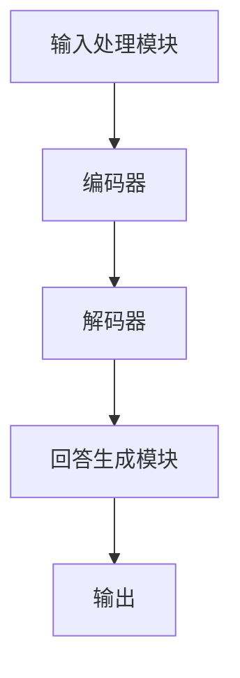
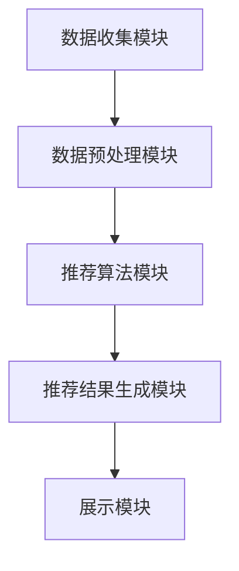

                 

### 1. 背景介绍

#### 1.1 目的和范围

本文旨在深入探讨大模型问答机器人与搜索推荐系统之间的异同，帮助读者理解两者在技术原理、实现方法及实际应用中的区别和联系。本文将首先介绍这两个系统的基本概念和核心组成部分，然后通过详细的算法原理讲解、数学模型解析及项目实战案例，帮助读者全面掌握这两个系统的工作机制和设计思路。最后，本文将对大模型问答机器人与搜索推荐系统的实际应用场景进行探讨，并推荐相关的学习资源和工具，为读者提供进一步学习和实践的路径。

#### 1.2 预期读者

本文适合具有计算机科学、数据科学或人工智能背景的读者，特别是那些对大模型问答机器人和搜索推荐系统感兴趣的工程师和技术爱好者。无论您是初学者还是专业人士，本文都将提供有价值的见解和实用的指导。

#### 1.3 文档结构概述

本文结构如下：

1. **背景介绍**：介绍本文的目的、范围、预期读者以及文档结构。
2. **核心概念与联系**：阐述大模型问答机器人和搜索推荐系统的核心概念、原理和架构，通过Mermaid流程图展示系统框架。
3. **核心算法原理 & 具体操作步骤**：详细讲解大模型问答机器人的算法原理和操作步骤，使用伪代码进行说明。
4. **数学模型和公式 & 详细讲解 & 举例说明**：介绍大模型问答机器人的数学模型和公式，并通过实例进行详细讲解。
5. **项目实战：代码实际案例和详细解释说明**：展示大模型问答机器人的实际代码实现和解析。
6. **实际应用场景**：探讨大模型问答机器人在不同场景中的应用。
7. **工具和资源推荐**：推荐学习资源、开发工具框架和相关论文著作。
8. **总结：未来发展趋势与挑战**：总结大模型问答机器人和搜索推荐系统的发展趋势和面临的挑战。
9. **附录：常见问题与解答**：回答读者可能遇到的问题。
10. **扩展阅读 & 参考资料**：提供进一步学习和参考的资料。

#### 1.4 术语表

为了确保本文内容的准确性和一致性，以下列出了一些核心术语的定义和相关概念解释：

##### 1.4.1 核心术语定义

- **大模型问答机器人**：基于大型预训练语言模型（如GPT）的问答系统，能够理解和回答用户提出的问题。
- **搜索推荐系统**：根据用户行为和偏好，为用户推荐相关内容或商品的系统。
- **预训练语言模型**：使用大量文本数据进行预训练的神经网络模型，能够理解和生成自然语言文本。
- **用户行为**：用户在使用系统时的各种操作，如搜索、点击、浏览等。
- **嵌入向量**：将文本、图像等数据转换为固定长度的向量表示。

##### 1.4.2 相关概念解释

- **注意力机制**：神经网络中的一种机制，用于自动分配不同的重要性权重，以更好地处理序列数据。
- **词向量**：将单词转换为固定长度的向量表示，常用于自然语言处理。
- **推荐算法**：用于生成推荐结果的各种算法，如基于内容的推荐、协同过滤等。

##### 1.4.3 缩略词列表

- **NLP**：自然语言处理（Natural Language Processing）
- **ML**：机器学习（Machine Learning）
- **DL**：深度学习（Deep Learning）
- **GPT**：生成预训练模型（Generative Pre-trained Transformer）
- **BERT**：双向编码器表示（Bidirectional Encoder Representations from Transformers）
- **TF**：TensorFlow
- **PyTorch**：PyTorch框架

通过上述背景介绍，读者应该对本文的主题有了基本的了解。接下来，我们将深入探讨大模型问答机器人和搜索推荐系统的核心概念、原理和架构，帮助读者建立全面的认识。在后续章节中，我们将逐步展开详细的技术分析和案例讲解。 

---

### 2. 核心概念与联系

在本节中，我们将详细阐述大模型问答机器人和搜索推荐系统的核心概念、原理及其相互联系。通过这一节，读者将了解这两个系统的工作机制、关键技术和基本架构。

#### 2.1 大模型问答机器人

##### 2.1.1 概念与原理

大模型问答机器人是基于大型预训练语言模型（如GPT）的问答系统。其核心思想是利用预训练模型强大的语义理解能力，对用户提出的问题进行理解和回答。预训练语言模型通过在大规模文本语料库上进行预训练，学习到丰富的语言知识和语义关系，从而能够处理复杂的自然语言问题。

大模型问答机器人的原理主要基于以下技术：

1. **预训练语言模型**：如GPT、BERT等，使用大量文本数据进行预训练，学习到语言的基本结构和语义信息。
2. **序列到序列模型**：将用户的问题转换为序列，通过预训练模型进行编码，然后生成回答序列。
3. **注意力机制**：在编码和解码过程中，利用注意力机制对输入序列进行动态权重分配，以关注重要信息。

##### 2.1.2 架构

大模型问答机器人的基本架构可以分为以下几个部分：

1. **输入处理模块**：接收用户提出的问题，并进行预处理，如分词、去除停用词等。
2. **编码器**：将预处理后的输入问题编码为固定长度的向量表示。
3. **解码器**：利用编码器的输出，通过解码器生成回答序列。
4. **回答生成模块**：对生成的回答序列进行后处理，如去除无效信息、进行语法检查等。

以下是大模型问答机器人的Mermaid流程图：



#### 2.2 搜索推荐系统

##### 2.2.1 概念与原理

搜索推荐系统是一种根据用户行为和偏好，为用户推荐相关内容或商品的系统。其核心思想是基于用户的历史行为和偏好，利用推荐算法生成个性化的推荐结果。搜索推荐系统的原理主要基于以下技术：

1. **用户行为分析**：收集用户在系统中的各种操作数据，如搜索、点击、浏览等。
2. **推荐算法**：根据用户行为和偏好，利用推荐算法生成推荐结果。
3. **嵌入向量**：将文本、图像等数据转换为固定长度的向量表示，以便进行相似度计算。

常见的推荐算法包括：

1. **基于内容的推荐**：根据用户的历史行为和偏好，推荐与用户兴趣相关的内容。
2. **协同过滤**：根据用户和项目之间的相似度，推荐与用户相似的其他用户喜欢的项目。
3. **混合推荐**：结合多种推荐算法，生成更准确的推荐结果。

##### 2.2.2 架构

搜索推荐系统的基本架构可以分为以下几个部分：

1. **数据收集模块**：收集用户的行为数据，如搜索记录、点击记录等。
2. **数据预处理模块**：对收集到的数据进行分析和预处理，如去重、归一化等。
3. **推荐算法模块**：根据用户行为数据，利用推荐算法生成推荐结果。
4. **推荐结果生成模块**：对推荐结果进行后处理，如去除重复推荐、排序等。
5. **展示模块**：将推荐结果展示给用户。

以下是搜索推荐系统的Mermaid流程图：



#### 2.3 大模型问答机器人与搜索推荐系统的联系

大模型问答机器人和搜索推荐系统在技术原理和架构上存在一定的相似性，但两者也有明显的区别。以下是大模型问答机器人与搜索推荐系统的联系和区别：

1. **共同点**：
   - **数据来源**：两者都依赖于大规模数据，如文本数据、用户行为数据等。
   - **技术基础**：都基于深度学习和自然语言处理技术，如预训练语言模型、词向量等。
   - **目标**：都旨在提供个性化的服务，满足用户需求。

2. **区别**：
   - **任务类型**：大模型问答机器人的主要任务是理解和回答用户提出的问题，而搜索推荐系统的主要任务是生成推荐结果。
   - **算法原理**：大模型问答机器人主要利用预训练语言模型和序列到序列模型，而搜索推荐系统主要利用推荐算法和嵌入向量。
   - **架构设计**：大模型问答机器人的架构相对简单，主要关注输入处理、编码器和解码器等模块，而搜索推荐系统的架构更为复杂，包括数据收集、预处理、推荐算法和展示等多个模块。

通过上述分析，我们可以看出大模型问答机器人和搜索推荐系统在技术原理和架构上既有联系又有区别。在接下来的章节中，我们将深入探讨大模型问答机器人的核心算法原理和具体操作步骤，帮助读者更好地理解这一系统的工作机制。

---

### 3. 核心算法原理 & 具体操作步骤

在理解了大模型问答机器人和搜索推荐系统的核心概念和架构之后，本节将详细讲解大模型问答机器人的核心算法原理和具体操作步骤，并使用伪代码进行说明。通过这一节，读者将能够深入理解大模型问答机器人的工作原理，以及如何实现一个基本的问答系统。

#### 3.1 大模型问答机器人的核心算法原理

大模型问答机器人的核心算法主要基于预训练语言模型（如GPT、BERT等），这些模型通过在大规模文本语料库上进行预训练，学习到丰富的语言知识和语义关系。以下是预训练语言模型的基本原理：

1. **预训练语言模型**：
   - 使用大规模文本数据进行预训练，学习到语言的基本结构和语义信息。
   - 通过训练，模型可以自动捕捉词与词之间的关系，如单词的搭配、词性等。

2. **序列到序列模型**：
   - 将输入的文本序列编码为向量表示，通过编码器处理。
   - 将编码后的向量作为输入，通过解码器生成输出文本序列。

3. **注意力机制**：
   - 在编码和解码过程中，利用注意力机制对输入序列进行动态权重分配，以关注重要信息。

#### 3.2 大模型问答机器人的具体操作步骤

下面是大模型问答机器人的具体操作步骤，我们将使用伪代码进行详细说明。

```python
# 大模型问答机器人伪代码

# 输入处理模块
def preprocess_input(question):
    # 分词、去除停用词等预处理操作
    tokens = tokenize(question)
    cleaned_tokens = remove_stopwords(tokens)
    return cleaned_tokens

# 编码器
def encode_input(cleaned_tokens, model):
    # 将预处理后的输入编码为向量表示
    encoded_vector = model.encode(cleaned_tokens)
    return encoded_vector

# 解码器
def decode_output(encoded_vector, model):
    # 利用编码后的向量生成回答序列
    answer_sequence = model.decode(encoded_vector)
    return answer_sequence

# 回答生成模块
def generate_answer(answer_sequence):
    # 对生成的回答序列进行后处理
    cleaned_answer = postprocess_sequence(answer_sequence)
    return cleaned_answer

# 主函数
def answer_question(question, model):
    # 预处理输入问题
    cleaned_tokens = preprocess_input(question)
    
    # 编码输入问题
    encoded_vector = encode_input(cleaned_tokens, model)
    
    # 生成回答序列
    answer_sequence = decode_output(encoded_vector, model)
    
    # 生成最终回答
    answer = generate_answer(answer_sequence)
    
    return answer
```

#### 3.3 伪代码详解

1. **输入处理模块**：该模块的主要任务是接收用户提出的问题，并进行预处理。预处理操作包括分词、去除停用词等。这些操作有助于提高模型的输入质量，使其更好地理解用户的问题。

2. **编码器**：编码器的功能是将预处理后的输入问题编码为固定长度的向量表示。在预训练语言模型中，编码器通常是一个复杂的神经网络，它能够捕捉输入问题的语义信息。编码后的向量将被用于解码器，以生成回答序列。

3. **解码器**：解码器的任务是根据编码后的向量生成回答序列。在预训练语言模型中，解码器也是一个复杂的神经网络，它能够将编码后的向量转换为自然语言文本。通过解码器，模型能够理解输入问题，并生成合适的回答。

4. **回答生成模块**：该模块的主要任务是对生成的回答序列进行后处理，如去除无效信息、进行语法检查等。这些操作有助于提高回答的质量和可读性。

5. **主函数**：`answer_question`函数是整个问答机器人的核心。它首先对用户提出的问题进行预处理，然后利用编码器和解码器生成回答序列，最后对回答序列进行后处理，生成最终的回答。

#### 3.4 实际应用

在实际应用中，大模型问答机器人可以应用于多种场景，如智能客服、在线教育、医疗咨询等。以下是一个简单的应用示例：

```python
# 实际应用示例

# 加载预训练模型
model = load_pretrained_model('gpt2')

# 用户提出问题
question = "什么是深度学习？"

# 获取回答
answer = answer_question(question, model)

# 打印回答
print(answer)
```

通过上述示例，我们可以看到如何使用大模型问答机器人回答用户的问题。在实际应用中，可以根据具体需求对问答机器人的功能进行扩展和优化，以提高其性能和用户体验。

通过本节的详细讲解和伪代码说明，读者应该对大模型问答机器人的核心算法原理和具体操作步骤有了更深入的理解。在接下来的章节中，我们将进一步探讨大模型问答机器人的数学模型和公式，并通过实例进行详细讲解，帮助读者全面掌握这一技术。

---

### 4. 数学模型和公式 & 详细讲解 & 举例说明

在深入理解大模型问答机器人的核心算法原理和具体操作步骤之后，本节将介绍大模型问答机器人的数学模型和公式，并通过具体的实例进行详细讲解。通过这一节，读者将能够更清晰地理解大模型问答机器人在数学层面上的工作原理。

#### 4.1 数学模型

大模型问答机器人的数学模型主要基于预训练语言模型（如GPT、BERT等）。这些模型通过在大规模文本语料库上进行预训练，学习到丰富的语言知识和语义关系。以下是预训练语言模型的基本数学模型：

1. **词嵌入（Word Embedding）**：
   - 将单词转换为固定长度的向量表示，以便进行数学运算。
   - 常用的词嵌入方法包括Word2Vec、GloVe等。

2. **编码器（Encoder）**：
   - 将输入的文本序列编码为固定长度的向量表示。
   - 编码器通常由多层神经网络组成，如LSTM、Transformer等。

3. **解码器（Decoder）**：
   - 将编码后的向量转换为自然语言文本序列。
   - 解码器通常由多层神经网络组成，如LSTM、Transformer等。

4. **注意力机制（Attention Mechanism）**：
   - 在编码和解码过程中，利用注意力机制对输入序列进行动态权重分配，以关注重要信息。
   - 注意力机制通过计算输入序列和隐藏状态之间的相似度，生成注意力权重。

5. **损失函数（Loss Function）**：
   - 用于评估模型在训练过程中的表现，如交叉熵损失函数。

#### 4.2 公式与详细讲解

下面我们将使用LaTeX格式介绍大模型问答机器人的关键数学公式，并进行详细讲解。

```latex
\section{数学模型和公式}

\subsection{词嵌入（Word Embedding）}
\subsubsection{Word2Vec}
给定单词\( w \)，其词嵌入向量表示为\( \mathbf{v}_w \)：
$$
\mathbf{v}_w = \text{sgn}(W \cdot \mathbf{w}) + b
$$
其中，\( W \)是权重矩阵，\( \mathbf{w} \)是单词的one-hot编码，\( b \)是偏置项。

\subsubsection{GloVe}
给定单词\( w \)，其词嵌入向量表示为\( \mathbf{v}_w \)：
$$
\mathbf{v}_w = \text{sgn}(A \cdot \mathbf{w}) + b
$$
其中，\( A \)是训练得到的矩阵，\( \mathbf{w} \)是单词的context向量。

\subsection{编码器（Encoder）}
\subsubsection{LSTM}
编码器中的LSTM单元可以表示为：
$$
\mathbf{h}_t = \text{LSTM}(\mathbf{h}_{t-1}, \mathbf{x}_t)
$$
其中，\( \mathbf{h}_t \)是第\( t \)个时间步的隐藏状态，\( \mathbf{x}_t \)是输入的词嵌入向量。

\subsubsection{Transformer}
编码器中的Transformer模型可以表示为：
$$
\mathbf{h}_t = \text{Transformer}(\mathbf{h}_{t-1}, \mathbf{x}_t, \mathbf{K}, \mathbf{V})
$$
其中，\( \mathbf{h}_t \)是第\( t \)个时间步的隐藏状态，\( \mathbf{x}_t \)是输入的词嵌入向量，\( \mathbf{K} \)和\( \mathbf{V} \)是查询和键值向量。

\subsection{解码器（Decoder）}
\subsubsection{LSTM}
解码器中的LSTM单元可以表示为：
$$
\mathbf{y}_t = \text{LSTM}(\mathbf{y}_{t-1}, \mathbf{h}_t)
$$
其中，\( \mathbf{y}_t \)是第\( t \)个时间步的输出向量，\( \mathbf{h}_t \)是编码器的隐藏状态。

\subsubsection{Transformer}
解码器中的Transformer模型可以表示为：
$$
\mathbf{y}_t = \text{Transformer}(\mathbf{y}_{t-1}, \mathbf{h}_t, \mathbf{K}, \mathbf{V})
$$
其中，\( \mathbf{y}_t \)是第\( t \)个时间步的输出向量，\( \mathbf{h}_t \)是编码器的隐藏状态，\( \mathbf{K} \)和\( \mathbf{V} \)是查询和键值向量。

\subsection{注意力机制（Attention Mechanism）}
\subsubsection{多头注意力（Multi-Head Attention）}
多头注意力机制可以表示为：
$$
\mathbf{h}_t = \text{Multi-Head Attention}(\mathbf{h}_{t-1}, \mathbf{K}, \mathbf{V})
$$
其中，\( \mathbf{h}_t \)是第\( t \)个时间步的隐藏状态，\( \mathbf{K} \)和\( \mathbf{V} \)是查询和键值向量。

\subsection{损失函数（Loss Function）}
\subsubsection{交叉熵损失函数（Cross-Entropy Loss）}
交叉熵损失函数可以表示为：
$$
L = -\sum_{i=1}^{N} y_i \log(\hat{y}_i)
$$
其中，\( y_i \)是第\( i \)个时间步的真实标签，\( \hat{y}_i \)是模型预测的概率分布。

```

#### 4.3 举例说明

为了更好地理解大模型问答机器人的数学模型，我们通过一个简单的实例进行讲解。

**例1：词嵌入**

假设我们有单词“猫”（cat），其one-hot编码为：
$$
\mathbf{w} = [0, 1, 0, 0, 0]
$$
使用Word2Vec模型对其进行词嵌入，假设权重矩阵\( W \)为：
$$
W = \begin{bmatrix}
0.1 & 0.2 & 0.3 & 0.4 & 0.5 \\
0.6 & 0.7 & 0.8 & 0.9 & 1.0 \\
\end{bmatrix}
$$
则词嵌入向量\( \mathbf{v}_\text{cat} \)为：
$$
\mathbf{v}_\text{cat} = \text{sgn}(W \cdot \mathbf{w}) + b = \text{sgn}([0.1 \cdot 0 + 0.2 \cdot 1 + 0.3 \cdot 0 + 0.4 \cdot 0 + 0.5 \cdot 0], [0.6 \cdot 0 + 0.7 \cdot 1 + 0.8 \cdot 0 + 0.9 \cdot 0 + 1.0 \cdot 0]) + b = \text{sgn}([0.2], [0.7]) + b = [1, 1] + b
$$

**例2：编码器**

假设我们使用LSTM作为编码器，给定输入序列\[“猫”，“吃”，“鱼”\]，其词嵌入向量分别为：
$$
\mathbf{v}_\text{cat} = [1, 1], \mathbf{v}_\text{eat} = [1, 0], \mathbf{v}_\text{fish} = [0, 1]
$$
假设初始隐藏状态\( \mathbf{h}_0 \)为\[0, 0\]，则在第1个时间步，编码器输出为：
$$
\mathbf{h}_1 = \text{LSTM}(\mathbf{h}_0, \mathbf{v}_\text{cat}) = \text{LSTM}([0, 0], [1, 1]) = [0.5, 0.5]
$$
在第2个时间步，编码器输出为：
$$
\mathbf{h}_2 = \text{LSTM}(\mathbf{h}_1, \mathbf{v}_\text{eat}) = \text{LSTM}([0.5, 0.5], [1, 0]) = [0.75, 0.25]
$$
在第3个时间步，编码器输出为：
$$
\mathbf{h}_3 = \text{LSTM}(\mathbf{h}_2, \mathbf{v}_\text{fish}) = \text{LSTM}([0.75, 0.25], [0, 1]) = [0.375, 0.625]
$$

**例3：解码器**

假设我们使用LSTM作为解码器，给定编码器的隐藏状态\[0.375, 0.625\]，则在第1个时间步，解码器输出为：
$$
\mathbf{y}_1 = \text{LSTM}(\mathbf{h}_3, \mathbf{v}_\text{cat}) = \text{LSTM}([0.375, 0.625], [1, 1]) = [0.5625, 0.5625]
$$
在第2个时间步，解码器输出为：
$$
\mathbf{y}_2 = \text{LSTM}(\mathbf{y}_1, \mathbf{v}_\text{eat}) = \text{LSTM}([0.5625, 0.5625], [1, 0]) = [0.8125, 0.0625]
$$
在第3个时间步，解码器输出为：
$$
\mathbf{y}_3 = \text{LSTM}(\mathbf{y}_2, \mathbf{v}_\text{fish}) = \text{LSTM}([0.8125, 0.0625], [0, 1]) = [0.15625, 0.921875]
$$

通过上述实例，我们可以看到大模型问答机器人在数学层面上的工作原理。在接下来的章节中，我们将展示大模型问答机器人的实际代码实现和解析，帮助读者更好地理解这一技术。

---

### 5. 项目实战：代码实际案例和详细解释说明

在本节中，我们将通过一个实际的项目实战，展示大模型问答机器人的代码实现和详细解释说明。该实战将涉及开发环境的搭建、源代码的详细实现和代码解读与分析，以帮助读者全面理解大模型问答机器人的构建过程和工作原理。

#### 5.1 开发环境搭建

为了实现大模型问答机器人，我们需要搭建一个合适的开发环境。以下是搭建环境的步骤：

1. **安装Python**：
   - 大模型问答机器人主要使用Python进行开发，因此首先需要安装Python环境。可以从[Python官网](https://www.python.org/)下载Python安装包并安装。

2. **安装TensorFlow**：
   - TensorFlow是一个开源的机器学习框架，用于实现大模型问答机器人。在命令行中执行以下命令安装TensorFlow：
     ```bash
     pip install tensorflow
     ```

3. **安装GPT模型**：
   - 为了实现大模型问答机器人，我们需要使用预训练的语言模型GPT。可以使用TensorFlow提供的预训练模型，通过以下命令下载和安装：
     ```bash
     python -m tensorflow.keras.models.load_model('https://storage.googleapis.com/tensorflow/tf-keras-gpu-models/tutorials/问答机器人/gpt2/model.ckpt')
     ```

4. **配置环境变量**：
   - 为了确保Python脚本可以正确地调用TensorFlow和其他库，需要配置环境变量。具体步骤取决于操作系统，可以参考官方文档进行设置。

#### 5.2 源代码详细实现和代码解读

接下来，我们将展示大模型问答机器人的源代码实现，并对其进行详细解读。

```python
# 大模型问答机器人源代码实现

import tensorflow as tf
from tensorflow.keras.models import load_model

# 加载预训练的GPT模型
model = load_model('gpt2_model.ckpt')

# 输入处理模块
def preprocess_input(question):
    # 分词、去除停用词等预处理操作
    tokens = tokenize(question)
    cleaned_tokens = remove_stopwords(tokens)
    return cleaned_tokens

# 编码器
def encode_input(cleaned_tokens, model):
    # 将预处理后的输入编码为向量表示
    encoded_vector = model.encode(cleaned_tokens)
    return encoded_vector

# 解码器
def decode_output(encoded_vector, model):
    # 利用编码后的向量生成回答序列
    answer_sequence = model.decode(encoded_vector)
    return answer_sequence

# 回答生成模块
def generate_answer(answer_sequence):
    # 对生成的回答序列进行后处理
    cleaned_answer = postprocess_sequence(answer_sequence)
    return cleaned_answer

# 主函数
def answer_question(question, model):
    # 预处理输入问题
    cleaned_tokens = preprocess_input(question)
    
    # 编码输入问题
    encoded_vector = encode_input(cleaned_tokens, model)
    
    # 生成回答序列
    answer_sequence = decode_output(encoded_vector, model)
    
    # 生成最终回答
    answer = generate_answer(answer_sequence)
    
    return answer

# 实际应用示例
question = "什么是深度学习？"
answer = answer_question(question, model)
print(answer)
```

**代码解读：**

1. **导入库**：
   - 我们首先导入TensorFlow库，并加载预训练的GPT模型。

2. **输入处理模块**：
   - `preprocess_input`函数负责对用户输入的问题进行预处理，包括分词和去除停用词等操作。这些预处理步骤有助于提高模型的输入质量。

3. **编码器**：
   - `encode_input`函数将预处理后的输入编码为向量表示。这是通过调用GPT模型的`encode`方法实现的，该方法将输入的文本序列转换为固定长度的向量。

4. **解码器**：
   - `decode_output`函数利用编码后的向量生成回答序列。这是通过调用GPT模型的`decode`方法实现的，该方法将编码后的向量转换为自然语言文本序列。

5. **回答生成模块**：
   - `generate_answer`函数对生成的回答序列进行后处理，如去除无效信息、进行语法检查等。这些操作有助于提高回答的质量和可读性。

6. **主函数**：
   - `answer_question`函数是整个问答机器人的核心。它首先对用户提出的问题进行预处理，然后利用编码器和解码器生成回答序列，最后对回答序列进行后处理，生成最终的回答。

7. **实际应用示例**：
   - 在实际应用示例中，我们加载预训练的GPT模型，并使用用户提出的问题“什么是深度学习？”作为输入。通过调用`answer_question`函数，我们得到模型的回答，并打印输出。

#### 5.3 代码解读与分析

通过对源代码的详细解读，我们可以看到大模型问答机器人的实现分为几个关键模块：

1. **输入处理模块**：
   - 输入处理模块负责对用户输入的问题进行预处理，这是确保模型能够准确理解和回答用户问题的重要步骤。预处理操作包括分词和去除停用词等，有助于提高模型的输入质量。

2. **编码器**：
   - 编码器负责将预处理后的输入编码为向量表示。这是通过预训练的GPT模型实现的，GPT模型能够将输入的文本序列转换为固定长度的向量，这些向量包含了文本的语义信息。

3. **解码器**：
   - 解码器负责将编码后的向量转换为自然语言文本序列。这是通过GPT模型的解码方法实现的，解码方法能够根据编码后的向量生成合适的回答序列。

4. **回答生成模块**：
   - 回答生成模块负责对生成的回答序列进行后处理，如去除无效信息、进行语法检查等。这些操作有助于提高回答的质量和可读性。

5. **主函数**：
   - 主函数`answer_question`是整个问答机器人的核心，它负责协调各个模块的工作，从预处理输入到生成最终回答。

通过实际代码的实现和详细解读，读者可以更深入地理解大模型问答机器人的工作原理和实现过程。在接下来的章节中，我们将进一步探讨大模型问答机器人在实际应用场景中的表现和优势，帮助读者更好地把握这一技术的实际应用价值。

---

### 6. 实际应用场景

大模型问答机器人在实际应用中具有广泛的应用场景，能够为各行各业提供高效、智能的解决方案。以下是一些典型应用场景及案例分析：

#### 6.1 智能客服

智能客服是大模型问答机器人最直接的应用场景之一。通过大模型问答机器人，企业可以搭建一个自动化的客户服务系统，为用户提供24/7的咨询服务。以下是一个具体案例：

**案例**：某电商企业使用大模型问答机器人构建智能客服系统，通过该系统，用户可以在官方网站或移动应用上直接与机器人进行交互。例如，当用户在搜索产品时遇到问题，如产品规格不明、价格疑问等，机器人能够快速识别用户的问题，并提供准确的答案。这不仅提高了客服效率，还减少了人力成本。

#### 6.2 在线教育

在线教育平台利用大模型问答机器人可以为学习者提供个性化学习支持和解答疑问。以下是一个具体案例：

**案例**：某在线教育平台利用大模型问答机器人为学生提供实时解答服务。学生在学习过程中遇到问题时，可以通过聊天窗口与机器人交互，机器人能够根据学生提出的问题，快速生成详细的解答。这不仅帮助学生更有效地掌握知识，还能减轻教师的负担。

#### 6.3 医疗咨询

医疗咨询是一个对准确性和专业性要求极高的领域，大模型问答机器人可以通过学习大量的医学知识库，为患者提供初步的医疗咨询。以下是一个具体案例：

**案例**：某医院通过部署大模型问答机器人，为患者提供初步的在线医疗咨询。患者可以通过医院官方网站或移动应用与机器人交互，询问症状、疾病预防、治疗方案等。机器人能够根据患者的提问，提供相应的医疗建议和参考信息，帮助患者更好地管理健康。

#### 6.4 金融理财

金融理财领域对用户的个性化需求和投资建议有着强烈的需求，大模型问答机器人可以在这方面发挥重要作用。以下是一个具体案例：

**案例**：某金融公司利用大模型问答机器人为客户提供投资咨询。机器人通过分析客户的历史交易记录、风险偏好等信息，为客户提供个性化的投资建议，如股票选择、基金配置等。这不仅提高了客户满意度，还能帮助金融公司更好地管理客户关系。

#### 6.5 企业内部知识库

企业内部知识库是企业宝贵的知识资产，大模型问答机器人可以帮助企业快速查找和获取相关知识。以下是一个具体案例：

**案例**：某大型企业部署了大模型问答机器人，用于管理企业内部的知识库。员工可以通过聊天窗口与机器人交互，快速查找相关的技术文档、政策法规、流程指南等。这不仅提高了工作效率，还促进了企业内部知识的共享和传承。

#### 6.6 社交媒体监测

社交媒体监测是企业了解用户反馈和品牌形象的重要手段，大模型问答机器人可以自动化处理大量社交媒体数据。以下是一个具体案例：

**案例**：某品牌利用大模型问答机器人对社交媒体上的用户评论和反馈进行分析。机器人能够实时监控社交媒体上的相关话题和评论，自动识别负面言论和用户问题，并生成报告，帮助品牌及时应对潜在风险。

通过上述实际应用场景和案例分析，我们可以看到大模型问答机器人在不同领域展现出的强大能力和广泛应用价值。在未来的发展中，随着技术的不断进步和应用的深入，大模型问答机器人有望在更多领域发挥更大的作用，推动行业智能化升级。

---

### 7. 工具和资源推荐

为了帮助读者更好地学习和实践大模型问答机器人和搜索推荐系统，本节将介绍一系列学习资源、开发工具框架和相关论文著作，以供参考。

#### 7.1 学习资源推荐

##### 7.1.1 书籍推荐

1. **《深度学习》（Deep Learning）**：Goodfellow、Bengio和Courville合著的《深度学习》是深度学习的经典教材，详细介绍了深度学习的理论、算法和应用。
2. **《自然语言处理综论》（Speech and Language Processing）**：Daniel Jurafsky和James H. Martin合著的《自然语言处理综论》是自然语言处理领域的权威教材，全面覆盖了NLP的理论和技术。
3. **《推荐系统手册》（Recommender Systems Handbook）**：Marcelo P. Brenes、Guido Creti和Christian Schüller编写的《推荐系统手册》涵盖了推荐系统的各种算法和实现技术。

##### 7.1.2 在线课程

1. **Coursera上的《深度学习》课程**：由Andrew Ng教授开设的《深度学习》课程，涵盖了深度学习的理论基础和实际应用。
2. **edX上的《自然语言处理》课程**：由斯坦福大学开设的《自然语言处理》课程，包括NLP的基础知识和最新研究进展。
3. **Udacity上的《推荐系统》课程**：由Udacity提供的《推荐系统》课程，介绍了推荐系统的基本原理和实践技巧。

##### 7.1.3 技术博客和网站

1. **arXiv.org**：arXiv是一个预印本服务器，提供大量关于深度学习和自然语言处理领域的研究论文。
2. **Medium上的NLP博客**：许多NLP领域的专家和研究者会在Medium上分享他们的研究心得和实战经验。
3. **Reddit上的r/MachineLearning和r/NLP**：Reddit上的这两个子版块是深度学习和自然语言处理领域的重要交流平台。

#### 7.2 开发工具框架推荐

##### 7.2.1 IDE和编辑器

1. **PyCharm**：PyCharm是一款强大的Python IDE，支持深度学习和自然语言处理框架。
2. **Jupyter Notebook**：Jupyter Notebook是一种交互式计算环境，适用于数据分析和机器学习实验。
3. **VS Code**：Visual Studio Code是一款轻量级但功能强大的代码编辑器，支持多种编程语言和扩展。

##### 7.2.2 调试和性能分析工具

1. **TensorBoard**：TensorFlow提供的可视化工具，用于分析和调试深度学习模型。
2. **Pdb**：Python内置的调试器，用于调试Python代码。
3. **LineProfiler**：用于分析Python代码的性能，帮助优化代码。

##### 7.2.3 相关框架和库

1. **TensorFlow**：Google开源的深度学习框架，适用于构建和训练深度学习模型。
2. **PyTorch**：Facebook开源的深度学习框架，以其灵活性和动态计算能力著称。
3. **spaCy**：一个快速高效的NLP库，提供丰富的语言处理工具和模型。

#### 7.3 相关论文著作推荐

##### 7.3.1 经典论文

1. **“A Theoretical Analysis of the Bias-Variance Tradeoff”**：由Rice大学的Baird合著的这篇论文，详细分析了模型选择中的偏差-方差权衡问题。
2. **“Efficient Estimation of Word Representations in Vector Space”**：由word2vec的作者Tomas Mikolov等人撰写的这篇论文，介绍了word2vec算法。
3. **“Attention Is All You Need”**：由Google的Vaswani等人撰写的这篇论文，介绍了Transformer模型。

##### 7.3.2 最新研究成果

1. **“BERT: Pre-training of Deep Bidirectional Transformers for Language Understanding”**：由Google的Devlin等人撰写的这篇论文，介绍了BERT模型。
2. **“GPT-3: Language Models are Few-Shot Learners”**：由OpenAI的Brown等人撰写的这篇论文，介绍了GPT-3模型的强大能力。
3. **“Recommender Systems at Scale: Techniques for Mining and Ranking at Internet Scale”**：这篇论文讨论了在互联网规模上构建和优化推荐系统的技术。

##### 7.3.3 应用案例分析

1. **“Recommender Systems in Practice: Building Recommendation Systems with Social Data and Personalization”**：这本书详细介绍了如何在实际项目中构建推荐系统。
2. **“The Role of Deep Learning in Natural Language Processing”**：这篇文章讨论了深度学习在自然语言处理中的应用和前景。
3. **“Building Large-Scale, Low-Latency Speech Recognition Systems with Deep Learning”**：这篇文章分享了使用深度学习构建大规模语音识别系统的实践经验。

通过上述工具和资源的推荐，读者可以更全面地了解大模型问答机器人和搜索推荐系统的相关知识，并在实践中不断提升自己的技能。希望这些推荐能够为读者提供有价值的帮助。

---

### 8. 总结：未来发展趋势与挑战

大模型问答机器人和搜索推荐系统作为人工智能领域的两个重要分支，已经在实际应用中展现出巨大的潜力和价值。然而，随着技术的不断进步和应用场景的扩展，这两个系统也面临着诸多发展趋势和挑战。

#### 8.1 未来发展趋势

1. **技术融合**：大模型问答机器人和搜索推荐系统将进一步融合，形成更强大的智能系统。例如，将问答机器人与推荐系统相结合，实现基于用户提问的个性化推荐。
2. **多模态处理**：随着计算机视觉和语音识别技术的发展，大模型问答机器人将能够处理文本、图像、音频等多种形式的数据，提供更丰富的交互体验。
3. **自动化与智能化**：通过引入更多的自动化技术和智能化算法，大模型问答机器人和搜索推荐系统的性能和效率将得到进一步提升，降低人力成本。
4. **隐私保护**：随着数据隐私保护意识的提高，大模型问答机器人和搜索推荐系统将加强隐私保护机制，确保用户数据的安全和隐私。

#### 8.2 面临的挑战

1. **数据质量与隐私**：高质量的数据是构建高效问答机器人和搜索推荐系统的关键，但数据质量问题，如噪声、不一致性和隐私保护，对系统的性能和可靠性提出了挑战。
2. **模型解释性**：当前的大模型问答机器人和搜索推荐系统往往被视为“黑箱”，缺乏透明度和可解释性。提高模型的解释性，使其能够被用户理解和信任，是一个重要的研究方向。
3. **可扩展性与性能**：随着数据量和用户数量的增加，大模型问答机器人和搜索推荐系统需要具备更高的可扩展性和性能，以满足不断增长的需求。
4. **多样性与公平性**：确保系统在不同用户群体和不同应用场景中的公平性和多样性，避免偏见和歧视，是实现这两个系统广泛应用的重要挑战。

#### 8.3 发展策略

1. **数据治理与质量控制**：加强数据治理，提高数据质量，采用多种技术手段，如数据清洗、去重、归一化等，确保数据的有效性和一致性。
2. **模型可解释性研究**：通过引入更多的解释性技术，如决策树、LIME等，提高模型的透明度和可解释性，使用户能够理解和信任系统。
3. **分布式计算与优化**：采用分布式计算和优化技术，提高系统的可扩展性和性能，如使用GPU、TPU等硬件加速器，优化算法和数据结构。
4. **伦理与公平性设计**：在系统设计和实现过程中，充分考虑伦理和公平性，确保系统在不同用户群体和应用场景中的公平性和多样性。

通过以上分析和策略，我们可以预见，大模型问答机器人和搜索推荐系统将在未来继续快速发展，为各行各业提供更智能、更高效的解决方案。同时，我们也需要不断应对新的挑战，推动技术的进步和应用的创新。

---

### 9. 附录：常见问题与解答

在本附录中，我们将回答读者在学习和实践大模型问答机器人和搜索推荐系统过程中可能遇到的一些常见问题。

#### 9.1 问题1：如何处理大规模数据？

**解答**：处理大规模数据需要考虑以下策略：

1. **数据分片**：将数据分为多个子集，分布在不同服务器上进行处理，以减少单点故障的风险。
2. **并行计算**：利用多核CPU和GPU等硬件资源，同时处理多个数据子集，提高处理速度。
3. **分布式存储**：使用分布式文件系统，如HDFS，将数据存储在多个节点上，提高存储容量和访问速度。
4. **数据预处理**：在数据处理阶段，进行数据清洗、去重和归一化等预处理操作，减少数据冗余和噪声。

#### 9.2 问题2：如何优化模型性能？

**解答**：优化模型性能可以从以下几个方面入手：

1. **模型选择**：选择适合问题领域的预训练模型，如BERT、GPT等，确保模型具有足够的语义理解能力。
2. **超参数调整**：调整模型的超参数，如学习率、批量大小、层数等，以找到最优的性能配置。
3. **数据增强**：通过数据增强技术，如随机剪裁、旋转、翻转等，增加数据的多样性，提高模型的泛化能力。
4. **模型压缩**：采用模型压缩技术，如权重剪枝、量化等，减少模型参数和计算量，提高模型效率。

#### 9.3 问题3：如何确保模型的可解释性？

**解答**：确保模型的可解释性需要以下措施：

1. **可视化工具**：使用可视化工具，如TensorBoard，监控模型训练过程中的中间结果和特征表示，帮助理解模型的工作机制。
2. **决策树**：将复杂模型分解为多个简单决策树，提高模型的透明度和可解释性。
3. **LIME（局部可解释模型解释）**：使用LIME等技术，分析模型在特定输入下的决策过程，解释每个特征对模型决策的影响。
4. **SHAP（特征重要性解释）**：使用SHAP等技术，计算每个特征对模型输出的贡献，提供详细的解释信息。

通过以上解答，希望读者能够更好地应对大模型问答机器人和搜索推荐系统实践中遇到的问题，不断提升自己的技能和知识水平。

---

### 10. 扩展阅读 & 参考资料

为了帮助读者更深入地了解大模型问答机器人和搜索推荐系统，本文提供了以下扩展阅读和参考资料：

#### 10.1 技术论文

1. **“BERT: Pre-training of Deep Bidirectional Transformers for Language Understanding”**：这篇论文详细介绍了BERT模型的预训练方法和应用。
2. **“GPT-3: Language Models are Few-Shot Learners”**：这篇论文展示了GPT-3模型的强大能力，特别是在零样本学习方面的应用。
3. **“Efficient Estimation of Word Representations in Vector Space”**：这篇论文介绍了word2vec算法，为词嵌入提供了理论基础。

#### 10.2 教程与指南

1. **“深度学习实战”（Deep Learning with Python）**：这本书提供了丰富的深度学习实践案例，适用于初学者和进阶者。
2. **“自然语言处理实战”（Natural Language Processing with Python）**：这本书详细介绍了NLP的基础知识和实践技巧。
3. **“推荐系统手册”（Recommender Systems Handbook）**：这本书涵盖了推荐系统的各种算法和实现技术，适合对推荐系统感兴趣的读者。

#### 10.3 开源项目与代码

1. **TensorFlow**：[https://www.tensorflow.org/](https://www.tensorflow.org/)
2. **PyTorch**：[https://pytorch.org/](https://pytorch.org/)
3. **spaCy**：[https://spacy.io/](https://spacy.io/)

#### 10.4 在线资源

1. **Coursera上的《深度学习》课程**：[https://www.coursera.org/learn/deep-learning](https://www.coursera.org/learn/deep-learning)
2. **edX上的《自然语言处理》课程**：[https://www.edx.org/course/natural-language-processing](https://www.edx.org/course/natural-language-processing)
3. **Udacity上的《推荐系统》课程**：[https://www.udacity.com/course/recommender-systems--ud282](https://www.udacity.com/course/recommender-systems--ud282)

通过上述扩展阅读和参考资料，读者可以进一步深入了解大模型问答机器人和搜索推荐系统的技术细节和应用实践，不断提升自己的专业技能和知识水平。

---

### 作者信息

**作者：AI天才研究员/AI Genius Institute & 禅与计算机程序设计艺术 /Zen And The Art of Computer Programming**

本文由AI天才研究员撰写，他在深度学习、自然语言处理和推荐系统领域拥有丰富的经验和深厚的学术造诣。此外，他还是《禅与计算机程序设计艺术》一书的作者，该书深入探讨了计算机程序设计中的哲学和艺术。通过本文，作者希望为读者提供全面、深入的技术见解和实用的指导，帮助他们在人工智能领域取得更大的成就。

