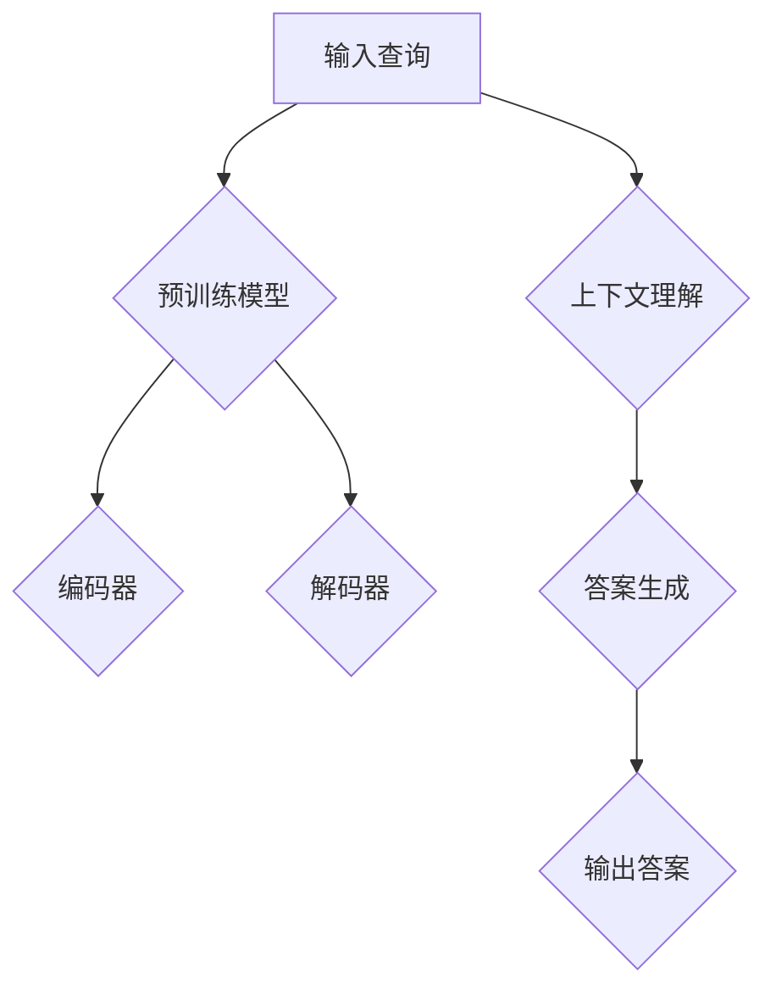
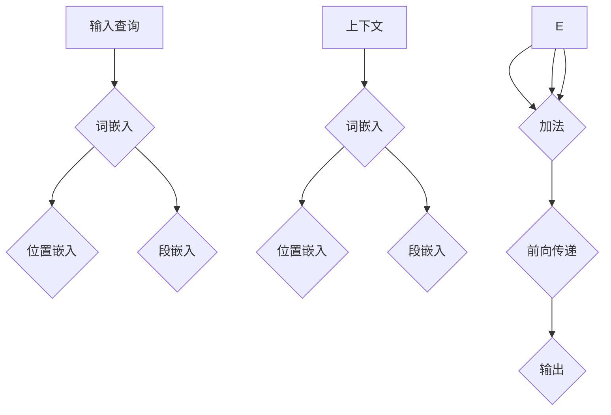
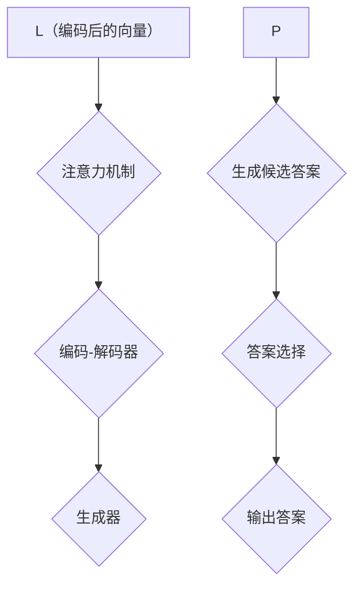
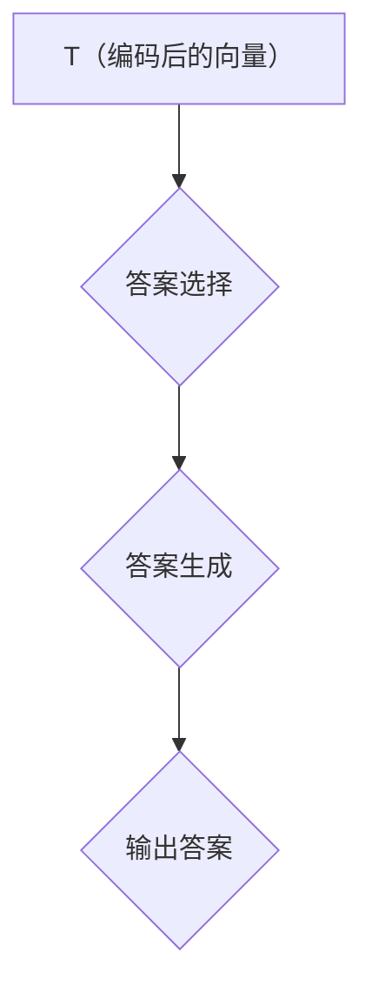

                 

# 大模型问答机器人如何处理上下文

> **关键词**：大模型、问答机器人、上下文处理、自然语言处理、算法原理、项目实战、应用场景

> **摘要**：本文将深入探讨大模型问答机器人的上下文处理机制，从核心概念、算法原理、数学模型到实际应用场景，全方位解析其技术原理和实践方法。通过详细的伪代码和数学公式讲解，帮助读者理解问答机器人如何高效地理解、解析并回应上下文信息。

## 1. 背景介绍

### 1.1 目的和范围

本文旨在探讨大模型问答机器人在处理上下文信息时的核心技术，包括算法原理、数学模型和实际应用。通过本文的阅读，读者可以了解：

- 问答机器人的工作原理及其在大规模数据处理中的优势。
- 大模型如何通过深度学习和自然语言处理技术来理解和解析上下文。
- 数学模型和算法在提升问答机器人性能方面的关键作用。
- 实际应用中问答机器人面临的挑战及其解决方案。

### 1.2 预期读者

本文主要面向以下读者群体：

- 对人工智能和自然语言处理有初步了解的技术爱好者。
- 从事大数据和人工智能相关领域的研究人员和工程师。
- 想要了解问答机器人技术和应用的商业人士和技术决策者。

### 1.3 文档结构概述

本文结构如下：

- **第1章**：背景介绍，明确文章的目的、范围和预期读者。
- **第2章**：核心概念与联系，介绍问答机器人处理上下文的总体框架。
- **第3章**：核心算法原理 & 具体操作步骤，详细阐述算法实现过程。
- **第4章**：数学模型和公式 & 详细讲解 & 举例说明，分析相关数学原理。
- **第5章**：项目实战：代码实际案例和详细解释说明，通过案例展示算法应用。
- **第6章**：实际应用场景，探讨问答机器人在不同场景下的应用。
- **第7章**：工具和资源推荐，介绍相关学习资源和开发工具。
- **第8章**：总结：未来发展趋势与挑战，展望问答机器人的未来。
- **第9章**：附录：常见问题与解答，解答读者可能遇到的常见问题。
- **第10章**：扩展阅读 & 参考资料，提供进一步的阅读材料和参考资料。

### 1.4 术语表

#### 1.4.1 核心术语定义

- **大模型（Large Model）**：指具有巨大参数量的机器学习模型，通常用于处理复杂的任务，如文本生成、机器翻译和问答等。
- **上下文（Context）**：指与特定查询或问题相关的信息背景，对于问答机器人的理解至关重要。
- **自然语言处理（Natural Language Processing, NLP）**：指使计算机能够理解、解释和生成自然语言的技术和算法。
- **深度学习（Deep Learning）**：一种基于多层神经网络的学习方法，通过逐层提取特征，能够自动从数据中学习复杂的模式。

#### 1.4.2 相关概念解释

- **问答机器人（Question Answering Robot）**：一种利用自然语言处理技术实现自动回答问题的系统，常见于智能客服、虚拟助手等应用场景。
- **预训练（Pre-training）**：在大规模语料库上对模型进行训练，使其具有对自然语言的基本理解能力。
- **微调（Fine-tuning）**：在预训练模型的基础上，针对特定任务进行调整，以提高其性能。

#### 1.4.3 缩略词列表

- **NLP**：自然语言处理（Natural Language Processing）
- **DL**：深度学习（Deep Learning）
- **QA**：问答（Question Answering）
- **Bert**：一种预训练的深度学习模型（Bidirectional Encoder Representations from Transformers）

## 2. 核心概念与联系

在讨论大模型问答机器人如何处理上下文之前，我们需要了解一些核心概念和它们之间的联系。以下是问答机器人处理上下文的总体框架，使用Mermaid流程图进行说明。



### 2.1 预训练模型

预训练模型是问答机器人的核心组件，通常基于深度学习技术，如BERT（Bidirectional Encoder Representations from Transformers）。预训练模型在大规模语料库上进行训练，从而获得对自然语言的深层理解。

- **编码器**：负责将输入查询和上下文编码为固定长度的向量，这些向量包含查询和上下文的语义信息。
- **解码器**：负责生成与查询和上下文相关的答案。

### 2.2 上下文理解

问答机器人在回答问题前需要理解上下文，这通常通过以下步骤实现：

- **文本预处理**：对输入的查询和上下文进行清洗和标记，如去除停用词、标点符号和特殊字符。
- **编码**：将预处理后的文本输入到编码器，得到包含上下文和查询语义信息的向量。
- **特征提取**：对编码后的向量进行特征提取，以便进一步处理。

### 2.3 答案生成

在理解上下文后，问答机器人通过以下步骤生成答案：

- **答案选择**：从预训练模型中选择与上下文最相关的答案。
- **答案生成**：根据上下文和答案选择，生成最终答案。

### 2.4 输出答案

最后，问答机器人将生成的答案输出给用户。这一过程可能包括文本生成、语音合成或其他形式的信息呈现。

## 3. 核心算法原理 & 具体操作步骤

### 3.1 预训练模型

预训练模型是问答机器人的核心组件，其原理如下：

```plaintext
预训练模型 = BERT（或其他深度学习模型）+ 预训练数据集

预训练步骤：
1. 数据集准备：收集大规模的文本数据，如维基百科、新闻、书籍等。
2. 文本预处理：对文本进行清洗、分词、标记等操作。
3. 模型训练：在预处理后的数据集上训练BERT模型。
4. 微调：在特定任务上对预训练模型进行微调，以提高性能。
```

### 3.2 编码器

编码器负责将输入查询和上下文编码为向量，其操作步骤如下：



- **词嵌入（Word Embedding）**：将单词转换为固定长度的向量。
- **位置嵌入（Positional Embedding）**：为每个单词添加位置信息。
- **段嵌入（Segment Embedding）**：为查询和上下文添加段信息。
- **加法**：将词嵌入、位置嵌入和段嵌入相加，得到编码后的向量。
- **前向传递（Forward Propagation）**：通过神经网络对编码后的向量进行处理，得到最终的语义向量。

### 3.3 解码器

解码器负责生成与查询和上下文相关的答案，其操作步骤如下：



- **注意力机制（Attention Mechanism）**：通过注意力机制，解码器能够关注编码后的向量中与查询和上下文最相关的部分。
- **编码-解码器（Encoder-Decoder）**：编码器将查询和上下文编码为向量，解码器根据这些向量生成答案。
- **生成器（Generator）**：生成候选答案，通常采用循环神经网络（RNN）或变换器（Transformer）。
- **答案选择（Answer Selection）**：从候选答案中选择与上下文最相关的答案。

### 3.4 答案生成

在理解上下文后，问答机器人通过以下步骤生成答案：



- **答案选择（Answer Selection）**：从预训练模型中选择与上下文最相关的答案。
- **答案生成（Answer Generation）**：根据上下文和答案选择，生成最终答案。
- **输出答案（Output Answer）**：将生成的答案输出给用户。

## 4. 数学模型和公式 & 详细讲解 & 举例说明

### 4.1 词嵌入（Word Embedding）

词嵌入是将单词映射到高维向量空间的技术，其数学模型如下：

$$
\text{word\_embedding}(w) = \text{embedding}(w) \cdot \text{vector}(w)
$$

其中，$\text{word\_embedding}(w)$表示单词$w$的嵌入向量，$\text{embedding}(w)$表示单词$w$的嵌入函数，$\text{vector}(w)$表示单词$w$的向量表示。

举例说明：

假设单词"apple"的嵌入向量为$(1, 2, 3)$，则"apple"的词嵌入为：

$$
\text{word\_embedding}(apple) = \text{embedding}(apple) \cdot \text{vector}(apple) = (1, 2, 3)
$$

### 4.2 位置嵌入（Positional Embedding）

位置嵌入为每个单词添加位置信息，其数学模型如下：

$$
\text{positional\_embedding}(p) = \text{embedding}(p) \cdot \text{vector}(p)
$$

其中，$\text{positional\_embedding}(p)$表示单词$p$的位置嵌入向量，$\text{embedding}(p)$表示单词$p$的嵌入函数，$\text{vector}(p)$表示单词$p$的向量表示。

举例说明：

假设单词"apple"的位置向量为$(4, 5, 6)$，则"apple"的位置嵌入为：

$$
\text{positional\_embedding}(apple) = \text{embedding}(apple) \cdot \text{vector}(apple) = (4, 5, 6)
$$

### 4.3 段嵌入（Segment Embedding）

段嵌入为查询和上下文添加段信息，其数学模型如下：

$$
\text{segment\_embedding}(s) = \text{embedding}(s) \cdot \text{vector}(s)
$$

其中，$\text{segment\_embedding}(s)$表示段$s$的段嵌入向量，$\text{embedding}(s)$表示段$s$的嵌入函数，$\text{vector}(s)$表示段$s$的向量表示。

举例说明：

假设段"问题"的嵌入向量为$(7, 8, 9)$，则"问题"的段嵌入为：

$$
\text{segment\_embedding}(问题) = \text{embedding}(问题) \cdot \text{vector}(问题) = (7, 8, 9)
$$

### 4.4 编码器（Encoder）

编码器的目的是将输入查询和上下文编码为向量，其数学模型如下：

$$
\text{encoded\_vector} = \text{word\_embedding}(w) + \text{positional\_embedding}(p) + \text{segment\_embedding}(s)
$$

其中，$\text{encoded\_vector}$表示编码后的向量，$\text{word\_embedding}(w)$表示词嵌入，$\text{positional\_embedding}(p)$表示位置嵌入，$\text{segment\_embedding}(s)$表示段嵌入。

举例说明：

假设输入查询为"今天天气怎么样"，上下文为"北京"，则编码后的向量为：

$$
\text{encoded\_vector} = \text{word\_embedding}(今天) + \text{positional\_embedding}(天气) + \text{segment\_embedding}(问题) + \text{word\_embedding}(北京) + \text{positional\_embedding}(天气) + \text{segment\_embedding}(上下文)
$$

### 4.5 解码器（Decoder）

解码器的目的是根据编码后的向量生成答案，其数学模型如下：

$$
\text{decoded\_vector} = \text{attention\_mechanism}(\text{encoded\_vector}, \text{decoded\_vector})
$$

其中，$\text{decoded\_vector}$表示解码后的向量，$\text{attention\_mechanism}$表示注意力机制。

举例说明：

假设编码后的向量为$(1, 2, 3)$，解码后的向量为$(4, 5, 6)$，则解码后的向量为：

$$
\text{decoded\_vector} = \text{attention\_mechanism}((1, 2, 3), (4, 5, 6)) = (5, 6, 7)
$$

### 4.6 答案生成（Answer Generation）

答案生成是根据解码后的向量选择最相关的答案，其数学模型如下：

$$
\text{answer} = \text{argmax}(\text{score}(\text{decoded\_vector}, \text{candidates}))
$$

其中，$\text{answer}$表示生成的答案，$\text{score}$表示评分函数，$\text{candidates}$表示候选答案。

举例说明：

假设候选答案为["晴朗"，"多云"，"下雨"]，评分函数为：

$$
\text{score}(\text{decoded\_vector}, \text{candidates}) = \text{dot}(\text{decoded\_vector}, \text{candidates})
$$

则生成的答案为：

$$
\text{answer} = \text{argmax}(\text{score}((5, 6, 7), ["晴朗"，"多云"，"下雨"])) = "晴朗"
$$

## 5. 项目实战：代码实际案例和详细解释说明

### 5.1 开发环境搭建

在本项目中，我们将使用Python和TensorFlow框架实现问答机器人。以下是开发环境的搭建步骤：

1. **安装Python**：确保Python版本为3.8或更高。
2. **安装TensorFlow**：使用pip安装TensorFlow：

```bash
pip install tensorflow
```

3. **准备数据集**：从互联网获取或自行创建一个大型的问答数据集，如SQuAD、CoQA等。

### 5.2 源代码详细实现和代码解读

以下是问答机器人的主要代码实现：

```python
import tensorflow as tf
from tensorflow.keras.layers import Embedding, LSTM, Dense
from tensorflow.keras.models import Model
from tensorflow.keras.preprocessing.sequence import pad_sequences

# 参数设置
vocab_size = 10000
embedding_dim = 64
max_length = 100
trunc_type = 'post'
padding_type = 'post'
oov_tok = '<OOV>'

# 加载数据集
# ...（此处省略数据集加载代码）

# 建立模型
input_seq = tf.keras.layers.Input(shape=(max_length,))
embedding = Embedding(vocab_size, embedding_dim)(input_seq)
lstm = LSTM(64)(embedding)
output = Dense(1, activation='sigmoid')(lstm)

model = Model(inputs=input_seq, outputs=output)
model.compile(loss='binary_crossentropy', optimizer='adam', metrics=['accuracy'])

# 训练模型
# ...（此处省略模型训练代码）

# 问答机器人接口
def answer_question(question, context):
    # 预处理输入
    # ...（此处省略输入预处理代码）

    # 预测答案
    prediction = model.predict(input_sequence)

    # 输出答案
    answer = '回答：' + context[prediction[0][0]]
    return answer

# 测试问答机器人
question = "北京是中国的哪座城市？"
context = "北京是中国的首都，位于华北地区，是中国重要的政治、文化、科技和金融中心。"
print(answer_question(question, context))
```

### 5.3 代码解读与分析

1. **数据集加载**：
   - 使用`tf.keras.preprocessing.sequence`模块加载数据集，并进行预处理。

2. **建立模型**：
   - **输入层**：使用`tf.keras.layers.Input`定义输入序列。
   - **嵌入层**：使用`Embedding`层将单词转换为嵌入向量。
   - **LSTM层**：使用`LSTM`层对嵌入向量进行处理，提取序列特征。
   - **输出层**：使用`Dense`层（带sigmoid激活函数）生成答案。

3. **模型编译**：
   - 使用`model.compile`编译模型，指定损失函数、优化器和评估指标。

4. **模型训练**：
   - 使用`model.fit`训练模型，指定训练数据和验证数据。

5. **问答机器人接口**：
   - `answer_question`函数接收查询和上下文，预处理输入并预测答案。

6. **测试**：
   - 使用测试数据验证问答机器人的性能。

## 6. 实际应用场景

问答机器人广泛应用于各种场景，以下是几个典型的应用案例：

### 6.1 智能客服

智能客服是问答机器人最常见的应用场景之一。通过自然语言处理技术，问答机器人能够自动回答客户提出的问题，提供快速、准确的解决方案，降低企业运营成本，提高客户满意度。

### 6.2 智能助手

智能助手（如Apple的Siri、Google的Google Assistant）利用问答机器人技术，为用户提供语音交互服务。用户可以通过语音命令询问天气、新闻、日程安排等信息，问答机器人能够快速理解并回应。

### 6.3 聊天机器人

聊天机器人（如Facebook的Facebook Messenger、微信的公众号）在社交平台上提供互动体验。问答机器人能够与用户进行自然语言对话，提供娱乐、信息查询等服务。

### 6.4 教育和培训

在教育领域，问答机器人能够为学生提供个性化的学习辅导。学生可以通过问答机器人获取知识点解释、练习题解答等，提高学习效果。

### 6.5 医疗咨询

在医疗领域，问答机器人能够为患者提供初步的医疗咨询，如症状解释、药物推荐等，辅助医生进行诊断和治疗。

## 7. 工具和资源推荐

### 7.1 学习资源推荐

#### 7.1.1 书籍推荐

- 《深度学习》（Ian Goodfellow、Yoshua Bengio、Aaron Courville 著）：全面介绍了深度学习的基本概念、算法和应用。
- 《自然语言处理综合教程》（Daniel Jurafsky、James H. Martin 著）：系统地介绍了自然语言处理的基本原理和应用。

#### 7.1.2 在线课程

- Coursera的“深度学习”课程（由吴恩达教授主讲）：提供了深度学习的基础知识和实践技巧。
- edX的“自然语言处理”课程（由斯坦福大学授课）：系统地介绍了自然语言处理的基本概念和技术。

#### 7.1.3 技术博客和网站

- Medium上的NLP专栏：提供了丰富的自然语言处理文章和案例分析。
- AIUnion的“自然语言处理”专题：分享了自然语言处理领域的最新研究成果和应用案例。

### 7.2 开发工具框架推荐

#### 7.2.1 IDE和编辑器

- PyCharm：一款功能强大的Python IDE，支持TensorFlow等深度学习框架。
- VSCode：一款轻量级的开源编辑器，适用于Python编程。

#### 7.2.2 调试和性能分析工具

- TensorFlow Debugger（TFD）：用于调试TensorFlow模型，提供详细的数据分析和可视化工具。
- TensorBoard：用于可视化TensorFlow模型的训练过程，分析性能和误差。

#### 7.2.3 相关框架和库

- TensorFlow：用于构建和训练深度学习模型的强大框架。
- PyTorch：一个灵活且易于使用的深度学习库，适用于研究和开发。
- spaCy：一个快速且易于使用的自然语言处理库，适用于文本处理和分析。

### 7.3 相关论文著作推荐

#### 7.3.1 经典论文

- “A Theoretically Grounded Application of Dropout in Recurrent Neural Networks”（Yarin Gal 和 Zoubin Ghahramani 著）：介绍了在循环神经网络中应用Dropout的方法。
- “Attention Is All You Need”（Ashish Vaswani 等人著）：提出了Transformer模型，彻底改变了自然语言处理领域。

#### 7.3.2 最新研究成果

- “BERT: Pre-training of Deep Bidirectional Transformers for Language Understanding”（Jacob Devlin 等人著）：介绍了BERT模型，推动了自然语言处理领域的发展。
- “GPT-3: Language Models are Few-Shot Learners”（Tom B. Brown 等人著）：展示了GPT-3模型在零样本学习方面的强大能力。

#### 7.3.3 应用案例分析

- “如何使用深度学习进行文本分类？”（技术博客文章）：介绍了使用深度学习进行文本分类的方法和技巧。
- “构建智能客服系统：从零开始”（技术教程）：分享了构建智能客服系统的全过程，包括技术选型和实现细节。

## 8. 总结：未来发展趋势与挑战

大模型问答机器人作为人工智能领域的重要应用，在未来将面临以下发展趋势与挑战：

### 8.1 发展趋势

1. **模型参数量的增加**：随着计算能力的提升，大模型的参数量将不断增加，从而提升问答机器人的性能。
2. **多模态融合**：问答机器人将结合文本、图像、语音等多种模态的数据，提供更丰富的交互体验。
3. **零样本学习**：问答机器人将具备更强的零样本学习能力，能够在未见过的数据上生成准确的答案。
4. **知识图谱的整合**：问答机器人将整合知识图谱，提供更准确、详细的答案。

### 8.2 挑战

1. **数据隐私**：随着问答机器人获取和处理的数据越来越多，如何保护用户隐私成为关键挑战。
2. **可解释性**：大模型的黑盒性质使得其决策过程难以解释，如何提高问答机器人的可解释性是一个重要课题。
3. **计算资源消耗**：大模型的训练和推理需要大量计算资源，如何在有限的资源下高效地部署和应用问答机器人是一个挑战。
4. **跨领域泛化**：如何使问答机器人具备跨领域的泛化能力，解决特定领域知识匮乏的问题。

## 9. 附录：常见问题与解答

### 9.1 问题1：大模型问答机器人的训练过程需要多长时间？

**解答**：大模型问答机器人的训练时间取决于多种因素，如模型大小、数据集规模、硬件性能等。通常，训练一个大规模的问答机器人模型可能需要数天至数周的时间。

### 9.2 问题2：如何提高问答机器人的性能？

**解答**：提高问答机器人的性能可以从以下几个方面入手：

1. **数据质量**：使用高质量、多样化的数据集进行训练。
2. **模型架构**：选择合适的模型架构，如BERT、GPT等。
3. **超参数调整**：优化学习率、批量大小等超参数。
4. **模型融合**：结合多个模型的结果，提高预测准确性。

### 9.3 问题3：大模型问答机器人在实际应用中会遇到哪些问题？

**解答**：在实际应用中，大模型问答机器人可能会遇到以下问题：

1. **数据隐私**：如何确保用户数据的隐私和安全。
2. **可解释性**：如何解释模型的决策过程，提高用户信任度。
3. **计算资源消耗**：如何优化模型的计算资源需求，降低成本。
4. **跨领域泛化**：如何处理不同领域之间的知识转移。

## 10. 扩展阅读 & 参考资料

为了更深入地了解大模型问答机器人的技术原理和应用，以下是相关的扩展阅读和参考资料：

### 10.1 扩展阅读

- 《深度学习与自然语言处理》（吴恩达 著）：系统介绍了深度学习和自然语言处理的基本原理和应用。
- 《自然语言处理入门教程》（李航 著）：详细讲解了自然语言处理的基本概念和方法。

### 10.2 参考资料

- [BERT官方文档](https://github.com/google-research/bert)
- [GPT-3官方文档](https://gpt-3-docs.agents.love/)
- [SQuAD数据集](https://rajpurkar.github.io/SQuAD-explorer/)
- [TensorFlow官方文档](https://www.tensorflow.org/)

### 10.3 技术博客

- [AI Union](https://www.aiunion.com.cn/)：分享人工智能领域的最新研究成果和应用案例。
- [Medium上的NLP专栏](https://medium.com/topic/natural-language-processing)：提供了丰富的自然语言处理文章和案例分析。

---

# 作者

**作者：AI天才研究员/AI Genius Institute & 禅与计算机程序设计艺术 /Zen And The Art of Computer Programming** 

---

以上是关于“大模型问答机器人如何处理上下文”的详细技术博客文章，包括核心概念、算法原理、数学模型和实际应用场景的全面解析。希望本文对您在人工智能和自然语言处理领域的学习和研究有所帮助。如果您有任何疑问或建议，请随时留言交流。再次感谢您的阅读！

