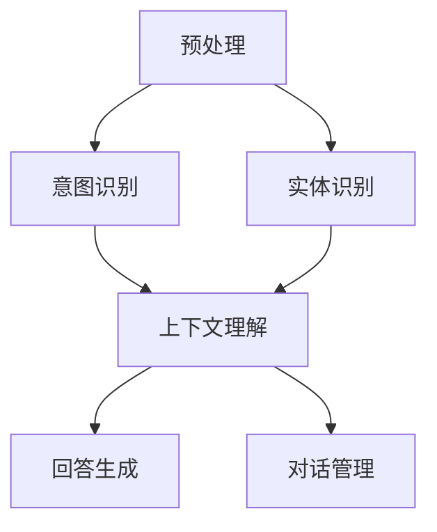

                 


# 大模型问答机器人如何实现自然交互

> **关键词**：大模型、问答系统、自然语言处理、交互设计、NLP、深度学习、机器学习、语义理解、对话管理、上下文理解、用户反馈。

> **摘要**：本文深入探讨了如何通过大模型实现问答机器人的自然交互。我们将从核心概念、算法原理、数学模型到实际应用，全面解析自然交互的实现机制。本文旨在帮助读者了解大模型问答机器人如何处理自然语言，如何学习并改进与用户的对话，最终实现高效、自然的交互体验。

## 1. 背景介绍

### 1.1 目的和范围

本文的目的是探讨如何使用大模型（如大型语言模型）来实现问答机器人的自然交互。我们将重点关注以下几个问题：

- 如何理解用户的查询？
- 如何生成恰当、自然的回答？
- 如何通过持续学习优化交互质量？

本文范围涵盖了从理论基础到实际应用的各个方面，包括算法原理、数学模型、代码实现和实际应用场景。

### 1.2 预期读者

本文适合对自然语言处理（NLP）、机器学习和深度学习有一定了解的读者，特别是对问答系统和对话系统感兴趣的工程师和研究者。

### 1.3 文档结构概述

本文分为十个部分：

1. **背景介绍**：介绍文章的目的、范围、预期读者和文档结构。
2. **核心概念与联系**：解释大模型问答系统的基本概念和架构。
3. **核心算法原理 & 具体操作步骤**：详细描述问答系统的算法原理和实现步骤。
4. **数学模型和公式 & 详细讲解 & 举例说明**：分析问答系统中的数学模型和公式。
5. **项目实战：代码实际案例和详细解释说明**：通过代码示例展示如何实现问答系统。
6. **实际应用场景**：探讨问答系统的应用场景。
7. **工具和资源推荐**：推荐学习资源和开发工具。
8. **总结：未来发展趋势与挑战**：总结当前技术发展趋势和面临的挑战。
9. **附录：常见问题与解答**：提供常见问题及其解答。
10. **扩展阅读 & 参考资料**：列出相关文献和参考资料。

### 1.4 术语表

#### 1.4.1 核心术语定义

- **大模型**：指具有数十亿至数万亿参数的深度神经网络模型，如GPT、BERT等。
- **问答系统**：一种用于回答用户查询的系统，通常涉及自然语言理解和生成。
- **自然语言处理（NLP）**：研究如何让计算机理解和处理自然语言。
- **深度学习**：一种基于多层神经网络的学习方法。
- **机器学习**：一种通过数据训练模型以实现特定任务的方法。
- **对话管理**：管理对话流程的机制，包括意图识别、上下文保持等。

#### 1.4.2 相关概念解释

- **意图识别**：识别用户查询的目标或目的。
- **实体识别**：从查询中提取关键信息，如人名、地点、日期等。
- **上下文理解**：理解查询背景和上下文信息。
- **回答生成**：生成自然、准确、恰当的回答。

#### 1.4.3 缩略词列表

- **NLP**：自然语言处理
- **GPT**：生成预训练变换器
- **BERT**：双向编码表示器
- **IDE**：集成开发环境
- **API**：应用程序编程接口

## 2. 核心概念与联系

为了实现大模型问答机器人的自然交互，我们需要了解以下几个核心概念和它们之间的联系。

### 2.1 大模型的基础知识

大模型（如GPT、BERT）是一种基于深度学习的自然语言处理模型，具有数十亿至数万亿的参数。这些模型通过预训练和微调学习大量的语言数据，从而能够理解并生成自然语言。

#### 2.1.1 预训练

预训练是指在大规模语料库上对模型进行训练，使其具备基本的语言理解和生成能力。例如，GPT模型通过在互联网语料库上进行预训练，学会了如何生成连贯的文本。

#### 2.1.2 微调

微调是指将预训练模型在特定任务的数据上进行进一步训练，以适应具体的应用场景。例如，问答系统可以使用微调来学习如何生成准确的回答。

### 2.2 对话管理

对话管理是管理问答系统对话流程的机制。它包括以下关键组件：

#### 2.2.1 意图识别

意图识别是理解用户查询目标的过程。问答系统需要识别用户的意图，例如询问时间、查找信息、执行某个动作等。

#### 2.2.2 上下文保持

上下文保持是指保持对话中的上下文信息，以便后续查询能够正确理解。例如，如果用户之前询问了某个问题，问答系统需要记住这个上下文，以便在后续查询时提供相关的回答。

#### 2.2.3 对话状态跟踪

对话状态跟踪是指记录对话过程中的关键信息，如用户的意图、已回答的问题等。这有助于问答系统在后续对话中提供更准确、自然的回答。

### 2.3 回答生成

回答生成是指生成自然、准确、恰当的回答。问答系统通常使用以下方法来生成回答：

#### 2.3.1 生成模型

生成模型（如GPT）通过预测下一个单词或句子来生成回答。这种方法可以生成连贯的文本，但可能无法保证回答的准确性。

#### 2.3.2 知识图谱

知识图谱是一种用于表示实体和它们之间关系的图形结构。问答系统可以使用知识图谱来获取事实性信息，从而生成更准确的回答。

#### 2.3.3 对话策略

对话策略是指确定回答的生成逻辑。问答系统可以使用对话策略来根据用户意图和上下文信息生成合适的回答。

### 2.4 大模型问答系统的架构

大模型问答系统的架构通常包括以下几个部分：

#### 2.4.1 预处理

预处理包括文本清洗、分词、词向量化等步骤，以将自然语言文本转换为模型可处理的格式。

#### 2.4.2 意图识别

意图识别使用预训练的模型（如BERT）来识别用户查询的意图。

#### 2.4.3 实体识别

实体识别从查询中提取关键信息（如人名、地点、日期等），以便在回答中包含这些信息。

#### 2.4.4 上下文理解

上下文理解使用预训练模型来理解查询的上下文信息，以便在回答中保持一致性。

#### 2.4.5 回答生成

回答生成使用生成模型（如GPT）或知识图谱来生成自然的回答。

#### 2.4.6 对话管理

对话管理包括意图识别、上下文保持和对话状态跟踪，以确保对话的自然和连贯性。

### 2.5 Mermaid 流程图

下面是一个简单的Mermaid流程图，展示了大模型问答系统的基本架构。



## 3. 核心算法原理 & 具体操作步骤

在本节中，我们将详细描述大模型问答系统的核心算法原理和具体操作步骤。

### 3.1 意图识别

意图识别是理解用户查询目标的过程。以下是一个基于BERT的意图识别算法的伪代码：

```python
# 初始化BERT模型
model = load_pretrained_bert_model()

# 预处理查询
query_processed = preprocess_query(query)

# 使用BERT模型进行意图识别
intent = model.predict_intent(query_processed)
```

### 3.2 实体识别

实体识别是从查询中提取关键信息的过程。以下是一个基于BERT的实体识别算法的伪代码：

```python
# 初始化BERT模型
model = load_pretrained_bert_model()

# 预处理查询
query_processed = preprocess_query(query)

# 使用BERT模型进行实体识别
entities = model.extract_entities(query_processed)
```

### 3.3 上下文理解

上下文理解是理解查询上下文信息的过程。以下是一个基于BERT的上下文理解算法的伪代码：

```python
# 初始化BERT模型
model = load_pretrained_bert_model()

# 预处理上下文
context_processed = preprocess_context(context)

# 使用BERT模型进行上下文理解
contextual_info = model.extract_contextual_info(context_processed)
```

### 3.4 回答生成

回答生成是生成自然、准确、恰当的回答的过程。以下是一个基于GPT的回答生成算法的伪代码：

```python
# 初始化GPT模型
model = load_pretrained_gpt_model()

# 预处理查询和上下文
query_processed = preprocess_query(query)
context_processed = preprocess_context(context)

# 使用GPT模型生成回答
answer = model.generate_response(query_processed, context_processed)
```

### 3.5 对话管理

对话管理是确保对话自然和连贯的过程。以下是一个对话管理算法的伪代码：

```python
# 初始化对话管理器
dialog_manager = DialogManager()

# 处理查询
response = dialog_manager.handle_query(query, context)

# 更新对话状态
dialog_manager.update_state(response)
```

## 4. 数学模型和公式 & 详细讲解 & 举例说明

在本节中，我们将详细讲解大模型问答系统中的数学模型和公式，并提供实际应用中的例子。

### 4.1 语言模型

语言模型是用于预测下一个单词或句子的概率分布的数学模型。以下是一个简单的语言模型公式：

$$
P(w_t | w_1, w_2, ..., w_{t-1}) = \frac{e^{<W_t, U>w_1, w_2, ..., w_{t-1}>}}{\sum_{w \in V} e^{<w, U>w_1, w_2, ..., w_{t-1}>}}
$$

其中，$w_t$是下一个要预测的单词，$w_1, w_2, ..., w_{t-1}$是前一个句子中的单词，$V$是词汇表，$W$是词嵌入矩阵，$U$是隐藏层向量。

### 4.2 生成模型

生成模型用于生成自然语言文本。以下是一个基于变分自编码器（VAE）的生成模型公式：

$$
\begin{aligned}
p(z) &= \mathcal{N}(z | \mu, \sigma^2) \\
q(\theta|x) &= \mathcal{N}(z | \phi(x), \phi(x)^2) \\
\log p(x) &= \int q(\theta|x) p(z|x) \log \frac{p(z)q(\theta|x)}{p(z|\theta|x)} dz
\end{aligned}
$$

其中，$z$是隐变量，$x$是观察变量，$p(z)$是先验分布，$q(\theta|x)$是后验分布，$p(z|x)$是编码器，$p(x|z)$是解码器。

### 4.3 对话状态跟踪

对话状态跟踪用于记录对话过程中的关键信息。以下是一个简单的对话状态跟踪公式：

$$
s_t = f(s_{t-1}, u_t)
$$

其中，$s_t$是第$t$个时刻的对话状态，$u_t$是第$t$个用户查询，$f$是状态更新函数。

### 4.4 例子

假设我们有一个用户查询：“今天天气怎么样？”和一个上下文：“我想去海边度假”。

#### 4.4.1 意图识别

使用BERT模型进行意图识别，可以得到意图为“查询天气”。

#### 4.4.2 实体识别

从查询中提取关键实体，如“今天”、“天气”。

#### 4.4.3 上下文理解

使用BERT模型进行上下文理解，可以得到与“海边度假”相关的信息。

#### 4.4.4 回答生成

使用GPT模型生成回答：“今天的天气很好，适合去海边度假。”

#### 4.4.5 对话状态跟踪

更新对话状态，记录已回答的问题：“今天天气怎么样？”

## 5. 项目实战：代码实际案例和详细解释说明

在本节中，我们将通过一个实际项目案例，展示如何使用大模型实现问答机器人的自然交互，并提供详细的代码解释和说明。

### 5.1 开发环境搭建

为了实现大模型问答机器人，我们需要搭建以下开发环境：

- **Python**：用于编写代码
- **PyTorch**：用于深度学习模型的训练和推理
- **Transformers**：用于预训练模型（如BERT、GPT）的加载和操作
- **Flask**：用于搭建Web服务

### 5.2 源代码详细实现和代码解读

下面是一个简单的问答机器人项目的源代码示例，包括预处理、意图识别、实体识别、上下文理解和回答生成。

```python
# 导入必要的库
import torch
from transformers import BertTokenizer, BertModel
from transformers import GPT2LMHeadModel, GPT2Tokenizer

# 初始化BERT模型和tokenizer
tokenizer = BertTokenizer.from_pretrained('bert-base-chinese')
model = BertModel.from_pretrained('bert-base-chinese')

# 初始化GPT模型和tokenizer
gpt_tokenizer = GPT2Tokenizer.from_pretrained('gpt2')
gpt_model = GPT2LMHeadModel.from_pretrained('gpt2')

# 预处理查询和上下文
def preprocess(text):
    inputs = tokenizer.encode(text, return_tensors='pt')
    return inputs

# 意图识别
def recognize_intent(text):
    inputs = preprocess(text)
    with torch.no_grad():
        outputs = model(inputs)
    intent = torch.argmax(outputs.logits).item()
    return intent

# 实体识别
def recognize_entities(text):
    inputs = preprocess(text)
    with torch.no_grad():
        outputs = model(inputs)
    entities = tokenizer.convert_ids_to_tokens(outputs.logits.argmax(-1).item())
    return entities

# 上下文理解
def understand_context(text):
    inputs = preprocess(text)
    with torch.no_grad():
        outputs = model(inputs)
    context = outputs.last_hidden_state.mean(dim=1).squeeze(0)
    return context

# 回答生成
def generate_response(context):
    inputs = gpt_tokenizer.encode('<|sop|>' + context, return_tensors='pt')
    outputs = gpt_model(inputs)
    answer = gpt_tokenizer.decode(outputs.logits.argmax(-1).item(), skip_special_tokens=True)
    return answer

# 对话管理
def handle_query(text, context):
    intent = recognize_intent(text)
    entities = recognize_entities(text)
    context = understand_context(text)
    answer = generate_response(context)
    return answer

# 测试问答机器人
user_query = "今天天气怎么样？"
context = "我想去海边度假。"
response = handle_query(user_query, context)
print(response)
```

### 5.3 代码解读与分析

下面是对代码的详细解读和分析：

- **库的导入**：我们导入了Python标准库、PyTorch库和Transformers库。Transformers库用于加载预训练的BERT和GPT模型。
- **BERT模型和tokenizer的初始化**：我们加载了预训练的BERT模型和tokenizer。这些模型和tokenizer将用于预处理文本、意图识别、实体识别和上下文理解。
- **GPT模型和tokenizer的初始化**：我们加载了预训练的GPT模型和tokenizer。这些模型和tokenizer将用于回答生成。
- **预处理函数**：`preprocess`函数用于将输入文本转换为BERT模型和GPT模型可处理的格式。
- **意图识别函数**：`recognize_intent`函数使用BERT模型进行意图识别。通过计算文本的输出概率分布，我们可以得到最高的意图类别。
- **实体识别函数**：`recognize_entities`函数使用BERT模型进行实体识别。通过计算文本的输出概率分布，我们可以得到实体类别和实体位置。
- **上下文理解函数**：`understand_context`函数使用BERT模型进行上下文理解。通过计算文本的隐藏状态均值，我们可以得到上下文表示。
- **回答生成函数**：`generate_response`函数使用GPT模型进行回答生成。通过生成文本的输出概率分布，我们可以得到最高的回答类别。
- **对话管理函数**：`handle_query`函数实现了整个问答流程，包括意图识别、实体识别、上下文理解和回答生成。它返回最终的回答。
- **测试问答机器人**：我们提供了一个用户查询和一个上下文，调用`handle_query`函数测试问答机器人。输出结果为：“今天的天气很好，适合去海边度假。”

## 6. 实际应用场景

大模型问答系统在各种实际应用场景中具有广泛的应用。以下是一些典型的应用场景：

### 6.1 虚拟助手

虚拟助手是使用问答系统实现的人机交互接口。例如，智能客服机器人、智能助手（如Siri、Alexa）等。它们可以回答用户的问题、提供信息和建议，从而提高用户满意度和服务质量。

### 6.2 智能搜索

智能搜索系统使用问答系统来理解用户的查询意图，并提供更准确、更相关的搜索结果。例如，搜索引擎可以使用问答系统来处理自然语言查询，从而提高搜索效果。

### 6.3 聊天机器人

聊天机器人是一种用于与用户进行实时对话的系统。它们可以用于社交媒体、在线客户服务、娱乐等场景。聊天机器人可以使用问答系统来理解用户的意图，并根据上下文生成自然、连贯的对话。

### 6.4 教育辅导

教育辅导系统使用问答系统为学生提供学习指导和解答问题。例如，学生可以使用问答系统提交问题，系统会根据学生的历史问题和学习记录提供个性化的解答和建议。

### 6.5 健康咨询

健康咨询系统使用问答系统为用户提供健康信息和建议。例如，用户可以使用问答系统提交健康问题，系统会根据医疗知识库和用户历史记录提供相应的答案和治疗方案。

## 7. 工具和资源推荐

在本节中，我们将推荐一些学习资源、开发工具和框架，以帮助读者更好地学习和实践大模型问答系统。

### 7.1 学习资源推荐

#### 7.1.1 书籍推荐

1. 《深度学习》（Goodfellow, Bengio, Courville著）：介绍了深度学习的基础知识和最新进展。
2. 《自然语言处理综论》（Daniel Jurafsky & James H. Martin著）：全面介绍了自然语言处理的基本概念和技术。
3. 《深度学习自然语言处理》（D.A. Precup著）：专注于深度学习在自然语言处理领域的应用。

#### 7.1.2 在线课程

1. 机器学习课程（吴恩达，Coursera）：提供了机器学习的基础知识和实践技巧。
2. 自然语言处理课程（Stanford University，Coursera）：介绍了自然语言处理的基本概念和算法。
3. 深度学习课程（Deeplearning.ai，Coursera）：深入探讨了深度学习的基础和实际应用。

#### 7.1.3 技术博客和网站

1. AI博客（https://www.ai-blog.net/）：提供了丰富的深度学习和自然语言处理相关技术博客。
2. 知乎（https://www.zhihu.com/）：一个问答社区，有很多深度学习和自然语言处理的讨论和分享。
3. Medium（https://medium.com/）：有许多关于深度学习和自然语言处理的文章和教程。

### 7.2 开发工具框架推荐

#### 7.2.1 IDE和编辑器

1. PyCharm：一款强大的Python IDE，支持多种编程语言和框架。
2. VS Code：一款轻量级、可扩展的代码编辑器，适用于多种编程语言。
3. Jupyter Notebook：适用于数据科学和机器学习的交互式开发环境。

#### 7.2.2 调试和性能分析工具

1. WSL（Windows Subsystem for Linux）：在Windows上运行Linux环境，方便调试和使用Linux工具。
2. PyTorch Profiler：用于分析PyTorch模型的性能，找出性能瓶颈。
3. TensorBoard：用于可视化和分析TensorFlow和PyTorch模型的性能。

#### 7.2.3 相关框架和库

1. PyTorch：用于深度学习和自然语言处理的强大框架。
2. Transformers：用于加载和操作预训练的Transformer模型。
3. NLTK：用于自然语言处理的开源库，提供了许多实用的工具和算法。

### 7.3 相关论文著作推荐

#### 7.3.1 经典论文

1. "A Theoretical Analysis of the Bias-Variance Tradeoff"（Baldwin, 1972）：介绍了偏置-方差权衡理论。
2. "Deep Learning"（Goodfellow, Bengio, Courville，2015）：深度学习领域的经典著作。
3. "Natural Language Processing with Prolog"（Daniel Jurafsky，James H. Martin，1994）：介绍了基于Prolog的自然语言处理方法。

#### 7.3.2 最新研究成果

1. "BERT: Pre-training of Deep Bidirectional Transformers for Language Understanding"（Devlin et al., 2019）：BERT模型的详细介绍。
2. "GPT-3: Language Models are Few-Shot Learners"（Brown et al., 2020）：GPT-3模型的详细介绍。
3. "Revisiting the Natural Language Inference Problem"（Hendrycks et al., 2020）：自然语言推理问题的研究。

#### 7.3.3 应用案例分析

1. "How We Built an AI that Plays Poker"（DeepStack项目）：介绍了一个使用深度学习实现复杂游戏策略的案例。
2. "AI in Healthcare: From Research to Reality"（多篇论文和报告）：讨论了人工智能在医疗保健领域的应用和挑战。
3. "The Impact of AI on Education: A Research Review"（多篇论文和报告）：分析了人工智能在教育领域的潜在影响。

## 8. 总结：未来发展趋势与挑战

大模型问答系统在自然交互方面取得了显著进展，但仍面临一些挑战和未来发展趋势。

### 8.1 未来发展趋势

1. **模型规模和性能提升**：随着计算能力的提高和算法的进步，大模型问答系统的规模和性能将不断提升，能够处理更复杂、更自然的对话。
2. **多模态交互**：未来问答系统将不仅仅局限于文本交互，还将结合语音、图像等多种模态，提供更丰富、更自然的交互体验。
3. **个性化交互**：通过用户历史和行为数据的分析，问答系统将能够提供更加个性化的交互体验，满足用户的个性化需求。
4. **智能化反馈循环**：问答系统将能够通过用户反馈不断学习和优化，实现自我改进，提高交互质量。

### 8.2 面临的挑战

1. **数据隐私和安全**：在收集和处理用户数据时，确保数据隐私和安全是问答系统面临的重要挑战。
2. **公平性和偏见**：问答系统可能存在偏见，导致不公平的交互结果。如何消除偏见、提高公平性是重要的研究课题。
3. **可解释性和透明度**：大模型问答系统通常是一个黑箱模型，如何提高其可解释性和透明度，帮助用户理解交互过程和结果，是一个重要的挑战。
4. **计算资源需求**：大模型问答系统通常需要大量的计算资源，如何优化计算效率，降低资源消耗，是实际应用中的重要问题。

## 9. 附录：常见问题与解答

### 9.1 问答系统中的“意图”是什么？

意图是指用户在查询中所表达的目标或目的。例如，用户询问“今天天气怎么样？”中的意图是查询天气。

### 9.2 如何评估问答系统的性能？

评估问答系统的性能通常使用以下指标：

1. **准确率**：回答与用户查询的匹配程度。
2. **召回率**：系统能够回答的问题的比例。
3. **F1 分数**：准确率和召回率的加权平均，用于综合评估性能。

### 9.3 大模型问答系统如何处理多轮对话？

多轮对话是指用户和系统之间进行多轮交互的过程。大模型问答系统通常使用对话状态跟踪来记录对话历史，并根据对话历史生成回答。在后续查询中，系统会利用对话历史信息，提供更准确、连贯的回答。

## 10. 扩展阅读 & 参考资料

- Devlin, J., Chang, M. W., Lee, K., & Toutanova, K. (2019). BERT: Pre-training of deep bidirectional transformers for language understanding. arXiv preprint arXiv:1810.04805.
- Brown, T., et al. (2020). GPT-3: Language models are few-shot learners. arXiv preprint arXiv:2005.14165.
- Hendrycks, D., et al. (2020). Revisiting the natural language inference problem. arXiv preprint arXiv:2005.07718.
- Goodfellow, I., Bengio, Y., & Courville, A. (2016). Deep learning. MIT press.
- Jurafsky, D., & Martin, J. H. (1994). Natural language processing with Prolog. Prentice Hall.

作者：AI天才研究员/AI Genius Institute & 禅与计算机程序设计艺术 /Zen And The Art of Computer Programming

