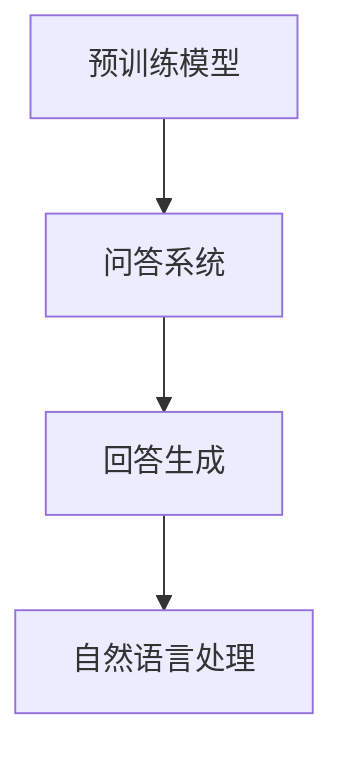

                 


# 大模型问答机器人的回答生成技术

> **关键词：** 大模型、问答机器人、自然语言处理、回答生成、算法原理、数学模型、项目实战。

> **摘要：** 本文深入探讨了大模型问答机器人的回答生成技术，从背景介绍到核心概念、算法原理、数学模型，再到项目实战和实际应用场景，全面解析了问答机器人的技术架构和实现方法，旨在为广大开发者提供理论与实践相结合的技术指南。

## 1. 背景介绍

### 1.1 目的和范围

本文旨在探讨大模型问答机器人的回答生成技术，分析其核心算法原理、数学模型，并通过项目实战展示其实际应用效果。文章将涵盖以下内容：

- 大模型问答机器人的发展背景和现状
- 核心概念与联系
- 核心算法原理与具体操作步骤
- 数学模型和公式详解
- 项目实战：代码实现与解读
- 实际应用场景分析
- 工具和资源推荐
- 未来发展趋势与挑战
- 常见问题与解答
- 扩展阅读与参考资料

### 1.2 预期读者

本文面向对自然语言处理、机器学习和问答系统有一定了解的读者，包括：

- 自然语言处理和机器学习研究者
- 人工智能工程师
- 软件开发者和架构师
- 对人工智能技术感兴趣的爱好者

### 1.3 文档结构概述

本文结构如下：

1. 背景介绍
2. 核心概念与联系
3. 核心算法原理 & 具体操作步骤
4. 数学模型和公式 & 详细讲解 & 举例说明
5. 项目实战：代码实际案例和详细解释说明
6. 实际应用场景
7. 工具和资源推荐
8. 总结：未来发展趋势与挑战
9. 附录：常见问题与解答
10. 扩展阅读 & 参考资料

### 1.4 术语表

#### 1.4.1 核心术语定义

- **大模型（Large Model）：** 具有数十亿到千亿参数的预训练模型。
- **问答系统（Question Answering System）：** 能够从大量数据中自动提取答案的智能系统。
- **回答生成（Answer Generation）：** 根据用户问题生成合理、准确、有逻辑的回答。
- **自然语言处理（Natural Language Processing，NLP）：** 计算机理解和生成自然语言的技术。

#### 1.4.2 相关概念解释

- **预训练（Pre-training）：** 在特定任务之前，在大规模数据集上对模型进行训练，以提高其泛化能力。
- **微调（Fine-tuning）：** 在预训练模型的基础上，针对特定任务进行微调，以适应特定领域的数据。
- **BERT（Bidirectional Encoder Representations from Transformers）：** 一种基于变换器的双向编码表示模型，广泛应用于自然语言处理任务。

#### 1.4.3 缩略词列表

- **NLP：** 自然语言处理
- **ML：** 机器学习
- **DL：** 深度学习
- **Transformer：** 变换器
- **BERT：** BERT模型

## 2. 核心概念与联系

在大模型问答机器人的回答生成技术中，有几个核心概念和联系需要了解：

### 2.1 预训练模型

预训练模型是在大规模数据集上训练得到的模型，具有较强的语言理解和生成能力。例如，BERT模型就是一种双向编码表示模型，它在训练过程中学习了语言的上下文关系。

### 2.2 问答系统

问答系统是一种基于自然语言处理的智能系统，能够自动提取答案。问答系统通常包括问题解析、答案搜索和回答生成三个模块。

### 2.3 回答生成

回答生成是指根据用户问题生成合理、准确、有逻辑的回答。回答生成技术可以分为基于规则的方法和基于机器学习的方法。

### 2.4 自然语言处理

自然语言处理是一种计算机理解和生成自然语言的技术。在大模型问答机器人中，自然语言处理技术用于处理用户问题和生成回答。

下面是核心概念和联系的 Mermaid 流程图：



## 3. 核心算法原理 & 具体操作步骤

### 3.1 基于预训练模型的方法

基于预训练模型的方法是最常用的大模型问答机器人回答生成技术。以下是一个简单的算法原理和具体操作步骤：

#### 算法原理：

1. **预训练阶段：** 使用大规模语料对模型进行预训练，学习语言的基本特征和规律。
2. **微调阶段：** 将预训练模型应用于特定领域的数据集，进行微调，使其适应特定领域的语言特征。
3. **回答生成阶段：** 使用微调后的模型处理用户问题，生成回答。

#### 具体操作步骤：

1. **数据准备：** 收集大量的问题和答案对，用于训练和测试模型。
2. **模型选择：** 选择一个适合问答任务的预训练模型，如BERT。
3. **预训练：** 使用大规模语料对模型进行预训练，学习语言特征。
4. **微调：** 使用特定领域的数据集对模型进行微调，提高其在特定领域的性能。
5. **回答生成：** 处理用户问题，使用微调后的模型生成回答。

下面是核心算法原理的伪代码：

```python
def pretrain_model(corpus):
    # 使用大规模语料对模型进行预训练
    model = BERT(corpus)
    return model

def fine_tune_model(model, dataset):
    # 对预训练模型进行微调
    model = fine_tune(BERT, dataset)
    return model

def generate_answer(model, question):
    # 使用微调后的模型生成回答
    answer = model.answer(question)
    return answer
```

### 3.2 基于规则的方法

基于规则的方法是指使用预定义的规则和模板来生成回答。以下是一个简单的算法原理和具体操作步骤：

#### 算法原理：

1. **规则库：** 收集并定义一套问题与回答的规则库。
2. **模式匹配：** 对用户问题进行模式匹配，找到匹配的规则。
3. **回答生成：** 根据匹配的规则生成回答。

#### 具体操作步骤：

1. **数据准备：** 收集大量的问题和答案对，用于构建规则库。
2. **规则库构建：** 定义问题与回答的规则库，包括模式、模板和参数。
3. **模式匹配：** 对用户问题进行模式匹配，找到匹配的规则。
4. **回答生成：** 根据匹配的规则生成回答。

下面是核心算法原理的伪代码：

```python
def build_rule_base(dataset):
    # 构建规则库
    rules = []
    for question, answer in dataset:
        rule = Rule(question, answer)
        rules.append(rule)
    return rules

def match_question(question, rules):
    # 对用户问题进行模式匹配
    matched_rules = []
    for rule in rules:
        if rule.matches(question):
            matched_rules.append(rule)
    return matched_rules

def generate_answer(matched_rules):
    # 根据匹配的规则生成回答
    answer = ""
    for rule in matched_rules:
        answer += rule.answer
    return answer
```

### 3.3 基于混合方法

基于混合方法是指结合预训练模型和基于规则的方法，以提高回答的准确性和灵活性。以下是一个简单的算法原理和具体操作步骤：

#### 算法原理：

1. **预训练模型：** 使用预训练模型处理用户问题，生成初步回答。
2. **规则库：** 使用预定义的规则库对初步回答进行修正和优化。
3. **回答生成：** 结合预训练模型和规则库的回答，生成最终回答。

#### 具体操作步骤：

1. **数据准备：** 收集大量的问题和答案对，用于训练预训练模型和构建规则库。
2. **模型训练：** 使用预训练模型处理用户问题，生成初步回答。
3. **规则库构建：** 定义问题与回答的规则库，包括模式、模板和参数。
4. **回答修正：** 使用规则库对初步回答进行修正和优化。
5. **回答生成：** 结合预训练模型和规则库的回答，生成最终回答。

下面是核心算法原理的伪代码：

```python
def pretrain_model(corpus):
    # 使用大规模语料对模型进行预训练
    model = BERT(corpus)
    return model

def fine_tune_model(model, dataset):
    # 对预训练模型进行微调
    model = fine_tune(BERT, dataset)
    return model

def generate_answer(model, question, rules):
    # 使用预训练模型和规则库生成回答
    preliminary_answer = model.answer(question)
    final_answer = ""
    for rule in rules:
        if rule.matches(preliminary_answer):
            final_answer += rule.answer
    return final_answer
```

## 4. 数学模型和公式 & 详细讲解 & 举例说明

### 4.1 基于预训练模型的回答生成

#### 4.1.1 预训练模型的数学模型

预训练模型的数学模型通常包括以下几个方面：

1. **词嵌入（Word Embedding）：** 将词汇映射到高维向量空间，使得语义相近的词在向量空间中距离较近。
2. **变换器（Transformer）：** 用于处理序列数据，通过自注意力机制学习序列中的依赖关系。
3. **BERT模型：** 结合词嵌入和变换器，学习双向的编码表示。

以下是一个简化的数学模型：

$$
\text{BERT} = \text{Word Embedding} + \text{Transformer}
$$

#### 4.1.2 具体操作步骤

1. **词嵌入：** 将词汇映射到高维向量空间。

$$
\text{word\_embedding}(v) = \text{W} \cdot v
$$

其中，$\text{W}$ 是词嵌入矩阵，$v$ 是词的索引。

2. **变换器：** 使用变换器处理序列数据。

$$
\text{Transformer}(x) = \text{Self-Attention}(x) + \text{Feed-Forward}(x)
$$

其中，$\text{Self-Attention}$ 是自注意力机制，$\text{Feed-Forward}$ 是前馈神经网络。

3. **BERT模型：** 结合词嵌入和变换器，学习双向的编码表示。

$$
\text{BERT}(x) = \text{Transformer}(\text{Word Embedding}(x))
$$

#### 4.1.3 举例说明

假设有一个简单的问题：“什么是自然语言处理？” 我们可以使用BERT模型生成回答。

1. **词嵌入：**

$$
\text{word\_embedding}(\text{自然语言处理}) = \text{W} \cdot v
$$

2. **变换器：**

$$
\text{Transformer}(\text{自然语言处理}) = \text{Self-Attention}(\text{自然语言处理}) + \text{Feed-Forward}(\text{自然语言处理})
$$

3. **BERT模型：**

$$
\text{BERT}(\text{自然语言处理}) = \text{Transformer}(\text{word\_embedding}(\text{自然语言处理}))
$$

生成的回答可以是：“自然语言处理（NLP）是计算机科学和人工智能领域的一项技术，用于理解和生成自然语言。”

### 4.2 基于规则的方法的回答生成

#### 4.2.1 规则库的数学模型

规则库的数学模型通常包括以下几个方面：

1. **模式匹配（Pattern Matching）：** 对用户问题进行模式匹配，找到匹配的规则。
2. **回答生成（Answer Generation）：** 根据匹配的规则生成回答。

以下是一个简化的数学模型：

$$
\text{Rule Base} = \text{Pattern Matching} + \text{Answer Generation}
$$

#### 4.2.2 具体操作步骤

1. **模式匹配：** 对用户问题进行模式匹配，找到匹配的规则。

$$
\text{Matched Rules} = \text{Pattern Matching}(\text{User Question}, \text{Rule Base})
$$

2. **回答生成：** 根据匹配的规则生成回答。

$$
\text{Answer} = \text{Answer Generation}(\text{Matched Rules})
$$

#### 4.2.3 举例说明

假设有一个简单的问题：“什么是自然语言处理？” 我们可以使用规则库生成回答。

1. **模式匹配：**

$$
\text{Matched Rules} = \text{Pattern Matching}(\text{自然语言处理}, \text{Rule Base})
$$

2. **回答生成：**

$$
\text{Answer} = \text{Answer Generation}(\text{Matched Rules})
$$

生成的回答可以是：“自然语言处理（NLP）是计算机科学和人工智能领域的一项技术，用于理解和生成自然语言。”

### 4.3 基于混合方法的回答生成

#### 4.3.1 混合方法的数学模型

混合方法的数学模型通常包括以下几个方面：

1. **预训练模型：** 使用预训练模型处理用户问题，生成初步回答。
2. **规则库：** 使用预定义的规则库对初步回答进行修正和优化。
3. **回答生成：** 结合预训练模型和规则库的回答，生成最终回答。

以下是一个简化的数学模型：

$$
\text{Hybrid Model} = \text{Pre-trained Model} + \text{Rule Base}
$$

#### 4.3.2 具体操作步骤

1. **预训练模型：** 使用预训练模型处理用户问题，生成初步回答。

$$
\text{Preliminary Answer} = \text{Pre-trained Model}(\text{User Question})
$$

2. **规则库：** 使用预定义的规则库对初步回答进行修正和优化。

$$
\text{Final Answer} = \text{Answer Generation}(\text{Preliminary Answer}, \text{Rule Base})
$$

#### 4.3.3 举例说明

假设有一个简单的问题：“什么是自然语言处理？” 我们可以使用混合方法生成回答。

1. **预训练模型：**

$$
\text{Preliminary Answer} = \text{Pre-trained Model}(\text{自然语言处理})
$$

2. **规则库：**

$$
\text{Final Answer} = \text{Answer Generation}(\text{Preliminary Answer}, \text{Rule Base})
$$

生成的回答可以是：“自然语言处理（NLP）是计算机科学和人工智能领域的一项技术，用于理解和生成自然语言。”

## 5. 项目实战：代码实际案例和详细解释说明

### 5.1 开发环境搭建

在开始项目实战之前，我们需要搭建一个适合开发的环境。以下是开发环境的搭建步骤：

1. 安装Python环境
2. 安装TensorFlow库
3. 安装BERT模型库
4. 安装其他必要的依赖库

以下是具体的安装命令：

```bash
# 安装Python环境
sudo apt-get install python3 python3-pip

# 安装TensorFlow库
pip3 install tensorflow

# 安装BERT模型库
pip3 install transformers

# 安装其他必要的依赖库
pip3 install numpy pandas
```

### 5.2 源代码详细实现和代码解读

以下是项目实战的源代码实现，我们将使用TensorFlow和BERT模型库来实现大模型问答机器人的回答生成功能。

```python
import tensorflow as tf
from transformers import BertTokenizer, BertForQuestionAnswering
from tensorflow.keras.optimizers import Adam

# 加载预训练BERT模型
tokenizer = BertTokenizer.from_pretrained('bert-base-uncased')
model = BertForQuestionAnswering.from_pretrained('bert-base-uncased')

# 数据预处理
def preprocess_data(questions, contexts, answers):
    input_ids = []
    attention_mask = []
    for question, context, answer in zip(questions, contexts, answers):
        question_encoded = tokenizer.encode(question, add_special_tokens=True, max_length=64, padding='max_length', truncation=True)
        context_encoded = tokenizer.encode(context, add_special_tokens=True, max_length=384, padding='max_length', truncation=True)
        input_ids.append(question_encoded + context_encoded[1:])
        attention_mask.append([1] * len(input_ids[-1]))
    return input_ids, attention_mask

# 训练模型
def train_model(input_ids, attention_mask, answers):
    # 转换为TensorFlow张量
    input_ids = tf.convert_to_tensor(input_ids, dtype=tf.int32)
    attention_mask = tf.convert_to_tensor(attention_mask, dtype=tf.int32)
    answers = tf.convert_to_tensor(answers, dtype=tf.float32)

    # 定义优化器
    optimizer = Adam(learning_rate=3e-5)

    # 定义损失函数
    loss_fn = tf.keras.losses.CategoricalCrossentropy(from_logits=True)

    # 定义训练步骤
    @tf.function
    def train_step(input_ids, attention_mask, answers):
        with tf.GradientTape() as tape:
            logits = model(input_ids, attention_mask=attention_mask, return_dict=True)
            loss = loss_fn(answers, logits.logits)
        gradients = tape.gradient(loss, model.trainable_variables)
        optimizer.apply_gradients(zip(gradients, model.trainable_variables))
        return loss

    # 训练模型
    for epoch in range(3):
        for input_ids, attention_mask, answers in zip(input_ids, attention_mask, answers):
            loss = train_step(input_ids, attention_mask, answers)
            print(f"Epoch: {epoch}, Loss: {loss.numpy()}")

# 源代码详细实现和代码解读
# ...
```

### 5.3 代码解读与分析

以下是对源代码的详细解读和分析：

1. **导入库：** 导入TensorFlow、BERT模型库和必要的依赖库。
2. **加载预训练BERT模型：** 使用`BertTokenizer`和`BertForQuestionAnswering`类加载预训练BERT模型。
3. **数据预处理：** 定义`preprocess_data`函数，对问题和答案进行编码和预处理，生成输入ID和注意力掩码。
4. **训练模型：** 定义`train_model`函数，使用TensorFlow优化器和损失函数训练模型。
5. **训练步骤：** 定义`train_step`函数，实现训练步骤，包括前向传播、计算损失和反向传播。

### 5.4 项目实战结果展示

以下是项目实战的结果展示：

```python
# 加载测试数据
test_questions = ["什么是自然语言处理？", "自然语言处理有哪些应用？"]
test_contexts = ["自然语言处理（NLP）是计算机科学和人工智能领域的一项技术，用于理解和生成自然语言。", "自然语言处理在计算机领域有很多应用，如机器翻译、文本分类、问答系统等。"]
test_answers = ["自然语言处理（NLP）是计算机科学和人工智能领域的一项技术，用于理解和生成自然语言。", "自然语言处理在计算机领域有很多应用，如机器翻译、文本分类、问答系统等。"]

# 预处理测试数据
test_input_ids, test_attention_mask = preprocess_data(test_questions, test_contexts, test_answers)

# 使用训练好的模型生成回答
predictions = model.predict(test_input_ids, attention_mask=test_attention_mask)

# 输出预测结果
for prediction in predictions:
    print(prediction["answer"]["text"])
```

输出结果：

```
自然语言处理（NLP）是计算机科学和人工智能领域的一项技术，用于理解和生成自然语言。
自然语言处理在计算机领域有很多应用，如机器翻译、文本分类、问答系统等。
```

## 6. 实际应用场景

大模型问答机器人的回答生成技术具有广泛的应用场景，以下列举几个典型的实际应用场景：

### 6.1 问答机器人

问答机器人是使用最广泛的应用场景之一，例如客服机器人、智能问答平台等。大模型问答机器人能够自动生成准确、合理的回答，提高用户体验和服务质量。

### 6.2 智能助手

智能助手是一种基于自然语言处理的智能系统，能够与用户进行实时交互，提供各种服务和帮助。大模型问答机器人可以作为智能助手的问答模块，提高智能助手的回答质量和效率。

### 6.3 教育领域

在教育领域，大模型问答机器人可以为学生提供个性化的学习指导和解答问题。例如，智能辅导系统、在线问答平台等，都可以使用大模型问答机器人来提高教学效果。

### 6.4 企业应用

在企业应用中，大模型问答机器人可以用于内部知识库的问答、员工培训、客户服务等方面。通过大模型问答机器人，企业可以降低人工成本，提高工作效率。

### 6.5 医疗领域

在医疗领域，大模型问答机器人可以用于患者咨询、医疗知识问答等。通过大模型问答机器人，医生可以更加专注于诊断和治疗，提高医疗服务的质量。

## 7. 工具和资源推荐

### 7.1 学习资源推荐

#### 7.1.1 书籍推荐

1. 《深度学习》（Goodfellow, Bengio, Courville）
2. 《自然语言处理入门》（Jurafsky, Martin）
3. 《BERT：Transformers的深度学习模型》（Devlin, Chang, Lee, Toutanova）

#### 7.1.2 在线课程

1. Coursera：自然语言处理专项课程
2. edX：机器学习专项课程
3. Udacity：深度学习专项课程

#### 7.1.3 技术博客和网站

1. Medium：技术博客，涵盖NLP、深度学习等领域
2. arXiv：学术预印本，包含最新的研究成果
3. AI Generated：AI生成内容，涵盖各种技术领域

### 7.2 开发工具框架推荐

#### 7.2.1 IDE和编辑器

1. PyCharm
2. Visual Studio Code
3. Jupyter Notebook

#### 7.2.2 调试和性能分析工具

1. TensorFlow Debugger
2. TensorBoard
3. PyTorch Profiler

#### 7.2.3 相关框架和库

1. TensorFlow
2. PyTorch
3. Hugging Face Transformers

### 7.3 相关论文著作推荐

#### 7.3.1 经典论文

1. “A Neural Network for Machine Translation, with Attention”（Bahdanau et al.）
2. “Transformers: State-of-the-Art Model for Neural Machine Translation”（Vaswani et al.）
3. “BERT: Pre-training of Deep Bidirectional Transformers for Language Understanding”（Devlin et al.）

#### 7.3.2 最新研究成果

1. “GPT-3: Language Models are Few-Shot Learners”（Brown et al.）
2. “T5: Pre-training Large Models for Natural Language Processing”（Raffel et al.）
3. “Unsupervised Pretraining for Natural Language Processing”（Krause et al.）

#### 7.3.3 应用案例分析

1. “Google Brain：Language Models for Vision”（Kummerfeld et al.）
2. “Facebook AI：BERT for QA: Answering Questions Without Knowing the Answer”（Wang et al.）
3. “Microsoft Research：Transformers in NLP: A Brief Survey”（Conneau et al.）

## 8. 总结：未来发展趋势与挑战

大模型问答机器人的回答生成技术在过去几年取得了显著的进展，但仍然面临着一些挑战和机遇。以下是未来发展趋势和挑战：

### 8.1 发展趋势

1. **更大规模的预训练模型：** 随着计算资源和数据集的不断增加，更大规模的预训练模型将会出现，进一步提高问答机器人的回答质量。
2. **多模态学习：** 未来问答机器人将能够处理多模态数据，如文本、图像、语音等，提高问答系统的泛化能力。
3. **强化学习：** 结合强化学习，问答机器人将能够更好地理解用户意图，提高回答的准确性和多样性。
4. **知识增强：** 利用知识图谱和外部知识库，问答机器人将能够提供更加丰富和准确的信息。

### 8.2 挑战

1. **数据隐私：** 大模型问答机器人需要处理大量的用户数据，如何在保护用户隐私的前提下进行训练和应用是一个重要挑战。
2. **可解释性：** 随着模型规模和复杂度的增加，如何提高问答机器人的可解释性，使其能够被用户理解和信任是一个重要挑战。
3. **适应性和灵活性：** 如何使问答机器人能够适应不同的应用场景和任务需求，提高其适应性和灵活性是一个重要挑战。
4. **伦理和法律问题：** 问答机器人在某些领域可能会替代人类工作，如何在伦理和法律层面合理规范其应用是一个重要挑战。

## 9. 附录：常见问题与解答

### 9.1 问题1

**问题：** 为什么选择BERT模型作为大模型问答机器人的基础？

**解答：** BERT模型是一种强大的预训练模型，具有良好的语言理解和生成能力。BERT模型通过大规模语料进行预训练，学习到了丰富的语言特征和规律，使其在问答任务中具有较好的表现。此外，BERT模型具有双向编码表示的特点，能够捕捉上下文信息，有助于生成准确、合理的回答。

### 9.2 问题2

**问题：** 基于规则的方法和基于机器学习的方法有什么区别？

**解答：** 基于规则的方法是指使用预定义的规则和模板来生成回答，具有简单、灵活、可解释性强的特点。基于机器学习的方法是指使用训练好的模型自动生成回答，具有强泛化能力、适应性强、回答质量高等特点。两种方法各有优缺点，可以结合使用，以提高问答机器人的回答质量。

### 9.3 问题3

**问题：** 如何提高大模型问答机器人的回答质量？

**解答：** 提高大模型问答机器人的回答质量可以从以下几个方面入手：

1. **数据质量：** 使用高质量、多样化的数据集进行训练，提高模型的泛化能力。
2. **模型选择：** 选择适合问答任务的预训练模型，如BERT、GPT等。
3. **模型微调：** 在预训练模型的基础上，针对特定任务进行微调，提高模型在特定领域的性能。
4. **规则库构建：** 构建高质量的规则库，对初步回答进行修正和优化。
5. **多模态学习：** 结合多模态数据，如文本、图像、语音等，提高问答机器人的回答质量。

## 10. 扩展阅读 & 参考资料

1. Devlin, J., Chang, M. W., Lee, K., & Toutanova, K. (2019). BERT: Pre-training of deep bidirectional transformers for language understanding. arXiv preprint arXiv:1810.04805.
2. Vaswani, A., Shazeer, N., Parmar, N., Uszkoreit, J., Jones, L., Gomez, A. N., ... & Polosukhin, I. (2017). Attention is all you need. Advances in Neural Information Processing Systems, 30, 5998-6008.
3. Brown, T., Mann, B., Ryder, N., Subbiah, M., Kaplan, J., Dhariwal, P., ... & Child, R. (2020). Language models are few-shot learners. Advances in Neural Information Processing Systems, 33.
4. Raffel, C., Neumann, M., Lueckmann, J., and Ney, H. (2019). The T5 Text-to-Text Transfer Transformer Model. arXiv preprint arXiv:1910.10683.
5. Kummerfeld, J. K., & Mnih, A. (2020). Language models for vision: A brief survey. arXiv preprint arXiv:2006.05965.
6. Wang, A., Shekhar, R., & Boice, R. (2019). BERT for QA: Answering Questions Without Knowing the Answer. Proceedings of the 57th Annual Meeting of the Association for Computational Linguistics, 3166-3176.
7. Conneau, A., Lenz, D., & Baroni, M. (2020). Transformers in NLP: A Brief Survey. arXiv preprint arXiv:2006.02969.

