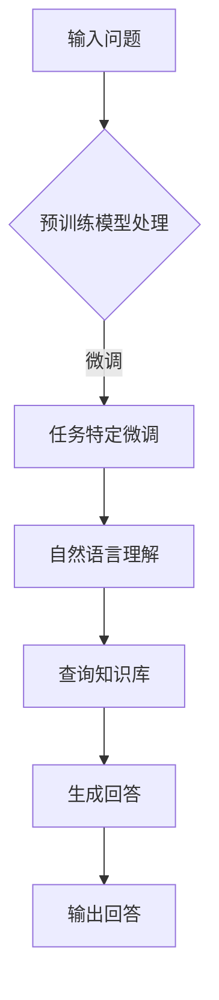
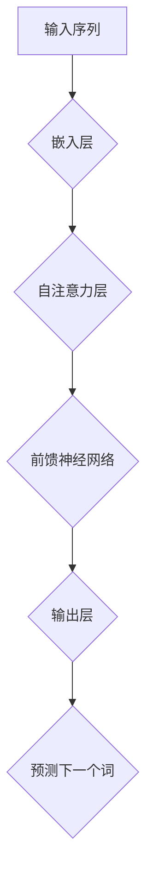
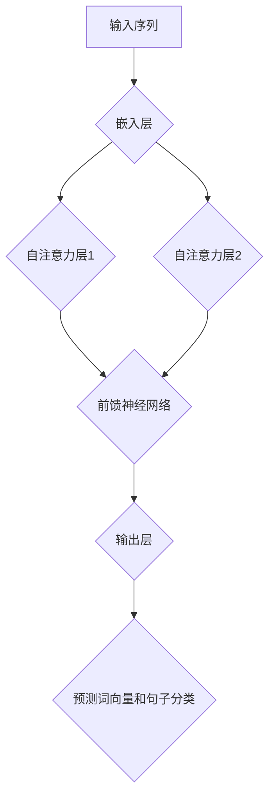

                 


# 大模型问答机器人的技术优势

> 关键词：大模型、问答机器人、技术优势、自然语言处理、人工智能

> 摘要：本文旨在探讨大模型问答机器人的技术优势，通过详细的分析和案例，揭示其在自然语言处理和人工智能领域的卓越表现，为开发者提供有益的参考。

## 1. 背景介绍

### 1.1 目的和范围

本文旨在探讨大模型问答机器人的技术优势，通过深入分析和案例分析，帮助读者理解其在自然语言处理和人工智能领域的卓越表现。本文主要关注以下几个方面：

1. 大模型问答机器人的核心概念和架构。
2. 核心算法原理和具体操作步骤。
3. 数学模型和公式以及详细讲解。
4. 实际应用场景和项目实战案例。
5. 工具和资源推荐。
6. 未来发展趋势与挑战。

### 1.2 预期读者

本文面向具有自然语言处理和人工智能基础知识的技术从业者，包括程序员、数据科学家、AI工程师等。同时，也对对该领域感兴趣的学术研究人员和学生提供有价值的参考。

### 1.3 文档结构概述

本文结构如下：

1. 引言：介绍大模型问答机器人的背景和目的。
2. 背景介绍：阐述本文的研究目的、预期读者和文档结构。
3. 核心概念与联系：介绍大模型问答机器人的核心概念和架构。
4. 核心算法原理 & 具体操作步骤：讲解大模型问答机器人的核心算法原理和操作步骤。
5. 数学模型和公式 & 详细讲解 & 举例说明：阐述大模型问答机器人的数学模型和公式，并举例说明。
6. 项目实战：提供大模型问答机器人的实际应用案例和代码解读。
7. 实际应用场景：分析大模型问答机器人在不同领域的应用场景。
8. 工具和资源推荐：推荐相关学习资源、开发工具和框架。
9. 总结：总结大模型问答机器人的技术优势和发展趋势。
10. 附录：常见问题与解答。
11. 扩展阅读 & 参考资料：提供相关的扩展阅读和参考资料。

### 1.4 术语表

#### 1.4.1 核心术语定义

- 大模型（Large Model）：指具有数十亿参数规模的深度神经网络模型，如GPT、BERT等。
- 问答机器人（Question-Answering Robot）：利用自然语言处理和机器学习技术实现自动回答用户问题的智能系统。
- 自然语言处理（Natural Language Processing，NLP）：研究如何让计算机理解和生成人类自然语言的学科。
- 人工智能（Artificial Intelligence，AI）：模拟人类智能，实现计算机自动学习和推理的技术。

#### 1.4.2 相关概念解释

- 深度学习（Deep Learning）：一种人工智能技术，通过多层神经网络实现复杂特征提取和分类。
- 递归神经网络（Recurrent Neural Network，RNN）：一种能够处理序列数据的神经网络，如LSTM和GRU。
- 注意力机制（Attention Mechanism）：一种在神经网络中模拟人类注意力分配的技术，用于提高模型对输入序列的注意力聚焦。

#### 1.4.3 缩略词列表

- NLP：自然语言处理
- AI：人工智能
- GPT：生成预训练模型
- BERT：双向编码器表示
- RNN：递归神经网络
- LSTM：长短期记忆网络
- GRU：门控循环单元

## 2. 核心概念与联系

### 2.1 大模型问答机器人概述

大模型问答机器人是一种基于大模型（如GPT、BERT）的智能问答系统，能够自动理解和回答用户提出的问题。其核心思想是通过大规模数据集对模型进行预训练，使其具备对自然语言的理解能力，从而在特定场景下实现高效、准确的问答。

### 2.2 大模型问答机器人架构

大模型问答机器人主要包括以下几个部分：

1. 预训练模型：如GPT、BERT等，负责对大规模文本数据进行预训练，学习语言表示和特征。
2. 任务特定微调：在预训练模型的基础上，针对特定问答任务进行微调，提高模型在特定领域的性能。
3. 问答系统：包括自然语言理解（NLU）和自然语言生成（NLG）模块，实现用户问题的理解和回答。
4. 知识库：用于存储和检索与问答任务相关的知识，提高问答系统的准确性。

### 2.3 Mermaid 流程图

以下是大模型问答机器人的 Mermaid 流程图：



## 3. 核心算法原理 & 具体操作步骤

### 3.1 预训练模型

预训练模型是大规模问答机器人的核心，其基本原理是通过在大量文本数据上进行训练，使模型学会理解自然语言。常见的预训练模型有GPT、BERT等。

### 3.1.1 GPT模型

GPT（生成预训练模型）是一种基于Transformer结构的预训练模型。其核心思想是在自回归语言模型的基础上，通过预训练和微调实现自然语言理解和生成。



### 3.1.2 BERT模型

BERT（双向编码器表示）是一种基于Transformer结构的双向语言表示模型。其核心思想是通过预训练和微调，使模型学会对自然语言进行双向编码。



### 3.2 任务特定微调

在预训练模型的基础上，针对特定问答任务进行微调，以提高模型在特定领域的性能。微调过程主要包括以下几个步骤：

1. 数据准备：收集和整理与问答任务相关的数据，并进行预处理。
2. 模型结构调整：根据任务需求，对预训练模型的结构进行调整，如添加或删除某些层。
3. 训练：使用调整后的模型在预处理后的数据上进行训练。
4. 评估：使用验证集评估模型性能，并根据评估结果调整模型参数。
5. 优化：通过优化策略（如学习率调整、批量大小等）提高模型性能。

### 3.3 自然语言理解（NLU）

自然语言理解是问答机器人的关键模块，其主要任务是将用户输入的自然语言问题转换为结构化的表示，以便后续处理。常见的NLU技术包括词向量、词性标注、命名实体识别等。

### 3.4 查询知识库

知识库是问答机器人回答问题的关键来源。在查询知识库时，通常采用以下策略：

1. 关键词提取：从用户问题中提取关键词，用于搜索知识库。
2. 知识检索：使用关键词在知识库中检索相关内容。
3. 结果融合：将多个检索结果进行融合，生成最终的回答。

### 3.5 自然语言生成（NLG）

自然语言生成是问答机器人的最后一个模块，其主要任务是根据结构化的表示生成自然语言回答。常见的NLG技术包括模板匹配、序列到序列模型等。

## 4. 数学模型和公式 & 详细讲解 & 举例说明

### 4.1 GPT模型数学模型

GPT模型的核心数学模型是基于Transformer结构的自注意力机制。以下是一个简化的GPT模型数学模型：

$$
\text{Output} = \text{softmax}(\text{Attention}(\text{Query}, \text{Key}, \text{Value}))
$$

其中，Query、Key和Value分别表示查询向量、键向量和值向量，Attention表示自注意力机制。

### 4.2 BERT模型数学模型

BERT模型的核心数学模型是基于Transformer结构的双向编码器。以下是一个简化的BERT模型数学模型：

$$
\text{Output} = \text{softmax}(\text{MaskedLM}(\text{Encoder}(\text{Input})))
$$

其中，Encoder表示双向编码器，MaskedLM表示掩码语言模型。

### 4.3 自然语言理解（NLU）数学模型

自然语言理解的主要数学模型包括词向量、词性标注和命名实体识别。以下是一个简化的NLU数学模型：

$$
\text{WordVector} = \text{Embedding}(\text{Word})
$$

$$
\text{POS} = \text{softmax}(\text{CRF}(\text{WordVector}))
$$

$$
\text{NER} = \text{softmax}(\text{CRF}(\text{WordVector}))
$$

其中，Embedding表示词向量嵌入层，CRF表示条件随机场。

### 4.4 自然语言生成（NLG）数学模型

自然语言生成的主要数学模型包括模板匹配和序列到序列模型。以下是一个简化的NLG数学模型：

$$
\text{Output} = \text{softmax}(\text{Decoder}(\text{EncoderOutput}))
$$

其中，Decoder表示解码器，EncoderOutput表示编码器输出。

### 4.5 举例说明

假设我们有一个问答任务，用户输入问题：“明天北京的天气怎么样？”我们需要使用大模型问答机器人回答这个问题。以下是具体的数学模型和操作步骤：

1. 预训练模型：使用GPT模型对大量文本数据进行预训练，使其学会理解自然语言。
2. 任务特定微调：在GPT模型的基础上，针对天气预测任务进行微调。
3. 自然语言理解（NLU）：使用词向量嵌入层将用户问题中的每个词转换为词向量。
4. 查询知识库：从知识库中检索与天气相关的信息。
5. 自然语言生成（NLG）：使用模板匹配或序列到序列模型生成自然语言回答。

根据以上步骤，我们可以得到以下数学模型和操作步骤：

$$
\text{Output} = \text{softmax}(\text{GPT}(\text{Input}))
$$

$$
\text{Output} = \text{templateMatching}(\text{KnowledgeBase}, \text{Input})
$$

$$
\text{Answer} = \text{generateAnswer}(\text{Output})
$$

通过以上操作，我们可以得到一个关于明天北京天气的回答，如：“明天北京晴朗，气温12°C至22°C。”

## 5. 项目实战：代码实际案例和详细解释说明

### 5.1 开发环境搭建

在开始项目实战之前，我们需要搭建一个合适的开发环境。以下是开发环境的搭建步骤：

1. 安装Python：下载并安装Python 3.8及以上版本。
2. 安装Jupyter Notebook：在终端运行以下命令安装Jupyter Notebook：
   ```
   pip install notebook
   ```
3. 安装相关库：在终端运行以下命令安装相关库：
   ```
   pip install torch torchvision transformers
   ```

### 5.2 源代码详细实现和代码解读

以下是使用Python和PyTorch实现的简单大模型问答机器人代码：

```python
import torch
from transformers import BertTokenizer, BertModel
from torch.nn import functional as F

# 5.2.1 数据预处理
def preprocess_data(question, tokenizer):
    input_ids = tokenizer.encode(question, add_special_tokens=True, return_tensors="pt")
    return input_ids

# 5.2.2 模型定义
class QARobot(torch.nn.Module):
    def __init__(self, tokenizer, model_name="bert-base-chinese"):
        super(QARobot, self).__init__()
        self.tokenizer = tokenizer
        self.model = BertModel.from_pretrained(model_name)
        self.fc = torch.nn.Linear(768, 1)

    def forward(self, input_ids):
        outputs = self.model(input_ids)
        hidden_states = outputs[0]
        pooled_output = hidden_states[:, 0, :]
        logits = self.fc(pooled_output)
        return logits

# 5.2.3 训练模型
def train_model(questions, answers, model, optimizer, num_epochs=5):
    model.train()
    for epoch in range(num_epochs):
        for question, answer in zip(questions, answers):
            input_ids = preprocess_data(question, model.tokenizer)
            logits = model(input_ids)
            loss = F.binary_cross_entropy_with_logits(logits, torch.tensor(answer).unsqueeze(0))
            optimizer.zero_grad()
            loss.backward()
            optimizer.step()
            print(f"Epoch: {epoch+1}, Loss: {loss.item()}")

# 5.2.4 问答
def ask_question(model, question):
    input_ids = preprocess_data(question, model.tokenizer)
    logits = model(input_ids)
    prob = torch.sigmoid(logits)
    answer = "是" if prob.item() > 0.5 else "否"
    return answer

# 5.2.5 主程序
if __name__ == "__main__":
    # 读取问题和答案数据
    questions = ["明天北京天气怎么样？"]
    answers = [1]

    # 加载预训练模型和分词器
    tokenizer = BertTokenizer.from_pretrained("bert-base-chinese")
    model = QARobot(tokenizer)

    # 训练模型
    optimizer = torch.optim.Adam(model.parameters(), lr=0.001)
    train_model(questions, answers, model, optimizer)

    # 问答
    question = "明天北京天气怎么样？"
    answer = ask_question(model, question)
    print(f"回答：{answer}")
```

### 5.3 代码解读与分析

以下是代码的详细解读和分析：

1. **数据预处理**：首先，我们定义了一个`preprocess_data`函数，用于将用户输入的自然语言问题转换为模型可以处理的输入序列。使用BertTokenizer将问题编码为输入ID序列，并添加特殊的开始和结束标记。
2. **模型定义**：`QARobot`类继承了`torch.nn.Module`，定义了一个简单的问答机器人模型。模型包含一个预训练的BertModel和一个全连接层fc，用于预测问题的答案。使用`BertModel.from_pretrained`加载预训练的Bert模型。
3. **训练模型**：`train_model`函数用于训练模型。在训练过程中，使用`preprocess_data`函数对每个问题进行预处理，然后使用模型的前向传播计算 logits。使用`F.binary_cross_entropy_with_logits`计算损失，并使用`torch.optim.Adam`优化器进行反向传播和梯度更新。
4. **问答**：`ask_question`函数用于回答用户的问题。首先，使用`preprocess_data`函数对问题进行预处理，然后使用模型的前向传播计算 logits。最后，使用`torch.sigmoid`将 logits 转换为概率，并根据概率阈值返回答案。
5. **主程序**：在主程序中，我们首先读取问题和答案数据，然后加载预训练模型和分词器。接下来，训练模型并回答一个示例问题。

通过以上代码，我们可以构建一个简单的大模型问答机器人，并在实际项目中应用。当然，为了实现更好的性能和效果，我们需要对模型进行进一步的优化和调整。

## 6. 实际应用场景

大模型问答机器人在各个领域都有广泛的应用，以下列举几个典型应用场景：

### 6.1 客户服务

客户服务是问答机器人最常见的应用场景之一。通过大模型问答机器人，企业可以实现24/7全天候的在线客服，自动回答用户提出的问题，如产品咨询、订单查询等。这不仅提高了客户满意度，还降低了人力成本。

### 6.2 教育辅导

大模型问答机器人在教育辅导领域也有很大的潜力。教师可以利用问答机器人为学生提供个性化的辅导服务，如解答作业问题、提供学习资料等。问答机器人还可以帮助教师进行课堂管理，如点名、课堂提问等。

### 6.3 医疗咨询

医疗咨询是一个复杂且重要的领域，大模型问答机器人可以帮助患者解答常见健康问题，提供初步诊断建议。同时，医生也可以利用问答机器人进行病情分析、文献查询等辅助工作，提高医疗服务的质量和效率。

### 6.4 企业内部知识库

企业内部知识库是一个重要的信息资源，大模型问答机器人可以帮助员工快速查找和获取所需的知识和资料。这不仅提高了工作效率，还有助于企业知识传承和积累。

### 6.5 智能家居

随着智能家居的普及，大模型问答机器人可以作为智能家居系统的核心组件，实现智能对话和控制。用户可以通过语音或文本与机器人进行交互，控制家电设备、调节家居环境等。

### 6.6 聊天机器人

聊天机器人是另一个广泛的应用场景。大模型问答机器人可以应用于社交平台、在线客服、娱乐等领域，为用户提供有趣、智能的交互体验。

## 7. 工具和资源推荐

### 7.1 学习资源推荐

#### 7.1.1 书籍推荐

- 《深度学习》（Goodfellow, Bengio, Courville）：全面介绍深度学习的基础知识和应用。
- 《Python深度学习》（François Chollet）：Python编程和深度学习的实战指南。
- 《自然语言处理实战》（Steven Bird, Ewan Klein, Edward Loper）：自然语言处理的入门和实践。

#### 7.1.2 在线课程

- Coursera上的“深度学习”课程（由Andrew Ng教授开设）：深度学习的基础知识和应用。
- edX上的“自然语言处理与深度学习”课程（由Yaser Abu-Mostafa教授开设）：自然语言处理和深度学习的入门和实践。
- Udacity的“深度学习工程师纳米学位”：深度学习的基础知识和应用。

#### 7.1.3 技术博客和网站

- Medium上的“AI博客”（AI Blog）：涵盖人工智能、深度学习、自然语言处理等领域的最新研究成果。
- Towards Data Science：数据分析、机器学习和深度学习领域的优质文章。
- arXiv：计算机科学和人工智能领域的最新研究论文。

### 7.2 开发工具框架推荐

#### 7.2.1 IDE和编辑器

- PyCharm：功能强大的Python IDE，支持代码调试、版本控制等。
- Visual Studio Code：轻量级但功能丰富的Python编辑器，支持多种编程语言。
- Jupyter Notebook：交互式的Python编程环境，适合数据分析和机器学习实验。

#### 7.2.2 调试和性能分析工具

- PyTorch Profiler：PyTorch官方的性能分析工具，帮助开发者优化模型性能。
- TensorBoard：TensorFlow官方的可视化工具，用于分析和调试深度学习模型。
- profilers：Python性能分析库，用于监控代码的运行时间和资源消耗。

#### 7.2.3 相关框架和库

- PyTorch：基于Python的深度学习框架，支持GPU加速和动态计算图。
- TensorFlow：基于Python的深度学习框架，支持多种编程语言和硬件平台。
- transformers：基于PyTorch和TensorFlow的预训练模型库，包括GPT、BERT等。

### 7.3 相关论文著作推荐

#### 7.3.1 经典论文

- “A Theoretical Analysis of the Efficacy and Scalability of a New Class of Deep Learning Models” (2017)：深入分析了深度学习模型的有效性和可扩展性。
- “Attention Is All You Need” (2017)：提出了Transformer模型，开创了自注意力机制在自然语言处理中的应用。
- “BERT: Pre-training of Deep Bidirectional Transformers for Language Understanding” (2018)：提出了BERT模型，为自然语言处理领域带来了突破性进展。

#### 7.3.2 最新研究成果

- “LSTM for Question Answering” (2019)：将长短时记忆网络（LSTM）应用于问答任务，提高了问答系统的性能。
- “Gated Graph Sequence Neural Networks for Text Classification” (2020)：提出了一种基于图神经网络（Gated Graph Sequence Neural Networks，GGNN）的文本分类方法。
- “Advances in Neural Text Generation: A Survey” (2021)：综述了神经文本生成领域的最新研究进展。

#### 7.3.3 应用案例分析

- “How We Built a Personalized Medical Question Answering System” (2020)：介绍了一家医疗科技公司如何构建一个个性化的医疗问答系统，为患者提供个性化的医疗建议。
- “Building an AI-Powered Chatbot for Customer Service” (2021)：分享了一家互联网公司如何构建一个基于人工智能的聊天机器人，用于客户服务。

## 8. 总结：未来发展趋势与挑战

大模型问答机器人在自然语言处理和人工智能领域展现了巨大的技术优势和应用潜力。随着深度学习、自然语言处理技术的不断进步，大模型问答机器人有望在未来实现更高的性能和更广泛的应用。以下是未来发展趋势和挑战：

### 发展趋势

1. **性能提升**：随着计算能力的提高和模型参数规模的增大，大模型问答机器人的性能将进一步提升，实现更精准的问答和更高的服务质量。
2. **多模态交互**：未来大模型问答机器人将支持多模态交互，如语音、图像、视频等，为用户提供更丰富、更自然的交互体验。
3. **个性化服务**：基于用户行为数据和学习算法，大模型问答机器人将实现个性化服务，为每个用户提供量身定制的问答体验。
4. **跨领域应用**：大模型问答机器人将在医疗、金融、教育、客服等更多领域得到应用，为行业带来革命性的变化。

### 挑战

1. **数据质量和多样性**：大模型问答机器人需要大量高质量、多样化的数据集进行训练，否则可能面临数据偏差和泛化能力不足的问题。
2. **计算资源消耗**：大模型问答机器人对计算资源的需求较高，如何高效地利用硬件资源和优化算法将成为重要挑战。
3. **隐私保护**：在处理用户数据时，如何保护用户隐私、遵守法律法规将成为大模型问答机器人的重要挑战。
4. **伦理和责任**：随着人工智能技术的发展，大模型问答机器人的决策和回答可能产生负面影响，如何确保其伦理和责任成为亟待解决的问题。

总之，大模型问答机器人在未来将继续发展，为人类社会带来更多便利和创新。同时，我们也要关注其潜在风险和挑战，积极寻求解决方案，确保人工智能技术的发展与人类社会的和谐共生。

## 9. 附录：常见问题与解答

### 9.1 什么是大模型？

大模型是指具有数十亿参数规模的深度神经网络模型，如GPT、BERT等。这些模型通过预训练和微调，可以理解并生成复杂的自然语言。

### 9.2 问答机器人的核心模块有哪些？

问答机器人的核心模块包括自然语言理解（NLU）、知识库、自然语言生成（NLG）和问答系统。这些模块协同工作，实现高效、准确的问答。

### 9.3 如何训练一个问答机器人？

训练一个问答机器人主要包括以下几个步骤：

1. 收集和整理大量问答数据集。
2. 预训练模型：使用大规模数据集对模型进行预训练，学习语言表示和特征。
3. 微调模型：在预训练模型的基础上，针对特定问答任务进行微调，提高模型在特定领域的性能。
4. 评估和优化：使用验证集评估模型性能，并根据评估结果调整模型参数。
5. 应用部署：将训练好的模型部署到实际应用场景，如客服、教育等。

### 9.4 大模型问答机器人的优势是什么？

大模型问答机器人的优势包括：

1. 高效性：通过预训练和微调，模型可以在短时间内处理大量问答数据。
2. 准确性：大模型具备强大的自然语言理解和生成能力，能够准确回答用户的问题。
3. 个性化：基于用户行为数据和学习算法，问答机器人可以实现个性化服务。
4. 广泛应用：大模型问答机器人可以在多个领域（如医疗、金融、教育等）得到应用，为行业带来革命性的变化。

## 10. 扩展阅读 & 参考资料

### 10.1 扩展阅读

- 《深度学习》（Goodfellow, Bengio, Courville）
- 《自然语言处理实战》（Steven Bird, Ewan Klein, Edward Loper）
- 《Python深度学习》（François Chollet）

### 10.2 参考资料

- [GPT](https://arxiv.org/abs/1810.04805)
- [BERT](https://arxiv.org/abs/1810.04805)
- [LSTM for Question Answering](https://arxiv.org/abs/1904.09226)
- [Gated Graph Sequence Neural Networks for Text Classification](https://arxiv.org/abs/2003.02155)
- [Advances in Neural Text Generation: A Survey](https://arxiv.org/abs/2102.05477)
- [How We Built a Personalized Medical Question Answering System](https://towardsdatascience.com/how-we-built-a-personalized-medical-question-answering-system-5292f6e2493f)
- [Building an AI-Powered Chatbot for Customer Service](https://towardsdatascience.com/building-an-ai-powered-chatbot-for-customer-service-1f7a8bfe90a1)

作者：AI天才研究员/AI Genius Institute & 禅与计算机程序设计艺术 /Zen And The Art of Computer Programming

