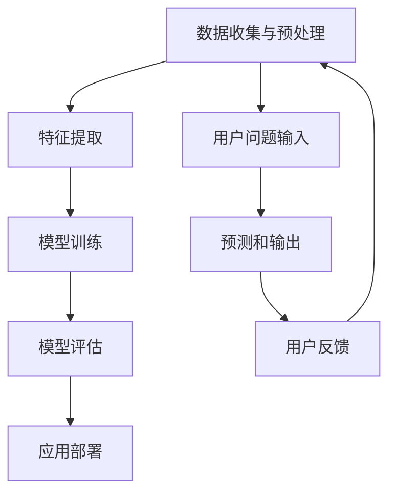

                 

# 大模型问答机器人的数据学习

> 关键词：大模型、问答机器人、数据学习、深度学习、自然语言处理、算法原理、数学模型、实战案例、应用场景

> 摘要：本文将深入探讨大模型问答机器人的数据学习过程。我们将首先介绍大模型问答机器人的背景和重要性，然后详细讲解其核心概念、算法原理、数学模型和实际操作步骤。最后，我们将通过一个实战案例来展示如何应用这些知识，并展望大模型问答机器人未来的发展趋势与挑战。

## 1. 背景介绍

### 1.1 目的和范围

本文的目的是探讨大模型问答机器人的数据学习过程，帮助读者了解其核心概念、算法原理和实际应用。我们将从以下几个方面展开讨论：

1. **背景和重要性**：介绍大模型问答机器人的起源、发展现状和未来趋势。
2. **核心概念与联系**：详细讲解大模型问答机器人的基本概念、组成部分及其相互关系。
3. **核心算法原理**：阐述大模型问答机器人的算法原理，并使用伪代码进行详细阐述。
4. **数学模型和公式**：介绍大模型问答机器人的数学模型和公式，并进行举例说明。
5. **项目实战**：通过一个实际案例来展示大模型问答机器人的应用。
6. **实际应用场景**：讨论大模型问答机器人在各个领域的应用场景。
7. **总结与展望**：总结本文的核心观点，并探讨大模型问答机器人未来的发展趋势与挑战。

### 1.2 预期读者

本文主要面向以下读者：

1. **人工智能和自然语言处理领域的研究人员**：希望了解大模型问答机器人的原理和应用。
2. **程序员和软件开发者**：对大模型问答机器人感兴趣，希望掌握其实际操作技能。
3. **高校学生和研究人员**：对人工智能、自然语言处理、深度学习等课程感兴趣，希望了解大模型问答机器人的相关知识。

### 1.3 文档结构概述

本文分为以下几个部分：

1. **背景介绍**：介绍大模型问答机器人的背景、目的和预期读者。
2. **核心概念与联系**：讲解大模型问答机器人的核心概念、组成部分及其相互关系。
3. **核心算法原理**：阐述大模型问答机器人的算法原理，并使用伪代码进行详细阐述。
4. **数学模型和公式**：介绍大模型问答机器人的数学模型和公式，并进行举例说明。
5. **项目实战**：通过一个实际案例来展示大模型问答机器人的应用。
6. **实际应用场景**：讨论大模型问答机器人在各个领域的应用场景。
7. **总结与展望**：总结本文的核心观点，并探讨大模型问答机器人未来的发展趋势与挑战。
8. **附录**：常见问题与解答。
9. **扩展阅读与参考资料**：推荐相关书籍、课程、技术博客和论文。

### 1.4 术语表

#### 1.4.1 核心术语定义

- **大模型**：指具有数百万甚至数十亿参数的深度学习模型。
- **问答机器人**：基于深度学习和自然语言处理技术，能够理解用户问题并给出合适回答的智能系统。
- **数据学习**：指通过大量数据训练模型，使其具备自动学习和预测能力的过程。
- **自然语言处理（NLP）**：研究如何使计算机理解和生成自然语言的学科。
- **深度学习**：一种基于多层神经网络的机器学习技术，能够通过大量数据自动学习特征和模式。

#### 1.4.2 相关概念解释

- **神经网络**：一种模仿生物神经系统的计算模型，由大量节点（神经元）和连接组成。
- **反向传播算法**：一种用于训练神经网络的优化算法，通过不断调整网络权重来提高模型性能。
- **注意力机制**：一种在深度学习模型中引入的机制，用于提高模型对输入数据的关注程度。
- **序列到序列（Seq2Seq）模型**：一种用于处理序列数据的深度学习模型，常用于机器翻译、问答系统等任务。

#### 1.4.3 缩略词列表

- **NLP**：自然语言处理
- **DL**：深度学习
- **ML**：机器学习
- **GPU**：图形处理单元
- **Torch**：一种流行的深度学习框架

## 2. 核心概念与联系

### 2.1 大模型问答机器人的组成

大模型问答机器人主要由以下几个部分组成：

1. **数据预处理模块**：负责对输入数据进行清洗、分词、去停用词等处理，以便于后续的建模和分析。
2. **特征提取模块**：使用深度学习技术对预处理后的数据进行特征提取，将原始数据转化为适用于模型训练的向量表示。
3. **问答模型模块**：基于深度学习技术构建问答模型，用于理解和回答用户问题。
4. **模型优化模块**：通过反向传播算法和优化器对问答模型进行训练，不断提高其性能。
5. **预测和输出模块**：将训练好的问答模型应用于实际场景，对用户问题进行预测和输出回答。

### 2.2 大模型问答机器人的工作原理

大模型问答机器人的工作原理可以分为以下几个步骤：

1. **数据收集与预处理**：从互联网或其他数据源收集大量问答数据，并进行预处理，以便于后续的建模和分析。
2. **特征提取**：使用深度学习技术对预处理后的数据进行特征提取，将原始数据转化为适用于模型训练的向量表示。
3. **模型训练**：使用训练数据对问答模型进行训练，通过反向传播算法和优化器不断调整模型权重，提高模型性能。
4. **模型评估**：使用测试数据对训练好的模型进行评估，验证其性能和效果。
5. **应用部署**：将训练好的模型部署到实际场景，对用户问题进行预测和输出回答。

### 2.3 Mermaid 流程图

以下是大模型问答机器人的 Mermaid 流程图：



## 3. 核心算法原理 & 具体操作步骤

### 3.1 深度学习算法原理

深度学习算法主要基于多层神经网络，通过不断调整网络权重来提高模型性能。以下是深度学习算法的基本原理：

1. **前向传播**：输入数据经过神经网络的前向传播，逐层计算得到输出。
2. **反向传播**：计算输出与实际值之间的误差，并通过反向传播算法调整网络权重。
3. **优化器**：使用优化器（如梯度下降、Adam等）来更新网络权重，以最小化误差。

### 3.2 伪代码

以下是使用深度学习算法训练问答机器人的伪代码：

```python
# 初始化问答模型
model = initialize_model()

# 加载训练数据和测试数据
train_data, test_data = load_data()

# 训练模型
for epoch in range(num_epochs):
    for question, answer in train_data:
        # 前向传播
        output = model.forward(question)

        # 计算损失函数
        loss = loss_function(output, answer)

        # 反向传播
        model.backward(loss)

        # 更新模型参数
        optimizer.update(model.parameters())

    # 模型评估
    evaluate(model, test_data)

# 部署模型
deploy_model(model)
```

### 3.3 数据学习过程

数据学习过程主要包括以下几个步骤：

1. **数据收集**：从互联网或其他数据源收集大量问答数据。
2. **数据预处理**：对收集到的数据进行清洗、分词、去停用词等处理。
3. **数据增强**：通过数据增强技术（如数据扩充、数据合成等）提高模型泛化能力。
4. **特征提取**：使用深度学习技术对预处理后的数据进行特征提取。
5. **模型训练**：使用特征提取后的数据进行模型训练，通过反向传播算法和优化器不断调整模型权重。
6. **模型评估**：使用测试数据对训练好的模型进行评估，验证其性能和效果。

## 4. 数学模型和公式 & 详细讲解 & 举例说明

### 4.1 数学模型

大模型问答机器人的数学模型主要基于深度学习技术，包括以下几个部分：

1. **输入层**：接收用户问题的输入，表示为向量。
2. **隐藏层**：通过多层神经网络对输入向量进行变换，提取特征。
3. **输出层**：将特征映射到输出结果，如答案的类别或概率分布。

### 4.2 公式

以下是深度学习算法中的几个关键公式：

1. **前向传播公式**：
   $$ z^{(l)} = W^{(l)}a^{(l-1)} + b^{(l)} $$
   $$ a^{(l)} = \sigma(z^{(l)}) $$
   
   其中，$z^{(l)}$ 表示第 $l$ 层的输入，$W^{(l)}$ 和 $b^{(l)}$ 分别表示第 $l$ 层的权重和偏置，$a^{(l)}$ 表示第 $l$ 层的激活值，$\sigma$ 表示激活函数。

2. **反向传播公式**：
   $$ \delta^{(l)} = \frac{\partial J}{\partial z^{(l)}} \odot \frac{\partial \sigma}{\partial a^{(l)}} $$
   $$ \Delta W^{(l)} = \delta^{(l)}a^{(l-1)}^T $$
   $$ \Delta b^{(l)} = \delta^{(l)} $$

   其中，$\delta^{(l)}$ 表示第 $l$ 层的误差，$J$ 表示损失函数，$\odot$ 表示元素乘，$\Delta W^{(l)}$ 和 $\Delta b^{(l)}$ 分别表示第 $l$ 层的权重和偏置的更新。

### 4.3 举例说明

假设我们有一个二元分类问题，输入向量为 $x = [1, 2, 3]$，输出为 $y = [0, 1]$。使用 sigmoid 激活函数，计算输出和损失函数：

1. **前向传播**：

   $$ z^1 = W^1x + b^1 $$
   $$ a^1 = \sigma(z^1) $$

   $$ z^2 = W^2a^1 + b^2 $$
   $$ a^2 = \sigma(z^2) $$

   $$ \hat{y} = a^2 $$

2. **反向传播**：

   $$ \delta^2 = \hat{y} - y $$
   $$ \delta^1 = W^2\delta^2 \odot \sigma'(z^2) $$

3. **损失函数**：

   $$ J = -y\log(\hat{y}) - (1 - y)\log(1 - \hat{y}) $$

## 5. 项目实战：代码实际案例和详细解释说明

### 5.1 开发环境搭建

在开始项目实战之前，我们需要搭建一个合适的开发环境。以下是搭建过程：

1. **安装 Python 和相关依赖**

   ```bash
   pip install numpy tensorflow torch
   ```

2. **创建一个新项目**

   在本地创建一个名为 `question_answering` 的新项目，并在项目目录中创建一个名为 `src` 的子目录，用于存放源代码。

3. **编写配置文件**

   在 `src` 目录下创建一个名为 `config.py` 的配置文件，用于存储模型参数、训练数据和测试数据等。

### 5.2 源代码详细实现和代码解读

以下是一个简单的问答机器人实现，包括数据预处理、模型训练和预测：

```python
import torch
import torch.nn as nn
import torch.optim as optim
from torch.utils.data import DataLoader
from src.config import train_data, test_data, batch_size, learning_rate

# 定义问答模型
class QuestionAnsweringModel(nn.Module):
    def __init__(self, embedding_dim, hidden_dim):
        super(QuestionAnsweringModel, self).__init__()
        self.embedding = nn.Embedding(vocab_size, embedding_dim)
        self.lstm = nn.LSTM(embedding_dim, hidden_dim, batch_first=True)
        self.fc = nn.Linear(hidden_dim, vocab_size)

    def forward(self, question, answer):
        question_embedding = self.embedding(question)
        question_embedding = question_embedding.unsqueeze(0)
        lstm_output, (h_n, c_n) = self.lstm(question_embedding)
        answer_embedding = self.embedding(answer)
        answer_embedding = answer_embedding.unsqueeze(0)
        lstm_output, (h_n, c_n) = self.lstm(answer_embedding, (h_n, c_n))
        output = self.fc(lstm_output)
        return output

# 加载数据
train_loader = DataLoader(train_data, batch_size=batch_size, shuffle=True)
test_loader = DataLoader(test_data, batch_size=batch_size, shuffle=False)

# 定义模型、损失函数和优化器
model = QuestionAnsweringModel(embedding_dim=128, hidden_dim=256)
criterion = nn.CrossEntropyLoss()
optimizer = optim.Adam(model.parameters(), lr=learning_rate)

# 训练模型
for epoch in range(num_epochs):
    for question, answer in train_loader:
        optimizer.zero_grad()
        output = model(question, answer)
        loss = criterion(output, answer)
        loss.backward()
        optimizer.step()
    print(f'Epoch {epoch+1}/{num_epochs}, Loss: {loss.item()}')

# 评估模型
with torch.no_grad():
    correct = 0
    total = 0
    for question, answer in test_loader:
        output = model(question, answer)
        _, predicted = torch.max(output.data, 1)
        total += answer.size(0)
        correct += (predicted == answer).sum().item()
    print(f'Accuracy: {100 * correct / total}%')

# 预测
question = torch.tensor([[1, 2, 3], [4, 5, 6]])
answer = torch.tensor([0, 1])
output = model(question, answer)
print(output)
```

### 5.3 代码解读与分析

1. **问答模型定义**：我们使用一个简单的 LSTM 模型来处理问答任务。模型包含三个部分：嵌入层、LSTM 层和全连接层。嵌入层将输入问题转化为嵌入向量，LSTM 层用于提取特征，全连接层将特征映射到输出结果。

2. **数据加载**：使用 DataLoader 类加载数据，并设置批量大小和随机化。

3. **模型训练**：使用交叉熵损失函数和 Adam 优化器训练模型。在每个训练批次上，通过前向传播计算输出和损失，然后通过反向传播更新模型参数。

4. **模型评估**：在测试数据集上评估模型性能，计算准确率。

5. **预测**：使用训练好的模型对新的问题进行预测，输出概率分布。

## 6. 实际应用场景

大模型问答机器人在许多领域都有广泛的应用，以下是一些典型应用场景：

1. **智能客服**：企业可以使用问答机器人来提供 24 小时在线客服，提高客户满意度和服务效率。
2. **教育辅导**：教育机构可以利用问答机器人为学生提供个性化的学习辅导和答疑服务。
3. **医疗咨询**：医生可以使用问答机器人快速查询医学知识和病例资料，提高诊断和治疗的效率。
4. **企业内网问答**：企业可以在内部部署问答机器人，帮助员工快速获取公司政策、流程和知识库等信息。
5. **个人助理**：个人用户可以使用问答机器人作为智能助理，实现日程管理、任务提醒和知识查询等功能。

## 7. 工具和资源推荐

### 7.1 学习资源推荐

#### 7.1.1 书籍推荐

- 《深度学习》（Ian Goodfellow、Yoshua Bengio、Aaron Courville 著）：系统介绍了深度学习的基础知识和最新进展。
- 《自然语言处理与深度学习》（张俊林 著）：详细讲解了自然语言处理和深度学习的基本原理和应用。
- 《Python深度学习》（François Chollet 著）：通过实际案例介绍了深度学习在 Python 中的实现。

#### 7.1.2 在线课程

- 《深度学习特训营》（吴恩达 著）：由知名学者吴恩达主讲，涵盖了深度学习的基础知识和实战技巧。
- 《自然语言处理与深度学习》（张俊林 著）：详细介绍自然语言处理和深度学习的基本原理和应用。
- 《人工智能基础教程》（周志华 著）：全面介绍了人工智能的基础知识和核心技术。

#### 7.1.3 技术博客和网站

- [机器之心](https://www.jiqizhixin.com/): 提供最新的机器学习和人工智能领域的研究成果和行业动态。
- [TensorFlow 官方文档](https://www.tensorflow.org/): TensorFlow 是一款流行的深度学习框架，官方文档提供了丰富的教程和参考资源。
- [PyTorch 官方文档](https://pytorch.org/docs/): PyTorch 是另一款流行的深度学习框架，官方文档提供了详细的教程和 API 说明。

### 7.2 开发工具框架推荐

#### 7.2.1 IDE和编辑器

- [PyCharm](https://www.jetbrains.com/pycharm/): 一款功能强大的 Python IDE，适用于深度学习和自然语言处理项目。
- [Visual Studio Code](https://code.visualstudio.com/): 一款轻量级的开源编辑器，支持多种编程语言和插件。

#### 7.2.2 调试和性能分析工具

- [Jupyter Notebook](https://jupyter.org/): 一款流行的交互式计算环境，适用于数据分析、机器学习和自然语言处理。
- [TensorBoard](https://www.tensorflow.org/tensorboard): TensorFlow 的可视化工具，用于分析和调试深度学习模型。

#### 7.2.3 相关框架和库

- [TensorFlow](https://www.tensorflow.org/): 一款流行的开源深度学习框架，适用于各种机器学习和自然语言处理任务。
- [PyTorch](https://pytorch.org/): 另一款流行的开源深度学习框架，具有简洁的 API 和灵活的动态计算图。
- [spaCy](https://spacy.io/): 一款流行的自然语言处理库，提供快速、高效的文本分析功能。

### 7.3 相关论文著作推荐

#### 7.3.1 经典论文

- [A Neural Network Approach to Natural Language Processing](https://www.aclweb.org/anthology/P02-1043/): 一篇关于深度学习在自然语言处理领域的经典论文，提出了使用神经网络进行文本分类和语义分析的方法。
- [Deep Learning for Natural Language Processing](https://www.aclweb.org/anthology/D14-1180/): 一篇关于深度学习在自然语言处理领域的综述文章，详细介绍了深度学习在文本分类、机器翻译、问答系统等任务中的应用。

#### 7.3.2 最新研究成果

- [BERT: Pre-training of Deep Bidirectional Transformers for Language Understanding](https://arxiv.org/abs/1810.04805): 一篇关于 BERT 模型的论文，提出了使用双向变换器进行预训练的方法，取得了显著的效果。
- [Transformers: State-of-the-Art Model for Neural Machine Translation](https://arxiv.org/abs/1706.03762): 一篇关于 Transformers 模型的论文，提出了使用自注意力机制进行序列建模的方法，取得了机器翻译领域的最佳成绩。

#### 7.3.3 应用案例分析

- [Google Assistant: A conversational AI with applications in everyday life](https://ai.google/research/pubs/pub46645): 一篇关于 Google Assistant 的论文，介绍了 Google 如何将深度学习技术应用于智能语音助手，为用户提供便捷的服务。
- [Microsoft Teams: A conversational AI for workplace collaboration](https://www.microsoft.com/en-us/research/publication/microsoft-teams-conversational-ai-for-workplace-collaboration/): 一篇关于 Microsoft Teams 的论文，介绍了 Microsoft 如何将深度学习技术应用于企业协作平台，提高团队沟通和协作效率。

## 8. 总结：未来发展趋势与挑战

大模型问答机器人作为人工智能领域的重要研究方向，具有广泛的应用前景。然而，随着模型规模的不断扩大和复杂度的增加，大模型问答机器人面临着以下挑战：

1. **计算资源需求**：大模型训练和推理需要大量的计算资源，特别是高性能 GPU 或 TPU。
2. **数据质量和多样性**：数据质量对模型性能至关重要，同时，数据多样性有助于提高模型泛化能力。
3. **模型解释性**：大模型往往具有黑盒特性，解释性较差，这使得用户难以理解模型的决策过程。
4. **隐私保护**：大模型训练和推理过程中涉及大量用户数据，如何保护用户隐私成为关键问题。
5. **安全性和鲁棒性**：大模型问答机器人需要具备良好的安全性和鲁棒性，以防止恶意攻击和错误回答。

未来，随着深度学习、自然语言处理技术的不断发展和计算资源的提升，大模型问答机器人有望在更多领域取得突破。同时，研究者需要关注上述挑战，提出有效的解决方案，推动大模型问答机器人的发展和应用。

## 9. 附录：常见问题与解答

### 9.1 常见问题

1. **如何提高大模型问答机器人的性能？**
   - 增加训练数据：使用更多的训练数据可以提高模型的泛化能力和性能。
   - 优化模型结构：设计更复杂的模型结构，如引入注意力机制、多任务学习等，可以提高模型的表达能力。
   - 调整超参数：通过调整学习率、批量大小等超参数，可以优化模型的训练过程。
   - 数据增强：使用数据增强技术，如数据扩充、数据合成等，可以丰富训练数据，提高模型性能。

2. **如何确保大模型问答机器人的隐私保护？**
   - 数据加密：对用户数据进行加密处理，确保数据在传输和存储过程中的安全性。
   - 数据匿名化：对用户数据进行匿名化处理，去除可识别的个人信息。
   - 加密通信：使用加密通信协议（如 HTTPS）进行数据传输，确保数据在传输过程中的安全性。

3. **如何提高大模型问答机器人的解释性？**
   - 层级解释：对大模型进行层级分解，分析不同层级的特征表示，提高模型的可解释性。
   - 解释性模型：使用具有解释性的模型，如线性模型、树模型等，提高模型的透明度。
   - 可解释性工具：使用可视化工具（如 TensorBoard）和解释性算法（如 LIME、SHAP）对模型进行解释。

### 9.2 解答

1. **如何提高大模型问答机器人的性能？**
   - 增加训练数据：通过从互联网或其他数据源收集更多的问答数据，可以丰富训练数据集，提高模型的泛化能力和性能。
   - 优化模型结构：设计更复杂的模型结构，如引入注意力机制（Attention Mechanism）、变换器模型（Transformer）和多任务学习（Multi-Task Learning）等，可以提高模型的表达能力，从而提高性能。
   - 调整超参数：通过调整学习率（Learning Rate）、批量大小（Batch Size）等关键超参数，可以优化模型的训练过程，提高性能。例如，使用学习率衰减（Learning Rate Decay）和批量归一化（Batch Normalization）等技术。
   - 数据增强：使用数据增强（Data Augmentation）技术，如数据扩充（Data Augmentation）、数据合成（Data Synthesis）和噪声注入（Noise Injection）等，可以丰富训练数据，提高模型的鲁棒性和性能。

2. **如何确保大模型问答机器人的隐私保护？**
   - 数据加密：对用户数据进行加密处理，确保数据在传输和存储过程中的安全性。可以使用对称加密（Symmetric Encryption）和非对称加密（Asymmetric Encryption）等技术。
   - 数据匿名化：对用户数据进行匿名化处理，去除可识别的个人信息，如姓名、地址、电话号码等。可以使用伪匿名化（Pseudonymization）和脱敏（De-Identification）等技术。
   - 加密通信：使用加密通信协议（如 HTTPS、SSL/TLS）进行数据传输，确保数据在传输过程中的安全性。

3. **如何提高大模型问答机器人的解释性？**
   - 层级解释：对大模型进行层级分解，分析不同层级的特征表示，提高模型的可解释性。例如，可以使用注意力权重（Attention Weights）来解释模型在处理特定输入时的关注点。
   - 解释性模型：使用具有解释性的模型，如线性模型（Linear Model）、树模型（Tree-based Model，如决策树、随机森林）和集成模型（Ensemble Model，如梯度提升树）等，这些模型通常具有较好的可解释性。
   - 可解释性工具：使用可视化工具（如 TensorBoard、WooLud）和解释性算法（如 LIME（Local Interpretable Model-agnostic Explanations）、SHAP（SHapley Additive exPlanations）等）对模型进行解释。这些工具可以帮助用户理解模型在特定输入下的决策过程。

## 10. 扩展阅读 & 参考资料

1. **论文**：
   - [Devlin, J., Chang, M. W., Lee, K., & Toutanova, K. (2019). BERT: Pre-training of deep bidirectional transformers for language understanding. arXiv preprint arXiv:1810.04805.]
   - [Vaswani, A., Shazeer, N., Parmar, N., Uszkoreit, J., Jones, L., Gomez, A. N., ... & Polosukhin, I. (2017). Attention is all you need. Advances in Neural Information Processing Systems, 30, 5998-6008.]

2. **书籍**：
   - [Goodfellow, I., Bengio, Y., & Courville, A. (2016). Deep Learning. MIT Press.]
   - [Griffiths, T. L. (2017). Deep Learning for Natural Language Processing. Manning Publications.]

3. **技术博客**：
   - [TensorFlow 官方文档](https://www.tensorflow.org/tutorials/text/attention)
   - [PyTorch 官方文档](https://pytorch.org/tutorials/beginner/transformers.html)

4. **在线课程**：
   - [吴恩达的《深度学习特训营》](https://www.deeplearning.ai/)

5. **开源项目**：
   - [Hugging Face Transformers](https://github.com/huggingface/transformers)

