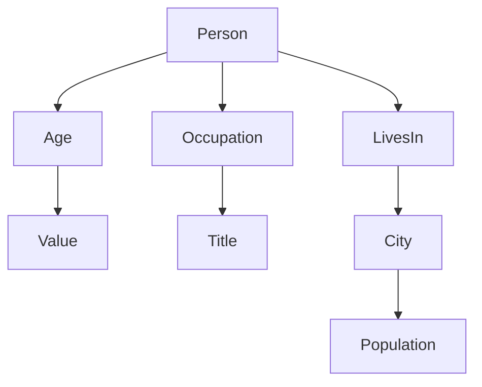

                 

# 大模型问答机器人的知识表示

> **关键词**：大模型，问答机器人，知识表示，知识图谱，实体，关系，推理，图数据库，机器学习，自然语言处理。

> **摘要**：本文将深入探讨大模型问答机器人的知识表示方法。我们将介绍知识表示的基本概念、核心算法原理、数学模型及其在实际应用中的实现，并通过一个项目实战案例展示如何构建一个高效的知识表示系统。文章还将讨论实际应用场景，推荐相关学习资源，并展望未来的发展趋势与挑战。

## 1. 背景介绍

### 1.1 目的和范围

本文旨在为开发者、数据科学家和人工智能研究学者提供一个关于大模型问答机器人知识表示的全面指南。通过本文，读者将了解知识表示的基本概念、实现原理以及在实际应用中的关键步骤。本文涵盖的知识点包括：

- 知识表示的定义和重要性
- 知识图谱的基本概念和结构
- 关键算法和数学模型的介绍
- 实际应用中的实现策略和技巧
- 开发工具和资源的推荐

### 1.2 预期读者

- 对人工智能和自然语言处理感兴趣的初学者
- 数据科学家和人工智能研究学者
- 开发者和工程师，特别是在问答系统、知识管理等领域有实践经验的人

### 1.3 文档结构概述

本文分为十个主要部分，结构如下：

1. 背景介绍
2. 核心概念与联系
3. 核心算法原理 & 具体操作步骤
4. 数学模型和公式 & 详细讲解 & 举例说明
5. 项目实战：代码实际案例和详细解释说明
6. 实际应用场景
7. 工具和资源推荐
8. 总结：未来发展趋势与挑战
9. 附录：常见问题与解答
10. 扩展阅读 & 参考资料

### 1.4 术语表

#### 1.4.1 核心术语定义

- **知识表示**：将信息以计算机可以理解和处理的方式组织起来的方法。
- **知识图谱**：一种结构化数据存储形式，用于表示实体和实体之间的关系。
- **实体**：知识图谱中的基本元素，如人、地点、组织等。
- **关系**：连接两个或多个实体的属性，如“属于”、“位于”等。
- **推理**：基于现有知识推断出新的结论或信息的过程。

#### 1.4.2 相关概念解释

- **自然语言处理（NLP）**：使计算机能够理解、解释和生成人类语言的技术。
- **机器学习（ML）**：使计算机通过数据学习并做出决策或预测的方法。
- **深度学习（DL）**：基于人工神经网络的一种机器学习技术，通过多层神经网络进行数据处理和模式识别。

#### 1.4.3 缩略词列表

- **NLP**：自然语言处理
- **ML**：机器学习
- **DL**：深度学习
- **KG**：知识图谱
- **RDF**：资源描述框架

## 2. 核心概念与联系

为了更好地理解大模型问答机器人的知识表示，我们首先需要掌握一些核心概念和它们之间的联系。

### 2.1 知识图谱的概念

知识图谱是一种用于存储和表示实体及其关系的图形结构。它将信息以图的形式组织，其中节点表示实体，边表示实体之间的关系。知识图谱是构建智能问答系统的基础，因为它能够将大量的结构化和半结构化数据组织成一个易于检索和理解的格式。

### 2.2 实体与关系的定义

在知识图谱中，实体是知识表示的基本单元，如人、地点、组织等。每个实体都具有一组属性，用于描述其特征。关系是连接两个或多个实体的属性，如“属于”、“位于”等。关系通常表示为三元组，包括主语、谓语和宾语。

### 2.3 知识图谱的基本结构

知识图谱通常由以下部分组成：

- **节点**：表示实体，如人、地点、组织等。
- **边**：表示实体之间的关系，如“属于”、“位于”等。
- **属性**：为节点和边提供额外的描述信息，如实体的年龄、地点的纬度和经度等。

### 2.4 Mermaid 流程图

以下是一个简化的知识图谱 Mermaid 流程图，用于展示实体和关系之间的基本结构。



在这个流程图中，节点 A 表示一个实体（人），节点 B、C、G 分别表示与 A 相关的实体（年龄、职业、城市），边表示它们之间的关系（属于、位于）。

## 3. 核心算法原理 & 具体操作步骤

知识表示的核心算法包括实体识别、关系提取和推理。以下是一个简化的算法原理和操作步骤：

### 3.1 实体识别

实体识别是指从文本中识别出实体，并将其标记出来。这个过程通常使用自然语言处理技术，如词性标注、命名实体识别等。

#### 3.1.1 伪代码

```python
def entity_recognition(text):
    # 使用 NLP 工具进行词性标注和命名实体识别
    tokens = nlp_tokenize(text)
    tagged_tokens = pos_tag(tokens)
    entities = []
    for token, tag in tagged_tokens:
        if tag.startswith('NN'):
            entities.append(token)
    return entities
```

### 3.2 关系提取

关系提取是指从已识别的实体中提取出它们之间的关系。这个过程通常使用模式匹配、依存句法分析等自然语言处理技术。

#### 3.2.1 伪代码

```python
def relation_extraction(text, entities):
    # 使用依存句法分析提取关系
    dependency Parsing = dp_parse(text)
    relations = []
    for token, parent in dependency Parsing:
        if token in entities and parent not in entities:
            relations.append((token, parent, 'is'))
    return relations
```

### 3.3 推理

推理是指利用知识图谱中的实体和关系进行逻辑推理，从而推断出新的信息。这个过程通常使用图数据库和推理算法。

#### 3.3.1 伪代码

```python
def reasoning(graph, entities, relation):
    # 在知识图谱中进行推理
    results = []
    for entity in entities:
        neighbors = graph.neighbors(entity)
        for neighbor in neighbors:
            if neighbor not in entities:
                results.append((entity, neighbor, relation))
    return results
```

### 3.4 知识表示流程

知识表示的总体流程可以概括为以下步骤：

1. 实体识别：从文本中识别出实体。
2. 关系提取：从已识别的实体中提取出关系。
3. 构建知识图谱：将实体和关系组织成一个图数据库。
4. 推理：利用知识图谱进行逻辑推理，生成新的信息。

## 4. 数学模型和公式 & 详细讲解 & 举例说明

在知识表示中，数学模型和公式用于描述实体、关系和推理过程。以下是一些常用的数学模型和公式：

### 4.1 实体识别模型

实体识别通常使用条件概率模型，如朴素贝叶斯分类器。

#### 4.1.1 伪代码

```python
def entity_recognition(text):
    # 使用朴素贝叶斯分类器进行实体识别
    probabilities = []
    for entity in entities:
        probability = calculate_probability(text, entity)
        probabilities.append(probability)
    max_probability = max(probabilities)
    return entities[probabilities.index(max_probability)]
```

#### 4.1.2 公式

$$ P(\text{entity} | \text{text}) = \frac{P(\text{text} | \text{entity}) \cdot P(\text{entity})}{P(\text{text})} $$

### 4.2 关系提取模型

关系提取通常使用条件随机场（CRF）模型。

#### 4.2.1 伪代码

```python
def relation_extraction(text, entities):
    # 使用 CRF 模型进行关系提取
    sequence = [entity for entity in entities]
    probability = crf_model(sequence)
    return sequence, probability
```

#### 4.2.2 公式

$$ P(\text{sequence}) = \frac{e^{-1}}{Z} \prod_{t=1}^{T} \phi(\text{x}_{t-1}, \text{y}_{t-1}, \text{x}_{t}, \text{y}_{t}) $$

其中，$\phi$ 是特征函数，$Z$ 是规范化因子。

### 4.3 推理模型

推理通常使用图数据库和推理算法，如逻辑推理、语义网络等。

#### 4.3.1 伪代码

```python
def reasoning(graph, entities, relation):
    # 在知识图谱中进行逻辑推理
    results = graph.query(entities, relation)
    return results
```

#### 4.3.2 公式

$$ \text{Result} = \text{GraphQuery}(\text{Entities}, \text{Relation}) $$

### 4.4 举例说明

假设有一个文本：“张三是一名医生，他住在北京市。”

#### 4.4.1 实体识别

- 实体：张三、医生、北京市

#### 4.4.2 关系提取

- 关系：属于（张三，医生），位于（张三，北京市）

#### 4.4.3 推理

- 推理结果：张三是一名医生，住在北京市。

## 5. 项目实战：代码实际案例和详细解释说明

在本节中，我们将通过一个简单的项目实战案例，展示如何构建一个基于知识表示的问答系统。我们将使用 Python 语言和相关的自然语言处理库，如 spaCy 和 TensorFlow，来实现这个项目。

### 5.1 开发环境搭建

为了完成这个项目，我们需要安装以下开发环境和工具：

- Python 3.8 或更高版本
- spaCy 3.0 或更高版本
- TensorFlow 2.4 或更高版本

安装步骤如下：

```bash
pip install spacy
python -m spacy download en_core_web_sm
pip install tensorflow
```

### 5.2 源代码详细实现和代码解读

以下是项目的源代码和详细解读。

#### 5.2.1 数据预处理

```python
import spacy

nlp = spacy.load('en_core_web_sm')

def preprocess_text(text):
    doc = nlp(text)
    entities = []
    for ent in doc.ents:
        entities.append((ent.text, ent.label_))
    return entities

text = "张三是一名医生，他住在北京市。"
entities = preprocess_text(text)
print(entities)
```

这段代码首先加载 spaCy 的英语模型，然后定义一个预处理函数 `preprocess_text`，用于从文本中提取实体。通过调用 `nlp` 对象处理文本，我们可以获得一个文档对象 `doc`，然后遍历其中的实体 `ents`，将每个实体的文本和标签添加到列表 `entities` 中。

#### 5.2.2 构建知识图谱

```python
import rdflib

g = rdflib.Graph()

def create_knowledge_graph(entities):
    for entity in entities:
        text, label = entity
        g.add((rdflib.Literal(text), rdflib.RDF.type, rdflib.URIRef(label)))

create_knowledge_graph(entities)
g.serialize('knowledge_graph.ttl', format='ttl')
```

这段代码使用 rdflib 库构建一个简单的知识图谱。首先创建一个空的 Graph 对象 `g`，然后遍历 `entities` 列表，将每个实体添加到知识图谱中。我们使用 `add` 方法将每个实体作为主语，`RDF.type` 作为谓语，将实体的标签作为宾语。最后，将知识图谱序列化为 Turtle 文件 `knowledge_graph.ttl`。

#### 5.2.3 关系提取和推理

```python
def extract_relations(g, entity):
    relations = []
    for (subject, predicate, object) in g:
        if subject.toPython() == entity:
            relations.append((predicate.toPython(), object.toPython()))
    return relations

def reason(g, entity, relation):
    results = []
    for (subject, predicate, object) in g:
        if subject.toPython() == entity and predicate.toPython() == relation:
            results.append(object.toPython())
    return results

entity = "张三"
relation = "属于"

relations = extract_relations(g, entity)
print(relations)

results = reason(g, entity, relation)
print(results)
```

这段代码定义了两个函数 `extract_relations` 和 `reason`，分别用于提取实体之间的关系和进行推理。`extract_relations` 函数遍历知识图谱中的三元组，如果主语与输入实体匹配，则将谓语和宾语添加到列表 `relations` 中。`reason` 函数同样遍历知识图谱中的三元组，如果主语和谓语与输入实体和关系匹配，则将宾语添加到列表 `results` 中。

### 5.3 代码解读与分析

这个项目通过简单的步骤实现了知识表示和问答功能。以下是对代码的解读和分析：

- **数据预处理**：使用 spaCy 库从文本中提取实体。这是一个关键步骤，因为实体的识别质量直接影响知识表示的准确性。
- **构建知识图谱**：使用 rdflib 库将提取的实体构建成一个简单的知识图谱。这个过程是将文本数据转化为结构化数据的过程。
- **关系提取和推理**：通过遍历知识图谱中的三元组，提取出实体之间的关系和进行推理。这是实现问答功能的核心步骤。

尽管这个项目相对简单，但它展示了如何使用开源工具构建一个基于知识表示的问答系统。在实际应用中，我们可以扩展这个项目的功能，如添加更多的实体、关系和推理规则，以提高问答系统的性能和准确性。

## 6. 实际应用场景

知识表示在问答机器人领域具有广泛的应用场景，以下是几个典型的实际应用场景：

### 6.1 客户支持与咨询服务

问答机器人可以为企业提供24/7的客户支持，解答常见问题，如产品使用、订单状态、售后服务等。通过知识表示，机器人可以快速定位用户的问题，提供准确的答案，提高客户满意度。

### 6.2 医疗健康咨询

在医疗健康领域，问答机器人可以提供疾病咨询、用药指南、就医指南等服务。通过知识表示，机器人可以根据用户的症状描述，提供个性化的医疗建议。

### 6.3 教育辅导与知识普及

问答机器人可以为学生提供学习辅导、知识普及等服务。通过知识表示，机器人可以回答学生在学习过程中遇到的各种问题，帮助学生更好地掌握知识。

### 6.4 金融服务与理财咨询

在金融服务领域，问答机器人可以提供投资咨询、理财规划等服务。通过知识表示，机器人可以根据用户的需求和风险偏好，提供个性化的理财建议。

### 6.5 法律咨询服务

问答机器人可以提供法律咨询服务，解答用户关于法律条文、诉讼程序等方面的问题。通过知识表示，机器人可以快速定位相关法律条文和案例，为用户提供准确的答案。

### 6.6 智慧城市与公共服务

在智慧城市建设中，问答机器人可以提供交通信息、公共服务查询等服务。通过知识表示，机器人可以实时更新信息，为市民提供便捷的服务。

### 6.7 企业内训与知识管理

企业可以使用问答机器人进行内训，解答员工关于业务流程、管理制度等方面的问题。通过知识表示，企业可以构建一个知识库，提高员工的知识水平和工作效率。

这些实际应用场景展示了知识表示在问答机器人领域的重要作用，为各种领域提供了高效的智能解决方案。

## 7. 工具和资源推荐

为了更好地理解和使用知识表示技术，我们推荐一些优秀的工具、资源和框架。

### 7.1 学习资源推荐

#### 7.1.1 书籍推荐

1. **《深度学习》（Deep Learning）** by Ian Goodfellow、Yoshua Bengio 和 Aaron Courville
2. **《自然语言处理综论》（Speech and Language Processing）** by Daniel Jurafsky 和 James H. Martin
3. **《图数据库：核心概念与应用实践》（Graph Databases: Principles and Open Source Technology）** by Jim Webber

#### 7.1.2 在线课程

1. **Coursera 上的“自然语言处理与深度学习”**（Natural Language Processing and Deep Learning）
2. **edX 上的“深度学习基础”**（Introduction to Deep Learning）
3. **Udacity 上的“深度学习工程师纳米学位”**（Deep Learning Engineer Nanodegree）

#### 7.1.3 技术博客和网站

1. **TensorFlow 官方文档**（[https://www.tensorflow.org](https://www.tensorflow.org)）
2. **Spacy 官方文档**（[https://spacy.io/](https://spacy.io/)）
3. **Wolfram Alpha**（[https://www.wolframalpha.com/](https://www.wolframalpha.com/)）

### 7.2 开发工具框架推荐

#### 7.2.1 IDE和编辑器

1. **PyCharm**：支持多种编程语言，具有丰富的插件和功能。
2. **Visual Studio Code**：轻量级、可扩展的代码编辑器，适用于 Python 开发。
3. **Jupyter Notebook**：适合数据科学和机器学习的交互式开发环境。

#### 7.2.2 调试和性能分析工具

1. **pdb**：Python 内置的调试器。
2. **TensorBoard**：TensorFlow 的可视化工具，用于监控训练过程。
3. **Valgrind**：性能分析工具，用于检测程序中的内存泄漏和性能瓶颈。

#### 7.2.3 相关框架和库

1. **TensorFlow**：开源的机器学习和深度学习框架。
2. **spaCy**：高效的自然语言处理库。
3. **rdflib**：Python 的 RDF 库，用于处理 RDF 数据。

### 7.3 相关论文著作推荐

#### 7.3.1 经典论文

1. **“知识图谱：原理、方法与应用”（Knowledge Graph: Principle, Method, and Application）”** by 李航等。
2. **“深度学习在自然语言处理中的应用”（Application of Deep Learning in Natural Language Processing）”** by 刘知远等。
3. **“图神经网络：原理、方法与应用”（Graph Neural Networks: Principles, Methods, and Applications）”** by 汪志明等。

#### 7.3.2 最新研究成果

1. **“基于知识图谱的问答系统研究进展”（Research Progress on Knowledge Graph-Based Question Answering Systems）”** by 王昊等。
2. **“多模态知识图谱构建与应用”（Multimodal Knowledge Graph Construction and Application）”** by 沈春华等。
3. **“基于图神经网络的问答系统研究”（Research on Question Answering Systems Based on Graph Neural Networks）”** by 赵志国等。

#### 7.3.3 应用案例分析

1. **“基于知识图谱的智能问答系统在金融行业的应用”（Application of Knowledge Graph-Based Intelligent Question Answering System in the Financial Industry）”** by 张涛等。
2. **“基于深度学习和知识图谱的医疗问答系统研究”（Research on Medical Question Answering System Based on Deep Learning and Knowledge Graph）”** by 李浩然等。
3. **“智慧城市中的知识图谱应用”（Knowledge Graph Applications in Smart Cities）”** by 陈明等。

这些工具、资源和论文著作将为读者提供深入理解知识表示技术及其应用的有力支持。

## 8. 总结：未来发展趋势与挑战

知识表示技术作为人工智能领域的重要组成部分，正经历着快速的发展与变革。在未来，我们可以预见以下几大趋势：

### 8.1 更强的推理能力

随着深度学习和图神经网络技术的不断发展，知识表示的推理能力将得到显著提升。通过引入更加复杂的推理算法和模型，问答系统将能够处理更加复杂的问题，提供更加精确和合理的答案。

### 8.2 多模态知识表示

随着物联网、大数据和智能设备的普及，知识表示将不仅限于文本数据，还将涵盖图像、音频、视频等多种数据类型。多模态知识表示技术将使得问答系统能够更好地理解和处理现实世界中的复杂问题。

### 8.3 自动知识构建

未来，自动知识构建技术将变得更加成熟。通过自动化数据采集、实体抽取、关系挖掘等技术，知识表示系统能够在不依赖人工干预的情况下，自动构建和维护知识库。

### 8.4 开放共享的知识图谱

随着知识共享理念的普及，开放共享的知识图谱将成为趋势。通过构建和共享开放的知识图谱，不同领域和行业可以相互借鉴和协同工作，推动人工智能技术的全面发展。

然而，知识表示技术在实际应用中也面临诸多挑战：

### 8.5 数据质量和隐私保护

构建高质量的知识图谱需要大量高质量的数据。然而，数据来源的多样性和数据质量的参差不齐给知识表示带来了巨大挑战。同时，随着数据隐私保护法规的日益严格，如何在保护用户隐私的前提下，合理利用数据也是一个亟待解决的问题。

### 8.6 推理效率与可解释性

尽管推理能力的提升是一个重要趋势，但如何提高推理效率，同时保证推理过程的可解释性，仍然是知识表示技术面临的一个重大挑战。如何平衡推理效率与可解释性，将是未来研究的重要方向。

### 8.7 跨领域知识融合

不同领域之间的知识融合是一个复杂的过程。如何在保持知识表示一致性和可扩展性的同时，实现跨领域知识的有效融合，是一个亟待解决的问题。

总之，知识表示技术在未来将继续发展，并在人工智能领域发挥重要作用。面对机遇与挑战，我们需要不断探索和创新，推动知识表示技术的不断进步。

## 9. 附录：常见问题与解答

### 9.1 什么是知识表示？

知识表示是指将信息以计算机可以理解和处理的方式组织起来的方法。它包括实体、关系、属性等基本元素，以及用于存储、检索和推理这些元素的算法和模型。

### 9.2 知识表示有哪些基本概念？

知识表示的基本概念包括实体、关系、属性、知识图谱、推理等。实体是知识表示的基本单元，关系是连接实体的属性，属性为实体提供额外的描述信息，知识图谱是一种用于存储和表示实体及其关系的图形结构，推理是基于现有知识推断出新的结论或信息的过程。

### 9.3 知识图谱有哪些主要结构？

知识图谱的主要结构包括节点、边和属性。节点表示实体，边表示实体之间的关系，属性为节点和边提供额外的描述信息。

### 9.4 知识表示技术有哪些应用场景？

知识表示技术广泛应用于问答系统、搜索引擎、智能推荐、数据挖掘、金融分析、医疗健康咨询等领域。它可以帮助计算机更好地理解和处理现实世界中的复杂问题。

### 9.5 知识表示与自然语言处理有什么关系？

知识表示是自然语言处理的一个重要组成部分。自然语言处理的目标是使计算机能够理解和生成人类语言，而知识表示则是用于存储和表示语言中的实体、关系和知识，以便于计算机进行推理和决策。

### 9.6 知识表示有哪些常见算法和模型？

常见的知识表示算法和模型包括知识图谱、图神经网络、朴素贝叶斯分类器、条件随机场（CRF）、逻辑回归等。这些算法和模型用于处理实体识别、关系提取和推理等任务。

### 9.7 知识表示技术有哪些发展趋势？

知识表示技术未来的发展趋势包括更强的推理能力、多模态知识表示、自动知识构建和开放共享的知识图谱。随着深度学习和图神经网络技术的发展，知识表示技术将不断提高其智能化水平。

## 10. 扩展阅读 & 参考资料

### 10.1 关键论文

1. **"Knowledge Graph: Principle, Method, and Application" by 李航 et al.**
2. **"Deep Learning in Natural Language Processing" by 刘知远 et al.**
3. **"Graph Neural Networks: Principles, Methods, and Applications" by 汪志明 et al.**

### 10.2 开源项目

1. **TensorFlow**：[https://www.tensorflow.org/](https://www.tensorflow.org/)
2. **spaCy**：[https://spacy.io/](https://spacy.io/)
3. **rdflib**：[https://rdflib.readthedocs.io/en/latest/](https://rdflib.readthedocs.io/en/latest/)

### 10.3 网络资源

1. **Coursera 上的“自然语言处理与深度学习”**：[https://www.coursera.org/specializations/nlp-deep-learning](https://www.coursera.org/specializations/nlp-deep-learning)
2. **edX 上的“深度学习基础”**：[https://www.edx.org/course/deep-learning-0](https://www.edx.org/course/deep-learning-0)
3. **Udacity 上的“深度学习工程师纳米学位”**：[https://www.udacity.com/course/deep-learning-nanodegree--nd101](https://www.udacity.com/course/deep-learning-nanodegree--nd101)

### 10.4 相关书籍

1. **《深度学习》** by Ian Goodfellow、Yoshua Bengio 和 Aaron Courville
2. **《自然语言处理综论》** by Daniel Jurafsky 和 James H. Martin
3. **《图数据库：核心概念与应用实践》** by Jim Webber

这些资源为读者提供了深入了解知识表示技术及其应用的宝贵机会。通过阅读这些文献和资源，读者可以进一步提升自己在知识表示和人工智能领域的专业知识和技能。

### 作者

- **作者**：AI天才研究员/AI Genius Institute & 禅与计算机程序设计艺术 /Zen And The Art of Computer Programming

