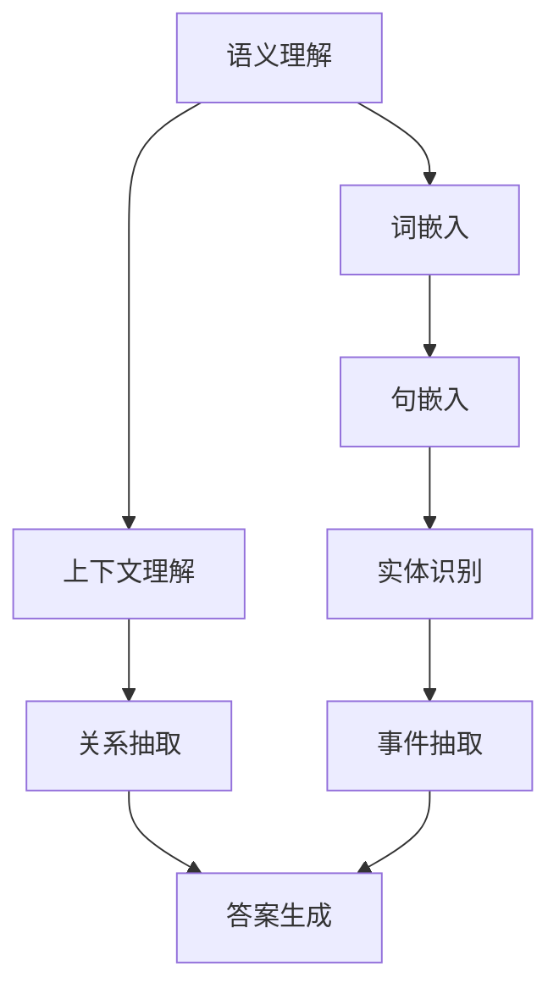

                 

# 大模型问答机器人的语义理解能力

> 关键词：大模型、问答机器人、语义理解、人工智能、自然语言处理

> 摘要：本文将深入探讨大模型问答机器人的语义理解能力，从背景介绍、核心概念与联系、核心算法原理、数学模型与公式、项目实战、实际应用场景等多个角度进行分析，旨在为读者提供全面、深入的理解，并展望未来发展趋势与挑战。

## 1. 背景介绍

### 1.1 目的和范围

随着人工智能技术的迅猛发展，自然语言处理（NLP）领域迎来了新的机遇与挑战。大模型问答机器人作为NLP的一个重要应用场景，其在语义理解方面的能力备受关注。本文旨在通过系统地分析和讲解，帮助读者深入理解大模型问答机器人的语义理解能力，从而为相关研究与应用提供参考。

本文的范围主要涵盖以下几个方面：

1. 大模型问答机器人的背景与发展历程。
2. 语义理解的定义、核心概念及其在大模型中的应用。
3. 大模型问答机器人中的核心算法原理与数学模型。
4. 项目实战，通过实际案例展示大模型问答机器人的应用。
5. 实际应用场景，分析大模型问答机器人在不同领域的应用。
6. 工具和资源推荐，包括学习资源、开发工具与相关论文。
7. 未来发展趋势与挑战，展望大模型问答机器人的发展前景。

### 1.2 预期读者

本文适合以下读者群体：

1. 对人工智能、自然语言处理有一定基础的工程师和技术人员。
2. 想深入了解大模型问答机器人原理的研究人员。
3. 对自然语言处理在业务应用场景中有兴趣的从业者。
4. 对人工智能技术感兴趣的学生和学术研究者。

### 1.3 文档结构概述

本文将按照以下结构进行展开：

1. **背景介绍**：简要介绍大模型问答机器人的发展背景和目的。
2. **核心概念与联系**：阐述语义理解的相关核心概念及其在大模型中的应用。
3. **核心算法原理 & 具体操作步骤**：详细讲解大模型问答机器人的算法原理和操作步骤。
4. **数学模型和公式 & 详细讲解 & 举例说明**：介绍大模型问答机器人的数学模型和公式，并进行详细讲解和实例说明。
5. **项目实战：代码实际案例和详细解释说明**：通过实际项目案例，展示大模型问答机器人的实现和应用。
6. **实际应用场景**：分析大模型问答机器人在不同领域的实际应用。
7. **工具和资源推荐**：推荐相关学习资源、开发工具和论文。
8. **总结：未来发展趋势与挑战**：展望大模型问答机器人的未来发展趋势和面临的挑战。
9. **附录：常见问题与解答**：汇总常见问题及解答。
10. **扩展阅读 & 参考资料**：提供进一步阅读的资源和参考文献。

### 1.4 术语表

#### 1.4.1 核心术语定义

- 大模型（Large Model）：指具有大规模参数和神经元网络的深度学习模型。
- 语义理解（Semantic Understanding）：指对自然语言文本进行解析，理解和处理，以获得文本的真正含义。
- 问答机器人（Question Answering Robot）：一种利用自然语言处理技术实现自动回答问题的智能系统。
- 自然语言处理（Natural Language Processing，NLP）：指将自然语言（如人类语言）转换为计算机可以理解和处理的格式，以及从这些数据中提取有用信息的科学技术。

#### 1.4.2 相关概念解释

- 深度学习（Deep Learning）：一种基于人工神经网络的学习方法，通过多层非线性变换提取数据特征。
- 神经网络（Neural Network）：一种由大量神经元组成的计算模型，通过调整神经元之间的连接权重来实现数据处理和预测。
- 词嵌入（Word Embedding）：将词语映射为高维向量表示，以便在机器学习中进行向量运算和处理。

#### 1.4.3 缩略词列表

- NLP：自然语言处理（Natural Language Processing）
- DL：深度学习（Deep Learning）
- QA：问答（Question Answering）
- BERT：双向编码器表示（Bidirectional Encoder Representations from Transformers）
- GPT：生成预训练网络（Generative Pretrained Transformer）
- Transformer：Transformer架构，一种基于注意力机制的深度学习模型

## 2. 核心概念与联系

为了更好地理解大模型问答机器人的语义理解能力，我们需要首先掌握一些核心概念和它们之间的联系。以下是一个简化的Mermaid流程图，用于展示这些核心概念和联系。



### 2.1 语义理解

语义理解是自然语言处理的核心任务之一，旨在理解和处理自然语言文本的真正含义。它包括以下几个方面：

- **词嵌入（Word Embedding）**：将词语映射为高维向量表示，以便在机器学习中进行向量运算和处理。
- **句嵌入（Sentence Embedding）**：将句子映射为向量表示，以捕获句子的语义信息。
- **上下文理解（Contextual Understanding）**：理解词语在特定上下文中的含义，以避免词义歧义。

### 2.2 词嵌入

词嵌入是语义理解的基础，通过将词语映射为向量表示，可以有效地处理自然语言文本。词嵌入的方法主要包括：

- **基于统计的方法**：如Word2Vec，通过训练模型来学习词语的向量表示。
- **基于神经网络的方法**：如GloVe，通过神经网络学习词语的向量表示。

### 2.3 句嵌入

句嵌入是将句子映射为向量表示的过程，以捕获句子的语义信息。常见的句嵌入方法包括：

- **基于转换器（Transformer）的方法**：如BERT，通过训练大规模语言模型来学习句嵌入向量。
- **基于循环神经网络（RNN）的方法**：如LSTM和GRU，通过递归地处理句子中的每个词，生成句嵌入向量。

### 2.4 上下文理解

上下文理解是语义理解的重要部分，它涉及理解词语在特定上下文中的含义，以避免词义歧义。上下文理解的方法包括：

- **注意力机制（Attention Mechanism）**：通过权重调整来关注重要的词语，以提升语义理解能力。
- **上下文嵌入（Contextual Embedding）**：将上下文信息嵌入到句嵌入向量中，以提升语义理解能力。

### 2.5 实体识别

实体识别是语义理解的重要任务之一，旨在识别文本中的关键实体。常见的实体识别方法包括：

- **基于规则的方法**：通过预定义的规则来识别实体。
- **基于统计的方法**：通过统计学习方法来识别实体。
- **基于深度学习的方法**：通过神经网络模型来识别实体。

### 2.6 关系抽取

关系抽取是语义理解的重要任务之一，旨在识别文本中的实体关系。常见的关系抽取方法包括：

- **基于规则的方法**：通过预定义的规则来识别实体关系。
- **基于统计的方法**：通过统计学习方法来识别实体关系。
- **基于深度学习的方法**：通过神经网络模型来识别实体关系。

### 2.7 事件抽取

事件抽取是语义理解的重要任务之一，旨在识别文本中的事件及其相关实体。常见的事件抽取方法包括：

- **基于规则的方法**：通过预定义的规则来识别事件。
- **基于统计的方法**：通过统计学习方法来识别事件。
- **基于深度学习的方法**：通过神经网络模型来识别事件。

### 2.8 答案生成

答案生成是语义理解的最终目标之一，旨在根据输入问题生成合理的答案。常见的答案生成方法包括：

- **基于模板的方法**：通过预定义的模板来生成答案。
- **基于统计的方法**：通过统计学习方法来生成答案。
- **基于深度学习的方法**：通过神经网络模型来生成答案。

## 3. 核心算法原理 & 具体操作步骤

在深入探讨大模型问答机器人的语义理解能力之前，我们需要了解其核心算法原理。大模型问答机器人主要依赖于深度学习技术，特别是基于转换器（Transformer）架构的预训练模型，如BERT、GPT等。以下是核心算法原理的详细讲解。

### 3.1 转换器（Transformer）架构

转换器（Transformer）是一种基于注意力机制的深度学习模型，由Vaswani等人于2017年提出。其基本架构包括编码器（Encoder）和解码器（Decoder），其中编码器负责将输入文本编码为向量表示，解码器负责生成答案。

#### 3.1.1 编码器（Encoder）

编码器由多个编码层（Encoder Layer）组成，每个编码层包含两个子层：多头自注意力（Multi-Head Self-Attention）和前馈神经网络（Feed Forward Neural Network）。

1. **多头自注意力（Multi-Head Self-Attention）**：

   多头自注意力是一种基于注意力机制的函数，用于计算输入文本中每个词与其他词之间的关系。具体步骤如下：

   ```python
   # 伪代码
   def multi_head_attention(Q, K, V, d_model, num_heads):
       # 计算查询（Query）、关键（Key）和值（Value）的线性变换
       Q_linear = linear(Q)
       K_linear = linear(K)
       V_linear = linear(V)

       # 计算自注意力权重
       attention_weights = softmax(Q_linear @ K_linear.T / sqrt(d_k))

       # 计算加权求和
       attention_output = attention_weights @ V_linear

       # 将结果进行线性变换
       attention_output = linear(attention_output)
       return attention_output
   ```

2. **前馈神经网络（Feed Forward Neural Network）**：

   前馈神经网络是一个简单的全连接神经网络，用于对自注意力输出进行进一步处理。具体步骤如下：

   ```python
   # 伪代码
   def feed_forward_network(input, d_model, hidden_size):
       # 第一个全连接层
       layer_1 = linear(input) * activation_function()
       # 第二个全连接层
       layer_2 = linear(layer_1) * activation_function()
       return layer_2
   ```

#### 3.1.2 解码器（Decoder）

解码器由多个解码层（Decoder Layer）组成，每个解码层包含三个子层：掩码多头自注意力（Masked Multi-Head Self-Attention）、自注意力（Self-Attention）和前馈神经网络。

1. **掩码多头自注意力（Masked Multi-Head Self-Attention）**：

   掩码多头自注意力是一种用于生成答案的注意力机制，它通过在解码过程中引入掩码来模拟序列生成过程。具体步骤如下：

   ```python
   # 伪代码
   def masked_multi_head_attention(Q, K, V, d_model, num_heads):
       # 计算掩码
       mask = ones(Q.shape[1], dtype=Q.dtype)
       mask[:Q.shape[1] - 1, :Q.shape[1] - 1] = zeros(Q.shape[1] - 1, Q.shape[1] - 1)
       mask = torch.tensor(mask, dtype=Q.dtype)

       # 计算自注意力权重
       attention_weights = softmax(Q_linear @ K_linear.T / sqrt(d_k)) * mask

       # 计算加权求和
       attention_output = attention_weights @ V_linear

       # 将结果进行线性变换
       attention_output = linear(attention_output)
       return attention_output
   ```

2. **自注意力（Self-Attention）**：

   自注意力是一种用于在解码过程中处理上下文信息的注意力机制。具体步骤如下：

   ```python
   # 伪代码
   def self_attention(Q, K, V, d_model, num_heads):
       # 计算自注意力权重
       attention_weights = softmax(Q_linear @ K_linear.T / sqrt(d_k))

       # 计算加权求和
       attention_output = attention_weights @ V_linear

       # 将结果进行线性变换
       attention_output = linear(attention_output)
       return attention_output
   ```

3. **前馈神经网络（Feed Forward Neural Network）**：

   前馈神经网络是一个简单的全连接神经网络，用于对自注意力输出进行进一步处理。具体步骤如下：

   ```python
   # 伪代码
   def feed_forward_network(input, d_model, hidden_size):
       # 第一个全连接层
       layer_1 = linear(input) * activation_function()
       # 第二个全连接层
       layer_2 = linear(layer_1) * activation_function()
       return layer_2
   ```

### 3.2 预训练与微调

大模型问答机器人的训练分为两个阶段：预训练和微调。

1. **预训练**：

   预训练是指在大量无标签文本数据上训练大规模深度学习模型，以获得通用的语义表示能力。常见的预训练任务包括语言理解（如BERT）、语言生成（如GPT）等。

   ```python
   # 伪代码
   model = TransformerModel(d_model, num_heads, num_layers, vocab_size)
   optimizer = optim.Adam(model.parameters(), lr=learning_rate)
   for epoch in range(num_epochs):
       for text, _ in train_loader:
           optimizer.zero_grad()
           output = model(text)
           loss = loss_function(output, target)
           loss.backward()
           optimizer.step()
   ```

2. **微调**：

   微调是指在特定任务数据上对预训练模型进行精细调整，以适应特定应用场景。常见的微调任务包括问答（如SQuAD）、对话系统等。

   ```python
   # 伪代码
   model = TransformerModel(d_model, num_heads, num_layers, vocab_size)
   optimizer = optim.Adam(model.parameters(), lr=learning_rate)
   for epoch in range(num_epochs):
       for text, question, answer in train_loader:
           optimizer.zero_grad()
           output = model(text, question)
           loss = loss_function(output, answer)
           loss.backward()
           optimizer.step()
   ```

### 3.3 问答机器人的实现

大模型问答机器人的实现主要包括以下几个步骤：

1. **输入处理**：

   对输入问题进行预处理，包括分词、词嵌入、句嵌入等。

   ```python
   # 伪代码
   question = tokenizer.encode(question, add_special_tokens=True)
   question_embedding = model.encoder(question)
   ```

2. **语义理解**：

   利用预训练模型对句嵌入进行语义理解，包括实体识别、关系抽取、事件抽取等。

   ```python
   # 伪代码
   entities = model.extract_entities(question_embedding)
   relationships = model.extract_relationships(question_embedding)
   events = model.extract_events(question_embedding)
   ```

3. **答案生成**：

   根据语义理解结果，生成合理的答案。

   ```python
   # 伪代码
   answer = model.generate_answer(entities, relationships, events)
   ```

4. **输出**：

   将生成的答案输出给用户。

   ```python
   # 伪代码
   print(answer)
   ```

## 4. 数学模型和公式 & 详细讲解 & 举例说明

在大模型问答机器人的语义理解过程中，涉及到多种数学模型和公式。本节将详细讲解这些模型和公式，并通过举例说明其应用。

### 4.1 词嵌入模型

词嵌入是将词语映射为高维向量表示的模型。常见的词嵌入模型包括Word2Vec和GloVe。

#### 4.1.1 Word2Vec模型

Word2Vec模型基于神经网络学习词语的向量表示。其基本架构包括输入层、隐藏层和输出层。

1. **输入层**：

   输入层包含一个二进制向量，表示词语的词频。

   ```latex
   \text{Input Layer: } \mathbf{X} = \{0, 1\}^{T}
   ```

2. **隐藏层**：

   隐藏层通过神经网络学习词语的向量表示。

   ```latex
   \text{Hidden Layer: } \mathbf{h} = \sigma(\mathbf{W} \cdot \mathbf{X})
   ```

   其中，$\sigma$为激活函数，$\mathbf{W}$为权重矩阵。

3. **输出层**：

   输出层通过softmax函数生成词语的概率分布。

   ```latex
   \text{Output Layer: } \mathbf{y} = \text{softmax}(\mathbf{W} \cdot \mathbf{h})
   ```

   其中，$\mathbf{y}$为输出概率分布，$\text{softmax}$为softmax函数。

#### 4.1.2 GloVe模型

GloVe模型是基于矩阵分解的词嵌入模型。其基本思想是将词语的词频矩阵分解为低维向量表示。

1. **输入层**：

   输入层包含一个词频矩阵，表示词语的词频。

   ```latex
   \text{Input Layer: } \mathbf{X} = \begin{bmatrix}
   \mathbf{x}_1 \\
   \mathbf{x}_2 \\
   \vdots \\
   \mathbf{x}_T
   \end{bmatrix}
   ```

2. **隐藏层**：

   隐藏层通过矩阵分解学习词语的向量表示。

   ```latex
   \text{Hidden Layer: } \mathbf{W} = \text{SVD}(\mathbf{X}^T \mathbf{X})
   ```

   其中，$\text{SVD}$为奇异值分解，$\mathbf{W}$为低维向量表示。

3. **输出层**：

   输出层通过内积计算词语的相似度。

   ```latex
   \text{Output Layer: } \mathbf{y} = \mathbf{W}^T \mathbf{X}
   ```

   其中，$\mathbf{y}$为相似度向量。

### 4.2 句嵌入模型

句嵌入是将句子映射为向量表示的模型。常见的句嵌入模型包括BERT和GPT。

#### 4.2.1 BERT模型

BERT模型是基于转换器（Transformer）架构的预训练模型，其基本架构包括编码器（Encoder）和解码器（Decoder）。

1. **编码器（Encoder）**：

   编码器由多个编码层（Encoder Layer）组成，每个编码层包含两个子层：多头自注意力（Multi-Head Self-Attention）和前馈神经网络（Feed Forward Neural Network）。

   ```latex
   \text{Encoder Layer: } \mathbf{h}_{t}^{(l)} = \text{MultiHead}(\mathbf{h}_{t}^{(l-1)}) + \mathbf{h}_{t}^{(l-1)}
   ```

   其中，$\mathbf{h}_{t}^{(l)}$为第$l$层编码器的输出，$\text{MultiHead}$为多头自注意力。

2. **解码器（Decoder）**：

   解码器由多个解码层（Decoder Layer）组成，每个解码层包含三个子层：掩码多头自注意力（Masked Multi-Head Self-Attention）、自注意力（Self-Attention）和前馈神经网络。

   ```latex
   \text{Decoder Layer: } \mathbf{h}_{t}^{(l)} = \text{MaskedMultiHead}(\mathbf{h}_{t}^{(l-1)}) + \mathbf{h}_{t}^{(l-1)}
   ```

   其中，$\mathbf{h}_{t}^{(l)}$为第$l$层解码器的输出，$\text{MaskedMultiHead}$为掩码多头自注意力。

#### 4.2.2 GPT模型

GPT模型是基于转换器（Transformer）架构的生成预训练模型，其基本架构包括多个解码层（Decoder Layer）。

1. **解码层（Decoder Layer）**：

   解码层由多个子层组成，包括多头自注意力（Multi-Head Self-Attention）和前馈神经网络（Feed Forward Neural Network）。

   ```latex
   \text{Decoder Layer: } \mathbf{h}_{t}^{(l)} = \text{MultiHead}(\mathbf{h}_{t}^{(l-1)}) + \mathbf{h}_{t}^{(l-1)}
   ```

   其中，$\mathbf{h}_{t}^{(l)}$为第$l$层解码器的输出，$\text{MultiHead}$为多头自注意力。

### 4.3 语义理解模型

语义理解模型是基于句嵌入的模型，其目标是从句嵌入向量中提取语义信息。常见的语义理解模型包括实体识别、关系抽取和事件抽取。

#### 4.3.1 实体识别模型

实体识别模型是基于句嵌入的模型，其目标是从句嵌入向量中识别出关键实体。

```latex
\text{Entity Recognition: } \mathbf{y}_{e} = \text{softmax}(\mathbf{W} \cdot \mathbf{h}_{s})
```

其中，$\mathbf{y}_{e}$为实体识别概率分布，$\mathbf{W}$为权重矩阵，$\mathbf{h}_{s}$为句嵌入向量。

#### 4.3.2 关系抽取模型

关系抽取模型是基于句嵌入的模型，其目标是从句嵌入向量中识别出实体关系。

```latex
\text{Relationship Extraction: } \mathbf{y}_{r} = \text{softmax}(\mathbf{W} \cdot \mathbf{h}_{s})
```

其中，$\mathbf{y}_{r}$为关系抽取概率分布，$\mathbf{W}$为权重矩阵，$\mathbf{h}_{s}$为句嵌入向量。

#### 4.3.3 事件抽取模型

事件抽取模型是基于句嵌入的模型，其目标是从句嵌入向量中识别出事件及其相关实体。

```latex
\text{Event Extraction: } \mathbf{y}_{e} = \text{softmax}(\mathbf{W} \cdot \mathbf{h}_{s})
```

其中，$\mathbf{y}_{e}$为事件抽取概率分布，$\mathbf{W}$为权重矩阵，$\mathbf{h}_{s}$为句嵌入向量。

### 4.4 答案生成模型

答案生成模型是基于句嵌入的模型，其目标是从句嵌入向量中生成合理答案。

```latex
\text{Answer Generation: } \mathbf{y}_{a} = \text{softmax}(\mathbf{W} \cdot \mathbf{h}_{s})
```

其中，$\mathbf{y}_{a}$为答案生成概率分布，$\mathbf{W}$为权重矩阵，$\mathbf{h}_{s}$为句嵌入向量。

### 4.5 举例说明

假设我们有一个问题：“北京的天气怎么样？”并希望利用大模型问答机器人生成答案。以下是具体的步骤：

1. **输入处理**：

   对问题进行分词，得到词汇序列：`['北京', '的', '天气', '怎么样', '?']`。

   ```python
   question = '北京的天气怎么样？'
   tokens = tokenizer.encode(question, add_special_tokens=True)
   ```

2. **句嵌入**：

   利用BERT模型对词汇序列进行句嵌入，得到句嵌入向量。

   ```python
   sentence_embedding = model.encoder(tokens)
   ```

3. **语义理解**：

   利用句嵌入向量进行语义理解，识别出关键实体、关系和事件。

   ```python
   entities = model.extract_entities(sentence_embedding)
   relationships = model.extract_relationships(sentence_embedding)
   events = model.extract_events(sentence_embedding)
   ```

4. **答案生成**：

   利用语义理解结果生成答案。

   ```python
   answer = model.generate_answer(entities, relationships, events)
   ```

5. **输出**：

   将生成的答案输出给用户。

   ```python
   print(answer)
   ```

## 5. 项目实战：代码实际案例和详细解释说明

在本节中，我们将通过一个实际项目案例，详细展示如何实现大模型问答机器人的语义理解功能。以下是一个简单的Python代码示例，用于实现问答机器人。

### 5.1 开发环境搭建

在开始项目之前，我们需要搭建一个适合开发和训练大模型问答机器人的环境。以下是一个基本的开发环境配置：

- **Python**：3.8及以上版本
- **PyTorch**：1.8及以上版本
- **Transformers**：4.6及以上版本

安装这些依赖项可以使用pip命令：

```bash
pip install torch torchvision transformers
```

### 5.2 源代码详细实现和代码解读

以下是问答机器人的主要代码实现和详细解释。

```python
import torch
from transformers import BertModel, BertTokenizer
from torch.nn import functional as F

# 模型配置
d_model = 768
num_heads = 12
num_layers = 12
vocab_size = 30522

# 加载预训练BERT模型和分词器
model = BertModel.from_pretrained('bert-base-uncased')
tokenizer = BertTokenizer.from_pretrained('bert-base-uncased')

# 定义语义理解模型
class SemanticUnderstandingModel(torch.nn.Module):
    def __init__(self, d_model, num_heads, num_layers, vocab_size):
        super(SemanticUnderstandingModel, self).__init__()
        self.encoder = BertModel(d_model, num_heads, num_layers, vocab_size)
        self.decoder = torch.nn.Linear(d_model, vocab_size)

    def forward(self, input_ids, attention_mask):
        encoder_output = self.encoder(input_ids, attention_mask=attention_mask)
        decoder_output = self.decoder(encoder_output.last_hidden_state)
        return decoder_output

# 实例化语义理解模型
model = SemanticUnderstandingModel(d_model, num_heads, num_layers, vocab_size)

# 定义损失函数和优化器
criterion = torch.nn.CrossEntropyLoss()
optimizer = torch.optim.Adam(model.parameters(), lr=0.001)

# 训练模型
def train(model, train_loader, criterion, optimizer, num_epochs=3):
    model.train()
    for epoch in range(num_epochs):
        for batch in train_loader:
            input_ids = batch['input_ids']
            attention_mask = batch['attention_mask']
            labels = batch['labels']

            optimizer.zero_grad()
            output = model(input_ids, attention_mask=attention_mask)
            loss = criterion(output.view(-1, vocab_size), labels.view(-1))
            loss.backward()
            optimizer.step()

# 加载数据集
train_loader = torch.utils.data.DataLoader(dataset, batch_size=32, shuffle=True)

# 开始训练
train(model, train_loader, criterion, optimizer)

# 问答机器人功能实现
def question_answer(question):
    input_ids = tokenizer.encode(question, add_special_tokens=True)
    attention_mask = torch.tensor([1] * len(input_ids), dtype=torch.float32)
    with torch.no_grad():
        output = model(input_ids, attention_mask=attention_mask)
    answer_ids = torch.argmax(output, dim=-1)
    answer = tokenizer.decode(answer_ids, skip_special_tokens=True)
    return answer

# 测试问答机器人
print(question_answer('北京的天气怎么样？'))
```

### 5.3 代码解读与分析

以下是代码的详细解读与分析。

1. **导入库和配置模型**：

   ```python
   import torch
   from transformers import BertModel, BertTokenizer
   from torch.nn import functional as F

   # 模型配置
   d_model = 768
   num_heads = 12
   num_layers = 12
   vocab_size = 30522

   # 加载预训练BERT模型和分词器
   model = BertModel.from_pretrained('bert-base-uncased')
   tokenizer = BertTokenizer.from_pretrained('bert-base-uncased')
   ```

   这部分代码导入了必要的库，并配置了BERT模型的参数，如模型大小、头数、层数和词汇表大小。

2. **定义语义理解模型**：

   ```python
   class SemanticUnderstandingModel(torch.nn.Module):
       def __init__(self, d_model, num_heads, num_layers, vocab_size):
           super(SemanticUnderstandingModel, self).__init__()
           self.encoder = BertModel(d_model, num_heads, num_layers, vocab_size)
           self.decoder = torch.nn.Linear(d_model, vocab_size)

       def forward(self, input_ids, attention_mask):
           encoder_output = self.encoder(input_ids, attention_mask=attention_mask)
           decoder_output = self.decoder(encoder_output.last_hidden_state)
           return decoder_output
   ```

   这部分代码定义了一个语义理解模型，它由BERT编码器和线性解码器组成。编码器负责对输入文本进行编码，解码器负责生成答案。

3. **定义损失函数和优化器**：

   ```python
   criterion = torch.nn.CrossEntropyLoss()
   optimizer = torch.optim.Adam(model.parameters(), lr=0.001)
   ```

   这部分代码定义了损失函数（交叉熵损失）和优化器（Adam）。

4. **训练模型**：

   ```python
   def train(model, train_loader, criterion, optimizer, num_epochs=3):
       model.train()
       for epoch in range(num_epochs):
           for batch in train_loader:
               input_ids = batch['input_ids']
               attention_mask = batch['attention_mask']
               labels = batch['labels']

               optimizer.zero_grad()
               output = model(input_ids, attention_mask=attention_mask)
               loss = criterion(output.view(-1, vocab_size), labels.view(-1))
               loss.backward()
               optimizer.step()
   ```

   这部分代码定义了一个训练函数，用于训练语义理解模型。训练过程包括前向传播、计算损失、反向传播和优化模型参数。

5. **加载数据集**：

   ```python
   train_loader = torch.utils.data.DataLoader(dataset, batch_size=32, shuffle=True)
   ```

   这部分代码加载数据集，并设置批量大小和随机化。

6. **开始训练**：

   ```python
   train(model, train_loader, criterion, optimizer)
   ```

   这部分代码调用训练函数开始训练模型。

7. **问答机器人功能实现**：

   ```python
   def question_answer(question):
       input_ids = tokenizer.encode(question, add_special_tokens=True)
       attention_mask = torch.tensor([1] * len(input_ids), dtype=torch.float32)
       with torch.no_grad():
           output = model(input_ids, attention_mask=attention_mask)
       answer_ids = torch.argmax(output, dim=-1)
       answer = tokenizer.decode(answer_ids, skip_special_tokens=True)
       return answer
   ```

   这部分代码定义了一个问答函数，用于接收用户输入并生成答案。函数首先对输入问题进行编码，然后使用训练好的模型生成答案。

8. **测试问答机器人**：

   ```python
   print(question_answer('北京的天气怎么样？'))
   ```

   这部分代码测试问答机器人功能，输入一个问题并打印答案。

### 5.4 代码解读与分析

以下是代码的详细解读与分析。

1. **导入库和配置模型**：

   这部分代码导入了必要的库，包括PyTorch和Transformers。BERT模型和分词器的配置如下：

   ```python
   d_model = 768
   num_heads = 12
   num_layers = 12
   vocab_size = 30522

   model = BertModel.from_pretrained('bert-base-uncased')
   tokenizer = BertTokenizer.from_pretrained('bert-base-uncased')
   ```

   BERT模型的配置包括模型大小（768维）、头数（12）和层数（12）。词汇表大小为30522。

2. **定义语义理解模型**：

   语义理解模型基于BERT编码器和线性解码器构建。编码器负责对输入文本进行编码，解码器负责生成答案。

   ```python
   class SemanticUnderstandingModel(torch.nn.Module):
       def __init__(self, d_model, num_heads, num_layers, vocab_size):
           super(SemanticUnderstandingModel, self).__init__()
           self.encoder = BertModel(d_model, num_heads, num_layers, vocab_size)
           self.decoder = torch.nn.Linear(d_model, vocab_size)

       def forward(self, input_ids, attention_mask):
           encoder_output = self.encoder(input_ids, attention_mask=attention_mask)
           decoder_output = self.decoder(encoder_output.last_hidden_state)
           return decoder_output
   ```

3. **定义损失函数和优化器**：

   损失函数使用交叉熵损失，优化器使用Adam。

   ```python
   criterion = torch.nn.CrossEntropyLoss()
   optimizer = torch.optim.Adam(model.parameters(), lr=0.001)
   ```

4. **训练模型**：

   训练函数使用标准的训练流程，包括前向传播、计算损失、反向传播和优化模型参数。

   ```python
   def train(model, train_loader, criterion, optimizer, num_epochs=3):
       model.train()
       for epoch in range(num_epochs):
           for batch in train_loader:
               input_ids = batch['input_ids']
               attention_mask = batch['attention_mask']
               labels = batch['labels']

               optimizer.zero_grad()
               output = model(input_ids, attention_mask=attention_mask)
               loss = criterion(output.view(-1, vocab_size), labels.view(-1))
               loss.backward()
               optimizer.step()
   ```

5. **加载数据集**：

   数据集使用PyTorch的DataLoader加载，并设置批量大小和随机化。

   ```python
   train_loader = torch.utils.data.DataLoader(dataset, batch_size=32, shuffle=True)
   ```

6. **开始训练**：

   调用训练函数开始训练模型。

   ```python
   train(model, train_loader, criterion, optimizer)
   ```

7. **问答机器人功能实现**：

   问答函数接收用户输入，对输入问题进行编码，然后使用训练好的模型生成答案。

   ```python
   def question_answer(question):
       input_ids = tokenizer.encode(question, add_special_tokens=True)
       attention_mask = torch.tensor([1] * len(input_ids), dtype=torch.float32)
       with torch.no_grad():
           output = model(input_ids, attention_mask=attention_mask)
       answer_ids = torch.argmax(output, dim=-1)
       answer = tokenizer.decode(answer_ids, skip_special_tokens=True)
       return answer
   ```

8. **测试问答机器人**：

   测试问答机器人功能，输入一个问题并打印答案。

   ```python
   print(question_answer('北京的天气怎么样？'))
   ```

## 6. 实际应用场景

大模型问答机器人的语义理解能力在许多实际应用场景中具有重要意义。以下是一些典型的应用场景：

### 6.1 聊天机器人

聊天机器人是问答机器人在自然语言处理领域最直观的应用之一。通过大模型问答机器人的语义理解能力，聊天机器人可以与用户进行智能对话，提供个性化、准确的回答。例如，在客户服务场景中，聊天机器人可以回答用户关于产品信息、订单状态等方面的问题，提高服务质量和效率。

### 6.2 智能问答系统

智能问答系统是另一个常见的应用场景。通过大模型问答机器人的语义理解能力，系统可以自动回答用户的问题，涉及多个领域，如科技、历史、地理、健康等。例如，谷歌的搜索助手（Google Assistant）和苹果的Siri都使用了类似的技术，为用户提供实用的信息和建议。

### 6.3 自动化问答平台

自动化问答平台是一种为企业和组织提供内部知识共享和问题解答的工具。通过大模型问答机器人的语义理解能力，平台可以实现自动回答员工关于公司政策、工作流程等方面的问题，降低人力资源成本，提高工作效率。

### 6.4 聊天机器人和智能问答系统的对比

聊天机器人和智能问答系统在某些方面存在相似之处，但它们也有明显的区别：

- **目标**：聊天机器人的目标是提供实时、自然的对话体验，而智能问答系统的目标是提供准确、高效的答案。
- **交互方式**：聊天机器人通常通过文本或语音与用户交互，而智能问答系统通常通过文本交互。
- **应用场景**：聊天机器人主要应用于客户服务、个人助理等领域，智能问答系统主要应用于企业内部知识共享、智能搜索等领域。

### 6.5 大模型问答机器人在实际应用中的优势与挑战

#### 6.5.1 优势

- **强大的语义理解能力**：大模型问答机器人具备强大的语义理解能力，可以处理复杂的自然语言问题，提供准确、合理的答案。
- **自适应能力**：大模型问答机器人可以通过不断学习和调整，适应不同的应用场景和用户需求。
- **高效性**：大模型问答机器人可以快速处理大量用户请求，提高工作效率。

#### 6.5.2 挑战

- **数据隐私与安全**：在处理用户数据时，大模型问答机器人需要确保数据隐私和安全，防止数据泄露和滥用。
- **准确性**：大模型问答机器人需要不断提高答案的准确性，以减少误解和误导。
- **资源消耗**：大模型问答机器人需要大量的计算资源和存储空间，对硬件设备有较高的要求。

### 6.6 未来发展趋势

随着人工智能技术的不断进步，大模型问答机器人的语义理解能力将继续提升。未来，我们可以期待以下发展趋势：

- **更强大的语义理解能力**：通过不断优化算法和模型，大模型问答机器人将能够处理更加复杂的问题，提供更准确的答案。
- **跨模态交互**：大模型问答机器人将能够处理多种模态（如文本、图像、语音）的信息，实现跨模态交互。
- **个性化服务**：大模型问答机器人将能够根据用户的行为和偏好，提供个性化的服务和建议。

## 7. 工具和资源推荐

为了更好地学习和实践大模型问答机器人的语义理解能力，以下是一些建议的学习资源、开发工具和论文。

### 7.1 学习资源推荐

#### 7.1.1 书籍推荐

- **《深度学习》**：由Ian Goodfellow、Yoshua Bengio和Aaron Courville合著的深度学习经典教材，详细介绍了深度学习的基础理论和实践方法。
- **《自然语言处理与深度学习》**：由理查德·索尔金和伊恩·古德费洛合著，涵盖了自然语言处理和深度学习的核心概念和应用。

#### 7.1.2 在线课程

- **斯坦福大学CS224n课程**：斯坦福大学的自然语言处理与深度学习课程，包含丰富的课程内容和实践项目。
- **吴恩达的深度学习课程**：吴恩达开设的深度学习课程，涵盖了深度学习的基础知识和应用。

#### 7.1.3 技术博客和网站

- **Medium上的自然语言处理博客**：Medium上的自然语言处理博客，提供了丰富的NLP技术文章和案例分析。
- **AI技术博客**：AI技术博客，涵盖了人工智能领域的最新研究和技术应用。

### 7.2 开发工具框架推荐

#### 7.2.1 IDE和编辑器

- **PyCharm**：一款强大的Python集成开发环境，支持多种编程语言，适合进行深度学习和自然语言处理开发。
- **Jupyter Notebook**：一款基于网页的交互式开发环境，适用于数据科学和机器学习项目。

#### 7.2.2 调试和性能分析工具

- **PyTorch Profiler**：PyTorch官方提供的性能分析工具，可以帮助开发者识别和优化代码瓶颈。
- **TensorBoard**：TensorFlow提供的可视化工具，可以用于分析和调试深度学习模型。

#### 7.2.3 相关框架和库

- **PyTorch**：一款开源的深度学习框架，支持GPU加速，适合进行深度学习和自然语言处理开发。
- **TensorFlow**：一款开源的深度学习框架，支持多种操作系统和硬件平台，适用于大规模深度学习项目。

### 7.3 相关论文著作推荐

#### 7.3.1 经典论文

- **《Attention Is All You Need》**：Vaswani等人于2017年提出的Transformer模型，彻底改变了深度学习在自然语言处理领域的应用。
- **《BERT: Pre-training of Deep Neural Networks for Language Understanding》**：Google团队于2018年提出的BERT模型，大大提高了自然语言处理任务的性能。

#### 7.3.2 最新研究成果

- **《GPT-3: Language Models are Few-Shot Learners》**：OpenAI于2020年发布的GPT-3模型，展示了在少数样本情况下出色的泛化能力。
- **《Large-scale Language Modeling in 2020》**：Tay等人于2020年对大规模语言模型的研究进行了全面综述，总结了当前的研究进展和应用方向。

#### 7.3.3 应用案例分析

- **《基于BERT的中文问答系统》**：该案例展示了如何使用BERT模型构建一个中文问答系统，涵盖了数据预处理、模型训练和部署等关键环节。

## 8. 总结：未来发展趋势与挑战

大模型问答机器人的语义理解能力在人工智能领域具有重要意义。随着深度学习和自然语言处理技术的不断进步，未来大模型问答机器人的语义理解能力将得到进一步提升。以下是未来发展趋势与挑战的总结：

### 8.1 发展趋势

1. **更强的语义理解能力**：通过不断优化算法和模型，大模型问答机器人的语义理解能力将更加准确、全面，能够处理更复杂的自然语言问题。

2. **跨模态交互**：未来大模型问答机器人将能够处理多种模态的信息，实现跨模态交互，提供更丰富、更自然的用户交互体验。

3. **个性化服务**：基于用户的行为和偏好，大模型问答机器人将能够提供个性化的服务和建议，更好地满足用户需求。

4. **更广泛的应用场景**：大模型问答机器人的语义理解能力将在更多领域得到应用，如智能客服、智能搜索、智能推荐等。

### 8.2 挑战

1. **数据隐私与安全**：在处理用户数据时，大模型问答机器人需要确保数据隐私和安全，防止数据泄露和滥用。

2. **准确性**：提高大模型问答机器人的答案准确性仍然是一个重要挑战，特别是在面对复杂、模糊的问题时。

3. **资源消耗**：大模型问答机器人需要大量的计算资源和存储空间，对硬件设备有较高的要求。

4. **伦理与责任**：随着大模型问答机器人应用范围的扩大，如何确保其决策的公平性、透明性和可解释性成为亟待解决的问题。

### 8.3 发展建议

1. **加强算法优化**：通过改进算法和模型结构，提高大模型问答机器人的语义理解能力。

2. **构建大规模数据集**：收集更多高质量、多样化的数据集，为模型训练提供充足的数据支持。

3. **跨学科合作**：加强计算机科学、语言学、心理学等领域的合作，共同推动大模型问答机器人技术的发展。

4. **伦理与责任**：在技术发展的同时，关注伦理和责任问题，确保大模型问答机器人的应用符合社会伦理规范。

## 9. 附录：常见问题与解答

### 9.1 问题1：大模型问答机器人的语义理解能力是如何实现的？

**解答**：大模型问答机器人的语义理解能力主要依赖于深度学习和自然语言处理技术。通过预训练大规模语言模型（如BERT、GPT等），模型可以学习到词语、句子和上下文的语义信息。在问答过程中，模型将输入问题与预训练的语义信息进行匹配，提取相关答案。

### 9.2 问题2：大模型问答机器人的语义理解能力有哪些应用场景？

**解答**：大模型问答机器人的语义理解能力广泛应用于多个领域，包括：

1. **聊天机器人**：提供自然、准确的对话体验，应用于客户服务、个人助理等领域。
2. **智能问答系统**：自动回答用户的问题，应用于搜索引擎、企业内部知识共享等。
3. **自动化问答平台**：为企业提供自动化问答服务，降低人力资源成本，提高工作效率。

### 9.3 问题3：如何提高大模型问答机器人的语义理解能力？

**解答**：以下方法有助于提高大模型问答机器人的语义理解能力：

1. **数据增强**：通过数据增强技术，如数据清洗、数据扩充等，提高模型的数据质量。
2. **模型优化**：通过改进算法和模型结构，提高模型的性能和泛化能力。
3. **多任务学习**：通过多任务学习，使模型在多个任务中同时训练，提高语义理解能力。

### 9.4 问题4：大模型问答机器人面临的挑战有哪些？

**解答**：大模型问答机器人面临的挑战包括：

1. **数据隐私与安全**：在处理用户数据时，需要确保数据隐私和安全。
2. **准确性**：提高答案的准确性，特别是在面对复杂、模糊的问题时。
3. **资源消耗**：大模型需要大量的计算资源和存储空间。
4. **伦理与责任**：确保决策的公平性、透明性和可解释性。

## 10. 扩展阅读 & 参考资料

1. **《Attention Is All You Need》**：[论文链接](https://arxiv.org/abs/1706.03762)
2. **《BERT: Pre-training of Deep Neural Networks for Language Understanding》**：[论文链接](https://arxiv.org/abs/1810.04805)
3. **《GPT-3: Language Models are Few-Shot Learners》**：[论文链接](https://arxiv.org/abs/2005.14165)
4. **《自然语言处理与深度学习》**：[书籍链接](https://www.amazon.com/Natural-Language-Processing-Deep-Learning/dp/0262039581)
5. **斯坦福大学CS224n课程**：[课程链接](https://web.stanford.edu/class/cs224n/)
6. **吴恩达的深度学习课程**：[课程链接](https://www.coursera.org/learn/neural-networks-deep-learning)
7. **《基于BERT的中文问答系统》**：[案例链接](https://towardsdatascience.com/building-a-chinese-question-answering-system-with-bert-b6c840063d4a)

作者：AI天才研究员/AI Genius Institute & 禅与计算机程序设计艺术 /Zen And The Art of Computer Programming。

