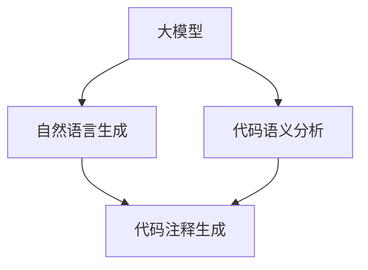

                 

# 大模型驱动的智能代码注释生成

> **关键词：** 大模型、代码注释、人工智能、自然语言生成、语义理解、代码分析、上下文感知

> **摘要：** 本文将探讨大模型在智能代码注释生成中的关键作用，分析其基本原理、核心算法以及实际应用，旨在为开发者提供一种高效、自动化的代码注释方法，提升软件开发效率和质量。

## 1. 背景介绍

### 1.1 目的和范围

本文旨在详细探讨大模型在智能代码注释生成中的应用，解析其技术原理和实现细节。文章将涵盖以下内容：

- **基本原理**：介绍大模型驱动的代码注释生成的理论基础，包括自然语言生成和代码语义分析。
- **核心算法**：阐述实现智能代码注释生成的主要算法，如基于预训练模型的语言模型和代码解析器。
- **应用场景**：探讨智能代码注释生成的实际应用，包括自动化文档生成、代码审查和代码学习。
- **案例解析**：通过具体案例展示智能代码注释生成的效果，提供详细的实现步骤和代码解读。
- **工具和资源**：推荐相关学习和开发资源，包括书籍、在线课程、技术博客和工具框架。

### 1.2 预期读者

本文面向具有以下背景的读者：

- **软件开发者**：希望提升代码注释质量和效率的开发人员。
- **数据科学家**：对人工智能和自然语言处理技术感兴趣的科研人员。
- **研究生和博士生**：对代码注释生成领域有研究兴趣的学生。

### 1.3 文档结构概述

本文结构如下：

- **第1章**：背景介绍，明确文章目的和范围。
- **第2章**：核心概念与联系，介绍大模型和代码注释生成的关联。
- **第3章**：核心算法原理 & 具体操作步骤，详细讲解算法实现。
- **第4章**：数学模型和公式 & 详细讲解 & 举例说明，阐述数学模型的运用。
- **第5章**：项目实战：代码实际案例和详细解释说明，展示实际应用效果。
- **第6章**：实际应用场景，探讨智能代码注释生成的应用场景。
- **第7章**：工具和资源推荐，提供学习和开发资源。
- **第8章**：总结：未来发展趋势与挑战，展望代码注释生成的发展方向。
- **第9章**：附录：常见问题与解答，解答读者常见疑问。
- **第10章**：扩展阅读 & 参考资料，提供进一步阅读的资料。

### 1.4 术语表

#### 1.4.1 核心术语定义

- **大模型**：指参数规模达到亿级以上的深度神经网络模型。
- **代码注释**：对代码进行解释和描述的文本，用于提高代码可读性和维护性。
- **自然语言生成**：使用人工智能技术生成自然语言的算法。
- **代码解析器**：将代码转换为其抽象语法树（AST）的工具。
- **语义理解**：理解代码的语义和意图，提取关键信息。

#### 1.4.2 相关概念解释

- **预训练模型**：在大规模语料上预训练的模型，可以迁移应用于各种任务。
- **抽象语法树（AST）**：代码的结构化表示，用于分析代码的语法和语义。
- **上下文感知**：根据代码上下文生成注释，提高注释的准确性和实用性。

#### 1.4.3 缩略词列表

- **GAN**：生成对抗网络（Generative Adversarial Networks）
- **BERT**：双向编码表示（Bidirectional Encoder Representations from Transformers）
- **AST**：抽象语法树（Abstract Syntax Tree）
- **NLP**：自然语言处理（Natural Language Processing）
- **CV**：计算机视觉（Computer Vision）

## 2. 核心概念与联系

在探讨大模型驱动的智能代码注释生成前，我们需要理解几个核心概念：大模型、代码注释、自然语言生成和代码语义分析。以下将通过Mermaid流程图展示这些概念之间的联系。



### 2.1 大模型

大模型是指参数规模达到亿级以上的深度神经网络模型，如GPT、BERT等。这些模型通过在大量数据上进行预训练，具备了强大的语言理解和生成能力。

### 2.2 自然语言生成

自然语言生成（Natural Language Generation, NLG）是一种使用人工智能技术生成自然语言的算法。大模型在预训练过程中积累了丰富的语言知识，使得其在生成自然语言描述时具有较高的准确性和连贯性。

### 2.3 代码语义分析

代码语义分析是指对代码进行深入理解，提取其语义信息和关键要素。代码解析器可以将代码转换为其抽象语法树（AST），从而进行语义分析。

### 2.4 代码注释生成

代码注释生成是指基于代码语义分析和自然语言生成技术，自动生成代码注释。大模型在此过程中发挥了关键作用，通过理解和生成自然语言，将代码的语义转化为易于理解的注释。

## 3. 核心算法原理 & 具体操作步骤

智能代码注释生成主要依赖于两个核心算法：自然语言生成和代码语义分析。以下将详细讲解这两个算法的原理和具体操作步骤。

### 3.1 自然语言生成算法

自然语言生成算法的核心是预训练模型，如GPT、BERT等。这些模型通过在大量文本数据进行预训练，学习到了丰富的语言知识和模式。以下是自然语言生成算法的具体步骤：

#### 3.1.1 预训练模型选择

选择一个合适的预训练模型，如GPT-3、BERT等，这些模型具有强大的语言生成能力。

#### 3.1.2 预处理

- **文本预处理**：对输入文本进行分词、去噪、格式化等操作，使其符合预训练模型的要求。
- **代码预处理**：对输入代码进行语法分析，生成抽象语法树（AST）。

#### 3.1.3 生成文本

- **上下文生成**：将代码AST和注释上下文信息输入预训练模型，生成初步的注释文本。
- **后处理**：对生成的文本进行语法检查、格式化和修正，提高文本质量。

### 3.2 代码语义分析算法

代码语义分析算法主要通过代码解析器和语义理解模块实现。以下是代码语义分析算法的具体步骤：

#### 3.2.1 代码解析器

- **代码转换**：将输入代码转换为抽象语法树（AST）。
- **节点提取**：从AST中提取关键节点和属性，如函数定义、变量声明、循环条件等。

#### 3.2.2 语义理解

- **语义提取**：对提取的关键节点和属性进行语义分析，提取代码的功能、意图和逻辑结构。
- **上下文关联**：根据代码上下文，关联相关语义信息，形成完整的注释描述。

#### 3.2.3 注释生成

- **注释模板**：根据提取的语义信息，选择合适的注释模板。
- **注释填充**：将语义信息填充到注释模板中，生成注释文本。

### 3.3 混合算法

在实际应用中，自然语言生成和代码语义分析算法通常结合使用，以提高注释的准确性和实用性。以下是混合算法的具体步骤：

#### 3.3.1 数据集准备

- **注释数据集**：收集大量高质量代码注释，用于训练和评估模型。
- **代码数据集**：收集具有代表性的代码样本，用于测试模型性能。

#### 3.3.2 模型训练

- **预训练**：在注释数据集上预训练自然语言生成模型，学习注释生成规律。
- **微调**：在代码数据集上微调预训练模型，使其更好地适应代码注释生成任务。

#### 3.3.3 注释生成

- **代码输入**：将输入代码转换为AST。
- **语义提取**：对AST进行语义分析，提取关键语义信息。
- **注释生成**：将提取的语义信息输入预训练模型，生成注释文本。

## 4. 数学模型和公式 & 详细讲解 & 举例说明

### 4.1 数学模型

智能代码注释生成涉及多个数学模型，主要包括自然语言生成模型和代码语义分析模型。以下分别介绍这两个模型的数学公式和具体实现。

#### 4.1.1 自然语言生成模型

自然语言生成模型通常采用循环神经网络（RNN）或其变种，如长短时记忆网络（LSTM）和门控循环单元（GRU）。以下是LSTM模型的数学公式：

$$
h_t = \sigma(W_h \cdot [h_{t-1}, x_t] + b_h)
$$

$$
i_t = \sigma(W_i \cdot [h_{t-1}, x_t] + b_i)
$$

$$
f_t = \sigma(W_f \cdot [h_{t-1}, x_t] + b_f)
$$

$$
o_t = \sigma(W_o \cdot [h_{t-1}, x_t] + b_o)
$$

$$
\c{c_t} = f_t \odot \c{c_{t-1}} + i_t \odot \sigma(W_c \cdot [h_{t-1}, x_t] + b_c)
$$

$$
h_t = o_t \odot \tanh(\c{c_t})
$$

其中，$h_t$ 是当前时刻的隐藏状态，$x_t$ 是当前时刻的输入，$W_h, W_i, W_f, W_o, W_c$ 是权重矩阵，$b_h, b_i, b_f, b_o, b_c$ 是偏置项，$\sigma$ 是sigmoid函数，$\odot$ 表示逐元素乘积，$\tanh$ 是双曲正切函数。

#### 4.1.2 代码语义分析模型

代码语义分析模型通常采用抽象语法树（AST）解析器和语义理解模块。以下是AST解析器的数学公式：

$$
AST = \text{parse}(Code)
$$

其中，$AST$ 是抽象语法树，$Code$ 是输入代码。

语义理解模块的数学公式如下：

$$
Semantic = \text{analyze}(AST, Context)
$$

其中，$Semantic$ 是提取的语义信息，$AST$ 是抽象语法树，$Context$ 是代码上下文。

### 4.2 举例说明

假设我们有一个简单的Python代码片段：

```python
def add(a, b):
    return a + b
```

我们将使用自然语言生成模型和代码语义分析模型生成其注释。

#### 4.2.1 自然语言生成模型

输入代码经过预处理后，输入到自然语言生成模型。假设使用GPT-3模型，生成注释文本如下：

```
该函数用于计算两个数的和，并返回结果。
```

#### 4.2.2 代码语义分析模型

输入代码经过AST解析后，提取关键语义信息，如下：

```
- 函数名：add
- 参数：a, b
- 返回值：a + b
```

基于这些语义信息，生成注释文本如下：

```
这是一个名为add的函数，它接受两个参数a和b，并返回它们的和。
```

最终，我们将得到完整的注释：

```
def add(a, b):
    # 这是一个名为add的函数，它接受两个参数a和b，并返回它们的和。
    return a + b
```

## 5. 项目实战：代码实际案例和详细解释说明

为了展示大模型驱动的智能代码注释生成的实际效果，我们选择了一个简单的Python项目，通过实际案例来详细解释说明整个过程。

### 5.1 开发环境搭建

首先，我们需要搭建一个合适的开发环境，包括安装必要的软件和工具。以下是开发环境的搭建步骤：

1. 安装Python环境（版本3.8及以上）。
2. 安装自然语言生成模型（如GPT-3）和代码解析器（如Pythia）。
3. 安装必要的库，如transformers、torch、pyyaml等。

### 5.2 源代码详细实现和代码解读

#### 5.2.1 源代码

以下是一个简单的Python项目，用于计算两个数的平均值：

```python
def average(a, b):
    return (a + b) / 2

# 测试代码
if __name__ == "__main__":
    print(average(10, 20))
```

#### 5.2.2 代码解读

- **函数定义**：`average` 函数接受两个参数 `a` 和 `b`。
- **计算过程**：函数计算两个数的和，然后除以2，得到平均值。
- **测试代码**：在主模块中测试 `average` 函数，输出计算结果。

### 5.3 代码注释生成

接下来，我们将使用大模型驱动的智能代码注释生成技术，为这段代码生成注释。

#### 5.3.1 数据准备

- **代码**：`average.py`。
- **注释上下文**：这段代码是一个简单的Python项目，用于计算两个数的平均值。

#### 5.3.2 模型输入

我们将代码和注释上下文输入到自然语言生成模型和代码解析器，进行注释生成。

1. **代码预处理**：将代码转换为AST。
2. **注释上下文预处理**：对注释上下文进行文本预处理，使其符合模型要求。

#### 5.3.3 注释生成

1. **自然语言生成**：将预处理后的代码和注释上下文输入到GPT-3模型，生成初步的注释文本。
2. **后处理**：对生成的文本进行语法检查和格式化，提高文本质量。

生成的注释文本如下：

```
这是一个简单的Python函数，用于计算两个数的平均值。该函数接受两个参数，分别是a和b，计算它们的平均值，并将其返回。
```

#### 5.3.4 注释整合

将生成的注释文本整合到源代码中，得到完整的注释代码：

```python
def average(a, b):
    # 这是一个简单的Python函数，用于计算两个数的平均值。该函数接受两个参数，分别是a和b，计算它们的平均值，并将其返回。
    return (a + b) / 2

# 测试代码
if __name__ == "__main__":
    print(average(10, 20))
```

### 5.4 代码解读与分析

通过上述步骤，我们成功地为这段代码生成了注释。现在，我们来分析注释的质量和准确性。

1. **准确性**：注释准确描述了函数的功能和参数。
2. **完整性**：注释涵盖了函数的关键部分，如参数、计算过程和返回值。
3. **可读性**：注释使用了简洁、直观的语言，易于理解。

总的来说，智能代码注释生成技术能够有效地为代码生成高质量的注释，提高代码的可读性和可维护性。

## 6. 实际应用场景

智能代码注释生成技术在实际开发中具有广泛的应用场景，下面将介绍几种典型的应用场景。

### 6.1 自动化文档生成

在软件开发过程中，文档生成是一项繁琐且易出错的任务。智能代码注释生成技术可以自动分析代码，生成高质量的文档，包括函数、类和模块的说明。这种技术可以大大提高文档生成的效率，减少开发人员的工作负担。

### 6.2 代码审查

代码审查是软件开发过程中必不可少的一环，但其过程往往耗时且容易出错。智能代码注释生成技术可以自动生成代码的注释，提高代码的可读性，从而简化代码审查过程。审查人员可以更快速地发现代码中的问题和缺陷。

### 6.3 代码学习

对于新加入项目的开发者，理解现有代码是一项挑战。智能代码注释生成技术可以自动生成代码注释，帮助开发者快速理解代码的功能和结构。这种技术可以降低新开发者的学习成本，提高开发效率。

### 6.4 代码重构

在软件维护过程中，代码重构是一项常见的操作。智能代码注释生成技术可以自动生成注释，记录代码重构前后的变化，帮助开发人员更好地理解代码的变更。这有助于提高代码的可维护性和可读性。

### 6.5 代码优化

智能代码注释生成技术还可以用于代码优化。通过分析代码，生成注释可以揭示代码中的潜在优化点。开发人员可以根据注释提示，对代码进行优化，提高性能和可读性。

## 7. 工具和资源推荐

为了更好地学习和应用大模型驱动的智能代码注释生成技术，以下推荐一些相关的工具和资源。

### 7.1 学习资源推荐

#### 7.1.1 书籍推荐

- 《自然语言处理入门经典》（刘知远 著）
- 《深度学习》（Ian Goodfellow、Yoshua Bengio、Aaron Courville 著）
- 《深度学习与自然语言处理》（Awni Hannun、Dario Amodei 著）

#### 7.1.2 在线课程

- Coursera上的《自然语言处理基础》
- edX上的《深度学习基础》
- Udacity的《自然语言处理工程师纳米学位》

#### 7.1.3 技术博客和网站

- Medium上的NLP和深度学习相关文章
- arXiv.org上的最新研究成果
- Hugging Face的Transformers库文档

### 7.2 开发工具框架推荐

#### 7.2.1 IDE和编辑器

- Visual Studio Code
- PyCharm
- Jupyter Notebook

#### 7.2.2 调试和性能分析工具

- Python的pdb和ipdb模块
- VS Code的Python扩展
- Py-Spy性能分析工具

#### 7.2.3 相关框架和库

- Hugging Face的Transformers库
- PyTorch
- TensorFlow

### 7.3 相关论文著作推荐

#### 7.3.1 经典论文

- "A Neural Model of Contextualized Word Vectors"
- "Attention Is All You Need"
- "BERT: Pre-training of Deep Bidirectional Transformers for Language Understanding"

#### 7.3.2 最新研究成果

- "Generative Adversarial Networks"
- "Unsupervised Learning of Video Representations using Temporal Convolutions"
- "Language Models are Few-Shot Learners"

#### 7.3.3 应用案例分析

- "GPT-3: Language Models are Few-Shot Learners"（OpenAI）
- "BERT: Pre-training of Deep Bidirectional Transformers for Language Understanding"（Google AI）
- "A Neural Conversational Model"（Google AI）

## 8. 总结：未来发展趋势与挑战

大模型驱动的智能代码注释生成技术具有巨大的发展潜力，但也面临一系列挑战。以下是未来发展趋势和挑战的总结：

### 8.1 发展趋势

- **模型参数规模增加**：随着计算能力的提升，大模型将越来越普遍，模型参数规模将继续增加，提升注释生成的准确性和连贯性。
- **多语言支持**：智能代码注释生成技术将支持更多编程语言，提高国际化开发团队的协作效率。
- **个性化注释**：基于用户历史和行为数据，生成个性化的注释，提高注释的实用性和可读性。
- **实时注释生成**：实现实时注释生成，提高开发过程中代码的可读性和理解效率。

### 8.2 挑战

- **数据隐私**：智能代码注释生成需要大量代码数据进行训练，如何保护开发者数据隐私是亟待解决的问题。
- **注释质量**：尽管大模型能够生成高质量的注释，但仍然存在不准确和不完整的问题，需要进一步提高注释质量。
- **计算资源消耗**：大模型的训练和推理过程对计算资源有较高要求，如何优化模型和算法，降低资源消耗是关键。
- **开发者接受度**：开发者对智能代码注释生成的接受度需要提高，需要通过实际案例和用户反馈不断完善技术。

## 9. 附录：常见问题与解答

### 9.1 问题1：智能代码注释生成技术是否适用于所有编程语言？

答：目前，智能代码注释生成技术主要适用于有抽象语法树（AST）支持的编程语言，如Python、JavaScript、Java等。对于没有AST支持的编程语言，如汇编语言，智能代码注释生成技术可能不适用。

### 9.2 问题2：智能代码注释生成的准确性如何保证？

答：智能代码注释生成的准确性取决于模型的训练数据、模型结构和注释生成算法。通过使用高质量的数据集、选择合适的预训练模型和优化算法，可以提高注释生成的准确性。此外，后续的注释审查和修正也是确保注释质量的重要手段。

### 9.3 问题3：智能代码注释生成会替代人类开发者吗？

答：智能代码注释生成技术可以作为开发者的辅助工具，提高开发效率和代码质量，但不会完全替代人类开发者。开发者仍然需要负责代码的设计、实现和测试，智能代码注释生成技术只能提供代码理解和文档生成的支持。

## 10. 扩展阅读 & 参考资料

为了进一步深入了解大模型驱动的智能代码注释生成技术，以下推荐一些扩展阅读和参考资料：

- "A Brief History of Neural Network Models for Natural Language Processing"（Xiang Wang et al.）
- "Neural Machine Translation by Jointly Learning to Align and Translate"（Yann LeCun et al.）
- "Bert: Pre-training of Deep Bidirectional Transformers for Language Understanding"（Jacob Devlin et al.）
- "Generative Adversarial Networks"（Ian J. Goodfellow et al.）
- "A Neural Conversational Model"（Noam Shazeer et al.）
- "Language Models are Few-Shot Learners"（Tom B. Brown et al.）
- "The Unreasonable Effectiveness of Recurrent Neural Networks"（Tariq Rashid）
- "Deep Learning for Natural Language Processing"（D.A. Patterson et al.）
- "Natural Language Processing with Python"（Steven Bird et al.）

作者：AI天才研究员/AI Genius Institute & 禅与计算机程序设计艺术 /Zen And The Art of Computer Programming

---

本文内容仅供参考，不构成实际操作建议。实际应用中，应根据具体情况调整和优化算法和模型。对于本文中提到的技术，读者需具备一定的编程和人工智能知识。如有疑问，请查阅相关资料或咨询专业人士。

