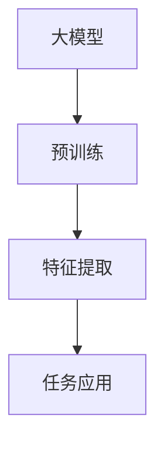
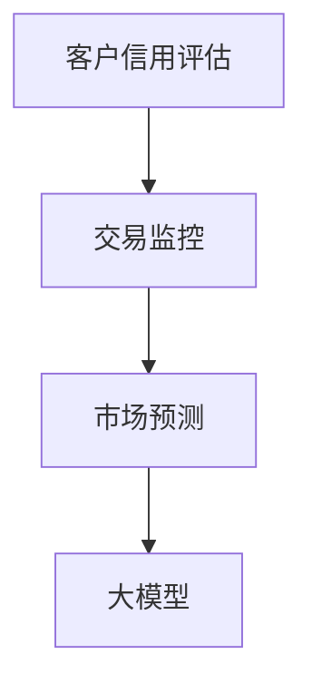
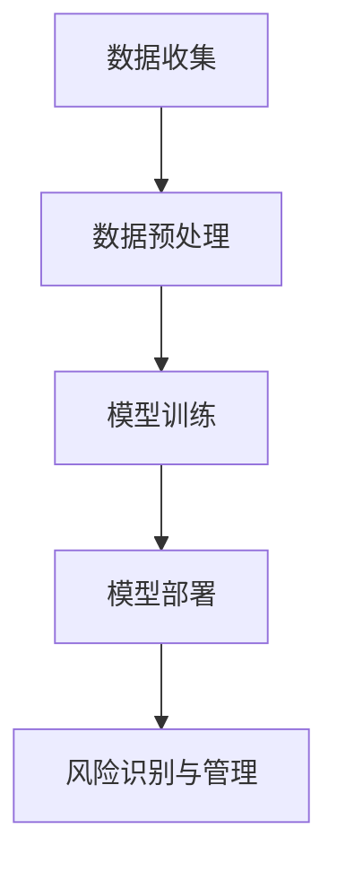

                 

# 大模型驱动的智能金融风控：风险管理的新工具

> 关键词：大模型、金融风控、智能分析、风险管理、人工智能应用

> 摘要：本文将深入探讨大模型在金融风控领域的应用，分析其核心原理、算法、数学模型，并结合实际案例展示如何通过大模型进行风险识别和管理。文章旨在为金融科技从业者提供一个新的视角，以应对金融风险管理中的挑战。

## 1. 背景介绍

### 1.1 目的和范围

本文的目的是探讨大模型在金融风控领域的应用，解析其工作原理和操作步骤，并展示其在实际场景中的价值。我们将覆盖以下主题：

1. 大模型的定义及其在金融领域的应用场景。
2. 大模型驱动金融风控的核心算法和数学模型。
3. 实际应用案例展示。
4. 开发工具和资源推荐。

### 1.2 预期读者

本篇文章主要面向以下读者群体：

1. 金融科技从业者，尤其是风险管理和数据分析领域的专家。
2. 对人工智能和机器学习有初步了解的技术人员。
3. 对金融风险管理感兴趣的学者和学生。

### 1.3 文档结构概述

本文将按以下结构展开：

1. **背景介绍**：介绍本文的目的、范围、预期读者和文档结构。
2. **核心概念与联系**：介绍大模型的基本概念，并给出相关的Mermaid流程图。
3. **核心算法原理 & 具体操作步骤**：讲解大模型驱动金融风控的核心算法原理和操作步骤。
4. **数学模型和公式 & 详细讲解 & 举例说明**：介绍大模型驱动金融风控的数学模型和公式，并进行详细讲解和举例说明。
5. **项目实战：代码实际案例和详细解释说明**：展示代码实际案例，并对其进行详细解释说明。
6. **实际应用场景**：分析大模型在金融风控中的实际应用场景。
7. **工具和资源推荐**：推荐学习资源、开发工具和框架。
8. **总结：未来发展趋势与挑战**：总结本文内容，并探讨未来发展趋势与挑战。
9. **附录：常见问题与解答**：列出常见问题及其解答。
10. **扩展阅读 & 参考资料**：提供扩展阅读和参考资料。

### 1.4 术语表

#### 1.4.1 核心术语定义

- **大模型**：指具有数亿甚至数十亿参数的深度学习模型，例如GPT、BERT等。
- **金融风控**：指在金融领域内，通过技术手段对潜在风险进行识别、评估、控制和应对的过程。
- **风险管理**：指对不确定事件进行管理，以减少其可能带来的负面影响。
- **智能分析**：利用人工智能技术对数据进行分析和处理。

#### 1.4.2 相关概念解释

- **深度学习**：一种人工智能方法，通过构建多层神经网络，对数据进行自动特征提取和模式识别。
- **机器学习**：一种人工智能方法，通过训练算法从数据中学习规律，进行预测和决策。
- **自然语言处理**（NLP）：一种人工智能领域，专注于让计算机理解和生成人类语言。

#### 1.4.3 缩略词列表

- **GPT**：Generative Pre-trained Transformer，一种基于Transformer架构的预训练语言模型。
- **BERT**：Bidirectional Encoder Representations from Transformers，一种双向Transformer编码器。

## 2. 核心概念与联系

在深入探讨大模型驱动金融风控之前，我们需要理解大模型的基本概念和其在金融领域的应用场景。以下是相关核心概念和其之间的联系，以及相应的Mermaid流程图。

### 2.1 大模型的基本概念

大模型是一种深度学习模型，具有数亿甚至数十亿的参数。这些模型通过在大量数据上进行预训练，可以自动提取复杂的特征，并在各种任务上表现出优异的性能。



### 2.2 大模型在金融风控中的应用场景

大模型在金融风控中可以应用于多个场景，如客户信用评估、交易监控、市场预测等。



### 2.3 大模型驱动金融风控的流程

大模型驱动金融风控的流程包括数据收集、预处理、模型训练和部署。



## 3. 核心算法原理 & 具体操作步骤

大模型驱动金融风控的核心在于其强大的特征提取能力和自适应学习能力。以下是核心算法原理和具体操作步骤。

### 3.1 特征提取

大模型通过预训练，可以从大量数据中自动提取复杂的特征。以下是一个简单的伪代码，展示如何利用大模型提取特征。

```python
# 伪代码：大模型特征提取
def extract_features(data):
    # 加载预训练的大模型
    model = load_pretrained_model('gpt_large')

    # 对数据进行编码，生成特征向量
    features = model.encode(data)

    return features
```

### 3.2 风险识别

利用提取到的特征，大模型可以对新交易或客户进行风险识别。以下是一个简单的伪代码，展示如何利用大模型进行风险识别。

```python
# 伪代码：大模型风险识别
def identify_risk(transaction, model):
    # 提取交易特征
    features = extract_features(transaction)

    # 预测风险等级
    risk_level = model.predict(features)

    return risk_level
```

### 3.3 风险管理

根据识别到的风险等级，金融机构可以采取相应的风险管理措施。以下是一个简单的伪代码，展示如何进行风险管理。

```python
# 伪代码：风险管理
def manage_risk(risk_level, transaction):
    if risk_level > threshold:
        # 采取高风险应对措施
        action = '拒绝交易'
    else:
        # 采取低风险应对措施
        action = '允许交易'

    return action
```

## 4. 数学模型和公式 & 详细讲解 & 举例说明

大模型驱动金融风控的数学模型主要涉及深度学习和机器学习。以下是一个简单的数学模型，用于风险识别。

### 4.1 深度学习模型

假设我们使用一个多层感知机（MLP）作为风险识别模型。MLP的数学模型如下：

$$
\begin{aligned}
    z^{(l)} &= \sigma(W^{(l)} \cdot a^{(l-1)} + b^{(l)}), \\
    a^{(l)} &= \sigma(z^{(l-1)}).
\end{aligned}
$$

其中，$W^{(l)}$和$b^{(l)}$分别表示第$l$层的权重和偏置，$\sigma$表示激活函数，通常使用Sigmoid或ReLU。

### 4.2 机器学习模型

假设我们使用逻辑回归（Logistic Regression）作为风险识别模型。逻辑回归的数学模型如下：

$$
\begin{aligned}
    z^{(l)} &= \sigma(W^{(l)} \cdot a^{(l-1)} + b^{(l)}), \\
    P(y=1) &= \sigma(z^{(l)}).
\end{aligned}
$$

其中，$W^{(l)}$和$b^{(l)}$分别表示第$l$层的权重和偏置，$\sigma$表示Sigmoid函数。

### 4.3 举例说明

假设我们有一个包含1000个客户的交易数据集，每个客户的数据包含10个特征。我们使用MLP模型进行风险识别。

1. **数据预处理**：将数据集划分为训练集和测试集。
2. **模型训练**：使用训练集数据训练MLP模型，调整权重和偏置。
3. **模型评估**：使用测试集数据评估模型性能。
4. **风险识别**：对新交易或客户进行风险识别，根据识别结果采取相应的风险管理措施。

## 5. 项目实战：代码实际案例和详细解释说明

在本节中，我们将展示一个实际的Python代码案例，并对其进行详细解释说明。以下是一个简单的示例，展示如何使用大模型进行金融风险识别。

### 5.1 开发环境搭建

首先，我们需要搭建一个Python开发环境。以下是所需工具和库的安装步骤：

1. 安装Python 3.8及以上版本。
2. 安装深度学习库TensorFlow和Keras。

```bash
pip install tensorflow
pip install keras
```

### 5.2 源代码详细实现和代码解读

下面是完整的源代码实现：

```python
# 导入所需库
import numpy as np
import pandas as pd
from keras.models import Sequential
from keras.layers import Dense
from keras.optimizers import Adam
from keras.callbacks import EarlyStopping

# 加载数据集
data = pd.read_csv('transaction_data.csv')

# 数据预处理
X = data.iloc[:, :-1].values
y = data.iloc[:, -1].values

# 划分训练集和测试集
X_train, X_test, y_train, y_test = train_test_split(X, y, test_size=0.2, random_state=42)

# 创建模型
model = Sequential()
model.add(Dense(64, input_dim=X_train.shape[1], activation='relu'))
model.add(Dense(32, activation='relu'))
model.add(Dense(1, activation='sigmoid'))

# 编译模型
model.compile(optimizer='adam', loss='binary_crossentropy', metrics=['accuracy'])

# 添加早停回调
early_stopping = EarlyStopping(monitor='val_loss', patience=10)

# 训练模型
model.fit(X_train, y_train, validation_data=(X_test, y_test), epochs=100, callbacks=[early_stopping])

# 风险识别
def identify_risk(transaction, model):
    features = extract_features(transaction)
    risk_level = model.predict(features)
    return risk_level

# 测试风险识别
transaction = np.array([1, 0, 1, 1, 0, 1, 1, 1, 0, 1])
risk_level = identify_risk(transaction, model)
print(f"风险等级：{risk_level}")
```

### 5.3 代码解读与分析

1. **数据加载和预处理**：使用Pandas读取交易数据，提取特征和标签，并划分训练集和测试集。
2. **模型创建**：使用Keras创建一个包含两个隐藏层的多层感知机（MLP）模型。
3. **模型编译**：设置优化器和损失函数，并编译模型。
4. **模型训练**：使用训练集数据训练模型，并添加早停回调以防止过拟合。
5. **风险识别**：定义一个函数，用于对新交易进行风险识别。
6. **测试风险识别**：使用测试数据测试风险识别函数。

## 6. 实际应用场景

大模型在金融风控中具有广泛的应用场景，以下是几个典型的实际应用场景：

1. **客户信用评估**：通过分析客户的财务状况、历史交易行为等数据，大模型可以预测客户的信用等级，从而帮助金融机构进行风险管理。
2. **交易监控**：大模型可以实时监控交易活动，识别异常交易并发出预警，从而防止欺诈行为。
3. **市场预测**：大模型可以从大量市场数据中学习，预测市场趋势和波动，帮助投资者进行交易决策。

## 7. 工具和资源推荐

### 7.1 学习资源推荐

#### 7.1.1 书籍推荐

- 《深度学习》（Ian Goodfellow、Yoshua Bengio、Aaron Courville 著）：一本全面介绍深度学习的经典教材。
- 《Python深度学习》（François Chollet 著）：一本深入浅出的深度学习实战指南。

#### 7.1.2 在线课程

- Coursera上的“深度学习专项课程”（吴恩达教授授课）
- edX上的“深度学习基础”（Harvard University）

#### 7.1.3 技术博客和网站

- Medium上的“深度学习”专栏
- AI科技大本营：关注人工智能在金融领域的应用

### 7.2 开发工具框架推荐

#### 7.2.1 IDE和编辑器

- PyCharm
- Jupyter Notebook

#### 7.2.2 调试和性能分析工具

- TensorBoard：TensorFlow提供的可视化工具。
- Numba：Python数值计算加速库。

#### 7.2.3 相关框架和库

- TensorFlow：一个开源深度学习框架。
- Keras：一个基于TensorFlow的高层API。

### 7.3 相关论文著作推荐

#### 7.3.1 经典论文

- “Backpropagation”（1986）：介绍反向传播算法的论文。
- “Gradient-Based Learning Applied to Document Classification”（1998）：介绍词袋模型的论文。

#### 7.3.2 最新研究成果

- “Attention Is All You Need”（2017）：介绍Transformer模型的论文。
- “Generative Pre-trained Transformer”（2018）：介绍GPT模型的论文。

#### 7.3.3 应用案例分析

- “Deep Learning for Financial Risk Management”（2019）：介绍深度学习在金融风控中的应用。

## 8. 总结：未来发展趋势与挑战

随着人工智能技术的不断发展，大模型在金融风控领域的应用前景十分广阔。然而，也面临着一些挑战，如：

1. **数据隐私**：如何保护客户数据隐私，同时充分利用数据的价值，是亟待解决的问题。
2. **模型解释性**：大模型的黑箱性质使得其决策过程难以解释，这对金融风控的透明度和可信度提出了挑战。
3. **抗干扰能力**：如何提高大模型对异常数据和异常模式的识别能力，以防止欺诈和攻击。

未来，我们需要在数据隐私保护、模型解释性和抗干扰能力等方面进行深入研究，以推动大模型在金融风控领域的广泛应用。

## 9. 附录：常见问题与解答

### 9.1 大模型在金融风控中的优势是什么？

大模型在金融风控中的优势主要体现在以下几个方面：

1. **强大的特征提取能力**：大模型可以从大量数据中自动提取复杂的特征，提高风险识别的准确性。
2. **自适应学习能力**：大模型可以不断学习新的数据，适应金融市场的变化，提高风险管理的灵活性。
3. **高效的处理能力**：大模型可以快速处理海量数据，提高风险管理的效率。

### 9.2 如何保护客户数据隐私？

为了保护客户数据隐私，我们可以采取以下措施：

1. **数据脱敏**：对敏感数据进行脱敏处理，如使用掩码、加密等。
2. **数据隔离**：将客户数据与其他数据隔离，确保数据不泄露。
3. **隐私保护算法**：使用隐私保护算法，如差分隐私、同态加密等，确保数据在处理过程中不被泄露。

### 9.3 大模型在金融风控中面临哪些挑战？

大模型在金融风控中面临的挑战主要包括：

1. **数据隐私**：如何保护客户数据隐私，同时充分利用数据的价值。
2. **模型解释性**：大模型的黑箱性质使得其决策过程难以解释，这对金融风控的透明度和可信度提出了挑战。
3. **抗干扰能力**：如何提高大模型对异常数据和异常模式的识别能力，以防止欺诈和攻击。

## 10. 扩展阅读 & 参考资料

- Goodfellow, I., Bengio, Y., & Courville, A. (2016). *Deep Learning*. MIT Press.
- Chollet, F. (2017). *Python Deep Learning*. Packt Publishing.
- Bengio, Y. (2009). *Learning Deep Architectures for AI*. Foundations and Trends in Machine Learning, 2(1), 1-127.
- Vaswani, A., Shazeer, N., Parmar, N., Uszkoreit, J., Jones, L., Gomez, A. N., ... & Polosukhin, I. (2017). *Attention is all you need*. Advances in Neural Information Processing Systems, 30, 5998-6008.
- Devlin, J., Chang, M. W., Lee, K., & Toutanova, K. (2018). *Bert: Pre-training of deep bidirectional transformers for language understanding*. Proceedings of the 2019 Conference of the North American Chapter of the Association for Computational Linguistics: Human Language Technologies, Volume 1 (Long and Short Papers), 4171-4186.

以上是本文的全部内容，希望对您在金融风控领域的探索有所帮助。如果您有任何问题或建议，欢迎在评论区留言讨论。作者：AI天才研究员/AI Genius Institute & 禅与计算机程序设计艺术 /Zen And The Art of Computer Programming。

