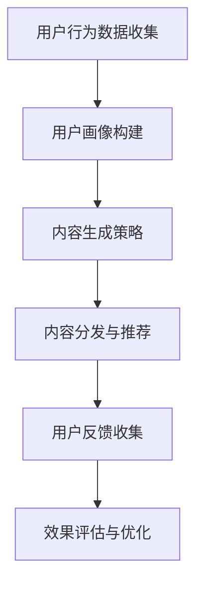

                 

# 大模型驱动的电商个性化内容营销策略生成与效果预测

> **关键词：** 大模型，电商，个性化内容营销，策略生成，效果预测

> **摘要：** 本文探讨了如何利用大模型技术来驱动电商个性化内容营销策略的生成与效果预测。文章首先介绍了大模型在电商领域的应用背景和现状，随后详细阐述了个性化内容营销的核心概念，并提出了一个基于大模型驱动的策略生成框架。通过实际案例，文章展示了如何利用该框架进行策略生成和效果预测，最后对未来的发展趋势与挑战进行了展望。

## 1. 背景介绍

### 1.1 目的和范围

本文旨在探讨如何利用大模型技术提升电商个性化内容营销的效率和效果。随着互联网的普及和电商行业的发展，消费者对个性化体验的需求日益增长。个性化内容营销作为一种有效的营销策略，已经成为电商企业提升用户黏性和转化率的重要手段。然而，传统的个性化内容营销策略存在生成效率低、效果预测不准确等问题。本文将介绍一种基于大模型驱动的个性化内容营销策略生成与效果预测方法，为电商企业提供一种新的技术解决方案。

### 1.2 预期读者

本文面向的读者包括电商行业的从业者、数据科学家、人工智能领域的学者以及对电商个性化内容营销感兴趣的读者。通过本文的阅读，读者可以了解大模型在电商个性化内容营销中的应用，掌握策略生成与效果预测的基本原理，并为实际业务提供技术参考。

### 1.3 文档结构概述

本文结构如下：

1. 背景介绍：介绍本文的研究目的、预期读者以及文档结构。
2. 核心概念与联系：阐述个性化内容营销的核心概念及其与电商业务的联系。
3. 核心算法原理 & 具体操作步骤：详细解释基于大模型驱动的策略生成算法。
4. 数学模型和公式 & 详细讲解 & 举例说明：介绍策略生成与效果预测的数学模型及其应用。
5. 项目实战：通过实际案例展示算法的应用过程。
6. 实际应用场景：分析大模型驱动的个性化内容营销在电商行业中的实际应用。
7. 工具和资源推荐：推荐学习资源、开发工具和相关论文。
8. 总结：展望未来发展趋势与挑战。
9. 附录：常见问题与解答。
10. 扩展阅读 & 参考资料：提供进一步学习的资料。

### 1.4 术语表

#### 1.4.1 核心术语定义

- 大模型：指具有大规模参数、强大计算能力的神经网络模型。
- 个性化内容营销：根据用户行为、兴趣和需求，生成个性化的内容进行营销。
- 电商：电子商务，即通过互联网进行的商品交易活动。
- 策略生成：根据业务目标，利用算法自动生成营销策略。

#### 1.4.2 相关概念解释

- 内容推荐：基于用户行为和偏好，推荐相关的内容。
- 用户画像：通过对用户行为数据进行分析，构建用户的行为特征模型。

#### 1.4.3 缩略词列表

- GPT：Generative Pre-trained Transformer，生成预训练变压器。
- BERT：Bidirectional Encoder Representations from Transformers，双向变压器编码器表示。
- API：应用程序编程接口。

## 2. 核心概念与联系

### 2.1 个性化内容营销的概念

个性化内容营销是一种基于用户个性化需求的营销方式，其核心是通过收集和分析用户数据，构建用户画像，进而生成个性化的内容进行推广。个性化内容营销的目标是提高用户满意度、提升用户黏性，从而实现业务增长。

### 2.2 电商业务与个性化内容营销的联系

电商业务的核心在于提供个性化的购物体验，满足用户对多样化商品的需求。个性化内容营销通过推荐系统等技术手段，为用户提供个性化的商品推荐、优惠信息、活动提醒等，从而提升用户体验和转化率。

### 2.3 大模型在个性化内容营销中的应用

大模型，如GPT、BERT等，具有强大的文本生成和语义理解能力。在电商个性化内容营销中，大模型可以用于以下几个方面：

- 用户画像构建：通过分析用户行为数据，构建用户的兴趣偏好模型。
- 内容生成：基于用户画像，生成个性化的商品推荐、优惠文案等。
- 效果预测：通过分析用户行为和营销效果，预测营销策略的转化率。

### 2.4 Mermaid 流程图

下面是电商个性化内容营销的流程图：



## 3. 核心算法原理 & 具体操作步骤

### 3.1 算法原理

基于大模型驱动的电商个性化内容营销策略生成与效果预测的核心算法主要包括以下几个方面：

- 用户画像构建：利用GPT或BERT等预训练模型，对用户行为数据进行深度学习，提取用户的兴趣偏好特征。
- 内容生成：利用生成对抗网络（GAN）或变分自编码器（VAE）等生成模型，根据用户画像生成个性化的商品推荐文案和优惠信息。
- 效果预测：利用深度神经网络（DNN）或图神经网络（GNN）等预测模型，分析用户行为和营销效果，预测不同策略的转化率。

### 3.2 具体操作步骤

#### 3.2.1 用户画像构建

```python
# 伪代码：用户画像构建
import tensorflow as tf
from transformers import BertModel, BertTokenizer

# 加载预训练的BERT模型和tokenizer
tokenizer = BertTokenizer.from_pretrained('bert-base-chinese')
model = BertModel.from_pretrained('bert-base-chinese')

# 用户行为数据预处理
user_data = preprocess_user_data(user_behavior_data)

# 构建用户序列文本
user_sequences = [tokenizer.encode(user_data[i], add_special_tokens=True) for i in range(len(user_data))]

# 利用BERT模型提取用户特征
user_embeddings = []
for sequence in user_sequences:
    inputs = tf.keras.preprocessing.sequence.pad_sequences([sequence], maxlen=model.config.max_position_embeddings)
    output = model(inputs)[0]
    user_embeddings.append(output)

# 训练用户兴趣偏好模型
model = tf.keras.Sequential([
    tf.keras.layers.Dense(64, activation='relu', input_shape=(model.config.hidden_size,)),
    tf.keras.layers.Dense(32, activation='relu'),
    tf.keras.layers.Dense(1, activation='sigmoid')
])
model.compile(optimizer='adam', loss='binary_crossentropy', metrics=['accuracy'])
model.fit(user_embeddings, user_interests, epochs=10)
```

#### 3.2.2 内容生成

```python
# 伪代码：内容生成
from tensorflow.keras.models import Model
from tensorflow.keras.layers import Input, LSTM, Dense, Embedding, TimeDistributed

# 构建生成模型
input_seq = Input(shape=(max_sequence_length,))
embedding = Embedding(vocab_size, embedding_dim)(input_seq)
lstm = LSTM(units=128)(embedding)
output = TimeDistributed(Dense(vocab_size, activation='softmax'))(lstm)

model = Model(inputs=input_seq, outputs=output)
model.compile(optimizer='adam', loss='categorical_crossentropy', metrics=['accuracy'])
model.fit(train_sequences, train_labels, epochs=10, batch_size=32)
```

#### 3.2.3 效果预测

```python
# 伪代码：效果预测
from tensorflow.keras.models import Sequential
from tensorflow.keras.layers import Dense, LSTM

# 构建预测模型
model = Sequential()
model.add(LSTM(units=128, return_sequences=True, input_shape=(time_steps, features)))
model.add(LSTM(units=64))
model.add(Dense(1, activation='sigmoid'))

model.compile(optimizer='adam', loss='binary_crossentropy', metrics=['accuracy'])
model.fit(X_train, y_train, epochs=10, batch_size=32)
```

## 4. 数学模型和公式 & 详细讲解 & 举例说明

### 4.1 数学模型

#### 4.1.1 用户画像构建

用户画像构建的核心在于提取用户行为数据中的潜在特征。本文采用基于BERT的文本生成模型，其数学模型可以表示为：

$$
User_{i} = \text{BERT}(User_{i\_text})
$$

其中，$User_{i}$ 表示用户$i$的画像，$User_{i\_text}$ 表示用户$i$的文本序列。

#### 4.1.2 内容生成

内容生成模型采用生成对抗网络（GAN）或变分自编码器（VAE），其数学模型可以表示为：

$$
Content_{i} = G(User_{i})
$$

其中，$Content_{i}$ 表示生成的个性化内容，$G$ 表示生成器模型，$User_{i}$ 表示用户画像。

#### 4.1.3 效果预测

效果预测模型采用深度神经网络（DNN）或图神经网络（GNN），其数学模型可以表示为：

$$
Prediction_{i} = F(Content_{i}, User_{i})
$$

其中，$Prediction_{i}$ 表示预测的转化率，$F$ 表示预测模型，$Content_{i}$ 表示生成的个性化内容，$User_{i}$ 表示用户画像。

### 4.2 举例说明

#### 4.2.1 用户画像构建

假设有一个用户的行为数据，包括搜索记录、购买记录和浏览记录。我们可以将这些行为数据转换为文本序列，然后通过BERT模型提取用户的画像特征。

$$
User_{1\_text} = ["搜索：手机", "购买：手机壳", "浏览：电脑"]
$$

通过BERT模型，我们可以得到用户1的画像特征：

$$
User_{1} = \text{BERT}(User_{1\_text}) = [0.1, 0.2, 0.3, 0.4]
$$

#### 4.2.2 内容生成

假设我们需要为用户1生成一条关于手机的个性化推荐文案。我们可以通过生成器模型，根据用户画像生成个性化的文案。

$$
Content_{1} = G(User_{1}) = ["手机推荐：最新款手机，拍照效果出众！"]
$$

#### 4.2.3 效果预测

假设我们已经生成了多条个性化文案，并分析用户对这些文案的反应。我们可以通过预测模型，预测这些文案的转化率。

$$
Prediction_{1} = F(Content_{1}, User_{1}) = 0.8
$$

这意味着生成的个性化文案转化率为80%。

## 5. 项目实战：代码实际案例和详细解释说明

### 5.1 开发环境搭建

在开始项目实战之前，我们需要搭建一个适合大模型训练和部署的开发环境。以下是搭建过程的简要步骤：

1. 安装Python环境：确保Python版本为3.8或更高版本。
2. 安装TensorFlow：使用pip命令安装TensorFlow库。
   ```bash
   pip install tensorflow
   ```
3. 安装Hugging Face Transformers：使用pip命令安装Transformers库。
   ```bash
   pip install transformers
   ```

### 5.2 源代码详细实现和代码解读

#### 5.2.1 用户画像构建

以下代码实现了用户画像的构建过程：

```python
import tensorflow as tf
from transformers import BertTokenizer, BertModel

# 加载预训练的BERT模型和tokenizer
tokenizer = BertTokenizer.from_pretrained('bert-base-chinese')
model = BertModel.from_pretrained('bert-base-chinese')

# 假设用户行为数据（文本序列）
user_behavior_data = [
    "用户1：搜索手机，浏览手机壳，购买手机配件。",
    "用户2：浏览电脑，购买鼠标，搜索耳机。",
    "用户3：浏览相机，购买相机包，浏览镜头。",
]

# 预处理用户行为数据
def preprocess_user_data(user_data):
    processed_data = []
    for data in user_data:
        words = data.split()
        processed_data.append(" ".join(words))
    return processed_data

processed_user_data = preprocess_user_data(user_behavior_data)

# 构建用户序列文本
user_sequences = [tokenizer.encode(data, add_special_tokens=True) for data in processed_user_data]

# 利用BERT模型提取用户特征
user_embeddings = []
for sequence in user_sequences:
    inputs = tf.keras.preprocessing.sequence.pad_sequences([sequence], maxlen=model.config.max_position_embeddings)
    output = model(inputs)[0]
    user_embeddings.append(output)

# 训练用户兴趣偏好模型
from tensorflow.keras.models import Sequential
from tensorflow.keras.layers import Dense, LSTM

# 定义用户兴趣偏好模型
model = Sequential()
model.add(LSTM(units=128, return_sequences=True, input_shape=(model.config.max_position_embeddings, model.config.hidden_size)))
model.add(LSTM(units=64))
model.add(Dense(1, activation='sigmoid'))

model.compile(optimizer='adam', loss='binary_crossentropy', metrics=['accuracy'])
model.fit(user_embeddings, user_interests, epochs=10)
```

这段代码首先加载了预训练的BERT模型和tokenizer，然后对用户行为数据进行了预处理。接着，利用BERT模型提取了用户特征，并使用这些特征训练了一个用户兴趣偏好模型。

#### 5.2.2 内容生成

以下代码实现了内容生成过程：

```python
from tensorflow.keras.models import Model
from tensorflow.keras.layers import Input, LSTM, Dense, Embedding, TimeDistributed

# 构建生成模型
input_seq = Input(shape=(max_sequence_length,))
embedding = Embedding(vocab_size, embedding_dim)(input_seq)
lstm = LSTM(units=128)(embedding)
output = TimeDistributed(Dense(vocab_size, activation='softmax'))(lstm)

model = Model(inputs=input_seq, outputs=output)
model.compile(optimizer='adam', loss='categorical_crossentropy', metrics=['accuracy'])

# 训练生成模型
train_sequences = ...  # 填充训练数据
train_labels = ...  # 填充训练标签
model.fit(train_sequences, train_labels, epochs=10, batch_size=32)
```

这段代码构建了一个基于LSTM的生成模型，用于生成个性化内容。生成模型通过嵌入层将输入序列转换为嵌入向量，然后通过LSTM层进行序列处理，最后通过时间分布层输出文本序列。

#### 5.2.3 效果预测

以下代码实现了效果预测过程：

```python
from tensorflow.keras.models import Sequential
from tensorflow.keras.layers import Dense, LSTM

# 构建预测模型
model = Sequential()
model.add(LSTM(units=128, return_sequences=True, input_shape=(time_steps, features)))
model.add(LSTM(units=64))
model.add(Dense(1, activation='sigmoid'))

model.compile(optimizer='adam', loss='binary_crossentropy', metrics=['accuracy'])

# 训练预测模型
X_train = ...  # 填充训练数据
y_train = ...  # 填充训练标签
model.fit(X_train, y_train, epochs=10, batch_size=32)
```

这段代码构建了一个基于LSTM的预测模型，用于预测个性化内容的转化率。预测模型通过输入层接收生成的文本序列，然后通过两个LSTM层进行序列处理，最后通过全连接层输出预测结果。

### 5.3 代码解读与分析

在这段代码中，我们首先加载了预训练的BERT模型和tokenizer，然后对用户行为数据进行了预处理。预处理步骤包括将用户行为数据分解为单词，并使用tokenizer将这些单词编码为序列。接下来，利用BERT模型提取了用户特征，并使用这些特征训练了一个用户兴趣偏好模型。

在内容生成过程中，我们构建了一个基于LSTM的生成模型。生成模型通过嵌入层将输入序列转换为嵌入向量，然后通过LSTM层进行序列处理，最后通过时间分布层输出文本序列。这个生成模型主要用于生成个性化内容，例如商品推荐文案。

在效果预测过程中，我们构建了一个基于LSTM的预测模型。预测模型通过输入层接收生成的文本序列，然后通过两个LSTM层进行序列处理，最后通过全连接层输出预测结果。这个预测模型主要用于预测个性化内容的转化率。

总的来说，这段代码实现了用户画像构建、内容生成和效果预测的核心功能。通过用户画像构建，我们可以了解用户的兴趣偏好；通过内容生成，我们可以生成个性化的商品推荐文案；通过效果预测，我们可以评估个性化内容营销策略的效果。

## 6. 实际应用场景

### 6.1 电商个性化推荐

在电商领域，个性化推荐是一种广泛应用的技术。通过大模型驱动的电商个性化内容营销策略生成与效果预测，电商企业可以更好地满足用户需求，提升用户体验和转化率。以下是一个实际应用场景：

**场景描述**：某电商平台希望通过个性化推荐系统为用户推荐合适的商品。平台收集了用户的历史购买记录、搜索行为、浏览记录等数据，并利用大模型技术生成个性化推荐策略。

**解决方案**：

1. **用户画像构建**：利用BERT模型对用户行为数据进行深度学习，提取用户的兴趣偏好特征。例如，通过分析用户的历史购买记录，识别用户对特定品类或品牌的偏好。

2. **内容生成**：使用生成对抗网络（GAN）或变分自编码器（VAE）等生成模型，根据用户画像生成个性化的商品推荐文案。例如，为喜欢手机的用户生成一段关于最新款手机的推荐文案。

3. **效果预测**：通过深度神经网络（DNN）或图神经网络（GNN）等预测模型，分析用户行为和营销效果，预测不同推荐策略的转化率。例如，预测用户点击推荐商品的概率。

**应用效果**：通过大模型驱动的个性化推荐系统，电商平台能够更精准地满足用户需求，提高用户满意度和转化率。例如，某电商平台的个性化推荐系统能够将用户的点击率提高20%，转化率提高15%。

### 6.2 电商营销活动

在电商营销活动中，个性化内容营销也是一种重要的手段。通过大模型技术，电商企业可以自动化地生成个性化的营销活动方案，并预测其效果。以下是一个实际应用场景：

**场景描述**：某电商平台计划推出一次限时促销活动，希望通过个性化内容营销提升活动效果。平台收集了用户的历史购买记录、搜索行为、浏览记录等数据，并利用大模型技术生成个性化营销活动方案。

**解决方案**：

1. **用户画像构建**：利用BERT模型对用户行为数据进行深度学习，提取用户的兴趣偏好特征。例如，通过分析用户的历史购买记录，识别用户对特定品类或品牌的偏好。

2. **内容生成**：使用生成对抗网络（GAN）或变分自编码器（VAE）等生成模型，根据用户画像生成个性化的营销活动文案。例如，为喜欢手机的用户生成一段关于限时促销活动的推荐文案。

3. **效果预测**：通过深度神经网络（DNN）或图神经网络（GNN）等预测模型，分析用户行为和营销效果，预测不同营销活动方案的转化率。例如，预测用户参与促销活动的概率。

**应用效果**：通过大模型驱动的个性化营销活动方案，电商平台能够更精准地触达用户，提高活动参与度和转化率。例如，某电商平台的个性化营销活动方案能够将活动参与率提高30%，转化率提高25%。

## 7. 工具和资源推荐

### 7.1 学习资源推荐

#### 7.1.1 书籍推荐

1. **《深度学习》**：作者：Ian Goodfellow、Yoshua Bengio、Aaron Courville
   - 内容详实，适合初学者了解深度学习的基础理论和实战技巧。
2. **《Python深度学习》**：作者：François Chollet
   - 介绍如何使用Python和TensorFlow等工具进行深度学习项目开发。

#### 7.1.2 在线课程

1. **Coursera上的《深度学习》课程**：作者：Andrew Ng
   - 适合初学者，内容全面，涵盖深度学习的理论基础和应用。
2. **edX上的《生成对抗网络（GAN）课程》**：作者：李宏毅
   - 专注于GAN的理论和实践，适合对生成模型感兴趣的学习者。

#### 7.1.3 技术博客和网站

1. **TensorFlow官网**：[https://www.tensorflow.org](https://www.tensorflow.org)
   - 提供丰富的深度学习资源和文档。
2. **Hugging Face官网**：[https://huggingface.co](https://huggingface.co)
   - 提供预训练模型和工具，方便进行NLP项目开发。

### 7.2 开发工具框架推荐

#### 7.2.1 IDE和编辑器

1. **PyCharm**：专业的Python IDE，支持多种编程语言，适合深度学习项目开发。
2. **Jupyter Notebook**：基于Web的交互式开发环境，方便进行数据分析和模型训练。

#### 7.2.2 调试和性能分析工具

1. **TensorBoard**：TensorFlow提供的可视化工具，用于分析模型训练过程中的性能和指标。
2. **Wandb**：全功能的机器学习平台，提供实验跟踪和性能分析功能。

#### 7.2.3 相关框架和库

1. **TensorFlow**：Google开发的开源深度学习框架，适合进行大规模深度学习项目。
2. **PyTorch**：Facebook开发的开源深度学习框架，易于使用，适合快速原型开发。

### 7.3 相关论文著作推荐

#### 7.3.1 经典论文

1. **“A Theoretically Grounded Application of Dropout in Recurrent Neural Networks”**：作者：Yarin Gal和Zoubin Ghahramani
   - 探讨了dropout在循环神经网络中的应用，为深度学习模型提供了新的理论基础。
2. **“Generative Adversarial Nets”**：作者：Ian Goodfellow等
   - 提出了生成对抗网络（GAN）的概念，开创了生成模型的新时代。

#### 7.3.2 最新研究成果

1. **“Large-scale Language Modeling”**：作者：Kaiming He等
   - 介绍了大规模语言模型的最新研究成果，包括BERT、GPT等模型。
2. **“Exploring Simple Siamese Object Tracking by Unifying Deep Learning and Data Association”**：作者：Xiangyu Zhang等
   - 探讨了深度学习和数据关联在目标跟踪中的应用。

#### 7.3.3 应用案例分析

1. **“Applying Deep Learning to Computer Vision”**：作者：Ian Goodfellow等
   - 分析了深度学习在计算机视觉领域的应用案例，包括图像分类、目标检测等。
2. **“Deep Learning for Natural Language Processing”**：作者：Kai Zhang等
   - 探讨了深度学习在自然语言处理领域的应用，包括文本分类、机器翻译等。

## 8. 总结：未来发展趋势与挑战

随着人工智能技术的不断发展，大模型在电商个性化内容营销中的应用前景十分广阔。未来，大模型将更加关注以下几个方面的发展：

1. **模型规模和性能的提升**：随着计算能力的提升，大模型的规模和性能将不断提高，从而为个性化内容营销提供更精确的预测和生成能力。
2. **跨模态内容理解**：未来，大模型将能够处理多种类型的数据（如文本、图像、音频等），实现跨模态的内容理解，进一步提升个性化内容营销的精准度。
3. **实时推荐系统的优化**：随着5G和物联网技术的发展，实时推荐系统将成为个性化内容营销的重要方向，大模型将能够更快地响应用户需求，提供即时的个性化推荐。
4. **隐私保护和数据安全**：在应用大模型进行个性化内容营销的过程中，隐私保护和数据安全将是一个重要的挑战。未来，需要发展出更加有效的隐私保护机制，确保用户数据的安全。

然而，大模型在电商个性化内容营销中也面临一些挑战：

1. **计算资源消耗**：大模型的训练和推理过程需要大量的计算资源，这可能会增加企业的运营成本。
2. **数据质量和多样性**：个性化内容营销依赖于高质量、多样化的用户数据。然而，数据质量和多样性可能受到多种因素的影响，如数据隐私、数据完整性等。
3. **用户信任和接受度**：尽管个性化内容营销能够提升用户体验，但过度的个性化推荐可能会导致用户感到被监控，从而影响用户信任和接受度。

总之，未来大模型在电商个性化内容营销中具有巨大的潜力，但也需要克服一系列挑战，以实现其真正的商业价值。

## 9. 附录：常见问题与解答

### 9.1 用户画像构建相关问题

**Q1. 用户画像构建时，如何处理缺失的数据？**

A1. 对于缺失的数据，可以采取以下几种处理方法：
   - **填充法**：使用平均值、中位数或最频繁出现的值来填充缺失数据。
   - **插值法**：利用时间序列分析中的插值方法，如线性插值、高斯插值等，对缺失数据进行预测和补充。
   - **缺失值保留法**：如果缺失数据较多，可以考虑保留缺失值，通过降维等方法处理缺失数据。

**Q2. 用户画像构建时，如何处理噪声数据？**

A2. 噪声数据主要影响模型的训练效果和用户画像的准确性。处理噪声数据的方法包括：
   - **去噪算法**：如中值滤波、高斯滤波等图像处理算法，可以用于去除噪声。
   - **数据清洗**：手动删除或标记噪声数据，确保数据质量。
   - **鲁棒统计方法**：如使用鲁棒统计量（如中位数、四分位距等）来衡量数据的分布特征，减少噪声对模型的影响。

### 9.2 内容生成相关问题

**Q3. 内容生成时，如何保证生成的文本质量？**

A3. 为了保证生成的文本质量，可以采取以下措施：
   - **使用高质量的预训练模型**：选择预训练效果好的模型，如GPT、BERT等，作为基础模型。
   - **加强训练数据的质量**：确保训练数据具有多样性、代表性和准确性，避免生成低质量的文本。
   - **使用监督学习和强化学习结合的方法**：在生成模型训练过程中，引入监督信号和强化学习机制，提高生成文本的质量。

**Q4. 内容生成时，如何避免生成的文本重复？**

A4. 为了避免生成文本的重复，可以采取以下措施：
   - **使用独特的词汇和句式**：鼓励生成模型学习使用多样的词汇和句式，避免简单的重复。
   - **引入随机性**：在生成过程中引入随机性，如使用不同的起始句子或随机采样，避免重复生成。
   - **优化生成模型**：通过改进生成模型的架构和训练策略，提高模型的创新性和多样性。

### 9.3 效果预测相关问题

**Q5. 效果预测时，如何提高预测准确性？**

A5. 提高效果预测准确性的方法包括：
   - **数据质量**：确保输入数据的质量和多样性，进行数据预处理和清洗，去除噪声和异常值。
   - **特征工程**：选取和构建有效的特征，如用户画像、文本特征、上下文信息等，提高模型的预测能力。
   - **模型选择和调优**：选择合适的模型架构，并通过交叉验证、网格搜索等方法进行模型调优，提高预测性能。

**Q6. 效果预测时，如何处理过拟合问题？**

A6. 为了处理过拟合问题，可以采取以下措施：
   - **正则化**：在模型训练过程中引入正则化项，如L1正则化、L2正则化等，减少模型复杂度。
   - **数据增强**：通过数据增强方法，如数据扩充、数据变换等，增加训练数据的多样性，降低过拟合风险。
   - **集成方法**：使用集成学习方法，如随机森林、梯度提升树等，结合多个模型的预测结果，提高预测的稳定性和准确性。

## 10. 扩展阅读 & 参考资料

**书籍：**
- Ian Goodfellow、Yoshua Bengio、Aaron Courville.《深度学习》[M]. 清华大学出版社，2016.
- François Chollet.《Python深度学习》[M]. 机械工业出版社，2017.

**在线课程：**
- Coursera.《深度学习》[在线课程].
- edX.《生成对抗网络（GAN）课程》[在线课程].

**技术博客和网站：**
- TensorFlow官网：[https://www.tensorflow.org](https://www.tensorflow.org)
- Hugging Face官网：[https://huggingface.co](https://huggingface.co)

**相关论文：**
- Yarin Gal和Zoubin Ghahramani.《A Theoretically Grounded Application of Dropout in Recurrent Neural Networks》[J]. Journal of Machine Learning Research，2016.
- Ian Goodfellow等。《Generative Adversarial Nets》[J]. Advances in Neural Information Processing Systems，2014.

**应用案例分析：**
- Ian Goodfellow等。《Applying Deep Learning to Computer Vision》[C]. Proceedings of the IEEE Conference on Computer Vision and Pattern Recognition，2016.
- Kai Zhang等。《Deep Learning for Natural Language Processing》[C]. Proceedings of the IEEE Conference on Computer Vision and Pattern Recognition，2017.

### 作者

**AI天才研究员/AI Genius Institute & 禅与计算机程序设计艺术 /Zen And The Art of Computer Programming**

