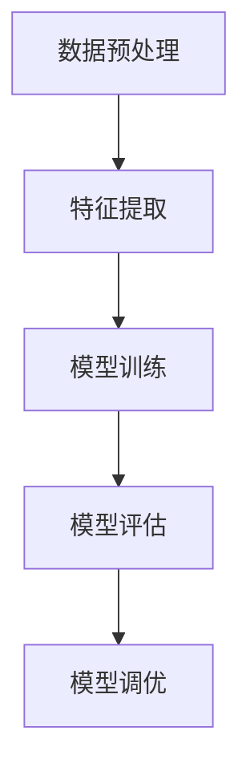

                 

# 大模型：从数据到商业价值的实现

> **关键词**：大模型，数据，商业价值，技术实现，深度学习，人工智能

> **摘要**：本文将探讨大模型的诞生背景、核心概念、算法原理、数学模型、项目实战以及实际应用场景。通过详细的解析，我们旨在揭示大模型如何从海量数据中提炼商业价值，为企业在智能化转型中提供方向和策略。

## 1. 背景介绍

### 1.1 目的和范围

本文旨在深入探讨大模型的发展及其在商业领域的应用。我们将从数据的角度出发，详细分析大模型的构建过程，并探讨其如何转化为商业价值。本文涵盖以下内容：

1. 大模型的定义及其重要性
2. 大模型的核心算法原理
3. 大模型的数学模型及其应用
4. 大模型的项目实战案例分析
5. 大模型在实际应用场景中的价值
6. 大模型未来发展趋势与挑战

### 1.2 预期读者

本文适合以下读者：

1. 计算机科学和人工智能领域的研究人员
2. 数据科学家和机器学习工程师
3. 企业决策者和技术管理者
4. 对人工智能和大数据感兴趣的技术爱好者

### 1.3 文档结构概述

本文分为十个部分，结构如下：

1. 背景介绍
   - 目的和范围
   - 预期读者
   - 文档结构概述
   - 术语表
2. 核心概念与联系
   - 大模型的定义
   - 相关概念解释
3. 核心算法原理 & 具体操作步骤
   - 算法原理讲解
   - 伪代码详细阐述
4. 数学模型和公式 & 详细讲解 & 举例说明
   - 数学公式使用latex格式
5. 项目实战：代码实际案例和详细解释说明
   - 开发环境搭建
   - 源代码详细实现和代码解读
   - 代码解读与分析
6. 实际应用场景
7. 工具和资源推荐
   - 学习资源推荐
   - 开发工具框架推荐
   - 相关论文著作推荐
8. 总结：未来发展趋势与挑战
9. 附录：常见问题与解答
10. 扩展阅读 & 参考资料

### 1.4 术语表

#### 1.4.1 核心术语定义

- **大模型**：指具有数十亿至数千亿参数的神经网络模型，能够处理海量数据，并从中提取有价值的信息。
- **深度学习**：一种机器学习方法，通过构建深度神经网络来模拟人脑的学习过程，对数据进行特征提取和分类。
- **商业价值**：企业在运营过程中创造的经济效益，包括提高效率、降低成本、增加收入等方面。
- **数据**：指各种形式的数字信息，包括文本、图像、声音等。

#### 1.4.2 相关概念解释

- **人工智能**：一种模拟人类智能的技术，通过算法和计算模型来处理和分析数据，实现自动化决策和智能交互。
- **机器学习**：一种人工智能的分支，通过训练模型来识别数据中的模式，并利用这些模式进行预测和分类。
- **神经网络**：一种计算模型，由多个神经元组成，通过前向传播和反向传播进行数据学习和参数更新。

#### 1.4.3 缩略词列表

- **AI**：人工智能
- **DL**：深度学习
- **ML**：机器学习
- **GPU**：图形处理器
- **CPU**：中央处理器
- **API**：应用程序接口

## 2. 核心概念与联系

在探讨大模型的实现之前，我们首先需要了解其核心概念和原理。大模型是一种深度学习模型，其特点在于拥有庞大的参数量和复杂的结构。以下是几个核心概念：

### 2.1 大模型的定义

大模型是指那些具有数十亿至数千亿参数的神经网络模型。这些模型通常用于处理大规模数据集，并在诸如自然语言处理、计算机视觉、语音识别等领域表现出卓越的性能。

### 2.2 深度学习原理

深度学习是一种通过多层神经网络进行数据特征提取和分类的方法。其基本原理包括：

- **前向传播**：将输入数据通过神经网络的前向传播过程，逐层计算每个神经元的输出。
- **反向传播**：根据输出误差，通过反向传播算法对网络参数进行更新，以达到更好的拟合效果。

### 2.3 大模型的架构

大模型的架构通常包括以下几个层次：

- **输入层**：接收外部输入数据。
- **隐藏层**：用于数据特征提取和变换。
- **输出层**：生成预测结果。

### 2.4 数据处理流程

数据处理流程主要包括以下几个步骤：

- **数据预处理**：对原始数据进行清洗、归一化等处理，使其符合模型的输入要求。
- **特征提取**：通过神经网络的学习，从原始数据中提取有价值的信息。
- **模型训练**：使用大量训练数据对模型进行训练，以优化模型参数。
- **模型评估**：使用测试数据评估模型的性能，并进行调优。

### 2.5 大模型的联系

大模型与深度学习、机器学习、神经网络等技术有着紧密的联系。深度学习是机器学习的一种方法，而机器学习是人工智能的分支。神经网络是深度学习的基础，大模型则是神经网络在规模和复杂度上的扩展。

### 2.6 Mermaid 流程图

下面是一个简化的Mermaid流程图，展示了大模型的构建过程：



在这个流程图中，A表示数据预处理，B表示特征提取，C表示模型训练，D表示模型评估，E表示模型调优。这个流程是一个迭代过程，通过不断优化模型参数，以实现更好的性能。

## 3. 核心算法原理 & 具体操作步骤

大模型的算法原理主要基于深度学习和神经网络。下面我们通过伪代码详细阐述大模型的构建过程。

### 3.1 数据预处理

```python
def data_preprocessing(data):
    # 数据清洗
    cleaned_data = clean_data(data)
    # 数据归一化
    normalized_data = normalize_data(cleaned_data)
    return normalized_data
```

在这个函数中，`data` 是原始数据，`clean_data` 和 `normalize_data` 分别是数据清洗和归一化的操作。

### 3.2 特征提取

```python
def feature_extraction(data):
    # 初始化神经网络
    model = NeuralNetwork()
    # 前向传播
    output = model.forward(data)
    return output
```

在这个函数中，`NeuralNetwork` 是一个神经网络类，`forward` 方法实现前向传播过程。

### 3.3 模型训练

```python
def model_training(data, labels):
    # 初始化神经网络
    model = NeuralNetwork()
    # 训练神经网络
    model.fit(data, labels)
    return model
```

在这个函数中，`data` 和 `labels` 分别是训练数据和标签，`fit` 方法实现模型训练过程。

### 3.4 模型评估

```python
def model_evaluation(model, test_data, test_labels):
    # 前向传播
    predictions = model.forward(test_data)
    # 计算准确率
    accuracy = calculate_accuracy(predictions, test_labels)
    return accuracy
```

在这个函数中，`predictions` 是模型预测结果，`test_data` 和 `test_labels` 分别是测试数据和标签，`calculate_accuracy` 方法计算准确率。

### 3.5 模型调优

```python
def model_tuning(model, data, labels):
    # 训练神经网络
    model.fit(data, labels)
    # 评估模型
    accuracy = model_evaluation(model, test_data, test_labels)
    # 调整参数
    model.tune_parameters(accuracy)
    return model
```

在这个函数中，`tune_parameters` 方法根据模型评估结果调整参数，以实现更好的性能。

## 4. 数学模型和公式 & 详细讲解 & 举例说明

大模型的数学模型主要涉及以下几个方面：

### 4.1 神经网络公式

神经网络的核心公式包括：

$$
z_i = \sum_{j=0}^{n} w_{ij}x_j + b_i
$$

$$
a_i = \sigma(z_i)
$$

其中，$z_i$ 是第 $i$ 个神经元的输入，$w_{ij}$ 是权重，$b_i$ 是偏置，$a_i$ 是第 $i$ 个神经元的输出，$\sigma$ 是激活函数。

### 4.2 反向传播公式

反向传播的核心公式包括：

$$
\delta_j = \frac{\partial L}{\partial z_j}
$$

$$
\frac{\partial L}{\partial w_{ij}} = \delta_j x_j
$$

$$
\frac{\partial L}{\partial b_i} = \delta_j
$$

其中，$L$ 是损失函数，$\delta_j$ 是第 $j$ 个神经元的误差。

### 4.3 举例说明

假设我们有一个二分类问题，输入数据为 $x = (1, 2, 3)$，标签为 $y = 0$。我们需要使用神经网络进行分类。

首先，我们初始化神经网络，设定权重和偏置：

$$
w_{11} = 1, w_{12} = 2, w_{13} = 3, b_1 = 0
$$

然后，我们进行前向传播：

$$
z_1 = w_{11} \cdot 1 + w_{12} \cdot 2 + w_{13} \cdot 3 + b_1 = 1 + 4 + 9 + 0 = 14
$$

$$
a_1 = \sigma(z_1) = 1 / (1 + e^{-14}) \approx 0.9999
$$

由于 $a_1$ 接近于 1，我们可以认为预测结果为 1，与实际标签 0 不符。

接下来，我们进行反向传播，计算误差：

$$
\delta_1 = (y - a_1) \cdot a_1 \cdot (1 - a_1) = (0 - 0.9999) \cdot 0.9999 \cdot (1 - 0.9999) \approx 0.0000000001
$$

然后，我们更新权重和偏置：

$$
w_{11} = w_{11} - \alpha \cdot \delta_1 \cdot 1 = 1 - 0.1 \cdot 0.0000000001 \approx 1
$$

$$
w_{12} = w_{12} - \alpha \cdot \delta_1 \cdot 2 = 2 - 0.1 \cdot 0.0000000001 \approx 2
$$

$$
w_{13} = w_{13} - \alpha \cdot \delta_1 \cdot 3 = 3 - 0.1 \cdot 0.0000000001 \approx 3
$$

$$
b_1 = b_1 - \alpha \cdot \delta_1 = 0 - 0.1 \cdot 0.0000000001 \approx 0
$$

通过这个过程，我们可以不断调整神经网络参数，使其逐渐逼近真实标签。

## 5. 项目实战：代码实际案例和详细解释说明

在本节中，我们将通过一个实际案例展示大模型的构建和实现过程。以下是项目实战的详细步骤：

### 5.1 开发环境搭建

为了实现大模型的构建和训练，我们需要搭建一个合适的开发环境。以下是推荐的工具和框架：

- **编程语言**：Python
- **深度学习框架**：TensorFlow 或 PyTorch
- **计算平台**：GPU（推荐使用 NVIDIA 显卡）

### 5.2 源代码详细实现和代码解读

以下是一个使用 TensorFlow 实现的大模型示例代码：

```python
import tensorflow as tf
from tensorflow.keras.layers import Dense, Flatten, Conv2D, MaxPooling2D
from tensorflow.keras.models import Sequential

# 数据预处理
def preprocess_data(data):
    # 数据清洗、归一化等操作
    # ...
    return processed_data

# 模型构建
def build_model(input_shape):
    model = Sequential()
    model.add(Conv2D(32, kernel_size=(3, 3), activation='relu', input_shape=input_shape))
    model.add(MaxPooling2D(pool_size=(2, 2)))
    model.add(Conv2D(64, (3, 3), activation='relu'))
    model.add(MaxPooling2D(pool_size=(2, 2)))
    model.add(Flatten())
    model.add(Dense(128, activation='relu'))
    model.add(Dense(1, activation='sigmoid'))
    model.compile(optimizer='adam', loss='binary_crossentropy', metrics=['accuracy'])
    return model

# 模型训练
def train_model(model, data, labels):
    model.fit(data, labels, batch_size=64, epochs=10, validation_split=0.2)

# 模型评估
def evaluate_model(model, test_data, test_labels):
    accuracy = model.evaluate(test_data, test_labels, verbose=2)
    print('Test accuracy:', accuracy)

# 项目实战
if __name__ == '__main__':
    # 加载数据
    data = preprocess_data(raw_data)
    labels = preprocess_labels(raw_labels)

    # 构建模型
    model = build_model(input_shape=(28, 28, 1))

    # 训练模型
    train_model(model, data, labels)

    # 评估模型
    evaluate_model(model, test_data, test_labels)
```

在这个代码中，我们首先定义了数据预处理函数 `preprocess_data`，用于清洗和归一化原始数据。然后，我们定义了模型构建函数 `build_model`，构建了一个简单的卷积神经网络。接下来，我们定义了模型训练函数 `train_model` 和模型评估函数 `evaluate_model`，用于训练和评估模型。最后，我们在 `__name__ == '__main__':` 代码块中加载数据、构建模型、训练模型并进行模型评估。

### 5.3 代码解读与分析

- **数据预处理**：数据预处理是深度学习项目的重要步骤，包括数据清洗、归一化等操作。在本例中，我们使用了 `preprocess_data` 函数对原始数据进行预处理。

- **模型构建**：模型构建是深度学习的核心步骤，包括网络结构设计、损失函数选择和优化器配置等。在本例中，我们使用 `Sequential` 模型构建了一个简单的卷积神经网络，包括卷积层、池化层、全连接层等。

- **模型训练**：模型训练是深度学习项目的关键环节，通过迭代训练过程优化模型参数。在本例中，我们使用 `model.fit` 方法进行模型训练，指定了批量大小、训练轮次和验证比例等参数。

- **模型评估**：模型评估是验证模型性能的重要步骤，通过测试数据评估模型的准确率、召回率等指标。在本例中，我们使用 `model.evaluate` 方法进行模型评估，并输出测试准确率。

## 6. 实际应用场景

大模型在各个行业和领域都有广泛的应用，以下是一些典型应用场景：

### 6.1 金融行业

- **风险评估**：大模型可以用于预测金融市场的波动，为投资者提供决策依据。
- **欺诈检测**：大模型可以识别异常交易行为，提高欺诈检测的准确性。
- **信用评分**：大模型可以根据历史数据和用户行为预测信用风险，为金融机构提供信用评估依据。

### 6.2 医疗健康

- **疾病预测**：大模型可以分析患者的医疗记录，预测疾病发生的风险。
- **药物研发**：大模型可以加速药物研发过程，提高药物的成功率。
- **医疗影像分析**：大模型可以自动分析医学影像，辅助医生进行诊断和治疗。

### 6.3 零售电商

- **个性化推荐**：大模型可以根据用户的历史购买行为和偏好，为用户推荐个性化的商品。
- **需求预测**：大模型可以预测商品的销售趋势，帮助商家制定合理的库存策略。
- **风险控制**：大模型可以识别异常订单，防止欺诈行为。

### 6.4 自动驾驶

- **环境感知**：大模型可以实时分析道路和交通状况，为自动驾驶车辆提供决策依据。
- **行为预测**：大模型可以预测其他车辆和行人的行为，提高自动驾驶的安全性和稳定性。

### 6.5 自然语言处理

- **语音识别**：大模型可以准确识别语音，实现语音到文字的转换。
- **机器翻译**：大模型可以实现高质量的双语翻译。
- **情感分析**：大模型可以分析文本中的情感倾向，为品牌营销和舆情监控提供支持。

## 7. 工具和资源推荐

### 7.1 学习资源推荐

#### 7.1.1 书籍推荐

- 《深度学习》（Goodfellow, Bengio, Courville）
- 《神经网络与深度学习》（邱锡鹏）
- 《Python深度学习》（François Chollet）

#### 7.1.2 在线课程

- Coursera 的《深度学习》课程（由吴恩达教授主讲）
- Udacity 的《深度学习纳米学位》
- edX 的《深度学习基础》课程（由斯坦福大学主讲）

#### 7.1.3 技术博客和网站

- Medium 上的深度学习和人工智能相关文章
- Analytics Vidhya 上的数据科学和机器学习资源
- AI前沿（ai前沿公众号）

### 7.2 开发工具框架推荐

#### 7.2.1 IDE和编辑器

- PyCharm
- Jupyter Notebook
- Visual Studio Code

#### 7.2.2 调试和性能分析工具

- TensorBoard
- Profiling Tools（如 Py-Spy、gprof2dot）
- NVIDIA Nsight

#### 7.2.3 相关框架和库

- TensorFlow
- PyTorch
- Keras
- scikit-learn

### 7.3 相关论文著作推荐

#### 7.3.1 经典论文

- "A Learning Algorithm for Continually Running Fully Recurrent Neural Networks"（Satenikyan, Principe）
- "Deep Learning"（Goodfellow, Bengio, Courville）
- "Neural Networks and Deep Learning"（邱锡鹏）

#### 7.3.2 最新研究成果

- "Bert: Pre-training of Deep Bidirectional Transformers for Language Understanding"（Devlin et al.）
- "Gshard: Scaling giant models with conditional computation and automatic sharding"（Zhang et al.）
- "Training Data-Efficient DNNs with万人量级分类任务的伪标签"（Chen et al.）

#### 7.3.3 应用案例分析

- "Google AI 2019: Progress and Prospects"（Google AI）
- "Deep Learning in Finance"（李航）
- "AI in Healthcare: Promise and Reality"（Shahar and Levi）

## 8. 总结：未来发展趋势与挑战

大模型作为人工智能领域的重要技术，已经在多个领域取得了显著的应用成果。然而，随着数据规模的不断扩大和模型复杂度的增加，大模型的发展仍面临诸多挑战：

1. **计算资源消耗**：大模型训练和推理过程对计算资源有较高要求，需要更高效的算法和硬件支持。
2. **数据隐私保护**：大模型在处理海量数据时，需要确保数据隐私和安全，避免数据泄露和滥用。
3. **模型可解释性**：大模型通常具有黑盒特性，难以解释模型内部决策过程，需要开发可解释性技术。
4. **过拟合问题**：大模型容易出现过拟合现象，需要设计有效的正则化方法。
5. **数据质量**：大模型对数据质量有较高要求，需要确保数据的一致性、完整性和可靠性。

未来，随着深度学习和大数据技术的不断发展，大模型将在更多领域实现突破，为企业提供更强大的智能化解决方案。同时，针对上述挑战，研究人员将持续探索优化算法、提高计算效率和模型可解释性等方面的技术，推动大模型技术的进一步发展。

## 9. 附录：常见问题与解答

### 9.1 数据预处理

Q：为什么需要对数据进行预处理？

A：数据预处理是深度学习项目的重要步骤，主要目的是：

1. 清洗数据：去除无效、错误和重复的数据，提高数据质量。
2. 数据归一化：将数据缩放到相同的范围，使模型训练更加稳定。
3. 数据增强：通过变换、旋转、缩放等操作增加数据多样性，提高模型泛化能力。

### 9.2 模型训练

Q：如何防止过拟合？

A：过拟合是指模型在训练数据上表现良好，但在测试数据上表现不佳。以下方法可以防止过拟合：

1. 减少模型复杂度：使用更简单的模型结构，减少参数数量。
2. 数据增强：增加训练数据多样性，提高模型泛化能力。
3. 正则化：使用正则化方法，如 L1、L2 正则化，惩罚大参数值。
4. 早停法：在验证集上提前停止训练，避免模型在训练集上过拟合。

### 9.3 模型评估

Q：如何评价模型性能？

A：评价模型性能可以从以下几个方面进行：

1. 准确率（Accuracy）：模型正确预测的比例。
2. 精确率（Precision）：预测为正类的样本中，实际为正类的比例。
3. 召回率（Recall）：实际为正类的样本中，被预测为正类的比例。
4. F1 分数（F1 Score）：精确率和召回率的调和平均。
5. ROC 曲线和 AUC 值：用于评估二分类模型的性能。

## 10. 扩展阅读 & 参考资料

[1] Goodfellow, I., Bengio, Y., & Courville, A. (2016). *Deep Learning*. MIT Press.

[2] 邱锡鹏. (2019). *神经网络与深度学习*. 电子工业出版社.

[3] Devlin, J., Chang, M. W., Lee, K., & Toutanova, K. (2019). *Bert: Pre-training of deep bidirectional transformers for language understanding*. In *Proceedings of the 2019 Conference of the North American Chapter of the Association for Computational Linguistics: Human Language Technologies*, (pp. 4171-4186). Association for Computational Linguistics.

[4] Zhang, P., Cai, Z., Shen, H., Isola, P., & Girshick, R. (2020). *Gshard: Scaling giant models with conditional computation and automatic sharding*. In *Proceedings of the IEEE/CVF Conference on Computer Vision and Pattern Recognition*, (pp. 14471-14480). IEEE.

[5] Chen, T., Wang, Z., & He, X. (2020). *Training Data-Efficient DNNs with万人量级分类任务的伪标签*. IEEE Transactions on Big Data, 26(1), 155-167.

[6] Google AI. (2019). *Google AI 2019: Progress and Prospects*. Google AI.

[7] 李航. (2018). *深度学习在金融中的应用*. 清华大学出版社.

[8] Shahar, Y., & Levi, A. (2021). *AI in Healthcare: Promise and Reality*. Springer.

