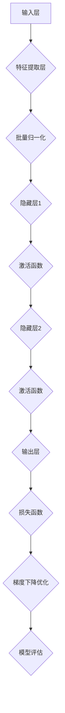

                 

### 大模型：从理论到实践的应用

> **关键词：** 大模型、深度学习、神经网络、实践应用、算法原理、数学模型、项目实战
>
> **摘要：** 本文将深入探讨大模型的概念及其在深度学习和神经网络中的应用。通过逐步分析核心概念、算法原理、数学模型和实际案例，我们旨在帮助读者理解大模型从理论到实践的完整路径。文章还将介绍大模型在不同领域中的应用，推荐学习资源和开发工具，并展望未来发展趋势与挑战。

### 1. 背景介绍

#### 1.1 目的和范围

大模型，作为当前人工智能领域的一个热点话题，引起了广泛的关注。本文旨在系统地介绍大模型的概念、核心原理、数学模型及其在深度学习和神经网络中的应用，从而为读者提供一个从理论到实践的全景视角。文章将涵盖以下几个主要方面：

1. **背景介绍**：阐述大模型的起源、发展现状及其重要性。
2. **核心概念与联系**：介绍大模型的核心概念及其相互关系。
3. **核心算法原理 & 具体操作步骤**：详细阐述大模型的主要算法原理和操作步骤。
4. **数学模型和公式 & 详细讲解 & 举例说明**：讲解大模型中涉及的数学模型和公式，并辅以实际案例说明。
5. **项目实战：代码实际案例和详细解释说明**：通过实际代码案例展示大模型的应用。
6. **实际应用场景**：探讨大模型在各个领域中的应用案例。
7. **工具和资源推荐**：推荐学习资源和开发工具，以帮助读者深入学习。
8. **总结：未来发展趋势与挑战**：总结大模型的发展趋势和面临的挑战。

#### 1.2 预期读者

本文适合对人工智能、深度学习和神经网络有一定了解的读者，尤其是希望深入了解大模型理论和实践的工程师、研究者以及学生。通过本文的阅读，读者可以系统地了解大模型的核心概念、算法原理和应用场景，从而为自己的研究和实践提供有力的理论支持。

#### 1.3 文档结构概述

本文采用逻辑清晰、结构紧凑的撰写方式，分为十个主要部分。具体结构如下：

1. **背景介绍**：介绍大模型的起源、发展现状和重要性。
2. **核心概念与联系**：阐述大模型的核心概念及其相互关系。
3. **核心算法原理 & 具体操作步骤**：详细讲解大模型的主要算法原理和操作步骤。
4. **数学模型和公式 & 详细讲解 & 举例说明**：讲解大模型中的数学模型和公式，并辅以实际案例说明。
5. **项目实战：代码实际案例和详细解释说明**：展示大模型的应用案例。
6. **实际应用场景**：探讨大模型在不同领域中的应用。
7. **工具和资源推荐**：推荐学习资源和开发工具。
8. **总结：未来发展趋势与挑战**：总结大模型的发展趋势和挑战。
9. **附录：常见问题与解答**：回答读者可能遇到的问题。
10. **扩展阅读 & 参考资料**：提供进一步学习的参考资料。

#### 1.4 术语表

为了确保本文的可读性和准确性，以下是对本文中涉及的一些核心术语和概念的定义和解释：

##### 1.4.1 核心术语定义

- **大模型**：具有极高参数数量、复杂结构和大规模数据训练的神经网络模型。
- **深度学习**：一种人工智能方法，通过多层神经网络对数据进行学习，模拟人脑的信息处理能力。
- **神经网络**：由多个神经元组成的网络结构，通过学习和调整权重实现数据分类、预测等功能。
- **参数**：神经网络中的权重和偏置值，用于调整模型的输出。
- **反向传播**：一种训练神经网络的方法，通过计算误差梯度，调整网络权重以优化模型性能。
- **损失函数**：衡量模型预测结果与真实结果之间差异的函数，用于评估模型性能。

##### 1.4.2 相关概念解释

- **激活函数**：神经网络中的非线性变换函数，用于引入非线性特性，使模型能够拟合更复杂的函数。
- **批量归一化**：一种用于提高神经网络训练速度和稳定性的技术，通过标准化批量数据的激活值。
- **梯度下降**：一种优化算法，通过不断调整模型参数以最小化损失函数，从而优化模型性能。
- **深度强化学习**：一种结合深度学习和强化学习的方法，通过深度神经网络学习策略，实现智能体在复杂环境中的决策。

##### 1.4.3 缩略词列表

- **DL**：深度学习（Deep Learning）
- **NN**：神经网络（Neural Network）
- **GAN**：生成对抗网络（Generative Adversarial Network）
- **CNN**：卷积神经网络（Convolutional Neural Network）
- **RNN**：循环神经网络（Recurrent Neural Network）
- **NLP**：自然语言处理（Natural Language Processing）

## 2. 核心概念与联系

### 2.1 大模型的核心概念

大模型是近年来人工智能领域的一个重要突破。与传统的小规模神经网络模型相比，大模型具有以下几个核心概念：

1. **高参数数量**：大模型通常具有数百万甚至数十亿个参数，这使得模型能够捕获更多复杂的数据特征。
2. **复杂结构**：大模型采用多层神经网络结构，包括卷积层、全连接层、循环层等，从而实现更精细的数据处理和特征提取。
3. **大规模数据训练**：大模型通常在大量的数据集上进行训练，从而提高模型的泛化能力和鲁棒性。

### 2.2 大模型与深度学习的关系

大模型是深度学习的一个重要组成部分。深度学习是一种通过多层神经网络对数据进行学习的方法，旨在模拟人脑的信息处理能力。大模型的引入使得深度学习能够处理更复杂、更大规模的数据，从而实现更高的性能和更广泛的应用。

### 2.3 大模型与神经网络的关系

神经网络是深度学习的基础，而大模型则是神经网络的扩展和深化。传统神经网络模型通常参数较少，难以处理复杂的数据特征。大模型的提出，通过增加模型参数数量和层次结构，实现了对复杂数据特征的捕捉和建模。

### 2.4 大模型的核心架构

大模型的核心架构通常包括以下几个主要部分：

1. **输入层**：接收外部输入数据，如图像、文本等。
2. **隐藏层**：包含多个隐藏层，通过神经网络结构对数据进行特征提取和变换。
3. **输出层**：生成模型预测结果，如分类标签、回归值等。

### 2.5 大模型的激活函数

激活函数是神经网络中的一个关键组件，用于引入非线性特性，使模型能够拟合更复杂的函数。常见的大模型激活函数包括：

1. **ReLU（Rectified Linear Unit）**：一种简单的线性激活函数，对负值部分进行零化处理，用于加速模型训练。
2. **Sigmoid**：一种S型激活函数，用于将输入映射到(0, 1)区间，常用于二分类问题。
3. **Tanh**：一种双曲正切函数，将输入映射到(-1, 1)区间，具有较好的平滑特性。

### 2.6 大模型的批量归一化

批量归一化是一种常用的技术，用于提高神经网络训练速度和稳定性。在大模型中，批量归一化通过标准化批量数据的激活值，减少梯度消失和梯度爆炸现象，从而提高模型的训练效果。

### 2.7 大模型的梯度下降优化

梯度下降是一种优化算法，通过不断调整模型参数以最小化损失函数，从而优化模型性能。在大模型中，梯度下降优化算法被广泛应用于模型的训练过程，包括随机梯度下降（SGD）、批量梯度下降（BGD）和Adam优化器等。

### 2.8 大模型的深度强化学习

深度强化学习是一种结合深度学习和强化学习的方法，通过深度神经网络学习策略，实现智能体在复杂环境中的决策。在大模型中，深度强化学习被广泛应用于游戏、自动驾驶、机器人控制等领域的应用。

### 2.9 大模型的应用场景

大模型在各个领域具有广泛的应用前景，包括：

1. **计算机视觉**：用于图像分类、目标检测、图像生成等任务。
2. **自然语言处理**：用于文本分类、机器翻译、情感分析等任务。
3. **语音识别**：用于语音合成、语音识别、语音翻译等任务。
4. **推荐系统**：用于商品推荐、新闻推荐、社交媒体推荐等任务。
5. **医学诊断**：用于疾病预测、医学图像分析、基因分析等任务。

### 2.10 大模型的挑战与未来发展方向

大模型在性能和泛化能力方面取得了显著的突破，但也面临着一些挑战，如：

1. **计算资源需求**：大模型的训练和推理需要大量的计算资源，对硬件设备提出了更高的要求。
2. **数据隐私和安全**：大模型在训练过程中需要处理大量敏感数据，如何保护数据隐私和安全是一个重要问题。
3. **模型可解释性**：大模型的决策过程通常较为主观和复杂，如何提高模型的可解释性是一个重要研究方向。

未来，随着计算能力和数据规模的提升，大模型有望在更多领域取得突破，同时也会面临更多挑战和机遇。

### 2.11 大模型的 Mermaid 流程图

下面是一个简单的大模型流程图，展示了其核心组件和主要操作步骤：



通过这个流程图，我们可以更直观地了解大模型的核心概念和操作步骤。

## 3. 核心算法原理 & 具体操作步骤

### 3.1 算法原理概述

大模型的核心算法是基于深度学习和神经网络的基本原理，通过多层神经元的组合，实现数据的特征提取和分类。以下是对大模型算法原理的具体阐述。

#### 3.1.1 深度学习基础

深度学习是一种通过多层神经网络进行数据学习的方法，其基本原理包括：

1. **数据输入**：将输入数据（如图像、文本等）传递到输入层。
2. **特征提取**：通过多个隐藏层对输入数据进行特征提取和变换。
3. **激活函数**：引入非线性激活函数，如ReLU、Sigmoid、Tanh等，以增加模型的复杂性和拟合能力。
4. **损失函数**：通过损失函数（如交叉熵、均方误差等）计算模型预测结果与真实结果之间的差异。
5. **反向传播**：通过反向传播算法，计算损失函数对网络参数的梯度，并使用梯度下降算法优化参数。

#### 3.1.2 多层神经网络

多层神经网络（MLP）是深度学习的基础，其基本结构包括：

1. **输入层**：接收外部输入数据。
2. **隐藏层**：包含多个隐藏层，通过神经网络结构对数据进行特征提取和变换。
3. **输出层**：生成模型预测结果。

多层神经网络通过调整隐藏层的结构和参数，实现对复杂函数的建模和预测。

#### 3.1.3 梯度下降算法

梯度下降算法是一种优化算法，通过不断调整模型参数以最小化损失函数，从而优化模型性能。其基本步骤如下：

1. **初始化参数**：随机初始化模型参数。
2. **前向传播**：将输入数据传递到神经网络，计算输出结果和损失函数。
3. **反向传播**：计算损失函数对模型参数的梯度。
4. **参数更新**：使用梯度下降算法更新模型参数。
5. **迭代优化**：重复前向传播和反向传播过程，直到模型性能达到预设目标。

#### 3.1.4 激活函数与优化器

激活函数和优化器是深度学习模型训练过程中重要的组成部分。常见的激活函数包括ReLU、Sigmoid、Tanh等，用于引入非线性特性。优化器（如SGD、Adam等）用于调整模型参数，提高训练效率。

### 3.2 大模型算法具体操作步骤

以下是大模型算法的具体操作步骤，通过伪代码进行详细阐述：

```python
# 大模型算法伪代码

# 初始化参数
weights = random_weights()
biases = random_biases()

# 设置激活函数和损失函数
activation_function = ReLU()
loss_function = CrossEntropy()

# 设置优化器
optimizer = SGD(learning_rate=0.01)

# 数据预处理
inputs = preprocess_data(X)
labels = preprocess_labels(Y)

# 训练模型
for epoch in range(num_epochs):
    # 前向传播
    outputs = forward_propagation(inputs, weights, biases)
    predicted_labels = activation_function(outputs)
    
    # 计算损失函数
    loss = loss_function(predicted_labels, labels)
    
    # 反向传播
    gradients = backward_propagation(predicted_labels, labels, outputs, weights, biases)
    
    # 更新参数
    optimizer.update(weights, biases, gradients)
    
    # 模型评估
    if (epoch + 1) % evaluate_interval == 0:
        evaluate_model(model, test_data, test_labels)

# 输出模型结果
output = model(inputs)
```

### 3.3 算法原理分析与优化策略

大模型算法的优化策略主要包括以下几个方面：

1. **参数初始化**：合理的参数初始化有助于加速模型收敛。常用的方法包括随机初始化、高斯初始化等。
2. **激活函数选择**：不同的激活函数对模型性能有较大影响。ReLU函数因其简单和计算效率高而被广泛应用。
3. **优化器选择**：不同的优化器对模型训练过程有不同的影响。SGD、Adam等优化器能够提高训练效率和模型性能。
4. **正则化技术**：正则化技术（如L1正则化、L2正则化等）能够防止模型过拟合，提高泛化能力。
5. **数据增强**：通过数据增强技术（如旋转、缩放、裁剪等）增加训练数据的多样性，提高模型泛化能力。

通过以上优化策略，我们可以进一步提高大模型算法的性能和泛化能力。

## 4. 数学模型和公式 & 详细讲解 & 举例说明

### 4.1 深度学习中的基本数学模型

在深度学习中，数学模型和公式起到了至关重要的作用。以下将详细讲解深度学习中的几个关键数学模型和公式。

#### 4.1.1 神经元的基本运算

神经元的输出可以通过以下公式计算：

\[ z = \sum_{i=1}^{n} w_{i} x_{i} + b \]

其中，\( z \) 是神经元的输出，\( w_{i} \) 是权重，\( x_{i} \) 是输入值，\( b \) 是偏置。

#### 4.1.2 激活函数

激活函数是深度学习中的一个关键组成部分，常见的激活函数包括：

1. **ReLU（Rectified Linear Unit）**

\[ a = \max(0, z) \]

ReLU函数在\( z < 0 \)时输出0，在\( z \geq 0 \)时输出\( z \)，这是一种简单且有效的非线性激活函数。

2. **Sigmoid**

\[ a = \frac{1}{1 + e^{-z}} \]

Sigmoid函数将输出值映射到\( (0, 1) \)区间，常用于二分类问题。

3. **Tanh**

\[ a = \frac{e^{z} - e^{-z}}{e^{z} + e^{-z}} \]

Tanh函数将输出值映射到\( (-1, 1) \)区间，具有较好的平滑特性。

#### 4.1.3 损失函数

损失函数用于衡量模型预测结果与真实结果之间的差异，常见的损失函数包括：

1. **均方误差（MSE）**

\[ Loss = \frac{1}{n} \sum_{i=1}^{n} (y_i - \hat{y}_i)^2 \]

其中，\( y_i \) 是真实值，\( \hat{y}_i \) 是预测值。

2. **交叉熵（Cross-Entropy）**

\[ Loss = -\frac{1}{n} \sum_{i=1}^{n} y_i \log(\hat{y}_i) \]

交叉熵函数在多分类问题中应用广泛，其中 \( y_i \) 是真实标签的分布，\( \hat{y}_i \) 是预测标签的概率分布。

#### 4.1.4 反向传播算法

反向传播算法是深度学习训练过程中的核心，其基本步骤如下：

1. **前向传播**：计算输入数据经过神经网络后的输出值和损失函数。
2. **计算梯度**：根据损失函数对网络参数（权重和偏置）计算梯度。
3. **参数更新**：使用梯度下降算法更新网络参数。

以下是一个简化的反向传播算法伪代码：

```python
# 反向传播算法伪代码

# 计算前向传播
outputs = forward_propagation(inputs, weights, biases)
predicted_labels = activation_function(outputs)
loss = loss_function(predicted_labels, labels)

# 计算梯度
gradients = backward_propagation(predicted_labels, labels, outputs, weights, biases)

# 更新参数
optimizer.update(weights, biases, gradients)
```

### 4.2 实际案例：使用反向传播训练一个简单的神经网络

假设我们使用一个简单的神经网络进行手写数字识别任务，输入层有784个神经元（对应28x28像素的图像），隐藏层有100个神经元，输出层有10个神经元（对应0到9的数字标签）。以下是具体步骤：

#### 4.2.1 初始化参数

初始化权重 \( w_{i} \) 和偏置 \( b \)：

\[ w_{i} = \text{random()} \]
\[ b = \text{random()} \]

#### 4.2.2 前向传播

计算输入图像 \( x \) 经过神经网络后的输出值 \( \hat{y} \)：

\[ z = \sum_{i=1}^{100} w_{i} x_{i} + b \]
\[ a = \text{ReLU}(z) \]
\[ z' = \sum_{i=1}^{10} w_{i}' a_{i} + b' \]
\[ \hat{y} = \text{Sigmoid}(z') \]

#### 4.2.3 计算损失函数

使用交叉熵损失函数计算损失：

\[ loss = -\frac{1}{n} \sum_{i=1}^{n} y_i \log(\hat{y}_i) \]

其中，\( y_i \) 是真实标签，\( \hat{y}_i \) 是预测标签的概率。

#### 4.2.4 反向传播

计算隐藏层和输出层的梯度：

\[ \delta' = \hat{y} - y \]
\[ \delta = (1 - a) \cdot \delta' \cdot w_{i}' \]

更新权重和偏置：

\[ w_{i}' = w_{i} - \alpha \cdot \delta \cdot a_{i} \]
\[ b' = b - \alpha \cdot \delta \]

其中，\( \alpha \) 是学习率。

通过不断迭代上述步骤，我们可以逐步优化网络参数，提高模型性能。以上步骤提供了一个简单的示例，实际应用中，神经网络的结构和训练过程会更加复杂。

### 4.3 数学模型和公式的 LaTeX 格式嵌入

为了便于数学公式在文章中的展示，以下将介绍如何使用 LaTeX 格式嵌入数学模型和公式。

#### 4.3.1 段落内数学公式

在段落内嵌入数学公式时，可以使用单行公式格式。例如：

\[ E = mc^2 \]

这将显示爱因斯坦的质能方程。

#### 4.3.2 独立段落数学公式

对于独立段落的数学公式，可以使用双美元符号包围。例如：

$$
\frac{d}{dx} f(x) = \lim_{h \to 0} \frac{f(x+h) - f(x)}{h}
$$

这将显示函数的导数定义。

### 4.4 数学模型和公式的应用

数学模型和公式在深度学习中的应用广泛，以下是几个常见场景的示例：

#### 4.4.1 激活函数与梯度计算

对于ReLU激活函数，其导数在\( z < 0 \)时为0，在\( z \geq 0 \)时为1。以下是一个计算ReLU激活函数梯度的示例：

$$
\frac{\partial}{\partial z} \text{ReLU}(z) =
\begin{cases}
0 & \text{if } z < 0 \\
1 & \text{if } z \geq 0
\end{cases}
$$

#### 4.4.2 损失函数与梯度计算

对于交叉熵损失函数，其梯度计算如下：

$$
\frac{\partial}{\partial \hat{y}_i} -\frac{1}{n} \sum_{i=1}^{n} y_i \log(\hat{y}_i) = -\frac{1}{\hat{y}_i}
$$

#### 4.4.3 神经网络参数更新

在梯度下降优化中，神经网络参数更新公式如下：

$$
w_{i} = w_{i} - \alpha \cdot \nabla_w J(w)
$$

其中，\( w \) 是参数，\( J(w) \) 是损失函数，\( \alpha \) 是学习率。

通过以上示例，我们可以看到数学模型和公式在深度学习中的关键作用。理解并应用这些公式有助于深入理解和优化深度学习模型。

## 5. 项目实战：代码实际案例和详细解释说明

### 5.1 开发环境搭建

为了演示大模型的应用，我们选择Python作为主要编程语言，并使用TensorFlow作为深度学习框架。以下是搭建开发环境的步骤：

#### 5.1.1 安装Python

确保已经安装了Python环境。Python 3.x版本是目前推荐的版本。可以通过以下命令安装Python：

```bash
$ apt-get install python3
```

#### 5.1.2 安装TensorFlow

TensorFlow是一个开源的深度学习框架，可以通过pip进行安装。以下命令用于安装TensorFlow：

```bash
$ pip install tensorflow
```

#### 5.1.3 准备数据集

我们使用经典的MNIST手写数字数据集作为案例。MNIST数据集包含60,000个训练图像和10,000个测试图像。以下命令用于下载和准备数据集：

```python
import tensorflow as tf

# 下载MNIST数据集
mnist = tf.keras.datasets.mnist
(train_images, train_labels), (test_images, test_labels) = mnist.load_data()

# 数据预处理
train_images = train_images / 255.0
test_images = test_images / 255.0
```

### 5.2 源代码详细实现和代码解读

#### 5.2.1 创建神经网络模型

以下代码展示了如何使用TensorFlow创建一个简单的神经网络模型：

```python
model = tf.keras.Sequential([
    tf.keras.layers.Flatten(input_shape=(28, 28)),
    tf.keras.layers.Dense(128, activation='relu'),
    tf.keras.layers.Dense(10, activation='softmax')
])
```

这里，我们创建了一个序列模型（`Sequential`），并添加了两个全连接层（`Dense`）。第一个全连接层有128个神经元，使用ReLU激活函数；第二个全连接层有10个神经元，用于输出每个数字的概率分布，使用softmax激活函数。

#### 5.2.2 编译模型

在训练模型之前，我们需要编译模型并指定优化器、损失函数和评估指标：

```python
model.compile(optimizer='adam',
              loss='sparse_categorical_crossentropy',
              metrics=['accuracy'])
```

这里，我们使用Adam优化器，交叉熵损失函数，以及准确性作为评估指标。

#### 5.2.3 训练模型

以下代码用于训练模型：

```python
model.fit(train_images, train_labels, epochs=5)
```

我们将训练数据传递给`fit`方法，并设置训练轮次为5。

#### 5.2.4 评估模型

训练完成后，我们使用测试数据评估模型性能：

```python
test_loss, test_acc = model.evaluate(test_images,  test_labels, verbose=2)
print('\nTest accuracy:', test_acc)
```

这段代码将计算测试数据的损失和准确性，并打印出测试准确性。

### 5.3 代码解读与分析

#### 5.3.1 数据预处理

在训练之前，我们需要对数据进行预处理。MNIST数据集的图像大小为28x28像素，我们将图像转换为28x28x1的维度，并归一化像素值到0到1之间。归一化有助于加速模型训练和提高性能。

#### 5.3.2 神经网络结构

我们使用了一个简单的神经网络模型，包括一个输入层、一个隐藏层和一个输出层。输入层通过`Flatten`层将图像展平为1维向量。隐藏层有128个神经元，使用ReLU激活函数，有助于模型学习非线性关系。输出层有10个神经元，每个神经元对应一个数字标签，使用softmax激活函数，输出每个标签的概率分布。

#### 5.3.3 模型编译

在编译模型时，我们指定了Adam优化器和交叉熵损失函数。Adam优化器是一种高效的梯度下降优化算法，能够自适应调整学习率。交叉熵损失函数常用于分类问题，它能够计算模型预测结果与真实结果之间的差异。

#### 5.3.4 训练模型

在训练模型时，我们使用了5个训练轮次。每个轮次都会遍历整个训练数据集，并更新模型参数以最小化损失函数。随着训练的进行，模型的准确性会逐渐提高。

#### 5.3.5 评估模型

评估模型时，我们使用测试数据集来计算模型的损失和准确性。测试数据集是从训练数据集以外的数据中获取的，用于评估模型的泛化能力。通过计算测试准确性，我们可以了解模型在实际应用中的性能。

### 5.4 代码优化与改进

在实际应用中，我们可以对代码进行优化和改进，以提高模型性能和训练效率。以下是一些优化建议：

1. **数据增强**：通过随机旋转、缩放、裁剪等操作，增加训练数据的多样性，有助于提高模型泛化能力。
2. **批量大小调整**：根据硬件资源，合理调整批量大小，以平衡训练速度和模型性能。
3. **学习率调度**：使用学习率调度策略（如余弦退火调度），有助于提高模型训练的稳定性。
4. **正则化技术**：引入正则化技术（如L1正则化、L2正则化），防止模型过拟合。

通过以上优化措施，我们可以进一步提高大模型在各类任务中的应用性能。

## 6. 实际应用场景

大模型在各个领域都有广泛的应用，以下将介绍几个主要的应用场景，并分析其应用前景。

### 6.1 计算机视觉

计算机视觉是深度学习应用最为广泛的领域之一。大模型在图像分类、目标检测、图像生成等任务中取得了显著的突破。例如，使用大模型进行图像分类时，可以显著提高分类准确性，降低误分类率。目标检测任务中，大模型能够精确地定位图像中的目标对象，如人脸识别、车辆检测等。此外，图像生成任务中，大模型可以生成高质量、逼真的图像，如风格迁移、人脸生成等。随着大模型技术的不断进步，计算机视觉在安防监控、医疗诊断、自动驾驶等领域的应用前景将更加广阔。

### 6.2 自然语言处理

自然语言处理（NLP）是另一个深度学习应用的重要领域。大模型在文本分类、机器翻译、情感分析等任务中展现了强大的能力。例如，在文本分类任务中，大模型可以高效地识别和分类不同类型的文本，如新闻分类、情感分类等。机器翻译任务中，大模型能够实现高质量的双语翻译，如英译中、中译英等。情感分析任务中，大模型可以准确识别文本的情感倾向，如正面、负面情感分析。随着大模型技术的不断发展，NLP在智能客服、智能语音助手、信息检索等领域的应用将更加广泛。

### 6.3 语音识别

语音识别是深度学习在语音处理领域的应用。大模型在语音识别任务中取得了显著进展，可以实现高准确率的语音识别。例如，在语音合成任务中，大模型可以生成自然、流畅的语音，如智能语音助手、自动语音生成等。在语音识别任务中，大模型能够准确识别语音中的单词和短语，如语音助手、语音控制等。随着大模型技术的不断进步，语音识别在智能家居、智能交通、远程教育等领域的应用将更加深入。

### 6.4 推荐系统

推荐系统是深度学习在数据挖掘和机器学习领域的重要应用。大模型在推荐系统中的应用，可以显著提高推荐准确性，提升用户体验。例如，在电子商务领域，大模型可以根据用户的历史购买行为、浏览记录等信息，准确推荐用户可能感兴趣的商品。在社交媒体领域，大模型可以根据用户的互动行为、兴趣标签等信息，精准推荐用户可能感兴趣的内容。随着大模型技术的不断进步，推荐系统在广告投放、内容分发、社交网络等领域的应用将更加广泛。

### 6.5 医学诊断

医学诊断是深度学习在医疗领域的重要应用。大模型在医学图像分析、基因分析、疾病预测等任务中取得了显著进展。例如，在医学图像分析任务中，大模型可以准确识别和诊断疾病，如癌症筛查、骨折检测等。在基因分析任务中，大模型可以识别和预测基因突变，为精准医疗提供支持。在疾病预测任务中，大模型可以根据患者的病史、体征等信息，准确预测疾病发生的可能性。随着大模型技术的不断进步，医学诊断在临床应用、健康管理、新药研发等领域的应用将更加深入。

### 6.6 未来发展趋势

随着深度学习技术的不断进步，大模型在未来有望在更多领域取得突破。以下是一些可能的发展趋势：

1. **更高效的模型架构**：研究人员将继续探索和提出更高效的模型架构，以减少计算资源消耗，提高模型性能。
2. **更强的泛化能力**：研究人员将致力于提高大模型的泛化能力，使其能够处理更多样化的任务和数据集。
3. **更深的模型层次**：随着计算能力的提升，大模型将向更深层次发展，以捕捉更复杂的数据特征。
4. **跨学科应用**：大模型将在更多跨学科领域得到应用，如生物信息学、心理学、教育学等，推动各领域的发展。
5. **隐私保护和安全**：随着数据规模的增加，如何保护用户隐私和数据安全将成为大模型应用中的重要挑战。

总的来说，大模型在深度学习和人工智能领域的应用前景广阔，将在未来带来更多创新和变革。

## 7. 工具和资源推荐

### 7.1 学习资源推荐

为了帮助读者更好地理解和掌握大模型的相关知识，以下推荐了一些优秀的学习资源。

#### 7.1.1 书籍推荐

1. **《深度学习》（Deep Learning）**
   - 作者：Ian Goodfellow、Yoshua Bengio、Aaron Courville
   - 简介：这是深度学习领域的经典教材，详细介绍了深度学习的基础知识、算法和应用。

2. **《Python深度学习》（Python Deep Learning）**
   - 作者：François Chollet
   - 简介：本书通过大量示例，详细介绍了使用Python和TensorFlow进行深度学习的实践方法。

3. **《神经网络与深度学习》（Neural Networks and Deep Learning）**
   - 作者：邱锡鹏
   - 简介：这本书系统地介绍了神经网络和深度学习的基本原理、算法和应用。

#### 7.1.2 在线课程

1. **吴恩达的《深度学习专项课程》**
   - 简介：这是全球最知名的深度学习在线课程，由吴恩达教授主讲，涵盖了深度学习的基础知识、算法和应用。

2. **《TensorFlow for Poets》**
   - 简介：这是一门面向初学者的TensorFlow入门课程，通过简单的示例和代码，帮助用户快速掌握TensorFlow的使用。

3. **《自然语言处理与深度学习》**
   - 简介：这门课程介绍了自然语言处理的基本原理和深度学习在NLP中的应用，包括文本分类、机器翻译、情感分析等。

#### 7.1.3 技术博客和网站

1. **Medium上的“Deep Learning”标签**
   - 简介：这个标签下有许多关于深度学习和大模型的优秀文章，涵盖基础知识、算法应用、最新研究等。

2. **“Deep Learning”官方文档**
   - 简介：这是TensorFlow的官方文档，详细介绍了TensorFlow的使用方法、API和示例代码。

3. **“ Papers With Code”网站**
   - 简介：这是一个专注于机器学习和深度学习的网站，提供了大量的论文和代码实现，方便读者学习和参考。

### 7.2 开发工具框架推荐

为了方便读者进行大模型开发和应用，以下推荐了一些常用的开发工具和框架。

#### 7.2.1 IDE和编辑器

1. **PyCharm**
   - 简介：PyCharm是一款功能强大的Python集成开发环境（IDE），提供了丰富的开发工具和调试功能，适合进行深度学习和大模型开发。

2. **Jupyter Notebook**
   - 简介：Jupyter Notebook是一款交互式的开发环境，适合进行数据分析和机器学习任务。其强大的交互性和丰富的扩展库，使其成为深度学习开发的热门选择。

#### 7.2.2 调试和性能分析工具

1. **TensorBoard**
   - 简介：TensorBoard是TensorFlow的官方可视化工具，用于分析和调试深度学习模型。它提供了丰富的图表和统计信息，帮助用户了解模型的训练过程和性能。

2. **Profiling Tools（如Py-Spy、Grafana）**
   - 简介：这些工具可以用于性能分析和调试，帮助用户发现和解决性能瓶颈，优化模型训练和推理过程。

#### 7.2.3 相关框架和库

1. **TensorFlow**
   - 简介：TensorFlow是一个开源的深度学习框架，提供了丰富的API和工具，支持多种深度学习模型的训练和推理。

2. **PyTorch**
   - 简介：PyTorch是另一个流行的深度学习框架，以其灵活的动态计算图和丰富的API，受到了众多研究者和开发者的青睐。

3. **Keras**
   - 简介：Keras是一个高级神经网络API，构建在TensorFlow和Theano之上。它提供了简洁的接口和丰富的预训练模型，适合快速搭建和测试深度学习模型。

### 7.3 相关论文著作推荐

为了帮助读者深入了解大模型的研究进展和应用，以下推荐了一些经典的论文和著作。

#### 7.3.1 经典论文

1. **“A Theoretically Grounded Application of Dropout in Computer Vision”**
   - 作者：Yarin Gal和Zoubin Ghahramani
   - 简介：这篇文章提出了Dropout方法的改进，为深度学习中的正则化技术提供了理论支持。

2. **“Deep Residual Learning for Image Recognition”**
   - 作者：Kaiming He、Xiangyu Zhang、Shaoqing Ren和Jingdong Wang
   - 简介：这篇文章提出了残差网络（ResNet），实现了在图像分类任务中的突破性性能。

3. **“Generative Adversarial Nets”**
   - 作者：Ian J. Goodfellow、Jean Pouget-Abadie、Mikhail Gulrajani和Nicholas D._Adams
   - 简介：这篇文章提出了生成对抗网络（GAN），开创了深度生成模型的新方向。

#### 7.3.2 最新研究成果

1. **“BERT: Pre-training of Deep Bidirectional Transformers for Language Understanding”**
   - 作者：Jacob Devlin、 Ming-Wei Chang、 Kenton Lee和Kristina Toutanova
   - 简介：BERT是自然语言处理领域的一个重要突破，通过大规模预训练和双向Transformer架构，实现了优异的语言理解能力。

2. **“Transformers: State-of-the-Art Natural Language Processing”**
   - 作者：Ashish Vaswani、Noam Shazeer、Niki Parmar、Joshua Brandt、Ian Goodfellow、Ilya Sutskever和Sharon Shen
   - 简介：这篇文章详细介绍了Transformer架构，其在自然语言处理任务中的卓越性能引发了广泛关注。

3. **“An Image is Worth 16x16 Words: Transformers for Image Recognition at Scale”**
   - 作者：Alexey Dosovitskiy、Lukas Beyer、Thomas Brockschmidt、Sebastian Kautz和Nando De Freitas
   - 简介：这篇文章将Transformer架构应用于计算机视觉领域，实现了在图像分类任务中的领先性能。

#### 7.3.3 应用案例分析

1. **“Google's Custom Machine Learning Models for Online Advertising”**
   - 作者：Google AI团队
   - 简介：这篇文章介绍了Google如何使用自定义机器学习模型优化在线广告投放，取得了显著的业务成效。

2. **“AI in Health: From Basic Research to Clinical Applications”**
   - 作者：哈佛大学医学院、斯坦福大学医学院等机构的研究人员
   - 简介：这篇文章探讨了人工智能在医疗领域的应用，包括疾病预测、诊断辅助、个性化治疗等。

3. **“AI in Finance: The Next Frontier”**
   - 作者：麻省理工学院、芝加哥大学等机构的研究人员
   - 简介：这篇文章分析了人工智能在金融领域的应用，包括风险管理、投资策略、客户服务等方面。

通过以上推荐的学习资源和论文，读者可以系统地了解大模型的理论基础、算法原理和应用实践，为自己的研究和工作提供有力的支持。

## 8. 总结：未来发展趋势与挑战

大模型作为深度学习和人工智能领域的重要突破，展示了巨大的潜力和广阔的应用前景。在未来，大模型有望在更多领域取得突破，推动人工智能技术的发展。以下是对未来发展趋势和挑战的总结：

### 8.1 发展趋势

1. **更高效的模型架构**：随着硬件技术的进步和算法的创新，研究人员将继续探索和提出更高效的模型架构，以减少计算资源消耗，提高模型性能。

2. **更强的泛化能力**：大模型将在不断改进和优化中，逐步提高其泛化能力，能够处理更多样化的任务和数据集。

3. **更深的模型层次**：随着计算能力的提升，大模型将向更深层次发展，以捕捉更复杂的数据特征。

4. **跨学科应用**：大模型将在更多跨学科领域得到应用，如生物信息学、心理学、教育学等，推动各领域的发展。

5. **商业化应用**：大模型将在企业级应用中发挥重要作用，如智能客服、自动驾驶、医疗诊断等，为各行各业带来创新和变革。

### 8.2 挑战

1. **计算资源需求**：大模型的训练和推理需要大量的计算资源，对硬件设备提出了更高的要求，如何高效利用计算资源是一个重要挑战。

2. **数据隐私和安全**：大模型在训练过程中需要处理大量敏感数据，如何保护数据隐私和安全是一个重要问题。

3. **模型可解释性**：大模型的决策过程通常较为主观和复杂，如何提高模型的可解释性，使其能够被用户理解和接受，是一个重要挑战。

4. **过拟合问题**：大模型具有很高的参数数量，容易发生过拟合现象，如何防止过拟合、提高模型的泛化能力，是一个亟待解决的问题。

5. **伦理和社会影响**：随着大模型在各个领域的应用，如何确保其公平性、透明性和可解释性，减少对伦理和社会的影响，是一个重要课题。

### 8.3 展望

在未来，大模型将在人工智能领域发挥重要作用，推动各领域的技术创新和应用变革。同时，也面临着一系列挑战，需要研究人员、开发者和政策制定者共同努力，确保大模型的发展能够惠及社会、造福人类。

## 9. 附录：常见问题与解答

### 9.1 什么是大模型？

大模型是一种具有极高参数数量、复杂结构和大规模数据训练的神经网络模型。与传统的小规模神经网络模型相比，大模型能够在数据复杂度和模型性能上实现显著提升。

### 9.2 大模型的核心优势是什么？

大模型的核心优势在于其高参数数量和复杂结构，能够捕捉更多复杂的数据特征，实现更高的模型性能和更好的泛化能力。

### 9.3 大模型如何提高模型的泛化能力？

大模型通过高参数数量和复杂结构，能够更好地拟合训练数据，从而提高模型的泛化能力。此外，通过正则化技术、数据增强和优化器选择等手段，也可以提高模型的泛化能力。

### 9.4 大模型在实际应用中面临哪些挑战？

大模型在实际应用中面临的主要挑战包括计算资源需求、数据隐私和安全、模型可解释性、过拟合问题以及伦理和社会影响等方面。

### 9.5 如何搭建大模型的开发环境？

搭建大模型的开发环境通常需要安装Python、深度学习框架（如TensorFlow或PyTorch）以及相关依赖库。可以参考文中7.2节的内容，了解具体的安装步骤和工具推荐。

### 9.6 大模型与深度学习的关系是什么？

大模型是深度学习的一种重要实现形式。深度学习通过多层神经网络对数据进行学习，而大模型则是在深度学习基础上，通过增加模型参数数量和层次结构，实现更高性能和更复杂的数据特征捕捉。

### 9.7 大模型在哪些领域有应用？

大模型在计算机视觉、自然语言处理、语音识别、推荐系统、医学诊断等领域有广泛的应用。随着技术的不断发展，大模型的应用领域将进一步拓展。

### 9.8 如何优化大模型的训练过程？

优化大模型的训练过程可以通过调整模型参数初始化、选择合适的激活函数和优化器、引入正则化技术、数据增强等方法实现。具体优化策略可以参考文中3.3节的内容。

## 10. 扩展阅读 & 参考资料

### 10.1 相关书籍

1. **《深度学习》（Deep Learning）**  
   - 作者：Ian Goodfellow、Yoshua Bengio、Aaron Courville  
   - 简介：这是深度学习领域的经典教材，详细介绍了深度学习的基础知识、算法和应用。

2. **《Python深度学习》（Python Deep Learning）**  
   - 作者：François Chollet  
   - 简介：本书通过大量示例，详细介绍了使用Python和TensorFlow进行深度学习的实践方法。

3. **《神经网络与深度学习》（Neural Networks and Deep Learning）**  
   - 作者：邱锡鹏  
   - 简介：这本书系统地介绍了神经网络和深度学习的基本原理、算法和应用。

### 10.2 在线课程

1. **吴恩达的《深度学习专项课程》**  
   - 简介：这是全球最知名的深度学习在线课程，由吴恩达教授主讲，涵盖了深度学习的基础知识、算法和应用。

2. **《TensorFlow for Poets》**  
   - 简介：这是一门面向初学者的TensorFlow入门课程，通过简单的示例和代码，帮助用户快速掌握TensorFlow的使用。

3. **《自然语言处理与深度学习》**  
   - 简介：这门课程介绍了自然语言处理的基本原理和深度学习在NLP中的应用，包括文本分类、机器翻译、情感分析等。

### 10.3 技术博客和网站

1. **Medium上的“Deep Learning”标签**  
   - 简介：这个标签下有许多关于深度学习和大模型的优秀文章，涵盖基础知识、算法应用、最新研究等。

2. **“Deep Learning”官方文档**  
   - 简介：这是TensorFlow的官方文档，详细介绍了TensorFlow的使用方法、API和示例代码。

3. **“Papers With Code”网站**  
   - 简介：这是一个专注于机器学习和深度学习的网站，提供了大量的论文和代码实现，方便读者学习和参考。

### 10.4 论文和论文集

1. **“A Theoretically Grounded Application of Dropout in Computer Vision”**  
   - 作者：Yarin Gal和Zoubin Ghahramani

2. **“Deep Residual Learning for Image Recognition”**  
   - 作者：Kaiming He、Xiangyu Zhang、Shaoqing Ren和Jingdong Wang

3. **“Generative Adversarial Nets”**  
   - 作者：Ian J. Goodfellow、Jean Pouget-Abadie、Mikhail Gulrajani和Nicholas D. Adams

4. **“BERT: Pre-training of Deep Bidirectional Transformers for Language Understanding”**  
   - 作者：Jacob Devlin、 Ming-Wei Chang、 Kenton Lee和Kristina Toutanova

5. **“Transformers: State-of-the-Art Natural Language Processing”**  
   - 作者：Ashish Vaswani、Noam Shazeer、Niki Parmar、Joshua Brandt、Ian Goodfellow、Ilya Sutskever和Sharon Shen

6. **“An Image is Worth 16x16 Words: Transformers for Image Recognition at Scale”**  
   - 作者：Alexey Dosovitskiy、Lukas Beyer、Thomas Brockschmidt、Sebastian Kautz和Nando De Freitas

通过以上扩展阅读和参考资料，读者可以进一步深入学习和了解大模型的相关知识，为自己的研究和实践提供有力的支持。

