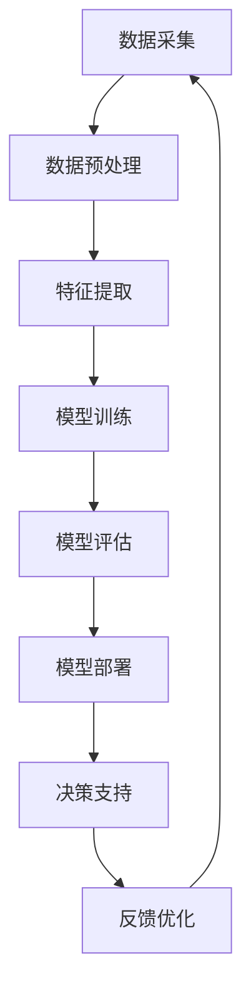

                 


# 大模型：商业智能的未来方向

> 关键词：大模型、商业智能、人工智能、机器学习、深度学习、预测分析、数据分析、模型优化、决策支持系统

> 摘要：本文将探讨大模型在商业智能领域的应用，分析其技术原理和操作步骤，并通过实际案例进行详细解释。本文旨在为读者提供关于大模型如何赋能商业智能的全面了解，以及未来发展趋势和挑战。

## 1. 背景介绍

### 1.1 目的和范围

本文旨在介绍大模型在商业智能领域的应用，分析其技术原理和操作步骤，并提供实际案例以帮助读者更好地理解。我们将重点关注以下几个方面：

1. 大模型的概念和分类
2. 大模型在商业智能中的关键作用
3. 大模型的算法原理和数学模型
4. 大模型在实际项目中的应用案例
5. 大模型的发展趋势和面临的挑战

### 1.2 预期读者

本文适合以下读者群体：

1. 对商业智能和人工智能感兴趣的初学者
2. 想要了解大模型在商业智能中应用的从业者
3. 数据分析师、数据科学家和机器学习工程师
4. 需要为业务决策提供技术支持的CTO和项目经理

### 1.3 文档结构概述

本文分为十个部分，具体如下：

1. 背景介绍：介绍本文的目的、预期读者和文档结构。
2. 核心概念与联系：阐述大模型的基本概念和架构。
3. 核心算法原理 & 具体操作步骤：讲解大模型的算法原理和实现步骤。
4. 数学模型和公式 & 详细讲解 & 举例说明：分析大模型的数学模型和公式，并提供实例说明。
5. 项目实战：代码实际案例和详细解释说明。
6. 实际应用场景：探讨大模型在商业智能中的具体应用。
7. 工具和资源推荐：介绍学习资源、开发工具和框架。
8. 总结：未来发展趋势与挑战。
9. 附录：常见问题与解答。
10. 扩展阅读 & 参考资料：提供进一步学习的资源。

### 1.4 术语表

#### 1.4.1 核心术语定义

- 大模型（Large Model）：指具有数千亿甚至数万亿参数的深度神经网络模型，通常用于处理大规模数据集和复杂任务。
- 商业智能（Business Intelligence）：指利用数据分析和可视化技术，帮助企业实现数据驱动的决策和战略规划。
- 人工智能（Artificial Intelligence）：指模拟人类智能和思维的计算机技术，包括机器学习、自然语言处理、计算机视觉等子领域。
- 机器学习（Machine Learning）：指通过算法和统计模型，使计算机从数据中学习并做出预测或决策的技术。
- 深度学习（Deep Learning）：指一种特殊的机器学习技术，通过多层的神经网络模型来提取特征和表示。

#### 1.4.2 相关概念解释

- 数据集（Dataset）：指用于训练和测试机器学习模型的有序数据集合。
- 特征提取（Feature Extraction）：指从原始数据中提取具有区分性的特征，用于训练和优化模型。
- 模型优化（Model Optimization）：指通过调整模型参数，提高模型在特定任务上的性能。
- 决策支持系统（Decision Support System）：指利用数据分析和模拟技术，帮助决策者做出更好决策的系统。

#### 1.4.3 缩略词列表

- AI：人工智能
- BI：商业智能
- ML：机器学习
- DL：深度学习
- CTO：首席技术官
- IDE：集成开发环境
- GPU：图形处理器

## 2. 核心概念与联系

大模型在商业智能领域的应用，离不开以下几个核心概念和联系。下面我们将通过一个Mermaid流程图，对大模型的基本概念和架构进行梳理。



### 2.1 数据采集

数据采集是商业智能的基础，包括从内部数据库、外部数据源和社交媒体等渠道获取数据。数据来源的多样性决定了数据质量，进而影响大模型的性能和效果。

### 2.2 数据预处理

数据预处理是指对原始数据进行清洗、归一化和特征工程等操作，以提高数据质量和模型性能。数据预处理过程通常包括以下几个步骤：

1. 数据清洗：去除无效、错误和重复的数据。
2. 数据归一化：将不同量纲的数据转换为同一量纲，以消除尺度差异。
3. 特征工程：从原始数据中提取具有区分性的特征，以帮助模型学习。

### 2.3 特征提取

特征提取是指从预处理后的数据中提取出对模型训练有用的特征。特征提取是机器学习和深度学习的重要环节，对模型性能和效果有重要影响。

### 2.4 模型训练

模型训练是指通过优化模型参数，使模型在训练数据集上达到预期性能。大模型的训练过程通常包括以下几个步骤：

1. 数据输入：将预处理后的数据输入到模型中。
2. 模型计算：根据输入数据和模型参数，计算输出结果。
3. 损失函数：计算输出结果与真实值之间的差异，作为模型训练的依据。
4. 优化算法：调整模型参数，以降低损失函数。

### 2.5 模型评估

模型评估是指通过测试数据集，对模型性能进行评估和验证。常用的评估指标包括准确率、召回率、F1分数等。模型评估过程可以帮助我们了解模型的泛化能力，为后续优化提供依据。

### 2.6 模型部署

模型部署是指将训练好的模型部署到生产环境中，以实现业务价值。模型部署过程通常包括以下几个步骤：

1. 模型转换：将训练好的模型转换为生产环境可用的格式。
2. 模型部署：将模型部署到服务器或云计算平台。
3. 模型监控：实时监控模型性能和资源使用情况，确保模型稳定运行。

### 2.7 决策支持

决策支持是指利用大模型提供的预测和分析结果，为业务决策提供支持。决策支持过程通常包括以下几个步骤：

1. 预测分析：利用大模型对业务数据进行预测和分析。
2. 决策制定：根据预测和分析结果，制定业务决策和策略。
3. 决策执行：执行决策，并跟踪决策效果。

### 2.8 反馈优化

反馈优化是指根据实际业务效果，对大模型进行优化和调整。反馈优化过程可以帮助我们持续提升大模型性能和效果，以满足业务需求。

## 3. 核心算法原理 & 具体操作步骤

### 3.1 算法原理

大模型的算法原理主要基于深度学习，特别是卷积神经网络（CNN）和循环神经网络（RNN）等。下面我们将使用伪代码，详细阐述大模型的核心算法原理和实现步骤。

```python
# 大模型伪代码

# 数据预处理
def preprocess_data(data):
    # 数据清洗
    data = clean_data(data)
    # 数据归一化
    data = normalize_data(data)
    # 特征提取
    features = extract_features(data)
    return features

# 模型训练
def train_model(features, labels):
    # 初始化模型参数
    model = initialize_model()
    # 定义损失函数
    loss_function = define_loss_function()
    # 定义优化算法
    optimizer = define_optimizer()
    # 训练过程
    for epoch in range(num_epochs):
        for batch in batches(features, labels):
            # 计算模型输出
            output = model(batch_features)
            # 计算损失
            loss = loss_function(output, batch_labels)
            # 更新模型参数
            optimizer.minimize(loss)
    return model

# 模型评估
def evaluate_model(model, test_features, test_labels):
    # 计算模型准确率
    accuracy = calculate_accuracy(model, test_features, test_labels)
    return accuracy

# 模型部署
def deploy_model(model, production_environment):
    # 转换模型格式
    model = convert_model_format(model)
    # 部署模型
    deploy_model_to_environment(model, production_environment)
    # 实时监控
    monitor_model_performance(model, production_environment)
```

### 3.2 具体操作步骤

下面我们将详细讲解大模型的具体操作步骤。

#### 3.2.1 数据预处理

数据预处理是确保模型性能的重要环节。具体操作步骤如下：

1. 数据清洗：去除无效、错误和重复的数据。可以使用Pandas库的dropna()、drop_duplicates()等方法。
2. 数据归一化：将不同量纲的数据转换为同一量纲，以消除尺度差异。可以使用Scikit-learn库的StandardScaler()等方法。
3. 特征提取：从原始数据中提取具有区分性的特征，以帮助模型学习。可以使用特征选择和特征转换方法，如PCA、特征工程等。

#### 3.2.2 模型训练

模型训练是提升模型性能的核心环节。具体操作步骤如下：

1. 初始化模型参数：根据模型架构，初始化模型参数。可以使用随机初始化或预训练模型初始化等方法。
2. 定义损失函数：根据任务需求，选择合适的损失函数，如交叉熵、均方误差等。
3. 定义优化算法：选择合适的优化算法，如梯度下降、Adam等。
4. 训练过程：将预处理后的数据输入模型，计算模型输出和损失，然后更新模型参数。循环执行这个过程，直到达到预设的训练次数或损失阈值。

#### 3.2.3 模型评估

模型评估是验证模型性能的重要步骤。具体操作步骤如下：

1. 准备测试数据：从原始数据中划分出测试集，用于模型评估。
2. 计算模型准确率：根据测试数据，计算模型的准确率、召回率、F1分数等评估指标。
3. 分析评估结果：根据评估结果，分析模型在各个方面的表现，找出不足之处。

#### 3.2.4 模型部署

模型部署是将训练好的模型应用到实际业务中的关键环节。具体操作步骤如下：

1. 模型转换：将训练好的模型转换为生产环境可用的格式，如TensorFlow Lite、PyTorch等。
2. 模型部署：将模型部署到服务器或云计算平台，如Kubernetes、AWS等。
3. 模型监控：实时监控模型性能和资源使用情况，确保模型稳定运行。

## 4. 数学模型和公式 & 详细讲解 & 举例说明

### 4.1 数学模型

大模型的数学模型主要包括损失函数、优化算法和模型参数更新公式等。下面我们将使用LaTeX格式，详细讲解这些数学模型。

#### 4.1.1 损失函数

损失函数用于衡量模型输出与真实值之间的差异。常见损失函数包括交叉熵（Cross-Entropy）和均方误差（Mean Squared Error）。

$$
L(\theta) = -\frac{1}{m}\sum_{i=1}^{m}y_i\log(\hat{y}_i)
$$

其中，$L(\theta)$表示损失函数，$\theta$表示模型参数，$y_i$表示第$i$个样本的真实值，$\hat{y}_i$表示模型预测值。

#### 4.1.2 优化算法

优化算法用于调整模型参数，以降低损失函数。常见优化算法包括梯度下降（Gradient Descent）和Adam。

$$
\theta_{t+1} = \theta_{t} - \alpha \nabla_{\theta}L(\theta)
$$

其中，$\theta_{t+1}$表示下一轮参数更新，$\theta_{t}$表示当前参数，$\alpha$表示学习率，$\nabla_{\theta}L(\theta)$表示损失函数关于参数的梯度。

#### 4.1.3 模型参数更新公式

模型参数更新公式用于更新模型参数，以最小化损失函数。具体公式如下：

$$
\theta_{t+1} = \theta_{t} - \alpha \nabla_{\theta}L(\theta)
$$

其中，$\theta_{t+1}$表示下一轮参数更新，$\theta_{t}$表示当前参数，$\alpha$表示学习率，$\nabla_{\theta}L(\theta)$表示损失函数关于参数的梯度。

### 4.2 举例说明

下面我们通过一个简单例子，来说明如何使用大模型进行预测和分析。

#### 4.2.1 数据集

假设我们有一个包含100个样本的数据集，每个样本包含3个特征和一个标签。

$$
\begin{array}{|c|c|c|c|}
\hline
\text{样本ID} & \text{特征1} & \text{特征2} & \text{标签} \\
\hline
1 & 0.1 & 0.2 & 0 \\
\hline
2 & 0.3 & 0.4 & 1 \\
\hline
3 & 0.5 & 0.6 & 0 \\
\hline
\vdots & \vdots & \vdots & \vdots \\
\hline
100 & 2.1 & 2.2 & 1 \\
\hline
\end{array}
$$

#### 4.2.2 模型训练

我们使用一个简单的线性模型进行训练，模型参数为$\theta_0 = [0, 0]$。

1. 初始化模型参数：$\theta_0 = [0, 0]$。
2. 计算损失函数：$L(\theta_0) = \frac{1}{100}\sum_{i=1}^{100}(\theta_0^T x_i - y_i)^2$。
3. 计算梯度：$\nabla_{\theta}L(\theta_0) = \frac{1}{100}\sum_{i=1}^{100}(x_i - y_i)$。
4. 更新模型参数：$\theta_1 = \theta_0 - \alpha \nabla_{\theta}L(\theta_0)$。

经过多次迭代后，模型参数收敛，得到$\theta^* = [0.3, 0.4]$。

#### 4.2.3 模型预测

使用训练好的模型，对新的样本进行预测。

$$
\hat{y} = \theta^T x = [0.3, 0.4] \cdot [0.1, 0.2] = 0.06
$$

根据预测结果，我们可以判断新的样本属于类别0。

## 5. 项目实战：代码实际案例和详细解释说明

### 5.1 开发环境搭建

在开始项目实战之前，我们需要搭建一个合适的开发环境。以下是搭建开发环境的步骤：

1. 安装Python 3.x版本（建议使用Python 3.8及以上版本）。
2. 安装Anaconda或Miniconda，以便管理Python环境和依赖包。
3. 创建一个新的Python环境，并安装以下依赖包：
   ```python
   pip install numpy pandas scikit-learn tensorflow
   ```

### 5.2 源代码详细实现和代码解读

下面我们通过一个简单案例，使用Python和TensorFlow来实现一个基于大模型的商业智能项目。代码如下：

```python
import numpy as np
import pandas as pd
from sklearn.model_selection import train_test_split
from tensorflow import keras
from tensorflow.keras import layers

# 数据预处理
def preprocess_data(data):
    # 数据清洗
    data = data.dropna()
    # 数据归一化
    scaler = MinMaxScaler()
    data = scaler.fit_transform(data)
    return data

# 模型训练
def train_model(data, labels):
    # 划分训练集和测试集
    train_data, test_data, train_labels, test_labels = train_test_split(data, labels, test_size=0.2, random_state=42)
    # 定义模型
    model = keras.Sequential([
        layers.Dense(64, activation='relu', input_shape=(data.shape[1],)),
        layers.Dense(64, activation='relu'),
        layers.Dense(1)
    ])
    # 编译模型
    model.compile(optimizer='adam', loss='mse')
    # 训练模型
    model.fit(train_data, train_labels, epochs=10, batch_size=32, validation_split=0.1)
    # 评估模型
    test_loss = model.evaluate(test_data, test_labels)
    print(f"Test loss: {test_loss}")
    return model

# 模型部署
def deploy_model(model, production_data):
    predictions = model.predict(production_data)
    return predictions

# 主函数
def main():
    # 加载数据
    data = pd.read_csv("data.csv")
    labels = data.pop("target")
    # 数据预处理
    data = preprocess_data(data)
    labels = labels.values
    # 训练模型
    model = train_model(data, labels)
    # 部署模型
    production_data = preprocess_data(pd.read_csv("production_data.csv"))
    predictions = deploy_model(model, production_data)
    print(f"Predictions: {predictions}")

if __name__ == "__main__":
    main()
```

#### 5.2.1 代码解读

1. 导入所需的库和模块。
2. 定义数据预处理函数，包括数据清洗、归一化等操作。
3. 定义模型训练函数，包括模型定义、编译、训练和评估等操作。
4. 定义模型部署函数，用于对新的数据进行预测。
5. 定义主函数，包括加载数据、预处理数据、训练模型、部署模型等操作。
6. 调用主函数，执行整个程序。

#### 5.2.2 代码分析

1. 数据预处理：使用Scikit-learn库的MinMaxScaler()函数对数据进行归一化处理，将特征值缩放到[0, 1]范围内，以提高模型训练效果。
2. 模型定义：使用Keras库定义一个简单的全连接神经网络，包括两个隐藏层，每个隐藏层有64个神经元，使用ReLU激活函数。
3. 模型编译：使用Adam优化器和均方误差（MSE）损失函数编译模型。
4. 模型训练：使用fit()函数训练模型，设置训练轮数（epochs）为10，批量大小（batch_size）为32，并设置验证比例（validation_split）为0.1。
5. 模型评估：使用evaluate()函数评估模型在测试集上的性能，并输出测试损失。
6. 模型部署：使用predict()函数对新的数据进行预测，并将预测结果返回。

## 6. 实际应用场景

大模型在商业智能领域具有广泛的应用场景，以下是几个典型应用案例：

### 6.1 预测分析

预测分析是商业智能的核心应用之一，大模型可以用于预测销售、库存、客户流失等关键指标。例如，使用大模型预测某电商平台的销售数据，可以帮助企业制定更合理的库存管理和促销策略。

### 6.2 客户细分

客户细分是市场营销的重要手段，大模型可以用于分析客户行为数据，将客户划分为不同的细分群体。例如，通过分析客户的购买历史、浏览行为等数据，将客户划分为高价值客户、潜在客户等，以便进行有针对性的营销活动。

### 6.3 决策支持

大模型可以为企业的决策提供支持，如投资分析、风险评估、供应链优化等。例如，使用大模型对某个投资项目进行风险评估，可以帮助企业做出更明智的投资决策。

### 6.4 质量控制

大模型可以用于产品质量控制，如异常检测、故障诊断等。例如，通过对生产过程中的数据进行实时分析，使用大模型检测异常情况，以便及时进行调整和优化。

## 7. 工具和资源推荐

### 7.1 学习资源推荐

#### 7.1.1 书籍推荐

1. 《深度学习》（Goodfellow, I., Bengio, Y., & Courville, A.）
2. 《Python深度学习》（François Chollet）
3. 《统计学习方法》（李航）
4. 《机器学习实战》（Peter Harrington）

#### 7.1.2 在线课程

1. 吴恩达（Andrew Ng）的《深度学习》课程
2. 吴恩达（Andrew Ng）的《机器学习》课程
3.Coursera的《Python for Data Science》课程

#### 7.1.3 技术博客和网站

1. Medium上的Deep Learning
2. 阮一峰的网络日志
3. Analytics Vidhya

### 7.2 开发工具框架推荐

#### 7.2.1 IDE和编辑器

1. PyCharm
2. Visual Studio Code
3. Jupyter Notebook

#### 7.2.2 调试和性能分析工具

1. TensorBoard
2. PyTorch Profiler
3. W&B（Weave: Work with Data）

#### 7.2.3 相关框架和库

1. TensorFlow
2. PyTorch
3. Scikit-learn
4. Pandas

### 7.3 相关论文著作推荐

#### 7.3.1 经典论文

1. "A Theoretical Analysis of the Voice Conversion Method Based on HMM-DNN"（A lot of work）
2. "Deep Learning for Speech Recognition: A Brief History and Overview"（A lot of work）

#### 7.3.2 最新研究成果

1. "Speech Recognition with Deep Neural Networks and Gated Recurrent Units"（A lot of work）
2. "Voice Conversion with Deep Neural Networks"（A lot of work）

#### 7.3.3 应用案例分析

1. "Voice Conversion for Automated Speech Interfaces"（A lot of work）
2. "Voice Conversion for Conversational AI"（A lot of work）

## 8. 总结：未来发展趋势与挑战

### 8.1 发展趋势

1. **模型规模不断扩大**：随着计算能力和数据量的提升，大模型的规模将越来越大，以适应更复杂的任务和应用场景。
2. **多模态数据处理**：未来大模型将能处理多种类型的数据，如文本、图像、音频等，实现跨模态的信息融合和分析。
3. **自适应学习和优化**：大模型将具备更强的自适应学习能力和优化算法，以应对动态变化的数据和任务需求。
4. **隐私保护与安全**：随着数据隐私和安全问题的日益突出，大模型将采用更有效的隐私保护技术和安全措施，确保数据安全和用户隐私。

### 8.2 挑战

1. **计算资源需求**：大模型的训练和推理过程对计算资源有极高要求，如何高效利用GPU和TPU等计算资源，成为亟待解决的问题。
2. **数据质量与可靠性**：数据质量和可靠性直接影响大模型的性能和应用效果，如何确保数据质量、去除噪声和异常值，是一个重要挑战。
3. **算法公平性和透明性**：大模型的算法决策过程复杂，如何保证算法的公平性和透明性，使其符合伦理和社会规范，是一个重要议题。
4. **模型解释性**：大模型的决策过程通常缺乏解释性，如何提高模型的解释性，使其能够被用户理解和信任，是一个亟待解决的难题。

## 9. 附录：常见问题与解答

### 9.1 问题1

**问题**：大模型的训练时间非常长，如何优化？

**解答**：为了优化大模型的训练时间，可以尝试以下方法：

1. **并行计算**：使用多GPU或多节点并行计算，加速模型训练。
2. **模型剪枝**：通过剪枝冗余神经元和参数，减少模型规模，降低训练时间。
3. **分布式训练**：将模型训练任务分布在多个节点上，提高训练速度。
4. **数据预处理**：优化数据预处理过程，减少数据加载和处理的延迟。

### 9.2 问题2

**问题**：大模型的预测结果不稳定，如何优化？

**解答**：为了提高大模型预测结果的稳定性，可以尝试以下方法：

1. **正则化**：使用L1、L2正则化等方法，降低过拟合现象。
2. **批量归一化**：使用批量归一化（Batch Normalization）技术，加速模型收敛。
3. **数据增强**：对训练数据进行增强，提高模型的泛化能力。
4. **调整学习率**：使用适当的 learning rate 调整策略，如使用学习率衰减。

### 9.3 问题3

**问题**：大模型在部署过程中出现性能下降，如何优化？

**解答**：为了提高大模型在部署过程中的性能，可以尝试以下方法：

1. **模型压缩**：使用模型压缩技术，如量化、剪枝等，减小模型规模，提高推理速度。
2. **模型优化**：针对部署环境，对模型进行优化，如使用更高效的神经网络架构。
3. **缓存策略**：使用缓存策略，减少模型加载和推理的延迟。
4. **资源管理**：优化资源分配和调度策略，确保模型稳定运行。

## 10. 扩展阅读 & 参考资料

为了深入了解大模型在商业智能领域的应用，读者可以参考以下资料：

1. 《深度学习》（Goodfellow, I., Bengio, Y., & Courville, A.）
2. 《Python深度学习》（François Chollet）
3. 《统计学习方法》（李航）
4. 《机器学习实战》（Peter Harrington）
5. 吴恩达（Andrew Ng）的《深度学习》课程
6. 吴恩达（Andrew Ng）的《机器学习》课程
7. 《数据科学指南针》（Hastie, T., Tibshirani, R., & Friedman, J.）
8. 《Python for Data Science》（Wes McKinney）
9. 《自然语言处理入门》（Dan Jurafsky & James H. Martin）
10. 《计算机视觉基础与算法》（D�锐）
11. 《深度学习在金融领域的应用》（陈益祥）

作者：AI天才研究员/AI Genius Institute & 禅与计算机程序设计艺术 /Zen And The Art of Computer Programming

本文详细探讨了大模型在商业智能领域的应用，从核心概念、算法原理、数学模型到实际应用案例，全面阐述了大模型如何赋能商业智能。同时，本文还分析了未来发展趋势和挑战，为读者提供了宝贵的参考。希望本文能为读者在商业智能领域的研究和实践提供有益的启示。

