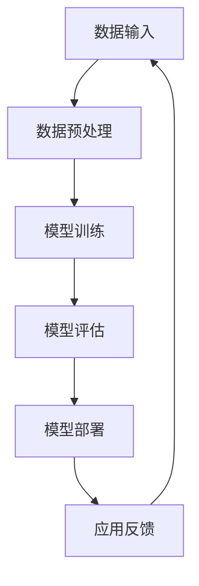

                 


## 大模型：数据驱动的商业创新

> **关键词：大模型、数据驱动、商业创新、人工智能、深度学习、机器学习**

> **摘要：本文将深入探讨大模型在数据驱动的商业创新中的应用，分析其原理、算法、数学模型及实际案例，为读者提供一个全面的技术视角，帮助理解大模型如何推动商业变革。**

---

### 1. 背景介绍

#### 1.1 目的和范围

本文旨在解析大模型在商业创新中的关键角色，探讨其在数据驱动环境下的应用前景。文章将从基本概念出发，逐步深入到技术细节，通过实例展示大模型如何影响商业决策和产品开发。

#### 1.2 预期读者

本文适合对人工智能、机器学习、数据科学有一定了解的技术人员、产品经理以及希望了解大模型商业价值的业界人士。

#### 1.3 文档结构概述

本文结构如下：

1. **核心概念与联系**：介绍大模型的定义及其在人工智能中的地位。
2. **核心算法原理 & 具体操作步骤**：阐述大模型的基本算法原理和操作流程。
3. **数学模型和公式 & 详细讲解 & 举例说明**：解释大模型背后的数学基础。
4. **项目实战：代码实际案例和详细解释说明**：提供大模型应用的实例代码。
5. **实际应用场景**：分析大模型在各类商业场景中的应用。
6. **工具和资源推荐**：推荐学习资源、开发工具和相关论文。
7. **总结：未来发展趋势与挑战**：预测大模型未来的发展路径。
8. **附录：常见问题与解答**：解答读者可能遇到的问题。
9. **扩展阅读 & 参考资料**：提供进一步学习的资源。

#### 1.4 术语表

##### 1.4.1 核心术语定义

- **大模型**：指具有巨大参数规模和深度结构的人工神经网络模型。
- **数据驱动**：基于数据分析和机器学习技术进行决策和创新的模式。
- **商业创新**：通过引入新技术、新理念或新商业模式，创造商业价值的过程。

##### 1.4.2 相关概念解释

- **机器学习**：利用数据训练模型，使模型能够从数据中学习并做出预测或决策的过程。
- **深度学习**：一种机器学习方法，通过多层神经网络结构进行特征提取和学习。
- **人工智能**：模拟人类智能行为的技术和系统。

##### 1.4.3 缩略词列表

- **ML**：机器学习（Machine Learning）
- **DL**：深度学习（Deep Learning）
- **AI**：人工智能（Artificial Intelligence）
- **GPT**：生成预训练模型（Generative Pre-trained Transformer）
- **NLP**：自然语言处理（Natural Language Processing）

### 2. 核心概念与联系

#### 2.1 大模型的定义与分类

大模型（Large-scale Models）是当前人工智能研究的重要方向之一。其定义可归纳为：具有巨大参数规模和深度结构的人工神经网络模型。根据应用场景和模型结构，大模型可以分类为：

- **预训练模型**：如GPT、BERT等，通过在大规模语料库上进行预训练，获得通用语义表示能力。
- **任务特定模型**：针对特定任务（如图像识别、自然语言处理等）进行微调（Fine-tuning）的模型。

#### 2.2 大模型在人工智能中的地位

大模型在人工智能领域具有重要地位，其核心贡献在于：

- **提升模型性能**：通过增加模型参数和深度，大模型能够捕捉更多数据中的复杂模式，提高预测和决策的准确性。
- **推动算法创新**：大模型的广泛应用促使研究人员不断探索新的算法和技术，如自适应学习率优化、分布式训练等。

#### 2.3 大模型的核心算法原理

大模型的核心算法主要基于深度学习，其基本原理如下：

1. **数据输入**：将输入数据（如图像、文本等）转化为模型可以处理的形式。
2. **特征提取**：通过多层神经网络结构，逐步提取数据的特征，形成高层次的语义表示。
3. **预测与优化**：利用已提取的特征进行预测，并通过反向传播算法不断优化模型参数。

#### 2.4 大模型与数据驱动的联系

数据驱动是当前商业创新的核心理念，而大模型是实现数据驱动的重要工具。大模型与数据驱动的联系主要体现在以下几个方面：

- **数据预处理**：大模型需要大量高质量的数据进行训练，数据预处理是确保模型性能的关键环节。
- **模型训练**：通过数据驱动的方式，不断调整和优化模型参数，提高模型在特定任务上的表现。
- **模型应用**：将训练好的大模型应用于商业场景，实现自动化决策和智能服务。

#### 2.5 Mermaid 流程图

为了更直观地展示大模型的工作流程，以下是一个简化的Mermaid流程图：



### 3. 核心算法原理 & 具体操作步骤

#### 3.1 算法原理

大模型的核心算法是基于深度学习的多层神经网络。其基本原理包括：

1. **前向传播**：将输入数据通过网络中的多层神经元进行传递，逐步提取特征。
2. **反向传播**：利用输出结果与真实结果的差异，通过反向传播算法更新网络权重。
3. **优化算法**：采用如梯度下降、Adam等优化算法，加速模型收敛。

#### 3.2 具体操作步骤

以下是一个简化的大模型训练过程：

```plaintext
Step 1: 数据准备
- 收集大量训练数据，进行预处理，如数据清洗、归一化等。

Step 2: 网络构建
- 设计神经网络结构，包括输入层、隐藏层和输出层。
- 初始化网络参数，如权重、偏置等。

Step 3: 前向传播
- 将预处理后的数据输入网络，通过多层神经元传递，计算输出结果。

Step 4: 反向传播
- 计算输出结果与真实结果的差异，通过反向传播算法更新网络权重。

Step 5: 优化
- 采用优化算法，如梯度下降，更新网络参数，提高模型性能。

Step 6: 模型评估
- 在验证集上评估模型性能，调整模型结构或参数。

Step 7: 模型部署
- 将训练好的模型部署到生产环境中，进行实际应用。
```

#### 3.3 伪代码示例

以下是一个简化的大模型训练过程的伪代码示例：

```python
# 初始化网络参数
weights = initialize_weights()
biases = initialize_biases()

# 循环迭代
for epoch in range(num_epochs):
    # 前向传播
    outputs = forward_pass(inputs, weights, biases)

    # 计算损失
    loss = compute_loss(outputs, targets)

    # 反向传播
    dweights, dbiases = backward_pass(outputs, targets, inputs)

    # 优化
    weights = update_weights(weights, dweights)
    biases = update_biases(biases, dbiases)

# 模型评估
evaluate_model(model, validation_data)

# 模型部署
deploy_model(model, production_environment)
```

### 4. 数学模型和公式 & 详细讲解 & 举例说明

#### 4.1 数学模型基础

大模型背后的数学模型主要涉及以下几个核心概念：

1. **神经网络**：由多层神经元构成的模型，通过传递数据并计算输出。
2. **激活函数**：用于引入非线性特性，常见的有Sigmoid、ReLU等。
3. **损失函数**：用于评估模型预测值与真实值之间的差异，常见的有均方误差（MSE）、交叉熵等。
4. **优化算法**：用于更新模型参数，常见的有梯度下降、Adam等。

#### 4.2 详细讲解

1. **神经网络**

   神经网络是一种由多层神经元组成的计算模型，其基本结构如下：

   $$ 
   \text{Neural Network} = (\text{Input Layer}, \text{Hidden Layers}, \text{Output Layer}) 
   $$

   其中，输入层接收外部输入数据，输出层产生模型预测结果，隐藏层则负责特征提取和传递。

2. **激活函数**

   激活函数用于引入非线性特性，使神经网络能够处理非线性问题。常见的激活函数有：

   - **Sigmoid**：$$ \sigma(x) = \frac{1}{1 + e^{-x}} $$
   - **ReLU**：$$ \text{ReLU}(x) = \max(0, x) $$

3. **损失函数**

   损失函数用于评估模型预测值与真实值之间的差异，常见的损失函数有：

   - **均方误差（MSE）**：$$ \text{MSE}(y, \hat{y}) = \frac{1}{n}\sum_{i=1}^{n}(y_i - \hat{y}_i)^2 $$
   - **交叉熵（Cross-Entropy）**：$$ \text{CE}(y, \hat{y}) = -\sum_{i=1}^{n}y_i\log(\hat{y}_i) $$

4. **优化算法**

   优化算法用于更新模型参数，以降低损失函数值。常见的优化算法有：

   - **梯度下降**：$$ \theta_{t+1} = \theta_{t} - \alpha \cdot \nabla_{\theta} J(\theta) $$
   - **Adam**：结合了梯度下降和动量项，具有自适应学习率。

#### 4.3 举例说明

以下是一个简单的神经网络训练示例：

```latex
\begin{align*}
\text{输入层}: & \quad x = [1, 2, 3] \\
\text{隐藏层1}: & \quad z_1 = \sigma(W_1x + b_1) \\
\text{隐藏层2}: & \quad z_2 = \sigma(W_2z_1 + b_2) \\
\text{输出层}: & \quad \hat{y} = \sigma(W_3z_2 + b_3)
\end{align*}
```

给定训练数据集，通过以下步骤进行训练：

1. **初始化参数**：$$ W_1, b_1, W_2, b_2, W_3, b_3 \sim \mathcal{N}(0, \frac{1}{\sqrt{n}}) $$
2. **前向传播**：计算隐藏层和输出层的激活值。
3. **计算损失**：$$ J(\theta) = \frac{1}{2}\sum_{i=1}^{n}(\hat{y}_i - y_i)^2 $$
4. **反向传播**：计算各层的梯度。
5. **优化参数**：$$ \theta_{t+1} = \theta_{t} - \alpha \cdot \nabla_{\theta} J(\theta) $$

通过多次迭代，模型逐渐收敛，预测结果不断接近真实值。

### 5. 项目实战：代码实际案例和详细解释说明

#### 5.1 开发环境搭建

在进行大模型项目实战之前，我们需要搭建一个适合开发的Python环境。以下是具体的步骤：

1. **安装Python**：下载并安装Python 3.8及以上版本。
2. **安装Jupyter Notebook**：在终端执行以下命令：
   ```bash
   pip install notebook
   ```
3. **安装必要库**：包括TensorFlow、Keras、Numpy等，使用以下命令：
   ```bash
   pip install tensorflow numpy
   ```

#### 5.2 源代码详细实现和代码解读

以下是一个基于TensorFlow和Keras实现的大模型训练案例：

```python
import tensorflow as tf
from tensorflow.keras.models import Sequential
from tensorflow.keras.layers import Dense, Activation
from tensorflow.keras.optimizers import Adam
from sklearn.model_selection import train_test_split

# 数据准备
# 这里使用鸢尾花数据集作为示例
from sklearn.datasets import load_iris
iris = load_iris()
X, y = iris.data, iris.target
X_train, X_test, y_train, y_test = train_test_split(X, y, test_size=0.2, random_state=42)

# 模型构建
model = Sequential()
model.add(Dense(64, input_shape=(4,), activation='relu'))
model.add(Dense(64, activation='relu'))
model.add(Dense(3, activation='softmax'))

# 编译模型
model.compile(optimizer=Adam(learning_rate=0.001), loss='categorical_crossentropy', metrics=['accuracy'])

# 训练模型
model.fit(X_train, y_train, epochs=100, batch_size=32, validation_data=(X_test, y_test))

# 评估模型
loss, accuracy = model.evaluate(X_test, y_test)
print(f"Test accuracy: {accuracy:.4f}")

# 预测
predictions = model.predict(X_test)
```

**代码解读**：

1. **数据准备**：使用scikit-learn的鸢尾花数据集进行训练和测试。
2. **模型构建**：使用Sequential模型堆叠多层Dense层，最后一层使用softmax激活函数实现多分类。
3. **编译模型**：指定优化器为Adam，损失函数为categorical_crossentropy，指标为准确率。
4. **训练模型**：使用fit方法进行模型训练，指定训练轮数、批量大小和验证数据。
5. **评估模型**：使用evaluate方法评估模型在测试集上的表现。
6. **预测**：使用predict方法对测试集进行预测。

#### 5.3 代码解读与分析

**数据准备**：

- 使用`load_iris`函数加载鸢尾花数据集。
- 使用`train_test_split`函数将数据集分为训练集和测试集，其中测试集大小为原数据集的20%。

**模型构建**：

- 使用`Sequential`模型堆叠多层`Dense`层，每层64个神经元。
- 最后一层使用`softmax`激活函数，实现多分类输出。

**编译模型**：

- 使用`compile`方法配置模型，指定优化器为`Adam`，学习率为0.001。
- 损失函数选择`categorical_crossentropy`，适合多分类问题。
- 指定评估指标为准确率。

**训练模型**：

- 使用`fit`方法进行模型训练，指定训练轮数为100，批量大小为32。
- 使用`validation_data`参数进行验证集评估。

**评估模型**：

- 使用`evaluate`方法评估模型在测试集上的表现，输出损失和准确率。

**预测**：

- 使用`predict`方法对测试集进行预测，得到预测结果。

通过上述代码，我们可以实现一个简单的大模型训练过程，并在测试集上评估模型性能。实际应用中，根据具体任务和数据，可以选择更复杂的大模型结构和参数配置。

### 6. 实际应用场景

大模型在商业创新中具有广泛的应用场景，以下是几个典型的应用案例：

#### 6.1 自然语言处理

- **文本分类**：利用大模型对大量文本数据进行分类，用于舆情监测、新闻推荐等场景。
- **问答系统**：基于大模型的问答系统能够提供智能客服、智能助手等服务，提升用户体验。

#### 6.2 画像分析与推荐系统

- **用户画像**：通过对用户行为数据进行深度学习分析，构建用户画像，用于精准营销和个性化推荐。
- **商品推荐**：基于用户画像和商品特征，利用大模型实现智能商品推荐，提高转化率。

#### 6.3 金融服务

- **风险控制**：利用大模型对金融交易数据进行分析，实现实时风险控制和欺诈检测。
- **智能投顾**：通过大模型分析用户投资偏好和风险承受能力，提供个性化的投资建议。

#### 6.4 医疗健康

- **疾病预测**：利用大模型对医疗数据进行挖掘，实现早期疾病预测和个性化治疗建议。
- **智能诊断**：通过大模型对医学图像进行智能分析，辅助医生进行疾病诊断。

#### 6.5 物流与供应链

- **需求预测**：利用大模型对市场数据和销售数据进行预测，优化库存管理和供应链调度。
- **路径优化**：通过大模型优化物流路线和配送计划，提高运输效率和降低成本。

### 7. 工具和资源推荐

为了更好地理解和应用大模型，以下是相关工具和资源的推荐：

#### 7.1 学习资源推荐

##### 7.1.1 书籍推荐

- 《深度学习》（Goodfellow, Bengio, Courville著）：系统介绍深度学习的基础理论和实践方法。
- 《Python机器学习》（Sebastian Raschka著）：详细讲解Python在机器学习领域的应用。

##### 7.1.2 在线课程

- Coursera上的“机器学习”（吴恩达教授）：广泛认可的机器学习入门课程。
- edX上的“深度学习基础”（斯坦福大学）：由深度学习领域专家提供的高质量课程。

##### 7.1.3 技术博客和网站

- [TensorFlow官网](https://www.tensorflow.org/): TensorFlow的官方文档和教程。
- [Keras官网](https://keras.io/): Keras的官方文档和社区资源。

#### 7.2 开发工具框架推荐

##### 7.2.1 IDE和编辑器

- **Visual Studio Code**：功能强大的开源编辑器，支持多种编程语言和框架。
- **PyCharm**：专业的Python IDE，提供丰富的调试和优化工具。

##### 7.2.2 调试和性能分析工具

- **TensorBoard**：TensorFlow提供的可视化工具，用于分析和调试模型。
- **NVIDIA Nsight**：NVIDIA提供的一款性能分析工具，用于优化GPU计算。

##### 7.2.3 相关框架和库

- **TensorFlow**：广泛使用的深度学习框架，适用于大规模模型训练。
- **PyTorch**：基于Python的深度学习库，具有灵活的动态计算图支持。

#### 7.3 相关论文著作推荐

##### 7.3.1 经典论文

- **“A Theoretical Framework for Back-Propagation”**：由Rumelhart, Hinton和Williams提出，奠定了反向传播算法的理论基础。
- **“Deep Learning”**：Goodfellow, Bengio和Courville的著作，全面介绍了深度学习的基础和前沿。

##### 7.3.2 最新研究成果

- **“BERT: Pre-training of Deep Bidirectional Transformers for Language Understanding”**：Google提出的一种预训练模型，显著提升了自然语言处理任务的性能。
- **“GPT-3: Language Models are Few-Shot Learners”**：OpenAI发布的一种大型预训练模型，展示了在少数样本学习方面的强大能力。

##### 7.3.3 应用案例分析

- **“Large-scale Language Models in Training Dialog Systems”**：介绍如何在对话系统中应用大型语言模型，提升对话生成和理解的性能。
- **“Application of Deep Learning in Healthcare”**：探讨深度学习在医疗健康领域的应用，如疾病预测和诊断。

### 8. 总结：未来发展趋势与挑战

#### 8.1 发展趋势

1. **模型规模不断扩大**：随着计算资源和数据量的增加，大模型的规模将不断增大，以应对更复杂的任务。
2. **跨学科融合**：大模型将与其他领域（如生物学、物理学、经济学等）结合，推动跨学科研究的发展。
3. **模型解释性提升**：为了应对实际应用中的需求，大模型的解释性和透明度将得到重视，以提升模型的可靠性和可解释性。

#### 8.2 挑战

1. **计算资源需求**：大模型训练和推理需要大量的计算资源和存储空间，如何优化资源利用成为一大挑战。
2. **数据隐私保护**：随着数据量的增加，如何确保数据隐私和安全是一个亟待解决的问题。
3. **算法公平性**：大模型可能引入算法偏见，如何确保算法的公平性和无歧视性是重要的社会议题。

### 9. 附录：常见问题与解答

#### 9.1 问题1：大模型如何处理海量数据？

**解答**：大模型通常采用分布式训练技术，将数据分割成多个子集，并在多个计算节点上并行训练，以加速训练过程和提高效率。

#### 9.2 问题2：大模型的训练过程如何优化？

**解答**：优化大模型的训练过程可以从以下几个方面进行：
1. 调整学习率，使用自适应学习率优化算法（如Adam）。
2. 使用批量归一化（Batch Normalization）和Dropout等技术，提高模型的稳定性和泛化能力。
3. 采用迁移学习（Transfer Learning）技术，利用预训练模型，减少训练时间。

### 10. 扩展阅读 & 参考资料

为了进一步了解大模型及其在商业创新中的应用，以下是推荐的扩展阅读和参考资料：

1. **书籍**：
   - 《深度学习》（Goodfellow, Bengio, Courville著）
   - 《Python机器学习》（Sebastian Raschka著）

2. **在线课程**：
   - Coursera上的“机器学习”（吴恩达教授）
   - edX上的“深度学习基础”（斯坦福大学）

3. **技术博客和网站**：
   - [TensorFlow官网](https://www.tensorflow.org/)
   - [Keras官网](https://keras.io/)

4. **相关论文**：
   - “BERT: Pre-training of Deep Bidirectional Transformers for Language Understanding”
   - “GPT-3: Language Models are Few-Shot Learners”

5. **应用案例分析**：
   - “Large-scale Language Models in Training Dialog Systems”
   - “Application of Deep Learning in Healthcare”

---

**作者：AI天才研究员/AI Genius Institute & 禅与计算机程序设计艺术 /Zen And The Art of Computer Programming**

