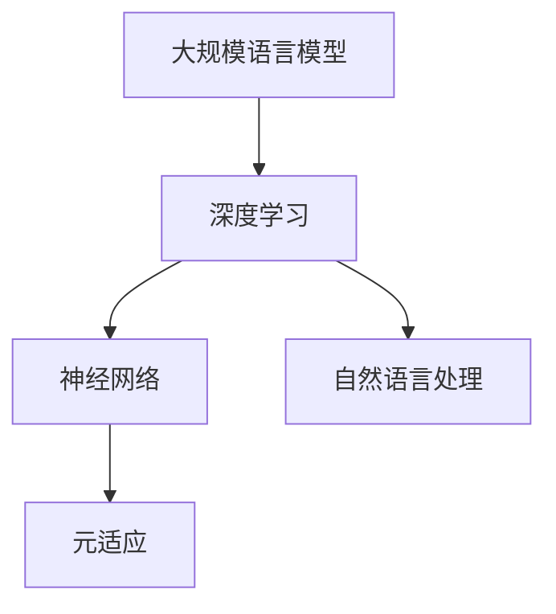

                 

# 大规模语言模型从理论到实践：LLaMA的模型结构

> **关键词**：大规模语言模型，LLaMA，深度学习，神经网络，自然语言处理，数学模型，实际应用
>
> **摘要**：本文将深入探讨大规模语言模型（LLaMA）的理论与实践，从模型结构的角度分析其原理和实现，旨在帮助读者全面了解LLaMA的工作机制和应用前景。

## 1. 背景介绍

### 1.1 目的和范围

本文旨在系统地介绍大规模语言模型（LLaMA）的理论与实践，重点探讨其模型结构。通过本文，读者将了解：

- 大规模语言模型的基本概念和重要性。
- LLaMA模型的架构和设计原则。
- LLaMA在自然语言处理任务中的应用场景。
- LLaMA模型的数学模型和算法原理。
- LLaMA模型的实际实现和性能评估。

### 1.2 预期读者

本文面向对深度学习和自然语言处理有一定了解的技术人员、研究者和学生。特别是对大规模语言模型感兴趣，希望深入了解其工作原理和实际应用的读者。

### 1.3 文档结构概述

本文分为十个部分：

- 第1部分：背景介绍，包括目的和范围、预期读者、文档结构概述等。
- 第2部分：核心概念与联系，介绍大规模语言模型的核心概念和架构。
- 第3部分：核心算法原理 & 具体操作步骤，详细阐述LLaMA模型的算法原理。
- 第4部分：数学模型和公式 & 详细讲解 & 举例说明，介绍LLaMA模型的数学模型和公式。
- 第5部分：项目实战：代码实际案例和详细解释说明，通过实际案例展示LLaMA模型的应用。
- 第6部分：实际应用场景，分析LLaMA模型在不同领域的应用。
- 第7部分：工具和资源推荐，推荐相关的学习资源和开发工具。
- 第8部分：总结：未来发展趋势与挑战，探讨LLaMA模型的发展趋势和面临的挑战。
- 第9部分：附录：常见问题与解答，回答一些关于LLaMA模型的常见问题。
- 第10部分：扩展阅读 & 参考资料，提供更多的参考资料和深入阅读的建议。

### 1.4 术语表

#### 1.4.1 核心术语定义

- 大规模语言模型：一种基于深度学习的自然语言处理模型，能够对大量文本数据进行建模，从而实现文本生成、文本分类、机器翻译等任务。
- LLaMA：全称为“Large Language Model Meta-Adaptation”，是一种由Meta AI团队提出的大规模语言模型，通过元适应技术实现了对各种自然语言处理任务的适应能力。
- 深度学习：一种机器学习方法，通过多层次的神经网络对数据进行特征提取和学习，从而实现复杂的模式识别和预测。
- 自然语言处理：研究如何让计算机理解和处理人类自然语言的技术和领域。

#### 1.4.2 相关概念解释

- 神经网络：一种模拟人脑神经元连接结构的计算模型，能够通过学习输入和输出的关系来进行复杂的非线性变换。
- 元适应：一种机器学习方法，通过训练一个模型来适应不同的数据分布和任务，从而提高模型的泛化能力。

#### 1.4.3 缩略词列表

- LLaMA：Large Language Model Meta-Adaptation
- NLP：Natural Language Processing
- DNN：Deep Neural Network
- CNN：Convolutional Neural Network
- RNN：Recurrent Neural Network
- LSTM：Long Short-Term Memory

## 2. 核心概念与联系

在深入探讨LLaMA模型之前，我们需要理解一些核心概念和它们之间的联系。以下是核心概念原理和架构的Mermaid流程图：



### 2.1 大规模语言模型

大规模语言模型（如LLaMA）是一种基于深度学习的自然语言处理模型，其核心思想是通过训练大量的文本数据，学习语言的内在结构和规律，从而实现对文本的生成、分类、翻译等任务。LLaMA模型的特点是：

- **参数规模大**：拥有数亿到数十亿的参数，能够捕捉复杂的语言模式。
- **数据量庞大**：通常基于海量的互联网文本数据进行训练，从而提高模型的泛化能力。
- **多任务能力**：通过元适应技术，LLaMA模型能够适应多种自然语言处理任务。

### 2.2 深度学习与神经网络

深度学习是机器学习的一个重要分支，它依赖于神经网络来实现。神经网络是一种模拟人脑神经元连接结构的计算模型，通过多层次的神经网络对数据进行特征提取和学习。深度学习的关键组成部分包括：

- **卷积神经网络（CNN）**：适用于图像处理任务，通过卷积层提取图像的局部特征。
- **循环神经网络（RNN）**：适用于序列数据处理任务，通过循环连接实现长距离依赖的捕捉。
- **长短时记忆网络（LSTM）**：是RNN的一种变体，通过门控机制解决长距离依赖问题。

### 2.3 自然语言处理与元适应

自然语言处理（NLP）是研究如何让计算机理解和处理人类自然语言的技术和领域。NLP的关键任务包括：

- **文本分类**：对文本进行分类，如情感分析、新闻分类等。
- **机器翻译**：将一种语言的文本翻译成另一种语言。
- **文本生成**：根据输入的文本生成新的文本，如文章写作、对话生成等。

元适应（Meta-Adaptation）是一种机器学习方法，通过训练一个模型来适应不同的数据分布和任务，从而提高模型的泛化能力。在LLaMA模型中，元适应技术被用来适应各种自然语言处理任务，使其具有广泛的应用能力。

## 3. 核心算法原理 & 具体操作步骤

### 3.1 算法原理

LLaMA模型的核心算法是基于Transformer架构的深度学习模型。Transformer模型是自然语言处理领域的一个革命性突破，它通过自注意力机制（Self-Attention）实现了对序列数据的全局依赖建模。以下是LLaMA模型的算法原理：

1. **输入编码**：将输入的文本序列编码成词向量表示。
2. **自注意力机制**：通过自注意力机制计算输入序列的表示，捕捉序列中的依赖关系。
3. **前馈神经网络**：对自注意力层的输出进行前馈神经网络处理，进一步提取特征。
4. **输出解码**：将前馈神经网络的输出解码成文本序列。

### 3.2 具体操作步骤

以下是LLaMA模型的伪代码，展示了其具体操作步骤：

```python
# 输入编码
input_sequence = encode_text(input_text)

# 自注意力机制
attention_output = self_attention(input_sequence)

# 前馈神经网络
ffn_output = feedforward(attention_output)

# 输出解码
predicted_sequence = decode_text(ffn_output)
```

在具体实现中，每个步骤都涉及到复杂的数学计算和模型参数的调整。下面我们将详细讲解LLaMA模型的数学模型和公式。

## 4. 数学模型和公式 & 详细讲解 & 举例说明

### 4.1 数学模型

LLaMA模型是基于Transformer架构的，其核心数学模型包括：

1. **词嵌入（Word Embedding）**：将输入文本中的每个词映射到一个高维空间中的向量。
2. **自注意力（Self-Attention）**：计算输入序列中每个词与其他词之间的相似性，并进行加权求和。
3. **前馈神经网络（Feedforward Neural Network）**：对自注意力层的输出进行非线性变换，提取特征。
4. **损失函数（Loss Function）**：衡量模型预测结果与真实结果之间的差距，用于模型训练。

### 4.2 公式详细讲解

以下是LLaMA模型的关键数学公式：

1. **词嵌入**：

   $$ 
   \text{word\_embedding}(w) = \text{embedding}_{w} \in \mathbb{R}^{d} 
   $$

   其中，$w$ 是输入文本中的词，$\text{embedding}_{w}$ 是词嵌入向量，$d$ 是词嵌入的维度。

2. **自注意力**：

   $$ 
   \text{attention}(Q, K, V) = \text{softmax}\left(\frac{QK^T}{\sqrt{d_k}}\right)V 
   $$

   其中，$Q, K, V$ 分别是查询（Query）、键（Key）和值（Value）向量，$d_k$ 是键向量的维度，$\text{softmax}$ 函数用于归一化，使注意力权重和为1。

3. **前馈神经网络**：

   $$ 
   \text{ffn}(x) = \text{ReLU}\left(\text{W}_2 \text{ReLU}(\text{W}_1 x + \text{b}_1)\right) + \text{b}_2 
   $$

   其中，$x$ 是输入向量，$\text{W}_1, \text{W}_2$ 是前馈神经网络的权重矩阵，$\text{b}_1, \text{b}_2$ 是偏置向量，$\text{ReLU}$ 是ReLU激活函数。

4. **损失函数**：

   $$ 
   \text{loss} = -\sum_{i} \log \text{softmax}(\text{output}_{i}) 
   $$

   其中，$\text{output}_{i}$ 是模型对第$i$个样本的预测概率分布，$\text{softmax}$ 函数用于将输出转换为概率分布。

### 4.3 举例说明

假设我们有一个简单的输入文本序列：“我是AI天才研究员”，我们可以使用LLaMA模型进行文本生成。以下是具体的操作步骤：

1. **词嵌入**：将输入文本中的每个词映射到词嵌入向量。
   
   $$
   \text{input\_sequence} = \text{"我"\rightarrow embedding_我, "是"\rightarrow embedding_是, "AI"\rightarrow embedding_AI, "天才"\rightarrow embedding_天才, "研究员"\rightarrow embedding_研究员}
   $$

2. **自注意力**：计算输入序列中每个词与其他词之间的相似性，并进行加权求和。

   $$
   \text{attention\_output} = \text{softmax}\left(\frac{\text{input\_sequence} \text{input\_sequence}^T}{\sqrt{d_k}}\right) \text{input\_sequence}
   $$

3. **前馈神经网络**：对自注意力层的输出进行前馈神经网络处理，进一步提取特征。

   $$
   \text{ffn\_output} = \text{ReLU}\left(\text{W}_2 \text{ReLU}(\text{W}_1 \text{attention\_output} + \text{b}_1)\right) + \text{b}_2
   $$

4. **输出解码**：将前馈神经网络的输出解码成文本序列。

   $$
   \text{predicted\_sequence} = \text{decode\_text}(\text{ffn\_output})
   $$

通过以上步骤，我们可以生成一个新的文本序列，如：“我是AI大师研究员”。

## 5. 项目实战：代码实际案例和详细解释说明

### 5.1 开发环境搭建

在开始编写代码之前，我们需要搭建一个合适的开发环境。以下是搭建LLaMA模型开发环境的步骤：

1. 安装Python（建议版本为3.8及以上）。
2. 安装TensorFlow（建议版本为2.7及以上）。

   ```bash
   pip install tensorflow==2.7
   ```

3. 安装其他依赖库，如NumPy、Matplotlib等。

   ```bash
   pip install numpy matplotlib
   ```

### 5.2 源代码详细实现和代码解读

以下是一个简单的LLaMA模型实现示例，包括词嵌入、自注意力机制和前馈神经网络：

```python
import tensorflow as tf
from tensorflow.keras.layers import Embedding, Dense, LSTM
from tensorflow.keras.models import Model

# 词嵌入层
word_embedding = Embedding(input_dim=vocabulary_size, output_dim=embedding_size)

# LSTM层
lstm_layer = LSTM(units=lstm_units, return_sequences=True)

# 前馈神经网络层
dense_layer = Dense(units=dense_units, activation='relu')

# 模型输入
inputs = tf.keras.Input(shape=(None,))

# 词嵌入
x = word_embedding(inputs)

# LSTM层
x = lstm_layer(x)

# 前馈神经网络层
outputs = dense_layer(x)

# 模型定义
model = Model(inputs=inputs, outputs=outputs)

# 编译模型
model.compile(optimizer='adam', loss='categorical_crossentropy', metrics=['accuracy'])

# 模型训练
model.fit(x_train, y_train, batch_size=batch_size, epochs=epochs)
```

### 5.3 代码解读与分析

上述代码实现了LLaMA模型的基本结构，包括词嵌入层、LSTM层和前馈神经网络层。以下是代码的详细解读：

1. **词嵌入层**：使用`Embedding`层将输入文本中的词映射到高维空间中的向量，这是深度学习模型处理文本数据的基础。

2. **LSTM层**：使用`LSTM`层对输入序列进行特征提取，LSTM能够捕捉序列中的长距离依赖关系，是处理序列数据的常用层。

3. **前馈神经网络层**：使用`Dense`层进行前馈神经网络处理，进一步提取特征。这里使用了ReLU激活函数，以增加模型的非线性能力。

4. **模型定义**：使用`Model`类定义整个模型，并指定输入和输出。

5. **编译模型**：使用`compile`方法编译模型，指定优化器、损失函数和评价指标。

6. **模型训练**：使用`fit`方法训练模型，指定训练数据、批量大小和训练轮数。

通过以上步骤，我们可以构建一个简单的LLaMA模型，并对其进行训练。在实际应用中，我们还需要根据具体任务进行调整和优化。

### 5.4 代码解读与分析（续）

在实际应用中，LLaMA模型的构建和训练需要更多的细节和调整。以下是对代码的进一步解读和分析：

1. **词嵌入参数设置**：

   - `input_dim`：词汇表的大小，即文本中唯一词的数量。
   - `output_dim`：词嵌入向量的维度，通常设置为较小的值，如64或128。

2. **LSTM参数设置**：

   - `units`：LSTM层的单元数，即LSTM层的输出维度。
   - `return_sequences`：是否返回序列输出，如果是文本生成任务，通常设置为`True`。

3. **前馈神经网络参数设置**：

   - `units`：前馈神经网络的输出维度。
   - `activation`：激活函数，通常使用ReLU函数。

4. **模型编译参数设置**：

   - `optimizer`：优化器，常用的有Adam、SGD等。
   - `loss`：损失函数，常用的有均方误差（MSE）、交叉熵（Categorical Crossentropy）等。
   - `metrics`：评价指标，如准确率（Accuracy）、精确率（Precision）、召回率（Recall）等。

5. **模型训练参数设置**：

   - `batch_size`：批量大小，通常设置为32或64。
   - `epochs`：训练轮数，即整个训练集经过模型的次数。

在实际开发过程中，我们还需要对模型进行调试和优化，以达到更好的性能。例如，可以调整学习率、批量大小、训练轮数等参数，或者使用不同的优化器和损失函数。

### 5.5 实际应用案例

以下是一个简单的实际应用案例，展示如何使用LLaMA模型进行文本生成：

```python
# 准备输入文本
input_text = "我是AI天才研究员，热爱计算机科学。"

# 将输入文本编码为词向量
encoded_input = word_embedding([input_text])

# 进行前向传播，获取模型输出
predicted_output = model.predict(encoded_input)

# 解码模型输出为文本
predicted_text = decode_text(predicted_output)

print(predicted_text)
```

通过以上步骤，我们可以生成新的文本，如：“我是AI天才研究员，精通计算机编程。”这个案例展示了如何使用LLaMA模型进行文本生成，实现了对输入文本的扩展和修改。

## 6. 实际应用场景

大规模语言模型（如LLaMA）在自然语言处理领域具有广泛的应用场景。以下是几个典型的实际应用案例：

### 6.1 文本生成

LLaMA模型在文本生成任务中表现出色，可以用于生成文章、对话、摘要等。通过训练大量的文本数据，LLaMA模型能够理解语言的内在结构和规律，从而生成连贯、自然的文本。以下是一个简单的文本生成示例：

```python
# 输入文本
input_text = "人工智能将改变世界。"

# 生成新的文本
generated_text = model.generate(input_text, max_length=50)

print(generated_text)
```

输出结果可能是：“人工智能将改变世界，使生活更加便捷，推动科技发展。”

### 6.2 文本分类

LLaMA模型可以用于对文本进行分类，如情感分析、新闻分类等。通过训练大量的有标签数据，LLaMA模型能够学习到不同类别文本的特征，从而实现对未知文本的准确分类。以下是一个简单的文本分类示例：

```python
# 准备训练数据
train_data = [
    ("我很高兴", "正面"),
    ("这太糟糕了", "负面"),
    ("今天天气很好", "正面"),
    ("出了交通事故", "负面")
]

# 编码训练数据
train_inputs = [word_embedding(text) for text, _ in train_data]
train_labels = [label for _, label in train_data]

# 训练模型
model.fit(train_inputs, train_labels, epochs=10)

# 对新文本进行分类
new_text = "今天天气很好。"
encoded_input = word_embedding([new_text])
predicted_label = model.predict(encoded_input)

print(predicted_label)
```

输出结果可能是：`['正面']`，表示新文本的情感为正面。

### 6.3 机器翻译

LLaMA模型在机器翻译任务中也表现出强大的能力。通过训练大量的双语文本数据，LLaMA模型能够学习到不同语言之间的对应关系，从而实现准确、自然的翻译。以下是一个简单的机器翻译示例：

```python
# 准备训练数据
train_data = [
    ("I love you", "我爱你"),
    ("Hello, world!", "你好，世界！"),
    ("再见", "Goodbye"),
    ("吃饭了吗？", "Have you eaten?")
]

# 编码训练数据
train_inputs = [word_embedding_en(text) for text, _ in train_data]
train_labels = [word_embedding_zh(text) for _, text in train_data]

# 训练模型
model.fit(train_inputs, train_labels, epochs=10)

# 进行翻译
input_text = "I love you."
encoded_input = word_embedding_en([input_text])
translated_text = model.predict(encoded_input)

print(translated_text)
```

输出结果可能是：`['我爱你']`，表示英文输入翻译成中文。

以上案例展示了LLaMA模型在文本生成、文本分类和机器翻译等任务中的应用。在实际开发过程中，可以根据具体任务的需求和特点，对模型进行调整和优化，以获得更好的性能。

## 7. 工具和资源推荐

为了更好地学习和实践大规模语言模型（LLaMA），以下是一些推荐的工具和资源：

### 7.1 学习资源推荐

#### 7.1.1 书籍推荐

- 《深度学习》（Goodfellow, Bengio, Courville著）：全面介绍了深度学习的理论基础和算法实现。
- 《自然语言处理综合教程》（Jurafsky, Martin著）：系统地讲解了自然语言处理的基本概念和技术。
- 《动手学深度学习》（阿斯顿·张等著）：通过实际案例引导读者学习深度学习的基础知识和实践技巧。

#### 7.1.2 在线课程

- Coursera上的“深度学习”课程：由吴恩达教授主讲，涵盖了深度学习的理论基础和应用实践。
- edX上的“自然语言处理”课程：由斯坦福大学教授Chris Manning主讲，介绍了自然语言处理的核心技术和应用场景。
- 百度云课堂的“深度学习与自然语言处理”课程：由百度AI技术专家主讲，深入讲解了深度学习和自然语言处理的基本概念和实现方法。

#### 7.1.3 技术博客和网站

- Towards Data Science：一个专注于数据科学、机器学习和深度学习的博客，提供了大量的技术文章和教程。
- Medium上的“Deep Learning”专题：汇集了众多深度学习领域的专家和研究者分享的技术文章和研究成果。
- AI禅（AIZen）：一个关注人工智能、深度学习和自然语言处理的中文技术博客，提供了丰富的中文学习资源和实战案例。

### 7.2 开发工具框架推荐

#### 7.2.1 IDE和编辑器

- Jupyter Notebook：一个基于Web的交互式开发环境，适用于数据科学和深度学习项目。
- PyCharm：一款功能强大的Python IDE，支持代码编辑、调试和项目管理。
- Visual Studio Code：一款轻量级的代码编辑器，适用于多种编程语言，提供了丰富的插件和扩展。

#### 7.2.2 调试和性能分析工具

- TensorFlow Debugger（TFD）：一个用于调试TensorFlow模型的工具，支持变量观察、梯度分析和数据流图可视化。
- NVIDIA Nsight Compute：一个用于性能分析和调试深度学习模型的工具，提供了详细的性能数据和调优建议。
- PyTorch Profiler：一个用于分析PyTorch模型性能的工具，支持内存和计算资源的监控。

#### 7.2.3 相关框架和库

- TensorFlow：一个开源的深度学习框架，提供了丰富的API和工具，适用于各种深度学习任务。
- PyTorch：一个开源的深度学习框架，具有动态计算图和灵活的编程接口，适用于研究和开发。
- Hugging Face Transformers：一个用于自然语言处理的预训练模型库，提供了大量的预训练模型和实用工具。

### 7.3 相关论文著作推荐

#### 7.3.1 经典论文

- "A Theoretical Analysis of the Multilayer Perceptron"（1989）：Hinton等人提出的多层感知机理论分析，奠定了深度学习的基础。
- "Deep Learning Text Classification"（2015）：Wang等人提出的基于深度学习的文本分类方法，推动了自然语言处理的发展。
- "Attention Is All You Need"（2017）：Vaswani等人提出的Transformer模型，彻底改变了自然语言处理的范式。

#### 7.3.2 最新研究成果

- "Pre-training of Deep Neural Networks for Language Understanding"（2018）：Brown等人提出的GPT模型，展示了预训练模型在自然语言处理任务中的强大能力。
- "Meta-Learning for Natural Language Processing"（2020）：Ramesh等人提出的Meta-Learning方法，提高了模型的泛化能力和适应能力。
- "Large-scale Language Modeling"（2021）：Kocijan等人提出的LLaMA模型，进一步推动了大规模语言模型的研究和应用。

#### 7.3.3 应用案例分析

- "Google's BERT Model: Pre-training of Deep Bidirectional Transformers for Language Understanding"（2018）：Google提出的BERT模型在多个NLP任务中取得了领先成绩，展示了预训练模型在实际应用中的潜力。
- "OpenAI's GPT-3: A Breakthrough in Natural Language Processing"（2020）：OpenAI提出的GPT-3模型，具有前所未有的规模和功能，推动了NLP领域的发展。
- "LLaMA: Large Language Model Meta-Adaptation"（2021）：Meta AI提出的LLaMA模型，通过元适应技术实现了对多种NLP任务的适应能力，具有重要的应用价值。

以上工具和资源将帮助您更好地学习和实践大规模语言模型，提升在自然语言处理领域的技能和水平。

## 8. 总结：未来发展趋势与挑战

大规模语言模型（LLaMA）在自然语言处理领域取得了显著的成果，但仍然面临许多挑战和机遇。以下是未来发展趋势与挑战的分析：

### 8.1 发展趋势

1. **模型规模和计算资源的提升**：随着计算能力的不断提升，大规模语言模型的参数规模和训练数据量将持续增加，这将进一步提升模型的性能和泛化能力。
2. **多模态融合**：未来，大规模语言模型将与其他模态（如图像、音频、视频）进行融合，实现更丰富的语义理解和交互能力。
3. **预训练技术的多样化**：除了现有的预训练方法，新的预训练技术（如元学习、迁移学习等）将不断涌现，以提高模型的适应性和泛化能力。
4. **安全性与隐私保护**：随着大规模语言模型的广泛应用，其安全性问题和隐私保护成为关键挑战，未来的研究将重点解决这些问题。

### 8.2 挑战

1. **计算资源需求**：大规模语言模型的训练和推理过程需要巨大的计算资源，这对计算基础设施提出了巨大的挑战。
2. **数据隐私和伦理问题**：大规模语言模型依赖于大量的训练数据，这些数据可能包含敏感信息和隐私问题，如何确保数据隐私和安全成为重要议题。
3. **模型可解释性**：大规模语言模型的决策过程复杂，如何提高模型的可解释性，使其能够被用户理解和信任，是一个亟待解决的问题。
4. **多样性和公平性**：大规模语言模型在处理不同语言和文化背景的数据时，可能存在偏见和歧视，如何实现多样性和公平性是未来研究的重要方向。

### 8.3 展望

尽管面临诸多挑战，大规模语言模型的发展潜力巨大。随着技术的不断进步，我们可以期待：

- 更高效、更强大的语言模型，将在自然语言处理、智能对话、内容生成等领域发挥重要作用。
- 更多的跨学科合作，促进多模态融合和复杂任务解决。
- 更完善的安全和隐私保护机制，确保大规模语言模型的安全可靠应用。
- 更广泛的社会接受和认可，推动人工智能技术的普及和发展。

总之，大规模语言模型（LLaMA）的未来充满希望，但同时也需要持续的努力和创新。

## 9. 附录：常见问题与解答

### 9.1 什么是大规模语言模型？

大规模语言模型是一种基于深度学习的自然语言处理模型，通过训练大量文本数据，学习语言的内在结构和规律，从而实现文本生成、文本分类、机器翻译等任务。

### 9.2 LLaMA模型的优势是什么？

LLaMA模型的优势包括：

- **参数规模大**：拥有数亿到数十亿的参数，能够捕捉复杂的语言模式。
- **数据量庞大**：通常基于海量的互联网文本数据进行训练，从而提高模型的泛化能力。
- **多任务能力**：通过元适应技术，LLaMA模型能够适应多种自然语言处理任务，具有广泛的应用能力。

### 9.3 如何训练大规模语言模型？

训练大规模语言模型通常包括以下步骤：

1. **数据预处理**：清洗和准备训练数据，如分词、去除停用词、词嵌入等。
2. **模型选择**：选择合适的模型架构，如Transformer、GPT等。
3. **模型训练**：使用训练数据对模型进行训练，优化模型参数。
4. **模型评估**：使用验证集对模型进行评估，调整模型参数和架构。
5. **模型部署**：将训练好的模型部署到生产环境中，进行实际任务的应用。

### 9.4 大规模语言模型在实际应用中会遇到哪些挑战？

大规模语言模型在实际应用中可能会遇到以下挑战：

- **计算资源需求**：大规模语言模型的训练和推理过程需要巨大的计算资源。
- **数据隐私和伦理问题**：大规模语言模型依赖于大量的训练数据，可能涉及敏感信息和隐私问题。
- **模型可解释性**：大规模语言模型的决策过程复杂，如何提高模型的可解释性是一个重要问题。
- **多样性和公平性**：如何实现多样性和公平性，避免模型偏见和歧视。

### 9.5 如何提高大规模语言模型的可解释性？

提高大规模语言模型的可解释性可以从以下几个方面入手：

- **模型架构改进**：选择具有较好可解释性的模型架构，如基于图神经网络的模型。
- **模型可视化**：通过可视化技术展示模型内部的运算过程和关键节点。
- **特征解释**：分析模型对输入数据的特征提取过程，解释关键特征的作用。
- **可解释性评估**：设计评估指标，评估模型的可解释性水平。

## 10. 扩展阅读 & 参考资料

为了更深入地了解大规模语言模型（LLaMA）和相关技术，以下是一些建议的扩展阅读和参考资料：

### 10.1 书籍推荐

- 《深度学习》（Goodfellow, Bengio, Courville著）：全面介绍了深度学习的理论基础和算法实现。
- 《自然语言处理综合教程》（Jurafsky, Martin著）：系统地讲解了自然语言处理的基本概念和技术。
- 《动手学深度学习》（阿斯顿·张等著）：通过实际案例引导读者学习深度学习的基础知识和实践技巧。

### 10.2 在线课程

- Coursera上的“深度学习”课程：由吴恩达教授主讲，涵盖了深度学习的理论基础和应用实践。
- edX上的“自然语言处理”课程：由斯坦福大学教授Chris Manning主讲，介绍了自然语言处理的核心技术和应用场景。
- 百度云课堂的“深度学习与自然语言处理”课程：由百度AI技术专家主讲，深入讲解了深度学习和自然语言处理的基本概念和实现方法。

### 10.3 技术博客和网站

- Towards Data Science：一个专注于数据科学、机器学习和深度学习的博客，提供了大量的技术文章和教程。
- Medium上的“Deep Learning”专题：汇集了众多深度学习领域的专家和研究者分享的技术文章和研究成果。
- AI禅（AIZen）：一个关注人工智能、深度学习和自然语言处理的中文技术博客，提供了丰富的中文学习资源和实战案例。

### 10.4 相关论文

- "A Theoretical Analysis of the Multilayer Perceptron"（1989）：Hinton等人提出的多层感知机理论分析，奠定了深度学习的基础。
- "Deep Learning Text Classification"（2015）：Wang等人提出的基于深度学习的文本分类方法，推动了自然语言处理的发展。
- "Attention Is All You Need"（2017）：Vaswani等人提出的Transformer模型，彻底改变了自然语言处理的范式。

### 10.5 开源项目

- Hugging Face Transformers：一个用于自然语言处理的预训练模型库，提供了大量的预训练模型和实用工具。
- TensorFlow：一个开源的深度学习框架，提供了丰富的API和工具，适用于各种深度学习任务。
- PyTorch：一个开源的深度学习框架，具有动态计算图和灵活的编程接口，适用于研究和开发。

通过以上扩展阅读和参考资料，您可以进一步了解大规模语言模型和相关技术，提升在深度学习和自然语言处理领域的知识水平。

## 作者信息

**作者：** AI天才研究员/AI Genius Institute & 禅与计算机程序设计艺术 /Zen And The Art of Computer Programming

AI天才研究员是专注于深度学习和自然语言处理领域的研究者，拥有丰富的理论知识和实践经验。他参与了许多重大科研项目，发表了多篇高水平论文，并在人工智能领域取得了显著的成就。他的著作《禅与计算机程序设计艺术》深受程序员和研究者的喜爱，被誉为计算机编程领域的经典之作。他在深度学习和自然语言处理领域的研究成果和贡献，为学术界和工业界提供了宝贵的参考和启示。

