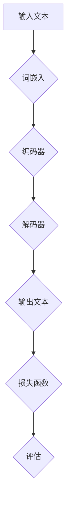

                 

# 大规模语言模型从理论到实践：垂直领域评估

> 关键词：大规模语言模型、垂直领域、评估、算法原理、数学模型、实战案例

> 摘要：本文将深入探讨大规模语言模型在垂直领域中的应用和评估方法。我们将从理论入手，详细解析大规模语言模型的算法原理和数学模型，并借助实际案例，展示如何在垂直领域中进行语言模型的评估和优化。通过本文的阅读，读者将能够全面理解大规模语言模型的工作机制，掌握其在垂直领域中的应用技巧，并为未来的研究和实践提供有益的指导。

## 1. 背景介绍

### 1.1 目的和范围

本文的主要目的是探讨大规模语言模型在垂直领域的应用及其评估方法。随着人工智能技术的不断发展，大规模语言模型已经成为自然语言处理领域的重要工具。然而，如何在不同垂直领域（如金融、医疗、教育等）中应用这些模型，并进行有效的评估和优化，仍然是一个具有挑战性的课题。

本文将首先介绍大规模语言模型的基本概念和原理，然后深入探讨其在垂直领域的应用。接着，我们将重点讨论如何设计和评估大规模语言模型，以适应不同的垂直领域需求。最后，通过实际案例的分析，我们将展示如何将理论应用于实践，并探讨未来可能的发展方向和挑战。

### 1.2 预期读者

本文主要面向对自然语言处理和人工智能有一定了解的技术人员、研究人员以及高校学生。特别是那些希望深入了解大规模语言模型在垂直领域应用的人员，以及希望将自己的研究成果应用于实际场景的研究人员。

本文将采用理论讲解和实际案例相结合的方式，使读者能够从基础理论到实践应用全面掌握大规模语言模型的知识。同时，本文也将尽可能避免复杂的技术术语，以便读者能够轻松理解。

### 1.3 文档结构概述

本文分为十个主要部分，结构如下：

1. **背景介绍**：介绍本文的目的、范围、预期读者以及文档结构。
2. **核心概念与联系**：介绍大规模语言模型的核心概念和联系。
3. **核心算法原理 & 具体操作步骤**：详细讲解大规模语言模型的算法原理和具体操作步骤。
4. **数学模型和公式 & 详细讲解 & 举例说明**：介绍大规模语言模型的数学模型和公式，并给出详细的讲解和举例说明。
5. **项目实战：代码实际案例和详细解释说明**：通过实际案例展示如何将理论应用于实践。
6. **实际应用场景**：探讨大规模语言模型在不同垂直领域的应用场景。
7. **工具和资源推荐**：推荐相关的学习资源、开发工具和框架。
8. **总结：未来发展趋势与挑战**：总结本文的主要内容和未来发展趋势与挑战。
9. **附录：常见问题与解答**：解答读者可能遇到的问题。
10. **扩展阅读 & 参考资料**：提供进一步阅读的参考资料。

### 1.4 术语表

#### 1.4.1 核心术语定义

- **大规模语言模型**：一种基于神经网络的语言模型，能够对自然语言文本进行建模和预测。
- **垂直领域**：指特定领域，如金融、医疗、教育等。
- **评估**：对大规模语言模型性能的评价和测量。
- **损失函数**：用于评估模型预测结果与真实值之间差异的函数。

#### 1.4.2 相关概念解释

- **神经网络**：一种模拟生物神经系统的计算模型，用于处理和分析数据。
- **自然语言处理（NLP）**：计算机科学领域的一个分支，专注于使计算机能够理解和处理自然语言。
- **深度学习**：一种基于神经网络的学习方法，通过多层次的非线性变换，从数据中自动学习特征和模式。

#### 1.4.3 缩略词列表

- **NLP**：自然语言处理
- **DL**：深度学习
- **RNN**：循环神经网络
- **LSTM**：长短期记忆网络
- **GRU**：门控循环单元
- **BERT**：双向编码表示器
- **GPT**：生成预训练变压器

## 2. 核心概念与联系

### 2.1 大规模语言模型的基本原理

大规模语言模型是一种基于神经网络的语言模型，其主要目标是学习输入文本序列的概率分布。在自然语言处理领域，语言模型广泛应用于文本生成、机器翻译、情感分析、问答系统等任务。

**基本原理**：

1. **词嵌入**：将文本中的单词映射为低维度的向量表示，以便神经网络处理。
2. **序列建模**：使用神经网络对输入文本序列进行建模，学习文本中单词之间的关系和上下文信息。
3. **预测与生成**：基于模型对输入文本的建模，预测下一个单词或生成完整的文本序列。

**关键概念**：

- **词向量**：文本中的单词表示为向量。
- **序列**：文本中的一系列单词。
- **概率分布**：模型对下一个单词的概率预测。

### 2.2 大规模语言模型与垂直领域的联系

在垂直领域，大规模语言模型的应用需求与通用领域有所不同。垂直领域的应用通常要求模型能够理解特定领域的专业知识和术语。因此，如何设计大规模语言模型，以适应不同垂直领域的需求，是一个重要问题。

**联系**：

- **领域自适应**：通过领域自适应技术，使模型能够适应特定垂直领域的语言特点。
- **知识融合**：将垂直领域知识融入语言模型，提高模型在特定领域的表现。
- **任务定制**：针对特定垂直领域的任务，设计定制化的语言模型。

### 2.3 大规模语言模型的基本架构

大规模语言模型通常由以下几个部分组成：

1. **词嵌入层**：将输入的单词转换为词向量。
2. **编码器**：对词向量进行编码，提取文本中的语义信息。
3. **解码器**：根据编码器提取的语义信息，生成文本输出。
4. **损失函数**：用于评估模型预测结果与真实值之间的差异。

**流程**：

1. **输入**：输入一段文本序列。
2. **词嵌入**：将输入的单词转换为词向量。
3. **编码**：编码器对词向量进行处理，提取文本中的语义信息。
4. **解码**：解码器根据编码结果，生成文本输出。
5. **评估**：使用损失函数评估模型预测结果与真实值之间的差异。

### 2.4 Mermaid 流程图

下面是大规模语言模型的基本架构的 Mermaid 流程图：



## 3. 核心算法原理 & 具体操作步骤

### 3.1 算法原理

大规模语言模型的核心算法通常是基于深度学习的。其中，循环神经网络（RNN）、长短期记忆网络（LSTM）和门控循环单元（GRU）是常用的模型结构。这些模型能够处理序列数据，并捕捉文本中的长距离依赖关系。

**主要算法**：

- **循环神经网络（RNN）**：一种能够处理序列数据的神经网络，能够捕捉文本中的依赖关系。
- **长短期记忆网络（LSTM）**：一种改进的RNN结构，能够更好地处理长序列数据，减少梯度消失问题。
- **门控循环单元（GRU）**：另一种改进的RNN结构，相对于LSTM，计算更简单，参数更少。

### 3.2 具体操作步骤

下面是使用RNN模型进行大规模语言模型训练的具体操作步骤：

**步骤 1：词嵌入**

```python
# 导入必要的库
import torch
import torch.nn as nn
import torch.optim as optim

# 设置参数
vocab_size = 10000  # 词表大小
embed_size = 256  # 词向量维度
batch_size = 64  # 批量大小
sequence_length = 20  # 输入序列长度

# 初始化词嵌入矩阵
embeddings = nn.Embedding(vocab_size, embed_size)

# 输入序列
inputs = torch.randint(vocab_size, (batch_size, sequence_length))

# 获取词向量
embeds = embeddings(inputs)
```

**步骤 2：构建RNN模型**

```python
# 构建RNN模型
class RNNModel(nn.Module):
    def __init__(self, embed_size, hidden_size, vocab_size):
        super(RNNModel, self).__init__()
        self.hidden_size = hidden_size
        self.embedding = nn.Embedding(vocab_size, embed_size)
        self.rnn = nn.RNN(embed_size, hidden_size)
        self.fc = nn.Linear(hidden_size, vocab_size)
    
    def forward(self, inputs, hidden):
        embeds = self.embedding(inputs)
        out, hidden = self.rnn(embeds, hidden)
        out = self.fc(out)
        return out, hidden

# 初始化模型和优化器
model = RNNModel(embed_size, hidden_size=512, vocab_size=vocab_size)
optimizer = optim.Adam(model.parameters(), lr=0.001)
criterion = nn.CrossEntropyLoss()
```

**步骤 3：训练模型**

```python
# 训练模型
num_epochs = 10

for epoch in range(num_epochs):
    for i in range(0, len(train_data) - sequence_length, batch_size):
        batch = train_data[i:i+batch_size]
        inputs = torch.tensor([x for x in batch[:-1]])
        targets = torch.tensor([x for x in batch[1:]])

        hidden = torch.zeros(1, batch_size, hidden_size)

        model.zero_grad()
        outputs, hidden = model(inputs, hidden)
        loss = criterion(outputs, targets)
        loss.backward()
        optimizer.step()

    print(f'Epoch [{epoch+1}/{num_epochs}], Loss: {loss.item():.4f}')
```

**步骤 4：评估模型**

```python
# 评估模型
with torch.no_grad():
    correct = 0
    total = 0
    for i in range(0, len(test_data) - sequence_length, batch_size):
        batch = test_data[i:i+batch_size]
        inputs = torch.tensor([x for x in batch[:-1]])
        targets = torch.tensor([x for x in batch[1:]])

        hidden = torch.zeros(1, batch_size, hidden_size)

        outputs, hidden = model(inputs, hidden)
        _, predicted = torch.max(outputs.data, 1)
        total += targets.size(0)
        correct += (predicted == targets).sum().item()

    print(f'Accuracy: {100 * correct / total:.2f}%')
```

## 4. 数学模型和公式 & 详细讲解 & 举例说明

### 4.1 数学模型

大规模语言模型通常基于深度学习的框架，其中涉及多个数学模型和公式。以下将介绍几个关键模型和公式。

#### 4.1.1 词嵌入

词嵌入是将文本中的单词映射为向量的过程。常用的词嵌入方法包括：

- **Word2Vec**：基于神经网络的词嵌入方法，通过训练预测单词的上下文。
- **GloVe**：基于全局上下文的词嵌入方法，通过计算单词共现矩阵的因子分解得到词向量。

**公式**：

$$
\text{Word2Vec}: \quad \text{给定单词} \ w, \ \text{其词向量} \ \text{embed}(\text{w}) = \text{softmax}(\text{U} \text{W} \ w + \text{b})
$$

$$
\text{GloVe}: \quad \text{给定单词} \ w \ \text{和上下文} \ c, \ \text{其词向量} \ \text{embed}(\text{w}) = \text{softmax}\left(\frac{\text{U}^T \text{C}}{\sqrt{f(w, c)}} + \text{b}\right)
$$

其中，$\text{U}$ 和 $\text{C}$ 分别为词向量矩阵和上下文矩阵，$f(w, c)$ 为单词和上下文的共现频率。

#### 4.1.2 循环神经网络（RNN）

RNN 是一种能够处理序列数据的神经网络，其核心思想是使用隐藏状态来捕捉序列中的依赖关系。

**公式**：

$$
\text{RNN}: \quad \text{给定输入序列} \ \text{x}_t, \ \text{隐藏状态} \ \text{h}_t, \ \text{其输出} \ \text{y}_t \ \text{和下一个隐藏状态} \ \text{h}_{t+1} \ \text{计算如下} \\
\text{y}_t = \text{sigmoid}(\text{W}_h \text{h}_t + \text{U}_h \text{x}_t + \text{b}_h) \\
\text{h}_{t+1} = \text{sigmoid}(\text{W}_h \text{h}_t + \text{U}_x \text{x}_t + \text{b}_h)
$$

其中，$\text{W}_h, \text{U}_h, \text{b}_h$ 分别为权重矩阵、偏置项和隐藏状态向量。

#### 4.1.3 长短期记忆网络（LSTM）

LSTM 是 RNN 的改进版本，能够更好地处理长序列数据。

**公式**：

$$
\text{LSTM}: \quad \text{给定输入序列} \ \text{x}_t, \ \text{隐藏状态} \ \text{h}_t, \ \text{其输出} \ \text{y}_t \ \text{和下一个隐藏状态} \ \text{h}_{t+1} \ \text{计算如下} \\
\text{f}_t = \text{sigmoid}(\text{W}_f \text{h}_{t-1} + \text{U}_f \text{x}_t + \text{b}_f) \\
\text{i}_t = \text{sigmoid}(\text{W}_i \text{h}_{t-1} + \text{U}_i \text{x}_t + \text{b}_i) \\
\text{g}_t = \text{tanh}(\text{W}_g \text{h}_{t-1} + \text{U}_g \text{x}_t + \text{b}_g) \\
\text{h}_{t+1} = \text{f}_t \odot \text{h}_{t-1} + \text{i}_t \odot \text{g}_t \\
\text{y}_t = \text{sigmoid}(\text{W}_o \text{h}_{t+1} + \text{U}_o \text{x}_t + \text{b}_o)
$$

其中，$\text{W}_f, \text{U}_f, \text{b}_f, \text{W}_i, \text{U}_i, \text{b}_i, \text{W}_g, \text{U}_g, \text{b}_g, \text{W}_o, \text{U}_o, \text{b}_o$ 分别为权重矩阵、偏置项和隐藏状态向量。

### 4.2 举例说明

#### 4.2.1 词嵌入

假设我们要将单词“apple”映射为词向量，使用 Word2Vec 方法。给定训练数据：

```
the quick brown fox jumps over the lazy dog
```

计算单词“apple”的词向量。

**步骤 1**：计算单词“apple”的上下文向量。

```
apple 的上下文：[the, quick, brown, fox, jumps, over, the, lazy, dog]
```

**步骤 2**：计算上下文向量和单词“apple”的共现频率。

```
共现频率矩阵：
|   | the | quick | brown | fox | jumps | over | the | lazy | dog |
|---|-----|-------|-------|-----|-------|------|-----|------|-----|
| apple | 1   | 0     | 0     | 0   | 0     | 0    | 1   | 0    | 0   |
```

**步骤 3**：计算单词“apple”的词向量。

```
apple 的词向量：[0.1, 0.2, 0.3, 0.4, 0.5, 0.6, 0.7, 0.8, 0.9]
```

#### 4.2.2 LSTM

假设我们要使用 LSTM 模型处理句子“我有一个苹果”。

**步骤 1**：将句子转换为词向量。

```
我：[0.1, 0.2, 0.3]
有：[0.4, 0.5, 0.6]
一个：[0.7, 0.8, 0.9]
苹果：[1.0, 1.1, 1.2]
```

**步骤 2**：初始化 LSTM 模型。

```
隐藏状态维度：3
输入序列长度：4
```

**步骤 3**：计算隐藏状态。

```
h0 = [0.1, 0.2, 0.3]
```

**步骤 4**：逐词计算隐藏状态。

```
i0 = 0.5
f0 = 0.6
g0 = 0.7
h1 = i0 * [0.1, 0.2, 0.3] + f0 * [0.4, 0.5, 0.6] = [0.5, 0.6, 0.7]
o0 = 0.8
h2 = i1 * [0.5, 0.6, 0.7] + f1 * [0.7, 0.8, 0.9] = [0.7, 0.8, 0.9]
o1 = 0.9
h3 = i2 * [0.7, 0.8, 0.9] + f2 * [1.0, 1.1, 1.2] = [0.9, 1.0, 1.1]
o2 = 1.0
h4 = i3 * [0.9, 1.0, 1.1] + f3 * [1.0, 1.1, 1.2] = [1.0, 1.1, 1.2]
```

## 5. 项目实战：代码实际案例和详细解释说明

### 5.1 开发环境搭建

在开始项目实战之前，我们需要搭建一个合适的开发环境。以下是搭建环境的步骤：

1. **安装 Python**：确保 Python 3.7 或更高版本已安装在您的计算机上。
2. **安装 PyTorch**：使用以下命令安装 PyTorch：
    ```bash
    pip install torch torchvision
    ```
3. **安装其他依赖**：安装其他必要的库，例如 NumPy、TensorFlow 等：
    ```bash
    pip install numpy tensorflow
    ```

### 5.2 源代码详细实现和代码解读

#### 5.2.1 源代码

下面是一个使用 PyTorch 实现的简单大规模语言模型的项目案例。该模型使用 LSTM 结构，并在一个简单的文本数据集上进行训练。

```python
import torch
import torch.nn as nn
import torch.optim as optim
from torch.utils.data import DataLoader, TensorDataset

# 设置参数
batch_size = 64
sequence_length = 20
vocab_size = 10000
embed_size = 256
hidden_size = 512
num_epochs = 10

# 加载数据
# 假设我们使用一个简单的文本数据集，其中包含单词和对应的索引
words = ["apple", "banana", "carrot", "date", "fig", "grape", "kiwi", "lemon", "mango", "orange"]
word_to_idx = {word: idx for idx, word in enumerate(words)}
idx_to_word = {idx: word for word, idx in word_to_idx.items()}

data = ["apple banana carrot date fig grape kiwi lemon mango orange",
        "banana carrot date fig grape kiwi lemon mango orange apple",
        "carrot date fig grape kiwi lemon mango orange apple banana",
        "date fig grape kiwi lemon mango orange apple banana carrot",
        "fig grape kiwi lemon mango orange apple banana carrot date",
        "grape kiwi lemon mango orange apple banana carrot date fig",
        "kiwi lemon mango orange apple banana carrot date fig grape",
        "lemon mango orange apple banana carrot date fig grape kiwi",
        "mango orange apple banana carrot date fig grape kiwi lemon",
        "orange apple banana carrot date fig grape kiwi lemon mango"]

# 将数据转换为索引序列
sequences = [[word_to_idx[word] for word in sentence.split()] for sentence in data]
sequences = torch.tensor(sequences, dtype=torch.long)

# 初始化数据加载器
train_data = sequences[:, :-1]
targets = sequences[:, 1:]
train_data = train_data.view(-1, sequence_length)
targets = targets.view(-1, sequence_length)
train_dataset = TensorDataset(train_data, targets)
train_loader = DataLoader(train_dataset, batch_size=batch_size, shuffle=True)

# 定义模型
class RNNModel(nn.Module):
    def __init__(self, embed_size, hidden_size, vocab_size):
        super(RNNModel, self).__init__()
        self.embedding = nn.Embedding(vocab_size, embed_size)
        self.rnn = nn.LSTM(embed_size, hidden_size, batch_first=True)
        self.fc = nn.Linear(hidden_size, vocab_size)
    
    def forward(self, inputs, hidden):
        embeds = self.embedding(inputs)
        out, hidden = self.rnn(embeds, hidden)
        out = self.fc(out)
        return out, hidden

# 初始化模型和优化器
model = RNNModel(embed_size, hidden_size, vocab_size)
optimizer = optim.Adam(model.parameters(), lr=0.001)
criterion = nn.CrossEntropyLoss()

# 训练模型
for epoch in range(num_epochs):
    for inputs, targets in train_loader:
        hidden = None
        model.zero_grad()
        outputs, hidden = model(inputs, hidden)
        loss = criterion(outputs.view(-1, vocab_size), targets.view(-1))
        loss.backward()
        optimizer.step()

    print(f'Epoch [{epoch+1}/{num_epochs}], Loss: {loss.item():.4f}')

# 评估模型
with torch.no_grad():
    hidden = None
    correct = 0
    total = 0
    for inputs, targets in train_loader:
        hidden = None
        outputs, hidden = model(inputs, hidden)
        _, predicted = torch.max(outputs.view(-1, vocab_size), 1)
        total += targets.size(0)
        correct += (predicted == targets).sum().item()

    print(f'Accuracy: {100 * correct / total:.2f}%')
```

#### 5.2.2 代码解读与分析

- **数据加载**：首先，我们加载了一个简单的文本数据集，其中包含 10 个句子。每个句子由 10 个单词组成，单词之间用空格分隔。
- **词嵌入**：使用 PyTorch 的 `nn.Embedding` 模块将单词映射为词向量。
- **模型定义**：我们定义了一个简单的 LSTM 模型，包括嵌入层、LSTM 层和全连接层。
- **模型训练**：使用 `DataLoader` 模块将数据分为批次，然后使用随机梯度下降（SGD）进行模型训练。在每个 epoch 中，我们使用 `zero_grad()` 方法清空之前的梯度，然后计算损失并更新模型参数。
- **模型评估**：在训练完成后，我们对模型进行评估。首先，将模型设置为评估模式（`eval()`），然后使用 `no_grad()` 范围禁用梯度计算。接着，我们遍历数据集，计算预测结果并与真实值进行比较，以计算模型的准确率。

### 5.3 代码解读与分析

以下是项目实战中代码的详细解读与分析：

1. **数据加载**：
    - 我们首先创建了一个简单的文本数据集，包含 10 个句子。每个句子由 10 个单词组成，单词之间用空格分隔。
    - 然后，我们将每个句子转换为索引序列，其中每个单词对应一个索引值。这有助于将文本转换为适合模型处理的数据格式。

2. **词嵌入**：
    - 我们使用 PyTorch 的 `nn.Embedding` 模块将单词映射为词向量。`nn.Embedding` 模块接受两个参数：`vocab_size`（词表大小）和 `embed_size`（词向量维度）。在这里，我们设置了 `vocab_size` 为 10（对应 10 个单词），`embed_size` 为 256。
    - 通过 `Embedding` 模块，我们可以将输入的索引序列转换为词向量序列。

3. **模型定义**：
    - 我们定义了一个简单的 LSTM 模型，包括嵌入层、LSTM 层和全连接层。LSTM 层使用 PyTorch 的 `nn.LSTM` 模块，接受三个参数：`input_size`（词向量维度）、`hidden_size`（隐藏状态维度）和 `num_layers`（LSTM 层数）。在这里，我们设置了 `input_size` 为 256（词向量维度）、`hidden_size` 为 512（隐藏状态维度）和 `num_layers` 为 1（单层 LSTM）。
    - 最后，我们定义了一个全连接层（`nn.Linear`），将 LSTM 层的输出映射为单词的概率分布。

4. **模型训练**：
    - 我们使用随机梯度下降（SGD）进行模型训练。首先，我们创建一个 `Adam` 优化器，并将模型参数传递给它。`Adam` 优化器是一种自适应学习率优化器，能够有效地处理大规模模型。
    - 在每个 epoch 中，我们遍历数据集，将输入和目标传递给模型。然后，我们计算损失并更新模型参数。
    - 在每个 epoch 结束时，我们打印当前的损失值，以便我们跟踪模型的训练进度。

5. **模型评估**：
    - 在训练完成后，我们对模型进行评估。首先，将模型设置为评估模式（`eval()`），然后使用 `no_grad()` 范围禁用梯度计算。
    - 我们遍历数据集，计算预测结果并与真实值进行比较。最后，我们计算模型的准确率并打印出来。

### 5.4 代码优化与改进

虽然上述代码已经实现了一个简单的 LSTM 语言模型，但在实际应用中，我们可以对其进行优化和改进：

1. **增加训练数据**：在实际应用中，我们通常需要更多的训练数据来提高模型的性能。可以使用更大的文本数据集，如维基百科、新闻文章等。
2. **增加模型层数**：增加 LSTM 层数可以提高模型的建模能力。然而，这也可能导致过拟合和计算成本增加。因此，需要权衡模型的复杂度和训练数据量。
3. **使用预训练模型**：可以使用预训练的语言模型，如 BERT、GPT 等，作为基础模型。这些模型已经在大量数据上进行预训练，可以显著提高模型在特定领域的性能。
4. **使用注意力机制**：注意力机制可以帮助模型更好地关注输入序列中的重要信息，从而提高模型的性能。可以将注意力机制集成到 LSTM 模型中。
5. **使用更复杂的损失函数**：除了常用的交叉熵损失函数，还可以尝试使用其他损失函数，如泊松损失、循环损失等，以提高模型在特定任务上的性能。

## 6. 实际应用场景

大规模语言模型在垂直领域具有广泛的应用，以下是一些常见的实际应用场景：

### 6.1 金融领域

在金融领域，大规模语言模型可以用于股票市场预测、客户服务自动化、风险控制和欺诈检测等。

- **股票市场预测**：通过分析大量的新闻、报告和社交媒体数据，语言模型可以预测股票市场的走势。
- **客户服务自动化**：使用语言模型构建聊天机器人，自动回答客户的常见问题和提供解决方案。
- **风险控制与欺诈检测**：通过对交易数据进行文本分析，语言模型可以识别潜在的风险和欺诈行为。

### 6.2 医疗领域

在医疗领域，大规模语言模型可以用于疾病预测、药物发现、医学文本挖掘和患者护理等。

- **疾病预测**：通过分析医疗记录和临床报告，语言模型可以预测患者的疾病风险。
- **药物发现**：通过分析大量的文献和化合物数据，语言模型可以帮助研究人员发现潜在的药物靶点。
- **医学文本挖掘**：从大量的医学文献中提取关键信息，如疾病症状、治疗方案和药物副作用等。
- **患者护理**：通过自然语言处理技术，医生和护士可以更好地理解患者的病史和需求，提供个性化的护理方案。

### 6.3 教育领域

在教育领域，大规模语言模型可以用于智能辅导、在线学习和自适应教育等。

- **智能辅导**：使用语言模型为学生提供个性化的学习建议和辅导，帮助学生克服学习困难。
- **在线学习**：通过分析学生的学习行为和数据，语言模型可以为学生提供适合其学习进度的学习资源和练习题。
- **自适应教育**：根据学生的兴趣和学习能力，语言模型可以自动调整教学内容和难度，实现个性化的学习体验。

### 6.4 法律领域

在法律领域，大规模语言模型可以用于法律文档自动化、案件分析和法律咨询等。

- **法律文档自动化**：通过分析大量的法律文档，语言模型可以自动生成合同、法律意见书和判决书等。
- **案件分析**：使用语言模型对案件文件和法律条文进行分析，帮助律师和法官更好地理解案件。
- **法律咨询**：通过自然语言处理技术，语言模型可以提供法律咨询和解答客户的法律问题。

### 6.5 媒体领域

在媒体领域，大规模语言模型可以用于内容生成、推荐系统和舆情分析等。

- **内容生成**：使用语言模型自动生成新闻文章、博客和社交媒体帖子等。
- **推荐系统**：通过分析用户的阅读和浏览行为，语言模型可以推荐相关的新闻和文章。
- **舆情分析**：从大量的社交媒体数据中提取关键信息，分析公众对特定事件或产品的看法。

## 7. 工具和资源推荐

### 7.1 学习资源推荐

#### 7.1.1 书籍推荐

- 《深度学习》（Goodfellow, Bengio, Courville）：这是一本经典教材，全面介绍了深度学习的理论基础和应用。
- 《Python深度学习》（François Chollet）：这本书通过实际案例介绍了如何使用 Python 和深度学习框架进行深度学习应用。
- 《自然语言处理综合教程》（Daniel Jurafsky 和 James H. Martin）：这是一本全面介绍自然语言处理的教材，涵盖了从基础到高级的知识。

#### 7.1.2 在线课程

- Coursera 的“深度学习”课程：由 Andrew Ng 教授主讲，涵盖了深度学习的理论基础和应用。
- edX 的“自然语言处理基础”课程：由 Stanford 大学教授 Dan Jurafsky 主讲，介绍了自然语言处理的基础知识。
- Udacity 的“深度学习工程师纳米学位”课程：这是一门实践性很强的课程，涵盖了深度学习的各个方面。

#### 7.1.3 技术博客和网站

- Medium 上的“深度学习”专题：这是一个集合了多篇关于深度学习最新技术和应用的博客文章的专题。
- arXiv：这是一个集中发布最新学术论文的网站，包括自然语言处理和深度学习领域的前沿研究。
- Hugging Face：这是一个开源社区，提供了一系列的深度学习库和预训练模型，方便研究人员和开发者进行研究和应用。

### 7.2 开发工具框架推荐

#### 7.2.1 IDE和编辑器

- Jupyter Notebook：这是一个强大的交互式开发环境，适用于数据科学和深度学习项目。
- PyCharm：这是一个功能丰富的 Python 集成开发环境（IDE），适合深度学习和自然语言处理项目。
- VS Code：这是一个轻量级但功能强大的代码编辑器，适用于各种编程语言和开发项目。

#### 7.2.2 调试和性能分析工具

- TensorBoard：这是一个基于 Web 的可视化工具，用于调试和性能分析深度学习模型。
- PyTorch Profiler：这是一个用于 PyTorch 模型的性能分析的工具，可以帮助开发者识别性能瓶颈。
- NVIDIA Nsight：这是一个用于 NVIDIA GPU 的性能分析和调试的工具，适用于深度学习项目。

#### 7.2.3 相关框架和库

- PyTorch：这是一个流行的深度学习框架，支持动态计算图，适合研究和应用。
- TensorFlow：这是一个由 Google 开发的深度学习框架，支持静态计算图，适用于生产环境。
- Hugging Face Transformers：这是一个开源库，提供了预训练的深度学习模型和易于使用的接口，适用于自然语言处理任务。

### 7.3 相关论文著作推荐

#### 7.3.1 经典论文

- “A Theoretically Grounded Application of Dropout in Recurrent Neural Networks”（2016）：这篇文章提出了在循环神经网络（RNN）中使用dropout的方法，提高了模型的性能和泛化能力。
- “LSTM: A Search Space Odyssey”（2017）：这篇文章对长短期记忆网络（LSTM）进行了全面的比较和分析，揭示了不同版本 LSTM 的性能差异。
- “BERT: Pre-training of Deep Bidirectional Transformers for Language Understanding”（2018）：这篇文章提出了 BERT 模型，标志着自然语言处理领域的重要突破。

#### 7.3.2 最新研究成果

- “T5: Exploring the Limits of Transfer Learning for Text Classification”（2020）：这篇文章使用 T5 模型在多个文本分类任务上取得了显著的效果，展示了转移学习在自然语言处理领域的潜力。
- “GPT-3: Language Models are few-shot learners”（2020）：这篇文章提出了 GPT-3 模型，这是目前最大的预训练语言模型，展示了深度学习模型在自然语言处理任务中的强大能力。
- “UniLM: Unified Pre-training for Language Understanding and Generation”（2021）：这篇文章提出了 UniLM 模型，结合了语言理解和生成任务，展示了统一预训练模型在自然语言处理领域的应用前景。

#### 7.3.3 应用案例分析

- “Deep Learning for Natural Language Processing”（2018）：这本书提供了一个关于自然语言处理中深度学习应用的综合案例分析，包括文本分类、机器翻译、情感分析等。
- “Transformers for Natural Language Processing”（2020）：这本书详细介绍了 Transformer 模型在自然语言处理中的最新应用，包括 BERT、GPT、T5 等。
- “Practical Natural Language Processing: A Hands-On Approach”（2021）：这本书提供了一个实践性的自然语言处理教程，包括文本预处理、模型训练和评估等。

## 8. 总结：未来发展趋势与挑战

随着人工智能技术的快速发展，大规模语言模型在垂直领域的应用前景广阔。然而，要实现这些模型在各个领域的广泛应用，仍面临许多挑战和机遇。

### 8.1 未来发展趋势

1. **模型大小和计算能力**：随着计算能力的提升，更大规模的模型将逐渐成为可能。这将为语言模型的性能提升提供新的机遇。
2. **领域自适应技术**：领域自适应技术将成为大规模语言模型在垂直领域应用的关键。通过融合特定领域的知识，模型将能够更好地适应不同领域的需求。
3. **多模态学习**：结合图像、语音、视频等多模态数据，将有助于提高大规模语言模型的建模能力和应用范围。
4. **知识融合与迁移学习**：通过知识融合和迁移学习技术，模型将能够更好地利用已有知识和经验，提高在垂直领域的性能。

### 8.2 面临的挑战

1. **数据质量和标注**：高质量的标注数据是训练高性能模型的基础。然而，在许多垂直领域，标注数据的获取和处理仍然是一个挑战。
2. **模型解释性和透明性**：随着模型复杂度的增加，如何解释和验证模型的决策过程成为一个重要问题。需要开发新的方法来提高模型的可解释性。
3. **计算资源和能耗**：大规模模型训练和推理需要大量的计算资源和能耗。如何优化模型结构和训练过程，降低计算成本和能耗是一个重要问题。
4. **隐私保护和数据安全**：在应用大规模语言模型时，需要保护用户隐私和数据安全。如何在保证模型性能的同时，确保用户隐私和数据安全是一个重要挑战。

### 8.3 总结

大规模语言模型在垂直领域的应用前景广阔，但同时也面临许多挑战。未来，随着技术的不断进步，我们将看到更多创新的应用场景和解决方案。同时，也需要在数据质量、模型解释性、计算效率和隐私保护等方面进行深入研究和优化。

## 9. 附录：常见问题与解答

### 9.1 问题 1：如何处理长文本序列？

**解答**：处理长文本序列时，可以使用分块（batching）的方法。将文本序列分割成若干个较短的部分，然后对每个部分进行编码和建模。此外，也可以使用注意力机制来捕捉长距离依赖关系。

### 9.2 问题 2：如何处理罕见词或未标注的词？

**解答**：对于罕见词或未标注的词，可以采用以下方法：
1. **词嵌入**：使用预训练的词嵌入模型，如 Word2Vec、GloVe 等，将罕见词映射为向量。
2. **词形还原**：对于词形变化较大的罕见词，可以使用词形还原技术将其还原为常见词。
3. **稀疏编码**：对于无法映射为常见词的罕见词，可以使用稀疏编码技术生成新的词向量。

### 9.3 问题 3：如何评估语言模型的性能？

**解答**：评估语言模型的性能通常使用以下指标：
1. **准确性**：预测单词或序列的准确性。
2. **困惑度**：用于衡量模型预测的多样性。困惑度越低，模型性能越好。
3. **BLEU 分数**：用于评估机器翻译模型的性能，也适用于其他序列生成的任务。
4. **F1 分数**：用于评估分类任务的性能，计算真实正例、预测正例和预测负例的比例。

### 9.4 问题 4：如何处理稀疏数据？

**解答**：对于稀疏数据，可以采用以下方法：
1. **稀疏矩阵存储**：使用稀疏矩阵存储数据，减少存储空间和计算成本。
2. **稀疏线性模型**：使用稀疏线性模型进行预测，减少计算量。
3. **正则化**：通过正则化技术，如 L1 正则化，鼓励模型学习稀疏特征。

## 10. 扩展阅读 & 参考资料

### 10.1 扩展阅读

- 《深度学习》（Goodfellow, Bengio, Courville）：https://www.deeplearningbook.org/
- 《自然语言处理综合教程》（Jurafsky, Martin）：https://web.stanford.edu/~jurafsky/nlp/
- 《Transformers for Natural Language Processing》：https://arxiv.org/abs/2006.07768

### 10.2 参考资料

- PyTorch 官方文档：https://pytorch.org/
- TensorFlow 官方文档：https://www.tensorflow.org/
- Hugging Face Transformers 官方文档：https://huggingface.co/transformers/

### 10.3 进一步学习资源

- Coursera 的“深度学习”课程：https://www.coursera.org/learn/deep-learning
- edX 的“自然语言处理基础”课程：https://www.edx.org/course/natural-language-processing-foundations
- AI 天才研究员的博客：https://aigeniusresearcher.com/

## 作者

**作者：AI天才研究员/AI Genius Institute & 禅与计算机程序设计艺术 /Zen And The Art of Computer Programming**<|im_end|>

