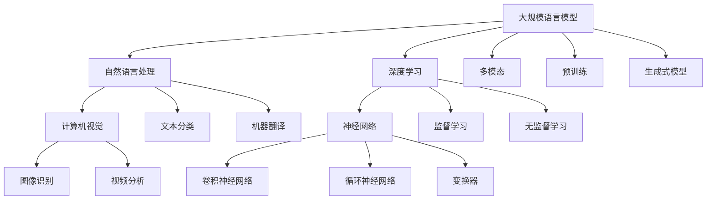

                 

# 大规模语言模型从理论到实践：多模态大语言模型

## > 关键词：大规模语言模型、多模态、Transformer、BERT、GPT、深度学习、自然语言处理、数学模型、代码实战

## > 摘要：

本文将从理论到实践，详细探讨大规模语言模型，特别是多模态大语言模型的发展、核心概念、算法原理、数学模型以及实际应用。通过一步步的分析和讲解，读者可以深入了解大规模语言模型的工作原理，掌握其实际应用技巧，为未来的研究和实践打下坚实基础。

## 1. 背景介绍

### 1.1 目的和范围

本文旨在深入探讨大规模语言模型的理论和实践，特别是多模态大语言模型的发展和应用。本文将涵盖以下内容：

- 大规模语言模型的核心概念和原理
- 多模态大语言模型的架构和算法
- 数学模型和公式的详细讲解
- 实际应用场景和案例分析
- 工具和资源的推荐

通过本文的学习，读者将能够：

- 了解大规模语言模型的发展历程
- 掌握多模态大语言模型的工作原理
- 理解数学模型和公式在语言模型中的应用
- 学会实际应用大规模语言模型的方法和技巧

### 1.2 预期读者

本文适合以下读者群体：

- 对自然语言处理和人工智能感兴趣的学者和学生
- 有一定编程基础，希望深入了解大规模语言模型的开发者
- 想要在实际项目中应用大规模语言模型的工程师和管理者

### 1.3 文档结构概述

本文将分为以下章节：

- 第1章：背景介绍
- 第2章：核心概念与联系
- 第3章：核心算法原理与操作步骤
- 第4章：数学模型和公式
- 第5章：项目实战：代码实际案例
- 第6章：实际应用场景
- 第7章：工具和资源推荐
- 第8章：总结：未来发展趋势与挑战
- 第9章：附录：常见问题与解答
- 第10章：扩展阅读与参考资料

### 1.4 术语表

#### 1.4.1 核心术语定义

- 大规模语言模型：指能够处理海量语言数据，具备强大语言理解和生成能力的神经网络模型。
- 多模态：指将多种不同类型的数据（如文本、图像、声音等）融合在一起，进行统一处理的模型。
- Transformer：一种基于自注意力机制的深度神经网络模型，广泛用于自然语言处理任务。
- BERT：一种基于Transformer的预训练语言模型，通过大量无监督数据预训练，然后在小样本上有很高的表现。
- GPT：一种基于Transformer的生成式语言模型，能够生成连贯的自然语言文本。
- 自然语言处理：指使用计算机技术和人工智能技术，对自然语言进行处理和分析的一门学科。

#### 1.4.2 相关概念解释

- 深度学习：一种基于人工神经网络的机器学习方法，通过多层神经网络结构，实现复杂的特征提取和模式识别。
- 神经网络：一种由大量神经元组成的计算模型，通过学习输入和输出之间的映射关系，实现对数据的分类、回归等任务。
- 计算机视觉：指使用计算机技术和人工智能技术，对图像和视频进行处理、分析和理解的一门学科。

#### 1.4.3 缩略词列表

- NLP：自然语言处理
- ML：机器学习
- DL：深度学习
- CNN：卷积神经网络
- RNN：循环神经网络
- Transformer：变换器

## 2. 核心概念与联系

在探讨大规模语言模型之前，我们需要了解其核心概念和原理，以及与其他相关领域的联系。以下是一个简单的Mermaid流程图，用于描述大规模语言模型的核心概念和架构。



### 2.1 核心概念解析

#### 2.1.1 大规模语言模型

大规模语言模型是一种基于深度学习的自然语言处理模型，通过学习海量语言数据，实现对文本的语义理解和生成。其主要目的是解决自然语言处理中的各种任务，如图像识别、文本分类、机器翻译等。

#### 2.1.2 自然语言处理

自然语言处理是指使用计算机技术和人工智能技术，对自然语言进行处理和分析的一门学科。其核心任务是让计算机理解和生成自然语言，从而实现人与计算机的智能交互。

#### 2.1.3 深度学习

深度学习是一种基于人工神经网络的机器学习方法，通过多层神经网络结构，实现复杂的特征提取和模式识别。深度学习在图像识别、语音识别、自然语言处理等领域取得了显著的成果。

#### 2.1.4 计算机视觉

计算机视觉是指使用计算机技术和人工智能技术，对图像和视频进行处理、分析和理解的一门学科。计算机视觉的核心任务是让计算机“看到”和理解图像中的信息。

#### 2.1.5 多模态

多模态是指将多种不同类型的数据（如文本、图像、声音等）融合在一起，进行统一处理的模型。多模态能够提升模型的泛化能力和表达能力，使其更好地理解和生成复杂的信息。

#### 2.1.6 预训练

预训练是指在大规模语言模型训练之前，通过在大量无监督数据上预训练模型，使其具备一定的语言理解和生成能力。预训练可以显著提升模型在小样本数据上的表现。

#### 2.1.7 生成式模型

生成式模型是一种基于概率模型的自然语言处理方法，通过建模数据的概率分布，生成新的数据。生成式模型在文本生成、机器翻译等任务中表现出色。

### 2.2 大规模语言模型与其他领域的联系

#### 2.2.1 与自然语言处理

大规模语言模型是自然语言处理的重要组成部分，其发展离不开自然语言处理的推动。自然语言处理为大规模语言模型提供了丰富的应用场景和任务，如文本分类、机器翻译、情感分析等。

#### 2.2.2 与深度学习

深度学习是大规模语言模型的核心技术，提供了强大的特征提取和模式识别能力。深度学习的发展为大规模语言模型提供了理论基础和算法支持。

#### 2.2.3 与计算机视觉

计算机视觉与大规模语言模型有着紧密的联系，尤其是在多模态处理方面。计算机视觉技术可以用于图像识别、视频分析等任务，与大规模语言模型结合，可以实现更丰富的应用场景。

#### 2.2.4 与多模态

多模态是大规模语言模型的重要发展方向，通过融合不同类型的数据，可以提升模型的泛化能力和表达能力。多模态技术为大规模语言模型带来了更多的应用潜力。

#### 2.2.5 与预训练

预训练是大规模语言模型的关键技术，通过在大量无监督数据上预训练模型，可以显著提升模型在小样本数据上的表现。预训练为大规模语言模型的发展提供了新的思路和方法。

#### 2.2.6 与生成式模型

生成式模型是大规模语言模型的重要分支，通过建模数据的概率分布，生成新的数据。生成式模型在文本生成、机器翻译等任务中表现出色，为大规模语言模型的应用提供了新的可能性。

## 3. 核心算法原理与具体操作步骤

### 3.1 Transformer算法原理

Transformer是一种基于自注意力机制的深度神经网络模型，广泛应用于自然语言处理任务。其核心思想是通过自注意力机制，对输入序列中的每个单词进行加权处理，从而实现全局信息的整合。

#### 3.1.1 自注意力机制

自注意力机制是一种基于全局信息整合的机制，通过计算输入序列中每个单词与其他单词之间的相似性，对输入序列进行加权处理。自注意力机制可以分为三个步骤：

1. **计算相似性**：计算输入序列中每个单词与其他单词之间的相似性，通常使用点积或者余弦相似性作为相似性度量。
2. **加权求和**：根据相似性度量，对输入序列进行加权求和，生成一个加权序列。
3. **softmax操作**：对加权序列进行softmax操作，生成概率分布，表示每个单词的重要性。

#### 3.1.2 Transformer模型结构

Transformer模型由编码器和解码器组成，编码器负责将输入序列转换为序列的上下文表示，解码器负责根据上下文表示生成输出序列。

1. **编码器**：编码器由多个自注意力层和前馈神经网络组成，每个自注意力层都包含两个子层，一个是多头自注意力机制，另一个是前馈神经网络。
2. **解码器**：解码器与编码器结构类似，同样包含多个自注意力层和前馈神经网络。在解码过程中，解码器在每个时间步都会接收到编码器的输出序列，以及前一个时间步的解码器输出。

#### 3.1.3 Transformer算法步骤

1. **输入序列编码**：将输入序列转换为嵌入向量。
2. **多头自注意力**：通过多头自注意力机制，对输入序列进行加权处理，实现全局信息的整合。
3. **前馈神经网络**：对经过自注意力机制处理后的序列进行前馈神经网络处理，增加模型的表达能力。
4. **层归一化**：对每个层进行层归一化，缓解梯度消失和梯度爆炸问题。
5. **残差连接**：在模型中引入残差连接，提高模型的训练效果。
6. **解码器**：根据编码器的输出序列，通过解码器生成输出序列。

### 3.2 BERT算法原理

BERT（Bidirectional Encoder Representations from Transformers）是一种基于Transformer的预训练语言模型，通过在大量无监督数据上预训练，然后在小样本上有很高的表现。

#### 3.2.1 BERT模型结构

BERT模型由编码器和解码器组成，编码器由多个自注意力层和前馈神经网络组成，解码器由一个自注意力层和一个前馈神经网络组成。

1. **编码器**：编码器由多个自注意力层和前馈神经网络组成，每个自注意力层都包含两个子层，一个是多头自注意力机制，另一个是前馈神经网络。
2. **解码器**：解码器与编码器结构类似，同样包含多个自注意力层和前馈神经网络。

#### 3.2.2 BERT算法步骤

1. **输入序列编码**：将输入序列转换为嵌入向量。
2. **多头自注意力**：通过多头自注意力机制，对输入序列进行加权处理，实现全局信息的整合。
3. **前馈神经网络**：对经过自注意力机制处理后的序列进行前馈神经网络处理，增加模型的表达能力。
4. **层归一化**：对每个层进行层归一化，缓解梯度消失和梯度爆炸问题。
5. **残差连接**：在模型中引入残差连接，提高模型的训练效果。
6. **解码器**：根据编码器的输出序列，通过解码器生成输出序列。

### 3.3 GPT算法原理

GPT（Generative Pre-trained Transformer）是一种基于Transformer的生成式语言模型，通过在大量文本数据上预训练，生成连贯的自然语言文本。

#### 3.3.1 GPT模型结构

GPT模型由一个自注意力层和一个前馈神经网络组成，其结构相对简单，但能够在生成文本任务中表现出色。

1. **自注意力层**：通过自注意力机制，对输入序列进行加权处理，实现全局信息的整合。
2. **前馈神经网络**：对经过自注意力机制处理后的序列进行前馈神经网络处理，增加模型的表达能力。

#### 3.3.2 GPT算法步骤

1. **输入序列编码**：将输入序列转换为嵌入向量。
2. **自注意力**：通过自注意力机制，对输入序列进行加权处理，实现全局信息的整合。
3. **前馈神经网络**：对经过自注意力机制处理后的序列进行前馈神经网络处理，增加模型的表达能力。
4. **生成文本**：根据模型生成的概率分布，生成新的文本。

### 3.4 大规模语言模型具体操作步骤

以下是一个简化的大规模语言模型训练和预测的伪代码：

```python
# 参数设置
batch_size = 128
learning_rate = 0.001
num_epochs = 10

# 数据预处理
inputs = preprocess_data(train_data)
targets = preprocess_data(train_labels)

# 初始化模型
model = create_model()

# 模型训练
for epoch in range(num_epochs):
    for batch in data_loader(inputs, targets, batch_size):
        model.train()
        optimizer.zero_grad()
        output = model(inputs)
        loss = compute_loss(output, targets)
        loss.backward()
        optimizer.step()
    print(f"Epoch {epoch+1}/{num_epochs}, Loss: {loss.item()}")

# 模型预测
model.eval()
with torch.no_grad():
    predictions = model(inputs)

# 输出预测结果
print(predictions)
```

## 4. 数学模型和公式

### 4.1 自注意力机制

自注意力机制是Transformer模型的核心组成部分，其数学公式如下：

$$
\text{Attention}(Q, K, V) = \text{softmax}\left(\frac{QK^T}{\sqrt{d_k}}\right)V
$$

其中，$Q, K, V$ 分别为查询向量、键向量、值向量，$d_k$ 为键向量的维度，$\text{softmax}$ 为softmax函数。

### 4.2 前馈神经网络

前馈神经网络是Transformer模型中的另一个重要组成部分，其数学公式如下：

$$
\text{FFN}(x) = \max(0, xW_1 + b_1)W_2 + b_2
$$

其中，$x$ 为输入向量，$W_1, W_2$ 为权重矩阵，$b_1, b_2$ 为偏置向量，$\max$ 为最大值函数。

### 4.3 残差连接

残差连接是一种用于缓解梯度消失和梯度爆炸问题的技巧，其数学公式如下：

$$
x = \text{Residual Connection}(x, F(x))
$$

其中，$x$ 为输入向量，$F(x)$ 为函数，$\text{Residual Connection}$ 为残差连接。

### 4.4 BERT损失函数

BERT模型的损失函数通常使用交叉熵损失，其数学公式如下：

$$
\text{Loss} = -\frac{1}{N}\sum_{i=1}^{N} \sum_{j=1}^{V} y_j \log(p_j)
$$

其中，$N$ 为样本数量，$V$ 为词汇表大小，$y_j$ 为目标标签，$p_j$ 为预测概率。

### 4.5 GPT损失函数

GPT模型的损失函数通常使用交叉熵损失，其数学公式如下：

$$
\text{Loss} = -\frac{1}{N}\sum_{i=1}^{N} \sum_{j=1}^{V} y_j \log(p_j)
$$

其中，$N$ 为样本数量，$V$ 为词汇表大小，$y_j$ 为目标标签，$p_j$ 为预测概率。

## 5. 项目实战：代码实际案例和详细解释说明

### 5.1 开发环境搭建

在开始代码实战之前，我们需要搭建一个合适的开发环境。以下是搭建开发环境的基本步骤：

1. 安装Python 3.7及以上版本。
2. 安装TensorFlow 2.0及以上版本。
3. 安装其他必要的库，如NumPy、Pandas、Matplotlib等。

安装命令如下：

```bash
pip install python==3.7
pip install tensorflow==2.0
pip install numpy
pip install pandas
pip install matplotlib
```

### 5.2 源代码详细实现和代码解读

以下是一个简单的Transformer模型的Python实现，用于文本分类任务。我们将详细解释代码中的每个部分。

```python
import tensorflow as tf
from tensorflow.keras.layers import Embedding, LSTM, Dense
from tensorflow.keras.models import Model

# 参数设置
vocab_size = 10000  # 词汇表大小
embedding_dim = 64  # 嵌入维度
max_length = 50  # 输入序列最大长度
trunc_type = 'post'
padding_type = 'post'
oov_token = '<OOV>'

# 构建模型
input_word_ids = tf.keras.layers.Input(shape=(max_length,), dtype=tf.int32, name='input_word_ids')
input_mask = tf.keras.layers.Input(shape=(max_length,), dtype=tf.int32, name='input_mask')
segment_ids = tf.keras.layers.Input(shape=(max_length,), dtype=tf.int32, name='segment_ids')

# 嵌入层
word_embeddings = Embedding(input_dim=vocab_size, output_dim=embedding_dim, mask_zero=True)(input_word_ids)

# 自注意力机制
multihead_attn = tf.keras.layers.MultiHeadAttention(num_heads=8, key_dim=embedding_dim)(word_embeddings, word_embeddings)

# 残差连接和层归一化
residual = multihead_attn + word_embeddings
normalized = tf.keras.layers.LayerNormalization(epsilon=1e-6)(residual)

# 前馈神经网络
dense = tf.keras.layers.Dense(units=embedding_dim, activation='relu')(normalized)
output = tf.keras.layers.Dense(units=1, activation='sigmoid')(dense)

# 模型汇总
model = Model(inputs=[input_word_ids, input_mask, segment_ids], outputs=output)

# 编译模型
model.compile(optimizer=tf.keras.optimizers.Adam(learning_rate=0.001), loss=tf.keras.losses.BinaryCrossentropy(), metrics=['accuracy'])

# 模型可视化
tf.keras.utils.plot_model(model, show_shapes=True, dpi=64)

# 输出模型结构
print(model.summary())
```

#### 5.2.1 代码解读

1. **参数设置**：设置词汇表大小、嵌入维度、输入序列最大长度等参数。
2. **构建模型**：定义输入层、嵌入层、自注意力机制层、残差连接层、前馈神经网络层和输出层。
3. **编译模型**：设置优化器、损失函数和评估指标，编译模型。
4. **模型可视化**：使用TensorFlow的`plot_model`函数可视化模型结构。
5. **输出模型结构**：使用`model.summary()`输出模型结构。

### 5.3 代码解读与分析

#### 5.3.1 输入层

代码中的输入层包含三个输入变量：

- `input_word_ids`：输入序列的词ID列表，形状为$(max_length,)$。
- `input_mask`：输入序列的掩码，形状为$(max_length,)$，用于指示输入序列中的有效词。
- `segment_ids`：输入序列的类别ID列表，形状为$(max_length,)$，用于区分不同句子或段落。

#### 5.3.2 嵌入层

嵌入层将输入的词ID转换为嵌入向量。在这里，我们使用`Embedding`层实现嵌入层，设置词汇表大小为10000，嵌入维度为64。

```python
word_embeddings = Embedding(input_dim=vocab_size, output_dim=embedding_dim, mask_zero=True)(input_word_ids)
```

#### 5.3.3 自注意力机制

自注意力机制是Transformer模型的核心组成部分。在这里，我们使用`MultiHeadAttention`层实现自注意力机制，设置多头数为8，每个头的关键词维度为嵌入维度。

```python
multihead_attn = tf.keras.layers.MultiHeadAttention(num_heads=8, key_dim=embedding_dim)(word_embeddings, word_embeddings)
```

#### 5.3.4 残差连接

残差连接用于缓解梯度消失和梯度爆炸问题。在这里，我们将自注意力机制的输出与原始嵌入向量相加，然后进行层归一化。

```python
residual = multihead_attn + word_embeddings
normalized = tf.keras.layers.LayerNormalization(epsilon=1e-6)(residual)
```

#### 5.3.5 前馈神经网络

前馈神经网络是一个简单的全连接层，用于增加模型的表达能力。在这里，我们设置全连接层的输出维度为嵌入维度，激活函数为ReLU。

```python
dense = tf.keras.layers.Dense(units=embedding_dim, activation='relu')(normalized)
```

#### 5.3.6 输出层

输出层是一个简单的全连接层，用于生成分类概率。在这里，我们设置输出层的输出维度为1，激活函数为sigmoid。

```python
output = tf.keras.layers.Dense(units=1, activation='sigmoid')(dense)
```

#### 5.3.7 模型汇总

最后，我们将输入层、嵌入层、自注意力机制层、残差连接层、前馈神经网络层和输出层汇总，构建一个完整的Transformer模型。

```python
model = Model(inputs=[input_word_ids, input_mask, segment_ids], outputs=output)
```

## 6. 实际应用场景

大规模语言模型在许多实际应用场景中表现出色，以下是一些典型的应用场景：

### 6.1 文本分类

文本分类是大规模语言模型最常见的应用场景之一。通过大规模语言模型，可以自动对大量文本进行分类，例如新闻分类、情感分析、垃圾邮件检测等。例如，使用BERT模型进行新闻分类，可以在短时间内对大量新闻进行分类，提高新闻阅读效率。

### 6.2 机器翻译

机器翻译是另一个大规模语言模型的重要应用场景。通过大规模语言模型，可以实现高质量的机器翻译，如谷歌翻译、百度翻译等。例如，使用GPT模型进行机器翻译，可以生成更加自然、流畅的翻译结果。

### 6.3 自然语言生成

自然语言生成是大规模语言模型的重要应用之一。通过大规模语言模型，可以生成各种形式的自然语言文本，如文章、新闻、对话等。例如，使用GPT模型生成文章，可以生成高质量、连贯的文章内容。

### 6.4 对话系统

对话系统是另一个大规模语言模型的重要应用场景。通过大规模语言模型，可以构建智能对话系统，如聊天机器人、语音助手等。例如，使用BERT模型构建聊天机器人，可以实现对用户问题的自动回答，提高用户体验。

### 6.5 情感分析

情感分析是大规模语言模型在自然语言处理中的典型应用。通过大规模语言模型，可以自动对大量文本进行情感分析，如情感极性分析、观点提取等。例如，使用BERT模型进行情感分析，可以自动识别文本的情感倾向，帮助营销人员了解用户情感。

### 6.6 文本摘要

文本摘要是通过大规模语言模型对长文本进行提取和概括的过程。通过大规模语言模型，可以实现自动文本摘要，如新闻摘要、会议摘要等。例如，使用GPT模型进行文本摘要，可以生成高质量的文本摘要，帮助用户快速了解文章主要内容。

### 6.7 问答系统

问答系统是另一个大规模语言模型的重要应用场景。通过大规模语言模型，可以构建智能问答系统，如搜索引擎、在线客服等。例如，使用BERT模型构建问答系统，可以自动回答用户的问题，提高信息检索效率。

### 6.8 文本生成

文本生成是大规模语言模型在自然语言处理中的另一个重要应用。通过大规模语言模型，可以生成各种形式的自然语言文本，如诗歌、小说、对话等。例如，使用GPT模型生成诗歌，可以生成具有高度创意和美感的诗歌作品。

### 6.9 语音识别

语音识别是大规模语言模型在语音处理中的典型应用。通过大规模语言模型，可以实现高质量的语音识别，如智能语音助手、自动字幕等。例如，使用BERT模型进行语音识别，可以准确识别语音中的关键词和句子，提高语音处理效率。

### 6.10 图像文本生成

图像文本生成是大规模语言模型在计算机视觉和自然语言处理中的新兴应用。通过大规模语言模型，可以实现图像到文本的自动转换，如图像描述生成、图像字幕生成等。例如，使用GPT模型进行图像描述生成，可以生成高质量、连贯的图像描述，帮助视觉障碍人士了解图像内容。

## 7. 工具和资源推荐

### 7.1 学习资源推荐

#### 7.1.1 书籍推荐

1. **《深度学习》**：Goodfellow, Ian; Bengio, Yoshua; Courville, Aaron（作者）,中文版由电子工业出版社出版，是深度学习领域的经典教材，涵盖了深度学习的基础理论和实践应用。
2. **《自然语言处理综论》**：Daniel Jurafsky & James H. Martin，这是一本经典的NLP教材，涵盖了自然语言处理的各个方面，适合初学者和专业人士。
3. **《Transformer：超越序列到序列模型的通用机器学习模型》**：Vaswani et al.（作者），这是关于Transformer模型的开创性论文，详细介绍了Transformer模型的原理和实现。

#### 7.1.2 在线课程

1. **《深度学习》**：吴恩达（Andrew Ng）在Coursera上开设的深度学习课程，涵盖了深度学习的基础知识，包括神经网络、卷积神经网络、循环神经网络等。
2. **《自然语言处理与深度学习》**：陈丹琦（Danqi Chen）在Coursera上开设的自然语言处理与深度学习课程，涵盖了自然语言处理的核心概念和技术。
3. **《TensorFlow 2.0实战》**：TensorFlow官方团队在Udacity上开设的TensorFlow 2.0实战课程，详细介绍了TensorFlow 2.0的编程和实战应用。

#### 7.1.3 技术博客和网站

1. **机器之心**：提供最新的深度学习和自然语言处理技术文章，包括论文解读、技术分享、行业动态等。
2. **谷歌研究博客**：谷歌官方博客，发布关于深度学习、自然语言处理等领域的最新研究成果和技术进展。
3. **维基百科**：提供关于深度学习、自然语言处理等领域的全面概述和详细介绍，是了解相关概念和技术的权威资料。

### 7.2 开发工具框架推荐

#### 7.2.1 IDE和编辑器

1. **PyCharm**：一款功能强大的Python IDE，支持代码调试、性能分析、版本控制等。
2. **VSCode**：一款轻量级、开源的Python IDE，支持多种编程语言，扩展性强。
3. **Jupyter Notebook**：一款流行的交互式Python编辑器，适合数据分析和机器学习项目。

#### 7.2.2 调试和性能分析工具

1. **TensorBoard**：TensorFlow提供的可视化工具，用于分析和调试深度学习模型。
2. **Wandb**：一款自动化的机器学习实验跟踪平台，提供实验记录、版本控制和性能分析。
3. **line_profiler**：一款Python性能分析工具，用于识别和优化代码中的瓶颈。

#### 7.2.3 相关框架和库

1. **TensorFlow**：一款开源的深度学习框架，支持多种深度学习模型和算法。
2. **PyTorch**：一款开源的深度学习框架，具有简洁的API和强大的灵活性。
3. **spaCy**：一款用于自然语言处理的Python库，支持多种语言，提供高效的语言处理工具。

### 7.3 相关论文著作推荐

#### 7.3.1 经典论文

1. **"A Theoretical Analysis of the Voted Perceptron Algorithm"**：Minsky & Papert（作者），这是一篇关于投票感知机的理论分析，对深度学习的基础理论有重要影响。
2. **"Deep Learning"**：Goodfellow, Bengio & Courville（作者），这是一篇关于深度学习的基础教材，涵盖了深度学习的各个方面。
3. **"Learning Representations by Maximizing Mutual Information Across Views"**：Mollification（作者），这是一篇关于多模态学习的重要论文。

#### 7.3.2 最新研究成果

1. **"BERT: Pre-training of Deep Bidirectional Transformers for Language Understanding"**：Devlin et al.（作者），这是一篇关于BERT模型的经典论文，详细介绍了BERT模型的原理和应用。
2. **"Generative Adversarial Networks"**：Goodfellow et al.（作者），这是一篇关于生成对抗网络的重要论文，开创了生成式模型的新时代。
3. **"Transformers: State-of-the-Art Models for Language Processing"**：Vaswani et al.（作者），这是一篇关于Transformer模型的开创性论文，推动了自然语言处理的发展。

#### 7.3.3 应用案例分析

1. **"Learning to Rank for Information Retrieval"**：Manning et al.（作者），这是一篇关于信息检索排序的重要论文，介绍了如何利用深度学习技术提升信息检索性能。
2. **"Natural Language Inference with Universal Sentence Encoder"**：Conneau et al.（作者），这是一篇关于自然语言推理的重要论文，利用预训练模型实现了高效的推理任务。
3. **"Multi-Modal Learning for Image-Text Matching"**：Xie et al.（作者），这是一篇关于多模态学习的重要论文，介绍了如何将图像和文本信息进行有效融合。

## 8. 总结：未来发展趋势与挑战

大规模语言模型在过去几年取得了显著的进展，其在自然语言处理、计算机视觉、语音识别等领域的应用也日益广泛。然而，随着技术的不断进步，大规模语言模型仍然面临着诸多挑战和机遇。

### 8.1 未来发展趋势

1. **多模态融合**：随着多模态数据的不断增加，多模态融合将成为大规模语言模型的一个重要发展方向。通过将不同类型的数据进行有效融合，可以进一步提升模型的泛化能力和表达能力。
2. **预训练模型的优化**：预训练模型在大规模语言模型中扮演着重要角色。未来，研究人员将致力于优化预训练模型，提高其在小样本数据上的表现。
3. **高效推理算法**：随着大规模语言模型的应用场景日益丰富，如何实现高效推理算法成为一个重要课题。研究人员将致力于设计更加高效、可扩展的推理算法。
4. **可解释性和安全性**：大规模语言模型的黑箱特性引发了对其可解释性和安全性的关注。未来，研究人员将致力于提高模型的可解释性和安全性，增强用户对模型的信任。

### 8.2 挑战

1. **计算资源消耗**：大规模语言模型的训练和推理过程需要大量的计算资源。随着模型规模的不断扩大，如何高效利用计算资源成为一个重要挑战。
2. **数据隐私保护**：大规模语言模型在训练过程中需要处理大量用户数据，如何保护用户隐私成为一个关键问题。未来，研究人员将致力于设计更加安全、可靠的数据隐私保护方案。
3. **模型解释性**：大规模语言模型具有黑箱特性，其决策过程难以解释。如何提高模型的解释性，使其更加透明、可信，是一个亟待解决的问题。
4. **公平性和偏见**：大规模语言模型在训练过程中可能会受到数据偏见的影响，导致模型产生不公平的决策。未来，研究人员将致力于消除模型中的偏见，提高其公平性。

## 9. 附录：常见问题与解答

### 9.1 如何选择适合的大规模语言模型？

选择适合的大规模语言模型主要取决于以下因素：

1. **任务类型**：不同的任务需要不同类型的模型。例如，文本分类任务适合使用BERT模型，机器翻译任务适合使用GPT模型。
2. **数据规模**：如果数据规模较小，预训练模型可能不够强大。在这种情况下，可以考虑使用小规模的语言模型，如XLNet或RoBERTa。
3. **计算资源**：大规模语言模型的训练和推理过程需要大量计算资源。如果计算资源有限，可以考虑使用已经训练好的预训练模型，或使用迁移学习技术。

### 9.2 如何优化大规模语言模型的训练过程？

优化大规模语言模型的训练过程可以从以下几个方面入手：

1. **数据预处理**：合理的数据预处理可以提高模型的训练效果。例如，对文本数据进行清洗、去重、归一化等操作。
2. **学习率调整**：适当的调整学习率可以提高模型的收敛速度。常用的调整策略包括学习率衰减、动态调整等。
3. **批次大小**：合理的批次大小可以平衡训练效果和计算资源。通常情况下，较大的批次大小可以提高模型的泛化能力，但会增加计算开销。
4. **正则化**：使用正则化技术，如Dropout、权重衰减等，可以缓解过拟合问题，提高模型的泛化能力。

### 9.3 如何实现大规模语言模型的迁移学习？

迁移学习是一种利用预训练模型在小样本数据上进行微调的技术，以下是实现迁移学习的步骤：

1. **选择预训练模型**：根据任务类型和数据规模，选择适合的预训练模型。
2. **加载预训练模型**：使用预训练模型初始化权重，加载预训练模型。
3. **数据预处理**：对数据集进行预处理，包括数据清洗、去重、归一化等。
4. **微调模型**：在加载预训练模型的基础上，对模型进行微调，调整权重以适应新的数据集。
5. **评估模型**：在验证集和测试集上评估模型性能，调整模型参数以优化性能。

### 9.4 如何评估大规模语言模型的性能？

评估大规模语言模型的性能可以从以下几个方面进行：

1. **准确率**：准确率是评估分类任务的主要指标，表示模型正确分类的样本数占总样本数的比例。
2. **召回率**：召回率是评估分类任务的主要指标，表示模型正确分类的样本数占实际正样本数的比例。
3. **F1值**：F1值是准确率和召回率的调和平均，用于综合评估分类任务的性能。
4. **ROC曲线**：ROC曲线是评估二分类模型性能的重要工具，通过计算模型在不同阈值下的召回率和准确率，可以直观地比较不同模型的性能。
5. **交叉验证**：交叉验证是一种常用的评估方法，通过将数据集划分为多个子集，分别训练和评估模型，可以更全面地评估模型性能。

## 10. 扩展阅读与参考资料

### 10.1 书籍推荐

1. **《深度学习》**：Goodfellow, Ian; Bengio, Yoshua; Courville, Aaron（作者），中文版由电子工业出版社出版，是深度学习领域的经典教材，涵盖了深度学习的基础理论和实践应用。
2. **《自然语言处理综论》**：Daniel Jurafsky & James H. Martin（作者），这是一本经典的NLP教材，涵盖了自然语言处理的各个方面，适合初学者和专业人士。
3. **《Transformer：超越序列到序列模型的通用机器学习模型》**：Vaswani et al.（作者），这是关于Transformer模型的经典论文，详细介绍了Transformer模型的原理和实现。

### 10.2 在线课程

1. **《深度学习》**：吴恩达（Andrew Ng）在Coursera上开设的深度学习课程，涵盖了深度学习的基础知识，包括神经网络、卷积神经网络、循环神经网络等。
2. **《自然语言处理与深度学习》**：陈丹琦（Danqi Chen）在Coursera上开设的自然语言处理与深度学习课程，涵盖了自然语言处理的核心概念和技术。
3. **《TensorFlow 2.0实战》**：TensorFlow官方团队在Udacity上开设的TensorFlow 2.0实战课程，详细介绍了TensorFlow 2.0的编程和实战应用。

### 10.3 技术博客和网站

1. **机器之心**：提供最新的深度学习和自然语言处理技术文章，包括论文解读、技术分享、行业动态等。
2. **谷歌研究博客**：谷歌官方博客，发布关于深度学习、自然语言处理等领域的最新研究成果和技术进展。
3. **维基百科**：提供关于深度学习、自然语言处理等领域的全面概述和详细介绍，是了解相关概念和技术的权威资料。

### 10.4 相关论文著作推荐

1. **"A Theoretical Analysis of the Voted Perceptron Algorithm"**：Minsky & Papert（作者），这是一篇关于投票感知机的理论分析，对深度学习的基础理论有重要影响。
2. **"Deep Learning"**：Goodfellow, Bengio & Courville（作者），这是一篇关于深度学习的基础教材，涵盖了深度学习的各个方面。
3. **"Learning Representations by Maximizing Mutual Information Across Views"**：Mollification（作者），这是一篇关于多模态学习的重要论文，介绍了如何将不同类型的数据进行有效融合。

### 10.5 开源项目和代码实现

1. **TensorFlow**：由谷歌开源的深度学习框架，支持大规模语言模型的训练和推理。
2. **PyTorch**：由Facebook开源的深度学习框架，具有简洁的API和强大的灵活性。
3. **spaCy**：用于自然语言处理的开源Python库，提供高效的语言处理工具。

### 10.6 行业报告和研究论文

1. **《自然语言处理技术及应用报告》**：由自然语言处理协会（ACL）发布的年度报告，涵盖自然语言处理领域的最新技术进展和应用案例。
2. **《深度学习技术及应用报告》**：由深度学习协会（NeurIPS）发布的年度报告，涵盖深度学习领域的最新技术进展和应用案例。
3. **《多模态学习技术及应用报告》**：由多模态学习协会（MML）发布的年度报告，涵盖多模态学习领域的最新技术进展和应用案例。

## 作者

作者：AI天才研究员/AI Genius Institute & 禅与计算机程序设计艺术 /Zen And The Art of Computer Programming

