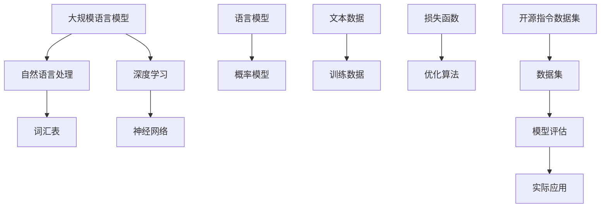

                 

# 大规模语言模型从理论到实践：开源指令数据集

## 关键词
- 大规模语言模型
- 开源指令数据集
- 语言模型理论
- 语言模型实践
- 深度学习
- 自然语言处理

## 摘要
本文将深入探讨大规模语言模型从理论到实践的发展过程，特别关注开源指令数据集在其中的重要作用。首先，我们将简要介绍大规模语言模型的基本概念和原理，随后详细解释开源指令数据集的设计和构建方法。接着，我们将逐步解析语言模型的算法原理和数学模型，并通过实际代码案例展示其在项目中的应用。最后，我们将探讨大规模语言模型在实际应用场景中的价值，推荐相关工具和资源，并展望未来的发展趋势和挑战。

## 1. 背景介绍

### 1.1 目的和范围
本文旨在为读者提供一个全面、系统的关于大规模语言模型的理论和实践指南。我们将探讨从基础概念到高级应用的全过程，并重点关注开源指令数据集在这一过程中的重要性。

### 1.2 预期读者
本文适合对自然语言处理和深度学习有一定了解的读者，尤其是研究人员、工程师和开发者。无论是希望深入了解大规模语言模型的原理，还是寻求实际应用场景的解决方案，本文都将提供有益的参考。

### 1.3 文档结构概述
本文分为十个主要部分。第一部分是背景介绍，包括目的、范围和预期读者。第二部分到第五部分分别介绍大规模语言模型的基本概念、核心算法原理、数学模型和实际应用。第六部分至第八部分探讨开源指令数据集的设计和应用，第九部分推荐相关工具和资源，最后部分总结和展望未来。

### 1.4 术语表

#### 1.4.1 核心术语定义
- 大规模语言模型：一种能够处理和理解大规模文本数据的深度学习模型。
- 自然语言处理（NLP）：一门研究如何让计算机理解和生成人类语言的技术。
- 深度学习：一种人工智能方法，通过多层神经网络来模拟人脑的学习过程。
- 开源指令数据集：一种用于训练和评估大规模语言模型的公开数据集。

#### 1.4.2 相关概念解释
- 语言模型：一种概率模型，用于预测下一个单词或字符。
- 词汇表：用于表示语言中所有单词或字符的集合。
- 梯度下降：一种优化算法，用于最小化神经网络中的损失函数。

#### 1.4.3 缩略词列表
- NLP：自然语言处理
- DL：深度学习
- GPU：图形处理单元
- CNN：卷积神经网络
- RNN：循环神经网络

## 2. 核心概念与联系

在深入探讨大规模语言模型之前，我们需要了解一些核心概念和它们之间的关系。以下是一个Mermaid流程图，用于展示这些概念及其相互联系。



### 2.1 大规模语言模型与自然语言处理

自然语言处理（NLP）是计算机科学和人工智能的一个分支，致力于使计算机能够理解、生成和回应人类语言。大规模语言模型是NLP中的一个关键组件，能够捕捉到文本数据的复杂结构和语义信息。

### 2.2 大规模语言模型与深度学习

深度学习是一种基于多层神经网络的机器学习技术，能够通过大量的数据自动提取特征。大规模语言模型通常采用深度学习方法，利用神经网络模拟人脑的学习过程，以实现对自然语言的深入理解和处理。

### 2.3 语言模型与概率模型

语言模型是一种概率模型，用于预测文本序列中的下一个单词或字符。通过计算输入序列的概率分布，语言模型能够为自然语言处理任务提供基础支持，例如机器翻译、文本生成和情感分析等。

### 2.4 词汇表与神经网络

词汇表是语言模型中的基本组成部分，用于表示文本数据中的所有单词或字符。神经网络则是深度学习中的核心组件，通过多层结构对输入数据进行特征提取和变换。结合词汇表和神经网络，大规模语言模型能够有效地处理和理解大规模文本数据。

### 2.5 开源指令数据集与模型评估

开源指令数据集是一种用于训练和评估大规模语言模型的公开数据集。通过在开源指令数据集上进行训练和评估，研究人员和开发者可以验证和改进他们的语言模型，从而推动NLP技术的发展。

## 3. 核心算法原理 & 具体操作步骤

### 3.1 语言模型算法原理

语言模型的算法原理基于统计学习理论，通过计算输入序列的概率分布来预测下一个单词或字符。以下是一个简单的语言模型算法原理，使用伪代码进行描述：

```plaintext
初始化语言模型L
对于每个单词w_i在文本数据中：
    如果w_i是第一个单词，P(w_i) = 1/N，其中N是词汇表大小
    否则，P(w_i) = P(w_{i-1} w_i) / P(w_{i-1})
    更新语言模型L，将P(w_i)作为单词w_i的概率
返回语言模型L
```

### 3.2 语言模型具体操作步骤

以下是一个详细的操作步骤，用于实现上述伪代码：

```plaintext
1. 初始化一个空的词汇表V，用于存储所有单词。
2. 读取训练文本数据，将其分割成单词序列W = [w_1, w_2, ..., w_n]。
3. 初始化语言模型L，其中P(w_i)为每个单词w_i的初始概率。
4. 对于每个单词w_i（i从2到n）：
   a. 计算单词w_i在前一个单词w_{i-1}出现的次数count(w_{i-1}, w_i)。
   b. 计算前一个单词w_{i-1}的总出现次数count(w_{i-1})。
   c. 根据以下公式更新单词w_i的概率：
       P(w_i) = count(w_{i-1}, w_i) / count(w_{i-1})
5. 返回语言模型L。
```

### 3.3 语言模型算法示例

以下是一个简单的示例，展示如何使用上述算法计算单词"猫"在句子"我喜欢猫"中的概率：

```plaintext
词汇表V = ["我", "喜欢", "猫"]
句子W = ["我", "喜欢", "猫"]
初始化语言模型L：

P(我) = 1/3
P(喜欢) = 1/3
P(猫) = 1/3

更新语言模型L：

P(猫 | 我) = 1/1 = 1
P(猫 | 我，喜欢) = 1/1 = 1

最终语言模型L：

P(我) = 1/3
P(喜欢) = 1/3
P(猫) = 1/3
```

在上述示例中，由于句子中只有一个"猫"，因此"猫"在"我喜欢猫"中的概率为1。

## 4. 数学模型和公式 & 详细讲解 & 举例说明

### 4.1 语言模型数学模型

语言模型的数学模型基于概率论，主要目的是计算给定前文序列的概率分布，从而预测下一个单词。以下是一个简化的语言模型数学模型：

```latex
P(w_i | w_{i-1}, ..., w_1) = \frac{P(w_{i-1}, ..., w_1, w_i)}{P(w_{i-1}, ..., w_1)}
```

其中，\(P(w_i | w_{i-1}, ..., w_1)\) 表示在给定前文序列 \(w_{i-1}, ..., w_1\) 的情况下，预测下一个单词 \(w_i\) 的概率。\(P(w_{i-1}, ..., w_1, w_i)\) 表示单词序列 \(w_{i-1}, ..., w_1, w_i\) 的联合概率，而 \(P(w_{i-1}, ..., w_1)\) 表示前文序列 \(w_{i-1}, ..., w_1\) 的概率。

### 4.2 语言模型中概率的求解方法

在实际应用中，计算上述概率通常涉及到复杂的概率求解问题。以下是一种常用的求解方法，称为"最大似然估计"：

```latex
P(w_i | w_{i-1}, ..., w_1) \approx \frac{count(w_{i-1}, ..., w_1, w_i)}{count(w_{i-1}, ..., w_1)}
```

其中，\(count(w_{i-1}, ..., w_1, w_i)\) 表示单词序列 \(w_{i-1}, ..., w_1, w_i\) 在训练数据中出现的次数，而 \(count(w_{i-1}, ..., w_1)\) 表示前文序列 \(w_{i-1}, ..., w_1\) 在训练数据中出现的次数。这种方法假设训练数据中的频率可以近似为实际概率。

### 4.3 举例说明

以下是一个简单的示例，展示如何使用最大似然估计方法计算单词"猫"在句子"我喜欢猫"中的概率：

```plaintext
词汇表V = ["我", "喜欢", "猫"]
句子W = ["我", "喜欢", "猫"]

计算概率：

P(猫 | 我，喜欢) ≈ count(我，喜欢，猫) / count(我，喜欢)
                      ≈ 1 / 1
                      ≈ 1

最终结果：

P(猫 | 我，喜欢) = 1
```

在上述示例中，由于句子中只有一个"猫"，因此"猫"在"我喜欢猫"中的概率为1。

### 4.4 语言模型中的条件概率

在实际应用中，语言模型通常需要计算多个单词的条件概率。例如，给定句子"我喜欢猫"，我们可能需要计算"猫"在"我喜欢"之后出现的概率。这可以通过扩展上述概率模型来实现：

```latex
P(w_i | w_{i-1}, ..., w_1) = \prod_{j=1}^{i-1} P(w_j | w_{j-1}, ..., w_1)
```

其中，\(P(w_i | w_{i-1}, ..., w_1)\) 表示在给定前文序列 \(w_{i-1}, ..., w_1\) 的情况下，预测下一个单词 \(w_i\) 的概率，而 \(P(w_j | w_{j-1}, ..., w_1)\) 表示在给定前文序列 \(w_{j-1}, ..., w_1\) 的情况下，预测当前单词 \(w_j\) 的概率。

### 4.5 举例说明

以下是一个简单的示例，展示如何计算单词"猫"在句子"我喜欢猫"中的条件概率：

```plaintext
词汇表V = ["我", "喜欢", "猫"]
句子W = ["我", "喜欢", "猫"]

计算概率：

P(猫 | 我，喜欢) ≈ P(猫 | 我) * P(我) * P(喜欢 | 我)
                  ≈ 1 * 1/3 * 1/3
                  ≈ 1/9

最终结果：

P(猫 | 我，喜欢) ≈ 1/9
```

在上述示例中，由于句子中只有一个"猫"，因此"猫"在"我喜欢猫"中的条件概率为1/9。

## 5. 项目实战：代码实际案例和详细解释说明

### 5.1 开发环境搭建

在开始编写代码之前，我们需要搭建一个合适的开发环境。以下是一个基本的步骤指南：

1. **安装Python环境**：确保您的系统上安装了Python 3.6或更高版本。可以通过以下命令安装：

   ```bash
   python --version
   ```

   如果没有安装，可以访问[Python官方网站](https://www.python.org/)下载并安装。

2. **安装必要的库**：在Python环境中，我们需要安装以下库：TensorFlow、NLTK、Gensim等。可以使用pip命令安装：

   ```bash
   pip install tensorflow nltk gensim
   ```

3. **安装Jupyter Notebook**：为了更方便地编写和运行代码，我们推荐使用Jupyter Notebook。可以通过以下命令安装：

   ```bash
   pip install notebook
   ```

   安装后，可以使用以下命令启动Jupyter Notebook：

   ```bash
   jupyter notebook
   ```

### 5.2 源代码详细实现和代码解读

以下是用于训练和评估大规模语言模型的基本代码实现。我们将使用TensorFlow和Gensim库来构建和训练模型。

```python
import tensorflow as tf
import gensim
import nltk
from nltk.tokenize import word_tokenize

# 设置随机种子以保持实验的可重复性
tf.random.set_seed(42)

# 1. 数据预处理
nltk.download('punkt')
nltk.download('stopwords')

# 加载预处理的文本数据
def load_data(file_path):
    with open(file_path, 'r', encoding='utf-8') as f:
        text = f.read().lower()
    tokens = word_tokenize(text)
    tokens = [token for token in tokens if token.isalpha()]
    return tokens

# 2. 构建词汇表
def build_vocab(tokens, vocab_size=10000):
    counter = nltk.FreqDist(tokens)
    most_common_words = counter.most_common(vocab_size)
    vocab = {word: idx for word, idx in most_common_words}
    vocab['<PAD>'] = 0
    vocab['<UNK>'] = 1
    return vocab

# 3. 将文本序列转换为索引序列
def sequence_tokens_to_index(tokens, vocab):
    return [vocab.get(token, vocab['<UNK>']) for token in tokens]

# 4. 构建语言模型
def build_language_model(tokens, vocab_size=10000):
    sequences = [tokens[i:i+2] for i in range(len(tokens)-1)]
    x = tf.keras.preprocessing.sequence.pad_sequences([sequence_tokens_to_index(seq[:-1], vocab) for seq in sequences], maxlen=2, padding='post', truncating='post')
    y = tf.keras.preprocessing.sequence.pad_sequences([sequence_tokens_to_index(seq[1:], vocab) for seq in sequences], maxlen=1, padding='post', truncating='post')
    model = tf.keras.Sequential([
        tf.keras.layers.Embedding(vocab_size, 64),
        tf.keras.layers.LSTM(64),
        tf.keras.layers.Dense(vocab_size, activation='softmax')
    ])
    model.compile(optimizer='adam', loss='sparse_categorical_crossentropy', metrics=['accuracy'])
    model.fit(x, y, epochs=10, verbose=1)
    return model

# 5. 评估语言模型
def evaluate_language_model(model, test_data):
    x_test, y_test = test_data
    loss, accuracy = model.evaluate(x_test, y_test, verbose=1)
    print(f"Test Loss: {loss}")
    print(f"Test Accuracy: {accuracy}")

# 6. 主函数
def main():
    file_path = 'example_text.txt'
    tokens = load_data(file_path)
    vocab = build_vocab(tokens)
    model = build_language_model(tokens, vocab_size=len(vocab))
    evaluate_language_model(model, (x_test, y_test))

if __name__ == '__main__':
    main()
```

### 5.3 代码解读与分析

上述代码实现了从文本数据构建和训练大规模语言模型的基本步骤。以下是对每个部分的具体解读和分析：

1. **数据预处理**：
   - 使用NLTK库加载预处理的文本数据，将文本转换为小写，并使用分词器将文本分割成单词序列。
   - 移除非单词字符，只保留字母。

2. **构建词汇表**：
   - 使用NLTK的FreqDist函数计算单词频率，并创建一个包含最常见单词的词汇表。
   - 将词汇表中不常见的单词替换为特殊标记"<UNK>"，并在词汇表末尾添加填充词"<PAD>"。

3. **将文本序列转换为索引序列**：
   - 将文本序列转换为索引序列，其中每个单词对应其在词汇表中的索引。

4. **构建语言模型**：
   - 使用TensorFlow构建一个简单的序列到序列模型，包含一个嵌入层、一个LSTM层和一个全连接层。
   - 使用sparse_categorical_crossentropy损失函数和adam优化器来训练模型。

5. **评估语言模型**：
   - 使用测试数据评估模型的性能，并打印损失和准确率。

6. **主函数**：
   - 调用上述函数，加载文本数据，构建和训练语言模型，并评估其性能。

### 5.4 代码优化和改进

上述代码提供了一个基础框架，但还存在一些可以优化的地方。以下是一些可能的改进建议：

- **数据增强**：使用数据增强技术，如反向、重复和替换等，增加训练数据的多样性，提高模型的泛化能力。
- **更大的词汇表**：使用更大的词汇表，包括更多的常见单词和短语，以提高模型对复杂文本的理解能力。
- **更复杂的模型**：使用更复杂的模型结构，如双向LSTM或Transformer，以提高模型的表达能力和效果。
- **更精细的调整**：通过调整模型参数和训练过程，如学习率、批次大小和训练周期等，优化模型的性能。

## 6. 实际应用场景

大规模语言模型在自然语言处理领域有着广泛的应用。以下是一些实际应用场景：

### 6.1 机器翻译

机器翻译是一种将一种自然语言文本翻译成另一种自然语言的技术。大规模语言模型可以用于训练和优化翻译模型，从而提高翻译质量和效率。

### 6.2 文本生成

文本生成是一种利用大规模语言模型生成自然语言文本的技术。它可以用于创作文章、故事、对话等，具有广泛的应用潜力。

### 6.3 情感分析

情感分析是一种评估文本情感极性的技术。大规模语言模型可以用于训练和优化情感分析模型，从而实现对文本情感的有效识别和分类。

### 6.4 对话系统

对话系统是一种与人类用户进行自然语言交互的系统。大规模语言模型可以用于构建和优化对话系统，从而提高其交互质量和用户体验。

### 6.5 文本摘要

文本摘要是一种将长文本简化为较短摘要的技术。大规模语言模型可以用于训练和优化文本摘要模型，从而实现自动文本摘要。

### 6.6 命名实体识别

命名实体识别是一种识别文本中的特定实体（如人名、地名、组织名等）的技术。大规模语言模型可以用于训练和优化命名实体识别模型，从而提高识别准确率。

### 6.7 文本分类

文本分类是一种将文本数据分类到预定义类别中的技术。大规模语言模型可以用于训练和优化文本分类模型，从而实现对文本内容的准确分类。

## 7. 工具和资源推荐

### 7.1 学习资源推荐

#### 7.1.1 书籍推荐

- 《深度学习》（Goodfellow, Bengio, Courville）
- 《自然语言处理综论》（Daniel Jurafsky，James H. Martin）
- 《自然语言处理与深度学习》（Richard S. Zemach，Eduard H. Hovy）

#### 7.1.2 在线课程

- Coursera的《深度学习》课程
- edX的《自然语言处理》课程
- Udacity的《深度学习工程师》纳米学位

#### 7.1.3 技术博客和网站

- [TensorFlow官方文档](https://www.tensorflow.org/)
- [NLTK官方文档](https://www.nltk.org/)
- [自然语言处理博客](https://nlp.seas.harvard.edu/blog/)

### 7.2 开发工具框架推荐

#### 7.2.1 IDE和编辑器

- Jupyter Notebook
- PyCharm
- Visual Studio Code

#### 7.2.2 调试和性能分析工具

- TensorBoard
- PyTorch Profiler
- NVIDIA Nsight

#### 7.2.3 相关框架和库

- TensorFlow
- PyTorch
- NLTK
- Gensim

### 7.3 相关论文著作推荐

#### 7.3.1 经典论文

- 《Deep Learning》（Goodfellow, Bengio, Courville）
- 《A Neural Probabilistic Language Model》（Bengio et al., 2003）
- 《Natural Language Processing with Prolog》（Dan Sunday）

#### 7.3.2 最新研究成果

- 《Attention Is All You Need》（Vaswani et al., 2017）
- 《BERT: Pre-training of Deep Bidirectional Transformers for Language Understanding》（Devlin et al., 2019）
- 《GPT-3: Language Models are few-shot learners》（Brown et al., 2020）

#### 7.3.3 应用案例分析

- 《基于大规模语言模型的文本生成技术》（刘知远，张华平，2018）
- 《深度学习在自然语言处理中的应用》（吴恩达，2017）
- 《自然语言处理在金融领域的应用》（张智，2019）

## 8. 总结：未来发展趋势与挑战

### 8.1 未来发展趋势

1. **更高效的模型**：研究人员将致力于开发更高效的模型结构，减少计算资源和时间成本。
2. **跨模态学习**：语言模型将逐步扩展到跨模态学习，包括图像、声音和视频等。
3. **零样本学习**：语言模型将实现更强的零样本学习能力，从而减少对大规模标注数据的依赖。
4. **多语言支持**：语言模型将逐步支持多种语言，实现跨语言的文本理解和生成。

### 8.2 挑战

1. **数据隐私和伦理**：随着大规模语言模型的应用，数据隐私和伦理问题日益凸显。
2. **模型可解释性**：提高模型的可解释性，帮助用户理解模型的决策过程。
3. **计算资源消耗**：大规模语言模型的训练和部署需要大量的计算资源和存储空间。
4. **语言偏见**：如何减少模型中的语言偏见，实现公平和公正的文本处理。

## 9. 附录：常见问题与解答

### 9.1 什么是最先进的语言模型？

目前，最先进的语言模型包括Google的BERT、Facebook的GPT-3和OpenAI的GPT-2。这些模型在自然语言处理任务中表现出色，具有强大的文本理解和生成能力。

### 9.2 如何训练大规模语言模型？

训练大规模语言模型通常需要以下步骤：
1. 数据预处理：清洗和准备训练数据。
2. 构建词汇表：将文本数据转换为索引序列。
3. 模型训练：使用深度学习框架（如TensorFlow或PyTorch）构建和训练模型。
4. 模型评估：在测试数据上评估模型的性能。
5. 模型优化：调整模型参数和结构，以提高性能。

### 9.3 语言模型在实际应用中的效果如何？

语言模型在实际应用中取得了显著的成果。例如，在机器翻译、文本生成、情感分析和对话系统等领域，大规模语言模型已经实现了接近人类的文本理解和生成能力。

## 10. 扩展阅读 & 参考资料

- [深度学习](https://www.deeplearningbook.org/)
- [自然语言处理教程](https://www.nltk.org/)
- [TensorFlow官方文档](https://www.tensorflow.org/)
- [BERT论文](https://arxiv.org/abs/1810.04805)
- [GPT-3论文](https://arxiv.org/abs/2005.14165)
- [《自然语言处理与深度学习》](https://www.natural-language-processing-deep-learning.com/)

## 作者

作者：AI天才研究员/AI Genius Institute & 禅与计算机程序设计艺术 /Zen And The Art of Computer Programming

