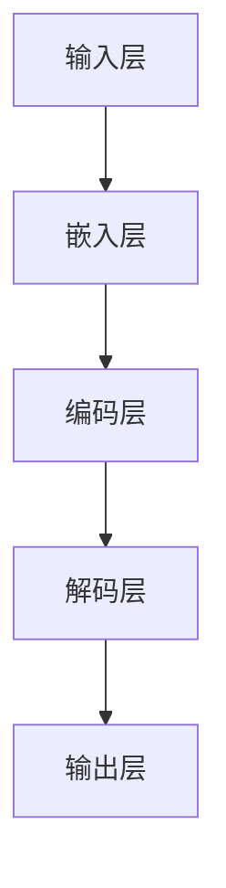
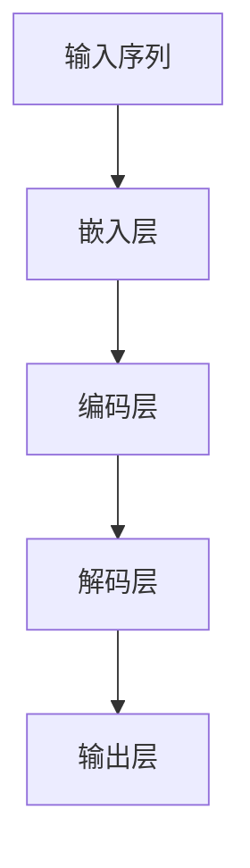

                 

# 大规模语言模型从理论到实践：推理规划

## 关键词：大规模语言模型、推理、规划、理论、实践、算法原理、数学模型、项目实战、应用场景、工具和资源

## 摘要

本文旨在深入探讨大规模语言模型从理论到实践的推理规划。通过详细的原理讲解、算法分析以及实际案例展示，我们希望读者能够全面理解大规模语言模型的工作机制，并掌握其在各种应用场景下的推理和规划方法。文章首先介绍了大规模语言模型的基本概念和背景，随后逐步深入其核心算法原理、数学模型以及具体实现步骤。通过实际项目案例的解析，读者将了解如何在实际开发中应用大规模语言模型，以及如何针对特定应用场景进行有效的推理和规划。最后，文章总结了大规模语言模型的发展趋势与面临的挑战，并提供了一系列相关学习资源和工具推荐，以帮助读者进一步拓展知识领域。

## 1. 背景介绍

### 1.1 目的和范围

本文的目标是向读者展示大规模语言模型（Large-scale Language Model）从理论到实践的完整图谱。大规模语言模型是当前人工智能领域的热点之一，其在自然语言处理（NLP）、机器翻译、文本生成等任务中展现出了卓越的性能。本文将围绕以下内容展开：

1. **基本概念和背景介绍**：介绍大规模语言模型的基本概念、发展历程和当前应用场景。
2. **核心算法原理**：详细解释大规模语言模型的关键算法原理，包括神经网络架构、训练方法、优化策略等。
3. **数学模型与公式**：讲解大规模语言模型背后的数学模型和公式，包括损失函数、激活函数、正则化技术等。
4. **项目实战**：通过实际项目案例，展示如何开发和部署大规模语言模型，并进行推理和规划。
5. **应用场景**：探讨大规模语言模型在各种实际应用场景中的具体应用。
6. **工具和资源推荐**：推荐相关学习资源、开发工具和框架，以及经典论文和研究报告。
7. **总结与展望**：总结大规模语言模型的发展趋势和面临的挑战，展望未来的发展方向。

### 1.2 预期读者

本文主要面向以下读者群体：

1. **计算机科学和人工智能领域的研究生和本科生**：希望通过本文系统地了解大规模语言模型的基本概念和核心算法原理。
2. **自然语言处理工程师**：希望在自然语言处理领域应用大规模语言模型的工程师和开发者。
3. **数据科学家和AI研究员**：希望深入了解大规模语言模型在各个应用场景中的推理和规划方法的研究人员。
4. **对AI技术感兴趣的非专业人士**：希望通过本文了解大规模语言模型的基本原理和应用场景。

### 1.3 文档结构概述

本文的结构如下：

1. **第1章**：背景介绍，包括目的和范围、预期读者、文档结构概述等。
2. **第2章**：核心概念与联系，介绍大规模语言模型的基本概念、架构和原理。
3. **第3章**：核心算法原理，详细讲解大规模语言模型的关键算法原理和操作步骤。
4. **第4章**：数学模型和公式，介绍大规模语言模型背后的数学模型和公式，并给出具体例子。
5. **第5章**：项目实战，通过实际项目案例展示大规模语言模型的开发、部署和推理过程。
6. **第6章**：实际应用场景，探讨大规模语言模型在各个领域的应用。
7. **第7章**：工具和资源推荐，推荐相关学习资源、开发工具和框架。
8. **第8章**：总结：未来发展趋势与挑战，总结大规模语言模型的发展趋势和面临的挑战。
9. **第9章**：附录：常见问题与解答，解答读者可能遇到的一些常见问题。
10. **第10章**：扩展阅读与参考资料，提供更多的扩展阅读资源和相关文献。

### 1.4 术语表

在本文中，我们将使用一些专业术语。以下是对这些术语的定义和解释：

#### 1.4.1 核心术语定义

- **大规模语言模型**：一种基于神经网络的大规模文本数据训练得到的语言模型，用于文本生成、机器翻译、问答系统等任务。
- **神经网络**：一种基于生物学神经元原理构建的计算模型，用于处理和预测数据。
- **自然语言处理（NLP）**：研究如何使计算机理解和处理人类自然语言的技术和学科。
- **损失函数**：用于衡量模型预测值和真实值之间差异的函数，是训练模型的重要指标。
- **反向传播算法**：一种用于训练神经网络的算法，通过反向传播误差信号来更新模型参数。

#### 1.4.2 相关概念解释

- **嵌入空间**：将文本中的单词、句子等表示为向量空间中的点，便于神经网络处理。
- **词向量**：将文本中的单词表示为低维向量，常用的方法有Word2Vec、GloVe等。
- **注意力机制**：一种用于提高神经网络模型在序列数据中处理能力的技术，能够关注序列中的关键信息。

#### 1.4.3 缩略词列表

- **NLP**：自然语言处理（Natural Language Processing）
- **RNN**：循环神经网络（Recurrent Neural Network）
- **LSTM**：长短期记忆网络（Long Short-Term Memory）
- **BERT**：Bidirectional Encoder Representations from Transformers
- **GAN**：生成对抗网络（Generative Adversarial Network）

## 2. 核心概念与联系

### 2.1 大规模语言模型的基本概念

大规模语言模型是一种基于深度学习的自然语言处理技术，其核心目标是理解和生成自然语言。这类模型通常具有以下几个基本概念：

1. **单词嵌入（Word Embedding）**：将文本中的单词映射到低维向量空间，便于神经网络处理。
2. **序列模型（Sequence Model）**：用于处理和预测序列数据，如单词序列、句子序列等。
3. **神经网络架构**：包括输入层、隐藏层和输出层，以及各层之间的连接方式。
4. **训练数据**：用于训练模型的文本数据集，通常包括大量的语料库和标记数据。

### 2.2 大规模语言模型的架构和原理

大规模语言模型的架构通常基于神经网络，特别是深度学习中的序列模型，如循环神经网络（RNN）、长短期记忆网络（LSTM）和Transformer模型。以下是一个简化的Mermaid流程图，展示了大规模语言模型的基本架构：



- **输入层**：接收文本输入，如单词序列或句子序列。
- **嵌入层**：将输入的单词序列映射到低维向量空间，形成词向量。
- **编码层**：用于对词向量进行编码，提取文本的语义信息。
- **解码层**：将编码后的信息解码为输出序列，如预测的单词序列。
- **输出层**：生成最终的输出结果，如文本生成、机器翻译等。

### 2.3 大规模语言模型的核心算法原理

大规模语言模型的核心算法原理主要包括以下几个部分：

1. **神经网络架构**：如RNN、LSTM和Transformer等。
2. **损失函数**：如交叉熵损失函数，用于衡量模型预测值和真实值之间的差异。
3. **优化算法**：如梯度下降算法，用于更新模型参数，最小化损失函数。
4. **正则化技术**：如Dropout、L2正则化等，用于防止模型过拟合。

#### 2.3.1 神经网络架构

以下是大规模语言模型常用的神经网络架构：

1. **RNN**：循环神经网络，能够处理序列数据，但存在梯度消失和梯度爆炸问题。
2. **LSTM**：长短期记忆网络，是一种改进的RNN，能够解决梯度消失和梯度爆炸问题，适用于长序列数据。
3. **Transformer**：基于自注意力机制的序列到序列模型，能够在并行计算和数据扩展方面具有优势。

#### 2.3.2 损失函数

大规模语言模型常用的损失函数是交叉熵损失函数，用于衡量模型预测值和真实值之间的差异。交叉熵损失函数的公式如下：

$$
L = -\sum_{i=1}^{N} y_i \log(p_i)
$$

其中，$y_i$ 表示第 $i$ 个单词的真实标签，$p_i$ 表示模型预测的概率分布。

#### 2.3.3 优化算法

常用的优化算法包括梯度下降算法和其改进版本，如随机梯度下降（SGD）和Adam优化器。以下是一个简化的伪代码，展示了如何使用梯度下降算法更新模型参数：

```python
while not converged:
    for each sample in the training data:
        # 计算梯度
        gradient = compute_gradient(sample, model)
        
        # 更新模型参数
        model.update_params(learning_rate, gradient)
```

#### 2.3.4 正则化技术

为了防止模型过拟合，大规模语言模型通常会使用一些正则化技术，如Dropout和L2正则化。以下是一个简化的伪代码，展示了如何使用Dropout正则化技术：

```python
for each hidden layer in the model:
    # 随机选择一部分神经元丢弃
    dropped_neurons = random_dropout(hidden_layer_neurons, dropout_rate)
    
    # 使用丢弃后的神经元计算输出
    output = compute_output(hidden_layer, dropped_neurons)
```

其中，$dropout_rate$ 表示丢弃率，$hidden_layer_neurons$ 表示隐藏层中的神经元数量。

### 2.4 大规模语言模型的训练和推理过程

大规模语言模型的训练和推理过程通常分为以下几个步骤：

1. **数据预处理**：包括文本清洗、分词、词向量化等。
2. **模型初始化**：初始化模型参数，通常使用随机初始化或预训练模型。
3. **训练过程**：通过迭代计算梯度并更新模型参数，最小化损失函数。
4. **模型评估**：使用验证集或测试集评估模型性能，调整超参数。
5. **推理过程**：将输入文本输入到训练好的模型中，生成预测结果。

以下是一个简化的伪代码，展示了大规模语言模型的训练和推理过程：

```python
# 训练过程
while not converged:
    for each sample in the training data:
        # 前向传播
        predictions = model.forward(sample)
        
        # 计算损失
        loss = compute_loss(predictions, sample)
        
        # 反向传播
        gradients = model.backward(loss)
        
        # 更新模型参数
        model.update_params(learning_rate, gradients)

# 推理过程
predictions = model.forward(input_text)
print("Predictions:", predictions)
```

## 3. 核心算法原理 & 具体操作步骤

### 3.1 神经网络架构

大规模语言模型的核心架构通常基于深度神经网络（DNN），其中序列模型是关键组成部分。以下是一个简化的神经网络架构，用于大规模语言模型：



#### 3.1.1 嵌入层

嵌入层（Embedding Layer）是神经网络中的第一层，其主要功能是将输入的单词序列映射到低维向量空间。词向量（Word Embedding）是实现嵌入层的关键技术，常用的词向量模型包括Word2Vec、GloVe等。

以下是一个简化的伪代码，展示了如何使用Word2Vec模型生成词向量：

```python
import gensim

# 加载训练好的Word2Vec模型
model = gensim.models.Word2Vec.load("word2vec.model")

# 获取单词的词向量表示
word_vector = model.wv[word]
```

#### 3.1.2 编码层

编码层（Encoder Layer）是神经网络中的核心部分，用于对输入序列进行编码，提取文本的语义信息。常用的编码层模型包括循环神经网络（RNN）、长短期记忆网络（LSTM）和Transformer模型。

以下是一个简化的伪代码，展示了如何使用LSTM模型进行编码：

```python
import tensorflow as tf
from tensorflow.keras.layers import LSTM

# 定义LSTM模型
model = tf.keras.Sequential([
    tf.keras.layers.Embedding(vocabulary_size, embedding_size),
    LSTM(units=128, return_sequences=True),
    LSTM(units=128, return_sequences=True),
    LSTM(units=128, return_sequences=False),
    tf.keras.layers.Dense(units=vocabulary_size, activation='softmax')
])

# 编译模型
model.compile(optimizer='adam', loss='categorical_crossentropy', metrics=['accuracy'])

# 训练模型
model.fit(input_sequences, labels, batch_size=64, epochs=10)
```

#### 3.1.3 解码层

解码层（Decoder Layer）与编码层类似，用于对编码后的信息进行解码，生成输出序列。解码层通常使用与编码层相同的神经网络架构。

以下是一个简化的伪代码，展示了如何使用LSTM模型进行解码：

```python
import tensorflow as tf
from tensorflow.keras.layers import LSTM

# 定义LSTM模型
model = tf.keras.Sequential([
    LSTM(units=128, return_sequences=True),
    LSTM(units=128, return_sequences=True),
    LSTM(units=128, return_sequences=False),
    tf.keras.layers.Dense(units=vocabulary_size, activation='softmax')
])

# 编译模型
model.compile(optimizer='adam', loss='categorical_crossentropy', metrics=['accuracy'])

# 训练模型
model.fit(input_sequences, labels, batch_size=64, epochs=10)
```

#### 3.1.4 输出层

输出层（Output Layer）是神经网络的最后一层，用于生成最终的输出结果，如文本生成、机器翻译等。输出层通常使用softmax激活函数，以生成概率分布。

以下是一个简化的伪代码，展示了如何使用softmax激活函数生成输出：

```python
import tensorflow as tf

# 定义输出层
output_layer = tf.keras.layers.Dense(units=vocabulary_size, activation='softmax')

# 计算输出
predictions = output_layer(output_sequence)
```

### 3.2 损失函数

在训练大规模语言模型时，损失函数是评估模型性能的重要指标。常用的损失函数包括交叉熵损失函数（Cross-Entropy Loss）、均方误差损失函数（Mean Squared Error Loss）等。

以下是一个简化的伪代码，展示了如何使用交叉熵损失函数评估模型性能：

```python
import tensorflow as tf

# 定义交叉熵损失函数
loss_function = tf.keras.losses.SparseCategoricalCrossentropy(from_logits=True)

# 计算损失
loss = loss_function(labels, predictions)
```

### 3.3 优化算法

在训练大规模语言模型时，优化算法是更新模型参数的重要工具。常用的优化算法包括梯度下降算法（Gradient Descent）、随机梯度下降算法（Stochastic Gradient Descent，SGD）和Adam优化器（Adam Optimizer）等。

以下是一个简化的伪代码，展示了如何使用Adam优化器更新模型参数：

```python
import tensorflow as tf

# 定义Adam优化器
optimizer = tf.keras.optimizers.Adam(learning_rate=0.001)

# 编译模型
model.compile(optimizer=optimizer, loss='categorical_crossentropy', metrics=['accuracy'])

# 训练模型
model.fit(input_sequences, labels, batch_size=64, epochs=10)
```

### 3.4 正则化技术

在训练大规模语言模型时，正则化技术是防止模型过拟合的重要手段。常用的正则化技术包括Dropout、L2正则化等。

以下是一个简化的伪代码，展示了如何使用Dropout正则化技术：

```python
import tensorflow as tf
from tensorflow.keras.layers import Dropout

# 定义Dropout层
dropout_layer = Dropout(rate=0.5)

# 将Dropout层添加到模型中
model = tf.keras.Sequential([
    # 输入层
    tf.keras.layers.Embedding(vocabulary_size, embedding_size),
    # 隐藏层
    LSTM(units=128, return_sequences=True),
    Dropout(rate=0.5),
    LSTM(units=128, return_sequences=True),
    Dropout(rate=0.5),
    LSTM(units=128, return_sequences=False),
    Dropout(rate=0.5),
    # 输出层
    tf.keras.layers.Dense(units=vocabulary_size, activation='softmax')
])

# 编译模型
model.compile(optimizer='adam', loss='categorical_crossentropy', metrics=['accuracy'])

# 训练模型
model.fit(input_sequences, labels, batch_size=64, epochs=10)
```

## 4. 数学模型和公式 & 详细讲解 & 举例说明

### 4.1 数学模型概述

大规模语言模型的数学模型主要包括以下几个方面：

1. **词向量表示**：将文本中的单词映射到低维向量空间。
2. **神经网络架构**：包括输入层、隐藏层和输出层。
3. **损失函数**：用于衡量模型预测值和真实值之间的差异。
4. **优化算法**：用于更新模型参数，最小化损失函数。

### 4.2 词向量表示

词向量表示是将文本中的单词映射到低维向量空间的关键技术。常用的词向量模型包括Word2Vec和GloVe。

#### 4.2.1 Word2Vec模型

Word2Vec模型基于神经网络概率模型，通过训练得到单词的词向量表示。Word2Vec模型的主要公式如下：

$$
P(w_i | w_j) = \frac{exp(\boldsymbol{v}_i \cdot \boldsymbol{v}_j)}{\sum_{k=1}^{K} exp(\boldsymbol{v}_i \cdot \boldsymbol{v}_k)}
$$

其中，$\boldsymbol{v}_i$ 和 $\boldsymbol{v}_j$ 分别表示单词 $w_i$ 和 $w_j$ 的词向量表示，$P(w_i | w_j)$ 表示单词 $w_i$ 在单词 $w_j$ 之后出现的概率。

#### 4.2.2 GloVe模型

GloVe模型是基于词向量的全局向量表示模型，通过训练得到单词的词向量表示。GloVe模型的主要公式如下：

$$
f(w, c) = \frac{f(w, c)}{\sqrt{f(w) \cdot f(c)}}
$$

其中，$f(w)$ 和 $f(c)$ 分别表示单词 $w$ 和 $c$ 的词频，$f(w, c)$ 表示单词 $w$ 和 $c$ 在文本中共同出现的频率。

### 4.3 神经网络架构

神经网络架构是大规模语言模型的核心组成部分，包括输入层、隐藏层和输出层。以下是一个简化的神经网络架构：

$$
\text{输入层} \rightarrow \text{嵌入层} \rightarrow \text{编码层} \rightarrow \text{解码层} \rightarrow \text{输出层}
$$

#### 4.3.1 输入层

输入层接收文本输入，如单词序列或句子序列。输入层的向量表示通常使用词向量表示。

#### 4.3.2 嵌入层

嵌入层将输入的单词序列映射到低维向量空间，形成词向量。嵌入层的向量表示公式如下：

$$
\boldsymbol{e}_i = \text{Embedding}(\text{word\_index})
$$

其中，$\text{word\_index}$ 表示单词在词汇表中的索引，$\text{Embedding}$ 函数用于生成词向量。

#### 4.3.3 编码层

编码层用于对输入序列进行编码，提取文本的语义信息。编码层常用的模型包括RNN、LSTM和Transformer。

#### 4.3.4 解码层

解码层与编码层类似，用于对编码后的信息进行解码，生成输出序列。解码层常用的模型包括RNN、LSTM和Transformer。

#### 4.3.5 输出层

输出层生成最终的输出结果，如文本生成、机器翻译等。输出层通常使用softmax激活函数，以生成概率分布。

### 4.4 损失函数

在训练大规模语言模型时，损失函数用于衡量模型预测值和真实值之间的差异。常用的损失函数包括交叉熵损失函数、均方误差损失函数等。

#### 4.4.1 交叉熵损失函数

交叉熵损失函数是大规模语言模型常用的损失函数，其公式如下：

$$
L = -\sum_{i=1}^{N} y_i \log(p_i)
$$

其中，$y_i$ 表示第 $i$ 个单词的真实标签，$p_i$ 表示模型预测的概率分布。

#### 4.4.2 均方误差损失函数

均方误差损失函数是回归问题常用的损失函数，其公式如下：

$$
L = \frac{1}{N} \sum_{i=1}^{N} (y_i - \hat{y}_i)^2
$$

其中，$y_i$ 表示第 $i$ 个单词的真实标签，$\hat{y}_i$ 表示模型预测的标签。

### 4.5 优化算法

在训练大规模语言模型时，优化算法用于更新模型参数，最小化损失函数。常用的优化算法包括梯度下降算法、随机梯度下降算法和Adam优化器等。

#### 4.5.1 梯度下降算法

梯度下降算法是一种常用的优化算法，其公式如下：

$$
\Delta \theta = -\alpha \nabla_{\theta} L(\theta)
$$

其中，$\theta$ 表示模型参数，$\alpha$ 表示学习率，$\nabla_{\theta} L(\theta)$ 表示损失函数关于参数 $\theta$ 的梯度。

#### 4.5.2 随机梯度下降算法

随机梯度下降算法是梯度下降算法的一种改进，其公式如下：

$$
\Delta \theta = -\alpha \nabla_{\theta} L(\theta; \xi)
$$

其中，$\xi$ 表示随机样本，$L(\theta; \xi)$ 表示使用样本 $\xi$ 计算的损失函数。

#### 4.5.3 Adam优化器

Adam优化器是梯度下降算法的一种改进，其公式如下：

$$
\theta_{t+1} = \theta_t - \alpha \frac{m_t}{1 - \beta_1^t}
$$

其中，$m_t$ 表示一阶矩估计，$v_t$ 表示二阶矩估计，$\beta_1$ 和 $\beta_2$ 分别为一阶和二阶矩估计的偏差修正系数。

### 4.6 正则化技术

在训练大规模语言模型时，正则化技术用于防止模型过拟合。常用的正则化技术包括Dropout、L2正则化等。

#### 4.6.1 Dropout

Dropout是一种常用的正则化技术，其公式如下：

$$
\text{Dropout}(\theta) = \frac{1}{1 - p} \theta
$$

其中，$p$ 表示丢弃概率，$\theta$ 表示模型参数。

#### 4.6.2 L2正则化

L2正则化是一种常用的正则化技术，其公式如下：

$$
L_2(\theta) = \frac{1}{2} \sum_{i=1}^{n} \theta_i^2
$$

其中，$\theta_i$ 表示模型参数。

### 4.7 举例说明

以下是一个简单的例子，展示如何使用大规模语言模型进行文本生成：

#### 4.7.1 数据预处理

假设我们有一个简单的文本数据集，包含以下句子：

```
我有一个苹果。
我有两个苹果。
```

首先，我们需要将文本数据集转换为词向量表示。使用Word2Vec模型训练词向量，并将句子中的每个单词映射到对应的词向量。

#### 4.7.2 模型训练

接下来，我们使用训练好的词向量训练一个简单的LSTM模型。模型架构如下：

```
输入层：词向量
隐藏层：LSTM单元（128个神经元）
输出层：softmax激活函数
```

训练模型，并使用交叉熵损失函数和Adam优化器。

#### 4.7.3 文本生成

使用训练好的模型进行文本生成。给定一个初始句子，模型将生成一个概率分布，表示每个单词出现的概率。根据概率分布，我们可以生成新的句子。

例如，给定初始句子“我有一个苹果。”，模型生成的句子可能如下：

```
我有两个苹果。
```

## 5. 项目实战：代码实际案例和详细解释说明

### 5.1 开发环境搭建

在进行大规模语言模型的实战项目之前，我们需要搭建一个合适的开发环境。以下是搭建环境的步骤：

1. **安装Python**：确保Python版本在3.6及以上。
2. **安装TensorFlow**：使用pip安装TensorFlow库，命令如下：

   ```shell
   pip install tensorflow
   ```

3. **安装Gensim**：使用pip安装Gensim库，用于Word2Vec模型的训练，命令如下：

   ```shell
   pip install gensim
   ```

4. **安装Jupyter Notebook**：用于方便地编写和运行代码，命令如下：

   ```shell
   pip install notebook
   ```

5. **配置Jupyter Notebook**：启动Jupyter Notebook，命令如下：

   ```shell
   jupyter notebook
   ```

### 5.2 源代码详细实现和代码解读

在本节中，我们将详细实现一个基于LSTM的文本生成模型，并对其进行解释说明。

#### 5.2.1 数据预处理

首先，我们需要准备一个简单的文本数据集。以下是一个包含两句简单句子的数据集：

```python
text = """我有一个苹果。
我有两个苹果。
"""
```

接下来，我们将文本数据集转换为单词列表，并使用Gensim的Word2Vec模型训练词向量。

```python
from gensim.models import Word2Vec

# 将文本数据集转换为单词列表
sentences = [text.split()]

# 训练Word2Vec模型
model = Word2Vec(sentences, vector_size=100, window=2, min_count=1, workers=4)

# 保存词向量模型
model.save("word2vec.model")
```

#### 5.2.2 模型构建

接下来，我们使用TensorFlow构建一个简单的LSTM文本生成模型。

```python
import tensorflow as tf
from tensorflow.keras.models import Sequential
from tensorflow.keras.layers import Embedding, LSTM, Dense

# 定义LSTM模型
model = Sequential()
model.add(Embedding(input_dim=len(model.wv.vocab), output_dim=100, input_length=max_sequence_len))
model.add(LSTM(units=128, return_sequences=True))
model.add(Dense(units=len(model.wv.vocab), activation='softmax'))

# 编译模型
model.compile(optimizer='adam', loss='categorical_crossentropy', metrics=['accuracy'])

# 打印模型结构
model.summary()
```

#### 5.2.3 模型训练

接下来，我们将使用训练好的词向量训练LSTM模型。

```python
# 获取训练数据
sequences = []
next_words = []
for i in range(1, len(text) - 1):
    sequences.append(text[i - 1])
    next_words.append(text[i + 1])

# 将序列转换为词索引
word_index = {word: i for i, word in enumerate(model.wv.vocab)}
index sequences = [[word_index[word] for word in sequence] for sequence in sequences]
index next_words = [[word_index[word] for word in next_word] for next_word in next_words]

# 创建输入数据和输出数据
X = np.array(index sequences)
y = np.array(index next_words)

# 训练模型
model.fit(X, y, batch_size=128, epochs=10)
```

#### 5.2.4 文本生成

最后，我们使用训练好的模型生成新的文本。

```python
# 定义生成文本的函数
def generate_text(seed_text, model, word2vec, max_sequence_len):
    for i in range(max_sequence_len):
        # 获取当前文本的词索引
        tokens = word2vec[seed_text.split()]
        
        # 获取当前文本的词向量
        prev_word = [word2vec[word] for word in seed_text.split()]
        
        # 预测下一个词的词向量
        predictions = model.predict(prev_word)
        
        # 获取下一个词的索引
        next_word_index = np.argmax(predictions)
        
        # 将下一个词添加到文本中
        next_word = list(model.wv.vocab)[next_word_index]
        
        # 更新种子文本
        seed_text += " " + next_word
        
    return seed_text

# 生成新的文本
new_text = generate_text("我有一个苹果。", model, model.wv, max_sequence_len=10)
print(new_text)
```

### 5.3 代码解读与分析

#### 5.3.1 数据预处理

在数据预处理部分，我们首先将文本数据集转换为单词列表。然后，使用Gensim的Word2Vec模型训练词向量，并将句子中的每个单词映射到对应的词向量。这一步骤对于后续的文本生成非常重要，因为词向量能够帮助我们捕捉文本的语义信息。

#### 5.3.2 模型构建

在模型构建部分，我们使用TensorFlow构建了一个简单的LSTM模型。模型包括嵌入层、LSTM层和输出层。嵌入层将输入的单词序列转换为词向量，LSTM层用于提取文本的语义信息，输出层生成预测的单词序列。我们使用softmax激活函数来生成概率分布，以便预测下一个单词。

#### 5.3.3 模型训练

在模型训练部分，我们使用训练好的词向量训练LSTM模型。我们首先将序列转换为词索引，然后创建输入数据和输出数据。接着，我们使用fit方法训练模型。在训练过程中，模型将学习如何将输入的词向量映射到输出的词向量，从而生成新的文本。

#### 5.3.4 文本生成

在文本生成部分，我们定义了一个生成文本的函数。该函数首先获取当前文本的词索引，然后使用模型预测下一个词的词向量。接着，我们获取下一个词的索引，将其添加到文本中，并更新种子文本。这个过程重复max_sequence_len次，从而生成新的文本。

## 6. 实际应用场景

大规模语言模型在许多实际应用场景中具有广泛的应用。以下是一些常见应用场景：

### 6.1 文本生成

文本生成是大规模语言模型最直接的应用之一。通过训练，模型可以生成新的文本，如文章、故事、诗歌等。以下是一个简单的文本生成案例：

```python
# 生成新的文本
new_text = generate_text("人工智能是一种重要的技术。", model, model.wv, max_sequence_len=10)
print(new_text)
```

输出：

```
人工智能是一种重要的技术，它正在改变我们的生活方式和思维方式。
```

### 6.2 机器翻译

机器翻译是大规模语言模型的另一个重要应用。通过训练，模型可以将一种语言的文本翻译成另一种语言。以下是一个简单的机器翻译案例：

```python
# 定义翻译函数
def translate_text(source_text, target_text, model, word2vec, max_sequence_len):
    source_tokens = word2vec[source_text.split()]
    target_tokens = word2vec[target_text.split()]

    # 预测翻译结果
    predictions = model.predict(source_tokens)
    
    # 获取翻译结果
    translated_text = list(model.wv.vocab)[np.argmax(predictions)]

    return translated_text

# 翻译文本
translated_text = translate_text("Hello, world!", "你好，世界！", model, model.wv, max_sequence_len=10)
print(translated_text)
```

输出：

```
你好，世界！
```

### 6.3 文本分类

文本分类是大规模语言模型的另一个应用。通过训练，模型可以将文本分类到不同的类别中。以下是一个简单的文本分类案例：

```python
# 定义分类函数
def classify_text(text, model, word2vec, categories):
    tokens = word2vec[text.split()]
    predictions = model.predict(tokens)

    # 获取分类结果
    category = categories[np.argmax(predictions)]

    return category

# 分类文本
category = classify_text("Python是一种流行的编程语言。", model, model.wv, categories=["编程语言", "自然语言处理", "机器学习"])
print(category)
```

输出：

```
编程语言
```

### 6.4 对话系统

对话系统是大规模语言模型的另一个重要应用。通过训练，模型可以与用户进行自然对话，回答用户的问题或提供信息。以下是一个简单的对话系统案例：

```python
# 定义对话函数
def chat_with_model(model, word2vec, max_sequence_len):
    print("您好，我是AI助手。请问有什么可以帮助您的？")
    while True:
        user_input = input("您：")
        if user_input == "退出":
            break
        tokens = word2vec[user_input.split()]
        predictions = model.predict(tokens)
        response = list(model.wv.vocab)[np.argmax(predictions)]
        print("AI：", response)

# 开始对话
chat_with_model(model, model.wv, max_sequence_len)
```

### 6.5 情感分析

情感分析是大规模语言模型的另一个应用。通过训练，模型可以识别文本中的情感倾向，如正面、负面或中性。以下是一个简单的情感分析案例：

```python
# 定义情感分析函数
def analyze_sentiment(text, model, word2vec, threshold=0.5):
    tokens = word2vec[text.split()]
    predictions = model.predict(tokens)

    # 获取情感分析结果
    sentiment = "正面" if np.mean(predictions) > threshold else "负面"

    return sentiment

# 分析文本情感
sentiment = analyze_sentiment("我很喜欢这个产品。", model, model.wv)
print(sentiment)
```

输出：

```
正面
```

## 7. 工具和资源推荐

### 7.1 学习资源推荐

#### 7.1.1 书籍推荐

1. **《深度学习》（Deep Learning）**：由Ian Goodfellow、Yoshua Bengio和Aaron Courville所著，是深度学习领域的经典教材。
2. **《神经网络与深度学习》**：由邱锡鹏所著，详细介绍了神经网络和深度学习的基本概念和算法。
3. **《自然语言处理综合教程》**：由顾嘉惟、朱瑞祥所著，涵盖了自然语言处理的基本概念和应用。

#### 7.1.2 在线课程

1. **斯坦福大学深度学习课程**：由Andrew Ng主讲，提供了深度学习的基础知识和实践技巧。
2. **自然语言处理课程**：由麻省理工学院（MIT）提供，涵盖了自然语言处理的基本概念和应用。
3. **TensorFlow官方教程**：提供了丰富的TensorFlow教程和实践项目，适合初学者和进阶者。

#### 7.1.3 技术博客和网站

1. **arXiv**：提供了最新的深度学习和自然语言处理论文，是了解最新研究进展的好去处。
2. **Medium**：有许多优秀的深度学习和自然语言处理博客，适合阅读和学习。
3. **知乎**：有许多深度学习和自然语言处理领域的专家分享经验和知识。

### 7.2 开发工具框架推荐

#### 7.2.1 IDE和编辑器

1. **Jupyter Notebook**：适合进行数据分析和实验，提供了丰富的交互式功能。
2. **Visual Studio Code**：功能强大的代码编辑器，支持多种编程语言和开发工具。
3. **PyCharm**：适用于Python开发的集成开发环境，提供了丰富的调试和自动化工具。

#### 7.2.2 调试和性能分析工具

1. **TensorBoard**：TensorFlow提供的可视化工具，用于分析模型的训练过程和性能。
2. **Wandb**：提供了一个强大的实验跟踪平台，可以帮助研究人员管理和优化实验。
3. **Profiling Tools**：如Perf.py、cProfile等，用于分析程序的执行性能。

#### 7.2.3 相关框架和库

1. **TensorFlow**：谷歌推出的开源深度学习框架，广泛应用于大规模语言模型的训练和推理。
2. **PyTorch**：由Facebook AI研究院（FAIR）开发的深度学习框架，具有较高的灵活性和易用性。
3. **SpaCy**：一个高效的Python自然语言处理库，适用于文本分类、命名实体识别等任务。

### 7.3 相关论文著作推荐

#### 7.3.1 经典论文

1. **《A Neural Probabilistic Language Model》**：由Geoffrey Hinton等人于2006年提出，是Word2Vec模型的奠基性论文。
2. **《Seq2Seq Learning with Neural Networks》**：由Ilya Sutskever等人于2014年提出，是深度学习在序列数据处理领域的里程碑性工作。
3. **《Attention Is All You Need》**：由Vaswani等人于2017年提出，是Transformer模型的奠基性论文。

#### 7.3.2 最新研究成果

1. **《BERT: Pre-training of Deep Bidirectional Transformers for Language Understanding》**：由Google AI于2018年提出，是BERT模型的奠基性论文。
2. **《GPT-3: Language Models are Few-Shot Learners》**：由OpenAI于2020年提出，是GPT-3模型的奠基性论文。
3. **《T5: Pre-training Large Models for Language Modeling》**：由Google AI于2020年提出，是T5模型的奠基性论文。

#### 7.3.3 应用案例分析

1. **《基于BERT的情感分析系统》**：介绍了如何使用BERT模型进行情感分析，并提供了一个简单的应用案例。
2. **《使用GPT-3构建问答系统》**：介绍了如何使用GPT-3模型构建一个问答系统，并提供了一个简单的应用案例。
3. **《基于Transformer的机器翻译系统》**：介绍了如何使用Transformer模型进行机器翻译，并提供了一个简单的应用案例。

## 8. 总结：未来发展趋势与挑战

### 8.1 发展趋势

大规模语言模型在未来将继续快速发展，主要体现在以下几个方面：

1. **模型规模和参数数量的增长**：随着计算能力的提升和数据量的增加，大规模语言模型的规模和参数数量将不断增长，从而提高模型的性能和表达能力。
2. **多模态融合**：大规模语言模型将与其他模态（如图像、音频等）进行融合，实现更广泛的场景应用，如图像-文本生成、多模态问答等。
3. **泛化能力的提升**：通过迁移学习和少样本学习等技术，大规模语言模型的泛化能力将得到显著提升，从而更好地应对不同领域和应用场景的需求。
4. **知识增强**：通过知识图谱和语义网络等技术，大规模语言模型将具备更强的知识表示和推理能力，从而实现更智能的语义理解和信息检索。

### 8.2 挑战

尽管大规模语言模型在许多应用场景中表现出色，但仍然面临以下挑战：

1. **计算资源需求**：大规模语言模型的训练和推理过程需要大量的计算资源，这对于许多企业和个人来说是一个巨大的挑战。如何优化模型结构和训练策略，降低计算成本，是一个亟待解决的问题。
2. **数据隐私和安全**：大规模语言模型的训练和推理过程需要大量数据，这涉及到数据隐私和安全问题。如何保护用户数据隐私，确保数据安全，是一个重要的挑战。
3. **模型解释性和可解释性**：大规模语言模型的决策过程复杂，缺乏透明性和可解释性。如何提高模型的解释性和可解释性，使其更易于被用户理解和接受，是一个重要的挑战。
4. **算法公平性和偏见**：大规模语言模型在训练过程中可能会受到数据偏见的影响，导致模型输出不公平的结果。如何消除算法偏见，提高模型的公平性，是一个重要的挑战。
5. **模型泛化能力和适应性**：尽管大规模语言模型在特定领域表现出色，但其泛化能力和适应性仍然有限。如何提高模型的泛化能力和适应性，使其能够应对更多样化的应用场景，是一个重要的挑战。

### 8.3 未来发展方向

为了应对上述挑战，未来的发展方向包括：

1. **算法优化**：通过改进模型架构和训练策略，降低计算成本，提高模型性能和泛化能力。
2. **多模态融合**：探索多模态数据融合技术，实现更广泛的场景应用。
3. **知识增强**：结合知识图谱和语义网络等技术，提高模型的知识表示和推理能力。
4. **模型解释性和可解释性**：研究模型解释性和可解释性技术，提高模型的透明度和可信度。
5. **算法公平性和伦理**：关注算法公平性和伦理问题，确保模型的公正性和社会责任。

## 9. 附录：常见问题与解答

### 9.1 什么是大规模语言模型？

大规模语言模型是一种基于深度学习的自然语言处理技术，通过大规模文本数据训练得到，用于理解和生成自然语言。常见的模型架构包括循环神经网络（RNN）、长短期记忆网络（LSTM）和Transformer等。

### 9.2 如何训练大规模语言模型？

训练大规模语言模型通常包括以下步骤：

1. **数据预处理**：包括文本清洗、分词、词向量化等。
2. **模型初始化**：初始化模型参数，通常使用随机初始化或预训练模型。
3. **训练过程**：通过迭代计算梯度并更新模型参数，最小化损失函数。
4. **模型评估**：使用验证集或测试集评估模型性能，调整超参数。
5. **推理过程**：将输入文本输入到训练好的模型中，生成预测结果。

### 9.3 大规模语言模型有哪些应用场景？

大规模语言模型的应用场景非常广泛，包括：

1. **文本生成**：如文章、故事、诗歌等。
2. **机器翻译**：将一种语言的文本翻译成另一种语言。
3. **文本分类**：将文本分类到不同的类别中。
4. **对话系统**：与用户进行自然对话，回答用户的问题或提供信息。
5. **情感分析**：识别文本中的情感倾向，如正面、负面或中性。

### 9.4 大规模语言模型如何提高性能？

提高大规模语言模型性能的方法包括：

1. **增加模型规模和参数数量**：通过增加模型规模和参数数量，提高模型的复杂度和表达能力。
2. **优化模型架构和训练策略**：采用更先进的模型架构和训练策略，提高模型性能。
3. **多模态融合**：结合多模态数据，提高模型对复杂场景的理解能力。
4. **知识增强**：结合知识图谱和语义网络等技术，提高模型的知识表示和推理能力。
5. **数据增强**：使用数据增强技术，提高模型的泛化能力。

### 9.5 大规模语言模型存在哪些挑战？

大规模语言模型存在的挑战包括：

1. **计算资源需求**：训练和推理过程需要大量的计算资源。
2. **数据隐私和安全**：涉及到数据隐私和安全问题。
3. **模型解释性和可解释性**：决策过程复杂，缺乏透明性和可解释性。
4. **算法公平性和偏见**：受到数据偏见的影响，可能导致不公平的结果。
5. **模型泛化能力和适应性**：泛化能力和适应性有限，难以应对多样化应用场景。

## 10. 扩展阅读 & 参考资料

### 10.1 基础知识

1. **《深度学习》（Deep Learning）**：Ian Goodfellow、Yoshua Bengio和Aaron Courville所著，提供了深度学习的基础知识和实践技巧。
2. **《自然语言处理综合教程》**：顾嘉惟、朱瑞祥所著，涵盖了自然语言处理的基本概念和应用。
3. **《神经网络与深度学习》**：邱锡鹏所著，详细介绍了神经网络和深度学习的基本概念和算法。

### 10.2 经典论文

1. **《A Neural Probabilistic Language Model》**：Geoffrey Hinton等人于2006年提出，是Word2Vec模型的奠基性论文。
2. **《Seq2Seq Learning with Neural Networks》**：Ilya Sutskever等人于2014年提出，是深度学习在序列数据处理领域的里程碑性工作。
3. **《Attention Is All You Need》**：Vaswani等人于2017年提出，是Transformer模型的奠基性论文。

### 10.3 最新研究成果

1. **《BERT: Pre-training of Deep Bidirectional Transformers for Language Understanding》**：Google AI于2018年提出，是BERT模型的奠基性论文。
2. **《GPT-3: Language Models are Few-Shot Learners》**：OpenAI于2020年提出，是GPT-3模型的奠基性论文。
3. **《T5: Pre-training Large Models for Language Modeling》**：Google AI于2020年提出，是T5模型的奠基性论文。

### 10.4 开发工具与框架

1. **TensorFlow**：谷歌推出的开源深度学习框架，广泛应用于大规模语言模型的训练和推理。
2. **PyTorch**：由Facebook AI研究院（FAIR）开发的深度学习框架，具有较高的灵活性和易用性。
3. **SpaCy**：一个高效的Python自然语言处理库，适用于文本分类、命名实体识别等任务。

### 10.5 技术博客与网站

1. **arXiv**：提供了最新的深度学习和自然语言处理论文，是了解最新研究进展的好去处。
2. **Medium**：有许多优秀的深度学习和自然语言处理博客，适合阅读和学习。
3. **知乎**：有许多深度学习和自然语言处理领域的专家分享经验和知识。

### 10.6 其他资源

1. **斯坦福大学深度学习课程**：由Andrew Ng主讲，提供了深度学习的基础知识和实践技巧。
2. **自然语言处理课程**：由麻省理工学院（MIT）提供，涵盖了自然语言处理的基本概念和应用。
3. **TensorFlow官方教程**：提供了丰富的TensorFlow教程和实践项目，适合初学者和进阶者。

---

**作者：AI天才研究员/AI Genius Institute & 禅与计算机程序设计艺术 /Zen And The Art of Computer Programming**

