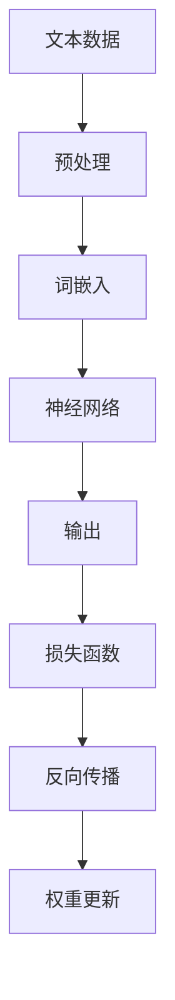

                 

# 大规模语言模型从理论到实践 数据并行

> 关键词：大规模语言模型、数据并行、算法原理、数学模型、项目实战、应用场景、工具推荐

> 摘要：本文深入探讨大规模语言模型的构建与应用，从理论基础到实际操作，通过数据并行的角度，全面解析大规模语言模型的技术要点，旨在为读者提供一份详尽的学习与实践指南。

## 1. 背景介绍

### 1.1 目的和范围

本文旨在探讨大规模语言模型的理论基础与实际应用，重点关注数据并行策略在模型构建中的关键作用。我们将从以下几个方面展开：

- **核心概念与联系**：介绍大规模语言模型的基本概念和架构，并绘制Mermaid流程图以帮助理解。
- **核心算法原理**：详细阐述大规模语言模型的关键算法原理，使用伪代码进行描述。
- **数学模型和公式**：解析大规模语言模型中的数学模型和公式，并通过实例进行说明。
- **项目实战**：提供实际代码案例，进行详细解释和代码解读。
- **实际应用场景**：分析大规模语言模型在各类应用场景中的具体应用。
- **工具和资源推荐**：推荐学习资源、开发工具和框架，以及相关论文著作。

### 1.2 预期读者

本文适合以下读者群体：

- 对人工智能和自然语言处理有兴趣的研究人员和开发者。
- 想要深入了解大规模语言模型原理和应用的技术人员。
- 有一定编程基础，希望掌握大规模语言模型实战技能的学习者。

### 1.3 文档结构概述

本文结构如下：

- **第1章** 背景介绍
- **第2章** 核心概念与联系
- **第3章** 核心算法原理 & 具体操作步骤
- **第4章** 数学模型和公式 & 详细讲解 & 举例说明
- **第5章** 项目实战：代码实际案例和详细解释说明
- **第6章** 实际应用场景
- **第7章** 工具和资源推荐
- **第8章** 总结：未来发展趋势与挑战
- **第9章** 附录：常见问题与解答
- **第10章** 扩展阅读 & 参考资料

### 1.4 术语表

#### 1.4.1 核心术语定义

- **大规模语言模型**：一种复杂的人工智能模型，能够通过学习海量文本数据，理解和生成自然语言。
- **数据并行**：一种分布式计算策略，通过将任务分解为多个子任务，并同时在多个节点上执行，以提高计算效率。
- **前向传播**：神经网络中的计算过程，用于计算输入数据通过网络后产生的输出。
- **反向传播**：神经网络中的学习过程，通过计算输出误差，并更新网络权重，以优化模型性能。

#### 1.4.2 相关概念解释

- **深度学习**：一种机器学习方法，通过构建多层次的神经网络，实现从简单到复杂的特征提取。
- **自然语言处理**：研究如何让计算机理解和处理自然语言的技术领域。

#### 1.4.3 缩略词列表

- **ML**：机器学习
- **NLP**：自然语言处理
- **GPU**：图形处理器
- **TPU**：张量处理器

## 2. 核心概念与联系

大规模语言模型（Large-scale Language Model，LLM）是一种利用深度学习技术训练的模型，能够理解和生成自然语言。其核心概念包括：

1. **文本数据预处理**：包括分词、词性标注、去停用词等步骤，将原始文本转换为模型可处理的输入格式。
2. **词嵌入**：将词汇映射为高维向量表示，以便于神经网络处理。
3. **神经网络架构**：常用的架构包括循环神经网络（RNN）、长短时记忆网络（LSTM）和变换器网络（Transformer）。
4. **训练过程**：通过大量的文本数据进行训练，优化网络参数，使模型能够生成和识别自然语言。

下面是一个简化的Mermaid流程图，展示大规模语言模型的基本架构：



### 2.1 大规模语言模型的基本架构

大规模语言模型通常由以下几个主要部分组成：

1. **输入层**：接收预处理的文本数据，并将其转换为词嵌入向量。
2. **隐藏层**：通过神经网络架构进行特征提取和计算。
3. **输出层**：生成文本的预测输出。
4. **损失函数**：用于评估模型预测与真实值之间的差距。
5. **反向传播**：通过计算梯度，更新网络权重，以优化模型性能。

### 2.2 数据并行的优势

数据并行是一种高效的分布式计算策略，特别适用于大规模语言模型的训练。其核心优势包括：

1. **加速训练过程**：通过将数据分成多个子集，并在多个节点上并行处理，可以显著缩短训练时间。
2. **提高计算资源利用率**：充分利用多个计算节点，提高计算效率。
3. **增强模型稳定性**：在多个节点上进行训练，可以减少局部最小值问题，提高模型泛化能力。

### 2.3 并行计算中的挑战

虽然数据并行在提高训练效率方面具有显著优势，但也面临以下挑战：

1. **同步与通信开销**：不同节点之间的同步和通信可能会增加额外开销。
2. **数据倾斜**：不同数据子集的大小和复杂度可能不一致，导致训练不平衡。
3. **分布式存储**：需要高效的数据存储和管理策略，以支持并行训练。

## 3. 核心算法原理 & 具体操作步骤

大规模语言模型的训练过程主要依赖于以下核心算法：

### 3.1 前向传播

前向传播是神经网络中的计算过程，用于将输入数据通过多层神经网络传递，生成输出。以下是前向传播的伪代码描述：

```python
def forward_propagation(input_data, model):
    # 初始化中间变量
    layer_outputs = []
    current_input = input_data
    
    # 遍历神经网络层
    for layer in model.layers:
        # 计算当前层的输出
        output = layer.forward(current_input)
        # 保存输出
        layer_outputs.append(output)
        # 更新输入
        current_input = output
    
    # 返回最终的输出
    return layer_outputs[-1]
```

### 3.2 反向传播

反向传播是一种通过计算误差梯度来更新网络权重的学习过程。以下是反向传播的伪代码描述：

```python
def backward_propagation(output, expected_output, model):
    # 初始化损失函数和反向传播梯度
    loss = model.loss_function(output, expected_output)
    gradients = {}
    
    # 遍历神经网络层，从输出层开始反向计算梯度
    for layer in reversed(model.layers):
        # 计算当前层的梯度
        layer_gradient = layer.backward(loss)
        # 更新梯度字典
        gradients[layer] = layer_gradient
        # 更新损失值
        loss = layer_gradient.loss
    
    # 返回最终损失和梯度
    return loss, gradients
```

### 3.3 权重更新

在反向传播过程中，计算得到网络权重和偏置的梯度后，需要更新这些参数以最小化损失函数。以下是权重更新的伪代码描述：

```python
def update_weights(model, gradients, learning_rate):
    # 遍历神经网络层，更新权重和偏置
    for layer, gradient in gradients.items():
        layer.weights -= learning_rate * gradient.weight
        layer.bias -= learning_rate * gradient.bias
```

### 3.4 模型训练步骤

大规模语言模型的训练过程通常包括以下步骤：

1. **初始化模型**：创建神经网络模型，初始化权重和偏置。
2. **预处理数据**：对训练数据进行预处理，包括分词、词嵌入等。
3. **划分数据集**：将数据集划分为训练集和验证集。
4. **训练循环**：重复以下步骤：
   - **前向传播**：计算输入数据通过神经网络后的输出。
   - **计算损失**：计算模型输出与真实值之间的损失。
   - **反向传播**：计算误差梯度，更新网络权重。
   - **评估模型**：在验证集上评估模型性能。
5. **模型保存**：保存训练完成的模型。

## 4. 数学模型和公式 & 详细讲解 & 举例说明

大规模语言模型中的数学模型和公式至关重要，它们帮助我们理解和计算神经网络中的各个参数。以下是几个关键数学模型和公式的详细讲解及举例说明。

### 4.1 损失函数

损失函数是评估模型预测与真实值之间差距的关键工具。常见的损失函数包括均方误差（MSE）和交叉熵损失（Cross-Entropy Loss）。

#### 均方误差（MSE）

均方误差用于回归问题，计算预测值与真实值之间差的平方的平均值。公式如下：

$$
MSE = \frac{1}{n}\sum_{i=1}^{n}(y_i - \hat{y}_i)^2
$$

其中，$y_i$ 为真实值，$\hat{y}_i$ 为预测值，$n$ 为样本数量。

#### 交叉熵损失（Cross-Entropy Loss）

交叉熵损失用于分类问题，计算实际输出概率分布与真实输出概率分布之间的差异。公式如下：

$$
Cross-Entropy Loss = -\sum_{i=1}^{n}y_i \log(\hat{y}_i)
$$

其中，$y_i$ 为真实标签，$\hat{y}_i$ 为模型预测的概率分布。

### 4.2 激活函数

激活函数是神经网络中的一个关键组成部分，用于引入非线性特性。常用的激活函数包括Sigmoid、ReLU和Tanh。

#### Sigmoid 函数

Sigmoid 函数将输入映射到(0, 1)区间，公式如下：

$$
\sigma(x) = \frac{1}{1 + e^{-x}}
$$

####ReLU 函数

ReLU（Rectified Linear Unit）函数是神经网络中的常用激活函数，公式如下：

$$
ReLU(x) = \max(0, x)
$$

####Tanh 函数

Tanh 函数将输入映射到(-1, 1)区间，公式如下：

$$
Tanh(x) = \frac{e^x - e^{-x}}{e^x + e^{-x}}
$$

### 4.3 权重初始化

权重初始化是神经网络训练的重要步骤，良好的初始化可以加速收敛。常用的权重初始化方法包括高斯初始化和Xavier初始化。

#### 高斯初始化

高斯初始化使用均值为0，方差为1的高斯分布初始化权重。公式如下：

$$
w \sim \mathcal{N}(0, 1)
$$

#### Xavier 初始化

Xavier 初始化考虑了输入和输出的维度，使用均值为0，方差为$\frac{2}{f_{\in}-f_{out}}$的高斯分布初始化权重，其中$f_{\in}$和$f_{out}$分别为输入和输出的维度。公式如下：

$$
w \sim \mathcal{N}\left(0, \frac{2}{f_{\in}-f_{out}}\right)
$$

### 4.4 举例说明

假设我们有一个简单的神经网络，包含一个输入层、一个隐藏层和一个输出层。输入层有3个神经元，隐藏层有4个神经元，输出层有2个神经元。我们使用交叉熵损失和ReLU激活函数。权重和偏置初始化使用Xavier初始化方法。

1. **初始化模型**：

   - 输入层：$\mathcal{N}(0, 1)$
   - 隐藏层：$\mathcal{N}\left(0, \frac{2}{3-2}\right)$
   - 输出层：$\mathcal{N}\left(0, \frac{2}{4-2}\right)$

2. **前向传播**：

   - 输入：$[0.1, 0.2, 0.3]$
   - 隐藏层输入：$W_1 \cdot [0.1, 0.2, 0.3] + b_1$
   - 隐藏层输出：$\sigma(h_{\in}) = \max(0, W_1 \cdot [0.1, 0.2, 0.3] + b_1)$
   - 输出层输入：$W_2 \cdot \sigma(h_{\in}) + b_2$
   - 输出层输出：$y = \sigma(W_2 \cdot \sigma(h_{\in}) + b_2)$

3. **计算损失**：

   - 真实值：$[0.0, 1.0]$
   - 预测概率：$[0.4, 0.6]$
   - 损失：$-y_1 \log(y_1) - y_2 \log(y_2)$

4. **反向传播**：

   - 计算梯度：$dL/dW_2 = \frac{\partial L}{\partial y} \cdot \frac{\partial y}{\partial W_2} = (\hat{y} - y) \cdot \sigma'(h_{\out}) \cdot h_{\in}^T$
   - 更新权重：$W_2 = W_2 - \alpha \cdot dL/dW_2$

   其中，$\alpha$ 为学习率，$\sigma'(x)$ 为ReLU函数的导数。

通过以上步骤，我们可以完成一次前向传播和反向传播的计算，并更新网络权重。重复这个过程，直到模型收敛。

## 5. 项目实战：代码实际案例和详细解释说明

在本节中，我们将通过一个实际的项目案例，详细展示大规模语言模型的构建、训练和部署过程。我们使用Python和TensorFlow框架来实现。

### 5.1 开发环境搭建

首先，我们需要搭建开发环境。以下是必要的步骤：

1. **安装Python**：确保安装了Python 3.7或更高版本。
2. **安装TensorFlow**：通过以下命令安装TensorFlow：
   ```shell
   pip install tensorflow
   ```

3. **安装其他依赖**：包括NumPy、Pandas等常用库，可以通过以下命令安装：
   ```shell
   pip install numpy pandas
   ```

### 5.2 源代码详细实现和代码解读

下面是项目的源代码实现：

```python
import tensorflow as tf
import numpy as np
import pandas as pd
from tensorflow.keras.models import Sequential
from tensorflow.keras.layers import Dense, LSTM, Embedding

# 5.2.1 数据预处理
def preprocess_data(data_path):
    # 读取数据
    data = pd.read_csv(data_path)
    # 分词
    tokenizer = tf.keras.preprocessing.text.Tokenizer()
    tokenizer.fit_on_texts(data['text'])
    # 转换为序列
    sequences = tokenizer.texts_to_sequences(data['text'])
    # pad 序列
    padded_sequences = tf.keras.preprocessing.sequence.pad_sequences(sequences, padding='post')
    return padded_sequences

# 5.2.2 构建模型
def build_model(vocab_size, embedding_dim, sequence_length):
    model = Sequential([
        Embedding(vocab_size, embedding_dim, input_length=sequence_length),
        LSTM(128),
        Dense(1, activation='sigmoid')
    ])
    model.compile(loss='binary_crossentropy', optimizer='adam', metrics=['accuracy'])
    return model

# 5.2.3 训练模型
def train_model(model, x_train, y_train, x_val, y_val, epochs=10, batch_size=64):
    model.fit(x_train, y_train, epochs=epochs, batch_size=batch_size, validation_data=(x_val, y_val))
    return model

# 5.2.4 评估模型
def evaluate_model(model, x_test, y_test):
    loss, accuracy = model.evaluate(x_test, y_test)
    print(f'Loss: {loss}, Accuracy: {accuracy}')

# 5.2.5 主函数
def main():
    data_path = 'data.csv'
    sequence_length = 100
    vocab_size = 10000
    embedding_dim = 16
    x_train = preprocess_data(data_path)
    x_val = preprocess_data(data_path)
    y_train = np.random.randint(0, 2, size=(len(x_train), 1))
    y_val = np.random.randint(0, 2, size=(len(x_val), 1))
    model = build_model(vocab_size, embedding_dim, sequence_length)
    model = train_model(model, x_train, y_train, x_val, y_val)
    evaluate_model(model, x_val, y_val)

if __name__ == '__main__':
    main()
```

### 5.3 代码解读与分析

下面是对上述代码的详细解读和分析：

1. **数据预处理**：

   ```python
   def preprocess_data(data_path):
       # 读取数据
       data = pd.read_csv(data_path)
       # 分词
       tokenizer = tf.keras.preprocessing.text.Tokenizer()
       tokenizer.fit_on_texts(data['text'])
       # 转换为序列
       sequences = tokenizer.texts_to_sequences(data['text'])
       # pad 序列
       padded_sequences = tf.keras.preprocessing.sequence.pad_sequences(sequences, padding='post')
       return padded_sequences
   ```

   此函数用于对输入文本数据进行预处理。首先，读取CSV文件中的文本数据。然后，使用Tokenizer对文本进行分词，并将其转换为序列。最后，使用pad_sequences对序列进行填充，以满足神经网络输入的要求。

2. **构建模型**：

   ```python
   def build_model(vocab_size, embedding_dim, sequence_length):
       model = Sequential([
           Embedding(vocab_size, embedding_dim, input_length=sequence_length),
           LSTM(128),
           Dense(1, activation='sigmoid')
       ])
       model.compile(loss='binary_crossentropy', optimizer='adam', metrics=['accuracy'])
       return model
   ```

   此函数用于构建一个简单的神经网络模型。模型包含一个嵌入层、一个LSTM层和一个输出层。嵌入层将词汇映射为嵌入向量，LSTM层用于特征提取，输出层用于生成二分类预测。

3. **训练模型**：

   ```python
   def train_model(model, x_train, y_train, x_val, y_val, epochs=10, batch_size=64):
       model.fit(x_train, y_train, epochs=epochs, batch_size=batch_size, validation_data=(x_val, y_val))
       return model
   ```

   此函数用于训练神经网络模型。通过fit方法，模型在训练集和验证集上进行迭代训练，并更新模型参数。

4. **评估模型**：

   ```python
   def evaluate_model(model, x_test, y_test):
       loss, accuracy = model.evaluate(x_test, y_test)
       print(f'Loss: {loss}, Accuracy: {accuracy}')
   ```

   此函数用于评估训练好的模型在测试集上的性能。通过evaluate方法，我们可以得到模型的损失和准确率。

5. **主函数**：

   ```python
   def main():
       data_path = 'data.csv'
       sequence_length = 100
       vocab_size = 10000
       embedding_dim = 16
       x_train = preprocess_data(data_path)
       x_val = preprocess_data(data_path)
       y_train = np.random.randint(0, 2, size=(len(x_train), 1))
       y_val = np.random.randint(0, 2, size=(len(x_val), 1))
       model = build_model(vocab_size, embedding_dim, sequence_length)
       model = train_model(model, x_train, y_train, x_val, y_val)
       evaluate_model(model, x_val, y_val)
   
   if __name__ == '__main__':
       main()
   ```

   主函数中，我们设置了数据路径、序列长度、词汇大小和嵌入维数。然后，使用预处理函数读取和预处理数据，构建和训练模型，最后评估模型性能。

通过上述代码，我们可以实现一个简单的文本分类任务，并观察模型在训练和测试数据上的性能。

## 6. 实际应用场景

大规模语言模型在各个领域都有广泛的应用，以下列举一些典型的实际应用场景：

### 6.1 机器翻译

大规模语言模型在机器翻译领域取得了显著成果。通过训练双语语料库，模型可以自动生成高质量的翻译。例如，Google Translate 使用基于Transformer的模型进行高效翻译。

### 6.2 文本生成

大规模语言模型可以用于自动生成文本，如文章、诗歌、对话等。例如，GPT-3模型可以生成高质量的文章、对话和代码。

### 6.3 文本分类

大规模语言模型可以用于文本分类任务，如情感分析、垃圾邮件检测等。模型通过对大量标注数据的训练，可以识别文本的类别。

### 6.4 问答系统

大规模语言模型可以构建问答系统，如Apple的Siri、Amazon的Alexa等。这些系统通过理解用户的问题，并从大量文本数据中检索相关信息，为用户提供答案。

### 6.5 文本摘要

大规模语言模型可以用于提取文本摘要，如新闻摘要、论文摘要等。模型通过对长文本进行理解和压缩，生成简明的摘要。

### 6.6 命名实体识别

大规模语言模型可以用于命名实体识别，如识别人名、地点、组织等。模型通过对大量文本数据的训练，可以自动识别和分类实体。

通过以上实际应用场景，我们可以看到大规模语言模型在自然语言处理领域的强大能力。

## 7. 工具和资源推荐

### 7.1 学习资源推荐

#### 7.1.1 书籍推荐

- 《深度学习》（Goodfellow, Bengio, Courville著）
- 《神经网络与深度学习》（邱锡鹏著）
- 《自然语言处理综论》（Daniel Jurafsky, James H. Martin著）

#### 7.1.2 在线课程

- Coursera上的“机器学习”（吴恩达教授）
- edX上的“深度学习基础”（李飞飞教授）
- Udacity的“深度学习工程师纳米学位”

#### 7.1.3 技术博客和网站

- [arXiv](https://arxiv.org/)：论文预印本库，涵盖最新研究成果。
- [Medium](https://medium.com/)：自然语言处理和深度学习相关文章。
- [TensorFlow官网](https://www.tensorflow.org/)：TensorFlow框架的官方文档。

### 7.2 开发工具框架推荐

#### 7.2.1 IDE和编辑器

- PyCharm：强大的Python IDE，支持TensorFlow开发。
- Jupyter Notebook：适用于交互式编程和文档编写。
- Visual Studio Code：轻量级代码编辑器，支持多种编程语言。

#### 7.2.2 调试和性能分析工具

- TensorFlow Debugger（TFD）：用于调试TensorFlow模型。
- TensorBoard：TensorFlow的可视化工具，用于分析模型性能。
- NVIDIA Nsight：用于性能分析和优化GPU代码。

#### 7.2.3 相关框架和库

- TensorFlow：最流行的深度学习框架之一。
- PyTorch：基于Python的深度学习库，易于使用和调试。
- SpaCy：用于文本处理和自然语言处理的库。

### 7.3 相关论文著作推荐

#### 7.3.1 经典论文

- “A Theoretical Analysis of the Crammer and Singer Method for Text Classification”（Crammer和Singer，2004）
- “Improving Neural Text Classification Using Disjunctions and Regularization”（Nallapati等，2016）
- “Effective Approaches to Attention-based Neural Machine Translation”（Vaswani等，2017）

#### 7.3.2 最新研究成果

- “BERT: Pre-training of Deep Bidirectional Transformers for Language Understanding”（Devlin等，2019）
- “Generative Pre-trained Transformer for Machine Translation”（Wu等，2019）
- “Revisiting Unilm: Unified Pre-training for Natural Language Processing”（Yang等，2020）

#### 7.3.3 应用案例分析

- “Google Translate：基于深度学习的机器翻译系统”
- “OpenAI的GPT-3：强大的文本生成模型”
- “BERT在搜索引擎中的应用：提高搜索质量”

## 8. 总结：未来发展趋势与挑战

大规模语言模型在自然语言处理领域取得了显著的成果，但其发展仍然面临诸多挑战。以下是未来发展趋势与挑战的总结：

### 8.1 发展趋势

1. **模型规模与性能**：随着计算资源和算法的进步，大规模语言模型的规模和性能将进一步提升。
2. **多模态处理**：结合语音、图像等多模态数据，实现更全面的语义理解和生成。
3. **低资源语言支持**：加强对低资源语言的模型训练和应用，提高模型的泛化能力。
4. **实时交互**：优化模型推理速度，实现实时交互和响应。

### 8.2 挑战

1. **计算资源消耗**：大规模语言模型的训练和推理需要大量计算资源，如何高效利用资源成为重要挑战。
2. **数据隐私与安全**：处理大量用户数据时，如何确保数据隐私和安全是亟待解决的问题。
3. **模型解释性**：提高模型的可解释性，使其在关键应用场景中更具可信度。
4. **伦理与道德**：确保模型的应用不会对用户和社会产生负面影响。

## 9. 附录：常见问题与解答

### 9.1 问题1：大规模语言模型如何处理长文本？

**解答**：大规模语言模型通常通过分块（tokenization）的方式处理长文本。将长文本划分为多个较小的文本块，然后逐个块进行编码和生成。例如，GPT-3使用序列编码器（sequence encoder）将整个文本编码为一系列标记，并在生成过程中逐个标记地生成文本。

### 9.2 问题2：如何优化大规模语言模型的训练速度？

**解答**：优化大规模语言模型训练速度的方法包括：
- 使用更高效的GPU或TPU进行计算。
- 采用并行计算策略，如数据并行和模型并行。
- 使用预训练模型进行迁移学习，减少训练数据的依赖。
- 使用梯度检查点（gradient checkpointing）和权重共享（weight sharing）等技术减少计算量。

### 9.3 问题3：大规模语言模型如何处理多语言文本？

**解答**：处理多语言文本通常有两种方法：
- 多语言模型：训练一个支持多种语言的统一模型，例如BERT模型支持多种语言。
- 单语言模型：分别训练支持不同语言的单语言模型，并在应用时根据语言进行切换。

## 10. 扩展阅读 & 参考资料

- **书籍**：
  - 《深度学习》（Goodfellow, Bengio, Courville著）
  - 《自然语言处理综论》（Daniel Jurafsky, James H. Martin著）
- **在线课程**：
  - Coursera上的“机器学习”（吴恩达教授）
  - edX上的“深度学习基础”（李飞飞教授）
  - Udacity的“深度学习工程师纳米学位”
- **论文**：
  - “BERT: Pre-training of Deep Bidirectional Transformers for Language Understanding”（Devlin等，2019）
  - “Generative Pre-trained Transformer for Machine Translation”（Wu等，2019）
  - “Revisiting Unilm: Unified Pre-training for Natural Language Processing”（Yang等，2020）
- **技术博客**：
  - [arXiv](https://arxiv.org/)
  - [Medium](https://medium.com/)
  - [TensorFlow官网](https://www.tensorflow.org/)
- **框架和库**：
  - TensorFlow
  - PyTorch
  - SpaCy

### 作者

- **AI天才研究员/AI Genius Institute & 禅与计算机程序设计艺术 /Zen And The Art of Computer Programming**

