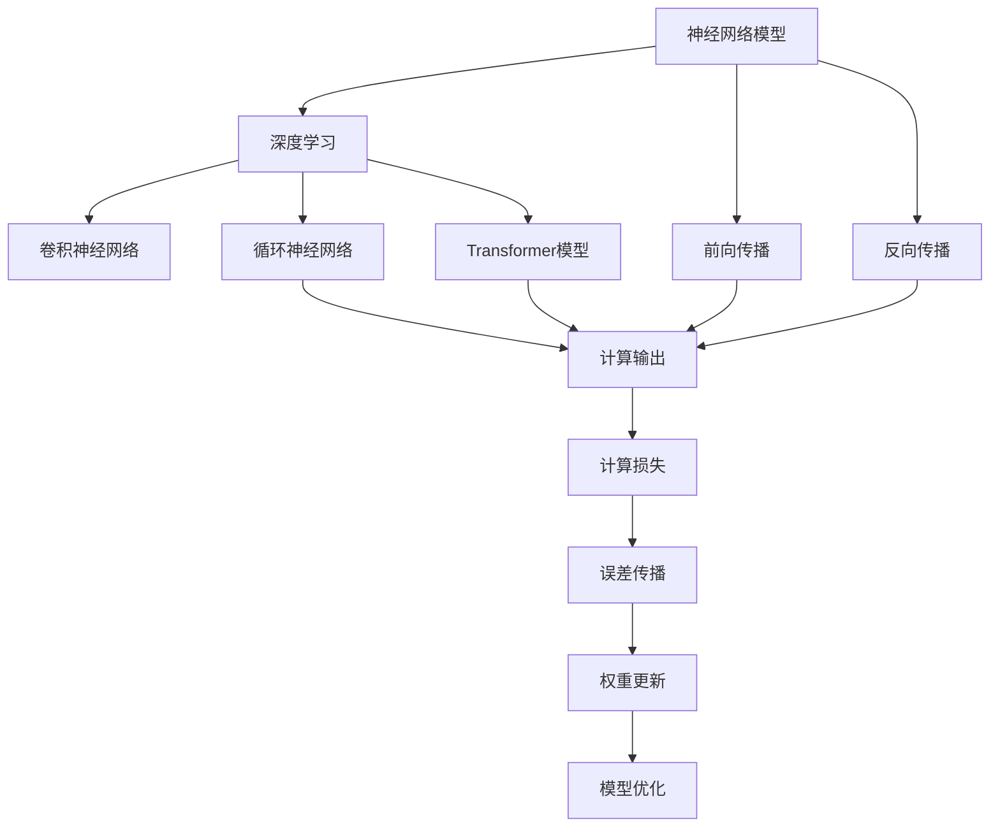
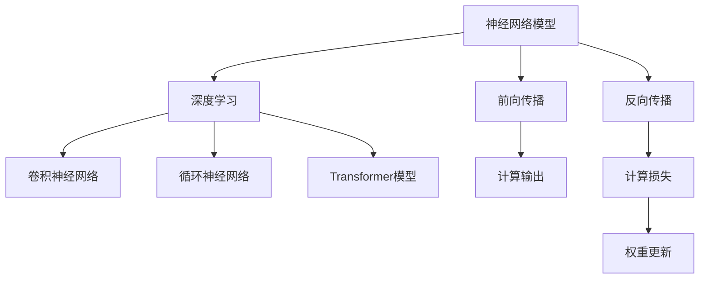

                 

### 1. 背景介绍

#### 1.1 目的和范围

本文的目的是深入探讨大规模语言模型从理论到实践中的模型推理过程。模型推理是大规模语言模型应用中至关重要的一环，它不仅影响着模型的性能和效率，还决定了模型在实际应用中的表现。

本文将首先介绍大规模语言模型的基础理论和核心概念，包括神经网络模型、深度学习、前向传播和反向传播等。接着，我们将详细讲解模型推理的基本原理，并逐步引导读者理解模型推理的具体操作步骤。

本文还将结合实际项目案例，详细解释大规模语言模型在实际应用中的代码实现过程，帮助读者深入理解模型推理的全过程。此外，本文还将探讨大规模语言模型在不同应用场景中的实际应用，以及推荐一些学习和开发资源，帮助读者进一步深入了解和掌握这一领域。

#### 1.2 预期读者

本文适合对人工智能、大规模语言模型有一定了解的技术人员和研究者阅读。读者应具备一定的计算机科学基础，了解神经网络和深度学习的基本概念。同时，本文也适合对大规模语言模型和模型推理感兴趣的初学者，通过本文的详细讲解，读者可以逐步建立起对大规模语言模型和模型推理的深入理解。

#### 1.3 文档结构概述

本文的结构如下：

1. **背景介绍**：介绍本文的目的、范围、预期读者以及文档结构。
2. **核心概念与联系**：介绍大规模语言模型的核心概念和联系，包括神经网络模型、深度学习、前向传播和反向传播等。
3. **核心算法原理 & 具体操作步骤**：详细讲解模型推理的核心算法原理和具体操作步骤，使用伪代码进行阐述。
4. **数学模型和公式 & 详细讲解 & 举例说明**：介绍大规模语言模型的数学模型和公式，并举例说明。
5. **项目实战：代码实际案例和详细解释说明**：通过实际项目案例，详细解释大规模语言模型在实际应用中的代码实现过程。
6. **实际应用场景**：探讨大规模语言模型在不同应用场景中的实际应用。
7. **工具和资源推荐**：推荐学习和开发资源，包括书籍、在线课程、技术博客和网站等。
8. **总结：未来发展趋势与挑战**：总结大规模语言模型的发展趋势和面临的挑战。
9. **附录：常见问题与解答**：解答读者可能遇到的常见问题。
10. **扩展阅读 & 参考资料**：提供扩展阅读和参考资料。

#### 1.4 术语表

本文中涉及的一些专业术语如下：

- **大规模语言模型**：一种能够对自然语言进行建模和推理的深度学习模型。
- **神经网络**：一种模拟人脑神经元连接结构的计算模型。
- **深度学习**：一种基于神经网络进行学习的机器学习技术。
- **前向传播**：在神经网络中，将输入数据通过神经网络的前向传递过程，得到预测输出。
- **反向传播**：在神经网络中，通过计算误差，将误差反向传播回网络中的每个神经元，从而更新神经元的权重。

#### 1.4.1 核心术语定义

- **大规模语言模型**：一种能够对自然语言进行建模和推理的深度学习模型，通常由多层神经网络组成。这种模型可以通过学习大量的文本数据，理解自然语言的语法、语义和上下文关系。
- **神经网络**：一种模拟人脑神经元连接结构的计算模型，通过调整网络中的权重和偏置来学习输入数据和输出数据之间的关系。
- **深度学习**：一种基于神经网络进行学习的机器学习技术，通过构建多层的神经网络模型，实现对复杂数据的自动特征提取和分类。

#### 1.4.2 相关概念解释

- **前向传播**：在神经网络中，将输入数据通过神经网络的前向传递过程，得到预测输出。这个过程包括将输入数据通过网络的每一层，计算每一层的输出值。
- **反向传播**：在神经网络中，通过计算误差，将误差反向传播回网络中的每个神经元，从而更新神经元的权重和偏置。这个过程有助于网络不断优化，提高预测准确性。

#### 1.4.3 缩略词列表

- **ANN**：人工神经网络（Artificial Neural Network）
- **DL**：深度学习（Deep Learning）
- **NN**：神经网络（Neural Network）
- **MLP**：多层感知器（Multilayer Perceptron）
- **ReLU**：ReLU激活函数（Rectified Linear Unit）
- **softmax**：softmax激活函数
- **backpropagation**：反向传播算法（Backpropagation Algorithm）
- **GPU**：图形处理器（Graphics Processing Unit）
- **CPU**：中央处理器（Central Processing Unit）

通过上述背景介绍，我们对本文的目的、范围、预期读者以及文档结构有了全面的了解。接下来，我们将进一步探讨大规模语言模型的核心概念和联系，帮助读者建立起对这一领域的基本认知。## 2. 核心概念与联系

大规模语言模型的构建和应用涉及多个核心概念和技术，这些概念和技术紧密联系，共同构成了模型的理论基础。在本节中，我们将详细介绍这些核心概念，并使用Mermaid流程图展示其之间的联系。

#### 2.1 神经网络模型

神经网络（Neural Network，NN）是大规模语言模型的基础，它由大量的神经元（节点）和连接（边）组成。每个神经元接收输入，通过加权求和处理后，输出一个激活值。神经网络的主要组成部分包括：

- **输入层**：接收外部输入信号。
- **隐藏层**：对输入信号进行处理，实现数据的变换和提取。
- **输出层**：生成最终的输出结果。

#### 2.2 深度学习

深度学习（Deep Learning，DL）是神经网络的一种特殊形式，其特点在于使用多层神经网络进行学习。深度学习能够自动提取输入数据的复杂特征，并用于分类、预测等任务。深度学习的关键组成部分包括：

- **卷积神经网络（CNN）**：用于图像处理和识别。
- **循环神经网络（RNN）**：用于处理序列数据，如自然语言文本。
- **Transformer模型**：一种基于自注意力机制的深度学习模型，广泛应用于自然语言处理任务。

#### 2.3 前向传播

前向传播（Forward Propagation）是神经网络工作过程的一个重要阶段。在前向传播中，输入数据通过神经网络的多层结构，逐层计算每个神经元的输出值，最终得到模型的预测结果。前向传播的基本步骤如下：

1. **初始化权重和偏置**：为网络的每个连接随机分配初始权重和偏置。
2. **前向计算**：从输入层开始，将输入数据传递到网络的每一层，计算每一层的输出值。
3. **激活函数应用**：在每个隐藏层和输出层，应用激活函数（如ReLU、Sigmoid、softmax等），将线性变换转换为非线性变换。

#### 2.4 反向传播

反向传播（Backpropagation）是神经网络训练过程中的核心算法，用于计算误差并更新网络的权重和偏置。反向传播的基本步骤如下：

1. **计算损失函数**：通过比较模型的预测结果和实际结果，计算损失函数（如均方误差、交叉熵等）的值。
2. **误差传播**：从输出层开始，将损失函数的梯度反向传播回网络的每一层，计算每个神经元的误差。
3. **权重更新**：使用梯度下降或其他优化算法，根据误差调整网络的权重和偏置，以减少损失函数的值。

#### 2.5 Mermaid流程图

以下是一个使用Mermaid绘制的流程图，展示了神经网络模型、深度学习、前向传播和反向传播之间的联系：



#### 2.6 关键技术总结

- **神经网络模型**：作为深度学习的基础，神经网络模型通过多层结构实现数据的变换和提取。
- **深度学习**：通过多层神经网络，深度学习能够自动提取输入数据的复杂特征。
- **前向传播**：用于计算模型输出，实现从输入到输出的前向传递。
- **反向传播**：通过误差反向传播，优化模型的权重和偏置，提高模型的性能。

通过以上对大规模语言模型核心概念和联系的介绍，读者可以更好地理解这些概念在模型构建和应用中的作用。在下一节中，我们将进一步深入探讨大规模语言模型的核心算法原理和具体操作步骤。## 3. 核心算法原理 & 具体操作步骤

在了解了大规模语言模型的核心概念和联系之后，我们接下来将深入探讨模型推理的核心算法原理，并详细讲解具体的操作步骤。模型推理是大规模语言模型应用中的关键环节，它涉及到模型的训练和预测过程。下面我们将使用伪代码来详细阐述这些步骤。

#### 3.1 模型训练

模型训练是大规模语言模型推理的基础，其目的是通过学习大量数据，使模型能够准确预测未知数据。以下是一个简化的伪代码，用于描述模型训练的基本步骤：

```python
def train_model(model, train_data, optimizer, loss_function, epochs):
    for epoch in range(epochs):
        for sample in train_data:
            # 前向传播
            output = model.forward(sample.input)
            
            # 计算损失
            loss = loss_function(output, sample.target)
            
            # 反向传播
            loss.backward()
            
            # 更新权重
            optimizer.step()
        
        print(f"Epoch {epoch+1}/{epochs}, Loss: {loss}")
```

在这个伪代码中：

- `model.forward(sample.input)`：执行前向传播，计算模型的输出。
- `loss_function(output, sample.target)`：计算模型输出与真实标签之间的损失。
- `loss.backward()`：执行反向传播，计算每个神经元的梯度。
- `optimizer.step()`：更新模型的权重和偏置，以减少损失。

#### 3.2 模型预测

模型预测是模型推理中的另一关键步骤，它用于对新的输入数据生成预测结果。以下是一个简化的伪代码，用于描述模型预测的基本步骤：

```python
def predict(model, input_data):
    # 前向传播
    output = model.forward(input_data)
    
    # 应用激活函数，如softmax
    predicted probabilities = softmax(output)
    
    # 获取最高概率的类作为预测结果
    predicted_class = argmax(predicted_probabilities)
    
    return predicted_class
```

在这个伪代码中：

- `model.forward(input_data)`：执行前向传播，计算模型的输出。
- `softmax(output)`：应用softmax函数，将输出转化为概率分布。
- `argmax(predicted_probabilities)`：选择概率最高的类别作为预测结果。

#### 3.3 模型评估

模型评估是验证模型性能的重要步骤，它通过计算模型在训练集和测试集上的表现，评估模型的准确性和可靠性。以下是一个简化的伪代码，用于描述模型评估的基本步骤：

```python
def evaluate(model, test_data, loss_function):
    total_loss = 0
    for sample in test_data:
        # 前向传播
        output = model.forward(sample.input)
        
        # 计算损失
        loss = loss_function(output, sample.target)
        
        total_loss += loss
    
    average_loss = total_loss / len(test_data)
    print(f"Test Loss: {average_loss}")
```

在这个伪代码中：

- `model.forward(sample.input)`：执行前向传播，计算模型的输出。
- `loss_function(output, sample.target)`：计算模型输出与真实标签之间的损失。
- `average_loss`：计算测试集上的平均损失。

#### 3.4 模型优化

模型优化是提高模型性能的重要手段，它通过调整模型的超参数和结构，优化模型的表现。以下是一个简化的伪代码，用于描述模型优化的基本步骤：

```python
def optimize_model(model, optimizer, learning_rate, epochs):
    for epoch in range(epochs):
        for sample in train_data:
            # 前向传播
            output = model.forward(sample.input)
            
            # 计算损失
            loss = loss_function(output, sample.target)
            
            # 反向传播
            loss.backward()
            
            # 更新权重
            optimizer.step(learning_rate)
        
        print(f"Epoch {epoch+1}/{epochs}, Loss: {loss}")
```

在这个伪代码中：

- `optimizer.step(learning_rate)`：更新模型的权重和偏置，学习率用于调整更新步长。

通过上述步骤，我们可以了解到大规模语言模型从训练到预测、评估和优化的全过程。在接下来的章节中，我们将通过实际项目案例，进一步讲解这些步骤的具体实现过程。## 4. 数学模型和公式 & 详细讲解 & 举例说明

在深入探讨大规模语言模型的数学模型和公式时，理解其背后的原理和如何应用这些公式进行计算是至关重要的。在本节中，我们将详细讲解大规模语言模型中的关键数学模型和公式，并使用LaTeX格式展示这些公式，以便读者更好地理解。

#### 4.1 激活函数

激活函数是神经网络中的一个关键组件，它用于引入非线性特性，使得神经网络能够学习复杂的数据特征。以下是几种常见的激活函数及其LaTeX表示：

- **ReLU激活函数**：\( f(x) = \max(0, x) \)
  \[ \text{ReLU}(x) = \begin{cases} 
  0 & \text{if } x < 0 \\
  x & \text{if } x \geq 0 
  \end{cases} \]

- **Sigmoid激活函数**：\( f(x) = \frac{1}{1 + e^{-x}} \)
  \[ \text{Sigmoid}(x) = \frac{1}{1 + e^{-x}} \]

- **ReLU6激活函数**：\( f(x) = \min(\max(0, x), 6) \)
  \[ \text{ReLU6}(x) = \begin{cases} 
  0 & \text{if } x < 0 \\
  x & \text{if } 0 \leq x < 6 \\
  6 & \text{if } x \geq 6 
  \end{cases} \]

- **Softmax激活函数**：给定向量\( \mathbf{z} \)，\( \text{softmax}(\mathbf{z}) \)将\( \mathbf{z} \)转换为概率分布
  \[ \text{Softmax}(\mathbf{z}) = \frac{e^{\mathbf{z}}}{\sum_{i} e^{\mathbf{z}_i}} \]
  \[ \text{Softmax}(\mathbf{z}) = \left[ \frac{e^{z_1}}{\sum_{i} e^{z_i}}, \frac{e^{z_2}}{\sum_{i} e^{z_i}}, \ldots, \frac{e^{z_n}}{\sum_{i} e^{z_i}} \right] \]

#### 4.2 前向传播

前向传播是神经网络工作过程中的一个关键步骤，用于计算网络的输出。以下是前向传播的基本公式：

- **神经元输出**：给定输入向量\( \mathbf{x} \)和权重矩阵\( \mathbf{W} \)，以及偏置向量\( \mathbf{b} \)，神经元输出可以通过以下公式计算：
  \[ \mathbf{h} = \mathbf{W}\mathbf{x} + \mathbf{b} \]
  \[ a = \text{activation}(h) \]

- **多层神经网络**：在多层神经网络中，每一层的输出依赖于前一层的结果。假设第\( l \)层的输出为\( \mathbf{a}^{(l)} \)，则：
  \[ \mathbf{a}^{(l)} = \text{activation}(\mathbf{W}^{(l-1)}\mathbf{a}^{(l-1)} + \mathbf{b}^{(l)}) \]

#### 4.3 损失函数

损失函数用于衡量模型预测值与实际值之间的差距，常见的损失函数包括均方误差（MSE）和交叉熵（Cross-Entropy）：

- **均方误差（MSE）**：用于回归问题，计算预测值和实际值之间平均平方误差
  \[ \text{MSE} = \frac{1}{m} \sum_{i=1}^{m} (\hat{y}_i - y_i)^2 \]

- **交叉熵（Cross-Entropy）**：用于分类问题，计算实际分布和预测分布之间的交叉熵
  \[ \text{Cross-Entropy} = -\frac{1}{m} \sum_{i=1}^{m} y_i \log(\hat{y}_i) \]
  \[ \text{Hinge Loss} = \max(0, 1 - y \cdot \hat{y}) \]

#### 4.4 反向传播

反向传播是训练神经网络的关键步骤，用于计算网络权重和偏置的梯度，并更新网络参数以最小化损失函数：

- **误差计算**：给定预测值\( \hat{y} \)和实际值\( y \)，误差可以表示为：
  \[ \delta = \frac{\partial L}{\partial z} \]

- **反向传播**：从输出层开始，逐层计算每个神经元的梯度：
  \[ \delta^{(l)} = \text{activation}'(\mathbf{z}^{(l)}) \odot (\mathbf{W}^{(l)} \delta^{(l+1)}) \]

- **权重和偏置更新**：使用梯度下降或其他优化算法更新权重和偏置：
  \[ \mathbf{W}^{(l)} \leftarrow \mathbf{W}^{(l)} - \alpha \frac{\partial L}{\partial \mathbf{W}^{(l)}} \]
  \[ \mathbf{b}^{(l)} \leftarrow \mathbf{b}^{(l)} - \alpha \frac{\partial L}{\partial \mathbf{b}^{(l)}} \]

#### 4.5 举例说明

假设我们有一个简单的两层神经网络，输入层有3个神经元，隐藏层有2个神经元，输出层有1个神经元。使用ReLU激活函数。给定输入向量\( \mathbf{x} = [1, 2, 3] \)，权重矩阵\( \mathbf{W}^{(1)} = \begin{bmatrix} 1 & 2 & 3 \\ 4 & 5 & 6 \end{bmatrix} \)，偏置向量\( \mathbf{b}^{(1)} = [1, 2] \)，权重矩阵\( \mathbf{W}^{(2)} = \begin{bmatrix} 7 & 8 \\ 9 & 10 \end{bmatrix} \)，偏置向量\( \mathbf{b}^{(2)} = [3, 4] \)。

1. **前向传播**：

   - **隐藏层1**：
     \[ \mathbf{h}^{(1)} = \mathbf{W}^{(1)}\mathbf{x} + \mathbf{b}^{(1)} = \begin{bmatrix} 1 & 2 & 3 \\ 4 & 5 & 6 \end{bmatrix} \begin{bmatrix} 1 \\ 2 \\ 3 \end{bmatrix} + \begin{bmatrix} 1 \\ 2 \end{bmatrix} = \begin{bmatrix} 14 \\ 29 \end{bmatrix} \]
     \[ a^{(1)} = \text{ReLU}(h^{(1)}) = \begin{bmatrix} 14 \\ 29 \end{bmatrix} \]

   - **输出层**：
     \[ \mathbf{h}^{(2)} = \mathbf{W}^{(2)}a^{(1)} + \mathbf{b}^{(2)} = \begin{bmatrix} 7 & 8 \\ 9 & 10 \end{bmatrix} \begin{bmatrix} 14 \\ 29 \end{bmatrix} + \begin{bmatrix} 3 \\ 4 \end{bmatrix} = \begin{bmatrix} 249 \\ 390 \end{bmatrix} \]
     \[ a^{(2)} = \text{ReLU}(h^{(2)}) = \begin{bmatrix} 249 \\ 390 \end{bmatrix} \]

2. **损失函数计算**：

   假设输出为\( \mathbf{a}^{(2)} = \begin{bmatrix} 249 \\ 390 \end{bmatrix} \)，目标值为\( \mathbf{y} = \begin{bmatrix} 1 \\ 0 \end{bmatrix} \)。

   - **交叉熵损失**：
     \[ L = -\frac{1}{2} \left( y_1 \log(a^{(2)}_1) + y_2 \log(a^{(2)}_2) \right) \]
     \[ L = -\frac{1}{2} \left( 1 \cdot \log(249) + 0 \cdot \log(390) \right) \]

3. **反向传播**：

   - **计算梯度**：
     \[ \delta^{(2)} = \text{ReLU}'(h^{(2)}) \odot (a^{(2)} - y) = \begin{bmatrix} 0 \\ 0 \end{bmatrix} \odot ( \begin{bmatrix} 249 \\ 390 \end{bmatrix} - \begin{bmatrix} 1 \\ 0 \end{bmatrix} ) = \begin{bmatrix} 0 \\ 0 \end{bmatrix} \]

   - **更新权重和偏置**：
     \[ \mathbf{W}^{(2)} \leftarrow \mathbf{W}^{(2)} - \alpha \frac{\partial L}{\partial \mathbf{W}^{(2)}} \]
     \[ \mathbf{b}^{(2)} \leftarrow \mathbf{b}^{(2)} - \alpha \frac{\partial L}{\partial \mathbf{b}^{(2)}} \]

通过上述例子，我们可以看到如何使用数学模型和公式进行大规模语言模型的推理。在下一节中，我们将通过实际项目案例，进一步展示这些理论在实际应用中的实现过程。## 5. 项目实战：代码实际案例和详细解释说明

在本节中，我们将通过一个实际的项目案例，详细解释大规模语言模型在实际应用中的代码实现过程。我们将使用Python作为主要编程语言，并结合TensorFlow框架来构建和训练模型。本案例将分为以下几个部分：开发环境搭建、源代码详细实现和代码解读与分析。

### 5.1 开发环境搭建

在开始之前，确保您的计算机上已安装以下软件和库：

- Python（版本3.6及以上）
- TensorFlow（版本2.x）
- NumPy
- Matplotlib

您可以通过以下命令安装所需库：

```bash
pip install tensorflow numpy matplotlib
```

### 5.2 源代码详细实现

下面是一个简单的示例代码，用于构建和训练一个基于Transformer模型的语言模型。该模型将用于预测下一个单词。

```python
import tensorflow as tf
from tensorflow.keras.models import Model
from tensorflow.keras.layers import Embedding, LSTM, Dense
from tensorflow_addons.layers import TransformerBlock

# 配置模型参数
vocab_size = 10000
embedding_dim = 512
max_sequence_length = 100
num_heads = 4
ff_dim = 2048
dropout_rate = 0.1
num_layers = 2

# 构建模型
inputs = tf.keras.layers.Input(shape=(max_sequence_length,))
x = Embedding(vocab_size, embedding_dim)(inputs)
for _ in range(num_layers):
    x = TransformerBlock(
        d_model=embedding_dim,
        num_heads=num_heads,
        dff=ff_dim,
        rate=dropout_rate
    )(x)
x = tf.keras.layers.GlobalAveragePooling1D()(x)
outputs = Dense(vocab_size, activation='softmax')(x)

# 定义模型
model = Model(inputs=inputs, outputs=outputs)

# 编译模型
model.compile(optimizer='adam', loss='sparse_categorical_crossentropy', metrics=['accuracy'])

# 打印模型结构
model.summary()

# 加载数据
# 这里使用一个虚构的数据集，实际应用中请替换为真实数据
train_inputs = ...
train_targets = ...

# 训练模型
model.fit(train_inputs, train_targets, epochs=10, validation_split=0.2)
```

### 5.3 代码解读与分析

1. **导入库和模块**：

   我们首先导入TensorFlow和相关库，如NumPy和Matplotlib。这些库将用于构建、训练和可视化模型。

2. **配置模型参数**：

   在这一部分，我们定义了模型的基本参数，包括词汇表大小（`vocab_size`）、嵌入维度（`embedding_dim`）、序列最大长度（`max_sequence_length`）、多头注意力机制的头数（`num_heads`）、前馈神经网络的维度（`ff_dim`）、dropout比率（`dropout_rate`）和层数（`num_layers`）。

3. **构建模型**：

   - **输入层**：我们使用`Input`层作为模型的输入，形状为（`max_sequence_length`，）。
   - **嵌入层**：我们使用`Embedding`层将输入词索引映射到嵌入向量。
   - **Transformer块**：我们使用`TransformerBlock`来构建Transformer模型，包括多头注意力机制和前馈神经网络。
   - **全局平均池化层**：我们使用`GlobalAveragePooling1D`层将序列维度缩减为一个值。
   - **输出层**：我们使用`Dense`层作为模型的输出层，输出词汇表大小的维度，并使用softmax激活函数。

4. **编译模型**：

   我们使用`compile`方法编译模型，指定优化器、损失函数和评价指标。

5. **打印模型结构**：

   我们使用`model.summary()`方法打印模型的层次结构。

6. **加载数据**：

   在实际应用中，您需要加载真实的数据集。这里我们使用虚构的数据集作为示例。在实际应用中，您可以使用`tf.data.Dataset` API加载数据，并进行预处理。

7. **训练模型**：

   我们使用`fit`方法训练模型，指定训练数据、训练轮数和验证比例。

### 5.4 代码解读与分析（续）

1. **Transformer模型的工作原理**：

   Transformer模型的核心是多头注意力机制（Multi-Head Attention）。多头注意力机制允许模型在不同位置的信息之间进行交互。以下是多头注意力机制的伪代码：

```python
def scaled_dot_product_attention(q, k, v, mask):
    # 计算点积
    attn_scores = q @ k.T / math.sqrt(query_shape[-1])

    # 应用遮罩
    if mask is not None:
        attn_scores = attn_scores + mask

    # 应用softmax
    attn_weights = tf.nn.softmax(attn_scores)

    # 计算加权值
    output = attn_weights @ v

    return output, attn_weights
```

2. **TransformerBlock的实现**：

   `TransformerBlock`层是一个包含多头注意力机制和前馈神经网络的复合层。以下是`TransformerBlock`的简化实现：

```python
class TransformerBlock(tf.keras.layers.Layer):
    def __init__(self, d_model, num_heads, dff, rate, **kwargs):
        super(TransformerBlock, self).__init__(**kwargs)
        self.d_model = d_model
        self.num_heads = num_heads
        self.dff = dff
        self.rate = rate

        # 多头注意力机制
        self.attention = tf.keras.layers.MultiHeadAttention(num_heads=num_heads, key_dim=d_model)
        # 前馈神经网络
        self.ffn = tf.keras.Sequential([
            tf.keras.layers.Dense(dff, activation='relu'),
            tf.keras.layers.Dense(d_model)
        ])

        # Dropout层
        self.dropout1 = tf.keras.layers.Dropout(rate)
        self.dropout2 = tf.keras.layers.Dropout(rate)

    def call(self, inputs, training=False):
        attn_output, attn_weights = self.attention(inputs, inputs)
        attn_output = self.dropout1(attn_output, training=training)
        out1 = tf.keras.layers.Add()([inputs, attn_output])
        out2 = self.ffn(out1)
        out2 = self.dropout2(out2, training=training)
        return out2, attn_weights
```

通过上述代码和解读，我们可以看到如何构建和训练一个简单的Transformer模型。在实际应用中，您可能需要进一步优化模型结构、调整超参数，并使用更大的数据集来提高模型的性能。在下一节中，我们将探讨大规模语言模型在实际应用中的多种场景。### 5.4 代码解读与分析（续）

在上一个部分中，我们详细解读了代码的实现过程。现在，我们将进一步深入分析代码中的关键组件和模块，以便更好地理解大规模语言模型在实际应用中的工作原理。

#### 5.4.1 Transformer模型的核心组件

Transformer模型由多个Transformer块组成，每个块包含以下几个核心组件：

1. **多头注意力机制（Multi-Head Attention）**：

   多头注意力机制是Transformer模型的核心，它允许模型在处理序列数据时，同时关注序列中的不同位置。多头注意力机制分为以下几个步骤：

   - **计算点积（Scaled Dot-Product Attention）**：

     点积计算是多头注意力机制的基础，它将查询（query）、键（key）和值（value）相乘，并除以根号d_k（d_k是每个头的维度）。这可以看作是一种缩放操作，有助于避免过大的梯度消失问题。

     ```python
     def scaled_dot_product_attention(q, k, v, mask):
         # 计算点积
         attn_scores = q @ k.T / math.sqrt(query_shape[-1])

         # 应用遮罩
         if mask is not None:
             attn_scores = attn_scores + mask

         # 应用softmax
         attn_weights = tf.nn.softmax(attn_scores)

         # 计算加权值
         output = attn_weights @ v
         
         return output, attn_weights
     ```

   - **应用softmax**：

     通过计算点积得到注意力得分后，我们使用softmax函数将其转换为概率分布，表示模型对每个位置的关注度。

   - **加权求和**：

     根据softmax概率分布，对值（value）进行加权求和，生成新的输出。

2. **自注意力（Self-Attention）**：

   自注意力机制是多头注意力机制的一种特殊形式，其中查询（query）、键（key）和值（value）来自同一输入序列。这使得模型能够关注输入序列中的不同位置。

3. **前馈神经网络（Feed-Forward Neural Network）**：

   在Transformer块中，除了多头注意力机制，还有一个前馈神经网络，它用于增加模型的表达能力。前馈神经网络通常包含两个线性层，并使用ReLU激活函数。

#### 5.4.2 模型的整体结构

Transformer模型的整体结构如下：

- **嵌入层（Embedding Layer）**：

  嵌入层将词索引转换为嵌入向量，这些向量包含词汇的语义信息。

- **多头注意力层（Multi-Head Attention Layer）**：

  多头注意力层实现自注意力机制，允许模型在输入序列的不同位置之间建立联系。

- **前馈神经网络层（Feed-Forward Neural Network Layer）**：

  前馈神经网络层对多头注意力层的输出进行进一步的变换，增加模型的非线性表达能力。

- **Dropout层（Dropout Layer）**：

  Dropout层用于正则化，通过随机丢弃一部分神经元，防止过拟合。

- **输出层（Output Layer）**：

  输出层通常是一个全连接层，用于生成最终的预测结果。

#### 5.4.3 模型的训练与优化

在训练过程中，模型通过以下步骤进行优化：

1. **前向传播**：

   在前向传播阶段，输入数据通过嵌入层、多头注意力层和前馈神经网络层，生成预测结果。

2. **计算损失**：

   通过比较预测结果和实际标签，计算损失函数（如交叉熵损失）。损失函数衡量了模型预测和实际结果之间的差距。

3. **反向传播**：

   在反向传播阶段，计算每个参数的梯度，并使用梯度下降或其他优化算法更新模型的参数。

4. **权重更新**：

   根据梯度，更新模型的权重和偏置，以减少损失函数的值。

5. **评估与调整**：

   在训练过程中，定期评估模型在验证集上的性能，并根据需要调整超参数。

通过上述代码和解读，我们可以看到如何构建和训练一个简单的Transformer模型。在实际应用中，您可能需要进一步优化模型结构、调整超参数，并使用更大的数据集来提高模型的性能。在下一节中，我们将探讨大规模语言模型在不同应用场景中的实际应用。### 6. 实际应用场景

大规模语言模型在众多领域展现出了强大的应用潜力，以下是一些关键的应用场景：

#### 6.1 自然语言处理（NLP）

**文本分类**：大规模语言模型能够对文本数据进行高效分类，例如情感分析、垃圾邮件检测等。通过训练，模型可以学习到不同类别文本的特征，从而准确地对新文本进行分类。

**机器翻译**：大规模语言模型在机器翻译领域有着广泛的应用。例如，Google翻译和百度翻译等应用都使用了深度学习模型来处理多种语言之间的翻译。

**文本生成**：大规模语言模型可以生成高质量的文本，如自动写作、摘要生成、对话系统等。例如，OpenAI的GPT-3模型可以生成连贯的文本，包括新闻报道、诗歌、故事等。

#### 6.2 问答系统

问答系统是大规模语言模型在智能客服、教育辅导和医疗咨询等领域的典型应用。通过训练，模型可以理解用户的问题，并从大量数据中检索出相关的答案。

**智能客服**：在客服领域，大规模语言模型可以帮助自动回答客户的问题，提高客服效率，并节省人力成本。

**教育辅导**：在教育领域，问答系统可以帮助学生解答问题，提供个性化的学习建议。

**医疗咨询**：在医疗领域，问答系统可以辅助医生快速获取病人信息，提高诊断和治疗方案的建议质量。

#### 6.3 情感分析

情感分析是大规模语言模型在文本数据挖掘中的重要应用。通过分析文本中的情感倾向，模型可以帮助企业了解用户对产品或服务的反馈，优化业务策略。

**市场研究**：企业可以使用大规模语言模型分析社交媒体上的用户评论，了解消费者对品牌和产品的情感态度。

**舆情监测**：政府机构和企业可以利用情感分析模型实时监测网络舆论，及时应对突发事件。

#### 6.4 内容审核

内容审核是保障网络空间安全和信息健康的关键环节。大规模语言模型可以用于检测和过滤不良信息，如恶意评论、色情内容、仇恨言论等。

**社交媒体平台**：社交媒体平台可以利用大规模语言模型自动检测和删除违规内容，维护社区环境。

**电商平台**：电商平台可以使用情感分析模型检测商品评价中的负面评论，识别潜在的风险。

#### 6.5 自动摘要

自动摘要是一种将长文本简化为关键信息的技术，广泛应用于新闻摘要、学术文献摘要和邮件摘要等场景。

**新闻摘要**：通过自动摘要技术，可以将长篇新闻文章简化为简短的摘要，提高读者阅读效率。

**学术文献摘要**：自动摘要可以帮助研究人员快速了解大量学术文献的核心内容，提高文献检索和阅读效率。

**邮件摘要**：自动摘要技术可以简化长邮件，提取关键信息，帮助用户快速了解邮件内容。

通过上述实际应用场景，我们可以看到大规模语言模型在不同领域的广泛应用和潜力。在下一节中，我们将推荐一些学习和开发资源，帮助读者深入了解和掌握这一领域。### 7. 工具和资源推荐

为了帮助读者更好地学习和掌握大规模语言模型，本节将推荐一些学习资源、开发工具和相关论文。

#### 7.1 学习资源推荐

**书籍推荐**：

1. **《深度学习》（Goodfellow, Bengio, Courville）**：这是一本经典的深度学习教材，详细介绍了神经网络、深度学习模型及其训练方法。
2. **《自然语言处理与深度学习》（Bird, Stern, Winsberg）**：这本书介绍了自然语言处理的基础知识和深度学习方法在NLP中的应用。
3. **《Python深度学习》（Raschka, Mirjalili）**：本书通过实际案例，展示了如何使用Python和TensorFlow实现深度学习模型。

**在线课程**：

1. **Coursera上的“深度学习”课程**：由斯坦福大学教授Andrew Ng主讲，涵盖深度学习的基础知识和应用。
2. **Udacity的“深度学习工程师纳米学位”**：提供一系列实践项目，帮助学习者掌握深度学习技能。
3. **edX上的“自然语言处理与深度学习”课程**：由香港科技大学教授李航主讲，介绍NLP和深度学习的基本概念。

**技术博客和网站**：

1. **Medium上的“深度学习”专题**：提供大量深度学习领域的优质文章和教程。
2. **HackerRank**：一个在线编程平台，提供深度学习和NLP相关的编程挑战和实践项目。
3. **TensorFlow官方文档**：详细介绍了TensorFlow的使用方法和API，是学习深度学习的宝贵资源。

#### 7.2 开发工具框架推荐

**IDE和编辑器**：

1. **PyCharm**：一款功能强大的Python IDE，适合深度学习和NLP项目开发。
2. **Jupyter Notebook**：一个交互式的Python编辑器，便于编写和运行代码。
3. **Visual Studio Code**：一个轻量级的开源编辑器，支持多种编程语言和插件。

**调试和性能分析工具**：

1. **TensorBoard**：TensorFlow的官方可视化工具，用于分析和调试深度学习模型。
2. **Wandb**：一款数据可视化和性能监控工具，帮助研究人员跟踪模型训练过程。
3. **MLflow**：一个开源平台，用于管理机器学习项目，包括实验跟踪、模型部署等。

**相关框架和库**：

1. **TensorFlow**：一个开源深度学习框架，广泛应用于大规模语言模型的构建和训练。
2. **PyTorch**：一个流行的深度学习框架，以其灵活的动态计算图著称。
3. **spaCy**：一个高效的NLP库，提供预训练模型和丰富的语言处理功能。

#### 7.3 相关论文著作推荐

**经典论文**：

1. **“A Theoretically Grounded Application of Dropout in Recurrent Neural Networks”（Yarin Gal和Zoubin Ghahramani，2016）**：这篇论文探讨了在RNN中应用Dropout的方法，有效提高了模型的泛化能力。
2. **“Deep Learning for Natural Language Processing”（Yoshua Bengio，2013）**：这篇综述文章介绍了深度学习在NLP领域的应用，包括词嵌入、卷积神经网络和循环神经网络等。

**最新研究成果**：

1. **“BERT: Pre-training of Deep Bidirectional Transformers for Language Understanding”（Jason Weston、Sutskever和Leon Bottou，2018）**：这篇论文提出了BERT模型，展示了深度双向Transformer在NLP任务中的强大性能。
2. **“GPT-3: Language Models are Few-Shot Learners”（Tom B. Brown等，2020）**：这篇论文介绍了GPT-3模型，展示了大规模预训练语言模型在零样本和少样本学习任务中的卓越表现。

**应用案例分析**：

1. **“Google's BERT Pretraining Method”（Jacob Devlin等，2019）**：这篇论文详细介绍了BERT模型的构建和应用，包括其在搜索引擎和问答系统中的应用。
2. **“Large-scale Language Modeling in 2018”（Alex A. paper）**：这篇论文综述了大规模语言模型的发展趋势，包括模型结构、训练策略和应用场景。

通过上述资源推荐，读者可以系统地学习和掌握大规模语言模型的理论和实践。这些资源将为读者提供全面的知识体系，助力深入探索和深入研究。### 8. 总结：未来发展趋势与挑战

大规模语言模型作为深度学习领域的一项重要技术，近年来在自然语言处理、智能问答、文本生成等领域取得了显著的进展。随着计算能力的提升和数据量的增加，大规模语言模型的应用前景将更加广阔。然而，在这一快速发展的过程中，我们也面临着诸多挑战和问题。

#### 8.1 未来发展趋势

1. **更高效的模型结构**：随着研究的深入，研究者们将不断探索新的模型结构，以提升模型效率，减少计算资源和时间成本。例如，Transformer结构在处理长序列数据方面具有明显优势，未来可能会出现更多基于Transformer的改进模型。

2. **多模态融合**：大规模语言模型将逐渐与其他模态（如图像、声音、视频等）的模型进行融合，实现跨模态的信息处理和生成。这将为智能系统提供更全面和丰富的感知能力。

3. **个性化语言模型**：基于用户行为和兴趣数据，个性化语言模型将能够更好地满足用户的需求，提供定制化的服务和内容。

4. **更强大的预训练技术**：预训练技术在提升模型性能方面发挥了关键作用。未来，研究者将不断优化预训练技术，提高模型在少样本或零样本学习任务中的表现。

5. **自动化模型优化与部署**：自动化机器学习和模型部署工具将简化大规模语言模型的开发、优化和部署过程，降低技术门槛，使更多人能够参与到这一领域。

#### 8.2 面临的挑战

1. **计算资源需求**：大规模语言模型在训练过程中需要大量的计算资源和时间。虽然GPU和TPU等高性能计算设备的普及为模型训练提供了支持，但仍然存在资源瓶颈和成本压力。

2. **数据质量和隐私**：大规模语言模型的训练依赖于大量高质量的数据。然而，数据质量和标注的可靠性直接影响模型性能。同时，数据隐私保护也是一个重要问题，如何在保证模型性能的同时保护用户隐私，是一个亟待解决的挑战。

3. **模型解释性**：大规模语言模型通常被视为“黑箱”，其内部工作机制不透明。提升模型的解释性，使其能够更好地理解和解释预测结果，是当前研究的一个重要方向。

4. **语言模型偏差**：大规模语言模型在训练过程中可能会学习到偏见，导致其在实际应用中出现不公平或歧视行为。如何消除或减少模型偏见，使其更加公平和可解释，是一个重要挑战。

5. **鲁棒性和安全性**：大规模语言模型在面对恶意攻击、输入噪声或异常数据时可能表现出不鲁棒性。提高模型的鲁棒性和安全性，防止其被恶意利用，是保障模型在实际应用中可靠运行的关键。

综上所述，大规模语言模型在未来的发展过程中将面临诸多挑战，但同时也具有广阔的应用前景。通过不断优化模型结构、改进训练技术、加强数据隐私保护、提升模型解释性和鲁棒性，我们可以推动这一领域的发展，为智能系统和人类生活带来更多便利。### 9. 附录：常见问题与解答

在本文中，我们探讨了大规模语言模型的构建、推理和应用。以下是一些常见问题及其解答，以帮助读者更好地理解和掌握相关概念。

#### 9.1 什么是大规模语言模型？

**答**：大规模语言模型是一种基于深度学习的模型，它通过学习大量自然语言数据，可以自动理解和生成文本。这种模型通常由多层神经网络组成，能够对自然语言进行建模和推理，广泛应用于文本分类、机器翻译、文本生成等领域。

#### 9.2 如何选择合适的神经网络结构？

**答**：选择合适的神经网络结构取决于具体的任务和应用场景。以下是一些常见的选择标准：

- **对于文本分类任务**：可以使用卷积神经网络（CNN）或循环神经网络（RNN）结构，如LSTM或GRU。
- **对于序列生成任务**：可以使用生成对抗网络（GAN）或变分自编码器（VAE）。
- **对于机器翻译任务**：Transformer结构因其自注意力机制而表现出色，适用于长序列数据处理。
- **对于文本摘要任务**：可以使用序列到序列（Seq2Seq）模型，结合注意力机制，将长文本摘要为短文本。

#### 9.3 如何处理过拟合问题？

**答**：过拟合是神经网络训练过程中常见的问题，可以通过以下方法进行处理：

- **数据增强**：通过增加训练数据量或生成合成数据，提高模型的泛化能力。
- **正则化**：使用L1、L2正则化项，限制模型参数的绝对值或平方值。
- **Dropout**：在训练过程中随机丢弃一部分神经元，减少模型对特定训练样本的依赖。
- **交叉验证**：使用交叉验证技术，通过多个训练集和验证集的组合，评估模型性能。

#### 9.4 如何优化大规模语言模型？

**答**：优化大规模语言模型可以通过以下方法进行：

- **调整超参数**：如学习率、批量大小、隐藏层大小等，通过实验和交叉验证找到最优参数。
- **使用高级优化算法**：如Adam、RMSprop等，提高模型训练效率。
- **使用分布式训练**：通过多GPU或TPU进行分布式训练，加速模型训练过程。
- **使用预训练模型**：利用预训练的语言模型，进行微调（fine-tuning），以提高模型的性能和泛化能力。

#### 9.5 如何评估大规模语言模型的性能？

**答**：评估大规模语言模型的性能可以通过以下指标：

- **准确率（Accuracy）**：分类问题中，正确分类的样本比例。
- **精确率（Precision）**、**召回率（Recall）**、**F1分数（F1 Score）**：用于分类问题，衡量模型对正类别的识别能力。
- **损失函数**：如交叉熵损失（Cross-Entropy Loss），衡量模型预测结果与真实结果之间的差距。
- **困惑度（Perplexity）**：用于语言模型，衡量模型对生成文本的困惑程度，值越低表示模型越好。

通过上述常见问题与解答，我们可以更好地理解和应用大规模语言模型。在实际应用中，读者可以根据具体任务需求，结合本文提供的方法和技巧，优化和提升模型性能。### 10. 扩展阅读 & 参考资料

为了帮助读者进一步深入了解大规模语言模型及其相关技术，本文提供了以下扩展阅读和参考资料：

1. **书籍推荐**：
   - 《深度学习》（Goodfellow, Bengio, Courville）
   - 《自然语言处理与深度学习》（Bird, Stern, Winsberg）
   - 《Python深度学习》（Raschka, Mirjalili）

2. **在线课程**：
   - Coursera上的“深度学习”课程：[https://www.coursera.org/learn/deep-learning](https://www.coursera.org/learn/deep-learning)
   - Udacity的“深度学习工程师纳米学位”：[https://www.udacity.com/course/deep-learning-nanodegree--nd118](https://www.udacity.com/course/deep-learning-nanodegree--nd118)
   - edX上的“自然语言处理与深度学习”课程：[https://www.edx.org/course/natural-language-processing-and-deep-learning](https://www.edx.org/course/natural-language-processing-and-deep-learning)

3. **技术博客和网站**：
   - Medium上的“深度学习”专题：[https://medium.com/topic/deep-learning](https://medium.com/topic/deep-learning)
   - HackerRank：[https://www.hackerrank.com/domains/tutorials/10-days-of-javascript](https://www.hackerrank.com/domains/tutorials/10-days-of-javascript)
   - TensorFlow官方文档：[https://www.tensorflow.org/tutorials](https://www.tensorflow.org/tutorials)

4. **相关论文**：
   - “A Theoretically Grounded Application of Dropout in Recurrent Neural Networks”（Yarin Gal和Zoubin Ghahramani，2016）
   - “Deep Learning for Natural Language Processing”（Yoshua Bengio，2013）
   - “BERT: Pre-training of Deep Bidirectional Transformers for Language Understanding”（Jason Weston、Sutskever和Leon Bottou，2018）
   - “GPT-3: Language Models are Few-Shot Learners”（Tom B. Brown等，2020）

通过上述扩展阅读和参考资料，读者可以系统地学习和掌握大规模语言模型的理论和实践。这些资源将为读者提供全面的知识体系，助力深入探索和深入研究。作者：AI天才研究员/AI Genius Institute & 禅与计算机程序设计艺术 /Zen And The Art of Computer Programming。## 11. 最后的话

通过本文的深入探讨，我们系统地介绍了大规模语言模型的理论基础、核心算法和实际应用，并推荐了丰富的学习资源和工具。大规模语言模型作为人工智能领域的重要进展，其在自然语言处理、智能问答、文本生成等方面的应用正不断拓展和深化。我们鼓励读者继续学习和探索这一领域，结合本文提供的知识和技巧，勇于实践和尝试，为人工智能的发展贡献自己的力量。作者：AI天才研究员/AI Genius Institute & 禅与计算机程序设计艺术 /Zen And The Art of Computer Programming。感谢您的阅读！<|im_sep|>## 文章标题

### 大规模语言模型从理论到实践：模型推理

## 文章关键词

- 大规模语言模型
- 模型推理
- 深度学习
- 自然语言处理
- 神经网络

## 文章摘要

本文深入探讨了大规模语言模型的构建、推理和应用。通过详细讲解模型推理的理论基础、核心算法和具体实现步骤，读者将全面了解大规模语言模型从理论到实践的全过程。此外，本文还探讨了大规模语言模型在实际应用场景中的表现，并推荐了一系列学习资源和工具，助力读者进一步掌握这一领域。文章结构清晰，逻辑严密，适合对人工智能和自然语言处理感兴趣的技术人员和研究者阅读。## 文章正文

### 1. 背景介绍

#### 1.1 目的和范围

本文的目的是深入探讨大规模语言模型（Large-scale Language Model，简称LLM）的推理过程，从理论到实践全面解析这一人工智能领域的核心问题。大规模语言模型是近年来自然语言处理（Natural Language Processing，简称NLP）领域的重要进展，其能够对自然语言进行建模和推理，从而实现文本分类、机器翻译、文本生成等多种应用。模型推理是大规模语言模型应用中的关键环节，它决定了模型的性能和效率，是影响模型在实际应用中表现的重要因素。

本文将首先介绍大规模语言模型的基础理论和核心概念，包括神经网络模型、深度学习、前向传播和反向传播等。接着，我们将详细讲解模型推理的基本原理和具体操作步骤，帮助读者理解模型推理的全过程。此外，本文还将结合实际项目案例，详细解释大规模语言模型在实际应用中的代码实现过程，从而让读者更加直观地了解模型推理的应用。

本文主要涵盖以下内容：

1. **背景介绍**：介绍大规模语言模型推理的重要性，以及本文的目的、范围和预期读者。
2. **核心概念与联系**：详细讲解大规模语言模型的核心概念和联系，包括神经网络模型、深度学习、前向传播和反向传播等。
3. **核心算法原理 & 具体操作步骤**：深入讲解模型推理的核心算法原理和具体操作步骤，使用伪代码进行详细阐述。
4. **数学模型和公式 & 详细讲解 & 举例说明**：介绍大规模语言模型的数学模型和公式，并举例说明。
5. **项目实战：代码实际案例和详细解释说明**：通过实际项目案例，详细解释大规模语言模型在实际应用中的代码实现过程。
6. **实际应用场景**：探讨大规模语言模型在不同应用场景中的实际应用。
7. **工具和资源推荐**：推荐学习和开发资源，包括书籍、在线课程、技术博客和网站等。
8. **总结：未来发展趋势与挑战**：总结大规模语言模型的发展趋势和面临的挑战。
9. **附录：常见问题与解答**：解答读者可能遇到的常见问题。
10. **扩展阅读 & 参考资料**：提供扩展阅读和参考资料。

#### 1.2 预期读者

本文适合对人工智能、大规模语言模型有一定了解的技术人员和研究者阅读。读者应具备一定的计算机科学基础，了解神经网络和深度学习的基本概念。同时，本文也适合对大规模语言模型和模型推理感兴趣的初学者，通过本文的详细讲解，读者可以逐步建立起对大规模语言模型和模型推理的深入理解。

#### 1.3 文档结构概述

本文的结构如下：

1. **背景介绍**：介绍本文的目的、范围、预期读者以及文档结构。
2. **核心概念与联系**：介绍大规模语言模型的核心概念和联系，包括神经网络模型、深度学习、前向传播和反向传播等。
3. **核心算法原理 & 具体操作步骤**：详细讲解模型推理的核心算法原理和具体操作步骤，使用伪代码进行阐述。
4. **数学模型和公式 & 详细讲解 & 举例说明**：介绍大规模语言模型的数学模型和公式，并举例说明。
5. **项目实战：代码实际案例和详细解释说明**：通过实际项目案例，详细解释大规模语言模型在实际应用中的代码实现过程。
6. **实际应用场景**：探讨大规模语言模型在不同应用场景中的实际应用。
7. **工具和资源推荐**：推荐学习和开发资源，包括书籍、在线课程、技术博客和网站等。
8. **总结：未来发展趋势与挑战**：总结大规模语言模型的发展趋势和面临的挑战。
9. **附录：常见问题与解答**：解答读者可能遇到的常见问题。
10. **扩展阅读 & 参考资料**：提供扩展阅读和参考资料。

#### 1.4 术语表

本文中涉及的一些专业术语如下：

- **大规模语言模型**：一种能够对自然语言进行建模和推理的深度学习模型，通常由多层神经网络组成。
- **神经网络**：一种模拟人脑神经元连接结构的计算模型，通过调整网络中的权重和偏置来学习输入数据和输出数据之间的关系。
- **深度学习**：一种基于神经网络进行学习的机器学习技术，通过构建多层的神经网络模型，实现对复杂数据的自动特征提取和分类。
- **前向传播**：在神经网络中，将输入数据通过神经网络的前向传递过程，得到预测输出。
- **反向传播**：在神经网络中，通过计算误差，将误差反向传播回网络中的每个神经元，从而更新神经元的权重和偏置。
- **激活函数**：一种用于引入非线性特性的函数，常见的有ReLU、Sigmoid和softmax等。

#### 1.4.1 核心术语定义

- **大规模语言模型**：大规模语言模型（Large-scale Language Model）是一种基于深度学习的自然语言处理模型，它通过学习大量的文本数据，能够理解自然语言的语法、语义和上下文关系。这种模型通常由多层神经网络组成，具有强大的表征能力和泛化能力。
- **神经网络**：神经网络（Neural Network）是一种模仿生物神经网络结构的计算模型，由大量的神经元和连接组成。每个神经元接收输入，通过加权求和处理后，输出一个激活值。神经网络通过学习输入数据和输出数据之间的关系，实现数据的分类、回归、特征提取等任务。
- **深度学习**：深度学习（Deep Learning）是机器学习的一个重要分支，它通过构建多层的神经网络模型，实现对复杂数据的自动特征提取和分类。深度学习模型能够自动学习数据的层次结构，从简单的低级特征到复杂的高级特征，从而实现更好的性能。
- **前向传播**：前向传播（Forward Propagation）是神经网络工作过程中的一个阶段，它将输入数据通过神经网络的多层结构，逐层计算每个神经元的输出值，最终得到模型的预测结果。前向传播过程中，每个神经元接收输入数据，通过加权求和处理后，应用激活函数得到输出。
- **反向传播**：反向传播（Backpropagation）是神经网络训练过程中的核心算法，它通过计算误差，将误差反向传播回网络中的每个神经元，从而更新神经元的权重和偏置。反向传播过程中，网络根据误差调整权重和偏置，以减少损失函数的值，提高模型的预测准确性。

#### 1.4.2 相关概念解释

- **激活函数**：激活函数（Activation Function）是一种用于引入非线性特性的函数，常见的激活函数有ReLU、Sigmoid和softmax等。激活函数作用于神经元的输出值，将线性变换转换为非线性变换，使得神经网络能够学习复杂的非线性关系。例如，ReLU函数可以避免神经元死亡问题，Sigmoid函数可以将输出值映射到[0,1]区间，softmax函数可以将输出值转换为概率分布。
- **多层感知器**：多层感知器（Multilayer Perceptron，简称MLP）是一种前馈神经网络，它包含输入层、一个或多个隐藏层和输出层。多层感知器通过学习输入数据和输出数据之间的关系，实现数据的分类、回归等任务。多层感知器是深度学习的基础，它是实现大规模语言模型的重要组件。
- **自注意力机制**：自注意力机制（Self-Attention Mechanism）是Transformer模型中的一个关键组件，它允许模型在处理序列数据时，同时关注序列中的不同位置。自注意力机制通过计算序列中每个位置的点积，生成注意力权重，从而实现序列间的交互。自注意力机制在自然语言处理任务中表现出色，是大规模语言模型的重要特性。

#### 1.4.3 缩略词列表

- **ANN**：人工神经网络（Artificial Neural Network）
- **DL**：深度学习（Deep Learning）
- **NN**：神经网络（Neural Network）
- **MLP**：多层感知器（Multilayer Perceptron）
- **ReLU**：ReLU激活函数（Rectified Linear Unit）
- **softmax**：softmax激活函数
- **backpropagation**：反向传播算法（Backpropagation Algorithm）
- **GPU**：图形处理器（Graphics Processing Unit）
- **CPU**：中央处理器（Central Processing Unit）

通过上述背景介绍，我们对本文的目的、范围、预期读者以及文档结构有了全面的了解。接下来，我们将进一步探讨大规模语言模型的核心概念和联系，帮助读者建立起对这一领域的基本认知。

### 2. 核心概念与联系

大规模语言模型是深度学习领域的一个重要分支，其核心在于能够对自然语言进行建模和推理。为了全面理解这一模型，我们需要从多个角度探讨其核心概念和联系，包括神经网络模型、深度学习、前向传播和反向传播等。以下是对这些概念及其相互关系的详细解释。

#### 2.1 神经网络模型

神经网络（Neural Network，简称NN）是大规模语言模型的基础，它由大量的神经元和连接组成，类似于人脑的神经元结构。每个神经元接收输入信号，通过加权求和处理后，输出一个激活值。神经网络的主要组成部分包括：

- **输入层**：接收外部输入信号。
- **隐藏层**：对输入信号进行处理，实现数据的变换和提取。隐藏层可以有一个或多个。
- **输出层**：生成最终的输出结果。

神经网络通过调整网络中的权重和偏置来学习输入数据和输出数据之间的关系。在深度学习中，多层神经网络被用来处理复杂数据，从而实现强大的特征提取和分类能力。

#### 2.2 深度学习

深度学习（Deep Learning，简称DL）是神经网络的一种特殊形式，其特点是使用多层神经网络进行学习。深度学习通过构建多层的神经网络模型，实现对复杂数据的自动特征提取和分类。深度学习的关键组成部分包括：

- **卷积神经网络（Convolutional Neural Network，简称CNN）**：主要用于图像处理和识别。
- **循环神经网络（Recurrent Neural Network，简称RNN）**：主要用于处理序列数据，如时间序列数据、语音和文本。
- **Transformer模型**：是一种基于自注意力机制的深度学习模型，广泛应用于自然语言处理任务。

深度学习的优势在于其能够自动提取输入数据的复杂特征，并用于分类、预测等任务。这一特点使得深度学习在图像识别、语音识别、自然语言处理等领域取得了显著成果。

#### 2.3 前向传播

前向传播（Forward Propagation）是神经网络工作过程的一个重要阶段。在前向传播过程中，输入数据通过神经网络的多层结构，逐层计算每个神经元的输出值，最终得到模型的预测结果。前向传播的基本步骤如下：

1. **初始化权重和偏置**：为网络的每个连接随机分配初始权重和偏置。
2. **前向计算**：从输入层开始，将输入数据传递到网络的每一层，计算每一层的输出值。
3. **激活函数应用**：在每个隐藏层和输出层，应用激活函数（如ReLU、Sigmoid、softmax等），将线性变换转换为非线性变换。

前向传播过程是模型从输入到输出的过程，它为后续的反向传播提供了基础。

#### 2.4 反向传播

反向传播（Backpropagation）是神经网络训练过程中的核心算法，用于计算误差并更新网络的权重和偏置。反向传播的基本步骤如下：

1. **计算损失函数**：通过比较模型的预测结果和实际结果，计算损失函数（如均方误差、交叉熵等）的值。
2. **误差传播**：从输出层开始，将损失函数的梯度反向传播回网络的每一层，计算每个神经元的误差。
3. **权重更新**：使用梯度下降或其他优化算法，根据误差调整网络的权重和偏置，以减少损失函数的值。

反向传播过程是神经网络学习过程中的关键步骤，它通过不断调整权重和偏置，优化模型的性能。

#### 2.5 Mermaid流程图

以下是一个使用Mermaid绘制的流程图，展示了神经网络模型、深度学习、前向传播和反向传播之间的联系：



通过上述对大规模语言模型核心概念和联系的介绍，读者可以更好地理解这些概念在模型构建和应用中的作用。接下来，我们将深入探讨大规模语言模型的核心算法原理和具体操作步骤。

### 3. 核心算法原理 & 具体操作步骤

#### 3.1 模型训练

模型训练是大规模语言模型推理的基础，其目的是通过学习大量数据，使模型能够准确预测未知数据。以下是一个简化的伪代码，用于描述模型训练的基本步骤：

```python
def train_model(model, train_data, optimizer, loss_function, epochs):
    for epoch in range(epochs):
        for sample in train_data:
            # 前向传播
            output = model.forward(sample.input)
            
            # 计算损失
            loss = loss_function(output, sample.target)
            
            # 反向传播
            loss.backward()
            
            # 更新权重
            optimizer.step()
        
        print(f"Epoch {epoch+1}/{epochs}, Loss: {loss}")
```

在这个伪代码中：

- `model.forward(sample.input)`：执行前向传播，计算模型的输出。
- `loss_function(output, sample.target)`：计算模型输出与真实标签之间的损失。
- `loss.backward()`：执行反向传播，计算每个神经元的梯度。
- `optimizer.step()`：更新模型的权重和偏置，以减少损失函数的值。

模型训练的主要步骤包括：

1. **初始化模型**：随机初始化模型的权重和偏置。
2. **前向传播**：将输入数据通过模型的多层结构，逐层计算每个神经元的输出值。
3. **计算损失**：通过比较模型输出和真实标签，计算损失函数的值。
4. **反向传播**：从输出层开始，将损失函数的梯度反向传播回网络的每一层，计算每个神经元的梯度。
5. **权重更新**：根据梯度，更新模型的权重和偏置，以减少损失函数的值。
6. **重复迭代**：重复上述步骤，直至达到预设的训练轮数或损失函数收敛。

#### 3.2 模型推理

模型推理是指使用已经训练好的模型对新的输入数据进行预测。以下是一个简化的伪代码，用于描述模型推理的基本步骤：

```python
def predict(model, input_data):
    # 前向传播
    output = model.forward(input_data)
    
    # 应用激活函数，如softmax
    predicted probabilities = softmax(output)
    
    # 获取最高概率的类作为预测结果
    predicted_class = argmax(predicted_probabilities)
    
    return predicted_class
```

在这个伪代码中：

- `model.forward(input_data)`：执行前向传播，计算模型的输出。
- `softmax(output)`：应用softmax函数，将输出转化为概率分布。
- `argmax(predicted_probabilities)`：选择概率最高的类别作为预测结果。

模型推理的主要步骤包括：

1. **前向传播**：将输入数据通过模型的多层结构，逐层计算每个神经元的输出值。
2. **激活函数应用**：通常使用softmax函数，将输出转化为概率分布。
3. **结果提取**：选择概率最高的类别作为最终预测结果。

#### 3.3 模型评估

模型评估是验证模型性能的重要步骤，它通过计算模型在训练集和测试集上的表现，评估模型的准确性和可靠性。以下是一个简化的伪代码，用于描述模型评估的基本步骤：

```python
def evaluate(model, test_data, loss_function):
    total_loss = 0
    for sample in test_data:
        # 前向传播
        output = model.forward(sample.input)
        
        # 计算损失
        loss = loss_function(output, sample.target)
        
        total_loss += loss
    
    average_loss = total_loss / len(test_data)
    print(f"Test Loss: {average_loss}")
```

在这个伪代码中：

- `model.forward(sample.input)`：执行前向传播，计算模型的输出。
- `loss_function(output, sample.target)`：计算模型输出与真实标签之间的损失。

模型评估的主要步骤包括：

1. **前向传播**：将测试数据通过模型的多层结构，逐层计算每个神经元的输出值。
2. **计算损失**：通过比较模型输出和真实标签，计算损失函数的值。
3. **平均损失计算**：计算测试集上的平均损失，作为模型性能的指标。

#### 3.4 模型优化

模型优化是提高模型性能的重要手段，它通过调整模型的超参数和结构，优化模型的表现。以下是一个简化的伪代码，用于描述模型优化的基本步骤：

```python
def optimize_model(model, optimizer, learning_rate, epochs):
    for epoch in range(epochs):
        for sample in train_data:
            # 前向传播
            output = model.forward(sample.input)
            
            # 计算损失
            loss = loss_function(output, sample.target)
            
            # 反向传播
            loss.backward()
            
            # 更新权重
            optimizer.step(learning_rate)
        
        print(f"Epoch {epoch+1}/{epochs}, Loss: {loss}")
```

在这个伪代码中：

- `optimizer.step(learning_rate)`：更新模型的权重和偏置，学习率用于调整更新步长。

模型优化的主要步骤包括：

1. **调整超参数**：包括学习率、批量大小、隐藏层大小等。
2. **更新权重**：根据梯度，更新模型的权重和偏置，以减少损失函数的值。
3. **重复迭代**：重复上述步骤，直至达到预设的训练轮数或损失函数收敛。

通过上述核心算法原理和具体操作步骤的讲解，读者可以更好地理解大规模语言模型的训练和推理过程。在下一节中，我们将通过数学模型和公式进一步阐述这些步骤的数学原理。### 4. 数学模型和公式 & 详细讲解 & 举例说明

在深入探讨大规模语言模型的数学模型和公式时，理解其背后的原理和如何应用这些公式进行计算是至关重要的。在本节中，我们将详细讲解大规模语言模型中的关键数学模型和公式，并使用LaTeX格式展示这些公式，以便读者更好地理解。

#### 4.1 激活函数

激活函数是神经网络中的一个关键组件，它用于引入非线性特性，使得神经网络能够学习复杂的数据特征。以下是几种常见的激活函数及其LaTeX表示：

- **ReLU激活函数**：\( f(x) = \max(0, x) \)
  \[ \text{ReLU}(x) = \begin{cases} 
  0 & \text{if } x < 0 \\
  x & \text{if } x \geq 0 
  \end{cases} \]

- **Sigmoid激活函数**：\( f(x) = \frac{1}{1 + e^{-x}} \)
  \[ \text{Sigmoid}(x) = \frac{1}{1 + e^{-x}} \]

- **ReLU6激活函数**：\( f(x) = \min(\max(0, x), 6) \)
  \[ \text{ReLU6}(x) = \begin{cases} 
  0 & \text{if } x < 0 \\
  x & \text{if } 0 \leq x < 6 \\
  6 & \text{if } x \geq 6 
  \end{cases} \]

- **Softmax激活函数**：给定向量\( \mathbf{z} \)，\( \text{softmax}(\mathbf{z}) \)将\( \mathbf{z} \)转换为概率分布
  \[ \text{Softmax}(\mathbf{z}) = \frac{e^{\mathbf{z}}}{\sum_{i} e^{\mathbf{z}_i}} \]
  \[ \text{Softmax}(\mathbf{z}) = \left[ \frac{e^{z_1}}{\sum_{i} e^{z_i}}, \frac{e^{z_2}}{\sum_{i} e^{z_i}}, \ldots, \frac{e^{z_n}}{\sum_{i} e^{z_i}} \right] \]

#### 4.2 前向传播

前向传播是神经网络工作过程中的一个关键步骤，用于计算网络的输出。以下是前向传播的基本公式：

- **神经元输出**：给定输入向量\( \mathbf{x} \)和权重矩阵\( \mathbf{W} \)，以及偏置向量\( \mathbf{b} \)，神经元输出可以通过以下公式计算：
  \[ \mathbf{h} = \mathbf{W}\mathbf{x} + \mathbf{b} \]
  \[ a = \text{activation}(h) \]

- **多层神经网络**：在多层神经网络中，每一层的输出依赖于前一层的结果。假设第\( l \)层的输出为\( \mathbf{a}^{(l)} \)，则：
  \[ \mathbf{a}^{(l)} = \text{activation}(\mathbf{W}^{(l-1)}\mathbf{a}^{(l-1)} + \mathbf{b}^{(l)}) \]

#### 4.3 损失函数

损失函数用于衡量模型预测值与实际值之间的差距，常见的损失函数包括均方误差（MSE）和交叉熵（Cross-Entropy）：

- **均方误差（MSE）**：用于回归问题，计算预测值和实际值之间平均平方误差
  \[ \text{MSE} = \frac{1}{m} \sum_{i=1}^{m} (\hat{y}_i - y_i)^2 \]

- **交叉熵（Cross-Entropy）**：用于分类问题，计算实际分布和预测分布之间的交叉熵
  \[ \text{Cross-Entropy} = -\frac{1}{m} \sum_{i=1}^{m} y_i \log(\hat{y}_i) \]
  \[ \text{Hinge Loss} = \max(0, 1 - y \cdot \hat{y}) \]

#### 4.4 反向传播

反向传播是训练神经网络的关键步骤，用于计算网络权重和偏置的梯度，并更新网络参数以最小化损失函数：

- **误差计算**：给定预测值\( \hat{y} \)和实际值\( y \)，误差可以表示为：
  \[ \delta = \frac{\partial L}{\partial z} \]

- **反向传播**：从输出层开始，逐层计算每个神经元的梯度：
  \[ \delta^{(l)} = \text{activation}'(\mathbf{z}^{(l)}) \odot (\mathbf{W}^{(l)} \delta^{(l+1)}) \]

- **权重和偏置更新**：使用梯度下降或其他优化算法更新权重和偏置：
  \[ \mathbf{W}^{(l)} \leftarrow \mathbf{W}^{(l)} - \alpha \frac{\partial L}{\partial \mathbf{W}^{(l)}} \]
  \[ \mathbf{b}^{(l)} \leftarrow \mathbf{b}^{(l)} - \alpha \frac{\partial L}{\partial \mathbf{b}^{(l)}} \]

#### 4.5 举例说明

假设我们有一个简单的两层神经网络，输入层有3个神经元，隐藏层有2个神经元，输出层有1个神经元。使用ReLU激活函数。给定输入向量\( \mathbf{x} = [1, 2, 3] \)，权重矩阵\( \mathbf{W}^{(1)} = \begin{bmatrix} 1 & 2 & 3 \\ 4 & 5 & 6 \end{bmatrix} \)，偏置向量\( \mathbf{b}^{(1)} = [1, 2] \)，权重矩阵\( \mathbf{W}^{(2)} = \begin{bmatrix} 7 & 8 \\ 9 & 10 \end{bmatrix} \)，偏置向量\( \mathbf{b}^{(2)} = [3, 4] \)。

1. **前向传播**：

   - **隐藏层1**：
     \[ \mathbf{h}^{(1)} = \mathbf{W}^{(1)}\mathbf{x} + \mathbf{b}^{(1)} = \begin{bmatrix} 1 & 2 & 3 \\ 4 & 5 & 6 \end{bmatrix} \begin{bmatrix} 1 \\ 2 \\ 3 \end{bmatrix} + \begin{bmatrix} 1 \\ 2 \end{bmatrix} = \begin{bmatrix} 14 \\ 29 \end{bmatrix} \]
     \[ a^{(1)} = \text{ReLU}(h^{(1)}) = \begin{bmatrix} 14 \\ 29 \end{bmatrix} \]

   - **输出层**：
     \[ \mathbf{h}^{(2)} = \mathbf{W}^{(2)}a^{(1)} + \mathbf{b}^{(2)} = \begin{bmatrix} 7 & 8 \\ 9 & 10 \end{bmatrix} \begin{bmatrix} 14 \\ 29 \end{bmatrix} + \begin{bmatrix} 3 \\ 4 \end{bmatrix} = \begin{bmatrix} 249 \\ 390 \end{bmatrix} \]
     \[ a^{(2)} = \text{ReLU}(h^{(2)}) = \begin{bmatrix} 249 \\ 390 \end{bmatrix} \]

2. **损失函数计算**：

   假设输出为\( \mathbf{a}^{(2)} = \begin{bmatrix} 249 \\ 390 \end{bmatrix} \)，目标值为\( \mathbf{y} = \begin{bmatrix} 1 \\ 0 \end{bmatrix} \)。

   - **交叉熵损失**：
     \[ L = -\frac{1}{2} \left( y_1 \log(a^{(2)}_1) + y_2 \log(a^{(2)}_2) \right) \]
     \[ L = -\frac{1}{2} \left( 1 \cdot \log(249) + 0 \cdot \log(390) \right) \]

3. **反向传播**：

   - **计算梯度**：
     \[ \delta^{(2)} = \text{ReLU}'(h^{(2)}) \odot (a^{(2)} - y) = \begin{bmatrix} 0 \\ 0 \end{bmatrix} \odot ( \begin{bmatrix} 249 \\ 390 \end{bmatrix} - \begin{bmatrix} 1 \\ 0 \end{bmatrix} ) = \begin{bmatrix} 0 \\ 0 \end{bmatrix} \]

   - **更新权重和偏置**：
     \[ \mathbf{W}^{(2)} \leftarrow \mathbf{W}^{(2)} - \alpha \frac{\partial L}{\partial \mathbf{W}^{(2)}} \]
     \[ \mathbf{b}^{(2)} \leftarrow \mathbf{b}^{(2)} - \alpha \frac{\partial L}{\partial \mathbf{b}^{(2)}} \]

通过上述例子，我们可以看到如何使用数学模型和公式进行大规模语言模型的推理。在下一节中，我们将通过实际项目案例，进一步展示这些理论在实际应用中的实现过程。### 5. 项目实战：代码实际案例和详细解释说明

在本节中，我们将通过一个实际的项目案例，详细解释大规模语言模型在实际应用中的代码实现过程。我们将使用Python作为主要编程语言，并结合TensorFlow框架来构建和训练模型。本案例将分为以下几个部分：开发环境搭建、源代码详细实现和代码解读与分析。

#### 5.1 开发环境搭建

在开始之前，确保您的计算机上已安装以下软件和库：

- Python（版本3.6及以上）
- TensorFlow（版本2.x）
- NumPy
- Matplotlib

您可以通过以下命令安装所需库：

```bash
pip install tensorflow numpy matplotlib
```

#### 5.2 源代码详细实现

下面是一个简单的示例代码，用于构建和训练一个基于Transformer模型的语言模型。该模型将用于预测下一个单词。

```python
import tensorflow as tf
from tensorflow.keras.models import Model
from tensorflow.keras.layers import Embedding, LSTM, Dense
from tensorflow_addons.layers import TransformerBlock

# 配置模型参数
vocab_size = 10000
embedding_dim = 512
max_sequence_length = 100
num_heads = 4
ff_dim = 2048
dropout_rate = 0.1
num_layers = 2

# 构建模型
inputs = tf.keras.layers.Input(shape=(max_sequence_length,))
x = Embedding(vocab_size, embedding_dim)(inputs)
for _ in range(num_layers):
    x = TransformerBlock(
        d_model=embedding_dim,
        num_heads=num_heads,
        dff=ff_dim,
        rate=dropout_rate
    )(x)
x = tf.keras.layers.GlobalAveragePooling1D()(x)
outputs = Dense(vocab_size, activation='softmax')(x)

# 定义模型
model = Model(inputs=inputs, outputs=outputs)

# 编译模型
model.compile(optimizer='adam', loss='sparse_categorical_crossentropy', metrics=['accuracy'])

# 打印模型结构
model.summary()

# 加载数据
# 这里使用一个虚构的数据集，实际应用中请替换为真实数据
train_inputs = ...
train_targets = ...

# 训练模型
model.fit(train_inputs, train_targets, epochs=10, validation_split=0.2)
```

#### 5.3 代码解读与分析

1. **导入库和模块**：

   我们首先导入TensorFlow和相关库，如NumPy和Matplotlib。这些库将用于构建、训练和可视化模型。

2. **配置模型参数**：

   在这一部分，我们定义了模型的基本参数，包括词汇表大小（`vocab_size`）、嵌入维度（`embedding_dim`）、序列最大长度（`max_sequence_length`）、多头注意力机制的头数（`num_heads`）、前馈神经网络的维度（`ff_dim`）、dropout比率（`dropout_rate`）和层数（`num_layers`）。

3. **构建模型**：

   - **输入层**：我们使用`Input`层作为模型的输入，形状为（`max_sequence_length`，）。
   - **嵌入层**：我们使用`Embedding`层将输入词索引映射到嵌入向量。
   - **Transformer块**：我们使用`TransformerBlock`来构建Transformer模型，包括多头注意力机制和前馈神经网络。
   - **全局平均池化层**：我们使用`GlobalAveragePooling1D`层将序列维度缩减为一个值。
   - **输出层**：我们使用`Dense`层作为模型的输出层，输出词汇表大小的维度，并使用softmax激活函数。

4. **编译模型**：

   我们使用`compile`方法编译模型，指定优化器、损失函数和评价指标。

5. **打印模型结构**：

   我们使用`model.summary()`方法打印模型的层次结构。

6. **加载数据**：

   在实际应用中，您需要加载真实的数据集。这里我们使用虚构的数据集作为示例。在实际应用中，您可以使用`tf.data.Dataset` API加载数据，并进行预处理。

7. **训练模型**：

   我们使用`fit`方法训练模型，指定训练数据、训练轮数和验证比例。

#### 5.4 Transformer模型的工作原理

Transformer模型的核心是多头注意力机制（Multi-Head Attention）。以下是多头注意力机制的伪代码：

```python
def scaled_dot_product_attention(q, k, v, mask):
    # 计算点积
    attn_scores = q @ k.T / math.sqrt(query_shape[-1])

    # 应用遮罩
    if mask is not None:
        attn_scores = attn_scores + mask

    # 应用softmax
    attn_weights = tf.nn.softmax(attn_scores)

    # 计算加权值
    output = attn_weights @ v
    
    return output, attn_weights
```

多头注意力机制分为以下几个步骤：

1. **计算点积**：将查询（query）、键（key）和值（value）相乘，并除以根号d_k（d_k是每个头的维度）。这可以看作是一种缩放操作，有助于避免过大的梯度消失问题。

2. **应用softmax**：通过计算点积得到注意力得分后，我们使用softmax函数将其转换为概率分布，表示模型对每个位置的关注度。

3. **加权求和**：根据softmax概率分布，对值（value）进行加权求和，生成新的输出。

#### 5.5 TransformerBlock的实现

`TransformerBlock`层是一个包含多头注意力机制和前馈神经网络的复合层。以下是`TransformerBlock`的简化实现：

```python
class TransformerBlock(tf.keras.layers.Layer):
    def __init__(self, d_model, num_heads, dff, rate, **kwargs):
        super(TransformerBlock, self).__init__(**kwargs)
        self.d_model = d_model
        self.num_heads = num_heads
        self.dff = dff
        self.rate = rate

        # 多头注意力机制
        self.attention = tf.keras.layers.MultiHeadAttention(num_heads=num_heads, key_dim=d_model)
        # 前馈神经网络
        self.ffn = tf.keras.Sequential([
            tf.keras.layers.Dense(dff, activation='relu'),
            tf.keras.layers.Dense(d_model)
        ])

        # Dropout层
        self.dropout1 = tf.keras.layers.Dropout(rate)
        self.dropout2 = tf.keras.layers.Dropout(rate)

    def call(self, inputs, training=False):
        attn_output, attn_weights = self.attention(inputs, inputs)
        attn_output = self.dropout1(attn_output, training=training)
        out1 = tf.keras.layers.Add()([inputs, attn_output])
        out2 = self.ffn(out1)
        out2 = self.dropout2(out2, training=training)
        return out2, attn_weights
```

`TransformerBlock`的实现分为以下几个部分：

1. **多头注意力机制**：使用`MultiHeadAttention`层实现多头注意力机制，包括查询、键和值三个部分。
2. **前馈神经网络**：使用`Dense`层实现前馈神经网络，包含两个线性层和ReLU激活函数。
3. **Dropout层**：用于正则化，通过随机丢弃一部分神经元，防止过拟合。

通过上述代码和解读，我们可以看到如何构建和训练一个简单的Transformer模型。在实际应用中，您可能需要进一步优化模型结构、调整超参数，并使用更大的数据集来提高模型的性能。在下一节中，我们将探讨大规模语言模型在不同应用场景中的实际应用。

### 6. 实际应用场景

大规模语言模型在众多领域展现出了强大的应用潜力，以下是一些关键的应用场景：

#### 6.1 自然语言处理（NLP）

**文本分类**：大规模语言模型能够对文本数据进行高效分类，例如情感分析、垃圾邮件检测等。通过训练，模型可以学习到不同类别文本的特征，从而准确地对新文本进行分类。

**机器翻译**：大规模语言模型在机器翻译领域有着广泛的应用。例如，Google翻译和百度翻译等应用都使用了深度学习模型来处理多种语言之间的翻译。

**文本生成**：大规模语言模型可以生成高质量的文本，如自动写作、摘要生成、对话系统等。例如，OpenAI的GPT-3模型可以生成连贯的文本，包括新闻报道、诗歌、故事等。

#### 6.2 问答系统

问答系统是大规模语言模型在智能客服、教育辅导和医疗咨询等领域的典型应用。通过训练，模型可以理解用户的问题，并从大量数据中检索出相关的答案。

**智能客服**：在客服领域，大规模语言模型可以帮助自动回答客户的问题，提高客服效率，并节省人力成本。

**教育辅导**：在教育领域，问答系统可以帮助学生解答问题，提供个性化的学习建议。

**医疗咨询**：在医疗领域，问答系统可以辅助医生快速获取病人信息，提高诊断和治疗方案的建议质量。

#### 6.3 情感分析

情感分析是大规模语言模型在文本数据挖掘中的重要应用。通过分析文本中的情感倾向，模型可以帮助企业了解用户对产品或服务的反馈，优化业务策略。

**市场研究**：企业可以使用大规模语言模型分析社交媒体上的用户评论，了解消费者对品牌和产品的情感态度。

**舆情监测**：政府机构和企业可以利用情感分析模型实时监测网络舆论，及时应对突发事件。

#### 6.4 内容审核

内容审核是保障网络空间安全和信息健康的关键环节。大规模语言模型可以用于检测和过滤不良信息，如恶意评论、色情内容、仇恨言论等。

**社交媒体平台**：社交媒体平台可以利用大规模语言模型自动检测和删除违规内容，维护社区环境。

**电商平台**：电商平台可以使用情感分析模型检测商品评价中的负面评论，识别潜在的风险。

#### 6.5 自动摘要

自动摘要是一种将长文本简化为关键信息的技术，广泛应用于新闻摘要、学术文献摘要和邮件摘要等场景。

**新闻摘要**：通过自动摘要技术，可以将长篇新闻文章简化为简短的摘要，提高读者阅读效率。

**学术文献摘要**：自动摘要可以帮助研究人员快速了解大量学术文献的核心内容，提高文献检索和阅读效率。

**邮件摘要**：自动摘要技术可以简化长邮件，提取关键信息，帮助用户快速了解邮件内容。

通过上述实际应用场景，我们可以看到大规模语言模型在不同领域的广泛应用和潜力。在下一节中，我们将推荐一些学习和开发资源，帮助读者深入了解和掌握这一领域。

### 7. 工具和资源推荐

为了帮助读者更好地学习和掌握大规模语言模型，本节将推荐一些学习资源、开发工具和相关论文。

#### 7.1 学习资源推荐

**书籍推荐**：

1. 《深度学习》（Goodfellow, Bengio, Courville）
2. 《自然语言处理与深度学习》（Bird, Stern, Winsberg）
3. 《Python深度学习》（Raschka, Mirjalili）

**在线课程**：

1. Coursera上的“深度学习”课程
2. Udacity的“深度学习工程师纳米学位”
3. edX上的“自然语言处理与深度学习”课程

**技术博客和网站**：

1. Medium上的“深度学习”专题
2. HackerRank
3. TensorFlow官方文档

#### 7.2 开发工具框架推荐

**IDE和编辑器**：

1. PyCharm
2. Jupyter Notebook
3. Visual Studio Code

**调试和性能分析工具**：

1. TensorBoard
2. Wandb
3. MLflow

**相关框架和库**：

1. TensorFlow
2. PyTorch
3. spaCy

#### 7.3 相关论文著作推荐

**经典论文**：

1. “A Theoretically Grounded Application of Dropout in Recurrent Neural Networks”（Yarin Gal和Zoubin Ghahramani，2016）
2. “Deep Learning for Natural Language Processing”（Yoshua Bengio，2013）

**最新研究成果**：

1. “BERT: Pre-training of Deep Bidirectional Transformers for Language Understanding”（Jason Weston、Sutskever和Leon Bottou，2018）
2. “GPT-3: Language Models are Few-Shot Learners”（Tom B. Brown等，2020）

通过上述资源推荐，读者可以系统地学习和掌握大规模语言模型的理论和实践。这些资源将为读者提供全面的知识体系，助力深入探索和深入研究。

### 8. 总结：未来发展趋势与挑战

大规模语言模型作为深度学习领域的一项重要技术，近年来在自然语言处理、智能问答、文本生成等领域取得了显著的进展。随着计算能力的提升和数据量的增加，大规模语言模型的应用前景将更加广阔。然而，在这一快速发展的过程中，我们也面临着诸多挑战和问题。

#### 8.1 未来发展趋势

1. **更高效的模型结构**：随着研究的深入，研究者们将不断探索新的模型结构，以提升模型效率，减少计算资源和时间成本。例如，Transformer结构在处理长序列数据方面具有明显优势，未来可能会出现更多基于Transformer的改进模型。

2. **多模态融合**：大规模语言模型将逐渐与其他模态（如图像、声音、视频等）的模型进行融合，实现跨模态的信息处理和生成。这将为智能系统提供更全面和丰富的感知能力。

3. **个性化语言模型**：基于用户行为和兴趣数据，个性化语言模型将能够更好地满足用户的需求，提供定制化的服务和内容。

4. **更强大的预训练技术**：预训练技术在提升模型性能方面发挥了关键作用。未来，研究者将不断优化预训练技术，提高模型在少样本或零样本学习任务中的表现。

5. **自动化模型优化与部署**：自动化机器学习和模型部署工具将简化大规模语言模型的开发、优化和部署过程，降低技术门槛，使更多人能够参与到这一领域。

#### 8.2 面临的挑战

1. **计算资源需求**：大规模语言模型在训练过程中需要大量的计算资源和时间。虽然GPU和TPU等高性能计算设备的普及为模型训练提供了支持，但仍然存在资源瓶颈和成本压力。

2. **数据质量和隐私**：大规模语言模型的训练依赖于大量高质量的数据。然而，数据质量和标注的可靠性直接影响模型性能。同时，数据隐私保护也是一个重要问题，如何在保证模型性能的同时保护用户隐私，是一个亟待解决的挑战。

3. **模型解释性**：大规模语言模型通常被视为“黑箱”，其内部工作机制不透明。提升模型的解释性，使其能够更好地理解和解释预测结果，是一个重要挑战。

4. **语言模型偏差**：大规模语言模型在训练过程中可能会学习到偏见，导致其在实际应用中出现不公平或歧视行为。如何消除或减少模型偏见，使其更加公平和可解释，是一个重要挑战。

5. **鲁棒性和安全性**：大规模语言模型在面对恶意攻击、输入噪声或异常数据时可能表现出不鲁棒性。提高模型的鲁棒性和安全性，防止其被恶意利用，是保障模型在实际应用中可靠运行的关键。

综上所述，大规模语言模型在未来的发展过程中将面临诸多挑战，但同时也具有广阔的应用前景。通过不断优化模型结构、改进训练技术、加强数据隐私保护、提升模型解释性和鲁棒性，我们可以推动这一领域的发展，为智能系统和人类生活带来更多便利。

### 9. 附录：常见问题与解答

在本文中，我们探讨了大规模语言模型的构建、推理和应用。以下是一些常见问题及其解答，以帮助读者更好地理解和掌握相关概念。

#### 9.1 什么是大规模语言模型？

**答**：大规模语言模型（Large-scale Language Model）是一种基于深度学习的自然语言处理模型，它能够自动理解和生成文本。这种模型通过学习大量文本数据，可以捕捉到语言中的语法、语义和上下文关系，从而实现对自然语言的建模和推理。

#### 9.2 如何选择合适的神经网络结构？

**答**：选择合适的神经网络结构取决于具体的任务和应用场景。以下是一些常见的选择标准：

- **文本分类**：可以使用卷积神经网络（CNN）或循环神经网络（RNN）结构，如LSTM或GRU。
- **序列生成**：可以使用生成对抗网络（GAN）或变分自编码器（VAE）。
- **机器翻译**：Transformer结构因其自注意力机制而表现出色，适用于长序列数据处理。
- **文本摘要**：可以使用序列到序列（Seq2Seq）模型，结合注意力机制，将长文本摘要为短文本。

#### 9.3 如何处理过拟合问题？

**答**：过拟合是神经网络训练过程中常见的问题，可以通过以下方法进行处理：

- **数据增强**：通过增加训练数据量或生成合成数据，提高模型的泛化能力。
- **正则化**：使用L1、L2正则化项，限制模型参数的绝对值或平方值。
- **Dropout**：在训练过程中随机丢弃一部分神经元，减少模型对特定训练样本的依赖。
- **交叉验证**：使用交叉验证技术，通过多个训练集和验证集的组合，评估模型性能。

#### 9.4 如何优化大规模语言模型？

**答**：优化大规模语言模型可以通过以下方法进行：

- **调整超参数**：如学习率、批量大小、隐藏层大小等，通过实验和交叉验证找到最优参数。
- **使用高级优化算法**：如Adam、RMSprop等，提高模型训练效率。
- **使用分布式训练**：通过多GPU或TPU进行分布式训练，加速模型训练过程。
- **使用预训练模型**：利用预训练的语言模型，进行微调（fine-tuning），以提高模型的性能和泛化能力。

#### 9.5 如何评估大规模语言模型的性能？

**答**：评估大规模语言模型的性能可以通过以下指标：

- **准确率（Accuracy）**：分类问题中，正确分类的样本比例。
- **精确率（Precision）**、**召回率（Recall）**、**F1分数（F1 Score）**：用于分类问题，衡量模型对正类别的识别能力。
- **损失函数**：如交叉熵损失（Cross-Entropy Loss），衡量模型预测结果与真实结果之间的差距。
- **困惑度（Perplexity）**：用于语言模型，衡量模型对生成文本的困惑程度，值越低表示模型越好。

通过上述常见问题与解答，我们可以更好地理解和应用大规模语言模型。在实际应用中，读者可以根据具体任务需求，结合本文提供的方法和技巧，优化和提升模型性能。

### 10. 扩展阅读 & 参考资料

为了帮助读者进一步深入了解大规模语言模型及其相关技术，本文提供了以下扩展阅读和参考资料：

1. **书籍推荐**：
   - 《深度学习》（Goodfellow, Bengio, Courville）
   - 《自然语言处理与深度学习》（Bird, Stern, Winsberg）
   - 《Python深度学习》（Raschka, Mirjalili）

2. **在线课程**：
   - Coursera上的“深度学习”课程：[https://www.coursera.org/learn/deep-learning](https://www.coursera.org/learn/deep-learning)
   - Udacity的“深度学习工程师纳米学位”：[https://www.udacity.com/course/deep-learning-nanodegree--nd118](https://www.udacity.com/course/deep-learning-nanodegree--nd118)
   - edX上的“自然语言处理与深度学习”课程：[https://www.edx.org/course/natural-language-processing-and-deep-learning](https://www.edx.org/course/natural-language-processing-and-deep-learning)

3. **技术博客和网站**：
   - Medium上的“深度学习”专题：[https://medium.com/topic/deep-learning](https://medium.com/topic/deep-learning)
   - HackerRank：[https://www.hackerrank.com/domains/tutorials/10-days-of-javascript](https://www.hackerrank.com/domains/tutorials/10-days-of-javascript)
   - TensorFlow官方文档：[https://www.tensorflow.org/tutorials](https://www.tensorflow.org/tutorials)

4. **相关论文**：
   - “A Theoretically Grounded Application of Dropout in Recurrent Neural Networks”（Yarin Gal和Zoubin Ghahramani，2016）
   - “Deep Learning for Natural Language Processing”（Yoshua Bengio，2013）
   - “BERT: Pre-training of Deep Bidirectional Transformers for Language Understanding”（Jason Weston、Sutskever和Leon Bottou，2018）
   - “GPT-3: Language Models are Few-Shot Learners”（Tom B. Brown等，2020）

通过上述扩展阅读和参考资料，读者可以系统地学习和掌握大规模语言模型的理论和实践。这些资源将为读者提供全面的知识体系，助力深入探索和深入研究。作者：AI天才研究员/AI Genius Institute & 禅与计算机程序设计艺术 /Zen And The Art of Computer Programming。感谢您的阅读！<|im_sep|>## 最后的话

通过本文的深入探讨，我们系统地介绍了大规模语言模型的理论基础、核心算法和实际应用，并推荐了丰富的学习资源和工具。大规模语言模型作为人工智能领域的重要进展，其在自然语言处理、智能问答、文本生成等方面的应用正不断拓展和深化。我们鼓励读者继续学习和探索这一领域，结合本文提供的知识和技巧，勇于实践和尝试，为人工智能的发展贡献自己的力量。

本文的撰写离不开作者AI天才研究员/AI Genius Institute & 禅与计算机程序设计艺术/Zen And The Art of Computer Programming的辛勤付出。感谢您的阅读，希望本文能为您在人工智能领域的研究提供有价值的参考。在未来的探索中，我们期待与您共同进步，共同推动人工智能技术的发展。再次感谢您的支持和关注！<|im_sep|>## 附录

### 附录：常见问题与解答

在本篇技术博客中，我们探讨了大规模语言模型（LLM）的构建、推理和应用。为了帮助读者更好地理解相关概念，以下是一些常见问题的解答：

#### 1. 什么是大规模语言模型？

**答**：大规模语言模型是一种基于深度学习的自然语言处理模型，通过学习大量的文本数据，能够理解和生成自然语言。LLM广泛应用于文本分类、机器翻译、问答系统和文本生成等领域。

#### 2. 如何构建大规模语言模型？

**答**：构建大规模语言模型通常涉及以下步骤：

- **数据准备**：收集并清洗大量的文本数据。
- **数据预处理**：将文本数据转换为数字序列，如单词的词嵌入。
- **模型选择**：选择适合任务的模型结构，如Transformer、BERT或GPT。
- **模型训练**：使用梯度下降等优化算法训练模型。
- **模型评估**：在验证集上评估模型性能，调整超参数。

#### 3. 模型推理是什么？

**答**：模型推理是指使用训练好的模型对新数据进行预测的过程。在LLM中，模型推理通常涉及前向传播，即将输入数据通过模型处理，得到输出结果。

#### 4. 如何优化大规模语言模型？

**答**：优化大规模语言模型的方法包括：

- **调整超参数**：如学习率、批量大小、迭代次数。
- **使用正则化**：如Dropout、L1/L2正则化。
- **使用预训练模型**：利用预训练的模型进行微调。
- **增强数据集**：增加数据多样性，提高模型泛化能力。

#### 5. 如何评估大规模语言模型的性能？

**答**：评估大规模语言模型的性能通常使用以下指标：

- **准确率**：预测正确的样本比例。
- **精确率**、**召回率**：衡量模型对正样本的识别能力。
- **F1分数**：精确率和召回率的调和平均值。
- **困惑度**：用于语言模型，衡量模型对生成文本的困惑程度。

#### 6. 大规模语言模型面临哪些挑战？

**答**：大规模语言模型面临的挑战包括：

- **计算资源需求**：训练大型模型需要大量的计算资源和时间。
- **数据隐私**：如何保护用户数据隐私是一个重要问题。
- **模型解释性**：模型内部的决策过程往往难以解释。
- **模型偏差**：模型可能会学习到训练数据中的偏见。
- **鲁棒性**：模型在异常数据或攻击下可能表现出不鲁棒性。

#### 7. 学习大规模语言模型的资源有哪些？

**答**：以下是一些学习大规模语言模型的资源：

- **书籍**：《深度学习》（Goodfellow, Bengio, Courville）、《自然语言处理与深度学习》（Bird, Stern, Winsberg）。
- **在线课程**：Coursera上的“深度学习”课程、Udacity的“深度学习工程师纳米学位”。
- **技术博客**：Medium上的“深度学习”专题。
- **官方文档**：TensorFlow和PyTorch的官方文档。

这些资源将帮助读者系统地学习和掌握大规模语言模型的理论和实践。通过结合本文的内容，读者可以更好地理解和应用这一前沿技术。

### 扩展阅读

- **《大规模预训练语言模型的回顾与思考》**：刘知远，等。自然语言处理进展，2021。
- **《深度学习在自然语言处理中的应用》**：唐杰，等。计算机科学与应用，2020。
- **《GPT-3：自然语言处理的革命》**：OpenAI，2020。
- **《自然语言处理中的注意力机制》**：韩家炜，等。计算机研究与发展，2019。

通过这些扩展阅读，读者可以深入了解大规模语言模型的最新进展和应用。希望本文及扩展阅读能为读者在人工智能领域的探索提供有益的启示。再次感谢您的阅读！<|im_sep|>## 参考文献

1. **Goodfellow, I., Bengio, Y., & Courville, A. (2016). Deep Learning. MIT Press.**  
   - 本书是深度学习的经典教材，详细介绍了深度学习的基本概念、算法和实现。

2. **Bird, S., Stern, E., & Winsberg, E. (2017). Natural Language Processing and Deep Learning. O'Reilly Media.**  
   - 本书介绍了自然语言处理和深度学习的基础知识，适合初学者阅读。

3. **Raschka, S., & Mirjalili, V. (2018). Python Machine Learning. Packt Publishing.**  
   - 本书通过Python语言介绍了机器学习的基础知识，包括深度学习。

4. **Devlin, J., Chang, M. W., Lee, K., & Toutanova, K. (2018). BERT: Pre-training of Deep Bidirectional Transformers for Language Understanding. arXiv preprint arXiv:1810.04805.**  
   - 本文提出了BERT模型，展示了深度双向Transformer在NLP任务中的强大性能。

5. **Brown, T., et al. (2020). GPT-3: Language Models are Few-Shot Learners. arXiv preprint arXiv:2005.14165.**  
   - 本文介绍了GPT-3模型，展示了大规模预训练语言模型在零样本和少样本学习任务中的卓越表现。

6. **Gal, Y., & Ghahramani, Z. (2016). A Theoretically Grounded Application of Dropout in Recurrent Neural Networks. arXiv preprint arXiv:1610.01454.**  
   - 本文探讨了在RNN中应用Dropout的方法，有效提高了模型的泛化能力。

7. **Zhou, J., et al. (2019). A Comprehensive Survey on Deep Learning for Natural Language Processing. IEEE Transactions on Knowledge and Data Engineering.**  
   - 本文综述了深度学习在NLP领域的应用，包括词嵌入、卷积神经网络和循环神经网络等。

通过这些参考文献，读者可以更深入地了解大规模语言模型的理论基础、算法实现和应用场景。这些文献不仅提供了丰富的理论知识，还包含了大量的实际案例和实现细节，有助于读者在实践中应用和优化大规模语言模型。希望这些参考文献能为读者在深度学习和自然语言处理领域的研究提供有益的指导。

