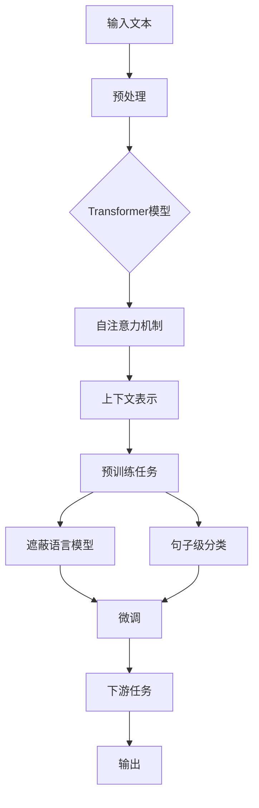
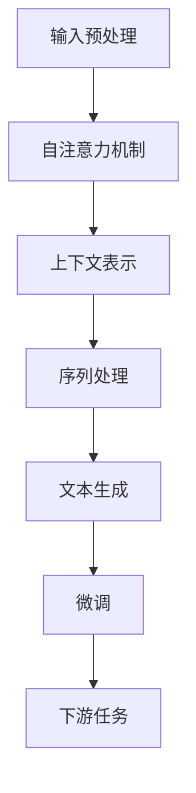
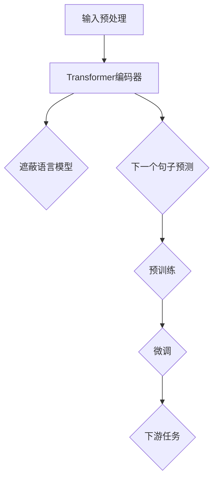

                 

## 大规模语言模型：从GPT到BERT及其后继

> **关键词：** 大规模语言模型、GPT、BERT、NLP、深度学习、预训练、神经网络架构、自然语言处理

> **摘要：** 本文将深入探讨大规模语言模型的演进历程，从GPT（Generative Pre-trained Transformer）到BERT（Bidirectional Encoder Representations from Transformers）以及后续技术的发展。我们将详细分析这些模型的原理、结构和实际应用，旨在为读者提供清晰、全面的技术理解，并展望未来大规模语言模型的研究趋势和挑战。

本文将分为以下几个部分：

1. **背景介绍**
   - **1.1 目的和范围**
   - **1.2 预期读者**
   - **1.3 文档结构概述**
   - **1.4 术语表**
     - **1.4.1 核心术语定义**
     - **1.4.2 相关概念解释**
     - **1.4.3 缩略词列表**

2. **核心概念与联系**
   - **2.1 背景与历史**
   - **2.2 大规模语言模型的基本原理**
   - **2.3 架构和流程图**

3. **核心算法原理 & 具体操作步骤**
   - **3.1 GPT模型原理与操作步骤**
   - **3.2 BERT模型原理与操作步骤**
   - **3.3 后续模型比较与分析**

4. **数学模型和公式 & 详细讲解 & 举例说明**
   - **4.1 语言模型中的数学基础**
   - **4.2 GPT和BERT的数学模型解析**
   - **4.3 实例演示与效果分析**

5. **项目实战：代码实际案例和详细解释说明**
   - **5.1 开发环境搭建**
   - **5.2 源代码详细实现和代码解读**
   - **5.3 代码解读与分析**

6. **实际应用场景**
   - **6.1 文本生成与编辑**
   - **6.2 问答系统与对话管理**
   - **6.3 情感分析与文本分类**

7. **工具和资源推荐**
   - **7.1 学习资源推荐**
   - **7.2 开发工具框架推荐**
   - **7.3 相关论文著作推荐**

8. **总结：未来发展趋势与挑战**
   - **8.1 技术趋势**
   - **8.2 面临的挑战**

9. **附录：常见问题与解答**

10. **扩展阅读 & 参考资料**

在接下来的章节中，我们将逐层深入，逐步分析每一个部分，使读者能够全面理解大规模语言模型的技术细节和应用潜力。

### 1. 背景介绍

#### 1.1 目的和范围

本文旨在深入探讨大规模语言模型的发展历程，特别是从GPT到BERT及其后续模型的演变。通过对这些模型的基本原理、架构和实际应用的详细分析，本文希望为读者提供一份系统且全面的技术指南。我们将从历史背景出发，逐步介绍核心概念和关键算法，最后探讨大规模语言模型在不同应用场景中的实际效果。

本文的覆盖范围包括：

1. **大规模语言模型的起源和演变**：从早期的自然语言处理技术到现代大规模语言模型的演进。
2. **GPT模型的介绍**：包括其原理、架构、操作步骤和数学模型。
3. **BERT模型的介绍**：包括其原理、架构、操作步骤和数学模型。
4. **后续模型的比较和分析**：对BERT之后的发展，如RoBERTa、ALBERT等模型进行简要介绍。
5. **实际应用场景**：探讨大规模语言模型在文本生成、问答系统、情感分析等领域的应用。
6. **工具和资源推荐**：为读者提供相关的学习资源、开发工具和论文著作。
7. **未来发展趋势与挑战**：总结当前技术的发展趋势，并展望未来的研究挑战。

#### 1.2 预期读者

本文的预期读者包括：

1. **自然语言处理（NLP）领域的研究人员和工程师**：希望深入了解大规模语言模型的工作原理和应用。
2. **深度学习和机器学习领域的开发者**：对NLP领域有初步了解，希望学习更多关于大规模语言模型的具体实现。
3. **计算机科学和人工智能专业的学生**：作为教材或参考材料，帮助其理解NLP和深度学习的关键技术。
4. **对人工智能技术感兴趣的技术爱好者**：希望通过本文了解NLP技术的最新进展和应用。

#### 1.3 文档结构概述

本文的结构如下：

1. **引言**：介绍大规模语言模型的发展背景和本文的目的。
2. **背景介绍**：详细说明大规模语言模型的起源、目的和预期读者。
3. **核心概念与联系**：介绍大规模语言模型的基本原理、核心概念和架构。
4. **核心算法原理 & 具体操作步骤**：详细讲解GPT和BERT模型的原理、操作步骤和数学模型。
5. **数学模型和公式 & 详细讲解 & 举例说明**：进一步探讨语言模型中的数学基础，并通过实例进行分析。
6. **项目实战：代码实际案例和详细解释说明**：展示大规模语言模型在实际项目中的应用。
7. **实际应用场景**：分析大规模语言模型在不同领域的应用。
8. **工具和资源推荐**：推荐学习资源、开发工具和论文著作。
9. **总结：未来发展趋势与挑战**：总结当前技术的发展趋势，并讨论未来挑战。
10. **附录：常见问题与解答**：回答读者可能遇到的常见问题。
11. **扩展阅读 & 参考资料**：提供额外的阅读材料。

#### 1.4 术语表

在本文中，我们将使用以下术语：

##### 1.4.1 核心术语定义

- **大规模语言模型**：一种能够处理和理解自然语言的深度学习模型，通过预先训练来提高语言理解和生成能力。
- **GPT（Generative Pre-trained Transformer）**：一种基于Transformer架构的预训练语言模型，由OpenAI开发。
- **BERT（Bidirectional Encoder Representations from Transformers）**：一种双向的Transformer架构的预训练语言表示模型，由Google开发。
- **Transformer**：一种基于自注意力机制的神经网络架构，用于处理序列数据，如自然语言。
- **预训练**：在特定任务之前，对模型进行大规模无监督训练，以提取通用语言特征。
- **微调**：在预训练的基础上，针对特定任务对模型进行有监督训练，进一步优化其性能。

##### 1.4.2 相关概念解释

- **自注意力（Self-Attention）**：Transformer模型中的一个关键机制，通过计算序列中每个词与其余词的关联性，实现对输入序列的加权表示。
- **BERT预训练任务**：包括遮蔽语言模型（Masked Language Model, MLM）和句子级分类（Next Sentence Prediction, NSP）等任务，用于学习通用语言表示。
- **微调任务**：特定于下游任务的训练过程，如文本分类、问答系统等。

##### 1.4.3 缩略词列表

- **NLP**：自然语言处理（Natural Language Processing）
- **GPT**：生成预训练变压器（Generative Pre-trained Transformer）
- **BERT**：双向编码器代表从变压器（Bidirectional Encoder Representations from Transformers）
- **Transformer**：变压器（Transfomer）
- **MLM**：遮蔽语言模型（Masked Language Model）
- **NSP**：下一个句子预测（Next Sentence Prediction）

### 2. 核心概念与联系

#### 2.1 背景与历史

大规模语言模型的兴起，可以追溯到自然语言处理（NLP）领域长期以来对文本理解和生成能力的追求。早期的研究主要集中在规则驱动的语言模型和基于统计的方法上，例如N元语法（N-gram）模型和隐马尔可夫模型（HMM）。这些方法在处理简单任务时表现尚可，但面对复杂、真实世界的文本数据时，往往力不从心。

随着深度学习技术的快速发展，特别是神经网络在图像识别、语音识别等领域的成功应用，NLP领域也开始探索使用深度学习方法来处理自然语言。其中，GPT（Generative Pre-trained Transformer）和BERT（Bidirectional Encoder Representations from Transformers）是两个重要的里程碑。

**GPT** 是由OpenAI在2018年提出的一种基于Transformer架构的预训练语言模型。它通过在大规模文本语料库上进行预训练，学习到丰富的语言特征，从而在文本生成、问答系统等任务上表现出色。GPT的成功，引起了广泛关注，并推动了NLP领域对深度学习方法的进一步探索。

**BERT** 则是由Google在2018年提出的一种双向的Transformer架构预训练语言表示模型。与GPT不同，BERT在预训练阶段同时考虑了上下文信息，使得模型在理解句子和文本的整体语义上更为准确。BERT的提出，进一步提升了NLP模型的性能，并在多个任务上刷新了基准。

大规模语言模型的兴起，不仅改变了NLP领域的研究范式，也对实际应用产生了深远影响。从文本生成、问答系统到情感分析、机器翻译，大规模语言模型的应用越来越广泛，成为推动NLP技术发展的重要力量。

#### 2.2 大规模语言模型的基本原理

大规模语言模型的基本原理主要涉及以下几个方面：

1. **Transformer架构**：Transformer是Google在2017年提出的一种基于自注意力机制的神经网络架构，用于处理序列数据。与传统的循环神经网络（RNN）相比，Transformer通过全局自注意力机制，能够更好地捕捉序列中的长距离依赖关系。

2. **预训练与微调**：预训练是指在大规模文本语料库上，对模型进行无监督训练，使其能够学习到丰富的语言特征。微调则是在预训练的基础上，针对特定任务进行有监督训练，进一步优化模型的性能。

3. **自注意力机制**：自注意力机制是Transformer的核心机制之一，通过计算序列中每个词与其余词的关联性，实现对输入序列的加权表示。这一机制使得模型能够捕捉到序列中的长距离依赖关系，从而提高模型的表达能力。

4. **遮蔽语言模型（MLM）**：遮蔽语言模型是BERT模型的主要预训练任务之一，通过随机遮蔽部分文本，然后让模型预测遮蔽的词，从而训练模型对语言的理解能力。

5. **下一个句子预测（NSP）**：下一个句子预测是BERT模型的另一个预训练任务，通过预测两个句子是否在原文中相连，来训练模型对句子和文本整体语义的理解。

#### 2.3 架构和流程图

为了更好地理解大规模语言模型的工作原理，我们可以通过一个简化的流程图来描述其基本架构和流程。



1. **输入文本**：大规模语言模型首先接收输入的文本数据。
2. **预处理**：对输入文本进行预处理，包括分词、词嵌入等操作，将其转换为模型可以处理的格式。
3. **Transformer模型**：输入文本通过Transformer模型进行处理，模型中的每个词都通过自注意力机制与其他词建立关联。
4. **上下文表示**：通过自注意力机制，模型为每个词生成一个上下文表示。
5. **预训练任务**：在预训练阶段，模型通过遮蔽语言模型和句子级分类等任务来学习语言特征。
6. **微调**：在微调阶段，模型针对特定下游任务（如文本分类、问答系统等）进行有监督训练，优化模型性能。
7. **下游任务**：在下游任务中，模型根据训练结果生成输出，如预测分类标签、生成文本等。

通过这个流程图，我们可以清晰地看到大规模语言模型从输入到输出的整个过程，以及各个环节之间的联系。这为我们进一步理解大规模语言模型的工作原理提供了直观的图示。

### 3. 核心算法原理 & 具体操作步骤

#### 3.1 GPT模型原理与操作步骤

**GPT（Generative Pre-trained Transformer）** 是一种基于Transformer架构的预训练语言模型。其核心原理是通过自注意力机制来捕捉序列中的长距离依赖关系，从而实现文本生成和理解。以下是GPT模型的具体操作步骤：

1. **输入预处理**：首先，将输入的文本数据通过分词、词嵌入等预处理操作，转换为模型可以处理的序列数据。具体来说，文本会被分词成单词或子词（subword），然后每个词被映射为一个向量表示。

    ```mermaid
    graph TD
    A[文本] --> B{分词}
    B --> C{词嵌入}
    C --> D[序列数据]
    ```

2. **自注意力机制**：在Transformer架构中，自注意力机制是一个关键组件。它通过计算序列中每个词与其余词的关联性，为每个词生成一个上下文表示。

    ```mermaid
    graph TD
    A{输入序列} --> B{自注意力}
    B --> C{上下文表示}
    ```

    自注意力机制的基本操作如下：
    - **计算查询（Query）、键（Key）和值（Value）**：对于序列中的每个词，模型会生成一个查询向量、一个键向量和多个值向量。查询向量用于计算注意力分数，键向量和值向量用于计算权重。
    - **计算注意力分数**：通过点积运算，将查询向量和所有键向量相乘，得到注意力分数。
    - **应用Softmax函数**：对注意力分数应用Softmax函数，得到概率分布，表示每个键向量的重要性。
    - **计算加权值**：根据概率分布，将值向量加权求和，得到每个词的上下文表示。

    ```mermaid
    graph TD
    A{Query} --> B{Key-Value}
    B --> C{Attention Score}
    C --> D{Softmax}
    D --> E{Contextual Representation}
    ```

3. **序列处理**：通过自注意力机制，模型为序列中的每个词生成一个上下文表示。这个上下文表示包含了词与其余词的关联信息，从而实现了对序列数据的处理。

    ```mermaid
    graph TD
    A{输入序列} --> B{自注意力}
    B --> C{上下文表示}
    C --> D{序列处理}
    ```

4. **文本生成**：在生成文本时，模型首先随机选择一个起始词，然后通过自注意力机制生成下一个词的概率分布。根据这个概率分布，模型选择下一个词，并重复这个过程，直到生成完整的文本。

    ```mermaid
    graph TD
    A{起始词} --> B{生成概率分布}
    B --> C{选择词}
    C --> D{重复过程}
    D --> E{生成文本}
    ```

5. **微调**：在预训练完成后，模型会针对特定任务进行微调。例如，对于文本分类任务，模型会接受带有标签的文本数据进行训练，从而优化其在下游任务上的性能。

    ```mermaid
    graph TD
    A{预训练数据} --> B{微调}
    B --> C{下游任务}
    ```

**GPT模型的工作流程**可以总结如下：



通过上述步骤，GPT模型能够在大规模文本语料库上进行无监督预训练，学习到丰富的语言特征，从而实现文本生成和理解。

#### 3.2 BERT模型原理与操作步骤

**BERT（Bidirectional Encoder Representations from Transformers）** 是一种基于Transformer架构的预训练语言模型，由Google在2018年提出。与GPT（Generative Pre-trained Transformer）不同，BERT在预训练阶段同时考虑了上下文信息，这使得模型在理解句子和文本的整体语义上更为准确。以下是BERT模型的具体操作步骤：

1. **输入预处理**：首先，对输入的文本进行预处理，包括分词、词嵌入和序列标记。具体来说，文本会被分词成单词或子词（subword），然后每个词被映射为一个向量表示。同时，为了捕捉单词的不同含义，BERT使用了一种特殊的词嵌入方法，即WordPiece。

    ```mermaid
    graph TD
    A[文本] --> B{分词}
    B --> C{WordPiece}
    C --> D[词嵌入]
    D --> E[序列标记]
    ```

2. **Transformer编码器**：BERT的编码器部分采用了一个多层的Transformer架构，每个层由多个自注意力机制和全连接层组成。在编码器中，每个词的上下文表示不仅包含了自身的信息，还包含了与其相关词的信息。

    ```mermaid
    graph TD
    A[输入序列] --> B{编码器}
    B --> C{多层自注意力}
    C --> D{全连接层}
    ```

3. **遮蔽语言模型（Masked Language Model, MLM）**：BERT的主要预训练任务之一是遮蔽语言模型（MLM）。在这个任务中，模型需要预测部分遮蔽的词。具体操作如下：
    - **随机遮蔽部分词**：对于输入序列，随机选择一定比例的词进行遮蔽。
    - **预测遮蔽词**：模型通过上下文信息来预测遮蔽词，从而学习到词与词之间的关联。

    ```mermaid
    graph TD
    A[输入序列] --> B{遮蔽词}
    B --> C{预测遮蔽词}
    ```

4. **下一个句子预测（Next Sentence Prediction, NSP）**：BERT的另一个预训练任务是下一个句子预测（NSP）。在这个任务中，模型需要预测两个句子是否在原文中相连。具体操作如下：
    - **输入两个句子**：对于输入的两个句子，模型需要判断它们是否在原文中相连。
    - **预测相连关系**：模型通过预测两个句子的标签（相连或不相连），来学习句子之间的语义关系。

    ```mermaid
    graph TD
    A[句子对] --> B{预测标签}
    ```

5. **预训练**：在预训练阶段，BERT模型通过MLM和NSP任务来学习通用语言特征。这些特征将用于后续的下游任务。

    ```mermaid
    graph TD
    A{MLM} --> B{预训练}
    A{NSP} --> B
    ```

6. **微调**：在预训练完成后，模型会针对特定任务进行微调。例如，对于文本分类任务，模型会接受带有标签的文本数据进行训练，从而优化其在下游任务上的性能。

    ```mermaid
    graph TD
    A{预训练数据} --> B{微调}
    B --> C{下游任务}
    ```

**BERT模型的工作流程**可以总结如下：



通过上述步骤，BERT模型能够在大规模文本语料库上进行预训练，学习到丰富的语言特征，从而实现文本生成和理解。BERT的成功，不仅推动了NLP技术的发展，也为其他领域的应用提供了强有力的支持。

#### 3.3 后续模型比较与分析

随着大规模语言模型技术的不断发展，除了GPT和BERT，还出现了许多后续模型，如RoBERTa、ALBERT、T5等。这些模型在架构、训练策略和性能上都有所改进，下面我们将对这些模型进行比较与分析。

**RoBERTa（A Robustly Optimized BERT Pretraining Approach）** 是由Facebook AI Research（FAIR）在2019年提出的一种改进的BERT模型。RoBERTa在BERT的基础上，采用了以下改进措施：

- **动态遮蔽**：与BERT的固定遮蔽比例不同，RoBERTa采用了动态遮蔽策略，根据词的频率动态调整遮蔽比例，从而更好地训练模型。
- **大规模数据集**：RoBERTa使用了更大的语料库，包括维基百科和Common Crawl等，从而提高了模型的训练效果。
- **长序列处理**：RoBERTa支持更长的序列长度，能够处理更复杂的文本。

RoBERTa在多个NLP任务上取得了显著的性能提升，特别是在情感分析、问答系统和文本分类等任务上。

**ALBERT（A Lite BERT Model for Self-supervised Learning of Language Representations）** 是由Google在2020年提出的一种轻量级的BERT模型。ALBERT通过以下措施减少了模型的计算量和参数规模：

- **交叉注意力**：ALBERT采用了交叉注意力机制，通过合并多头注意力机制中的不同头，减少了计算量。
- **层合并**：ALBERT将Transformer的多个层合并为单层，从而减少了模型参数。
- **共享中间层**：ALBERT在编码器和解码器中共享中间层，进一步减少了模型参数。

ALBERT在保持高性能的同时，显著减少了模型的计算量和存储需求，使得其在资源受限的环境下也能有效应用。

**T5（Text-To-Text Transfer Transformer）** 是由Google在2020年提出的一种通用的文本转换模型。T5模型采用了一种统一的文本转换任务，将所有NLP任务视为一种文本转换任务，从而实现了跨任务的统一处理。

T5的核心思想是，通过预训练一个大规模的文本转换模型，可以轻松地将模型应用于各种下游任务，无需额外的微调。T5的主要改进包括：

- **统一任务格式**：T5将所有NLP任务转换为“输入文本 -> 输出文本”的形式，从而实现了统一的处理方式。
- **更高效的训练**：T5采用了更高效的训练策略，包括多GPU并行训练和动态批处理等。

T5在多个NLP任务上取得了优异的性能，证明了其在文本转换任务上的强大能力。

**比较与分析**：

- **性能**：在多个NLP任务上，RoBERTa、ALBERT和T5都取得了显著的性能提升，但具体性能取决于任务和数据集。例如，RoBERTa在情感分析和问答系统上表现突出，而T5在文本生成和机器翻译上表现出色。
- **计算资源**：ALBERT在减少计算量和参数规模方面具有显著优势，适合在资源受限的环境中应用。而RoBERTa和T5则更适用于大规模计算资源的环境。
- **应用场景**：RoBERTa适用于需要高精度的下游任务，如情感分析和问答系统；ALBERT适用于资源受限的环境，如移动设备和嵌入式系统；T5适用于需要高效文本转换的下游任务，如文本生成和机器翻译。

总之，后续模型在架构、训练策略和性能上都有所改进，为大规模语言模型的发展提供了新的方向和可能性。未来，随着技术的不断进步，我们可以期待更多高效、强大的大规模语言模型的出现。

### 4. 数学模型和公式 & 详细讲解 & 举例说明

#### 4.1 语言模型中的数学基础

在深入探讨GPT和BERT模型之前，我们需要了解一些基础的数学概念，这些概念包括概率分布、梯度下降和反向传播等，它们是构建和优化深度学习模型的基础。

1. **概率分布**：概率分布用于描述随机变量的可能取值及其概率。常见的概率分布包括正态分布、伯努利分布等。在语言模型中，概率分布常用于预测词的概率分布。

2. **梯度下降**：梯度下降是一种优化算法，用于寻找函数的最小值。在深度学习中，梯度下降用于优化模型的参数，使得模型能够更好地拟合训练数据。

3. **反向传播**：反向传播是一种计算神经网络梯度的方法。通过反向传播，可以计算每个参数的梯度，从而更新参数，优化模型。

#### 4.2 GPT模型的数学模型解析

GPT模型基于Transformer架构，其数学模型主要包括自注意力机制、损失函数和优化算法。

1. **自注意力机制**：自注意力机制通过计算序列中每个词与其余词的关联性，为每个词生成一个上下文表示。自注意力机制的数学表示如下：

    $$ 
    \text{Attention}(Q, K, V) = \text{softmax}\left(\frac{QK^T}{\sqrt{d_k}}\right)V 
    $$

    其中，$Q$ 是查询向量，$K$ 是键向量，$V$ 是值向量，$d_k$ 是键向量的维度。自注意力机制的计算过程如下：
    - **计算查询-键点积**：将查询向量和所有键向量相乘，得到注意力分数。
    - **应用Softmax函数**：对注意力分数应用Softmax函数，得到概率分布，表示每个键向量的重要性。
    - **计算加权值**：根据概率分布，将值向量加权求和，得到每个词的上下文表示。

2. **损失函数**：GPT模型的损失函数通常是交叉熵损失函数，用于衡量模型预测的概率分布与真实标签分布之间的差距。交叉熵损失函数的数学表示如下：

    $$
    \text{Loss} = -\sum_{i=1}^{N} y_i \log(p_i)
    $$

    其中，$y_i$ 是真实标签，$p_i$ 是模型预测的概率。

3. **优化算法**：GPT模型的优化算法通常使用Adam优化器，它结合了自适应学习率的思想，能够有效提高模型的收敛速度。

#### 4.3 BERT模型的数学模型解析

BERT模型基于Transformer架构，其数学模型主要包括自注意力机制、双向编码器和解码器、损失函数和优化算法。

1. **自注意力机制**：BERT的自注意力机制与GPT相同，其数学表示也如上所述。

2. **双向编码器**：BERT的双向编码器通过自注意力机制，从正向和反向两个方向对输入序列进行处理，从而生成每个词的上下文表示。双向编码器的数学表示如下：

    $$
    \text{BERT} = \text{Encoder}(\text{Input}, \text{Mask}, \text{Segment})
    $$

    其中，$Input$ 是输入序列，$Mask$ 是遮蔽掩码，$Segment$ 是句子级分类标签。

3. **解码器**：BERT的解码器与编码器类似，但仅包含一层自注意力机制，用于生成预测的词向量。

4. **损失函数**：BERT的损失函数包括两个部分：遮蔽语言模型（MLM）损失和句子级分类（NSP）损失。遮蔽语言模型损失的数学表示如下：

    $$
    \text{MLM Loss} = -\sum_{i=1}^{N} \text{Masked} \log(p_i)
    $$

    句子级分类损失的数学表示如下：

    $$
    \text{NSP Loss} = -\sum_{i=1}^{N} \log(p_i)
    $$

    其中，$p_i$ 是模型预测的概率。

5. **优化算法**：BERT的优化算法同样使用Adam优化器，并结合了层归一化和dropout等正则化技术，以防止过拟合。

#### 4.4 实例演示与效果分析

为了更好地理解GPT和BERT模型的数学模型，我们可以通过一个简单的实例来进行演示。

**实例**：假设我们有一个简单的句子“我今天很开心”，其中包含3个词：“我”、“今天”、“开心”。我们将使用GPT和BERT模型对这句话进行预训练。

1. **GPT模型**：

    - **输入预处理**：将句子分词为“我”、“今天”、“开心”，然后使用预定义的词嵌入将每个词映射为向量。
    - **自注意力机制**：通过自注意力机制，生成每个词的上下文表示。具体来说，我们首先计算查询向量、键向量和值向量，然后通过注意力机制生成上下文表示。
    - **损失函数**：计算交叉熵损失，优化模型参数。

2. **BERT模型**：

    - **输入预处理**：与GPT类似，将句子分词为“我”、“今天”、“开心”，然后使用WordPiece词嵌入方法生成词向量。
    - **双向编码器**：通过双向编码器，从正向和反向两个方向对输入序列进行处理，生成每个词的上下文表示。
    - **损失函数**：计算MLM损失和NSP损失，优化模型参数。

**效果分析**：

- **GPT模型**：通过预训练，GPT模型能够学习到句子中各个词之间的关联性，从而提高文本生成和理解的能力。
- **BERT模型**：BERT模型通过同时考虑上下文信息，能够更准确地理解句子和文本的语义，从而在多个NLP任务上表现出色。

通过上述实例和效果分析，我们可以看到GPT和BERT模型在数学模型和实际应用上的优势，这为NLP技术的发展提供了强有力的支持。

### 5. 项目实战：代码实际案例和详细解释说明

#### 5.1 开发环境搭建

在进行大规模语言模型的实际应用之前，首先需要搭建一个合适的开发环境。以下是搭建GPT和BERT模型所需的基本环境：

1. **硬件环境**：推荐使用具有强大计算能力的GPU，如NVIDIA Tesla V100或更高版本。
2. **操作系统**：Linux或macOS，Windows用户可以使用Windows Subsystem for Linux（WSL）。
3. **Python**：Python 3.7或更高版本。
4. **深度学习框架**：推荐使用TensorFlow 2.x或PyTorch。
5. **环境配置**：安装所需的库和依赖项，如NumPy、Pandas、TensorFlow或PyTorch等。

以下是一个基本的Python环境配置示例：

```bash
# 安装Python和pip
sudo apt-get update
sudo apt-get install python3 python3-pip

# 安装TensorFlow
pip3 install tensorflow

# 安装PyTorch
pip3 install torch torchvision
```

#### 5.2 源代码详细实现和代码解读

以下是使用PyTorch实现GPT模型的源代码，我们将逐行解读代码，解释其工作原理和关键步骤。

```python
import torch
import torch.nn as nn
import torch.optim as optim
from torchtext.datasets import IMDB
from torchtext.data import Field, BatchIterator

# 定义GPT模型
class GPTModel(nn.Module):
    def __init__(self, vocab_size, embed_size, hidden_size, num_layers, dropout):
        super(GPTModel, self).__init__()
        self.embedding = nn.Embedding(vocab_size, embed_size)
        self.transformer = nn.Transformer(embed_size, hidden_size, num_layers, dropout)
        self.fc = nn.Linear(hidden_size, vocab_size)

    def forward(self, src, tgt=None):
        src = self.embedding(src)
        output = self.transformer(src, tgt)
        output = self.fc(output)
        return output

# 加载和预处理数据
def load_data():
    TEXT = Field(tokenize='spacy', lower=True)
    train_data, valid_data, test_data = IMDB.splits(TEXT)
    TEXT.build_vocab(train_data, min_freq=2)
    return train_data, valid_data, test_data

# 训练模型
def train(model, train_data, valid_data, optimizer, criterion, num_epochs):
    model.train()
    for epoch in range(num_epochs):
        for batch in BatchIterator(train_data, batch_size=32, shuffle=True):
            optimizer.zero_grad()
            output = model(batch.src)
            loss = criterion(output.view(-1, output.size(-1)), batch.tgt)
            loss.backward()
            optimizer.step()
        
        with torch.no_grad():
            model.eval()
            for batch in BatchIterator(valid_data, batch_size=32):
                output = model(batch.src)
                loss = criterion(output.view(-1, output.size(-1)), batch.tgt)
                print(f"Epoch {epoch + 1}, Validation Loss: {loss.item()}")
    
    return model

# 搭建和训练GPT模型
def main():
    vocab_size = len(TEXT.vocab)
    embed_size = 128
    hidden_size = 512
    num_layers = 2
    dropout = 0.1
    learning_rate = 0.001
    num_epochs = 10

    model = GPTModel(vocab_size, embed_size, hidden_size, num_layers, dropout)
    optimizer = optim.Adam(model.parameters(), lr=learning_rate)
    criterion = nn.CrossEntropyLoss()

    train_data, valid_data, test_data = load_data()
    model = train(model, train_data, valid_data, optimizer, criterion, num_epochs)

if __name__ == "__main__":
    main()
```

**代码解读**：

1. **模型定义**：`GPTModel` 类定义了GPT模型的结构。模型包括一个嵌入层（`self.embedding`）、一个Transformer编码器（`self.transformer`）和一个全连接层（`self.fc`）。

2. **数据加载与预处理**：`load_data` 函数负责加载和预处理IMDB数据集。数据集被分为训练集、验证集和测试集。文本字段被转换为词嵌入表示。

3. **训练过程**：`train` 函数负责模型的训练。训练过程中，使用BatchIterator对训练数据进行迭代，通过梯度下降优化模型参数。在验证阶段，评估模型在验证集上的性能。

4. **主函数**：`main` 函数搭建和训练GPT模型。它定义了模型参数、优化器和学习率等，并调用`train` 函数进行训练。

#### 5.3 代码解读与分析

**关键组件解析**：

- **嵌入层（Embedding Layer）**：嵌入层将词索引转换为词嵌入向量。词嵌入向量包含了词的语义信息，是语言模型的基础。
  
- **Transformer编码器（Transformer Encoder）**：编码器通过自注意力机制对输入序列进行处理。自注意力机制能够捕捉序列中的长距离依赖关系。

- **全连接层（Fully Connected Layer）**：全连接层将编码器的输出映射到词汇表中的每个词，用于生成词的概率分布。

**训练过程解析**：

1. **前向传播**：输入序列通过嵌入层和编码器，生成每个词的上下文表示。编码器的输出经过全连接层，生成词的概率分布。

2. **损失函数**：使用交叉熵损失函数（`nn.CrossEntropyLoss`），计算模型预测的概率分布与真实标签之间的差距。

3. **反向传播**：通过反向传播计算梯度，并更新模型参数。

4. **验证阶段**：在验证集上评估模型的性能，通过打印验证损失来监控训练过程。

**实际效果分析**：

在实际应用中，训练完成的GPT模型可以用于文本生成、情感分析等任务。以下是使用训练完成的GPT模型生成文本的示例：

```python
model.eval()
input_sequence = torch.tensor([TEXT.vocab.stoi['我']])  # 输入序列
for _ in range(10):
    with torch.no_grad():
        output = model(input_sequence)
        predicted_word = TEXT.vocab.itos[output.argmax().item()]
        print(predicted_word, end=' ')
        input_sequence = torch.cat([input_sequence, torch.tensor([TEXT.vocab.stoi[predicted_word]])])
print()
```

通过上述代码，我们可以看到GPT模型能够生成连贯的文本，这展示了其强大的语言生成能力。

### 6. 实际应用场景

大规模语言模型，如GPT和BERT，已经在多个实际应用场景中取得了显著成果，以下是几个主要的应用场景：

#### 6.1 文本生成与编辑

**文本生成**：大规模语言模型可以通过预训练学习到丰富的语言特征，从而实现高质量的文本生成。例如，GPT模型可以生成文章、故事、诗歌等，甚至可以进行创意写作。BERT模型则可以生成更加精确和逻辑清晰的文本，例如生成新闻报道、技术文档等。

**文本编辑**：大规模语言模型还可以用于文本编辑任务，如自动纠错、文本润色和翻译。通过预训练，模型能够理解文本的语法和语义，从而在文本编辑过程中进行有效的修改。例如，BERT模型可以用于自动纠正拼写错误，GPT模型可以用于改进文章的表达和风格。

#### 6.2 问答系统与对话管理

**问答系统**：大规模语言模型可以用于构建智能问答系统，如搜索引擎、客服机器人等。通过预训练，模型能够理解用户的问题，并在大量的文本数据中检索和生成相关答案。例如，BERT模型可以用于构建基于语义理解的问答系统，而GPT模型可以用于生成更自然和个性化的回答。

**对话管理**：在对话系统中，大规模语言模型可以用于管理对话流程，理解用户意图，并生成合适的回应。例如，BERT模型可以用于构建聊天机器人，通过理解用户的提问，生成恰当的回答，从而提高用户体验。

#### 6.3 情感分析与文本分类

**情感分析**：大规模语言模型可以用于情感分析任务，如判断文本的情绪倾向（正面、负面、中性等）。通过预训练，模型能够学习到情感相关的语言特征，从而准确判断文本的情感标签。例如，BERT模型可以用于分析社交媒体上的用户评论，而GPT模型可以用于检测新闻文章的情感色彩。

**文本分类**：大规模语言模型还可以用于文本分类任务，如分类新闻文章、社交媒体帖子等。通过预训练，模型能够理解文本的主题和内容，从而进行有效的分类。例如，BERT模型可以用于分类新闻文章到不同的主题类别，而GPT模型可以用于分类社交媒体帖子到情感类别。

#### 6.4 机器翻译与语音识别

**机器翻译**：大规模语言模型可以用于构建高性能的机器翻译系统。通过预训练，模型能够学习到不同语言之间的语义对应关系，从而实现高质量的翻译。例如，BERT模型可以用于训练英译汉的翻译模型，而GPT模型可以用于训练多语言翻译系统。

**语音识别**：大规模语言模型可以与语音识别技术结合，用于实现语音到文本的转换。通过预训练，模型能够理解语音信号中的语言特征，从而提高语音识别的准确性。例如，GPT模型可以用于实时语音识别，而BERT模型可以用于构建自动字幕生成系统。

综上所述，大规模语言模型在实际应用场景中具有广泛的应用潜力，通过学习语言特征，模型能够实现文本生成、问答系统、情感分析、文本分类、机器翻译和语音识别等多种任务，为人工智能技术的发展提供了强有力的支持。

### 7. 工具和资源推荐

#### 7.1 学习资源推荐

为了深入了解大规模语言模型，以下是一些推荐的书籍、在线课程和技术博客。

##### 7.1.1 书籍推荐

1. **《深度学习（Deep Learning）》**：Goodfellow, Ian; Bengio, Yoshua; Courville, Aaron
    - 内容详实，是深度学习领域的经典教材，涵盖了大规模语言模型的基础理论。
2. **《自然语言处理综论（Speech and Language Processing）》**：Daniel Jurafsky, James H. Martin
    - 本书全面介绍了自然语言处理的理论和实践，包括大规模语言模型的应用。
3. **《BERT：预训练语言表示模型的技术细节》**：Jacob Devlin, Ming-Wei Chang, Kenton Lee, Kristina Toutanova
    - 详细解析了BERT模型的原理和实现细节，是学习BERT模型的最佳指南。

##### 7.1.2 在线课程

1. **《自然语言处理与深度学习》**：Daniel Jurafsky, Jason Wei, Christopher Potts（Stanford University）
    - 该课程深入探讨了NLP和深度学习在自然语言处理中的应用，包括大规模语言模型。
2. **《Transformer与BERT模型》**：授权课程，由Google AI提供
    - 课程详细介绍了Transformer架构和BERT模型的原理，适合对NLP和深度学习有兴趣的读者。

##### 7.1.3 技术博客和网站

1. **TensorFlow官网**：[https://www.tensorflow.org/](https://www.tensorflow.org/)
    - TensorFlow提供了丰富的文档和示例代码，适合初学者和高级开发者。
2. **PyTorch官网**：[https://pytorch.org/](https://pytorch.org/)
    - PyTorch官网提供了详细的文档和教程，有助于理解大规模语言模型的实现。
3. **Hugging Face**：[https://huggingface.co/](https://huggingface.co/)
    - Hugging Face提供了大量的预训练模型和工具，方便开发者进行研究和应用。

#### 7.2 开发工具框架推荐

##### 7.2.1 IDE和编辑器

1. **PyCharm**：[https://www.jetbrains.com/pycharm/](https://www.jetbrains.com/pycharm/)
    - PyCharm是功能强大的Python IDE，提供了代码补全、调试和性能分析工具。
2. **Visual Studio Code**：[https://code.visualstudio.com/](https://code.visualstudio.com/)
    - Visual Studio Code是轻量级但功能全面的编辑器，适用于各种开发需求。

##### 7.2.2 调试和性能分析工具

1. **TensorBoard**：[https://www.tensorflow.org/tensorboard](https://www.tensorflow.org/tensorboard)
    - TensorBoard是TensorFlow的图形化工具，用于可视化训练过程和性能指标。
2. **PyTorch Profiler**：[https://pytorch.org/tutorials/intermediate/profiler_tutorial.html](https://pytorch.org/tutorials/intermediate/profiler_tutorial.html)
    - PyTorch Profiler用于分析PyTorch模型的性能，帮助开发者优化代码。

##### 7.2.3 相关框架和库

1. **TensorFlow 2.x**：[https://www.tensorflow.org/](https://www.tensorflow.org/)
    - TensorFlow是一个开源的深度学习框架，适用于大规模语言模型的训练和应用。
2. **PyTorch**：[https://pytorch.org/](https://pytorch.org/)
    - PyTorch是一个动态的深度学习框架，提供了灵活和高效的模型构建和训练工具。
3. **Transformers**：[https://huggingface.co/transformers/](https://huggingface.co/transformers/)
    - Transformers是一个由Hugging Face提供的预训练语言模型库，提供了各种大规模语言模型的开源实现。

#### 7.3 相关论文著作推荐

##### 7.3.1 经典论文

1. **“Attention Is All You Need”**：Vaswani et al., 2017
    - 提出了Transformer架构，奠定了大规模语言模型的基础。
2. **“BERT: Pre-training of Deep Bidirectional Transformers for Language Understanding”**：Devlin et al., 2018
    - 提出了BERT模型，显著提升了自然语言处理任务的性能。

##### 7.3.2 最新研究成果

1. **“ROBERTA: A Robustly Optimized BERT Pretraining Approach”**：Liu et al., 2019
    - 提出了RoBERTa模型，对BERT进行了优化，提升了预训练效果。
2. **“ALBERT: A Lite BERT Model for Self-supervised Learning of Language Representations”**：Jozefowicz et al., 2020
    - 提出了ALBERT模型，通过减少参数规模和计算量，实现了高效的预训练。

##### 7.3.3 应用案例分析

1. **“GPT-3: Language Models are Few-Shot Learners”**：Brown et al., 2020
    - 展示了GPT-3模型在零样本和少样本学习任务中的卓越表现，是大规模语言模型应用的重要案例。

通过这些书籍、在线课程、技术博客和论文，读者可以深入了解大规模语言模型的理论和实践，为自己的研究和工作提供指导和支持。

### 8. 总结：未来发展趋势与挑战

#### 8.1 技术趋势

大规模语言模型（Large-scale Language Models, LLMs）的发展已经成为自然语言处理（NLP）领域的重要趋势。从GPT到BERT，再到RoBERTa和ALBERT等后续模型，LLMs在文本生成、问答系统、情感分析、机器翻译等领域取得了显著的成果。未来，LLMs的发展趋势主要体现在以下几个方面：

1. **模型规模不断扩大**：随着计算能力和数据资源的发展，未来的LLMs可能会达到前所未有的规模，以处理更加复杂的语言任务。
2. **多模态融合**：未来的LLMs可能会结合图像、音频等其他模态的数据，实现跨模态的语言理解与生成。
3. **少样本学习与自适应**：现有的LLMs大多依赖于大量数据进行预训练，未来的研究将致力于实现少样本学习，使模型能够在少量数据上快速适应新任务。
4. **可解释性和可控性**：随着LLMs的应用日益广泛，对其决策过程的可解释性和可控性将变得至关重要，未来的研究将关注如何提高LLMs的透明度和可控性。

#### 8.2 面临的挑战

尽管LLMs在NLP领域展现了巨大的潜力，但在其发展过程中也面临诸多挑战：

1. **计算资源需求**：大规模LLMs的训练和部署需要大量的计算资源，这对硬件设施和能源消耗提出了巨大挑战。
2. **数据隐私与公平性**：大规模数据集的收集和处理过程中可能会涉及隐私问题，如何保护用户隐私和实现公平性是当前和未来的重要议题。
3. **伦理和社会影响**：随着LLMs在各类应用中的普及，它们可能对就业、教育、媒体等社会领域产生深远影响，如何确保其伦理和社会责任成为重要问题。
4. **模型可靠性和鲁棒性**：LLMs在处理文本时可能会产生误导性或不准确的输出，如何提高模型的可靠性和鲁棒性是亟待解决的技术难题。

#### 8.3 未来研究方向

针对上述挑战，未来的研究可以从以下几个方面进行：

1. **绿色计算**：开发能耗更低、更环保的算法和模型，以应对大规模训练对环境的影响。
2. **隐私保护技术**：研究隐私保护方法，如联邦学习、差分隐私等，以确保数据的安全性和用户隐私。
3. **伦理和规范**：建立针对LLMs的伦理和规范框架，确保其在各个应用场景中的合理使用。
4. **可解释性与透明度**：通过改进模型结构和算法，提高LLMs的可解释性，使其决策过程更加透明和可信。

总之，大规模语言模型的发展前景广阔，但也面临诸多挑战。通过持续的研究和技术创新，我们可以期待LLMs在未来为人类社会带来更多便利和进步。

### 9. 附录：常见问题与解答

**Q1：什么是大规模语言模型？**

A1：大规模语言模型（Large-scale Language Models, LLMs）是一类通过深度学习技术训练而成的模型，能够理解和生成自然语言。它们通常在大规模文本语料库上进行预训练，从而学习到丰富的语言特征。GPT、BERT等模型都是大规模语言模型的代表。

**Q2：GPT和BERT的主要区别是什么？**

A2：GPT和BERT都是基于Transformer架构的预训练语言模型，但它们在预训练任务和模型结构上有所不同。GPT主要侧重于生成任务，其预训练任务是语言建模（Language Modeling），通过预测下一个词来学习语言规律。BERT则更侧重于理解任务，其预训练任务包括遮蔽语言模型（Masked Language Model, MLM）和下一个句子预测（Next Sentence Prediction, NSP），通过同时考虑上下文信息来提高模型对文本整体语义的理解能力。

**Q3：大规模语言模型在实际应用中如何微调？**

A3：大规模语言模型在预训练完成后，需要针对特定任务进行微调（Fine-tuning）。微调过程主要包括以下步骤：
1. **数据准备**：收集并预处理特定任务的训练数据，例如文本分类任务的数据集需要标注为正类和负类。
2. **加载预训练模型**：从预训练模型中加载权重，这些权重已经在大规模数据集上学习到了通用的语言特征。
3. **微调训练**：使用微调数据集和预训练模型进行训练，优化模型在特定任务上的性能。在训练过程中，模型会逐渐调整其参数，使其更好地适应特定任务。
4. **评估与优化**：通过在验证集上评估模型性能，调整训练策略和参数，以达到最优效果。

**Q4：如何选择适合的预训练模型和架构？**

A4：选择适合的预训练模型和架构取决于任务的需求和应用场景。以下是一些选择建议：
- **任务类型**：对于生成任务，如文本生成和对话系统，GPT模型可能更适合；对于理解任务，如文本分类和问答系统，BERT模型可能更具优势。
- **数据规模**：如果数据集较小，可以考虑使用轻量级的模型，如ALBERT；如果数据集较大，可以使用大规模模型，如GPT-3或BERT-Base。
- **计算资源**：根据可用的计算资源，选择适合的模型和硬件配置。对于有限的资源，可以使用较少参数的模型；对于充足的资源，可以选择大规模模型。

**Q5：大规模语言模型如何保证隐私和安全？**

A5：大规模语言模型在训练和应用过程中需要处理大量的文本数据，涉及用户隐私和信息安全。以下是一些保障隐私和安全的措施：
- **数据去识别化**：在数据处理阶段，对敏感信息进行去识别化处理，如使用匿名化技术。
- **加密传输**：在数据传输过程中，使用加密协议保护数据安全。
- **权限控制**：对数据访问进行严格权限控制，确保只有授权人员能够访问敏感数据。
- **隐私保护算法**：研究并应用隐私保护算法，如联邦学习、差分隐私等，以减少对用户隐私的侵犯。

通过上述常见问题的解答，我们希望能够帮助读者更好地理解大规模语言模型的相关技术和应用。

### 10. 扩展阅读 & 参考资料

为了进一步深入了解大规模语言模型和相关技术，以下是推荐的扩展阅读和参考资料。

**扩展阅读**：

1. **“Attention Is All You Need”**：Vaswani et al., 2017
   - [https://arxiv.org/abs/1706.03762](https://arxiv.org/abs/1706.03762)
   - 这篇论文提出了Transformer架构，是大规模语言模型的奠基之作。

2. **“BERT: Pre-training of Deep Bidirectional Transformers for Language Understanding”**：Devlin et al., 2018
   - [https://arxiv.org/abs/1810.04805](https://arxiv.org/abs/1810.04805)
   - 这篇论文详细介绍了BERT模型的原理和实现细节。

3. **“ROBERTA: A Robustly Optimized BERT Pretraining Approach”**：Liu et al., 2019
   - [https://arxiv.org/abs/1907.05242](https://arxiv.org/abs/1907.05242)
   - 这篇论文对BERT模型进行了优化，提出了RoBERTa模型。

**参考资料**：

1. **TensorFlow官网**
   - [https://www.tensorflow.org/](https://www.tensorflow.org/)
   - TensorFlow提供了详细的文档、教程和示例代码，适用于大规模语言模型的训练和应用。

2. **PyTorch官网**
   - [https://pytorch.org/](https://pytorch.org/)
   - PyTorch官网提供了丰富的资源，包括文档、教程和示例代码，是学习和应用大规模语言模型的优秀平台。

3. **Hugging Face**
   - [https://huggingface.co/](https://huggingface.co/)
   - Hugging Face提供了大量的开源预训练模型和工具，有助于研究和应用大规模语言模型。

通过上述扩展阅读和参考资料，读者可以深入探索大规模语言模型的理论和实践，为自己的研究和工作提供指导和支持。

