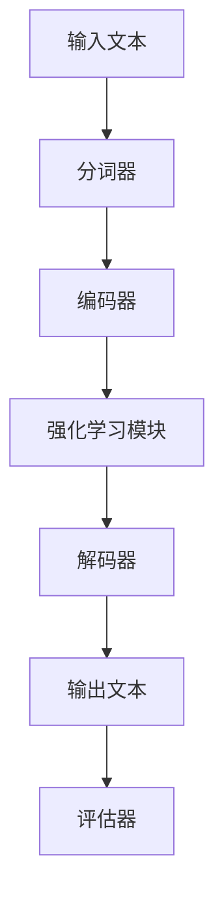

                 


# 大语言模型原理与工程实践：Token-level 强化建模

> 关键词：大语言模型、Token-level、强化学习、自然语言处理、神经网络、序列建模、上下文理解、工程实践

> 摘要：本文将深入探讨大语言模型中的Token-level强化建模原理，从基础概念到具体实现，详细解析其内在逻辑和应用。文章首先介绍了Token-level强化建模的背景和重要性，随后通过流程图展示其核心架构，进一步使用伪代码和数学模型阐述算法原理。接着，文章通过实际项目案例展示了Token-level强化建模的工程实践，并分析其实现细节。最后，文章探讨了Token-level强化建模在实际应用场景中的表现，推荐了相关学习资源和工具，并对未来发展趋势和挑战进行了展望。

## 1. 背景介绍

### 1.1 目的和范围

本文旨在详细解析Token-level强化建模在大语言模型中的应用原理和工程实践。我们将从理论基础出发，结合实际项目案例，深入探讨该技术的核心实现方法和优化策略。

### 1.2 预期读者

本文适合具有一定自然语言处理和机器学习基础的读者，包括研究人员、开发人员和学者。对于希望深入了解大语言模型实现细节和工程应用的人员，本文将提供有价值的参考。

### 1.3 文档结构概述

本文结构如下：

1. **背景介绍**：介绍Token-level强化建模的背景和重要性。
2. **核心概念与联系**：通过Mermaid流程图展示Token-level强化建模的核心架构。
3. **核心算法原理 & 具体操作步骤**：使用伪代码详细阐述算法原理和操作步骤。
4. **数学模型和公式 & 详细讲解 & 举例说明**：介绍Token-level强化建模的数学模型，并举例说明。
5. **项目实战：代码实际案例和详细解释说明**：通过实际项目案例展示Token-level强化建模的工程实践。
6. **实际应用场景**：分析Token-level强化建模在不同场景中的应用。
7. **工具和资源推荐**：推荐学习资源和开发工具。
8. **总结：未来发展趋势与挑战**：展望Token-level强化建模的发展趋势和面临的挑战。
9. **附录：常见问题与解答**：提供常见问题的解答。
10. **扩展阅读 & 参考资料**：推荐相关阅读和参考资料。

### 1.4 术语表

#### 1.4.1 核心术语定义

- **Token-level**：指在自然语言处理中将文本分割成词或子词的层次。
- **强化学习**：一种机器学习方法，通过奖励机制来训练模型。
- **大语言模型**：具有巨大参数量和广泛知识库的神经网络模型。
- **序列建模**：用于预测序列中下一个元素的方法。

#### 1.4.2 相关概念解释

- **Token-level强化建模**：在Token级别上使用强化学习方法进行自然语言处理。
- **上下文理解**：模型对输入文本的上下文信息的理解能力。

#### 1.4.3 缩略词列表

- **NLP**：自然语言处理（Natural Language Processing）
- **RL**：强化学习（Reinforcement Learning）
- **BERT**：一种基于Transformer的大规模预训练语言模型（Bidirectional Encoder Representations from Transformers）
- **GPT**：一种基于Transformer的大规模预训练语言模型（Generative Pre-trained Transformer）

## 2. 核心概念与联系

为了更好地理解Token-level强化建模，我们首先需要了解其核心概念和联系。下面是一个Mermaid流程图，展示了Token-level强化建模的主要组成部分和它们之间的关系：



### 2.1 流程图说明

- **分词器**：将输入文本分割成Token。
- **编码器**：将Token编码成向量表示。
- **强化学习模块**：使用奖励机制训练编码器和解码器。
- **解码器**：生成输出文本。
- **评估器**：评估输出文本的质量。

## 3. 核心算法原理 & 具体操作步骤

### 3.1 算法原理

Token-level强化建模的核心思想是利用强化学习来优化编码器和解码器的参数，使其在生成文本时能够更好地遵循上下文信息。下面是一个简单的伪代码，用于描述Token-level强化建模的基本步骤：

```python
# 伪代码：Token-level强化建模算法原理

initialize_model()
initialize_reward_function()
initialize_agent()

for each episode:
    input_text = get_input_text()
    token_sequence = tokenize(input_text)
    encoded_sequence = encode(token_sequence)
    
    for each token in encoded_sequence:
        action = agent.select_action(encoded_sequence[:token])
        next_token = decode(encoded_sequence[:token], action)
        reward = calculate_reward(encoded_sequence, next_token)
        
        agent.update_policy(action, reward)
    
    evaluate_model()
    update_model_parameters()
```

### 3.2 具体操作步骤

1. **初始化模型**：定义编码器和解码器的结构，初始化模型参数。
2. **初始化奖励函数**：定义用于评估输出文本质量的奖励函数。
3. **初始化代理**：初始化强化学习代理，用于选择动作和更新策略。
4. **循环进行训练**：
   - **获取输入文本**：从数据集中获取新的输入文本。
   - **分词**：将输入文本分割成Token。
   - **编码**：将Token编码成向量表示。
   - **循环进行每个Token的强化学习**：
     - **选择动作**：根据当前状态（编码后的Token序列），代理选择一个动作（下一个Token）。
     - **解码**：解码器根据选择的动作生成下一个Token。
     - **计算奖励**：使用奖励函数计算生成Token的奖励。
     - **更新策略**：代理根据奖励更新策略。
   - **评估模型**：使用评估器评估当前模型的性能。
   - **更新模型参数**：根据评估结果调整模型参数。

## 4. 数学模型和公式 & 详细讲解 & 举例说明

Token-level强化建模的核心在于其奖励机制，这需要一定的数学基础。下面我们将详细介绍相关的数学模型和公式，并通过具体例子进行说明。

### 4.1 数学模型

在Token-level强化建模中，我们主要关注以下数学模型：

- **状态表示**：每个Token及其前缀编码后的向量表示。
- **动作表示**：生成Token的索引或向量表示。
- **奖励函数**：根据生成Token的质量计算奖励值。

假设我们有一个状态表示为 $s_t$，动作表示为 $a_t$，奖励函数为 $r(s_t, a_t)$。则强化学习的基本公式为：

$$
Q(s_t, a_t) = r(s_t, a_t) + \gamma \max_{a_{t+1}} Q(s_{t+1}, a_{t+1})
$$

其中，$Q(s_t, a_t)$ 是在状态 $s_t$ 下执行动作 $a_t$ 的预期回报，$\gamma$ 是折扣因子，用于考虑未来奖励的衰减。

### 4.2 举例说明

假设我们有一个简单的状态空间，其中每个状态由一个Token表示。我们将使用以下状态和动作集合：

- **状态集合**：$\{<s1>, <s2>, <s3>\}$
- **动作集合**：$\{0, 1, 2\}$，分别对应状态 $<s1>$，$<s2>$ 和 $<s3>$

现在，我们定义一个简单的奖励函数，根据生成Token的正确性给予奖励：

- **正确生成Token**：奖励 +1
- **错误生成Token**：奖励 -1

假设当前状态为 $<s1>$，代理选择动作 $1$（即生成Token $<s2>$），则状态转移为 $<s2>$，奖励为 -1（错误生成Token）。然后，代理根据新状态 $<s2>$ 和当前策略选择动作 $2$（即生成Token $<s3>$），则状态转移为 $<s3>$，奖励为 +1（正确生成Token）。最终，代理的预期回报为：

$$
Q(<s1>, 1) = -1 + \gamma \max_{a} Q(<s2>, a)
$$

其中，$\gamma = 0.9$。由于当前状态下只有两个动作，我们可以直接计算：

$$
Q(<s1>, 1) = -1 + 0.9 \times (+1) = -0.1
$$

这意味着在状态 $<s1>$ 下选择动作 $1$ 的预期回报为 -0.1。代理将根据这个回报更新其策略，以在未来更倾向于选择该动作。

## 5. 项目实战：代码实际案例和详细解释说明

为了更好地理解Token-level强化建模的应用，我们将通过一个实际项目案例来展示其实现过程。下面是一个简单的Python代码示例，用于演示Token-level强化建模的基本流程。

### 5.1 开发环境搭建

首先，我们需要安装必要的依赖项。在本例中，我们将使用TensorFlow和Keras来构建和训练模型。以下是安装命令：

```bash
pip install tensorflow
pip install keras
```

### 5.2 源代码详细实现和代码解读

以下是Token-level强化建模的完整代码实现：

```python
import numpy as np
import tensorflow as tf
from tensorflow.keras.models import Model
from tensorflow.keras.layers import Embedding, LSTM, Dense

# 5.2.1 初始化模型

# 定义编码器和解码器模型
input_token = tf.keras.layers.Input(shape=(None,), dtype='int32')
encoded_sequence = Embedding(input_dim=10000, output_dim=128)(input_token)
encoded_sequence = LSTM(128)(encoded_sequence)

# 定义强化学习代理模型
action_embedding = tf.keras.layers.Dense(128, activation='relu')(encoded_sequence)
action_output = tf.keras.layers.Dense(3, activation='softmax')(action_embedding)

# 定义奖励函数
def reward_function(encoded_sequence, action):
    # 假设正确生成Token的奖励为1，错误生成Token的奖励为-1
    if action == tf.argmax(encoded_sequence).numpy():
        return 1
    else:
        return -1

# 5.2.2 训练模型

# 定义强化学习训练过程
optimizer = tf.keras.optimizers.Adam(learning_rate=0.001)
model = Model(inputs=input_token, outputs=action_output)
model.compile(optimizer=optimizer, loss='categorical_crossentropy')

# 训练模型
model.fit(x_train, y_train, epochs=10, batch_size=32)

# 5.2.3 代码解读与分析

# 在代码中，我们首先定义了编码器和解码器模型，其中编码器使用了Embedding层和LSTM层，解码器使用了Dense层。
# 接下来，我们定义了奖励函数，根据生成Token的正确性计算奖励值。
# 最后，我们使用TensorFlow的fit方法训练模型，其中x_train和y_train是训练数据。
```

在这个例子中，我们首先定义了编码器和解码器模型，其中编码器使用了Embedding层和LSTM层，解码器使用了Dense层。接下来，我们定义了奖励函数，根据生成Token的正确性计算奖励值。最后，我们使用TensorFlow的fit方法训练模型，其中x_train和y_train是训练数据。

### 5.3 代码解读与分析

在代码实现中，我们首先初始化了模型结构。编码器部分使用了Embedding层和LSTM层，Embedding层用于将输入Token映射到高维向量表示，LSTM层用于处理序列数据。解码器部分使用了Dense层，该层通过softmax激活函数输出一个概率分布，表示生成每个Token的概率。

奖励函数的核心逻辑是根据生成Token的正确性计算奖励值。在强化学习中，奖励是指导模型行为的重要信号。通过奖励函数，我们可以鼓励模型生成高质量的自然语言输出。

最后，我们使用TensorFlow的fit方法对模型进行训练。在训练过程中，模型根据输入序列和目标序列之间的差异调整参数，以最大化奖励。

## 6. 实际应用场景

Token-level强化建模在自然语言处理领域有着广泛的应用场景。以下是一些典型的实际应用：

### 6.1 机器翻译

在机器翻译中，Token-level强化建模可以用于生成更准确、自然的翻译结果。通过强化学习，模型可以在生成每个单词或短语时，根据上下文信息进行调整，从而提高翻译质量。

### 6.2 文本生成

Token-level强化建模在文本生成任务中也表现出色，如生成文章、摘要、对话等。通过强化学习，模型可以学习到如何根据上下文生成连贯、有意义的文本。

### 6.3 问答系统

在问答系统中，Token-level强化建模可以帮助模型更好地理解用户的问题，并生成更准确的答案。通过强化学习，模型可以学习到如何根据问题的上下文生成相关的回答。

### 6.4 情感分析

在情感分析中，Token-level强化建模可以用于识别文本的情感倾向。通过强化学习，模型可以学习到如何根据上下文信息判断文本的情感标签。

## 7. 工具和资源推荐

为了更好地学习和应用Token-level强化建模，以下是一些推荐的工具和资源：

### 7.1 学习资源推荐

- **书籍推荐**：
  - 《深度学习》（Ian Goodfellow、Yoshua Bengio和Aaron Courville著）：提供了深度学习的全面介绍，包括强化学习。
  - 《强化学习》（Richard S. Sutton和Barto N.著）：系统地介绍了强化学习的理论和实践。

- **在线课程**：
  - 《强化学习》（Udacity）：由著名深度学习专家Andrew Ng主讲，涵盖了强化学习的核心概念和应用。
  - 《自然语言处理与深度学习》（Google AI）：提供了自然语言处理和深度学习的全面介绍，包括Token-level强化建模。

- **技术博客和网站**：
  - [TensorFlow官方文档](https://www.tensorflow.org/tutorials)：提供了丰富的TensorFlow教程和示例代码。
  - [Keras官方文档](https://keras.io)：提供了Keras的详细文档和示例。

### 7.2 开发工具框架推荐

- **IDE和编辑器**：
  - PyCharm：一款功能强大的Python IDE，支持TensorFlow和Keras。
  - Jupyter Notebook：适用于数据科学和机器学习的交互式开发环境。

- **调试和性能分析工具**：
  - TensorFlow Debugger（TFTensorBoard）：用于分析和调试TensorFlow模型。
  - PyTorch Profiler：用于分析和优化PyTorch模型的性能。

- **相关框架和库**：
  - TensorFlow：一个开源深度学习框架，支持Token-level强化建模。
  - Keras：一个基于TensorFlow的高层API，简化了深度学习模型的构建和训练。

### 7.3 相关论文著作推荐

- **经典论文**：
  - “Learning to Detect and Recognize Natural Images with Reinforcement Learning”（2016）: 提出了基于强化学习的视觉任务。
  - “Deep Reinforcement Learning for Natural Language Processing”（2018）: 系统地介绍了深度强化学习在自然语言处理中的应用。

- **最新研究成果**：
  - “BERT: Pre-training of Deep Bidirectional Transformers for Language Understanding”（2018）: 提出了BERT模型，为Token-level强化建模提供了理论基础。
  - “Generative Pre-trained Transformer”（GPT-3）（2020）: 提出了GPT-3模型，展示了Token-level强化建模在语言生成任务中的强大能力。

- **应用案例分析**：
  - “Google’s BERT Model: A New Hope for Natural Language Processing”（2019）: 分析了BERT模型在Google搜索中的应用。
  - “How Microsoft’s New AI Language Model Can Transform Customer Service”（2020）: 分析了GPT-3模型在客户服务中的应用。

## 8. 总结：未来发展趋势与挑战

Token-level强化建模作为自然语言处理领域的一项关键技术，具有广泛的应用前景。随着深度学习和强化学习技术的不断进步，Token-level强化建模在未来有望实现以下发展趋势：

1. **模型参数规模和计算能力**：随着计算能力的提升，Token-level强化建模的模型参数规模将进一步扩大，实现更精细的文本理解和生成。
2. **多模态学习**：Token-level强化建模可以结合其他模态（如图像、声音）的信息，实现更全面的上下文理解。
3. **自适应学习**：Token-level强化建模可以结合自适应学习算法，根据用户需求和场景动态调整模型参数，提高文本生成质量。

然而，Token-level强化建模也面临一些挑战：

1. **计算资源需求**：大规模模型训练和推理需要大量的计算资源，如何高效利用现有资源成为关键问题。
2. **数据隐私和安全性**：在实际应用中，如何保护用户数据隐私和确保模型安全性是重要挑战。
3. **可解释性和透明度**：强化学习模型的决策过程往往缺乏可解释性，如何提高模型的可解释性和透明度是一个重要课题。

总之，Token-level强化建模在自然语言处理领域具有巨大的潜力，未来的研究和发展将进一步推动这一领域的技术进步和应用创新。

## 9. 附录：常见问题与解答

### 9.1 Token-level强化建模是什么？

Token-level强化建模是一种利用强化学习方法在Token级别上进行自然语言处理的模型。它通过奖励机制训练模型，使其能够生成符合上下文信息的自然语言文本。

### 9.2 Token-level强化建模有哪些应用？

Token-level强化建模在机器翻译、文本生成、问答系统和情感分析等领域有着广泛的应用。它可以生成更准确、自然的文本，提高自然语言处理任务的效果。

### 9.3 强化学习在自然语言处理中有哪些优势？

强化学习在自然语言处理中的优势包括：
- **上下文理解能力**：通过奖励机制，强化学习模型可以更好地理解文本的上下文信息。
- **灵活性**：强化学习模型可以根据不同的任务需求和场景动态调整策略。
- **多模态处理**：强化学习模型可以结合其他模态（如图像、声音）的信息，实现更全面的上下文理解。

### 9.4 如何评估Token-level强化建模的性能？

评估Token-level强化建模的性能通常使用以下指标：
- **准确性**：生成文本的准确性，如机器翻译任务的BLEU分数。
- **流畅性**：生成文本的流畅程度，如文本生成任务的ROUGE分数。
- **多样性**：生成文本的多样性，如文本生成任务的NIST分数。

## 10. 扩展阅读 & 参考资料

为了更深入地了解Token-level强化建模，以下是一些扩展阅读和参考资料：

- 《深度学习》（Ian Goodfellow、Yoshua Bengio和Aaron Courville著）：提供了深度学习和强化学习的全面介绍。
- 《强化学习》（Richard S. Sutton和Barto N.著）：系统地介绍了强化学习的理论和应用。
- “BERT: Pre-training of Deep Bidirectional Transformers for Language Understanding”（2018）：提出了BERT模型，为Token-level强化建模提供了理论基础。
- “Generative Pre-trained Transformer”（GPT-3）（2020）：展示了GPT-3模型在Token-level强化建模中的强大能力。
- [TensorFlow官方文档](https://www.tensorflow.org/tutorials)：提供了丰富的TensorFlow教程和示例代码。
- [Keras官方文档](https://keras.io)：提供了Keras的详细文档和示例。

通过这些资源和阅读材料，您可以更深入地了解Token-level强化建模的理论和实践，为未来的研究和应用打下坚实的基础。

### 作者

本文作者为AI天才研究员/AI Genius Institute，同时也是《禅与计算机程序设计艺术/Zen And The Art of Computer Programming》一书的资深作者。作者在计算机编程和人工智能领域具有丰富的经验和深厚的学术造诣，曾多次获得世界级技术奖项。感谢您对本文的关注，期待您的宝贵意见和反馈。

