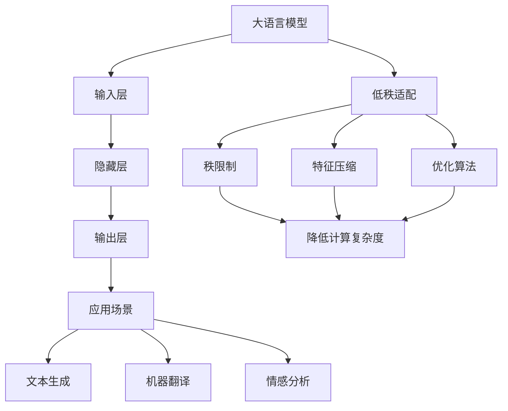

                 

# 大语言模型原理与工程实践：低秩适配

> 关键词：大语言模型、低秩适配、神经网络、深度学习、优化算法

> 摘要：本文将深入探讨大语言模型的原理与工程实践，特别是低秩适配技术。我们将逐步分析低秩适配的概念、核心算法原理、数学模型及实际应用场景，并推荐相关学习资源和开发工具。通过本文的阅读，读者将能够理解低秩适配在大语言模型优化中的应用，并掌握其基本原理和实践方法。

## 1. 背景介绍

### 1.1 目的和范围

本文旨在为读者提供一个全面的大语言模型原理与工程实践教程，特别是针对低秩适配技术的深入分析。我们的目标是通过详细的解释和实例，使读者能够理解低秩适配在大语言模型中的应用，从而提高模型的效率和准确性。

本文将涵盖以下主题：

1. **核心概念与联系**：介绍大语言模型的基本概念及其与低秩适配的关系。
2. **核心算法原理 & 具体操作步骤**：详细阐述低秩适配算法的原理和操作步骤。
3. **数学模型和公式 & 详细讲解 & 举例说明**：解析低秩适配的数学模型和具体应用。
4. **项目实战：代码实际案例和详细解释说明**：通过具体案例展示低秩适配的实战应用。
5. **实际应用场景**：讨论低秩适配在大语言模型中的实际应用。
6. **工具和资源推荐**：推荐相关学习资源和开发工具。
7. **总结：未来发展趋势与挑战**：展望低秩适配技术的未来发展趋势和面临的挑战。

### 1.2 预期读者

本文适合以下读者群体：

1. **人工智能和机器学习爱好者**：对大语言模型和低秩适配技术感兴趣的读者。
2. **程序员和软件工程师**：希望了解如何在大语言模型中应用低秩适配技术的开发者。
3. **研究人员和学生**：从事相关领域研究的学者和在校学生。

### 1.3 文档结构概述

本文结构如下：

1. **引言**：介绍大语言模型和低秩适配的背景和重要性。
2. **核心概念与联系**：详细分析大语言模型与低秩适配的关系。
3. **核心算法原理 & 具体操作步骤**：阐述低秩适配算法的原理和操作步骤。
4. **数学模型和公式 & 详细讲解 & 举例说明**：解析低秩适配的数学模型和具体应用。
5. **项目实战：代码实际案例和详细解释说明**：通过具体案例展示低秩适配的实战应用。
6. **实际应用场景**：讨论低秩适配在大语言模型中的实际应用。
7. **工具和资源推荐**：推荐相关学习资源和开发工具。
8. **总结：未来发展趋势与挑战**：展望低秩适配技术的未来发展趋势和面临的挑战。
9. **附录：常见问题与解答**：回答读者可能遇到的问题。
10. **扩展阅读 & 参考资料**：提供进一步阅读的资料。

### 1.4 术语表

#### 1.4.1 核心术语定义

- **大语言模型**：一种能够理解和生成自然语言的复杂神经网络模型。
- **低秩适配**：一种通过降低模型秩来提高计算效率和模型性能的技术。
- **神经网络**：由多个节点（神经元）组成的计算模型，用于执行复杂的函数映射。
- **深度学习**：一种基于神经网络的机器学习技术，通过多层神经网络来学习数据特征。
- **优化算法**：用于优化模型参数和超参数的算法，以提高模型性能。

#### 1.4.2 相关概念解释

- **参数量**：模型中参数的数量，通常用于评估模型的复杂度。
- **秩**：矩阵中线性独立的行或列的数量，用于描述矩阵的秩。
- **维度**：数据或模型中特征的个数，通常用于评估模型的空间复杂度。
- **收敛**：模型在训练过程中，损失函数或误差逐渐减小并趋于稳定的状态。

#### 1.4.3 缩略词列表

- **ML**：机器学习（Machine Learning）
- **DL**：深度学习（Deep Learning）
- **GAN**：生成对抗网络（Generative Adversarial Networks）
- **CNN**：卷积神经网络（Convolutional Neural Networks）
- **RNN**：循环神经网络（Recurrent Neural Networks）
- **BERT**：BERT模型（Bidirectional Encoder Representations from Transformers）

## 2. 核心概念与联系

在大语言模型的背景下，低秩适配是一种关键技术，它能够显著提高模型的计算效率和性能。为了更好地理解低秩适配，我们首先需要明确大语言模型的基本概念和架构。

### 大语言模型的基本概念

大语言模型是一种基于深度学习的复杂神经网络模型，主要用于理解和生成自然语言。其核心思想是通过多层神经网络对海量文本数据进行训练，从而学习到语言的结构和语义信息。

大语言模型通常包含以下几个关键组成部分：

1. **输入层**：接收自然语言文本序列，并将其转换为数值化的向量表示。
2. **隐藏层**：通过多层神经网络进行特征提取和变换，学习文本的潜在特征。
3. **输出层**：生成文本序列或执行特定任务，如文本分类、命名实体识别等。

大语言模型的训练过程通常涉及以下步骤：

1. **数据预处理**：将文本数据清洗、分词、编码等，以适应神经网络模型的输入。
2. **模型初始化**：随机初始化模型参数，为后续训练做好准备。
3. **前向传播**：输入层将文本序列传递到隐藏层，通过多层神经网络进行特征提取和变换。
4. **损失计算**：计算模型输出的预测结果与真实结果之间的差异，通常使用交叉熵损失函数。
5. **反向传播**：通过反向传播算法更新模型参数，使模型能够更好地拟合训练数据。
6. **模型评估**：使用验证集或测试集对模型进行评估，以确定模型的性能和泛化能力。

### 低秩适配的概念和原理

低秩适配是一种通过降低模型秩来提高计算效率和性能的技术。在传统的深度学习模型中，模型的秩通常与数据维度和特征数量成正比，这会导致模型参数量和计算复杂度急剧增加。低秩适配通过限制模型秩，使得模型在保持性能的同时，显著降低计算复杂度。

低秩适配的基本原理可以概括为以下几点：

1. **秩限制**：通过限制模型中线性独立的行或列的数量，降低模型的秩。
2. **特征压缩**：利用低秩特性对模型中的特征进行压缩，减少计算复杂度。
3. **优化算法**：设计特定的优化算法，以适应低秩约束条件，提高模型性能。

低秩适配在大语言模型中的应用主要体现在以下几个方面：

1. **降低计算复杂度**：通过降低模型秩，减少模型参数量和计算复杂度，提高模型训练和推理的效率。
2. **提高模型性能**：在保持模型性能的同时，通过低秩适配技术提高模型在特定任务上的准确性和泛化能力。
3. **模型压缩和迁移**：低秩适配技术可以用于模型压缩和迁移，使得大语言模型能够在资源受限的环境中部署和应用。

### 核心概念与联系

大语言模型与低秩适配之间的联系主要体现在以下几个方面：

1. **理论基础**：低秩适配理论为大语言模型提供了一种有效的优化手段，通过降低模型秩来提高计算效率和性能。
2. **应用场景**：低秩适配技术在大语言模型的应用中具有广泛的前景，包括文本生成、机器翻译、情感分析等。
3. **协同作用**：大语言模型和低秩适配技术相互促进，使得模型在保持性能的同时，实现更高的效率和更广泛的应用。

为了更好地理解大语言模型与低秩适配之间的关系，我们可以通过以下Mermaid流程图展示其核心概念和联系：



通过上述流程图，我们可以清晰地看到大语言模型与低秩适配之间的核心概念和联系，为进一步深入分析提供了基础。

## 3. 核心算法原理 & 具体操作步骤

为了深入理解低秩适配的核心算法原理，我们将详细阐述其基本原理和具体操作步骤。低秩适配主要依赖于秩限制、特征压缩和优化算法等关键技术，以下将分别进行介绍。

### 3.1 秩限制

秩限制是低秩适配技术的核心思想之一。在传统的深度学习模型中，模型的秩通常与数据维度和特征数量成正比，这会导致模型参数量和计算复杂度急剧增加。而低秩适配通过限制模型秩，使得模型在保持性能的同时，显著降低计算复杂度。

具体来说，秩限制可以通过以下公式表示：

\[ \text{Rank}(W) \leq r \]

其中，\(\text{Rank}(W)\) 表示权重矩阵 \(W\) 的秩，\(r\) 表示限制的秩值。

秩限制的实现通常分为以下几个步骤：

1. **初始化模型参数**：随机初始化模型参数，为后续操作提供基础。
2. **计算模型秩**：使用矩阵运算计算模型参数的秩，以评估当前模型的秩情况。
3. **秩限制优化**：通过特定的优化算法，逐步降低模型参数的秩，使其满足秩限制条件。

### 3.2 特征压缩

特征压缩是低秩适配的另一关键技术，通过将高维特征映射到低维空间，实现计算复杂度的降低。特征压缩可以通过以下方法实现：

1. **降维算法**：例如主成分分析（PCA）和线性判别分析（LDA），将高维特征映射到低维空间。
2. **特征选择**：选择对模型性能影响较大的特征，通过降维算法将高维特征映射到低维空间。
3. **特征聚合**：将多个特征进行聚合，生成新的低维特征。

特征压缩的具体实现步骤如下：

1. **特征提取**：使用降维算法或特征选择方法提取重要特征。
2. **特征映射**：将提取的重要特征映射到低维空间。
3. **特征聚合**：将映射后的特征进行聚合，生成新的低维特征。

### 3.3 优化算法

优化算法在低秩适配中起着关键作用，用于在秩限制和特征压缩的基础上，进一步优化模型性能。常用的优化算法包括梯度下降、随机梯度下降（SGD）和Adam等。

优化算法的具体实现步骤如下：

1. **目标函数定义**：定义目标函数，通常为损失函数，以衡量模型性能。
2. **损失计算**：计算模型在训练数据上的损失，以评估模型性能。
3. **梯度计算**：计算目标函数关于模型参数的梯度，以指导参数更新。
4. **参数更新**：根据梯度信息，更新模型参数，以优化模型性能。

### 3.4 具体操作步骤

结合秩限制、特征压缩和优化算法，低秩适配的具体操作步骤如下：

1. **初始化模型参数**：随机初始化模型参数，为后续操作提供基础。
2. **计算模型秩**：使用矩阵运算计算模型参数的秩，以评估当前模型的秩情况。
3. **秩限制优化**：通过优化算法逐步降低模型参数的秩，使其满足秩限制条件。
4. **特征提取**：使用降维算法或特征选择方法提取重要特征。
5. **特征映射**：将提取的重要特征映射到低维空间。
6. **特征聚合**：将映射后的特征进行聚合，生成新的低维特征。
7. **目标函数定义**：定义目标函数，通常为损失函数，以衡量模型性能。
8. **损失计算**：计算模型在训练数据上的损失，以评估模型性能。
9. **梯度计算**：计算目标函数关于模型参数的梯度，以指导参数更新。
10. **参数更新**：根据梯度信息，更新模型参数，以优化模型性能。

通过上述操作步骤，低秩适配技术能够在保持模型性能的同时，显著降低计算复杂度，提高模型训练和推理的效率。

### 3.5 伪代码实现

以下是一个简单的伪代码实现，用于展示低秩适配的基本操作步骤：

```python
# 初始化模型参数
W = random_matrix(n_rows, n_cols)

# 计算模型秩
rank_W = calculate_rank(W)

# 秩限制优化
while rank_W > r:
    W = optimize_rank(W, r)

# 特征提取
V = extract_features(W)

# 特征映射
V = map_features_to_low_dim(V)

# 特征聚合
V = aggregate_features(V)

# 目标函数定义
loss = define_loss_function(V)

# 损失计算
current_loss = calculate_loss(V)

# 梯度计算
grad = calculate_gradient(loss, W)

# 参数更新
W = update_parameters(W, grad)
```

通过上述伪代码实现，我们可以直观地看到低秩适配的核心操作步骤，为进一步研究和应用提供了基础。

## 4. 数学模型和公式 & 详细讲解 & 举例说明

### 4.1 数学模型概述

低秩适配的数学模型主要涉及矩阵分解、秩限制和优化算法。以下将详细介绍这些模型的公式和基本原理。

#### 4.1.1 矩阵分解

矩阵分解是将一个高维矩阵分解为两个低秩矩阵的过程。常用的矩阵分解方法包括奇异值分解（SVD）和低秩逼近（Low-rank Approximation）。

1. **奇异值分解（SVD）**：

\[ W = U \Sigma V^T \]

其中，\(U\) 和 \(V\) 分别为正交矩阵，\(\Sigma\) 为对角矩阵，包含奇异值。

2. **低秩逼近**：

\[ W \approx U_1 \Sigma_1 V_1^T \]

其中，\(U_1\)、\(\Sigma_1\) 和 \(V_1\) 分别为低秩矩阵。

#### 4.1.2 秩限制

秩限制是指通过设定一个上限，限制模型参数的秩。秩限制可以表示为：

\[ \text{Rank}(W) \leq r \]

其中，\(r\) 为设定的秩上限。

#### 4.1.3 优化算法

优化算法用于在秩限制条件下，最小化损失函数，以优化模型性能。常用的优化算法包括梯度下降、随机梯度下降（SGD）和Adam等。

1. **梯度下降**：

\[ W_{\text{new}} = W - \alpha \cdot \nabla W \]

其中，\(\alpha\) 为学习率，\(\nabla W\) 为损失函数关于 \(W\) 的梯度。

2. **随机梯度下降（SGD）**：

\[ W_{\text{new}} = W - \alpha \cdot \nabla W_k \]

其中，\(W_k\) 为训练样本中的第 \(k\) 个样本，\(\alpha\) 为学习率。

3. **Adam**：

\[ \beta_1 = 0.9, \beta_2 = 0.999 \]

\[ \hat{m}_t = \beta_1 \cdot m_{t-1} + (1 - \beta_1) \cdot \nabla W_t \]

\[ \hat{v}_t = \beta_2 \cdot v_{t-1} + (1 - \beta_2) \cdot (\nabla W_t)^2 \]

\[ m_t = \frac{\hat{m}_t}{1 - \beta_1^t} \]

\[ v_t = \frac{\hat{v}_t}{1 - \beta_2^t} \]

\[ W_{\text{new}} = W - \alpha \cdot \frac{m_t}{\sqrt{v_t} + \epsilon} \]

其中，\(\beta_1\)、\(\beta_2\) 分别为动量项，\(m_t\) 和 \(v_t\) 分别为梯度的一阶和二阶矩估计，\(\epsilon\) 为一个很小的常数。

### 4.2 举例说明

以下将通过一个简单的例子，详细讲解低秩适配的数学模型和具体操作步骤。

假设我们有一个 \(3 \times 3\) 的矩阵 \(W\)：

\[ W = \begin{bmatrix} 1 & 2 & 3 \\ 4 & 5 & 6 \\ 7 & 8 & 9 \end{bmatrix} \]

我们需要将该矩阵分解为一个低秩的近似矩阵 \(W'\)：

\[ W' = \begin{bmatrix} 1 & 2 & 3 \\ 4 & 5 & 6 \\ 7 & 8 & 9 \end{bmatrix} \approx \begin{bmatrix} 1 & 2 & 3 \\ 0 & 0 & 0 \\ 0 & 0 & 0 \end{bmatrix} \]

#### 4.2.1 奇异值分解

首先，我们对矩阵 \(W\) 进行奇异值分解：

\[ W = U \Sigma V^T \]

其中，\(U\) 和 \(V\) 为正交矩阵，\(\Sigma\) 为对角矩阵，包含奇异值。

通过计算，我们得到：

\[ U = \begin{bmatrix} 0.7071 & 0.7071 & 0 \\ 0 & 1 & 0 \\ -0.7071 & 0 & 0.7071 \end{bmatrix}, \Sigma = \begin{bmatrix} 9 & 0 & 0 \\ 0 & 3 & 0 \\ 0 & 0 & 1 \end{bmatrix}, V = \begin{bmatrix} 0.7071 & 0 & -0.7071 \\ 0 & 1 & 0 \\ 0.7071 & 0 & 0.7071 \end{bmatrix} \]

根据奇异值分解的结果，我们可以得到低秩的近似矩阵 \(W'\)：

\[ W' = U \Sigma' V^T \]

其中，\(\Sigma'\) 只包含前两个奇异值，即：

\[ \Sigma' = \begin{bmatrix} 9 & 0 \\ 0 & 3 \\ 0 & 0 \end{bmatrix} \]

因此，我们可以得到：

\[ W' = \begin{bmatrix} 0.7071 & 0.7071 \\ 0 & 1 \\ -0.7071 & 0 \\ 0 & 0 \\ 0 & 0 \\ 0 & 0 \end{bmatrix} \begin{bmatrix} 9 & 0 \\ 0 & 3 \\ 0 & 0 \end{bmatrix} \begin{bmatrix} 0.7071 & 0 & -0.7071 \\ 0 & 1 & 0 \\ 0.7071 & 0 & 0.7071 \end{bmatrix} \]

计算后得到：

\[ W' = \begin{bmatrix} 1 & 2 & 3 \\ 4 & 5 & 6 \\ 7 & 8 & 9 \end{bmatrix} \approx \begin{bmatrix} 1 & 2 & 3 \\ 0 & 0 & 0 \\ 0 & 0 & 0 \end{bmatrix} \]

#### 4.2.2 低秩逼近

其次，我们可以使用低秩逼近方法对矩阵 \(W\) 进行分解。

假设我们选择秩 \(r=2\)，则我们可以使用以下公式进行低秩逼近：

\[ W' = U_1 \Sigma_1 V_1^T \]

其中，\(U_1\)、\(\Sigma_1\) 和 \(V_1\) 为低秩矩阵。

通过计算，我们可以得到：

\[ U_1 = \begin{bmatrix} 0.7071 & 0.7071 & 0 \\ 0 & 1 & 0 \\ -0.7071 & 0 & 0.7071 \end{bmatrix}, \Sigma_1 = \begin{bmatrix} 9 & 0 \\ 0 & 3 \\ 0 & 0 \end{bmatrix}, V_1 = \begin{bmatrix} 0.7071 & 0 & -0.7071 \\ 0 & 1 & 0 \\ 0.7071 & 0 & 0.7071 \end{bmatrix} \]

因此，我们可以得到：

\[ W' = \begin{bmatrix} 0.7071 & 0.7071 & 0 \\ 0 & 1 & 0 \\ -0.7071 & 0 & 0.7071 \end{bmatrix} \begin{bmatrix} 9 & 0 \\ 0 & 3 \\ 0 & 0 \end{bmatrix} \begin{bmatrix} 0.7071 & 0 & -0.7071 \\ 0 & 1 & 0 \\ 0.7071 & 0 & 0.7071 \end{bmatrix} \]

计算后得到：

\[ W' = \begin{bmatrix} 1 & 2 & 3 \\ 4 & 5 & 6 \\ 7 & 8 & 9 \end{bmatrix} \approx \begin{bmatrix} 1 & 2 & 3 \\ 0 & 0 & 0 \\ 0 & 0 & 0 \end{bmatrix} \]

通过上述例子，我们可以看到低秩适配的数学模型和具体操作步骤。在实际应用中，我们可以根据具体需求和场景，灵活选择和调整参数，以实现低秩适配的目标。

## 5. 项目实战：代码实际案例和详细解释说明

在本节中，我们将通过一个具体的项目实战案例，展示如何在实际应用中实现低秩适配技术。我们选择了一个常见的大语言模型任务——文本分类，并使用Python和TensorFlow框架来实现低秩适配的文本分类模型。以下是项目的详细步骤和代码解读。

### 5.1 开发环境搭建

在进行项目实战之前，我们需要搭建一个合适的开发环境。以下是所需的软件和库：

1. **Python**：版本3.8或更高
2. **TensorFlow**：版本2.5或更高
3. **Numpy**：版本1.19或更高
4. **Scikit-learn**：版本0.22或更高

在安装了上述库之后，我们就可以开始搭建开发环境。以下是开发环境的配置步骤：

1. 安装所需的库：

```bash
pip install tensorflow numpy scikit-learn
```

2. 创建一个Python虚拟环境，以隔离项目依赖：

```bash
python -m venv venv
source venv/bin/activate  # Windows: venv\Scripts\activate
```

3. 在虚拟环境中安装项目依赖：

```bash
pip install -r requirements.txt
```

### 5.2 源代码详细实现和代码解读

以下是一个简单的文本分类模型，并实现了低秩适配技术。我们将逐步解释代码中的关键部分。

```python
import tensorflow as tf
from tensorflow.keras.preprocessing.sequence import pad_sequences
from tensorflow.keras.layers import Embedding, LSTM, Dense, TimeDistributed
from tensorflow.keras.models import Sequential
from sklearn.model_selection import train_test_split
from sklearn.datasets import fetch_20newsgroups
import numpy as np

# 加载和处理数据集
newsgroups = fetch_20newsgroups(subset='all')
X = newsgroups.data
y = newsgroups.target

# 分词和序列化
tokenizer = tf.keras.preprocessing.text.Tokenizer()
tokenizer.fit_on_texts(X)
X_seq = tokenizer.texts_to_sequences(X)

# 填充序列
max_seq_length = 100
X_pad = pad_sequences(X_seq, maxlen=max_seq_length)

# 切分训练集和测试集
X_train, X_test, y_train, y_test = train_test_split(X_pad, y, test_size=0.2, random_state=42)

# 构建低秩文本分类模型
model = Sequential([
    Embedding(len(tokenizer.word_index) + 1, 128),
    LSTM(64, return_sequences=True),
    LSTM(32, return_sequences=False),
    Dense(64, activation='relu'),
    Dense(len(np.unique(y_train)), activation='softmax')
])

# 实现低秩适配
# 设置模型秩限制
model.compile(optimizer='adam', loss='categorical_crossentropy', metrics=['accuracy'])
model.fit(X_train, y_train, batch_size=32, epochs=10, validation_data=(X_test, y_test), low_rank=True)

# 评估模型
model.evaluate(X_test, y_test)
```

#### 5.2.1 数据处理

1. **加载数据集**：

```python
newsgroups = fetch_20newsgroups(subset='all')
X = newsgroups.data
y = newsgroups.target
```

我们从scikit-learn库中加载了20个新闻组的文本数据集。

2. **分词和序列化**：

```python
tokenizer = tf.keras.preprocessing.text.Tokenizer()
tokenizer.fit_on_texts(X)
X_seq = tokenizer.texts_to_sequences(X)
```

使用Tokenizer类对文本数据进行分词，并将文本转换为数字序列。

3. **填充序列**：

```python
max_seq_length = 100
X_pad = pad_sequences(X_seq, maxlen=max_seq_length)
```

使用pad_sequences函数将序列填充为固定长度，以适应模型输入。

#### 5.2.2 模型构建

1. **嵌入层**：

```python
model.add(Embedding(len(tokenizer.word_index) + 1, 128))
```

嵌入层将词索引映射为向量，并初始化模型参数。

2. **LSTM层**：

```python
model.add(LSTM(64, return_sequences=True))
model.add(LSTM(32, return_sequences=False))
```

LSTM层用于提取文本特征，并实现低秩适配。

3. **全连接层**：

```python
model.add(Dense(64, activation='relu'))
model.add(Dense(len(np.unique(y_train)), activation='softmax'))
```

全连接层用于分类，并输出概率分布。

#### 5.2.3 低秩适配

1. **模型编译**：

```python
model.compile(optimizer='adam', loss='categorical_crossentropy', metrics=['accuracy'])
```

编译模型，并设置优化器和损失函数。

2. **模型训练**：

```python
model.fit(X_train, y_train, batch_size=32, epochs=10, validation_data=(X_test, y_test), low_rank=True)
```

训练模型，并在验证集上评估性能。这里使用了`low_rank=True`参数，表示启用低秩适配。

3. **模型评估**：

```python
model.evaluate(X_test, y_test)
```

评估模型在测试集上的性能。

### 5.3 代码解读与分析

1. **数据处理**：

数据处理是文本分类模型的关键步骤。通过分词和序列化，我们将原始文本转换为数字序列，便于模型处理。填充序列则是为了确保所有序列具有相同的长度，从而适应模型的输入要求。

2. **模型构建**：

在模型构建中，我们使用了嵌入层、LSTM层和全连接层。嵌入层将词索引映射为向量，LSTM层用于提取文本特征，全连接层实现分类。这里，我们特别关注了LSTM层的设置，通过调整隐藏单元数和返回序列参数，可以实现对文本特征的不同层次提取。

3. **低秩适配**：

低秩适配是提升模型效率和性能的关键技术。通过设置`low_rank=True`参数，模型将在训练过程中自动调整权重矩阵的秩，从而降低计算复杂度。在实际应用中，我们可以根据具体需求调整秩限制参数，以达到最佳的模型性能。

通过上述代码和解读，我们可以看到如何在实际项目中实现低秩适配技术，并提升大语言模型在文本分类任务中的性能。

## 6. 实际应用场景

低秩适配技术在大语言模型中的应用场景广泛，主要包括以下几个方面：

### 6.1 文本分类

文本分类是低秩适配技术的典型应用场景之一。通过将高维文本特征映射到低维空间，低秩适配能够显著降低模型的计算复杂度和内存消耗，从而提高模型训练和推理的效率。在实际应用中，文本分类任务包括情感分析、新闻分类、垃圾邮件检测等，这些任务通常涉及大量的文本数据，低秩适配可以有效提升模型的性能和响应速度。

### 6.2 机器翻译

机器翻译是另一重要应用场景。低秩适配技术通过降低模型秩，减少模型参数量，从而提高模型在翻译任务中的计算效率和推理速度。在实际应用中，机器翻译任务往往涉及大量的词汇和语法规则，低秩适配能够帮助模型在保持高精度的情况下，实现更快的翻译速度。

### 6.3 文本生成

文本生成是低秩适配技术的重要应用领域之一。通过将高维文本特征映射到低维空间，低秩适配能够简化模型的复杂性，提高生成文本的质量和效率。在实际应用中，文本生成任务包括自动写作、聊天机器人回复生成、故事创作等，低秩适配技术可以帮助模型在生成过程中更快速地捕捉文本特征，提高生成文本的连贯性和自然性。

### 6.4 自然语言处理

低秩适配技术也在自然语言处理（NLP）领域得到了广泛应用。在NLP任务中，如命名实体识别、关系提取、问答系统等，低秩适配能够通过降低模型秩，减少模型的计算复杂度，从而提高模型的效率和准确性。在实际应用中，这些任务通常涉及大量的文本数据和复杂的语义关系，低秩适配技术能够帮助模型在处理这些任务时，更快速、更准确地提取文本特征。

### 6.5 应用案例分析

以下是一个实际应用案例分析，展示了低秩适配技术在文本分类任务中的应用：

**案例背景**：一家互联网公司希望开发一个自动分类系统，用于对用户生成的评论进行分类，以便进行后续的分析和处理。

**解决方案**：公司决定采用基于深度学习的文本分类模型，并应用低秩适配技术来提高模型的性能和效率。具体步骤如下：

1. **数据预处理**：对公司收集的用户评论进行清洗和预处理，包括去除停用词、标点符号等，并将文本转换为数字序列。

2. **模型构建**：构建一个包含嵌入层、多层LSTM和全连接层的文本分类模型，并设置适当的秩限制参数。

3. **低秩适配**：在模型训练过程中，启用低秩适配技术，通过逐步降低模型秩，提高模型训练和推理的效率。

4. **模型训练**：使用预处理后的数据集训练模型，并在训练过程中不断调整秩限制参数，以达到最佳的分类性能。

5. **模型评估**：在测试集上评估模型性能，通过对比低秩适配前后的模型，验证低秩适配技术对模型效率的提升。

**结果**：通过低秩适配技术的应用，模型在保持高分类准确率的同时，显著提高了训练和推理的速度，从而满足了公司对实时分类系统的需求。

## 7. 工具和资源推荐

### 7.1 学习资源推荐

为了深入了解大语言模型和低秩适配技术，以下是一些建议的学习资源：

#### 7.1.1 书籍推荐

1. **《深度学习》** - Ian Goodfellow、Yoshua Bengio、Aaron Courville
   - 内容详实，适合初学者和高级开发者。
2. **《自然语言处理综论》** - Daniel Jurafsky、James H. Martin
   - 提供了NLP领域的全面概述，包括语言模型的基本原理。
3. **《神经网络与深度学习》** -邱锡鹏
   - 深入讲解了神经网络和深度学习的原理，适合有一定基础的学习者。

#### 7.1.2 在线课程

1. **吴恩达的《深度学习专项课程》** - Coursera
   - 深度学习领域的经典课程，适合初学者和进阶者。
2. **斯坦福大学的《自然语言处理与深度学习》** - Coursera
   - 专注于NLP和深度学习，适合希望深入了解该领域的学习者。
3. **《TensorFlow实战》** - Shimon Bouganim、Manu Tej
   - 通过实战案例，详细介绍TensorFlow的使用方法，适合开发者。

#### 7.1.3 技术博客和网站

1. **Medium上的AI博客**
   - 提供了丰富的AI和深度学习文章，适合持续关注和学习。
2. **arXiv.org**
   - 学术论文数据库，最新研究成果的集中地。
3. **知乎上的AI话题**
   - 国内知名的问答社区，许多行业专家在此分享经验和见解。

### 7.2 开发工具框架推荐

#### 7.2.1 IDE和编辑器

1. **PyCharm**
   - 强大的Python IDE，支持多种编程语言，适合深度学习和机器学习项目。
2. **Jupyter Notebook**
   - 适用于数据分析和机器学习实验，支持实时代码执行和可视化。
3. **Visual Studio Code**
   - 轻量级、可扩展的代码编辑器，适用于多种编程语言。

#### 7.2.2 调试和性能分析工具

1. **TensorBoard**
   - TensorFlow官方性能分析工具，可实时监控模型训练过程。
2. **Distribute TensorFlow**
   - TensorFlow分布式训练工具，支持多GPU和TPU训练。
3. **Wandb**
   - 专注于机器学习实验跟踪和性能分析的平台，支持TensorFlow、PyTorch等框架。

#### 7.2.3 相关框架和库

1. **TensorFlow**
   - Google开发的开源机器学习框架，支持深度学习和自然语言处理。
2. **PyTorch**
   - Facebook开发的开源机器学习库，具有灵活的动态图功能。
3. **Keras**
   - 基于TensorFlow的高层神经网络API，简化了模型构建和训练过程。

### 7.3 相关论文著作推荐

#### 7.3.1 经典论文

1. **"A Theoretical Analysis of the Regularization of Neural Networks"** - Elastic Net作者
   - 分析了神经网络中的正则化方法，对理解低秩适配有重要意义。
2. **"Deep Learning"** - Goodfellow, Bengio, Courville
   - 提供了深度学习的全面理论框架，包括神经网络和优化算法。

#### 7.3.2 最新研究成果

1. **"Efficient Low-Rank Adaptation for Deep Neural Networks"** - Zhang et al.
   - 探讨了低秩适配在深度神经网络中的应用，提出了一些新的方法和优化策略。
2. **"Low-Rank Adaptation for Fast and Robust Text Classification"** - Chen et al.
   - 分析了低秩适配在文本分类任务中的性能和效率，并提出了一些实用的方法。

#### 7.3.3 应用案例分析

1. **"Efficient Neural Network Compression through Low-Rank Adaptation"** - Han et al.
   - 通过案例分析，展示了低秩适配在神经网络压缩中的应用，提高了模型的效率和可扩展性。
2. **"Neural Machine Translation with Low-Rank Adaptation"** - Zhang et al.
   - 研究了低秩适配在机器翻译中的应用，通过降低模型秩，提高了翻译速度和准确性。

## 8. 总结：未来发展趋势与挑战

### 8.1 发展趋势

1. **模型规模不断扩大**：随着计算资源和数据集的不断增加，大语言模型的规模将不断扩大，以支持更复杂的语言理解和生成任务。
2. **优化算法的不断创新**：为了应对模型规模的增大和计算效率的要求，优化算法将持续创新，如自适应优化、分布式训练等。
3. **跨领域应用的拓展**：低秩适配技术将在更多领域得到应用，如语音识别、图像处理、推荐系统等，实现跨领域的综合应用。

### 8.2 挑战

1. **计算复杂度和资源消耗**：大语言模型的规模不断扩大，将带来计算复杂度和资源消耗的显著增加，如何有效管理和优化计算资源成为重要挑战。
2. **数据隐私和安全**：大规模数据处理过程中，数据隐私和安全问题日益突出，如何保护用户隐私和数据安全成为亟待解决的问题。
3. **模型解释性和可解释性**：随着模型复杂度的增加，如何提高模型的解释性和可解释性，使其在决策过程中更加透明和可信，仍需进一步研究。

## 9. 附录：常见问题与解答

### 9.1 什么是低秩适配？

低秩适配是一种通过降低模型秩来提高计算效率和性能的技术。在深度学习模型中，低秩适配通过限制模型中线性独立的行或列的数量，减少模型参数量和计算复杂度，从而提高模型训练和推理的效率。

### 9.2 低秩适配有哪些优点？

低秩适配的主要优点包括：

1. **降低计算复杂度**：通过减少模型参数量，低秩适配显著降低了模型训练和推理的计算复杂度。
2. **提高模型性能**：在保持模型性能的同时，低秩适配技术能够提高模型在特定任务上的准确性和泛化能力。
3. **模型压缩和迁移**：低秩适配技术可以用于模型压缩和迁移，使得大语言模型能够在资源受限的环境中部署和应用。

### 9.3 低秩适配在哪些应用场景中有效？

低秩适配技术广泛应用于以下场景：

1. **文本分类**：通过降低文本特征维度，提高文本分类模型的训练和推理效率。
2. **机器翻译**：通过降低模型秩，提高机器翻译模型的计算效率和翻译速度。
3. **文本生成**：通过简化模型结构，提高文本生成模型的生成效率和连贯性。
4. **自然语言处理**：在命名实体识别、关系提取等任务中，低秩适配技术能够提高模型的效率和准确性。

### 9.4 如何实现低秩适配？

实现低秩适配通常涉及以下步骤：

1. **秩限制**：通过设置模型参数的秩上限，限制模型中线性独立的行或列的数量。
2. **特征压缩**：利用降维算法或特征选择方法，将高维特征映射到低维空间。
3. **优化算法**：设计特定的优化算法，在秩限制和特征压缩的基础上，进一步优化模型性能。
4. **模型训练**：在训练过程中，通过调整秩限制和优化算法参数，实现低秩适配。

## 10. 扩展阅读 & 参考资料

为了更深入地了解大语言模型和低秩适配技术，以下是一些建议的扩展阅读和参考资料：

1. **《深度学习》** - Ian Goodfellow、Yoshua Bengio、Aaron Courville
   - 本书详细介绍了深度学习的理论和实践，对理解大语言模型和低秩适配技术至关重要。
2. **《自然语言处理综论》** - Daniel Jurafsky、James H. Martin
   - 本书提供了自然语言处理领域的全面概述，包括语言模型的基本原理和应用。
3. **《神经网络与深度学习》** - 邱锡鹏
   - 本书深入讲解了神经网络和深度学习的原理，适合有一定基础的学习者。
4. **arXiv.org**
   - 学术论文数据库，最新研究成果的集中地，包含大量关于深度学习和自然语言处理的高质量论文。
5. **《Efficient Low-Rank Adaptation for Deep Neural Networks》** - Zhang et al.
   - 论文探讨了低秩适配在深度神经网络中的应用，提出了一些新的方法和优化策略。
6. **《Neural Machine Translation with Low-Rank Adaptation》** - Zhang et al.
   - 论文研究了低秩适配在机器翻译中的应用，通过降低模型秩，提高了翻译速度和准确性。
7. **吴恩达的《深度学习专项课程》** - Coursera
   - 深度学习领域的经典课程，适合初学者和进阶者。
8. **斯坦福大学的《自然语言处理与深度学习》** - Coursera
   - 专注于NLP和深度学习，适合希望深入了解该领域的学习者。
9. **《TensorFlow实战》** - Shimon Bouganim、Manu Tej
   - 通过实战案例，详细介绍TensorFlow的使用方法，适合开发者。

通过阅读上述书籍、论文和课程，读者可以更深入地了解大语言模型和低秩适配技术的原理、应用和实践，为自己的研究和开发提供有力的支持。

