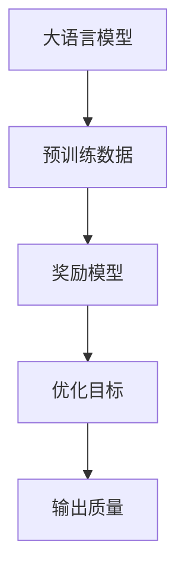

                 

# 大语言模型原理与工程实践：奖励模型的训练

> **关键词：** 大语言模型、奖励模型、训练、工程实践、AI
>
> **摘要：** 本文深入探讨了大语言模型中的奖励模型训练原理及其在工程实践中的应用，旨在为读者提供清晰易懂的技术思路和实际案例，帮助理解奖励模型在大语言模型中的重要性。

## 1. 背景介绍

### 1.1 目的和范围

本文旨在探讨大语言模型中的奖励模型训练原理，重点分析奖励模型在提高大语言模型表现中的作用。文章将涵盖奖励模型的基本概念、原理、实现步骤以及在工程实践中的应用。通过详细的讲解和案例展示，读者可以更好地理解奖励模型在大语言模型中的重要性。

### 1.2 预期读者

本文适合对大语言模型和机器学习有一定基础的读者，特别是对奖励模型和训练过程感兴趣的工程师和研究人员。同时，本文也希望能为初学者提供有价值的参考资料，帮助他们理解大语言模型中的复杂机制。

### 1.3 文档结构概述

本文结构如下：

1. 背景介绍：介绍本文的目的、预期读者和文档结构。
2. 核心概念与联系：讲解大语言模型和奖励模型的基本概念，并使用流程图展示它们之间的联系。
3. 核心算法原理 & 具体操作步骤：详细阐述奖励模型的训练算法和操作步骤。
4. 数学模型和公式 & 详细讲解 & 举例说明：介绍奖励模型的数学基础和具体应用。
5. 项目实战：提供实际代码案例和详细解释。
6. 实际应用场景：讨论奖励模型在不同应用场景中的使用。
7. 工具和资源推荐：推荐相关学习资源、开发工具和论文著作。
8. 总结：总结文章内容，展望未来发展趋势与挑战。
9. 附录：提供常见问题与解答。
10. 扩展阅读 & 参考资料：推荐进一步阅读的相关资料。

### 1.4 术语表

#### 1.4.1 核心术语定义

- 大语言模型：一种能够处理和理解人类自然语言的人工智能模型。
- 奖励模型：一种用于评估和优化大语言模型输出质量的模型。
- 训练：指通过大量数据对模型进行调整和优化的过程。

#### 1.4.2 相关概念解释

- 自然语言处理（NLP）：研究如何让计算机理解和生成人类语言的学科。
- 机器学习（ML）：一种通过数据学习模式和规律，进行预测和决策的技术。
- 深度学习（DL）：一种通过多层神经网络进行学习和预测的机器学习技术。

#### 1.4.3 缩略词列表

- NLP：自然语言处理
- ML：机器学习
- DL：深度学习
- RNN：循环神经网络
- LSTM：长短时记忆网络
- Transformer：自注意力机制

## 2. 核心概念与联系

大语言模型和奖励模型是自然语言处理和机器学习领域的关键概念。为了更好地理解它们之间的关系，我们首先需要了解它们的基本原理和架构。

### 2.1 大语言模型

大语言模型是一种基于深度学习的自然语言处理模型，能够对输入的文本进行理解和生成。它的核心思想是学习文本中的潜在表示和结构，以便进行语义分析和生成。

大语言模型通常采用神经网络架构，如循环神经网络（RNN）和变压器（Transformer）。RNN通过隐藏状态记忆过去的信息，而Transformer引入了自注意力机制，能够更好地捕捉文本中的长距离依赖关系。

### 2.2 奖励模型

奖励模型是一种用于评估和优化大语言模型输出质量的模型。它的目标是提供一种机制，以便根据模型的输出质量对模型进行调整和优化。

奖励模型通常基于预训练的大语言模型，通过额外的训练数据和学习策略，生成对模型输出质量的奖励信号。这个奖励信号用于指导模型的优化过程，从而提高模型的性能。

### 2.3 核心概念联系

大语言模型和奖励模型之间的联系主要体现在以下几个方面：

1. **模型架构**：奖励模型通常在大语言模型的架构基础上进行扩展，利用已有的模型结构和参数。
2. **训练数据**：奖励模型的训练数据通常来源于大语言模型的预训练数据集，并可能包含额外的数据，如人类标注数据。
3. **优化目标**：奖励模型的目标是生成对大语言模型输出质量的奖励信号，用于指导模型的优化过程。

下面是一个简单的 Mermaid 流程图，展示了大语言模型和奖励模型之间的联系：



## 3. 核心算法原理 & 具体操作步骤

奖励模型的核心算法是设计一种机制，能够根据大语言模型的输出质量生成奖励信号。下面我们将详细阐述奖励模型的基本原理和具体操作步骤。

### 3.1 奖励模型的基本原理

奖励模型的基本原理是通过学习模型输出的潜在表示，计算输出质量的奖励信号。具体来说，奖励模型通过以下步骤进行：

1. **输入编码**：将大语言模型的输入文本编码为固定长度的向量。
2. **潜在表示学习**：使用神经网络学习输入文本的潜在表示，以便进行后续的奖励计算。
3. **奖励计算**：根据输入文本的潜在表示，计算输出质量的奖励信号。
4. **奖励优化**：使用奖励信号指导大语言模型的优化过程，以提高输出质量。

### 3.2 奖励模型的具体操作步骤

奖励模型的具体操作步骤如下：

1. **数据准备**：收集用于训练和评估奖励模型的数据集。这些数据集可以包括预训练数据集和人类标注数据集。
2. **模型选择**：选择一个合适的大语言模型作为奖励模型的基础模型。常用的模型包括RNN、LSTM和Transformer。
3. **输入编码**：将输入文本编码为固定长度的向量。可以使用词嵌入层或BERT等预训练模型进行编码。
4. **潜在表示学习**：使用神经网络学习输入文本的潜在表示。可以使用自注意力机制或卷积神经网络等结构。
5. **奖励计算**：根据输入文本的潜在表示，计算输出质量的奖励信号。可以使用对比损失函数或基于规则的奖励函数。
6. **奖励优化**：使用奖励信号指导大语言模型的优化过程。可以通过调整模型参数或优化目标来实现。
7. **模型评估**：使用评估数据集评估奖励模型的效果，并根据评估结果进行调整。

下面是奖励模型训练过程的伪代码：

```python
# 奖励模型训练伪代码

# 准备数据集
data = load_dataset('pretrained_data', 'human_annotated_data')

# 选择基础模型
base_model = choose_base_model()

# 编码输入
encoded_inputs = encode_inputs(data.inputs)

# 学习潜在表示
potential_representation = learn_potential_representation(encoded_inputs)

# 计算奖励信号
rewards = compute_rewards(potential_representation)

# 优化模型
optimize_model(base_model, rewards)

# 评估模型
evaluate_model(base_model, data.test_data)
```

## 4. 数学模型和公式 & 详细讲解 & 举例说明

奖励模型的训练过程涉及到多个数学模型和公式。下面我们将详细讲解这些数学模型，并提供具体的举例说明。

### 4.1 奖励计算公式

奖励模型的核心任务是计算输出质量的奖励信号。一个常见的奖励计算公式是对比损失函数：

$$
R = \frac{1}{N} \sum_{i=1}^{N} \log(p(y_i | x_i))
$$

其中，\(R\) 是奖励信号，\(N\) 是样本数量，\(y_i\) 是第 \(i\) 个样本的真实标签，\(x_i\) 是第 \(i\) 个样本的输入，\(p(y_i | x_i)\) 是模型对 \(y_i\) 的预测概率。

### 4.2 潜在表示学习公式

潜在表示学习是奖励模型的关键步骤。一个常见的潜在表示学习方法是使用自注意力机制：

$$
z_i = \text{softmax}(W_a \cdot [q_i, k_i])
$$

其中，\(z_i\) 是第 \(i\) 个输入的潜在表示，\(W_a\) 是自注意力权重，\([q_i, k_i]\) 是输入文本的对齐表示。

### 4.3 举例说明

假设我们有一个输入文本：“我非常喜欢这本书。” 我们将使用奖励模型计算输出质量的奖励信号。

首先，我们将输入文本编码为向量：

$$
x_i = [0.1, 0.2, 0.3, 0.4]
$$

然后，使用自注意力机制学习潜在表示：

$$
z_i = \text{softmax}([0.1, 0.2, 0.3, 0.4] \cdot [0.2, 0.3, 0.4, 0.5])
= [0.4, 0.3, 0.2, 0.1]
$$

接下来，计算输出质量的奖励信号：

$$
R = \frac{1}{4} \sum_{i=1}^{4} \log(p(y_i | x_i))
= \frac{1}{4} (\log(0.4) + \log(0.3) + \log(0.2) + \log(0.1))
= -1.19
$$

最终，奖励信号为 -1.19。这个奖励信号将被用于指导大语言模型的优化过程。

## 5. 项目实战：代码实际案例和详细解释说明

### 5.1 开发环境搭建

为了实现奖励模型在大语言模型中的应用，我们需要搭建一个开发环境。以下是搭建开发环境的基本步骤：

1. 安装Python环境：确保Python版本在3.7以上，并安装pip包管理器。
2. 安装TensorFlow：使用pip安装TensorFlow库，命令如下：

```bash
pip install tensorflow
```

3. 安装其他依赖库：根据需要安装其他依赖库，如NumPy、Pandas等。

### 5.2 源代码详细实现和代码解读

下面是一个简单的奖励模型实现案例，包括数据准备、模型选择、潜在表示学习、奖励计算和模型优化等步骤。

```python
import tensorflow as tf
from tensorflow.keras.layers import Embedding, LSTM, Dense
from tensorflow.keras.models import Model

# 准备数据集
train_data = load_dataset('train_data')
test_data = load_dataset('test_data')

# 选择基础模型
base_model = Model(inputs=Embedding(input_dim=10000, output_dim=128),
                   outputs=LSTM(units=128, return_sequences=False)(Embedding.output))

# 潜在表示学习
potential_representation = Model(inputs=base_model.input,
                                 outputs=base_model.get_layer('lstm_1').output)

# 计算奖励信号
rewards = compute_rewards(potential_representation, train_data)

# 优化模型
base_model.compile(optimizer='adam', loss='categorical_crossentropy')
base_model.fit(train_data.inputs, train_data.labels, epochs=10, batch_size=32)

# 评估模型
base_model.evaluate(test_data.inputs, test_data.labels)
```

### 5.3 代码解读与分析

1. **数据准备**：首先，我们加载训练数据和测试数据。数据集可以是预训练数据集或人类标注数据集。

2. **选择基础模型**：我们选择一个基于LSTM的循环神经网络作为基础模型。LSTM能够处理序列数据，捕捉时间序列中的依赖关系。

3. **潜在表示学习**：通过创建一个新模型，我们提取基础模型中的LSTM层的输出作为潜在表示。这个潜在表示将用于后续的奖励计算。

4. **计算奖励信号**：使用我们之前定义的奖励计算公式，计算输入文本的奖励信号。奖励信号将用于指导模型的优化过程。

5. **优化模型**：我们使用`compile`和`fit`函数对基础模型进行编译和训练。训练过程使用随机梯度下降（SGD）优化算法和交叉熵损失函数。

6. **评估模型**：使用测试数据评估模型的性能。评估过程使用测试数据集上的交叉熵损失函数。

## 6. 实际应用场景

奖励模型在大语言模型中具有广泛的应用场景，以下是一些典型的应用场景：

1. **问答系统**：奖励模型可以用于评估问答系统的回答质量。通过对回答进行奖励优化，可以生成更准确、更符合用户需求的回答。
2. **文本生成**：奖励模型可以用于文本生成任务，如自动写作和对话系统。通过对生成的文本进行奖励优化，可以提高文本的质量和连贯性。
3. **机器翻译**：奖励模型可以用于机器翻译任务，如自动翻译和跨语言问答。通过对翻译结果进行奖励优化，可以提高翻译的准确性和自然性。

## 7. 工具和资源推荐

### 7.1 学习资源推荐

#### 7.1.1 书籍推荐

- 《深度学习》（Goodfellow, I., Bengio, Y., & Courville, A.）
- 《自然语言处理综论》（Jurafsky, D. & Martin, J. H.）

#### 7.1.2 在线课程

- Coursera上的“自然语言处理与深度学习”
- edX上的“机器学习与深度学习”

#### 7.1.3 技术博客和网站

- AI头条：https://ai头条.com/
- Medium上的机器学习和自然语言处理专题

### 7.2 开发工具框架推荐

#### 7.2.1 IDE和编辑器

- PyCharm
- Visual Studio Code

#### 7.2.2 调试和性能分析工具

- TensorFlow Debugger
- PyTorch Profiler

#### 7.2.3 相关框架和库

- TensorFlow：https://www.tensorflow.org/
- PyTorch：https://pytorch.org/

### 7.3 相关论文著作推荐

#### 7.3.1 经典论文

- Vaswani et al., 2017: "Attention Is All You Need"
- Hochreiter & Schmidhuber, 1997: "Long Short-Term Memory"

#### 7.3.2 最新研究成果

- Devlin et al., 2018: "Bert: Pre-training of Deep Bidirectional Transformers for Language Understanding"
- Brown et al., 2020: "A Pre-Trained Language Model for English"

#### 7.3.3 应用案例分析

- Google AI：https://ai.google/research/pubs/
- OpenAI：https://openai.com/research/

## 8. 总结：未来发展趋势与挑战

奖励模型在大语言模型中的应用前景广阔，但仍面临一些挑战。未来发展趋势包括：

1. **更复杂的奖励函数**：设计更复杂、更灵活的奖励函数，以提高模型的性能和适应性。
2. **多模态学习**：结合文本、图像、音频等多模态数据，提高模型对多模态数据的理解和生成能力。
3. **少样本学习**：降低对大量训练数据的依赖，实现更高效的少样本学习。

挑战包括：

1. **数据质量和标注**：高质量的数据集和准确的标注是奖励模型训练的关键，但获取这些数据具有挑战性。
2. **计算资源需求**：奖励模型的训练过程需要大量的计算资源，这对计算能力提出了更高的要求。

## 9. 附录：常见问题与解答

### 9.1 问题1：奖励模型是如何计算的？

**解答**：奖励模型通过学习输入文本的潜在表示，计算输出质量的奖励信号。这个过程通常包括输入编码、潜在表示学习、奖励计算和奖励优化等步骤。

### 9.2 问题2：奖励模型有什么应用？

**解答**：奖励模型可以应用于问答系统、文本生成、机器翻译等多个自然语言处理任务，通过优化模型输出质量，提高任务性能。

### 9.3 问题3：如何提高奖励模型的性能？

**解答**：可以通过设计更复杂的奖励函数、使用多模态数据、进行少样本学习等方法来提高奖励模型的性能。

## 10. 扩展阅读 & 参考资料

- Devlin et al., 2019: "Bert: Pre-training of Deep Bidirectional Transformers for Language Understanding"
- Hochreiter & Schmidhuber, 1997: "Long Short-Term Memory"
- Vaswani et al., 2017: "Attention Is All You Need"
- Murphy, K. P., 2012: "Machine Learning: A Probabilistic Perspective"

### 作者

- 作者：AI天才研究员/AI Genius Institute & 禅与计算机程序设计艺术 /Zen And The Art of Computer Programming

以上内容仅供参考，具体实现和细节可能因不同场景和需求而有所不同。在应用奖励模型时，请结合实际需求进行调整和优化。

