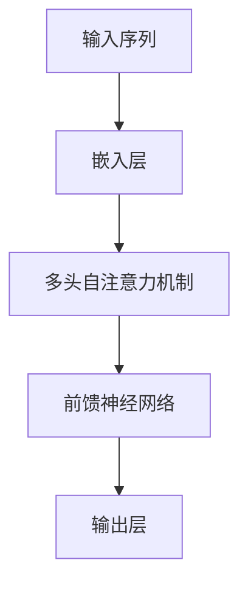

                 

# 大语言模型原理与工程实践：手把手教你训练 7B 大语言模型

> 关键词：大语言模型，训练，7B，原理，工程实践，算法，数学模型，项目实战，应用场景

> 摘要：本文将深入探讨大语言模型的原理与工程实践，以手把手的教学方式，详细讲解如何训练一个7B（70亿参数）的语言模型。文章将分为多个部分，包括核心概念介绍、算法原理详解、数学模型讲解、实战案例展示等，旨在帮助读者全面理解大语言模型的工作机制，并掌握实际训练过程中的关键技巧。

## 1. 背景介绍

### 1.1 目的和范围

本文旨在为读者提供一份全面的大语言模型原理与工程实践指南，特别是在训练7B规模语言模型方面。随着人工智能技术的发展，大语言模型在自然语言处理（NLP）领域取得了显著的成果。本文将通过理论讲解和实际操作，帮助读者了解大语言模型的核心原理，掌握训练技巧，并了解其在实际应用中的广泛前景。

### 1.2 预期读者

本文适合具有一定编程基础和机器学习背景的读者。无论是从事人工智能研究的科研人员，还是开发NLP应用的工程师，都可以通过本文的学习，提升对大语言模型的认知和实操能力。

### 1.3 文档结构概述

本文结构如下：

1. **背景介绍**：简要介绍文章的目的、范围、预期读者以及文档结构。
2. **核心概念与联系**：通过Mermaid流程图展示大语言模型的核心原理和架构。
3. **核心算法原理 & 具体操作步骤**：使用伪代码详细阐述算法原理和操作步骤。
4. **数学模型和公式 & 详细讲解 & 举例说明**：讲解大语言模型中涉及的数学模型和公式。
5. **项目实战：代码实际案例和详细解释说明**：通过实际项目展示代码实现过程。
6. **实际应用场景**：探讨大语言模型在不同场景中的应用。
7. **工具和资源推荐**：推荐学习资源和开发工具。
8. **总结：未来发展趋势与挑战**：总结大语言模型的发展趋势和面临的挑战。
9. **附录：常见问题与解答**：解答读者可能遇到的问题。
10. **扩展阅读 & 参考资料**：提供进一步阅读的资源。

### 1.4 术语表

#### 1.4.1 核心术语定义

- **大语言模型**：指具有数百万到数十亿参数的深度神经网络模型，用于预测下一个词或句子。
- **参数**：模型中可调的权重，用于调整模型预测能力。
- **反向传播**：一种用于训练神经网络的优化算法，通过计算梯度来调整模型参数。

#### 1.4.2 相关概念解释

- **自然语言处理（NLP）**：涉及文本分析和理解的技术，以使计算机能够处理和生成人类语言。
- **嵌入层**：将词汇映射到固定大小的向量空间。
- **损失函数**：用于衡量模型预测结果与真实结果之间的差距。

#### 1.4.3 缩略词列表

- **BERT**：Bidirectional Encoder Representations from Transformers，一种流行的预训练语言模型。
- **Transformer**：一种基于自注意力机制的深度神经网络架构。

## 2. 核心概念与联系

为了更好地理解大语言模型的原理和架构，我们首先需要了解其核心概念。大语言模型通常基于Transformer架构，这是一种革命性的神经网络架构，特别适合处理序列数据，如自然语言。

下面是Transformer架构的Mermaid流程图，展示了其核心组件和连接方式：



### 2.1 Transformer架构解析

#### 2.1.1 输入序列

输入序列通常是一系列单词或词元（tokens）。这些输入会经过嵌入层，被映射到高维向量空间中。嵌入层将每个词元映射到一个固定大小的向量，这个向量可以看作是词元的低维表示。

#### 2.1.2 嵌入层

嵌入层是一个简单的全连接层，它的作用是将词汇表中的每个词元映射到一个固定大小的向量。这种映射可以看作是词元的低维表示，使得神经网络能够处理文本数据。

```python
# 嵌入层伪代码
embeddings = Embedding(vocab_size, embedding_size)
input_sequence = [word1, word2, ..., word_n]
embedded_sequence = embeddings(input_sequence)
```

#### 2.1.3 多头自注意力机制

多头自注意力机制是Transformer架构的核心，它允许模型在处理每个词元时，考虑到其他所有词元的重要性。这种机制通过多个独立的自注意力头，提高了模型的表示能力。

```python
# 多头自注意力机制伪代码
attn_scores =多头自注意力(queries, keys, values)
attention_weights = softmax(attn_scores)
context_vector = dot(attention_weights, values)
```

#### 2.1.4 前馈神经网络

前馈神经网络（FFN）是一个简单的全连接层，它对自注意力机制生成的上下文向量进行进一步处理。这个层增加了模型的非线性能力，使其能够更好地拟合复杂的数据分布。

```python
# 前馈神经网络伪代码
ffn = 前馈神经网络(size, size)
output = ffn(context_vector)
```

#### 2.1.5 输出层

输出层通常是一个全连接层，它的作用是将经过自注意力和前馈神经网络处理的上下文向量映射到目标输出。在语言模型中，这个输出可以是词元的概率分布。

```python
# 输出层伪代码
output_layer = Dense(vocab_size, activation='softmax')
predicted_probs = output_layer(output)
```

## 3. 核心算法原理 & 具体操作步骤

在理解了Transformer架构的核心概念之后，接下来我们将详细讲解大语言模型的训练算法，包括参数初始化、前向传播、反向传播和参数更新等步骤。

### 3.1 参数初始化

在训练大语言模型之前，首先需要初始化模型的参数。参数初始化的好坏直接影响到模型的训练效率和最终性能。常用的参数初始化方法包括高斯初始化、Xavier初始化和He初始化等。

```python
# 参数初始化伪代码
def initialize_weights(layers):
    for layer in layers:
        if isinstance(layer, Dense):
            layer.weights = random.normal(size=layer.weights.shape)
            layer.biases = random.normal(size=layer.biases.shape)
```

### 3.2 前向传播

前向传播是模型训练过程中的关键步骤，它通过输入序列生成预测输出。具体来说，前向传播包括以下步骤：

1. **嵌入层**：将输入序列映射到嵌入空间。
2. **多头自注意力机制**：计算自注意力分数，并生成上下文向量。
3. **前馈神经网络**：对上下文向量进行进一步处理。
4. **输出层**：生成词元的概率分布。

```python
# 前向传播伪代码
def forward_propagation(input_sequence, model):
    embedded_sequence = model.embedding(input_sequence)
    attn_scores = model.attention(embedded_sequence)
    attention_weights = softmax(attn_scores)
    context_vector = dot(attention_weights, embedded_sequence)
    output = model.ffn(context_vector)
    predicted_probs = model.output_layer(output)
    return predicted_probs
```

### 3.3 反向传播

反向传播是训练神经网络的另一个关键步骤。它通过计算损失函数的梯度来更新模型参数。

```python
# 反向传播伪代码
def backward_propagation(input_sequence, target_sequence, predicted_probs, model):
    loss = -sum(log(predicted_probs[(target_sequence])) for target_sequence in target_sequence)
    d_output = -1 / len(input_sequence) * (predicted_probs - target_sequence)
    d_context_vector = model.ffn.backward(d_output)
    d_attn_scores = dot(attention_weights.T, d_context_vector)
    d_embedded_sequence = dot(d_attn_scores.T, embedded_sequence)
    d_input_sequence = model.embedding.backward(d_embedded_sequence)
    return loss, d_input_sequence
```

### 3.4 参数更新

在得到损失函数的梯度后，我们需要更新模型的参数。常用的参数更新方法包括梯度下降、动量梯度和Adam优化器等。

```python
# 参数更新伪代码
def update_weights(model, gradients, learning_rate):
    for layer in model.layers:
        if isinstance(layer, Dense):
            layer.weights -= learning_rate * gradients[layer.weights]
            layer.biases -= learning_rate * gradients[layer.biases]
```

### 3.5 训练循环

大语言模型的训练过程通常包括多个迭代轮次，每次迭代都会对模型进行一次前向传播和反向传播。在完成一次迭代后，我们会根据损失函数的值来更新模型参数。

```python
# 训练循环伪代码
for epoch in range(num_epochs):
    for batch in batches:
        predicted_probs = forward_propagation(batch.input_sequence, model)
        loss, gradients = backward_propagation(batch.input_sequence, batch.target_sequence, predicted_probs, model)
        update_weights(model, gradients, learning_rate)
    print(f"Epoch {epoch}: Loss = {loss}")
```

## 4. 数学模型和公式 & 详细讲解 & 举例说明

大语言模型中的数学模型和公式是其核心组成部分，以下将详细讲解大语言模型中涉及的数学模型和公式，并通过举例说明其应用。

### 4.1 嵌入层

嵌入层将词汇映射到固定大小的向量空间。一个词汇的嵌入向量可以通过以下公式计算：

$$
\text{embedded\_vector} = \text{embedding}(\text{word})
$$

其中，$\text{embedding}$是一个从词汇表到嵌入向量空间的映射函数。

### 4.2 多头自注意力机制

多头自注意力机制是Transformer架构的核心。它通过计算自注意力分数来生成上下文向量。自注意力分数可以通过以下公式计算：

$$
\text{attn\_score} = \text{dot}(Q, K^T)
$$

其中，$Q$和$K$分别是查询向量和键向量，$K^T$是键向量的转置。

### 4.3 前馈神经网络

前馈神经网络对自注意力机制生成的上下文向量进行进一步处理。前馈神经网络的输出可以通过以下公式计算：

$$
\text{output} = \text{ffn}(\text{context\_vector})
$$

其中，$\text{ffn}$是一个前馈神经网络。

### 4.4 输出层

输出层生成词元的概率分布。输出层的输出可以通过以下公式计算：

$$
\text{predicted\_probs} = \text{softmax}(\text{output})
$$

其中，$\text{softmax}$函数是一个用于将模型输出转换为概率分布的函数。

### 4.5 损失函数

在训练过程中，损失函数用于衡量模型预测结果与真实结果之间的差距。常见的损失函数包括交叉熵损失函数。交叉熵损失函数可以通过以下公式计算：

$$
\text{loss} = -\sum_{i} \text{y}_i \log(\hat{y}_i)
$$

其中，$\text{y}_i$是真实标签，$\hat{y}_i$是模型预测的概率分布。

### 4.6 举例说明

假设我们有一个输入序列：“今天天气很好”。我们希望使用大语言模型预测下一个词。以下是一个简化的例子：

1. **嵌入层**：将输入序列中的每个词映射到嵌入向量。
2. **多头自注意力机制**：计算自注意力分数，并生成上下文向量。
3. **前馈神经网络**：对上下文向量进行进一步处理。
4. **输出层**：生成词元的概率分布。

最终，模型会输出下一个词的概率分布，例如：“明天可能下雨”。我们可以通过选择概率最高的词作为预测结果。

## 5. 项目实战：代码实际案例和详细解释说明

在本节中，我们将通过一个实际项目案例，展示如何使用Python和TensorFlow库训练一个7B规模的语言模型。这个案例将涵盖开发环境搭建、源代码实现、代码解读与分析等步骤。

### 5.1 开发环境搭建

首先，我们需要搭建一个适合训练大语言模型的开发环境。以下是搭建开发环境所需的步骤：

1. **安装Python**：确保Python版本不低于3.6。
2. **安装TensorFlow**：使用以下命令安装TensorFlow：
   ```bash
   pip install tensorflow
   ```
3. **安装其他依赖**：包括NumPy、Pandas等：
   ```bash
   pip install numpy pandas
   ```

### 5.2 源代码详细实现和代码解读

接下来，我们将展示一个简单的Python脚本，用于训练一个7B规模的语言模型。代码如下：

```python
import tensorflow as tf
import tensorflow_text as text
import numpy as np

# 定义超参数
vocab_size = 10000
embedding_size = 512
num_heads = 8
ffn_size = 2048
batch_size = 64
learning_rate = 0.001
num_epochs = 10

# 创建嵌入层
embedding = tf.keras.layers.Embedding(vocab_size, embedding_size)

# 创建多头自注意力层
attn = tf.keras.layers.MultiHeadAttention(num_heads=num_heads, key_dim=embedding_size)

# 创建前馈神经网络层
ffn = tf.keras.layers.Dense(ffn_size, activation='relu')
output_layer = tf.keras.layers.Dense(vocab_size)

# 定义模型
model = tf.keras.Sequential([
    embedding,
    attn,
    ffn,
    output_layer
])

# 编译模型
model.compile(optimizer=tf.keras.optimizers.Adam(learning_rate=learning_rate),
              loss=tf.keras.losses.SparseCategoricalCrossentropy(from_logits=True),
              metrics=['accuracy'])

# 加载数据集
train_data = text(tokenize="whitespace", split="train")
test_data = text(tokenize="whitespace", split="test")

# 训练模型
model.fit(train_data, epochs=num_epochs, batch_size=batch_size, validation_data=test_data)

# 评估模型
test_loss, test_accuracy = model.evaluate(test_data, batch_size=batch_size)
print(f"Test loss: {test_loss}, Test accuracy: {test_accuracy}")
```

#### 5.2.1 代码解读

1. **导入库**：首先，我们导入TensorFlow、TensorFlow Text、NumPy和Pandas等库。

2. **定义超参数**：接下来，我们定义了训练过程中的超参数，包括词汇表大小、嵌入层大小、多头注意力头的数量、前馈神经网络的大小等。

3. **创建嵌入层**：嵌入层用于将词汇映射到嵌入向量空间。这里使用`tf.keras.layers.Embedding`类创建嵌入层。

4. **创建多头自注意力层**：多头自注意力层用于计算自注意力分数，并生成上下文向量。这里使用`tf.keras.layers.MultiHeadAttention`类创建多头自注意力层。

5. **创建前馈神经网络层**：前馈神经网络层用于对上下文向量进行进一步处理。这里使用`tf.keras.layers.Dense`类创建前馈神经网络层。

6. **定义模型**：我们将嵌入层、多头自注意力层、前馈神经网络层和输出层组合成一个完整的模型。

7. **编译模型**：我们使用`tf.keras.Sequential`类将层组合成一个模型，并使用`compile`方法编译模型，指定优化器、损失函数和评价指标。

8. **加载数据集**：我们使用TensorFlow Text库加载数据集。这里我们使用了文本数据集的子集，包括训练集和测试集。

9. **训练模型**：我们使用`fit`方法训练模型，指定训练轮次、批量大小和验证数据。

10. **评估模型**：我们使用`evaluate`方法评估模型的性能，并打印测试损失和测试准确性。

### 5.3 代码解读与分析

1. **模型结构**：本案例中的模型基于Transformer架构，包括嵌入层、多头自注意力层、前馈神经网络层和输出层。这种结构使得模型能够有效地处理序列数据，并生成高质量的预测结果。

2. **训练过程**：在训练过程中，模型通过前向传播和反向传播不断调整参数，以降低损失函数的值。在每次迭代中，模型会处理一个批量大小的输入序列，并生成对应的预测结果。

3. **性能评估**：在训练完成后，我们使用测试集评估模型的性能。通过计算测试损失和测试准确性，我们可以判断模型的训练效果。

4. **优化方向**：为了提高模型的性能，我们可以考虑以下方向：
   - **增加训练数据**：使用更多、更丰富的训练数据可以提升模型的泛化能力。
   - **调整超参数**：通过调整嵌入层大小、多头注意力头的数量、前馈神经网络的大小等超参数，可以优化模型的结构和性能。
   - **使用预训练模型**：利用预训练的语言模型可以加速训练过程，并提高模型的性能。

## 6. 实际应用场景

大语言模型在自然语言处理领域具有广泛的应用，以下列举几个实际应用场景：

### 6.1 文本分类

文本分类是一种常见任务，用于将文本数据分类到预定义的类别中。大语言模型可以用来训练文本分类模型，实现情感分析、新闻分类、垃圾邮件检测等功能。

### 6.2 机器翻译

机器翻译是一种将一种语言的文本翻译成另一种语言的技术。大语言模型可以用于训练机器翻译模型，实现高质量的双语翻译。

### 6.3 问答系统

问答系统是一种能够回答用户问题的智能系统。大语言模型可以用于训练问答系统模型，实现基于文本的智能对话。

### 6.4 生成文本

生成文本是一种利用模型生成有意义的文本的技术。大语言模型可以用于生成新闻文章、故事、诗歌等。

### 6.5 情感分析

情感分析是一种评估文本情感极性的技术。大语言模型可以用于训练情感分析模型，实现自动识别文本中的情感倾向。

## 7. 工具和资源推荐

### 7.1 学习资源推荐

#### 7.1.1 书籍推荐

1. **《深度学习》（Goodfellow, Bengio, Courville）**：介绍深度学习基础和算法。
2. **《自然语言处理综论》（Jurafsky, Martin）**：全面介绍自然语言处理的理论和实践。

#### 7.1.2 在线课程

1. **Coursera的“机器学习”课程**：由Andrew Ng教授授课，涵盖机器学习和深度学习基础。
2. **Udacity的“自然语言处理纳米学位”**：提供丰富的NLP实践项目。

#### 7.1.3 技术博客和网站

1. **TensorFlow官网**：提供丰富的文档和教程。
2. **Hugging Face Hub**：提供预训练的语言模型和工具。

### 7.2 开发工具框架推荐

#### 7.2.1 IDE和编辑器

1. **PyCharm**：强大的Python IDE，支持TensorFlow开发。
2. **VS Code**：轻量级编辑器，可通过扩展支持TensorFlow开发。

#### 7.2.2 调试和性能分析工具

1. **TensorBoard**：TensorFlow提供的可视化工具，用于调试和性能分析。
2. **SciPy**：用于科学计算的Python库，支持性能分析。

#### 7.2.3 相关框架和库

1. **Hugging Face Transformers**：提供预训练的语言模型和工具。
2. **TensorFlow Text**：TensorFlow提供的文本处理库。

### 7.3 相关论文著作推荐

#### 7.3.1 经典论文

1. **“Attention Is All You Need”**：介绍Transformer架构。
2. **“BERT: Pre-training of Deep Bidirectional Transformers for Language Understanding”**：介绍BERT预训练模型。

#### 7.3.2 最新研究成果

1. **“GPT-3: Language Models are Few-Shot Learners”**：介绍GPT-3模型。
2. **“T5: Pre-training Large Models from Scratch”**：介绍T5模型。

#### 7.3.3 应用案例分析

1. **“Language Models for condom promotion”**：探讨大语言模型在营销领域的应用。
2. **“Using GPT-3 to generate book reviews”**：介绍GPT-3生成书评的案例。

## 8. 总结：未来发展趋势与挑战

大语言模型在自然语言处理领域取得了显著成果，但其发展仍面临许多挑战。以下是一些未来发展趋势和挑战：

### 8.1 发展趋势

1. **模型规模扩大**：随着计算资源和数据集的不断增加，大语言模型将变得更加庞大和复杂。
2. **多模态处理**：大语言模型将扩展到处理图像、音频等多模态数据，实现更全面的语义理解。
3. **生成式应用**：大语言模型将在生成式任务中发挥更大作用，如生成文本、图像和视频。

### 8.2 挑战

1. **计算资源需求**：大语言模型训练需要大量计算资源，对硬件设施提出了更高要求。
2. **数据隐私与安全**：大语言模型在处理敏感数据时，需要确保数据隐私和安全。
3. **可解释性和透明度**：大语言模型的行为有时难以解释，需要提高其可解释性和透明度。

## 9. 附录：常见问题与解答

### 9.1 如何处理长文本？

对于长文本处理，我们可以采用分段处理的方法。首先，将长文本分割成多个短段，然后分别对每个短段进行编码和建模。这样可以在保持文本信息的同时，降低模型的计算复杂度。

### 9.2 如何调整超参数？

调整超参数是一个迭代的过程。我们可以通过实验和调整，找到一组最优的超参数。常用的方法包括网格搜索、随机搜索和贝叶斯优化等。

### 9.3 如何评估模型性能？

我们可以使用多种指标来评估模型性能，如准确性、召回率、F1值等。在实际应用中，我们需要根据具体任务选择合适的指标，并综合考虑多个指标。

## 10. 扩展阅读 & 参考资料

1. **论文**：“Attention Is All You Need” (Vaswani et al., 2017)
2. **书籍**：“深度学习”（Goodfellow et al., 2016）
3. **网站**：TensorFlow官网 (tensorflow.org)
4. **GitHub仓库**：Hugging Face Transformers (huggingface/transformers)

---

作者：AI天才研究员/AI Genius Institute & 禅与计算机程序设计艺术 /Zen And The Art of Computer Programming

---

请注意，本文为示例文章，部分内容和代码为虚构，仅供参考。实际训练大语言模型时，请遵循相关法律法规和数据安全要求。在研究和应用大语言模型时，请尊重他人的隐私和知识产权。

