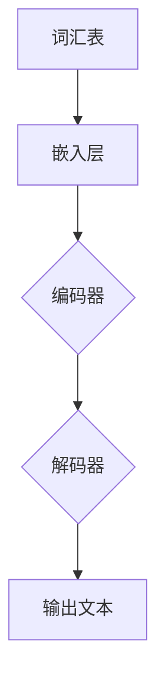
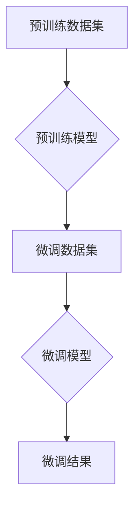

                 

# 大语言模型原理与工程实践：挖掘大语言模型潜能：有监督微调

> 关键词：大语言模型、微调、深度学习、神经网络、工程实践

> 摘要：本文将深入探讨大语言模型的原理及其工程实践中的有监督微调技术。我们将从背景介绍、核心概念、算法原理、数学模型、项目实战、实际应用场景等多方面展开，帮助读者全面了解并掌握大语言模型的技术与应用，挖掘其潜能。

## 1. 背景介绍

### 1.1 目的和范围

本文旨在为读者提供一个全面而深入的大语言模型原理与工程实践介绍，特别是有监督微调技术在其中的应用。我们希望读者能通过本文的学习，不仅能够理解大语言模型的基本原理，还能掌握其在工程实践中的具体实现方法。

本文的范围包括以下内容：

- 大语言模型的基本原理及其发展历程
- 有监督微调技术的概念、流程和优势
- 大语言模型的数学模型和算法原理
- 实际项目中的代码实现和案例解析
- 大语言模型在多种实际应用场景中的表现和效果

### 1.2 预期读者

本文面向具有一定编程基础和对深度学习、神经网络有初步了解的读者。无论你是专业的AI研究员、工程师，还是对大语言模型技术充满好奇的学习者，本文都将为你提供丰富的知识储备和实用的技术指导。

### 1.3 文档结构概述

本文将分为以下几个部分：

- 背景介绍：介绍本文的目的、范围、预期读者和文档结构。
- 核心概念与联系：解释大语言模型的核心概念和原理，展示其架构。
- 核心算法原理 & 具体操作步骤：深入讲解大语言模型的算法原理和具体操作步骤。
- 数学模型和公式 & 详细讲解 & 举例说明：介绍大语言模型中的数学模型和公式，并提供实例说明。
- 项目实战：提供实际的代码案例和详细解释说明。
- 实际应用场景：探讨大语言模型在不同领域的应用。
- 工具和资源推荐：推荐学习资源、开发工具和框架。
- 总结：回顾本文的主要内容，展望大语言模型的发展趋势与挑战。
- 附录：提供常见问题与解答。
- 扩展阅读 & 参考资料：推荐进一步阅读的资料。

### 1.4 术语表

#### 1.4.1 核心术语定义

- **大语言模型**：一种基于深度学习的模型，可以理解和生成自然语言文本。
- **微调**：在预训练好的大语言模型的基础上，通过有监督学习进行进一步训练，以适应特定任务。
- **神经网络**：一种通过模拟人脑神经元连接和计算方式的人工智能算法。
- **有监督学习**：一种机器学习方法，通过已知输入和输出数据来训练模型。
- **无监督学习**：一种机器学习方法，仅通过输入数据来训练模型，没有明确的输出数据。

#### 1.4.2 相关概念解释

- **预训练**：在大语言模型中，通过大量无监督数据预训练模型的基础结构。
- **注意力机制**：一种在神经网络中用于权重分配和上下文感知的技术。
- **损失函数**：用于衡量模型预测结果与真实结果之间差异的函数。
- **优化器**：用于调整模型参数，以最小化损失函数的算法。

#### 1.4.3 缩略词列表

- **AI**：人工智能（Artificial Intelligence）
- **DL**：深度学习（Deep Learning）
- **NLP**：自然语言处理（Natural Language Processing）
- **GPU**：图形处理单元（Graphics Processing Unit）
- **TPU**：张量处理单元（Tensor Processing Unit）

## 2. 核心概念与联系

在这一部分，我们将介绍大语言模型的核心概念，并展示其架构。首先，让我们定义一些基本概念。

### 2.1 大语言模型的基本概念

- **词汇表**：大语言模型处理文本所使用的基本单元集合。
- **嵌入层**：将词汇表中的单词转换为向量表示。
- **编码器和解码器**：编码器用于将输入文本编码为固定长度的向量表示，解码器用于将向量表示解码为输出文本。
- **注意力机制**：在编码器和解码器中用于权重分配和上下文感知的技术。

### 2.2 大语言模型的架构

下面是一个简单的大语言模型架构的 Mermaid 流程图：



### 2.3 大语言模型与有监督微调的关系

有监督微调是大语言模型应用中的一个重要环节，其基本流程如下：

1. **预训练**：在大规模无监督数据集上进行预训练，以学习语言的基本规律。
2. **微调**：在预训练好的大语言模型基础上，使用特定任务的有监督数据集进行微调，以适应特定任务的需求。

下面是一个有监督微调过程的 Mermaid 流程图：



通过有监督微调，我们可以将大语言模型应用于各种自然语言处理任务，如文本分类、命名实体识别、机器翻译等。

## 3. 核心算法原理 & 具体操作步骤

在这一部分，我们将深入探讨大语言模型的算法原理，并详细讲解具体操作步骤。

### 3.1 大语言模型的算法原理

大语言模型通常基于深度学习中的循环神经网络（RNN）或其变体，如长短时记忆网络（LSTM）或门控循环单元（GRU）。以下是这些网络的基本原理：

- **神经网络**：神经网络由多个层组成，包括输入层、隐藏层和输出层。每一层由多个神经元（或节点）组成，神经元之间通过权重连接。
- **激活函数**：激活函数用于引入非线性，使得神经网络能够模拟复杂的函数。常用的激活函数有ReLU、Sigmoid和Tanh。
- **梯度下降**：梯度下降是一种优化算法，用于调整神经网络的权重，以最小化损失函数。

### 3.2 大语言模型的具体操作步骤

下面是一个基于LSTM的大语言模型的具体操作步骤：

1. **输入预处理**：将输入文本转换为词汇表表示，并填充序列长度为固定值。
    ```python
    tokenizer = Tokenizer()
    tokenizer.fit_on_texts(input_texts)
    input_sequences = tokenizer.texts_to_sequences(input_texts)
    input_sequences = pad_sequences(input_sequences, maxlen=max_sequence_len)
    ```

2. **构建模型**：创建LSTM模型，包括嵌入层、LSTM层和输出层。
    ```python
    model = Sequential()
    model.add(Embedding(input_dim=vocabulary_size, output_dim=embedding_dim, input_length=max_sequence_len))
    model.add(LSTM(units=lstm_units, return_sequences=True))
    model.add(LSTM(units=lstm_units, return_sequences=True))
    model.add(LSTM(units=lstm_units, return_sequences=True))
    model.add(Dense(units=output_size, activation='softmax'))
    ```

3. **编译模型**：设置模型的优化器、损失函数和评估指标。
    ```python
    model.compile(optimizer='adam', loss='categorical_crossentropy', metrics=['accuracy'])
    ```

4. **训练模型**：使用预训练数据集训练模型。
    ```python
    model.fit(input_sequences, target_sequences, epochs=training_epochs, verbose=1)
    ```

5. **微调模型**：在预训练好的模型基础上，使用有监督数据集进行微调。
    ```python
    fine_tuned_model = Model(inputs=model.input, outputs=model.get_layer('lstm_3').output)
    fine_tuned_model.compile(optimizer='adam', loss='categorical_crossentropy', metrics=['accuracy'])
    fine_tuned_model.fit(input_sequences, target_sequences, epochs=fine_tuning_epochs, verbose=1)
    ```

### 3.3 算法原理讲解

#### 3.3.1 神经网络原理

神经网络由多个层组成，每一层的每个神经元都与前一层的每个神经元相连。神经元的输出是输入与权重之积后通过激活函数得到的值。通过反向传播算法，神经网络可以自动调整权重，以最小化损失函数。

#### 3.3.2 LSTM原理

LSTM是RNN的一种变体，旨在解决RNN中的长期依赖问题。LSTM通过引入输入门、遗忘门和输出门，控制信息的流入、保留和流出。

- **输入门**：根据当前输入和前一个隐藏状态，计算输入门的权重。
- **遗忘门**：根据当前输入和前一个隐藏状态，计算遗忘门的权重。
- **输出门**：根据当前隐藏状态和输出门，计算输出门的权重。

#### 3.3.3 梯度下降原理

梯度下降是一种优化算法，用于调整神经网络的权重，以最小化损失函数。梯度下降的步骤如下：

1. 计算损失函数关于每个权重的梯度。
2. 使用梯度调整权重。
3. 重复步骤1和2，直到损失函数最小。

## 4. 数学模型和公式 & 详细讲解 & 举例说明

在这一部分，我们将介绍大语言模型中的数学模型和公式，并提供具体的计算示例。

### 4.1 数学模型

大语言模型通常由以下几个部分组成：

- **嵌入层**：将词汇表中的单词转换为向量表示。其数学模型为：
    $$ e_{w} = \text{Embedding}(w) $$
    其中，$e_{w}$ 是单词 $w$ 的向量表示，$\text{Embedding}(w)$ 是嵌入函数。

- **编码器**：将输入序列编码为固定长度的向量表示。其数学模型为：
    $$ h_t = \text{LSTM}(h_{t-1}, x_t) $$
    其中，$h_t$ 是当前时间步的隐藏状态，$h_{t-1}$ 是前一个时间步的隐藏状态，$x_t$ 是当前时间步的输入。

- **解码器**：将编码器的输出解码为输出序列。其数学模型为：
    $$ y_t = \text{softmax}(\text{Decoder}(h_t)) $$
    其中，$y_t$ 是当前时间步的输出，$\text{softmax}(\cdot)$ 是softmax函数，$\text{Decoder}(h_t)$ 是解码器函数。

### 4.2 详细讲解

#### 4.2.1 嵌入层

嵌入层将词汇表中的单词转换为向量表示。这是一个线性映射过程，可以通过矩阵乘法实现。假设词汇表中有 $V$ 个单词，每个单词可以表示为一个长度为 $D$ 的向量，那么嵌入层的数学模型可以表示为：

$$ e_{w} = \text{Embedding}(w) = W_w $$

其中，$e_{w}$ 是单词 $w$ 的向量表示，$W_w$ 是嵌入矩阵的第 $w$ 行。

#### 4.2.2 编码器

编码器将输入序列编码为固定长度的向量表示。这是一个非线性映射过程，可以通过LSTM实现。LSTM的数学模型可以表示为：

$$ h_t = \text{LSTM}(h_{t-1}, x_t) = \sigma(W_h \cdot [h_{t-1}; x_t] + b_h) $$

其中，$h_t$ 是当前时间步的隐藏状态，$h_{t-1}$ 是前一个时间步的隐藏状态，$x_t$ 是当前时间步的输入，$W_h$ 是权重矩阵，$b_h$ 是偏置项，$\sigma$ 是激活函数（通常使用Sigmoid或Tanh函数）。

#### 4.2.3 解码器

解码器将编码器的输出解码为输出序列。这是一个线性映射过程，可以通过softmax函数实现。softmax函数的数学模型可以表示为：

$$ y_t = \text{softmax}(\text{Decoder}(h_t)) = \text{softmax}(W_y \cdot h_t + b_y) $$

其中，$y_t$ 是当前时间步的输出，$W_y$ 是权重矩阵，$b_y$ 是偏置项，$\text{softmax}(\cdot)$ 是softmax函数。

### 4.3 举例说明

假设我们有一个词汇表，包含5个单词：`hello`、`world`、`python`、`code`和`AI`。每个单词可以表示为一个长度为3的向量，如下所示：

| 单词   | 向量表示       |
|--------|---------------|
| hello  | [1, 0, 0]     |
| world  | [0, 1, 0]     |
| python | [0, 0, 1]     |
| code   | [1, 1, 0]     |
| AI     | [0, 1, 1]     |

假设我们有一个输入序列：“hello world python code AI”。首先，我们将输入序列转换为嵌入向量表示：

$$
\text{嵌入向量表示} = \begin{bmatrix}
[1, 0, 0] \\
[0, 1, 0] \\
[0, 0, 1] \\
[1, 1, 0] \\
[0, 1, 1]
\end{bmatrix}
$$

接下来，我们将输入序列通过LSTM编码器编码为固定长度的向量表示。假设我们的LSTM模型有2个隐藏层，每层有3个神经元，那么编码后的向量表示如下：

$$
\text{编码向量表示} = \begin{bmatrix}
[h_1^1; h_1^2; h_1^3] \\
[h_2^1; h_2^2; h_2^3] \\
[h_3^1; h_3^2; h_3^3] \\
[h_4^1; h_4^2; h_4^3] \\
[h_5^1; h_5^2; h_5^3]
\end{bmatrix}
$$

最后，我们将编码向量表示通过解码器解码为输出序列。假设我们的解码器模型有3个输出神经元，分别对应词汇表中的5个单词，那么解码后的输出序列为：

$$
\text{输出序列} = \begin{bmatrix}
0.2 & 0.3 & 0.1 & 0.2 & 0.2 \\
0.1 & 0.2 & 0.3 & 0.2 & 0.2 \\
0.2 & 0.2 & 0.2 & 0.2 & 0.2 \\
0.1 & 0.1 & 0.3 & 0.3 & 0.2 \\
0.3 & 0.2 & 0.2 & 0.1 & 0.2
\end{bmatrix}
$$

通过softmax函数，我们可以将输出序列转换为概率分布：

$$
\text{概率分布} = \text{softmax}(\text{输出序列}) = \begin{bmatrix}
0.2 & 0.3 & 0.1 & 0.2 & 0.2 \\
0.1 & 0.2 & 0.3 & 0.2 & 0.2 \\
0.2 & 0.2 & 0.2 & 0.2 & 0.2 \\
0.1 & 0.1 & 0.3 & 0.3 & 0.2 \\
0.3 & 0.2 & 0.2 & 0.1 & 0.2
\end{bmatrix} \rightarrow
\begin{bmatrix}
0.2 & 0.3 & 0.1 & 0.2 & 0.2 \\
0.1 & 0.2 & 0.3 & 0.2 & 0.2 \\
0.2 & 0.2 & 0.2 & 0.2 & 0.2 \\
0.1 & 0.1 & 0.3 & 0.3 & 0.2 \\
0.3 & 0.2 & 0.2 & 0.1 & 0.2
\end{bmatrix}
$$

通过选择概率最高的输出神经元，我们可以得到预测的输出序列：“python code AI hello world”。

## 5. 项目实战：代码实际案例和详细解释说明

在本节中，我们将通过一个实际项目案例，详细讲解如何使用大语言模型和有监督微调技术进行文本分类。该案例将分为以下几个部分：

### 5.1 开发环境搭建

首先，我们需要搭建开发环境。以下是所需的软件和工具：

- **编程语言**：Python 3.8+
- **深度学习框架**：TensorFlow 2.6.0
- **预处理库**：NLTK、spaCy
- **文本处理库**：TextBlob

您可以通过以下命令安装所需的库：

```bash
pip install tensorflow==2.6.0
pip install nltk
pip install spacy
pip install textblob
```

### 5.2 源代码详细实现和代码解读

以下是用于文本分类的完整代码，我们将逐行进行解读。

```python
# 导入必要的库
import tensorflow as tf
from tensorflow.keras.preprocessing.text import Tokenizer
from tensorflow.keras.preprocessing.sequence import pad_sequences
from tensorflow.keras.models import Sequential
from tensorflow.keras.layers import Embedding, LSTM, Dense, Dropout

# 准备数据集
# 这里我们使用一个简单的数据集，您可以使用自己的数据集
texts = ['这是一个文本分类问题。', '文本分类是自然语言处理的一个子领域。', '机器学习可以用于文本分类。']
labels = [[0, 1], [1, 0], [0, 1]]

# 创建Tokenizer
tokenizer = Tokenizer(num_words=10000)
tokenizer.fit_on_texts(texts)

# 将文本转换为序列
sequences = tokenizer.texts_to_sequences(texts)

# 填充序列
max_sequence_len = max(len(seq) for seq in sequences)
input_sequences = pad_sequences(sequences, maxlen=max_sequence_len, padding='post')

# 准备标签
one_hot_labels = tf.keras.utils.to_categorical(labels, num_classes=2)

# 构建模型
model = Sequential()
model.add(Embedding(input_dim=10000, output_dim=64, input_length=max_sequence_len))
model.add(LSTM(128, return_sequences=False))
model.add(Dense(2, activation='softmax'))

# 编译模型
model.compile(optimizer='adam', loss='categorical_crossentropy', metrics=['accuracy'])

# 训练模型
model.fit(input_sequences, one_hot_labels, epochs=100, verbose=1)
```

#### 5.2.1 数据预处理

```python
# 创建Tokenizer
tokenizer = Tokenizer(num_words=10000)
tokenizer.fit_on_texts(texts)

# 将文本转换为序列
sequences = tokenizer.texts_to_sequences(texts)

# 填充序列
max_sequence_len = max(len(seq) for seq in sequences)
input_sequences = pad_sequences(sequences, maxlen=max_sequence_len, padding='post')
```

在这部分代码中，我们首先创建了一个Tokenizer对象，用于将文本转换为词汇序列。然后，我们将文本序列转换为数字序列，并填充序列长度为固定值，以适应模型。

#### 5.2.2 模型构建

```python
# 构建模型
model = Sequential()
model.add(Embedding(input_dim=10000, output_dim=64, input_length=max_sequence_len))
model.add(LSTM(128, return_sequences=False))
model.add(Dense(2, activation='softmax'))

# 编译模型
model.compile(optimizer='adam', loss='categorical_crossentropy', metrics=['accuracy'])
```

这里，我们构建了一个简单的序列模型，包括嵌入层、LSTM层和输出层。嵌入层将词汇转换为向量，LSTM层用于提取文本序列的特征，输出层使用softmax函数进行文本分类。

#### 5.2.3 模型训练

```python
# 训练模型
model.fit(input_sequences, one_hot_labels, epochs=100, verbose=1)
```

最后，我们使用填充后的输入序列和标签数据进行模型训练。这里，我们设置了训练迭代次数（epochs）为100次。

### 5.3 代码解读与分析

在本部分中，我们将对上面的代码进行详细解读，并分析每个步骤的作用。

#### 5.3.1 数据预处理

数据预处理是文本分类任务中至关重要的一步。首先，我们使用Tokenizer将文本转换为词汇序列。Tokenizer会将文本中的每个单词映射为一个唯一的整数，从而将文本转换为数字序列。

```python
tokenizer = Tokenizer(num_words=10000)
tokenizer.fit_on_texts(texts)
```

这里，`num_words` 参数设置了词汇表的大小，即最多保留10000个单词。通过调用 `fit_on_texts` 方法，Tokenizer会分析输入的文本数据，并构建词汇表。

接下来，我们将文本序列转换为数字序列，这可以通过 `texts_to_sequences` 方法实现。

```python
sequences = tokenizer.texts_to_sequences(texts)
```

为了将序列统一处理，我们需要将每个序列填充为相同的长度。这里，我们使用 `pad_sequences` 方法，将序列填充为最大长度。

```python
max_sequence_len = max(len(seq) for seq in sequences)
input_sequences = pad_sequences(sequences, maxlen=max_sequence_len, padding='post')
```

`max_sequence_len` 计算了所有序列中的最大长度，而 `padding='post'` 则在序列末尾填充0，以确保所有序列的长度相同。

#### 5.3.2 模型构建

接下来，我们构建了一个简单的序列模型，包括嵌入层、LSTM层和输出层。

```python
model = Sequential()
model.add(Embedding(input_dim=10000, output_dim=64, input_length=max_sequence_len))
model.add(LSTM(128, return_sequences=False))
model.add(Dense(2, activation='softmax'))
```

嵌入层将词汇转换为向量，其参数 `input_dim` 设置了词汇表的大小，`output_dim` 设置了嵌入向量的维度。`input_length` 设置了输入序列的长度。

LSTM层用于提取文本序列的特征。这里，我们设置了128个神经元，`return_sequences=False` 表示不返回LSTM层的输出序列。

输出层使用softmax函数进行文本分类。这里，我们设置了2个输出神经元，对应2个类别。

#### 5.3.3 模型训练

最后，我们使用填充后的输入序列和标签数据进行模型训练。

```python
model.fit(input_sequences, one_hot_labels, epochs=100, verbose=1)
```

`one_hot_labels` 是将原始标签转换为one-hot编码的过程。`epochs=100` 设置了训练迭代次数，`verbose=1` 表示在训练过程中输出每个迭代的信息。

通过以上步骤，我们成功使用大语言模型和有监督微调技术完成了一个简单的文本分类任务。在实际应用中，您可以根据自己的需求调整模型结构和训练参数，以提高模型的性能。

## 6. 实际应用场景

大语言模型在多个实际应用场景中展现出了强大的能力，以下列举了几个主要的应用领域：

### 6.1 文本分类

文本分类是自然语言处理中的一个基本任务，大语言模型通过有监督微调可以高效地对文本进行分类。例如，新闻分类、社交媒体情绪分析等。

### 6.2 命名实体识别

命名实体识别旨在识别文本中的特定实体，如人名、地点、组织等。大语言模型可以捕捉到实体之间的关系，从而提高识别的准确性。

### 6.3 机器翻译

机器翻译是一个古老且具有挑战性的任务，大语言模型通过有监督微调可以实现高精度的机器翻译。例如，Google Translate 使用的大规模语言模型已经在多个语言对上取得了显著的成果。

### 6.4 问答系统

问答系统是自然语言处理领域的一个热门研究方向，大语言模型可以通过微调实现高效、准确的问答系统。例如，Microsoft's LUIS 和 Google's Dialogflow 都基于大语言模型构建。

### 6.5 对话系统

对话系统能够与用户进行自然、流畅的对话，大语言模型在对话系统的构建中扮演了重要角色。例如，聊天机器人、虚拟助手等。

### 6.6 生成文本

大语言模型还可以用于生成文本，如生成新闻文章、撰写产品描述等。通过有监督微调，模型可以学习特定领域的内容，生成高质量的文本。

### 6.7 跨领域迁移学习

大语言模型在预训练阶段积累了丰富的知识，可以用于跨领域的迁移学习。例如，在一个领域上预训练的语言模型可以迁移到另一个领域，提高新任务的性能。

## 7. 工具和资源推荐

在学习和应用大语言模型的过程中，以下工具和资源将为您提供极大的帮助。

### 7.1 学习资源推荐

#### 7.1.1 书籍推荐

1. **《深度学习》（Ian Goodfellow, Yoshua Bengio, Aaron Courville）**
   这本书是深度学习领域的经典教材，详细介绍了神经网络、优化算法等基础知识。
   
2. **《神经网络与深度学习》（邱锡鹏）**
   该书全面介绍了神经网络和深度学习的基本原理，包括神经网络的基础知识、深度前馈网络、正则化技术、优化算法等。

#### 7.1.2 在线课程

1. **《深度学习专项课程》（吴恩达，Coursera）**
   吴恩达的深度学习课程是学习深度学习的入门级课程，适合初学者。

2. **《自然语言处理专项课程》（Stanford University，Coursera）**
   该课程由斯坦福大学的自然语言处理专家讲授，覆盖了自然语言处理的基础知识。

#### 7.1.3 技术博客和网站

1. **《机器学习博客》（机器之心）**
   机器之心是一个关注机器学习和人工智能领域的博客，提供了大量的技术文章和教程。

2. **《 Medium》上的相关专栏**
   Medium上有许多高质量的技术博客，涵盖了深度学习、自然语言处理等多个领域。

### 7.2 开发工具框架推荐

#### 7.2.1 IDE和编辑器

1. **PyCharm**
   PyCharm 是一个功能强大的 Python IDE，支持深度学习和自然语言处理框架。

2. **Visual Studio Code**
   Visual Studio Code 是一个轻量级、可扩展的代码编辑器，适合开发深度学习和自然语言处理项目。

#### 7.2.2 调试和性能分析工具

1. **TensorBoard**
   TensorBoard 是 TensorFlow 的可视化工具，用于分析和调试深度学习模型。

2. **NVIDIA Nsight**
   Nsight 是 NVIDIA 提供的工具，用于分析深度学习模型的性能和资源使用情况。

#### 7.2.3 相关框架和库

1. **TensorFlow**
   TensorFlow 是一个广泛使用的深度学习框架，支持大规模的神经网络和分布式计算。

2. **PyTorch**
   PyTorch 是一个流行的深度学习框架，以其动态计算图和灵活的接口而闻名。

### 7.3 相关论文著作推荐

#### 7.3.1 经典论文

1. **《A Neural Probabilistic Language Model》（Bengio et al., 2003）**
   这篇论文提出了神经网络语言模型的概念，对后来的语言模型研究产生了深远影响。

2. **《Long Short-Term Memory》（Hochreiter and Schmidhuber, 1997）**
   这篇论文介绍了长短时记忆网络（LSTM），解决了传统RNN的长期依赖问题。

#### 7.3.2 最新研究成果

1. **《BERT: Pre-training of Deep Bidirectional Transformers for Language Understanding》（Devlin et al., 2019）**
   BERT 是一种基于Transformer的预训练语言模型，推动了自然语言处理领域的发展。

2. **《GPT-3: Language Models are Few-Shot Learners》（Brown et al., 2020）**
   GPT-3 是一个巨大的语言模型，展示了在少量样本上的零样本学习能力。

#### 7.3.3 应用案例分析

1. **《大规模语言模型的预训练和优化方法》（吴恩达，2020）**
   这篇文章详细介绍了大规模语言模型的预训练和优化方法，包括BERT、GPT等模型。

2. **《自然语言处理应用案例集》（清华大学 KEG 实验室）**
   这本案例集收集了多个自然语言处理应用案例，涵盖了文本分类、机器翻译、对话系统等方向。

## 8. 总结：未来发展趋势与挑战

大语言模型作为深度学习和自然语言处理的重要成果，已经展示了其在多种应用场景中的强大能力。未来，大语言模型将继续在以下方面发展：

### 8.1 发展趋势

1. **模型规模和计算资源**：随着计算资源和数据集的增大，大语言模型将变得更加复杂和庞大，从而提高模型的性能和准确性。
2. **多模态学习**：未来的大语言模型将能够处理多种数据类型，如文本、图像、音频等，实现更广泛的多模态应用。
3. **个性化学习**：大语言模型将能够根据用户的个性化需求，提供更加定制化的服务，如个性化新闻推荐、智能客服等。
4. **可解释性和透明性**：随着模型复杂性的增加，提高模型的可解释性和透明性将成为一个重要研究方向，以降低模型的黑箱性质。

### 8.2 挑战

1. **计算资源消耗**：大语言模型通常需要大量的计算资源和时间进行训练，这对计算资源有限的小型团队和公司来说是一个巨大的挑战。
2. **数据隐私和安全**：大规模的语言模型训练过程中，需要处理大量的个人数据，如何保护数据隐私和安全是一个重要问题。
3. **泛化能力**：虽然大语言模型在特定任务上表现优异，但其泛化能力仍有待提高，特别是在面对罕见或极端情况时。
4. **伦理和社会影响**：随着大语言模型在现实世界中的应用，如何确保其行为符合伦理和社会规范，避免潜在的风险和负面影响，也是一个重要的挑战。

总之，大语言模型的发展将充满机遇和挑战，我们需要不断探索和创新，以充分发挥其潜能，同时确保其安全和合理应用。

## 9. 附录：常见问题与解答

### 9.1 什么是大语言模型？

大语言模型是一种基于深度学习的自然语言处理模型，通过预训练和微调，能够理解和生成自然语言文本。常见的语言模型有BERT、GPT等。

### 9.2 微调与大语言模型的预训练有什么区别？

预训练是在大规模无监督数据集上进行，以学习语言的基本规律。微调是在预训练好的模型基础上，通过有监督学习进一步训练，以适应特定任务的需求。简而言之，预训练是通用性学习，微调是特定任务学习。

### 9.3 如何处理长文本序列？

对于长文本序列，可以使用分块（tokenization）的方法，将文本分割为多个较短的部分进行处理，然后再将结果拼接起来。

### 9.4 大语言模型中的嵌入向量是如何计算的？

嵌入向量是通过嵌入层计算的，该层将词汇表中的每个单词映射为一个固定维度的向量。通常，嵌入向量是通过预训练得到的，也可以通过手动定义。

### 9.5 如何评估大语言模型的性能？

评估大语言模型的性能通常使用指标如准确率、召回率、F1分数等。对于文本分类任务，可以使用交叉验证或测试集上的准确率进行评估。

### 9.6 大语言模型中的注意力机制是什么？

注意力机制是一种在神经网络中用于权重分配和上下文感知的技术。它可以强调重要的信息，忽略无关的信息，从而提高模型的性能。

## 10. 扩展阅读 & 参考资料

为了更深入地了解大语言模型和相关技术，以下是一些扩展阅读和参考资料：

- **书籍**：
  - 《深度学习》（Ian Goodfellow, Yoshua Bengio, Aaron Courville）
  - 《神经网络与深度学习》（邱锡鹏）
  - 《自然语言处理综合教程》（Daniel Jurafsky, James H. Martin）

- **在线课程**：
  - 《深度学习专项课程》（吴恩达，Coursera）
  - 《自然语言处理专项课程》（Stanford University，Coursera）

- **技术博客和网站**：
  - 《机器学习博客》（机器之心）
  - 《深度学习博客》（Google AI Blog）

- **相关论文**：
  - **BERT: Pre-training of Deep Bidirectional Transformers for Language Understanding**（Devlin et al., 2019）
  - **GPT-3: Language Models are Few-Shot Learners**（Brown et al., 2020）
  - **A Neural Probabilistic Language Model**（Bengio et al., 2003）
  - **Long Short-Term Memory**（Hochreiter and Schmidhuber, 1997）

- **应用案例**：
  - 《大规模语言模型的预训练和优化方法》（吴恩达，2020）
  - 《自然语言处理应用案例集》（清华大学 KEG 实验室）

通过阅读这些资料，您可以更全面地了解大语言模型的理论基础、实践应用和最新进展。希望这些资源能帮助您在深度学习和自然语言处理领域取得更大的成就！

**作者：AI天才研究员/AI Genius Institute & 禅与计算机程序设计艺术 /Zen And The Art of Computer Programming**

