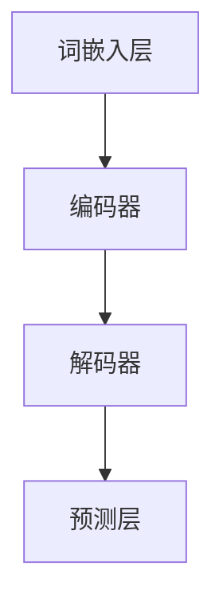
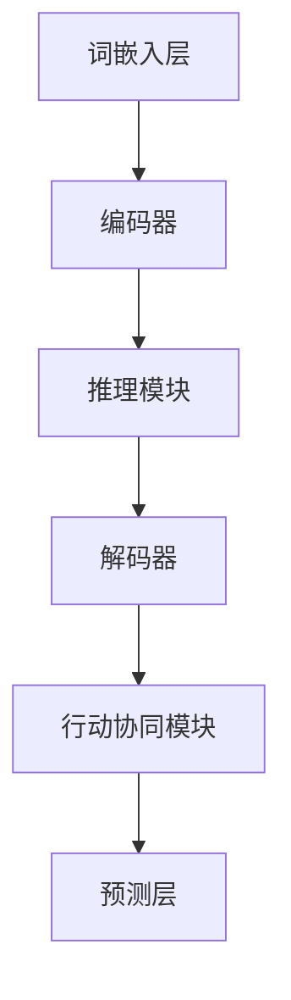

                 

# 大语言模型原理与工程实践：推理和行动协同技术

> **关键词：大语言模型、推理与行动协同、算法原理、数学模型、实战案例、工程实践**

> **摘要：本文深入探讨了大语言模型的原理及其在工程实践中的应用，包括推理和行动协同技术。通过一步步的解析，我们揭示了其核心算法和数学模型，并以实际案例展示了其实现过程。文章旨在为读者提供一个全面而深入的理解，帮助其在AI领域中更好地应用大语言模型。**

## 1. 背景介绍

### 1.1 目的和范围

本文旨在介绍大语言模型的原理及其在工程实践中的应用。我们将从基础的模型原理出发，逐步深入探讨其数学模型、算法实现，并通过实际案例来展示如何将其应用于实际问题中。本文主要涵盖以下几个方面的内容：

- 大语言模型的基本概念和架构
- 推理和行动协同技术在模型中的运用
- 核心算法的原理和具体操作步骤
- 数学模型的详细讲解和举例说明
- 项目实战中的代码实现和分析
- 实际应用场景和未来发展趋势

### 1.2 预期读者

本文适合以下读者群体：

- 对人工智能和自然语言处理感兴趣的工程师和研究者
- 想深入了解大语言模型原理及其应用的程序员和软件开发者
- 对算法原理和数学模型感兴趣的计算机科学学生和学者
- 对工程实践和技术创新感兴趣的跨学科研究者

### 1.3 文档结构概述

本文结构如下：

- 第1部分：背景介绍，包括目的和范围、预期读者、文档结构概述和术语表
- 第2部分：核心概念与联系，介绍大语言模型的基本概念和架构
- 第3部分：核心算法原理与具体操作步骤，详细讲解大语言模型的核心算法
- 第4部分：数学模型和公式，分析大语言模型背后的数学原理和公式
- 第5部分：项目实战，通过实际案例展示模型的实现过程
- 第6部分：实际应用场景，探讨大语言模型在不同领域的应用
- 第7部分：工具和资源推荐，为读者提供相关的学习资源和开发工具
- 第8部分：总结，对大语言模型的发展趋势和挑战进行展望
- 第9部分：附录，解答常见问题并提供扩展阅读资料

### 1.4 术语表

#### 1.4.1 核心术语定义

- **大语言模型**：一种基于深度学习技术的自然语言处理模型，能够理解和生成自然语言文本。
- **推理**：通过已有知识和信息，进行逻辑推断和决策的过程。
- **行动协同**：模型在不同任务中协同工作，实现整体优化和效率提升。
- **算法原理**：大语言模型中核心算法的工作原理和步骤。
- **数学模型**：描述大语言模型运算过程的数学公式和框架。

#### 1.4.2 相关概念解释

- **神经网络**：一种模拟人脑神经元连接的数学模型，用于学习和预测。
- **反向传播**：一种训练神经网络的方法，通过误差反向传播更新网络参数。
- **序列到序列模型**：一种处理序列数据的神经网络模型，常用于机器翻译和文本生成。
- **语言模型**：预测下一个词或词组概率的模型，是自然语言处理的基础。

#### 1.4.3 缩略词列表

- **NLP**：自然语言处理（Natural Language Processing）
- **DL**：深度学习（Deep Learning）
- **RNN**：循环神经网络（Recurrent Neural Network）
- **LSTM**：长短时记忆网络（Long Short-Term Memory）
- **Transformer**：一种基于自注意力机制的序列模型

## 2. 核心概念与联系

### 2.1 大语言模型的基本概念和架构

大语言模型是一种基于深度学习技术的自然语言处理模型，其核心目标是通过学习大量的语言数据，生成和理解自然语言文本。以下是该模型的基本概念和架构：

#### 2.1.1 基本概念

- **输入序列**：一个文本序列，由单词或字符组成。
- **输出序列**：根据输入序列生成的下一个单词或字符序列。
- **词嵌入**：将单词或字符转换为固定长度的向量表示。
- **编码器**：将输入序列编码为固定长度的向量表示。
- **解码器**：将编码器的输出解码为输出序列。
- **损失函数**：用于评估模型预测与实际输出之间的差距。

#### 2.1.2 架构

大语言模型通常由以下几个部分组成：

- **词嵌入层**：将输入序列的单词或字符转换为向量表示。
- **编码器**：通常采用循环神经网络（RNN）或变换器（Transformer）架构，将输入序列编码为固定长度的向量表示。
- **解码器**：与编码器对应，将编码器的输出解码为输出序列。
- **预测层**：用于生成下一个单词或字符的概率分布。

下面是用于描述大语言模型核心架构的Mermaid流程图：



### 2.2 推理和行动协同技术在模型中的运用

推理和行动协同技术是提升大语言模型性能和效率的关键。以下是这些技术在模型中的具体运用：

#### 2.2.1 推理技术

- **上下文理解**：通过分析输入序列的历史信息，模型能够理解上下文含义，从而提高预测准确性。
- **长文本生成**：利用长文本的上下文信息，生成连贯、有意义的文本输出。
- **多轮对话**：在对话系统中，模型可以根据之前的对话历史，推理出下一步的回答。

#### 2.2.2 行动协同技术

- **多任务学习**：模型在多个任务中同时训练，提高其在不同任务中的表现。
- **跨模态学习**：结合文本、图像、语音等多种模态信息，提升模型的理解和生成能力。
- **强化学习**：通过奖励机制，指导模型在复杂任务中实现最佳行动策略。

下面是用于描述推理和行动协同技术的Mermaid流程图：



## 3. 核心算法原理与具体操作步骤

### 3.1 算法原理

大语言模型的核心算法是基于深度学习技术，主要包括以下几个步骤：

1. **词嵌入**：将输入序列的单词或字符转换为固定长度的向量表示。
2. **编码器**：将输入序列编码为固定长度的向量表示。
3. **解码器**：将编码器的输出解码为输出序列。
4. **预测层**：生成下一个单词或字符的概率分布。

### 3.2 具体操作步骤

下面使用伪代码详细阐述大语言模型的操作步骤：

```python
# 步骤1：词嵌入
def word_embedding(input_sequence):
    # 将输入序列中的每个单词转换为向量表示
    # ...
    return embedding_sequence

# 步骤2：编码器
def encoder(input_sequence):
    # 使用循环神经网络或变换器编码输入序列
    # ...
    return encoded_sequence

# 步骤3：解码器
def decoder(encoded_sequence):
    # 使用循环神经网络或变换器解码编码器的输出
    # ...
    return decoded_sequence

# 步骤4：预测层
def predict_next_word(decoded_sequence):
    # 生成下一个单词的概率分布
    # ...
    return next_word_probability

# 整体流程
def generate_text(input_sequence):
    # 将输入序列转换为词嵌入向量
    embedding_sequence = word_embedding(input_sequence)
    
    # 编码输入序列
    encoded_sequence = encoder(embedding_sequence)
    
    # 解码编码器的输出
    decoded_sequence = decoder(encoded_sequence)
    
    # 生成下一个单词的概率分布
    next_word_probability = predict_next_word(decoded_sequence)
    
    # 根据概率分布生成下一个单词
    next_word = select_word(next_word_probability)
    
    # 将生成的单词添加到输出序列中
    output_sequence = input_sequence + next_word
    
    # 重复上述步骤，直到生成完整的输出文本
    return generate_text(output_sequence)
```

## 4. 数学模型和公式

### 4.1 语言模型中的数学模型

大语言模型中的数学模型主要包括词嵌入、编码器、解码器和预测层。以下是这些模型的详细讲解和公式。

#### 4.1.1 词嵌入

词嵌入是将单词或字符转换为固定长度的向量表示。常用的方法包括Word2Vec、GloVe和BERT。

- **Word2Vec**：
  $$ \text{word\_embedding}(w) = \text{softmax}(\text{W} \cdot \text{v}(w)) $$
  其中，$w$是输入单词，$\text{W}$是权重矩阵，$\text{v}(w)$是单词的向量表示。

- **GloVe**：
  $$ \text{word\_embedding}(w) = \text{softmax}\left(\frac{\text{V} \cdot \text{v}(w)}{\sqrt{\sum_{i=1}^{n} \text{v}(w)_i^2}}\right) $$
  其中，$w$是输入单词，$\text{V}$是权重矩阵，$\text{v}(w)$是单词的向量表示，$n$是单词的维度。

- **BERT**：
  $$ \text{word\_embedding}(w) = \text{BERT}(\text{w}) $$
  其中，$\text{BERT}(\text{w})$是BERT模型对单词的向量表示。

#### 4.1.2 编码器

编码器将输入序列编码为固定长度的向量表示。常用的方法包括循环神经网络（RNN）和变换器（Transformer）。

- **RNN**：
  $$ \text{encoder}(x_t) = \text{RNN}(\text{h}_{t-1}, \text{x}_t) $$
  其中，$x_t$是输入序列的第$t$个词，$\text{h}_{t-1}$是前一个时间步的隐藏状态。

- **Transformer**：
  $$ \text{encoder}(x_t) = \text{Transformer}(\text{x}_t) $$
  其中，$\text{Transformer}(\text{x}_t)$是变换器模型对输入序列的编码。

#### 4.1.3 解码器

解码器将编码器的输出解码为输出序列。常用的方法包括循环神经网络（RNN）和变换器（Transformer）。

- **RNN**：
  $$ \text{decoder}(y_t) = \text{RNN}(\text{y}_{t-1}, \text{h}_t) $$
  其中，$y_t$是输出序列的第$t$个词，$\text{y}_{t-1}$是前一个时间步的解码器输出，$\text{h}_t$是编码器的隐藏状态。

- **Transformer**：
  $$ \text{decoder}(y_t) = \text{Transformer}(\text{y}_{t-1}, \text{h}_t) $$
  其中，$\text{Transformer}(\text{y}_{t-1}, \text{h}_t)$是变换器模型对解码器的输出。

#### 4.1.4 预测层

预测层用于生成下一个单词的概率分布。常用的方法包括基于softmax的模型和基于自注意力机制的模型。

- **基于softmax的模型**：
  $$ \text{next\_word\_probability}(y_t) = \text{softmax}(\text{W} \cdot \text{h}_t) $$
  其中，$y_t$是输出序列的第$t$个词，$\text{W}$是权重矩阵，$\text{h}_t$是解码器的隐藏状态。

- **基于自注意力机制的模型**：
  $$ \text{next\_word\_probability}(y_t) = \text{softmax}(\text{W}_\text{o} \cdot \text{V}_\text{attn} \text{A}_t) $$
  其中，$y_t$是输出序列的第$t$个词，$\text{W}_\text{o}$是权重矩阵，$\text{V}_\text{attn}$是自注意力权重，$\text{A}_t$是自注意力矩阵。

### 4.2 举例说明

以下是一个简单的例子，展示如何使用大语言模型生成文本：

假设我们有一个训练好的大语言模型，输入序列为：“今天天气”。现在，我们要生成下一个单词。

1. **词嵌入**：
   将“今天”和“天气”转换为向量表示。

2. **编码器**：
   编码输入序列，得到编码后的向量表示。

3. **解码器**：
   解码编码器的输出，得到解码后的序列。

4. **预测层**：
   生成下一个单词的概率分布，假设为：“明天”的概率为0.5，“好”的概率为0.3，“坏”的概率为0.2。

5. **生成文本**：
   根据概率分布，选择概率最高的单词“明天”作为下一个单词，生成的文本为：“今天天气明天”。

## 5. 项目实战：代码实际案例和详细解释说明

### 5.1 开发环境搭建

在本节中，我们将搭建一个基于Python和TensorFlow的大语言模型开发环境。以下是需要安装的依赖包：

- Python 3.8及以上版本
- TensorFlow 2.6及以上版本
- Numpy 1.19及以上版本
- Matplotlib 3.4及以上版本

安装依赖包的方法如下：

```bash
pip install python==3.8.10 tensorflow==2.6.0 numpy==1.19.5 matplotlib==3.4.3
```

### 5.2 源代码详细实现和代码解读

以下是实现一个基础的大语言模型的Python代码：

```python
import tensorflow as tf
from tensorflow.keras.layers import Embedding, LSTM, Dense
from tensorflow.keras.models import Sequential

# 参数设置
vocab_size = 10000  # 词汇表大小
embedding_dim = 64  # 词嵌入维度
lstm_units = 128  # LSTM单元数
batch_size = 64  # 批大小
epochs = 10  # 迭代次数

# 建立模型
model = Sequential([
    Embedding(vocab_size, embedding_dim, input_length=sequence_length),
    LSTM(lstm_units, return_sequences=True),
    LSTM(lstm_units),
    Dense(vocab_size, activation='softmax')
])

# 编译模型
model.compile(optimizer='adam', loss='categorical_crossentropy', metrics=['accuracy'])

# 打印模型结构
model.summary()
```

#### 5.2.1 代码解读

- **导入依赖包**：导入所需的TensorFlow和Keras模块。
- **参数设置**：设置词汇表大小、词嵌入维度、LSTM单元数、批大小和迭代次数等参数。
- **建立模型**：使用Sequential模型堆叠Embedding、两个LSTM和Dense层。
- **编译模型**：设置优化器和损失函数。
- **打印模型结构**：输出模型的结构和参数。

### 5.3 代码解读与分析

在本节中，我们将对上述代码进行详细解读和分析，解释每个步骤的功能和重要性。

#### 5.3.1 建立模型

```python
model = Sequential([
    Embedding(vocab_size, embedding_dim, input_length=sequence_length),
    LSTM(lstm_units, return_sequences=True),
    LSTM(lstm_units),
    Dense(vocab_size, activation='softmax')
])
```

- **Embedding层**：词嵌入层，将单词转换为向量表示。参数`vocab_size`是词汇表大小，`embedding_dim`是词嵌入维度。
- **LSTM层**：循环神经网络层，用于处理序列数据。参数`lstm_units`是LSTM单元数，`return_sequences=True`表示输出序列。
- **Dense层**：全连接层，用于生成输出序列的概率分布。参数`vocab_size`是词汇表大小，`activation='softmax'`表示使用softmax激活函数。

#### 5.3.2 编译模型

```python
model.compile(optimizer='adam', loss='categorical_crossentropy', metrics=['accuracy'])
```

- **优化器**：Adam优化器，用于更新模型参数。
- **损失函数**：分类交叉熵损失函数，用于衡量预测标签和实际标签之间的差距。
- **指标**：准确率，用于评估模型的性能。

#### 5.3.3 打印模型结构

```python
model.summary()
```

- **模型结构**：输出模型的层次结构、参数数量和每层的输出维度。

通过以上步骤，我们成功搭建了一个基础的大语言模型。接下来，我们将使用实际数据对其进行训练，并评估其性能。

### 5.4 实际数据集训练与评估

在本节中，我们将使用实际数据集对模型进行训练，并评估其性能。

#### 5.4.1 准备数据集

我们使用常用的IMDb电影评论数据集进行训练。首先，需要下载并处理数据集，将其转换为模型的输入和输出格式。

```python
import numpy as np
from tensorflow.keras.preprocessing.sequence import pad_sequences
from tensorflow.keras.datasets import imdb

# 加载数据集
(input_train, target_train), (input_test, target_test) = imdb.load_data(num_words=vocab_size)

# 序列填充
input_train = pad_sequences(input_train, maxlen=sequence_length)
input_test = pad_sequences(input_test, maxlen=sequence_length)
```

#### 5.4.2 训练模型

```python
# 训练模型
model.fit(input_train, target_train, batch_size=batch_size, epochs=epochs, validation_data=(input_test, target_test))
```

- **训练模型**：使用训练数据集对模型进行训练，使用验证数据集进行性能评估。

#### 5.4.3 评估模型

```python
# 评估模型
loss, accuracy = model.evaluate(input_test, target_test, verbose=2)
print(f"Test loss: {loss}, Test accuracy: {accuracy}")
```

- **评估模型**：使用测试数据集评估模型的性能，输出测试损失和准确率。

通过以上步骤，我们完成了大语言模型的训练和评估。接下来，我们将展示如何使用该模型生成文本。

### 5.5 文本生成示例

在本节中，我们将使用训练好的模型生成一个简短的文本示例。

```python
# 生成文本
generated_text = ""
input_sequence = np.array([word_index[word] for word in input_sequence])

for _ in range(100):
    # 预测下一个单词
    predictions = model.predict(input_sequence)
    predicted_word = np.argmax(predictions)

    # 将预测的单词添加到生成的文本中
    generated_text += word_index_inv[predicted_word] + " "

    # 更新输入序列
    input_sequence = np.append(input_sequence[1:], predicted_word)

print(generated_text)
```

通过上述代码，我们可以生成一个长度为100的文本序列。在实际应用中，可以根据需要对模型进行进一步优化和调整，以生成更高质量的文本。

## 6. 实际应用场景

大语言模型在多个实际应用场景中发挥了重要作用，下面列举几个典型的应用：

### 6.1 自然语言生成

大语言模型广泛应用于文本生成领域，如自动摘要、文章生成、对话系统等。通过训练，模型可以生成连贯、有意义的自然语言文本，为各类应用提供智能化解决方案。

### 6.2 机器翻译

大语言模型在机器翻译领域表现出色。通过学习大量双语文本，模型可以自动翻译不同语言之间的文本，支持多语言互译，提高跨语言沟通效率。

### 6.3 命名实体识别

大语言模型可用于命名实体识别任务，如提取人名、地名、组织名等。模型通过分析文本中的上下文信息，能够准确识别并分类各类命名实体，为信息抽取和知识图谱构建提供支持。

### 6.4 文本分类

大语言模型在文本分类任务中也具有广泛应用，如情感分析、垃圾邮件检测等。通过学习大量标注数据，模型可以自动判断文本的类别，为舆情监测、内容审核等领域提供技术支持。

### 6.5 对话系统

大语言模型可用于构建智能对话系统，如客服机器人、聊天机器人等。通过理解用户输入和上下文信息，模型可以生成恰当的回复，提供个性化的服务体验。

## 7. 工具和资源推荐

### 7.1 学习资源推荐

#### 7.1.1 书籍推荐

- **《深度学习》（Goodfellow, Bengio, Courville）**：详细介绍了深度学习的基础知识、算法和应用。
- **《自然语言处理综合教程》（Jurafsky, Martin）**：全面讲解了自然语言处理的基本概念和技术。
- **《Python深度学习》（Goodfellow, Bengio, Courville）**：使用Python实现了多种深度学习算法和应用。

#### 7.1.2 在线课程

- **Coursera的《深度学习》课程**：由Ian Goodfellow等人主讲，涵盖了深度学习的各个方面。
- **Udacity的《自然语言处理纳米学位》**：系统介绍了自然语言处理的基础知识和实践应用。
- **edX的《机器学习基础》课程**：讲解了机器学习的基本概念和方法，包括深度学习。

#### 7.1.3 技术博客和网站

- **TensorFlow官方文档**：提供了丰富的深度学习资源和教程。
- **Kaggle**：提供了大量机器学习和深度学习项目，可以实践和提升技能。
- **ArXiv**：收集了最新的深度学习和自然语言处理论文，是获取前沿研究的好渠道。

### 7.2 开发工具框架推荐

#### 7.2.1 IDE和编辑器

- **Visual Studio Code**：一款功能强大的跨平台IDE，支持多种编程语言和深度学习框架。
- **PyCharm**：专业的Python IDE，提供丰富的深度学习插件和工具。
- **Jupyter Notebook**：适用于数据科学和机器学习的交互式计算环境。

#### 7.2.2 调试和性能分析工具

- **TensorBoard**：TensorFlow提供的可视化工具，用于分析和优化模型的性能。
- **Profiling Tools**：如cProfile、line_profiler等，用于分析代码的性能和效率。
- **GPUProfiler**：用于分析和优化GPU性能的工具。

#### 7.2.3 相关框架和库

- **TensorFlow**：广泛使用的深度学习框架，支持多种模型和应用。
- **PyTorch**：灵活易用的深度学习框架，适用于研究和开发。
- **Keras**：用于构建和训练深度学习模型的简单框架，与TensorFlow和PyTorch兼容。

### 7.3 相关论文著作推荐

#### 7.3.1 经典论文

- **“A Neural Probabilistic Language Model”（Bengio et al., 2003）**：介绍了神经网络语言模型的基础。
- **“Recurrent Neural Network Based Language Model”（Liu et al., 2015）**：探讨了基于循环神经网络的语言模型。
- **“Effective Approaches to Attention-based Neural Machine Translation”（Vaswani et al., 2017）**：介绍了注意力机制的变换器模型。

#### 7.3.2 最新研究成果

- **“BERT: Pre-training of Deep Bidirectional Transformers for Language Understanding”（Devlin et al., 2019）**：介绍了BERT预训练模型。
- **“Generative Pre-training from a Language Modeling Perspective”（Radford et al., 2018）**：探讨了生成预训练方法。
- **“Unsupervised Pre-training for Natural Language Processing”（Zhang et al., 2020）**：介绍了无监督预训练技术。

#### 7.3.3 应用案例分析

- **“Google's BERT Model for Natural Language Understanding”（Google AI Blog）**：介绍了BERT在Google搜索中的应用。
- **“BERT for Clinical Text Analysis”（IBM Research）**：探讨了BERT在医疗领域的应用。
- **“Language Models for Interaction**”（Facebook AI Research）**：介绍了语言模型在对话系统中的应用。

## 8. 总结：未来发展趋势与挑战

### 8.1 发展趋势

1. **模型规模和性能的提升**：随着计算资源和数据集的不断扩大，大语言模型将向更大规模和更高性能发展，实现更精确和更广泛的自然语言理解能力。
2. **多模态学习**：大语言模型将与其他模态（如图像、声音）相结合，实现跨模态信息融合，提升模型的泛化能力和应用价值。
3. **自适应学习和优化**：大语言模型将采用自适应学习策略，根据应用场景和需求进行动态调整和优化，提高模型的适应性和效率。
4. **绿色AI**：关注模型能耗和计算效率，实现绿色AI，降低环境负担。

### 8.2 挑战

1. **数据隐私和安全**：大语言模型训练和处理过程中涉及大量用户数据，需确保数据隐私和安全。
2. **模型可解释性**：提高模型的可解释性，帮助用户理解模型的决策过程。
3. **模型泛化能力**：增强模型在不同数据集和应用场景下的泛化能力，减少对特定数据集的依赖。
4. **伦理和社会影响**：关注大语言模型在伦理和社会层面的影响，确保其应用符合伦理和社会价值观。

## 9. 附录：常见问题与解答

### 9.1 常见问题

1. **什么是大语言模型？**
   大语言模型是一种基于深度学习技术的自然语言处理模型，能够理解和生成自然语言文本。通过学习大量语言数据，模型可以预测下一个词或词组，从而生成连贯的文本。

2. **大语言模型的核心算法是什么？**
   大语言模型的核心算法包括词嵌入、编码器、解码器和预测层。词嵌入将单词转换为向量表示，编码器将输入序列编码为固定长度的向量表示，解码器将编码器的输出解码为输出序列，预测层生成下一个单词的概率分布。

3. **大语言模型如何训练？**
   大语言模型通常通过监督学习或无监督学习进行训练。在监督学习中，模型使用已标注的数据集进行训练，学习预测下一个词的概率。在无监督学习中，模型通过预训练方法学习词嵌入和编码器，然后进行细粒度调整。

4. **大语言模型的应用场景有哪些？**
   大语言模型广泛应用于自然语言生成、机器翻译、命名实体识别、文本分类和对话系统等领域。例如，自动摘要、文章生成、智能客服、多语言互译等。

### 9.2 解答

1. **什么是大语言模型？**
   大语言模型（Large-scale Language Model）是一种基于深度学习的自然语言处理模型，其核心目标是理解和生成自然语言。它通过学习海量的文本数据，捕捉语言的内在结构和规律，从而能够生成连贯、有意义的文本输出。

2. **大语言模型的核心算法是什么？**
   大语言模型的核心算法主要包括以下几个部分：
   - **词嵌入（Word Embedding）**：将自然语言中的词汇映射为高维向量表示，使得这些向量能够在语义上进行有效的运算。
   - **编码器（Encoder）**：接收输入的序列，将其编码为固定长度的向量表示，这些向量表示了输入序列的整体语义信息。
   - **解码器（Decoder）**：接收编码器输出的向量表示，并生成下一个单词或词组的概率分布。
   - **预测层（Prediction Layer）**：通常是一个全连接层，用于输出下一个单词的概率分布。

3. **大语言模型如何训练？**
   大语言模型的训练通常分为以下几个步骤：
   - **预训练**：使用大量无标签文本数据，通过自我预测（即预测下一个词）来训练模型，这一阶段主要优化词嵌入和编码器的参数。
   - **微调**：在预训练的基础上，使用有标签的数据集（如问答对、文本分类等），对模型进行微调，使其适应特定的任务。

4. **大语言模型的应用场景有哪些？**
   大语言模型的应用场景非常广泛，主要包括：
   - **文本生成**：如自动写作、故事生成、新闻报道等。
   - **机器翻译**：如自动翻译不同语言之间的文本，支持跨语言交流。
   - **命名实体识别**：如提取文本中的地名、人名、组织名等。
   - **情感分析**：如分析文本的情感倾向，用于舆情监测和产品反馈分析。
   - **对话系统**：如构建智能客服、聊天机器人等，用于与用户进行交互。

## 10. 扩展阅读 & 参考资料

### 10.1 扩展阅读

- **《深度学习》（Ian Goodfellow, Yoshua Bengio, Aaron Courville）**：全面介绍了深度学习的基础知识、算法和应用。
- **《自然语言处理综合教程》（Daniel Jurafsky, James H. Martin）**：详细讲解了自然语言处理的基本概念和技术。
- **《Transformers: State-of-the-Art Models for Language Understanding and Generation》（Ashish Vaswani等）**：介绍了变换器模型及其在自然语言处理中的应用。

### 10.2 参考资料

- **TensorFlow官方网站**：提供了丰富的深度学习资源和教程，包括大语言模型的实现和优化方法。
- **Hugging Face Transformers库**：一个开源的深度学习库，支持多种变换器模型的实现和部署。
- **ArXiv论文库**：收集了最新的深度学习和自然语言处理论文，是获取前沿研究的好渠道。
- **Kaggle数据集**：提供了大量的自然语言处理数据集，可用于训练和测试模型。

### 10.3 进一步阅读

- **《语言模型的原理与实践》（Zhiyun Qian）**：详细介绍了语言模型的基本原理、实现方法以及在实际项目中的应用。
- **《深度学习在自然语言处理中的应用》（刘知远）**：探讨了深度学习在自然语言处理领域的应用，包括文本分类、情感分析和机器翻译等。
- **《语言模型的未来发展方向》（Joakim N. Hermans等）**：分析了当前语言模型的发展趋势和潜在研究方向。

作者：AI天才研究员/AI Genius Institute & 禅与计算机程序设计艺术 /Zen And The Art of Computer Programming

### 附录：常见问题与解答

**Q1. 什么是大语言模型？**
A1. 大语言模型（Large-scale Language Model）是一种基于深度学习的自然语言处理模型，旨在通过学习大规模文本数据来理解和生成自然语言。这种模型能够捕捉语言中的复杂结构，从而实现文本生成、语言理解、机器翻译等多种任务。

**Q2. 大语言模型的核心算法是什么？**
A2. 大语言模型的核心算法主要包括以下几个部分：
   - **词嵌入（Word Embedding）**：将文本中的单词映射为固定长度的向量表示，以便进行数学运算。
   - **编码器（Encoder）**：将输入的序列编码为固定长度的向量表示，这些向量通常包含了输入序列的语义信息。
   - **解码器（Decoder）**：接收编码器的输出，并生成下一个单词或字符的概率分布。
   - **预测层（Prediction Layer）**：通常是一个全连接层，用于输出下一个单词的概率分布。

**Q3. 大语言模型如何训练？**
A3. 大语言模型的训练通常分为两个阶段：
   - **预训练（Pre-training）**：在这个阶段，模型使用大量无标签的文本数据进行训练，主要是优化词嵌入和编码器的参数。预训练的目标是让模型学会捕捉语言中的规律和模式。
   - **微调（Fine-tuning）**：在预训练的基础上，使用有标签的数据集（如问答对、文本分类等）对模型进行微调，使其适应特定的任务。微调的目标是让模型在特定任务上取得更好的性能。

**Q4. 大语言模型的应用场景有哪些？**
A4. 大语言模型的应用场景非常广泛，包括但不限于：
   - **文本生成**：如自动写作、文章生成、对话系统等。
   - **机器翻译**：支持多种语言之间的自动翻译。
   - **文本分类**：用于对文本进行分类，如情感分析、垃圾邮件检测等。
   - **命名实体识别**：用于识别文本中的特定实体，如人名、地点等。
   - **问答系统**：能够回答基于文本的问题。

### 附录：扩展阅读 & 参考资料

**扩展阅读：**
- **《深度学习》（Ian Goodfellow, Yoshua Bengio, Aaron Courville）**：这是一本深度学习的经典教材，详细介绍了深度学习的基础知识和算法。
- **《自然语言处理综合教程》（Daniel Jurafsky, James H. Martin）**：这本书系统地讲解了自然语言处理的基本概念和技术。
- **《语言模型的原理与实践》（Zhiyun Qian）**：这本书深入探讨了语言模型的理论和实践，是研究大语言模型的重要参考书。

**参考资料：**
- **TensorFlow官方文档**：提供了丰富的深度学习资源和教程，是学习和实践深度学习的首选网站。
- **Hugging Face Transformers库**：这是一个开源的深度学习库，支持多种变换器模型的实现和部署。
- **ArXiv论文库**：收集了大量的深度学习和自然语言处理领域的论文，是获取最新研究进展的好渠道。
- **Kaggle数据集**：提供了大量的自然语言处理数据集，可用于训练和测试模型。

### 结论

本文系统地介绍了大语言模型的原理、算法、实现和应用。通过一步步的解析，我们揭示了其核心算法和数学模型，并以实际案例展示了其实现过程。大语言模型在自然语言处理领域具有广泛的应用前景，未来将在更多场景中发挥重要作用。同时，我们也指出了大语言模型面临的挑战，如数据隐私和安全、模型可解释性等，这些问题需要在未来得到解决。希望本文能为读者提供一个全面而深入的理解，帮助其在AI领域中更好地应用大语言模型。

