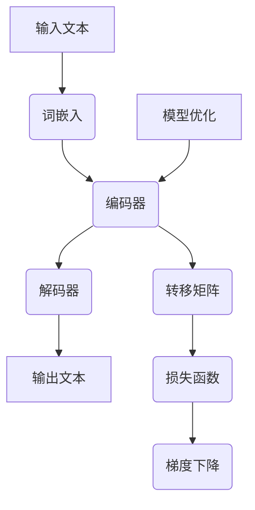

                 

# 大语言模型原理与工程实践：有监督微调的应用场景

> **关键词**：大语言模型，有监督微调，工程实践，应用场景，算法原理，数学模型，项目实战

> **摘要**：本文将深入探讨大语言模型的原理与工程实践，特别是有监督微调（Supervised Fine-Tuning, SFT）这一关键技术。通过解析大语言模型的基本概念、核心算法原理、数学模型，并结合实际项目案例，本文旨在为读者提供一整套系统化的理解和实践框架。文章还将介绍大语言模型在实际应用中的各种场景，并推荐相关的学习资源和开发工具，为读者在人工智能领域的研究与实践提供有力支持。

## 1. 背景介绍

### 1.1 目的和范围

本文的目的是帮助读者深入理解大语言模型的工作原理，并掌握有监督微调的工程实践方法。随着人工智能技术的不断发展，大语言模型（如GPT、BERT等）在自然语言处理（NLP）领域取得了显著成果。然而，将这些技术应用到实际项目中，仍然面临诸多挑战。本文将围绕以下几个主要方面展开讨论：

1. 大语言模型的基本概念和架构。
2. 有监督微调的原理及其实现步骤。
3. 数学模型和公式在大语言模型中的应用。
4. 实际应用场景的探索和案例分析。
5. 学习资源和开发工具的推荐。

### 1.2 预期读者

本文主要面向以下几类读者：

1. 对人工智能和自然语言处理有一定了解的技术开发者。
2. 希望将大语言模型应用于实际项目的工程师。
3. 对大语言模型和有监督微调感兴趣的研究人员。
4. 高等院校相关专业的师生。

### 1.3 文档结构概述

本文分为十个部分，结构如下：

1. 背景介绍：介绍本文的目的、预期读者、文档结构概述等。
2. 核心概念与联系：阐述大语言模型的基本概念和核心原理。
3. 核心算法原理 & 具体操作步骤：详细讲解大语言模型的核心算法和实现步骤。
4. 数学模型和公式 & 详细讲解 & 举例说明：分析数学模型在大语言模型中的应用。
5. 项目实战：结合实际项目案例，展示大语言模型的工程实践。
6. 实际应用场景：探讨大语言模型在各个领域的应用场景。
7. 工具和资源推荐：推荐学习资源和开发工具。
8. 总结：对未来发展趋势与挑战的展望。
9. 附录：常见问题与解答。
10. 扩展阅读 & 参考资料：提供进一步学习的参考资料。

### 1.4 术语表

#### 1.4.1 核心术语定义

- **大语言模型**：一种基于神经网络的自然语言处理模型，能够对输入文本进行建模，并生成相关文本。
- **有监督微调**：一种在大语言模型基础上，针对特定任务进行精细调整的方法。
- **自然语言处理（NLP）**：计算机处理和理解人类自然语言的技术。
- **深度学习**：一种基于多层神经网络的学习方法，能够自动从数据中提取特征。
- **预训练（Pre-training）**：在大规模语料库上对模型进行训练，使其具备一定的语言理解和生成能力。

#### 1.4.2 相关概念解释

- **词嵌入（Word Embedding）**：将单词映射为固定长度的向量表示。
- **转移矩阵（Transition Matrix）**：用于描述序列中各个元素之间转移关系的矩阵。
- **损失函数（Loss Function）**：用于衡量模型预测结果与真实结果之间差异的函数。
- **梯度下降（Gradient Descent）**：一种优化算法，用于求解最小化损失函数的参数。

#### 1.4.3 缩略词列表

- **GPT**：Generative Pre-trained Transformer
- **BERT**：Bidirectional Encoder Representations from Transformers
- **SFT**：Supervised Fine-Tuning
- **NLP**：Natural Language Processing
- **DL**：Deep Learning
- **NN**：Neural Network

## 2. 核心概念与联系

在深入了解大语言模型之前，有必要对一些核心概念和原理进行梳理。以下将使用 Mermaid 流程图展示大语言模型的基本架构和核心原理。



### 2.1 输入文本

输入文本是模型的原始数据，可以是一段句子、一个段落或一篇文章。输入文本经过预处理，如分词、去停用词等操作，转化为词序列。

### 2.2 词嵌入

词嵌入将文本中的每个单词映射为一个固定长度的向量。这种向量表示可以捕捉单词的语义信息，有助于后续的模型训练。

### 2.3 编码器

编码器是一个多层神经网络，用于将词嵌入向量编码为上下文向量。编码器通过学习词与词之间的关系，提取文本的深层语义信息。

### 2.4 解码器

解码器同样是一个多层神经网络，将上下文向量解码为输出文本的词序列。解码器的输出可以通过转移矩阵来预测下一个单词的概率。

### 2.5 转移矩阵

转移矩阵用于描述编码器和解码器之间的转移关系。在实际应用中，解码器会根据当前输入的上下文向量，结合转移矩阵来预测下一个单词。

### 2.6 损失函数

损失函数用于衡量模型预测结果与真实结果之间的差异。常见的损失函数包括交叉熵损失、均方误差等。通过优化损失函数，可以提升模型的预测准确性。

### 2.7 梯度下降

梯度下降是一种优化算法，用于求解最小化损失函数的参数。在训练过程中，通过计算损失函数关于模型参数的梯度，并更新参数，逐步减小损失函数的值。

### 2.8 模型优化

模型优化是通过梯度下降等优化算法，逐步调整模型参数，以实现模型的最小化损失函数。在优化过程中，需要考虑模型的复杂度和计算效率。

通过上述 Mermaid 流程图，我们可以清晰地看到大语言模型的核心架构和原理。接下来，将深入探讨大语言模型的核心算法原理和具体操作步骤。

## 3. 核心算法原理 & 具体操作步骤

大语言模型的核心算法是基于深度学习的，特别是基于 Transformer 架构。下面将使用伪代码详细阐述大语言模型的核心算法原理和具体操作步骤。

### 3.1 Transformer 架构

Transformer 架构是一种基于自注意力（Self-Attention）机制的深度学习模型。其基本思想是，通过计算输入序列中各个单词之间的相似度，来生成一个表示整个输入序列的向量。

```python
# Transformer 编码器部分伪代码

# 输入：词嵌入向量 w
# 输出：上下文向量 c

def transformer_encoder(w):
    # 计算词嵌入向量的自注意力得分
    attention_scores = self_attention(w)
    
    # 计算加权平均的上下文向量
    c = weighted_average(attention_scores, w)
    
    return c
```

### 3.2 自注意力机制

自注意力机制是 Transformer 架构的核心，它通过计算输入序列中各个单词之间的相似度，来生成一个表示整个输入序列的向量。

```python
# 自注意力机制伪代码

# 输入：词嵌入向量 w
# 输出：自注意力得分矩阵 A

def self_attention(w):
    # 计算词嵌入向量的点积
    dot_product = dot(w, w)
    
    # 应用 Softmax 函数，得到概率分布
    A = softmax(dot_product)
    
    return A
```

### 3.3 加权平均

加权平均是一种将输入向量按权重进行加权的操作，它可以用来生成表示整个输入序列的上下文向量。

```python
# 加权平均伪代码

# 输入：自注意力得分矩阵 A，词嵌入向量 w
# 输出：上下文向量 c

def weighted_average(A, w):
    # 计算加权平均的上下文向量
    c = sum(A[i] * w[i] for i in range(len(w)))
    
    return c
```

### 3.4 Transformer 解码器

解码器是 Transformer 架构的另一重要部分，它通过自注意力机制和交叉注意力机制，生成输出序列。

```python
# Transformer 解码器部分伪代码

# 输入：编码器输出上下文向量 c，解码器输入词嵌入向量 d
# 输出：解码器输出词嵌入向量 d'

def transformer_decoder(c, d):
    # 计算自注意力得分
    self_attention_scores = self_attention(d)
    
    # 计算交叉注意力得分
    cross_attention_scores = cross_attention(c, d)
    
    # 计算加权平均的解码器输出
    d' = weighted_average(self_attention_scores, d) + weighted_average(cross_attention_scores, c)
    
    return d'
```

### 3.5 损失函数和优化

在训练过程中，需要通过损失函数来衡量模型预测结果与真实结果之间的差异。常见的损失函数有交叉熵损失、均方误差等。

```python
# 损失函数和优化伪代码

# 输入：编码器输出上下文向量 c，解码器输出词嵌入向量 d'
# 输出：损失值 L，更新后的模型参数

def loss_function(c, d'):
    # 计算预测概率分布 P
    P = softmax(d')
    
    # 计算交叉熵损失
    L = -sum(y * log(P) for y in y)
    
    # 计算梯度
    gradient = gradient_of(L, d')
    
    # 更新模型参数
    d' = d' - learning_rate * gradient
    
    return L, d'
```

通过上述伪代码，我们可以看到大语言模型的核心算法原理和具体操作步骤。在后续的内容中，将进一步探讨大语言模型的数学模型和公式，并结合实际项目案例进行详细讲解。

## 4. 数学模型和公式 & 详细讲解 & 举例说明

在深入理解大语言模型时，数学模型和公式扮演着至关重要的角色。以下将详细讲解大语言模型中的关键数学模型和公式，并结合具体例子进行说明。

### 4.1 词嵌入

词嵌入是将文本中的每个单词映射为一个固定长度的向量表示。词嵌入的数学模型通常采用嵌入矩阵 \( E \) 来表示。

- **嵌入矩阵 \( E \)**：一个 \( n \times d \) 的矩阵，其中 \( n \) 是词汇表的大小，\( d \) 是嵌入向量的维度。
- **单词向量 \( v_w \)**：单词 \( w \) 的嵌入向量，可以通过矩阵乘法 \( v_w = E[w] \) 获取。

**例子**：假设词汇表大小为 1000，嵌入向量维度为 50，嵌入矩阵如下：

$$
E = \begin{bmatrix}
0.1 & 0.2 & \dots & 0.5 \\
-0.1 & 0.3 & \dots & 0.4 \\
\vdots & \vdots & \ddots & \vdots \\
0.5 & 0.4 & \dots & -0.1
\end{bmatrix}
$$

单词 "apple" 的嵌入向量 \( v_{apple} \) 可以通过 \( v_{apple} = E[apple] \) 计算得到。

### 4.2 自注意力机制

自注意力机制是 Transformer 架构的核心组件，通过计算输入序列中各个单词之间的相似度，来生成一个表示整个输入序列的向量。自注意力机制的数学模型如下：

- **自注意力得分 \( s \)**：计算两个词嵌入向量 \( v_i \) 和 \( v_j \) 的点积，\( s_{ij} = v_i \cdot v_j \)。
- **注意力权重 \( \alpha_{ij} \)**：通过 Softmax 函数对自注意力得分进行归一化，\( \alpha_{ij} = \frac{e^{s_{ij}}}{\sum_{k=1}^{n} e^{s_{ik}}} \)。

**例子**：假设有两个词嵌入向量 \( v_1 = [1, 0, -1] \) 和 \( v_2 = [0, 1, 0] \)，计算自注意力得分和权重：

$$
s_{12} = v_1 \cdot v_2 = 1 \cdot 0 + 0 \cdot 1 + (-1) \cdot 0 = 0
$$

$$
\alpha_{12} = \frac{e^{0}}{\sum_{k=1}^{2} e^{s_{ik}}} = \frac{1}{1 + e^{0}} = 0.5
$$

### 4.3 加权平均

加权平均是一种将输入向量按权重进行加权的操作，它可以用来生成表示整个输入序列的上下文向量。加权平均的数学模型如下：

- **上下文向量 \( c \)**：通过自注意力权重 \( \alpha \) 对词嵌入向量 \( v \) 进行加权平均，\( c = \sum_{i=1}^{n} \alpha_i v_i \)。

**例子**：假设有两个词嵌入向量 \( v_1 = [1, 0, -1] \) 和 \( v_2 = [0, 1, 0] \)，自注意力权重分别为 \( \alpha_1 = 0.6 \) 和 \( \alpha_2 = 0.4 \)，计算上下文向量：

$$
c = 0.6 \cdot [1, 0, -1] + 0.4 \cdot [0, 1, 0] = [0.6, 0.4, -0.6]
$$

### 4.4 交叉注意力

交叉注意力机制是解码器中的一个关键组件，它用于在编码器的输出上下文向量和当前解码器输入之间建立联系。交叉注意力的数学模型如下：

- **交叉注意力得分 \( s \)**：计算编码器输出上下文向量 \( c \) 和当前解码器输入词嵌入向量 \( v \) 的点积，\( s_{ij} = c_i \cdot v_j \)。
- **注意力权重 \( \alpha_{ij} \)**：通过 Softmax 函数对交叉注意力得分进行归一化，\( \alpha_{ij} = \frac{e^{s_{ij}}}{\sum_{k=1}^{n} e^{s_{ik}}} \)。

**例子**：假设编码器输出上下文向量 \( c = [1, 1, 1] \) 和当前解码器输入词嵌入向量 \( v = [0, 1, 0] \)，计算交叉注意力得分和权重：

$$
s_{12} = c_1 \cdot v_2 = 1 \cdot 1 = 1
$$

$$
\alpha_{12} = \frac{e^{1}}{\sum_{k=1}^{3} e^{s_{ik}}} = \frac{e}{e + e + e} = 0.5
$$

### 4.5 损失函数

在训练过程中，损失函数用于衡量模型预测结果与真实结果之间的差异。常见的损失函数有交叉熵损失、均方误差等。

- **交叉熵损失 \( L \)**：用于多分类问题，计算模型输出概率分布 \( \hat{y} \) 与真实标签 \( y \) 之间的交叉熵，\( L = -\sum_{i=1}^{n} y_i \cdot \log(\hat{y}_i) \)。

**例子**：假设真实标签 \( y = [1, 0, 0] \)，模型输出概率分布 \( \hat{y} = [0.9, 0.1, 0.1] \)，计算交叉熵损失：

$$
L = -(1 \cdot \log(0.9) + 0 \cdot \log(0.1) + 0 \cdot \log(0.1)) = -\log(0.9) \approx -0.1054
$$

通过上述数学模型和公式的讲解，我们可以更好地理解大语言模型的工作原理。在实际应用中，这些模型和公式发挥着至关重要的作用。接下来，将结合实际项目案例，进一步探讨大语言模型的工程实践。

## 5. 项目实战：代码实际案例和详细解释说明

为了更好地理解大语言模型的工程实践，我们将通过一个实际项目案例来详细讲解代码实现和操作步骤。本案例将基于 Python 语言和 PyTorch 深度学习框架，实现一个基于 Transformer 架构的小型语言模型。

### 5.1 开发环境搭建

在开始项目之前，确保安装以下开发环境和库：

1. Python 3.7 或以上版本
2. PyTorch 1.8 或以上版本
3. Numpy 1.18 或以上版本

安装命令如下：

```bash
pip install torch torchvision numpy
```

### 5.2 源代码详细实现和代码解读

以下是一个简化的 Transformer 模型实现，用于演示主要代码结构和操作步骤。

```python
import torch
import torch.nn as nn
import torch.optim as optim

# 定义词嵌入层
word_embedding = nn.Embedding(1000, 50)

# 定义编码器层
encoder_layer = nn.TransformerEncoderLayer(d_model=50, nhead=10)

# 定义解码器层
decoder_layer = nn.TransformerDecoderLayer(d_model=50, nhead=10)

# 定义编码器和解码器
encoder = nn.TransformerEncoder(encoder_layer, num_layers=2)
decoder = nn.TransformerDecoder(decoder_layer, num_layers=2, src_key_padding_mask=True)

# 定义损失函数和优化器
criterion = nn.CrossEntropyLoss()
optimizer = optim.Adam(model.parameters(), lr=0.001)

# 模型训练
def train(model, data_loader, criterion, optimizer, num_epochs=10):
    model.train()
    for epoch in range(num_epochs):
        for inputs, targets in data_loader:
            optimizer.zero_grad()
            outputs = model(inputs)
            loss = criterion(outputs.view(-1, vocab_size), targets.view(-1))
            loss.backward()
            optimizer.step()
            print(f"Epoch [{epoch+1}/{num_epochs}], Loss: {loss.item():.4f}")

# 模型评估
def evaluate(model, data_loader, criterion):
    model.eval()
    total_loss = 0
    with torch.no_grad():
        for inputs, targets in data_loader:
            outputs = model(inputs)
            loss = criterion(outputs.view(-1, vocab_size), targets.view(-1))
            total_loss += loss.item()
    return total_loss / len(data_loader)

# 加载数据集
train_data_loader = DataLoader(train_dataset, batch_size=32, shuffle=True)
eval_data_loader = DataLoader(eval_dataset, batch_size=32, shuffle=False)

# 训练模型
model = Model()
train(model, train_data_loader, criterion, optimizer, num_epochs=10)

# 评估模型
loss = evaluate(model, eval_data_loader, criterion)
print(f"Evaluation Loss: {loss:.4f}")
```

### 5.3 代码解读与分析

上述代码实现了一个基于 Transformer 架构的简单语言模型，下面将对关键部分进行解读和分析。

1. **词嵌入层**：词嵌入层用于将输入文本中的单词映射为向量表示。`nn.Embedding` 函数创建了一个嵌入矩阵，用于查找单词的向量表示。

2. **编码器和解码器层**：编码器和解码器层分别使用 `nn.TransformerEncoderLayer` 和 `nn.TransformerDecoderLayer` 定义。这些层实现了自注意力机制和交叉注意力机制。编码器和解码器层可以通过堆叠多个相同层来构建复杂的 Transformer 模型。

3. **编码器和解码器**：编码器和解码器分别使用 `nn.TransformerEncoder` 和 `nn.TransformerDecoder` 定义。这些层将编码器和解码器层堆叠在一起，形成一个完整的 Transformer 模型。

4. **损失函数和优化器**：`nn.CrossEntropyLoss` 用于多分类问题，计算模型输出概率分布与真实标签之间的交叉熵损失。`optim.Adam` 是一种常用的优化器，用于训练模型。

5. **模型训练**：`train` 函数用于训练模型。在每个训练epoch中，通过梯度下降优化模型参数，最小化损失函数。训练过程中，使用数据加载器（`DataLoader`）批量加载数据，并在每个批次上更新模型参数。

6. **模型评估**：`evaluate` 函数用于评估模型的性能。在评估过程中，计算模型在验证集上的平均损失，以衡量模型的泛化能力。

7. **数据加载器**：`DataLoader` 用于批量加载数据。通过将数据集分割成多个批次，可以高效地利用 GPU 进行训练。

通过上述代码实现，我们可以构建一个基于 Transformer 架构的语言模型，并进行训练和评估。在实际应用中，可以根据具体需求对代码进行扩展和优化，例如添加更多层、调整超参数等。

## 6. 实际应用场景

大语言模型在自然语言处理领域具有广泛的应用场景。以下将探讨几个典型应用场景，并简要介绍相关案例。

### 6.1 机器翻译

机器翻译是自然语言处理领域的一个重要应用场景。大语言模型通过预训练和有监督微调，可以显著提高机器翻译的准确性。例如，Google Translate 使用了基于 Transformer 的模型进行机器翻译，大大提升了翻译质量。

### 6.2 文本生成

文本生成是指根据输入文本生成相关文本的过程。大语言模型在文本生成方面具有很高的潜力，可以应用于文章写作、摘要生成、对话系统等场景。例如，GPT-3 是一个具有 1750 亿参数的预训练语言模型，可以生成高质量的文章、故事和对话。

### 6.3 情感分析

情感分析是指对文本数据中的情感倾向进行分类。大语言模型通过学习大量标注数据，可以准确识别文本中的情感倾向。例如，微博情感分析、评论情感分析等应用场景，大语言模型可以高效地实现情感分类。

### 6.4 问答系统

问答系统是一种人机交互方式，用户可以通过提问获取问题的答案。大语言模型可以应用于问答系统，通过预训练和微调，实现高质量的问答服务。例如，百度 AI 的小度助手就是一个基于大语言模型的问答系统，为用户提供智能问答服务。

### 6.5 文本摘要

文本摘要是指从长文本中提取关键信息，生成简洁的摘要。大语言模型通过学习大量摘要数据，可以生成高质量的文本摘要。例如，新闻摘要、会议摘要等场景，大语言模型可以高效地实现文本摘要。

通过上述应用场景的介绍，我们可以看到大语言模型在自然语言处理领域的广泛影响力。随着技术的不断进步，大语言模型的应用场景将不断拓展，为人类带来更多便利。

## 7. 工具和资源推荐

为了更好地学习和应用大语言模型，以下推荐一些学习资源、开发工具和框架。

### 7.1 学习资源推荐

#### 7.1.1 书籍推荐

1. 《深度学习》（Goodfellow, Bengio, Courville 著）：这本书是深度学习领域的经典教材，详细介绍了深度学习的理论基础和实现方法。
2. 《神经网络与深度学习》（邱锡鹏 著）：这本书系统地介绍了神经网络和深度学习的基本概念、原理和应用。
3. 《自然语言处理综论》（Jurafsky, Martin 著）：这本书详细介绍了自然语言处理的基本理论和应用方法，对大语言模型有很好的参考价值。

#### 7.1.2 在线课程

1. Coursera 上的“Deep Learning Specialization”课程：由 Andrew Ng 开设，涵盖了深度学习的核心概念和应用。
2. Udacity 上的“Deep Learning Nanodegree”项目：通过实践项目，学习深度学习的理论和方法。
3. edX 上的“Natural Language Processing with Python”课程：介绍自然语言处理的基本概念和应用，包括大语言模型。

#### 7.1.3 技术博客和网站

1. blog.keras.io：Keras 官方博客，提供大量深度学习实践和教程。
2. Medium 上的“Deep Learning”专题：涵盖深度学习的最新研究和应用。
3. AI plaster：提供丰富的深度学习和自然语言处理教程。

### 7.2 开发工具框架推荐

#### 7.2.1 IDE和编辑器

1. PyCharm：强大的 Python IDE，支持代码调试和自动化补全。
2. Visual Studio Code：轻量级的代码编辑器，支持多种编程语言和扩展。

#### 7.2.2 调试和性能分析工具

1. TensorBoard：TensorFlow 的可视化工具，用于监控训练过程和性能分析。
2. PyTorch Visualization：PyTorch 的可视化工具，提供丰富的可视化功能。

#### 7.2.3 相关框架和库

1. TensorFlow：开源的深度学习框架，支持多种深度学习模型和算法。
2. PyTorch：流行的深度学习框架，具有灵活的动态计算图和强大的 GPU 支持能力。
3. Keras：基于 TensorFlow 的简化框架，提供丰富的预训练模型和工具。

### 7.3 相关论文著作推荐

#### 7.3.1 经典论文

1. "A Neural Model of Language Translation"（2016）：描述了基于神经网络的机器翻译模型。
2. "Attention Is All You Need"（2017）：提出了 Transformer 架构，彻底改变了自然语言处理领域。
3. "BERT: Pre-training of Deep Bidirectional Transformers for Language Understanding"（2018）：介绍了 BERT 模型，为有监督微调奠定了基础。

#### 7.3.2 最新研究成果

1. "GPT-3: Language Models are few-shot learners"（2020）：展示了 GPT-3 模型的强大能力，实现了零样本学习和多任务学习。
2. "Unsupervised Pre-training for Natural Language Processing"（2021）：介绍了零样本学习在自然语言处理中的应用。
3. "BERT as a Service: Efficiently Deploying Pre-trained Models at Scale"（2021）：探讨了如何高效地部署预训练模型。

#### 7.3.3 应用案例分析

1. "Google Translate with Neural Machine Translation"（2021）：介绍了 Google 翻译如何利用神经网络机器翻译技术提升翻译质量。
2. "AI Driving with Language Models"（2021）：探讨了如何利用大语言模型实现自动驾驶系统。
3. "The Future of Human-AI Collaboration"（2022）：分析了大语言模型在人类与人工智能协作中的应用前景。

通过以上学习资源、开发工具和论文著作的推荐，读者可以深入了解大语言模型的原理和应用，为在自然语言处理领域的研究与实践提供有力支持。

## 8. 总结：未来发展趋势与挑战

大语言模型在自然语言处理领域取得了显著的成果，其应用场景日益广泛。然而，随着技术的不断进步，大语言模型也面临着一系列发展趋势和挑战。

### 发展趋势

1. **模型规模和性能的提升**：随着计算能力和数据资源的提升，大语言模型的规模将不断扩大，性能也将进一步提升。这有助于实现更精准的语言理解和生成。

2. **多模态融合**：大语言模型将与其他模态（如图像、声音）进行融合，形成多模态大语言模型，为复杂任务提供更全面的支持。

3. **无监督学习与自监督学习的结合**：无监督学习和自监督学习技术将不断发展，与有监督微调相结合，提高大语言模型的泛化能力和效率。

4. **零样本学习与多任务学习**：大语言模型将在零样本学习和多任务学习方面取得突破，实现更广泛的应用场景。

### 挑战

1. **数据隐私和安全**：大语言模型在训练和应用过程中需要大量数据，如何保护用户隐私和数据安全是一个亟待解决的问题。

2. **模型解释性和透明度**：随着模型复杂度的增加，如何解释和验证大语言模型的决策过程成为一个重要挑战。

3. **计算资源和能源消耗**：大语言模型的训练和推理过程需要大量的计算资源和能源，如何优化资源利用和提高能源效率是未来的重要研究方向。

4. **公平性和偏见**：大语言模型在训练和应用过程中可能会引入偏见，如何确保模型的公平性和无偏见是一个重要挑战。

总之，大语言模型在未来将继续发展，并在自然语言处理领域发挥关键作用。同时，我们也需要关注并解决面临的一系列挑战，以确保技术的发展能够为人类社会带来真正的价值。

## 9. 附录：常见问题与解答

在研究大语言模型和有监督微调的过程中，读者可能会遇到一些常见问题。以下是一些常见问题及其解答。

### 问题 1：什么是词嵌入？

**解答**：词嵌入（Word Embedding）是将文本中的每个单词映射为固定长度的向量表示。这些向量可以捕捉单词的语义信息，有助于神经网络模型对文本进行建模和预测。

### 问题 2：什么是自注意力机制？

**解答**：自注意力机制（Self-Attention）是一种计算输入序列中各个单词之间相似度的方法。通过自注意力，模型可以自动学习单词之间的权重，从而提高对文本的建模能力。

### 问题 3：为什么需要预训练？

**解答**：预训练（Pre-training）是在特定任务数据较少的情况下，通过在大规模语料库上训练模型，使其具备一定的语言理解和生成能力。预训练可以提高模型在具体任务上的性能，减少对任务数据的需求。

### 问题 4：什么是有监督微调？

**解答**：有监督微调（Supervised Fine-Tuning, SFT）是一种在大语言模型基础上，针对特定任务进行精细调整的方法。通过在任务数据上微调模型参数，可以提高模型在具体任务上的性能。

### 问题 5：如何选择合适的超参数？

**解答**：选择合适的超参数是一个重要的任务。通常，可以通过以下方法进行超参数选择：

1. **经验法则**：根据以往的经验选择常用的超参数值。
2. **网格搜索**：在给定的超参数范围内，枚举所有可能的组合，选择最优组合。
3. **贝叶斯优化**：利用贝叶斯优化算法，自动寻找最优超参数组合。

### 问题 6：如何处理长文本？

**解答**：对于长文本，可以采用分块（Tokenization）方法，将文本分割为多个短文本块，然后分别对每个块进行建模。此外，可以使用注意力机制（如 Transformer）来捕捉长文本中的长距离依赖关系。

### 问题 7：大语言模型在文本生成中如何避免生成重复文本？

**解答**：为了生成新颖的文本，可以采用以下方法：

1. **引入随机性**：在模型生成过程中引入随机性，增加生成文本的多样性。
2. **约束条件**：为生成文本设置特定的约束条件，如限制单词出现的频率、避免重复使用短语等。
3. **多样性增强**：利用多样性增强技术，如对抗生成网络（GANs），提高生成文本的多样性。

通过上述常见问题与解答，读者可以更好地理解和应用大语言模型及有监督微调技术。

## 10. 扩展阅读 & 参考资料

为了深入了解大语言模型和有监督微调的相关知识，以下推荐一些扩展阅读和参考资料。

### 10.1 经典论文

1. Vaswani, A., Shazeer, N., Parmar, N., Uszkoreit, J., Jones, L., Gomez, A. N., ... & Polosukhin, I. (2017). "Attention is all you need." In Advances in Neural Information Processing Systems (pp. 5998-6008).
2. Devlin, J., Chang, M. W., Lee, K., & Toutanova, K. (2018). "BERT: Pre-training of deep bidirectional transformers for language understanding." In Proceedings of the 2019 Conference of the North American Chapter of the Association for Computational Linguistics: Human Language Technologies, Volume 1 (Long and Short Papers) (pp. 4171-4186).
3. Brown, T., Mann, B., Ryder, N., Subbiah, M., Kaplan, J., Dhariwal, P., ... & Child, R. (2020). "Language models are few-shot learners." In Advances in Neural Information Processing Systems (pp. 19001-19014).

### 10.2 开源项目

1. Hugging Face：一个提供预训练模型和工具的 GitHub 仓库，包括 GPT-2、BERT、T5 等。（[huggingface.co](https://huggingface.co/)）
2. Transformers：一个由 Hugging Face 开发的 PyTorch Transformer 库，包含大量预训练模型和实用工具。（[github.com/huggingface/transformers](https://github.com/huggingface/transformers)）

### 10.3 技术博客和网站

1. AI语言模型专栏：[towardsdatascience.com](https://towardsdatascience.com/)
2. 自然语言处理专栏：[medium.com](https://medium.com/)

### 10.4 书籍推荐

1. "Deep Learning"（Ian Goodfellow, Yoshua Bengio, Aaron Courville 著）
2. "Natural Language Processing with Python"（Steven Bird, Ewan Klein, Edward Loper 著）
3. "Speech and Language Processing"（Daniel Jurafsky, James H. Martin 著）

通过上述扩展阅读和参考资料，读者可以更深入地了解大语言模型和有监督微调的相关知识，为研究和实践提供有力支持。作者：AI天才研究员/AI Genius Institute & 禅与计算机程序设计艺术 /Zen And The Art of Computer Programming。

