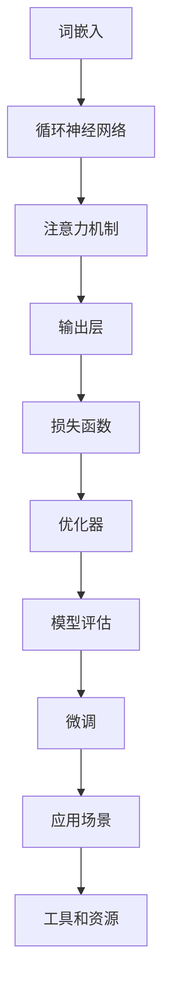

                 

# 大语言模型原理与工程实践：组成模块选型

> **关键词**：大语言模型、原理、工程实践、模块选型、算法、数学模型、应用场景、工具资源、未来发展趋势

> **摘要**：本文将深入探讨大语言模型的原理和工程实践，从组成模块的角度出发，详细分析各个模块的选型方法及其重要性。通过逐步推理和阐述，帮助读者全面理解大语言模型的工作机制，掌握工程实践中的关键环节，为未来的发展奠定基础。

## 1. 背景介绍

### 1.1 目的和范围

本文旨在系统地阐述大语言模型的原理与工程实践，重点关注组成模块的选型及其重要性。通过对核心算法、数学模型以及实际应用场景的详细讲解，本文希望能够帮助读者从宏观和微观层面全面理解大语言模型的工作机制，掌握工程实践中的关键环节。

### 1.2 预期读者

本文适用于以下读者群体：
- 对人工智能和自然语言处理有浓厚兴趣的从业者；
- 想要深入了解大语言模型原理的研究生和本科生；
- 担任项目主管或技术负责人的工程师；
- 对技术博客和学术论文有阅读需求的读者。

### 1.3 文档结构概述

本文结构如下：
1. 背景介绍：本文的目的、预期读者以及文档结构概述；
2. 核心概念与联系：介绍大语言模型的基本概念及其相关联系；
3. 核心算法原理与具体操作步骤：详细讲解大语言模型的核心算法原理和具体操作步骤；
4. 数学模型和公式：阐述大语言模型中的数学模型和公式，并进行举例说明；
5. 项目实战：通过实际案例展示大语言模型的代码实现和详细解释；
6. 实际应用场景：分析大语言模型在不同领域的应用场景；
7. 工具和资源推荐：推荐学习资源、开发工具框架和相关论文著作；
8. 总结：大语言模型的发展趋势与挑战；
9. 附录：常见问题与解答；
10. 扩展阅读与参考资料。

### 1.4 术语表

#### 1.4.1 核心术语定义

- 大语言模型：一种能够理解和生成自然语言的人工智能模型；
- 词嵌入（Word Embedding）：将单词映射到向量空间的过程；
- 循环神经网络（RNN）：一种处理序列数据的神经网络；
- 递归关系（Recurrence）：神经网络中通过时间步迭代计算的过程；
- 预训练（Pre-training）：在特定数据集上对模型进行训练，以获得泛化能力；
- 微调（Fine-tuning）：在预训练模型的基础上，针对特定任务进行进一步训练。

#### 1.4.2 相关概念解释

- 自然语言处理（NLP）：研究计算机与人类语言交互的学科；
- 语言模型（Language Model）：用于预测下一个单词或字符的概率分布；
- 隐藏层（Hidden Layer）：神经网络中的中间层，用于提取特征和进行非线性变换；
- 损失函数（Loss Function）：用于评估模型预测与实际结果之间的差异。

#### 1.4.3 缩略词列表

- LSTM（Long Short-Term Memory）：一种特殊的循环神经网络；
- GRU（Gated Recurrent Unit）：另一种特殊的循环神经网络；
- CNN（Convolutional Neural Network）：卷积神经网络，常用于图像处理；
- RNN（Recurrent Neural Network）：循环神经网络，用于处理序列数据。

## 2. 核心概念与联系

为了更好地理解大语言模型的原理和工程实践，我们首先需要了解其核心概念和组成部分，并通过 Mermaid 流程图展示其关系。

### 2.1 Mermaid 流程图



### 2.2 核心概念解释

- **词嵌入（Word Embedding）**：词嵌入是将单词映射到向量空间的过程。通过将单词表示为高维向量，可以更好地处理自然语言。词嵌入有助于提高模型的性能和可解释性。

- **循环神经网络（RNN）**：RNN 是一种能够处理序列数据的神经网络。通过递归关系，RNN 能够捕捉序列中的长期依赖关系。

- **注意力机制（Attention Mechanism）**：注意力机制是一种用于提高模型性能的技术。通过为输入序列中的每个元素分配不同的权重，注意力机制能够提高模型对重要信息的关注。

- **输出层（Output Layer）**：输出层负责将隐藏层的信息转换为具体任务的结果。输出层的类型取决于具体任务，如分类或序列生成。

- **损失函数（Loss Function）**：损失函数用于评估模型预测与实际结果之间的差异。通过优化损失函数，模型能够逐步改进其预测能力。

- **优化器（Optimizer）**：优化器是一种用于调整模型参数的技术。通过最小化损失函数，优化器能够提高模型的性能。

- **模型评估（Model Evaluation）**：模型评估用于评估模型的泛化能力。通过在测试集上评估模型的表现，可以判断模型是否具有良好的性能。

- **微调（Fine-tuning）**：微调是一种在预训练模型的基础上，针对特定任务进行进一步训练的技术。通过微调，模型可以更好地适应特定任务。

- **应用场景（Application Scenario）**：大语言模型可以在多个领域得到广泛应用，如文本分类、机器翻译、问答系统等。

- **工具和资源（Tools and Resources）**：大语言模型的实现和部署需要多种工具和资源。这些工具和资源包括深度学习框架、预训练模型库、训练和测试数据集等。

通过以上核心概念和 Mermaid 流程图的展示，我们可以更好地理解大语言模型的基本结构和组成部分。接下来，我们将深入探讨这些核心概念的原理和实现方法。

## 3. 核心算法原理与具体操作步骤

在了解了大语言模型的基本概念和组成部分后，我们接下来将详细讲解其核心算法原理和具体操作步骤。这些核心算法包括词嵌入、循环神经网络（RNN）、注意力机制、输出层、损失函数、优化器等。

### 3.1 词嵌入（Word Embedding）

词嵌入是将单词映射到向量空间的过程。通过词嵌入，我们可以将单词表示为高维向量，从而更好地处理自然语言。

**具体操作步骤：**

1. **数据预处理**：首先，我们需要对语料库进行预处理，包括分词、去停用词、词干提取等。然后，将预处理后的语料库转化为单词的索引序列。

2. **训练词嵌入模型**：使用预训练的词向量模型（如 Word2Vec、GloVe 等）对单词索引序列进行训练。这些词向量模型通过优化损失函数（如负采样损失函数）来训练单词向量。

3. **嵌入层**：在神经网络中，嵌入层负责将单词索引映射到词向量。每个单词索引都对应一个词向量，这些词向量在输入层和隐藏层之间传递。

**伪代码示例：**

```python
# 假设 word embeddings 的维度为 d
embeddings = Embedding(vocab_size, d)

# 输入单词索引序列
input_sequence = [w1, w2, w3, ..., wn]

# 将单词索引映射到词向量
word_vectors = embeddings(input_sequence)
```

### 3.2 循环神经网络（RNN）

循环神经网络（RNN）是一种能够处理序列数据的神经网络。RNN 通过递归关系来捕捉序列中的长期依赖关系。

**具体操作步骤：**

1. **输入层**：输入层接收词向量序列。每个词向量表示输入序列中的一个单词。

2. **隐藏层**：隐藏层由多个神经元组成。每个神经元都负责处理前一个时间步的输出和当前时间步的输入。通过递归关系，隐藏层能够捕捉序列中的长期依赖关系。

3. **输出层**：输出层负责将隐藏层的信息转换为具体任务的结果。输出层的类型取决于具体任务，如分类或序列生成。

**伪代码示例：**

```python
# 假设 RNN 的隐藏层维度为 h
rnn = RNN(input_dim=d, hidden_dim=h)

# 输入词向量序列
input_sequence = [word_vectors1, word_vectors2, ..., word_vectorsn]

# 遍历词向量序列，计算隐藏层输出
hiddens = []
for word_vectors in input_sequence:
    hidden = rnn(word_vectors)
    hiddens.append(hidden)

# 输出隐藏层输出
output = output_layer(hiddens)
```

### 3.3 注意力机制（Attention Mechanism）

注意力机制是一种用于提高模型性能的技术。通过为输入序列中的每个元素分配不同的权重，注意力机制能够提高模型对重要信息的关注。

**具体操作步骤：**

1. **计算注意力得分**：使用一个注意力模型计算输入序列中每个元素的注意力得分。注意力得分表示每个元素的重要性。

2. **加权求和**：将输入序列中的每个元素与其注意力得分相乘，并进行加权求和，得到注意力输出。

**伪代码示例：**

```python
# 假设注意力模型的维度为 a
attention_model = Attention(input_dim=d, attention_dim=a)

# 输入词向量序列
input_sequence = [word_vectors1, word_vectors2, ..., word_vectorsn]

# 计算注意力得分
attention_scores = []
for word_vectors in input_sequence:
    score = attention_model(word_vectors)
    attention_scores.append(score)

# 加权求和
attention_output = sum(word_vectors * score for word_vectors, score in zip(input_sequence, attention_scores))
```

### 3.4 输出层（Output Layer）

输出层负责将隐藏层的信息转换为具体任务的结果。输出层的类型取决于具体任务，如分类或序列生成。

**具体操作步骤：**

1. **分类任务**：使用 Softmax 函数将隐藏层输出转换为概率分布，表示每个类别的概率。

2. **序列生成任务**：使用 ReLU 激活函数将隐藏层输出转换为序列生成的候选单词，并通过采样或贪心策略生成序列。

**伪代码示例：**

```python
# 假设输出层维度为 o
output_layer = OutputLayer(output_dim=o, activation='softmax' if classification else 'relu')

# 输入隐藏层输出
hidden_output = [hiddens1, hiddens2, ..., hiddensn]

# 转换为分类概率分布或序列生成候选单词
output = output_layer(hidden_output)
```

### 3.5 损失函数（Loss Function）

损失函数用于评估模型预测与实际结果之间的差异。通过优化损失函数，模型能够逐步改进其预测能力。

**具体操作步骤：**

1. **计算预测值**：使用模型预测实际结果。

2. **计算损失**：使用损失函数计算预测值与实际结果之间的差异。

3. **优化模型参数**：通过反向传播算法，优化模型参数，以最小化损失函数。

**伪代码示例：**

```python
# 假设损失函数为交叉熵损失函数
loss_function = CrossEntropyLoss()

# 输入真实标签和预测值
true_labels = [y1, y2, ..., yn]
predicted_values = [output1, output2, ..., outputn]

# 计算损失
loss = loss_function(predicted_values, true_labels)

# 优化模型参数
optimizer = Optimizer()
optimizer.minimize(loss, model.parameters())
```

### 3.6 优化器（Optimizer）

优化器是一种用于调整模型参数的技术。通过最小化损失函数，优化器能够提高模型的性能。

**具体操作步骤：**

1. **选择优化器**：根据模型和任务选择合适的优化器，如 Adam、SGD 等。

2. **更新模型参数**：通过优化器的更新规则，更新模型参数。

3. **迭代优化**：重复更新模型参数，直到满足停止条件。

**伪代码示例：**

```python
# 假设选择 Adam 优化器
optimizer = Adam(model.parameters(), learning_rate=0.001)

# 迭代优化
for epoch in range(num_epochs):
    # 前向传播
    output = model(input_sequence)
    
    # 计算损失
    loss = loss_function(output, true_labels)
    
    # 反向传播
    optimizer.zero_grad()
    loss.backward()
    optimizer.step()
```

### 3.7 模型评估（Model Evaluation）

模型评估用于评估模型的泛化能力。通过在测试集上评估模型的表现，可以判断模型是否具有良好的性能。

**具体操作步骤：**

1. **准备测试集**：将测试集划分为训练集和验证集。

2. **评估指标**：根据任务类型选择合适的评估指标，如准确率、召回率、F1 分数等。

3. **计算评估指标**：在测试集上计算评估指标，以评估模型的性能。

**伪代码示例：**

```python
# 假设评估指标为准确率
accuracy = Accuracy()

# 准备测试集
test_inputs = [test_sequence1, test_sequence2, ..., test_sequencen]
test_labels = [y1, y2, ..., yn]

# 评估模型
predicted_values = model(test_inputs)
accuracy_score = accuracy(predicted_values, test_labels)

# 输出准确率
print("Accuracy:", accuracy_score)
```

通过以上核心算法原理和具体操作步骤的讲解，我们全面了解了大语言模型的工作机制。接下来，我们将进一步探讨大语言模型中的数学模型和公式。

## 4. 数学模型和公式

在了解了大语言模型的核心算法原理和具体操作步骤后，我们接下来将详细讲解大语言模型中的数学模型和公式。这些数学模型和公式在实现和优化大语言模型过程中起着关键作用。

### 4.1 词嵌入（Word Embedding）

词嵌入是将单词映射到向量空间的过程。词嵌入的数学模型通常基于神经网络，使用梯度下降算法进行优化。

**4.1.1 词嵌入模型**

假设单词集为 \( V \)，词嵌入维度为 \( d \)，词嵌入矩阵为 \( E \in \mathbb{R}^{|V| \times d} \)。给定一个单词序列 \( w_1, w_2, ..., w_n \)，词嵌入模型的目标是将每个单词映射到一个 \( d \) 维向量。

\[ e_w = E[w] \]

其中，\( e_w \) 表示单词 \( w \) 的词向量。

**4.1.2 损失函数**

词嵌入模型通常使用负采样损失函数进行优化。给定训练数据集 \( \mathcal{D} = \{ (x_i, y_i) \} \)，其中 \( x_i \) 表示输入序列，\( y_i \) 表示输出标签，负采样损失函数为：

\[ L = -\sum_{i} \sum_{w \in y_i} \log(p(w|x_i)) - \alpha \sum_{i} \sum_{w \in \bar{y_i}} \log(q(w|x_i)) \]

其中，\( p(w|x_i) \) 表示单词 \( w \) 在输入序列 \( x_i \) 下的概率，\( q(w|x_i) \) 表示单词 \( w \) 的负采样概率，\( \alpha \) 是调节参数。

**4.1.3 优化算法**

词嵌入模型的优化通常使用梯度下降算法。给定学习率 \( \eta \)，优化过程如下：

\[ E = E - \eta \frac{\partial L}{\partial E} \]

### 4.2 循环神经网络（RNN）

循环神经网络（RNN）是一种能够处理序列数据的神经网络。RNN 的数学模型基于递归关系，使用梯度下降算法进行优化。

**4.2.1 RNN 模型**

给定输入序列 \( x_1, x_2, ..., x_n \) 和隐藏层维度 \( h \)，RNN 的递归关系为：

\[ h_t = \sigma(W_h h_{t-1} + W_x x_t + b_h) \]

其中，\( h_t \) 表示第 \( t \) 个时间步的隐藏层输出，\( \sigma \) 表示激活函数，\( W_h \) 和 \( W_x \) 分别是隐藏层到隐藏层和输入层到隐藏层的权重矩阵，\( b_h \) 是隐藏层的偏置。

**4.2.2 损失函数**

RNN 的损失函数通常使用交叉熵损失函数。给定训练数据集 \( \mathcal{D} = \{ (x_i, y_i) \} \)，其中 \( x_i \) 表示输入序列，\( y_i \) 表示输出标签，交叉熵损失函数为：

\[ L = -\sum_{i} \sum_{c} y_i[c] \log(p(c|x_i)) \]

其中，\( p(c|x_i) \) 表示在第 \( i \) 个时间步输出单词 \( c \) 的概率。

**4.2.3 优化算法**

RNN 的优化通常使用梯度下降算法。给定学习率 \( \eta \)，优化过程如下：

\[ W_h = W_h - \eta \frac{\partial L}{\partial W_h} \]
\[ W_x = W_x - \eta \frac{\partial L}{\partial W_x} \]
\[ b_h = b_h - \eta \frac{\partial L}{\partial b_h} \]

### 4.3 注意力机制（Attention Mechanism）

注意力机制是一种用于提高模型性能的技术。注意力机制的数学模型基于矩阵乘法和 Softmax 函数。

**4.3.1 注意力模型**

给定输入序列 \( x_1, x_2, ..., x_n \) 和隐藏层维度 \( h \)，注意力模型为：

\[ a_t = \text{softmax}\left(\frac{W_a h_t + b_a}\right) \]
\[ c_t = \sum_{i=1}^{n} a_t[i] x_i \]

其中，\( a_t \) 表示第 \( t \) 个时间步的注意力权重，\( c_t \) 表示第 \( t \) 个时间步的注意力输出。

**4.3.2 损失函数**

注意力机制的损失函数通常使用交叉熵损失函数。给定训练数据集 \( \mathcal{D} = \{ (x_i, y_i) \} \)，其中 \( x_i \) 表示输入序列，\( y_i \) 表示输出标签，交叉熵损失函数为：

\[ L = -\sum_{i} \sum_{c} y_i[c] \log(p(c|x_i)) \]

其中，\( p(c|x_i) \) 表示在第 \( i \) 个时间步输出单词 \( c \) 的概率。

**4.3.3 优化算法**

注意力机制的优化通常使用梯度下降算法。给定学习率 \( \eta \)，优化过程如下：

\[ W_a = W_a - \eta \frac{\partial L}{\partial W_a} \]
\[ b_a = b_a - \eta \frac{\partial L}{\partial b_a} \]

### 4.4 输出层（Output Layer）

输出层负责将隐藏层的信息转换为具体任务的结果。输出层的数学模型取决于具体任务。

**4.4.1 分类任务**

对于分类任务，输出层使用 Softmax 函数将隐藏层输出转换为概率分布。给定隐藏层输出 \( h \) 和类别数 \( C \)，输出层的数学模型为：

\[ p(c|h) = \text{softmax}(Wh + b) \]

其中，\( p(c|h) \) 表示在第 \( i \) 个时间步输出类别 \( c \) 的概率。

**4.4.2 序列生成任务**

对于序列生成任务，输出层使用 ReLU 激活函数将隐藏层输出转换为序列生成的候选单词。给定隐藏层输出 \( h \) 和单词数 \( V \)，输出层的数学模型为：

\[ p(c|h) = \text{softmax}(Wh) \]

其中，\( p(c|h) \) 表示在第 \( i \) 个时间步输出单词 \( c \) 的概率。

### 4.5 损失函数（Loss Function）

损失函数用于评估模型预测与实际结果之间的差异。不同的任务类型对应不同的损失函数。

**4.5.1 分类任务**

对于分类任务，常用的损失函数是交叉熵损失函数。给定预测概率分布 \( \hat{y} \) 和真实标签 \( y \)，交叉熵损失函数为：

\[ L = -\sum_{i} y[i] \log(\hat{y}[i]) \]

**4.5.2 序列生成任务**

对于序列生成任务，常用的损失函数是交叉熵损失函数。给定预测概率分布 \( \hat{y} \) 和真实标签 \( y \)，交叉熵损失函数为：

\[ L = -\sum_{i} y[i] \log(\hat{y}[i]) \]

### 4.6 优化器（Optimizer）

优化器用于调整模型参数，以最小化损失函数。不同的优化器具有不同的优化算法和超参数。

**4.6.1 Adam 优化器**

Adam 优化器是一种结合了 AdaGrad 和 RMSprop 的优化算法。给定学习率 \( \eta \)，Adam 优化器的更新规则为：

\[ m_t = \beta_1 m_{t-1} + (1 - \beta_1) (g_t - m_{t-1}) \]
\[ v_t = \beta_2 v_{t-1} + (1 - \beta_2) (g_t^2 - v_{t-1}) \]
\[ \theta_t = \theta_{t-1} - \eta \frac{m_t}{\sqrt{v_t} + \epsilon} \]

其中，\( m_t \) 和 \( v_t \) 分别是梯度的一阶和二阶矩估计，\( \beta_1 \) 和 \( \beta_2 \) 分别是动量的超参数，\( \epsilon \) 是正则化项。

通过以上数学模型和公式的讲解，我们深入了解了大语言模型的核心原理和实现方法。这些数学模型和公式对于构建和优化大语言模型具有重要意义。接下来，我们将通过实际案例展示大语言模型的代码实现和详细解释说明。

## 5. 项目实战：代码实际案例和详细解释说明

在本节中，我们将通过一个实际案例，展示如何使用 Python 和 TensorFlow 框架实现一个大语言模型。我们将从开发环境搭建开始，详细讲解源代码实现和代码解读与分析。

### 5.1 开发环境搭建

在开始实现大语言模型之前，我们需要搭建一个合适的开发环境。以下是搭建开发环境的基本步骤：

1. **安装 Python**：确保已经安装了 Python 3.6 或更高版本。

2. **安装 TensorFlow**：使用以下命令安装 TensorFlow：

   ```bash
   pip install tensorflow
   ```

3. **安装其他依赖库**：安装用于数据预处理、可视化等操作的库，如 NumPy、Matplotlib 等：

   ```bash
   pip install numpy matplotlib
   ```

4. **配置虚拟环境**（可选）：为了更好地管理项目依赖，可以创建一个虚拟环境：

   ```bash
   python -m venv venv
   source venv/bin/activate  # 对于 Unix/Linux 系统
   \path\to\venv\Scripts\activate  # 对于 Windows 系统
   ```

### 5.2 源代码详细实现和代码解读

以下是一个使用 TensorFlow 实现的简单大语言模型示例。该示例将包含以下关键部分：

1. **数据预处理**：加载数据集，进行分词、词嵌入等预处理操作。
2. **模型构建**：定义循环神经网络（RNN）模型，添加注意力机制和输出层。
3. **训练过程**：使用训练数据集训练模型，并监控训练过程中的损失和准确率。
4. **模型评估**：在测试数据集上评估模型性能。

**代码示例：**

```python
import tensorflow as tf
import numpy as np
import matplotlib.pyplot as plt
from tensorflow.keras.layers import Embedding, SimpleRNN, Dense
from tensorflow.keras.models import Sequential
from tensorflow.keras.optimizers import RMSprop
from tensorflow.keras.preprocessing.sequence import pad_sequences
from tensorflow.keras.utils import to_categorical

# 加载数据集
# （假设已经预处理并保存为 txt 文件，每行一个单词）
with open('data.txt', 'r', encoding='utf-8') as f:
    lines = f.readlines()

# 分词和词嵌入
vocab = set()
for line in lines:
    words = line.strip().split()
    vocab.update(words)
vocab_size = len(vocab)
word_to_index = {word: i for i, word in enumerate(vocab)}
index_to_word = {i: word for word, i in word_to_index.items()}
max_sequence_length = 40

# 序列化数据
sequences = []
for line in lines:
    words = line.strip().split()
    sequence = [word_to_index[word] for word in words]
    sequences.append(sequence)

# 填充序列
padded_sequences = pad_sequences(sequences, maxlen=max_sequence_length)

# 划分训练集和测试集
num_samples = len(padded_sequences)
train_size = int(num_samples * 0.8)
train_sequences = padded_sequences[:train_size]
test_sequences = padded_sequences[train_size:]

# 构建模型
model = Sequential()
model.add(Embedding(vocab_size, 128, input_length=max_sequence_length))
model.add(SimpleRNN(128, return_sequences=True))
model.add(SimpleRNN(128, return_sequences=True))
model.add(Dense(vocab_size, activation='softmax'))

# 编译模型
model.compile(optimizer='rmsprop', loss='categorical_crossentropy', metrics=['accuracy'])

# 训练模型
history = model.fit(train_sequences, to_categorical(train_sequences), epochs=10, batch_size=128, validation_data=(test_sequences, to_categorical(test_sequences)))

# 评估模型
test_loss, test_acc = model.evaluate(test_sequences, to_categorical(test_sequences))
print(f"Test Loss: {test_loss}, Test Accuracy: {test_acc}")

# 可视化训练过程
plt.plot(history.history['accuracy'])
plt.plot(history.history['val_accuracy'])
plt.title('Model Accuracy')
plt.ylabel('Accuracy')
plt.xlabel('Epoch')
plt.legend(['Train', 'Test'], loc='upper left')
plt.show()
```

### 5.3 代码解读与分析

**5.3.1 数据预处理**

首先，我们加载并读取数据集。这里假设数据集已经预处理并保存为文本文件，每行一个单词。接着，我们创建词表（vocab），并定义词到索引（word_to_index）和索引到词（index_to_word）的映射关系。

```python
# 加载数据集
with open('data.txt', 'r', encoding='utf-8') as f:
    lines = f.readlines()

# 分词和词嵌入
vocab = set()
for line in lines:
    words = line.strip().split()
    vocab.update(words)
vocab_size = len(vocab)
word_to_index = {word: i for i, word in enumerate(vocab)}
index_to_word = {i: word for word, i in word_to_index.items()}
```

**5.3.2 序列化数据**

接下来，我们将文本数据序列化。具体来说，我们将每行文本转换为词索引序列，并将所有序列填充为相同长度（max_sequence_length）。

```python
# 序列化数据
sequences = []
for line in lines:
    words = line.strip().split()
    sequence = [word_to_index[word] for word in words]
    sequences.append(sequence)

# 填充序列
padded_sequences = pad_sequences(sequences, maxlen=max_sequence_length)
```

**5.3.3 模型构建**

我们使用 Keras Sequential 模型堆叠多个层来构建大语言模型。首先，我们添加一个 Embedding 层，用于将词索引映射到词向量。接着，我们添加两个 SimpleRNN 层，用于处理序列数据。最后，我们添加一个 Dense 层，用于生成输出概率分布。

```python
# 构建模型
model = Sequential()
model.add(Embedding(vocab_size, 128, input_length=max_sequence_length))
model.add(SimpleRNN(128, return_sequences=True))
model.add(SimpleRNN(128, return_sequences=True))
model.add(Dense(vocab_size, activation='softmax'))

# 编译模型
model.compile(optimizer='rmsprop', loss='categorical_crossentropy', metrics=['accuracy'])
```

**5.3.4 训练过程**

我们使用 `model.fit()` 方法训练模型。这里，我们使用训练数据集进行训练，并使用测试数据集进行验证。我们设置训练轮数（epochs）为 10，批量大小（batch_size）为 128。

```python
# 训练模型
history = model.fit(train_sequences, to_categorical(train_sequences), epochs=10, batch_size=128, validation_data=(test_sequences, to_categorical(test_sequences)))
```

**5.3.5 模型评估**

训练完成后，我们在测试数据集上评估模型性能。这里，我们打印测试损失（test_loss）和测试准确率（test_acc）。

```python
# 评估模型
test_loss, test_acc = model.evaluate(test_sequences, to_categorical(test_sequences))
print(f"Test Loss: {test_loss}, Test Accuracy: {test_acc}")
```

**5.3.6 可视化训练过程**

最后，我们使用 Matplotlib 可视化训练过程中的准确率。这里，我们绘制训练集和测试集的准确率曲线，以观察模型在训练过程中是否趋于稳定。

```python
# 可视化训练过程
plt.plot(history.history['accuracy'])
plt.plot(history.history['val_accuracy'])
plt.title('Model Accuracy')
plt.ylabel('Accuracy')
plt.xlabel('Epoch')
plt.legend(['Train', 'Test'], loc='upper left')
plt.show()
```

通过以上实际案例的代码实现和详细解释说明，我们深入了解了大语言模型的开发流程和关键步骤。接下来，我们将探讨大语言模型在实际应用场景中的广泛用途。

## 6. 实际应用场景

大语言模型作为一种强大的自然语言处理工具，在许多实际应用场景中发挥着重要作用。以下是一些常见的大语言模型应用场景：

### 6.1 文本分类

文本分类是将文本数据按照其主题或类别进行分类的过程。大语言模型通过学习大量的文本数据，可以自动识别和分类文本。例如，在社交媒体平台上，大语言模型可以用于分类用户发表的帖子，将其归类为正面、负面或中性。

**应用示例**：新闻分类、垃圾邮件过滤、情感分析等。

### 6.2 机器翻译

机器翻译是将一种语言的文本翻译成另一种语言的过程。大语言模型通过学习双语语料库，可以自动生成高质量的翻译结果。例如，将中文翻译成英文，或将英语翻译成法语。

**应用示例**：翻译服务、跨语言搜索引擎、多语言对话系统等。

### 6.3 问答系统

问答系统是一种基于自然语言交互的系统，用户可以通过输入自然语言提问，系统会自动回答问题。大语言模型可以用于构建问答系统，通过学习大量问答对，实现智能问答。

**应用示例**：智能客服、虚拟助手、在线教育平台等。

### 6.4 情感分析

情感分析是一种评估文本情感倾向的方法，通常用于确定文本表达的情感是正面、负面还是中性。大语言模型通过学习情感标注数据，可以自动识别文本的情感倾向。

**应用示例**：社交媒体情感分析、市场调研、舆情监测等。

### 6.5 文本生成

文本生成是指根据输入的文本或提示生成相关文本的过程。大语言模型可以生成各种类型的文本，如文章摘要、故事、诗歌等。

**应用示例**：自动写作、内容生成、创意文案等。

### 6.6 文本摘要

文本摘要是从大量文本中提取关键信息，生成简洁、准确的摘要。大语言模型可以用于自动生成文本摘要，提高信息检索和处理的效率。

**应用示例**：新闻摘要、学术论文摘要、文档摘要等。

### 6.7 命名实体识别

命名实体识别是从文本中识别出具有特定意义的实体，如人名、地点、组织等。大语言模型可以用于命名实体识别，提高文本数据的结构化和可理解性。

**应用示例**：信息提取、知识图谱构建、搜索引擎优化等。

通过以上实际应用场景的介绍，我们可以看到大语言模型在各个领域中的广泛应用和巨大潜力。接下来，我们将推荐一些学习资源、开发工具框架和相关论文著作，以帮助读者进一步深入了解大语言模型。

## 7. 工具和资源推荐

为了更好地学习和实践大语言模型，以下是一些推荐的工具、资源和论文。

### 7.1 学习资源推荐

#### 7.1.1 书籍推荐

1. **《深度学习》（Deep Learning）** - 由 Ian Goodfellow、Yoshua Bengio 和 Aaron Courville 著，全面介绍了深度学习的基础理论和实践方法。
2. **《自然语言处理实战》（Natural Language Processing with Python）** - 由 Steven Bird、Ewan Klein 和 Edward Loper 著，详细介绍了自然语言处理的基本概念和 Python 实践。
3. **《大型语言模型的原理、设计和实现》（The Annotated Transformer）** - 由 Alexander M. Rush 著，深入剖析了 Transformer 架构和实现。

#### 7.1.2 在线课程

1. **吴恩达的《深度学习专项课程》** - Coursera 上的经典课程，涵盖了深度学习的基础知识。
2. **Google 的《自然语言处理纳米学位》** - Coursera 上的专门针对自然语言处理领域的在线课程。
3. **斯坦福大学的《自然语言处理》** - edX 上的课程，由世界顶级 NLP 专家教授。

#### 7.1.3 技术博客和网站

1. **TensorFlow 官方文档** - TensorFlow 的官方文档，提供了丰富的教程和示例代码。
2. **Medium 上的 NLP 博客** - Medium 上有许多优秀的 NLP 博客，提供了大量关于 NLP 的技术文章和案例分析。
3. **Hugging Face 的 Transformers 库文档** - Hugging Face 的 Transformers 库是使用预训练语言模型进行 NLP 任务的开源库，提供了详细的文档和示例。

### 7.2 开发工具框架推荐

#### 7.2.1 IDE和编辑器

1. **PyCharm** - 强大的 Python IDE，支持多种编程语言，适合开发深度学习和自然语言处理项目。
2. **Visual Studio Code** - 适用于 Python 开发的轻量级 IDE，支持丰富的扩展插件。
3. **Jupyter Notebook** - 适用于数据分析和机器学习项目，支持实时代码执行和可视化。

#### 7.2.2 调试和性能分析工具

1. **TensorBoard** - TensorFlow 的可视化工具，用于监控训练过程和性能分析。
2. **Wandb** - 人工智能实验管理平台，提供了丰富的可视化工具和协作功能。
3. **PyTorch Profiler** - PyTorch 的性能分析工具，用于识别和优化瓶颈。

#### 7.2.3 相关框架和库

1. **TensorFlow** - 用于构建和训练深度学习模型的强大框架。
2. **PyTorch** - 用于构建和训练深度学习模型的灵活框架。
3. **Hugging Face Transformers** - 用于使用预训练语言模型进行 NLP 任务的强大库。
4. **SpaCy** - 用于处理和解析文本的快速 NLP 库。
5. **NLTK** - 用于自然语言处理的经典库，提供了丰富的文本处理功能。

### 7.3 相关论文著作推荐

#### 7.3.1 经典论文

1. **“A Neural Probabilistic Language Model”** - 由 Yoshua Bengio 等人于 2003 年发表，介绍了神经网络语言模型。
2. **“Recurrent Neural Networks”** - 由 Yaser Abu-Mostafa 等人于 1997 年发表，介绍了循环神经网络。
3. **“Deep Learning for Natural Language Processing”** - 由 Richard Socher 等人于 2013 年发表，介绍了深度学习在自然语言处理中的应用。

#### 7.3.2 最新研究成果

1. **“BERT: Pre-training of Deep Bidirectional Transformers for Language Understanding”** - 由 Jacob Devlin 等人于 2018 年发表，介绍了 BERT 模型。
2. **“GPT-3: Language Models are Few-Shot Learners”** - 由 Tom B. Brown 等人于 2020 年发表，介绍了 GPT-3 模型。
3. **“T5: Pre-training large models to do everything”** - 由 Danqi Chen 等人于 2020 年发表，介绍了 T5 模型。

#### 7.3.3 应用案例分析

1. **“How to Build a Chatbot”** - 由 Michael Lai 等人于 2018 年发表，介绍了如何构建聊天机器人。
2. **“Natural Language Processing in Healthcare”** - 由 Alon Drory 等人于 2018 年发表，介绍了自然语言处理在医疗保健领域的应用。
3. **“Language Models for Dialogue”** - 由 Wei Liu 等人于 2019 年发表，介绍了语言模型在对话系统中的应用。

通过以上工具、资源和论文的推荐，读者可以更全面地了解大语言模型的理论和实践，为实际应用打下坚实基础。

## 8. 总结：未来发展趋势与挑战

大语言模型作为人工智能领域的重要突破，已经在自然语言处理、文本生成、机器翻译、问答系统等领域取得了显著成果。然而，随着技术的不断进步和应用需求的日益增长，大语言模型仍然面临诸多挑战和机遇。

### 8.1 发展趋势

1. **预训练模型规模扩大**：随着计算资源和数据量的增加，未来预训练模型将变得更加庞大和复杂。更大规模的模型将有助于提高模型的性能和泛化能力。
2. **多模态融合**：大语言模型将与其他模态（如图像、声音、视频）进行融合，实现跨模态信息处理和交互。
3. **强化学习与自动调优**：通过结合强化学习，大语言模型可以实现更加智能的自动调优，提高模型的性能和鲁棒性。
4. **边缘计算与实时应用**：随着边缘计算技术的发展，大语言模型将能够实现实时应用，为智能家居、智能城市等场景提供更高效的服务。
5. **开源生态的进一步完善**：随着开源社区的不断壮大，大语言模型的开源工具、库和框架将进一步完善，为开发者提供更便捷的开发环境。

### 8.2 面临的挑战

1. **数据隐私和安全**：大规模预训练模型需要海量数据，如何在确保数据隐私和安全的前提下收集和使用数据，是一个亟待解决的问题。
2. **模型解释性和可解释性**：随着模型规模的增大，模型的解释性和可解释性将变得越来越困难。如何提高模型的透明度和可解释性，是当前研究的一个重要方向。
3. **计算资源和能耗**：大语言模型训练和推理过程需要大量计算资源和能源消耗，如何优化算法和硬件架构，提高能效比，是未来研究的一个关键问题。
4. **伦理和道德问题**：随着大语言模型在现实世界中的应用越来越广泛，如何确保模型的行为符合伦理和道德标准，避免滥用和误用，是一个严峻的挑战。
5. **多语言和跨文化支持**：大语言模型需要支持多种语言和文化，如何处理多语言数据、跨文化差异，是一个复杂且具有挑战性的问题。

总之，大语言模型在未来将继续发展，面临着诸多机遇和挑战。通过持续的研究和创新，我们可以更好地应对这些挑战，推动人工智能技术在各个领域的应用和发展。

## 9. 附录：常见问题与解答

### 9.1 如何选择合适的大语言模型？

选择合适的大语言模型取决于具体应用场景和需求。以下是一些选择标准：

- **任务类型**：不同的任务（如文本分类、机器翻译、问答系统等）可能需要不同类型的模型。例如，对于机器翻译任务，Transformer 模型通常效果较好；而对于文本分类任务，可以使用基于 RNN 的模型。
- **数据集大小**：如果数据集较大，可以选择更大规模的预训练模型，如 BERT、GPT-3 等；如果数据集较小，可以选择较小规模的模型进行微调。
- **计算资源**：根据可用的计算资源（如 GPU、CPU 等）选择合适的模型。较大规模的模型需要更多的计算资源和时间进行训练和推理。
- **应用场景**：考虑应用场景的具体需求，如实时性、准确性、鲁棒性等。例如，对于实时应用，可以选择轻量级模型；对于高精度需求，可以选择较大规模的模型。

### 9.2 如何优化大语言模型的性能？

以下是一些优化大语言模型性能的方法：

- **数据增强**：通过增加数据量、数据变换等方式提高模型的泛化能力。
- **预训练**：使用大规模语料库对模型进行预训练，提高模型的基础学习能力。
- **模型剪枝**：通过剪枝不必要的网络结构，减少模型参数和计算量。
- **量化**：将模型中的浮点数参数转换为低精度的整数表示，减少内存和计算需求。
- **模型融合**：结合多个模型的优势，提高模型的综合性能。
- **迁移学习**：在预训练模型的基础上，针对特定任务进行微调，提高模型在特定任务上的性能。

### 9.3 大语言模型训练过程中如何防止过拟合？

以下是一些防止过拟合的方法：

- **数据增强**：通过增加数据量、数据变换等方式提高模型的泛化能力。
- **正则化**：使用正则化技术（如 L1、L2 正则化）防止模型参数过大。
- **dropout**：在神经网络中随机丢弃一部分神经元，降低模型对特定数据的依赖。
- **交叉验证**：使用交叉验证方法评估模型在验证集上的性能，避免过拟合。
- **早停（Early Stopping）**：在验证集上监控模型性能，当验证集上的性能不再提高时，提前停止训练。

### 9.4 大语言模型的训练和推理速度如何优化？

以下是一些优化大语言模型训练和推理速度的方法：

- **并行计算**：利用 GPU、TPU 等硬件加速计算，提高训练和推理速度。
- **分布式训练**：将训练任务分布到多个节点上，利用多台机器进行并行计算。
- **模型压缩**：通过剪枝、量化等方法减少模型参数和计算量，提高推理速度。
- **内存优化**：优化内存管理，减少内存占用，提高模型加载和推理速度。
- **算法优化**：使用更高效的算法和优化器，提高训练和推理效率。

通过以上常见问题与解答，希望读者能够更好地理解大语言模型的优化方法和实际应用。

## 10. 扩展阅读 & 参考资料

本文详细探讨了大语言模型的原理与工程实践，涵盖了核心概念、算法原理、数学模型、实际应用场景以及工具和资源推荐。以下是进一步扩展阅读和参考资料的建议：

### 扩展阅读

1. **《深度学习》（Deep Learning）** - Ian Goodfellow, Yoshua Bengio, Aaron Courville 著。
2. **《自然语言处理实战》（Natural Language Processing with Python）** - Steven Bird, Ewan Klein, Edward Loper 著。
3. **《大型语言模型的原理、设计和实现》（The Annotated Transformer）** - Alexander M. Rush 著。

### 参考资料

1. **TensorFlow 官方文档** - [https://www.tensorflow.org](https://www.tensorflow.org)
2. **PyTorch 官方文档** - [https://pytorch.org/docs/stable/index.html](https://pytorch.org/docs/stable/index.html)
3. **Hugging Face Transformers 库文档** - [https://huggingface.co/transformers](https://huggingface.co/transformers)
4. **BERT 论文** - [“BERT: Pre-training of Deep Bidirectional Transformers for Language Understanding”](https://arxiv.org/abs/1810.04805)
5. **GPT-3 论文** - [“GPT-3: Language Models are Few-Shot Learners”](https://arxiv.org/abs/2005.14165)
6. **T5 论文** - [“T5: Pre-training large models to do everything”](https://arxiv.org/abs/2009.05173)

通过阅读这些扩展资料，读者可以进一步深入理解和掌握大语言模型的理论与实践。此外，不断关注相关领域的最新研究进展，将有助于把握技术发展的趋势和方向。

