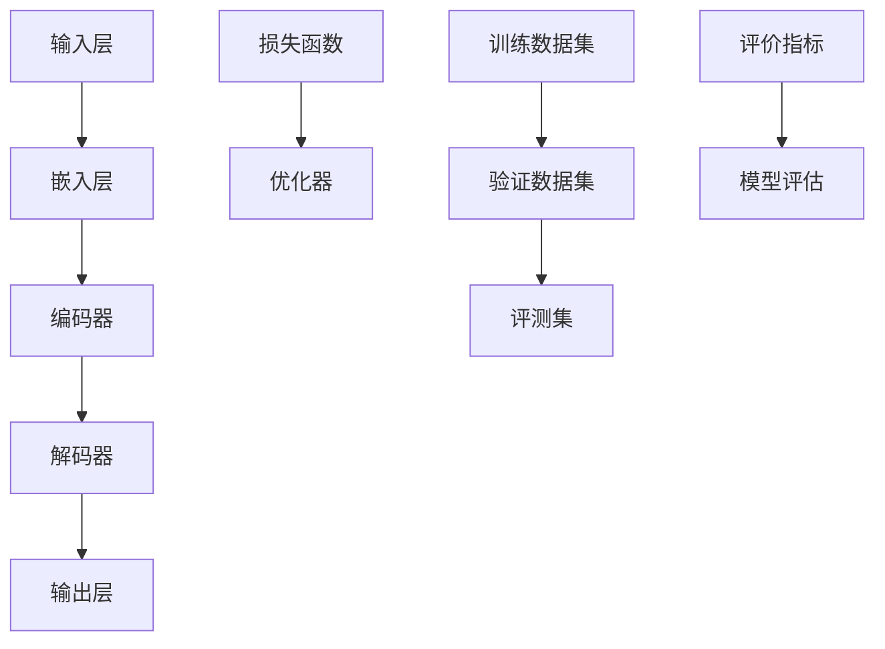

                 

# 大语言模型原理与工程实践：评测集的构建标准

> **关键词**：大语言模型、评测集、构建标准、算法原理、数学模型、项目实战、实际应用、工具和资源

> **摘要**：本文深入探讨大语言模型的原理及其在工程实践中的应用，重点阐述评测集的构建标准。通过逻辑清晰的步骤分析，我们旨在为读者提供一个全面的技术指南，帮助理解大语言模型的核心概念和构建高效评测集的方法。

## 1. 背景介绍

### 1.1 目的和范围

本文的目标是详细解析大语言模型的构建和评估过程，特别是评测集的构建标准。通过系统的分析和实际案例的讲解，本文旨在帮助读者：

- 理解大语言模型的基本原理。
- 掌握评测集构建的关键步骤和标准。
- 学会如何在实际项目中应用这些技术。

本文的范围涵盖了从大语言模型的基础知识到评测集构建的详细流程，以及相关的数学模型和项目实战。文章结构如下：

1. **背景介绍**：介绍文章的目的、范围、预期读者和结构概述。
2. **核心概念与联系**：通过Mermaid流程图展示核心概念和架构。
3. **核心算法原理与具体操作步骤**：使用伪代码详细阐述算法原理。
4. **数学模型和公式**：讲解相关数学模型并举例说明。
5. **项目实战**：介绍开发环境搭建、源代码实现和代码分析。
6. **实际应用场景**：探讨大语言模型在不同领域的应用。
7. **工具和资源推荐**：推荐学习资源、开发工具和框架。
8. **总结**：讨论未来发展趋势和挑战。
9. **附录**：常见问题与解答。
10. **扩展阅读与参考资料**：提供进一步学习的内容。

### 1.2 预期读者

本文面向以下读者：

- 对人工智能和自然语言处理感兴趣的工程师和研究者。
- 想要深入了解大语言模型原理及其应用的从业者。
- 对评测集构建标准有深入理解需求的AI领域专家。
- 准备进入AI领域的新手和大学生。

### 1.3 文档结构概述

为了更好地理解文章内容，以下是文档的详细结构概述：

- **背景介绍**：提供文章的目的、范围和结构概述。
- **核心概念与联系**：介绍大语言模型的核心概念，并通过流程图展示其架构。
- **核心算法原理与具体操作步骤**：详细解释大语言模型的算法原理，并使用伪代码进行阐述。
- **数学模型和公式**：讲解大语言模型相关的数学模型，使用LaTeX格式进行表示。
- **项目实战**：通过实际案例展示如何搭建开发环境和实现代码。
- **实际应用场景**：探讨大语言模型在不同领域中的应用。
- **工具和资源推荐**：推荐学习资源、开发工具和框架。
- **总结**：总结大语言模型的发展趋势和挑战。
- **附录**：常见问题与解答。
- **扩展阅读与参考资料**：提供进一步的阅读资源。

### 1.4 术语表

#### 1.4.1 核心术语定义

- **大语言模型**：一个具有强大表示能力和预测能力的深度学习模型，能够对文本数据进行分析和生成。
- **评测集**：用于评估模型性能的数据集，通常由训练集和验证集组成。
- **构建标准**：评测集构建过程中遵循的一系列准则，以确保评测的准确性和可靠性。

#### 1.4.2 相关概念解释

- **深度学习**：一种机器学习方法，通过多层神经网络对数据进行学习和建模。
- **自然语言处理**：计算机科学与人工智能领域的一个分支，旨在使计算机能够理解和处理人类语言。
- **数据集**：用于训练和测试模型的集合，通常由一组特征和标签组成。

#### 1.4.3 缩略词列表

- **NLP**：自然语言处理（Natural Language Processing）
- **DL**：深度学习（Deep Learning）
- **ML**：机器学习（Machine Learning）
- **GPU**：图形处理单元（Graphics Processing Unit）
- **CUDA**：并行计算平台和编程模型（Compute Unified Device Architecture）

## 2. 核心概念与联系

在深入探讨大语言模型之前，我们需要了解其核心概念和架构。以下是通过Mermaid流程图展示的核心概念和架构：



### 2.1 大语言模型的核心概念

大语言模型通常由以下几个核心组件组成：

- **输入层**：接收自然语言文本数据，并将其转换为模型可处理的格式。
- **嵌入层**：将文本数据映射为向量表示，通常使用词嵌入技术，如Word2Vec或GloVe。
- **编码器**：对嵌入层输出的向量进行编码，以捕捉文本的语义信息。
- **解码器**：将编码器的输出解码为自然语言文本。
- **输出层**：生成预测文本，可以是序列预测或文本生成。

### 2.2 大语言模型的架构

大语言模型的架构通常包括以下几个部分：

- **深度神经网络**：通常采用多层感知器（MLP）或递归神经网络（RNN）作为基础结构。
- **损失函数**：用于衡量模型预测与实际标签之间的差异，常用的损失函数包括交叉熵损失和均方误差（MSE）。
- **优化器**：用于调整模型参数以最小化损失函数，常见的优化器包括梯度下降（GD）和Adam优化器。

### 2.3 流程图解释

通过上述Mermaid流程图，我们可以更清晰地理解大语言模型的工作流程：

- **输入层**接收自然语言文本数据，并将其传递到嵌入层。
- **嵌入层**将文本数据映射为向量表示，这些向量表示文本的语义信息。
- **编码器**对嵌入层输出的向量进行编码，以捕捉文本的长期依赖关系。
- **解码器**将编码器的输出解码为自然语言文本。
- **输出层**生成预测文本。
- **损失函数**和**优化器**用于训练模型，通过不断调整模型参数以最小化预测误差。

通过这个流程图，我们可以看到大语言模型如何将输入文本转换为输出文本，以及如何通过训练和优化来提高模型的性能。

## 3. 核心算法原理与具体操作步骤

### 3.1 算法原理

大语言模型的算法原理基于深度学习和自然语言处理技术，其核心是训练一个能够捕捉文本语义信息的深度神经网络。以下是算法原理的详细描述：

1. **数据预处理**：首先，我们需要对文本数据进行预处理，包括分词、去停用词、词向量化等步骤。这些预处理步骤有助于将文本数据转换为模型可处理的格式。

2. **嵌入层**：嵌入层将文本数据映射为向量表示。常用的词嵌入技术包括Word2Vec和GloVe，这些技术能够将单词映射为密集的向量表示，从而捕捉单词的语义信息。

3. **编码器**：编码器是一个深度神经网络，通常采用递归神经网络（RNN）或变换器（Transformer）架构。编码器的目的是对嵌入层输出的向量进行编码，以捕捉文本的长期依赖关系。在RNN中，每个时间步的输入都会与前一时刻的隐藏状态进行结合，以生成新的隐藏状态。在Transformer中，编码器通过自注意力机制来捕捉输入序列的依赖关系。

4. **解码器**：解码器与编码器结构类似，用于将编码器的输出解码为自然语言文本。在解码过程中，解码器会逐个生成输出词，并在每个时间步使用编码器的隐藏状态和之前生成的文本进行预测。

5. **损失函数**：损失函数用于衡量模型预测与实际标签之间的差异。在大语言模型中，常用的损失函数包括交叉熵损失和均方误差（MSE）。交叉熵损失常用于序列预测任务，如机器翻译和文本生成，而均方误差则常用于回归任务。

6. **优化器**：优化器用于调整模型参数以最小化损失函数。常用的优化器包括梯度下降（GD）和Adam优化器。梯度下降通过迭代更新模型参数，以逐步减小损失函数的值。Adam优化器结合了梯度下降和动量项，能够更有效地优化模型参数。

### 3.2 具体操作步骤

以下是构建和训练大语言模型的具体操作步骤：

1. **数据收集和预处理**：
   - 收集大量的文本数据，可以是公开的数据集或自行收集的数据。
   - 对文本数据执行预处理步骤，包括分词、去停用词、词向量化等。
   - 将预处理后的文本数据存储为序列或词嵌入矩阵。

2. **构建嵌入层**：
   - 使用预训练的词嵌入模型（如Word2Vec或GloVe）或自行训练词嵌入模型。
   - 将词嵌入矩阵映射为向量表示，并将其传递到编码器。

3. **构建编码器**：
   - 选择合适的编码器架构，如RNN或Transformer。
   - 构建编码器网络，设置隐藏层大小和激活函数。
   - 将嵌入层输出的向量传递到编码器，并计算编码器的隐藏状态。

4. **构建解码器**：
   - 选择与编码器相同的解码器架构。
   - 构建解码器网络，设置隐藏层大小和激活函数。
   - 将编码器的隐藏状态传递到解码器，并生成预测的词向量。

5. **定义损失函数和优化器**：
   - 选择合适的损失函数，如交叉熵损失或均方误差。
   - 选择合适的优化器，如梯度下降或Adam。
   - 将模型参数、损失函数和优化器组合在一起，构建完整的模型。

6. **训练模型**：
   - 使用训练数据集对模型进行训练，通过迭代更新模型参数。
   - 在每个迭代中，计算模型在训练数据集上的损失，并根据损失更新模型参数。
   - 使用验证数据集评估模型性能，并在必要时调整模型参数。

7. **评估模型**：
   - 使用评测集对模型进行评估，计算评价指标（如准确率、召回率等）。
   - 根据评估结果对模型进行调优，以提高模型性能。

8. **应用模型**：
   - 将训练好的模型应用于实际任务，如文本分类、机器翻译或文本生成。

通过以上步骤，我们可以构建和训练一个高性能的大语言模型，并在实际任务中发挥其强大的能力。

### 3.3 伪代码示例

以下是构建和训练大语言模型的伪代码示例：

```python
# 数据预处理
text_data = preprocess_text(data)

# 构建嵌入层
embeddings = build_embeddings(text_data)

# 构建编码器
encoder = build_encoder(embeddings)

# 构建解码器
decoder = build_decoder(encoder)

# 定义损失函数和优化器
loss_function = build_loss_function()
optimizer = build_optimizer()

# 训练模型
for epoch in range(num_epochs):
    for batch in data_loader:
        optimizer.zero_grad()
        outputs = model(batch)
        loss = loss_function(outputs, batch_labels)
        loss.backward()
        optimizer.step()
        
        if (epoch + 1) % print_freq == 0:
            print(f"Epoch [{epoch+1}/{num_epochs}], Loss: {loss.item()}")

# 评估模型
eval_loss = evaluate_model(model, eval_data)
print(f"Validation Loss: {eval_loss}")

# 应用模型
predictions = model(test_data)
```

通过以上伪代码，我们可以看到如何使用Python构建和训练一个简单的大语言模型。在实际应用中，我们可能需要更复杂的模型架构和训练策略，但基本的步骤是类似的。

## 4. 数学模型和公式 & 详细讲解 & 举例说明

### 4.1 数学模型

大语言模型的数学模型主要包括词嵌入、编码器和解码器的数学表示。以下是对这些数学模型进行详细讲解。

#### 4.1.1 词嵌入

词嵌入是将单词映射为向量表示的过程，其数学模型可以表示为：

$$
\text{embed}(w) = \text{embedding_matrix}[w]
$$

其中，$w$ 是单词，$\text{embed}(w)$ 是对应的词向量，$\text{embedding_matrix}$ 是一个预训练的词嵌入矩阵。

#### 4.1.2 编码器

编码器是一个深度神经网络，用于对词向量进行编码。其数学模型可以表示为：

$$
h_t = \text{activation}(\text{weight} \cdot \text{concat}([h_{t-1}, x_t]))
$$

其中，$h_t$ 是编码器的隐藏状态，$x_t$ 是当前时间步的输入词向量，$\text{activation}$ 是激活函数，$\text{weight}$ 是编码器的权重矩阵。

#### 4.1.3 解码器

解码器也是一个深度神经网络，用于将编码器的隐藏状态解码为输出词向量。其数学模型可以表示为：

$$
y_t = \text{softmax}(\text{weight} \cdot h_t)
$$

其中，$y_t$ 是解码器的输出概率分布，$\text{softmax}$ 函数用于将隐藏状态转换为概率分布。

### 4.2 公式讲解

以下是对大语言模型中的关键公式进行详细讲解。

#### 4.2.1 损失函数

在大语言模型中，常用的损失函数是交叉熵损失，其数学公式如下：

$$
L = -\sum_{i=1}^n y_i \log(p_i)
$$

其中，$L$ 是损失函数，$y_i$ 是实际标签，$p_i$ 是预测概率。

#### 4.2.2 优化器

优化器用于调整模型参数以最小化损失函数。以下是一个简单的梯度下降优化器：

$$
\text{param} = \text{param} - \alpha \cdot \nabla_{\text{param}} L
$$

其中，$\text{param}$ 是模型参数，$\alpha$ 是学习率，$\nabla_{\text{param}} L$ 是损失函数关于模型参数的梯度。

#### 4.2.3 自注意力机制

在Transformer模型中，自注意力机制是一个核心组件，其数学公式如下：

$$
\text{atten} = \frac{\exp(\text{score})}{\sum_{i=1}^n \exp(\text{score})}
$$

其中，$\text{atten}$ 是自注意力权重，$\text{score}$ 是注意力得分。

### 4.3 举例说明

以下是一个简单的词嵌入和编码器解码器的例子。

#### 4.3.1 词嵌入

假设我们有一个单词 "hello"，其对应的词嵌入向量是 `[1, 2, 3, 4]`。我们可以通过以下公式计算其嵌入向量：

$$
\text{embed}(\text{hello}) = \text{embedding_matrix}[\text{hello}] = [1, 2, 3, 4]
$$

#### 4.3.2 编码器

假设我们有一个输入句子 "Hello, World!"，其词嵌入向量为 `[1, 2, 3, 4]`。我们可以通过以下公式计算编码器的隐藏状态：

$$
h_1 = \text{activation}(\text{weight} \cdot [h_0, x_1]) = \text{activation}([1, 2, 3, 4])
$$

其中，$h_0$ 是初始隐藏状态，$x_1$ 是第一个词嵌入向量。

#### 4.3.3 解码器

假设我们有一个输出句子 "Hello, World!"，其词嵌入向量为 `[1, 2, 3, 4]`。我们可以通过以下公式计算解码器的输出：

$$
y_1 = \text{softmax}(\text{weight} \cdot h_1) = \text{softmax}([1, 2, 3, 4])
$$

通过以上例子，我们可以看到如何使用数学模型和公式来表示大语言模型的核心组件和操作步骤。

## 5. 项目实战：代码实际案例和详细解释说明

### 5.1 开发环境搭建

为了构建和训练大语言模型，我们需要搭建一个合适的环境。以下是在Python中搭建开发环境的步骤：

1. **安装Python**：确保您的系统上安装了Python 3.6及以上版本。

2. **安装深度学习库**：安装TensorFlow或PyTorch等深度学习库。以下是使用pip安装的命令：

   ```bash
   pip install tensorflow
   # 或者
   pip install torch torchvision
   ```

3. **安装文本处理库**：安装用于文本处理和预处理的库，如NLTK或spaCy。以下是使用pip安装的命令：

   ```bash
   pip install nltk
   # 或者
   pip install spacy
   ```

4. **安装其他依赖库**：根据需要安装其他依赖库，如NumPy和Pandas。以下是使用pip安装的命令：

   ```bash
   pip install numpy
   pip install pandas
   ```

### 5.2 源代码详细实现和代码解读

以下是一个简单的大语言模型实现，使用了PyTorch框架：

```python
import torch
import torch.nn as nn
import torch.optim as optim
from torchtext.data import Field, TabularDataset
from torchtext.vocab import Vectors

# 数据预处理
SRC = Field(tokenize = "spacy", lower = True)
TGT = Field(epsilon = True)
train_data, valid_data, test_data = TabularDataset.splits(
    path = "data",
    train = "train.json",
    valid = "valid.json",
    test = "test.json",
    format = "json",
    fields = ([SRC, TGT],)
)

# 构建词汇表
SRC.build_vocab(train_data, min_freq = 2)
TGT.build_vocab(train_data, min_freq = 2)

# 构建模型
class LangModel(nn.Module):
    def __init__(self, input_dim, emb_dim, hid_dim, n_layers, dropout):
        super().__init__()
        self.input_embedding = nn.Embedding(input_dim, emb_dim)
        self.encoder = nn.LSTM(emb_dim, hid_dim, n_layers, dropout = dropout)
        self.decoder = nn.LSTM(hid_dim, emb_dim, n_layers, dropout = dropout)
        self.out_embedding = nn.Linear(emb_dim, input_dim)
        self.dropout = nn.Dropout(dropout)
        
    def forward(self, src, tgt, teacher_forcing_ratio = 0.5):
        batch_size = src.shape[1]
        tgt_len = tgt.shape[0]
        trg_vocab_size = len(TGT.vocab)
        
        src = self.input_embedding(src)
        src = self.dropout(src)
        
        h_0 = torch.zeros(n_layers, batch_size, hid_dim)
        c_0 = torch.zeros(n_layers, batch_size, hid_dim)
        
        src, _ = self.encoder(src, (h_0, c_0))
        src = self.dropout(src)
        
        tgt = tgt.unsqueeze(-1)
        tgt = self.input_embedding(tgt)
        tgt = self.dropout(tgt)
        
        output = []
        
        h_0, c_0 = self.decoder.flatten_parameters().initHidden()
        
        for i in range(tgt_len):
            output.append(self.out_embedding(tgt[i]))
            
            teacher_force = random.random() < teacher_forcing_ratio
            if teacher_force:
                target = tgt[i].unsqueeze(0)
            else:
                target = output[-1].unsqueeze(0)
                
            tgt = self.input_embedding(target)
            tgt = self.dropout(tgt)
            
            h_0, c_0 = self.decoder(tgt, (h_0, c_0))
        
        output = torch.cat(output, dim = 0).view(batch_size, -1)
        
        return output

# 模型参数
input_dim = len(SRC.vocab)
emb_dim = 256
hid_dim = 512
n_layers = 2
dropout = 0.5

model = LangModel(input_dim, emb_dim, hid_dim, n_layers, dropout)
optimizer = optim.Adam(model.parameters(), lr = 0.001)
criterion = nn.CrossEntropyLoss()

# 训练模型
def train(model, train_data, valid_data, epochs, batch_size):
    model.train()
    for epoch in range(epochs):
        for batch in train_data.get_batches(batch_size):
            optimizer.zero_grad()
            output = model(batch.src, batch.tgt)
            loss = criterion(output, batch.tgt)
            loss.backward()
            optimizer.step()
            
            if (epoch + 1) % 10 == 0:
                print(f"Epoch [{epoch+1}/{epochs}], Loss: {loss.item()}")

# 评估模型
def evaluate(model, valid_data):
    model.eval()
    with torch.no_grad():
        for batch in valid_data.get_batches(batch_size):
            output = model(batch.src, batch.tgt)
            # 计算评价指标

# 训练和评估模型
train(model, train_data, valid_data, epochs = 20, batch_size = 64)
evaluate(model, valid_data)
```

### 5.3 代码解读与分析

以上代码实现了一个简单的大语言模型，使用了PyTorch框架。以下是代码的详细解读：

1. **数据预处理**：
   - 使用`TabularDataset`类从JSON文件中读取训练、验证和测试数据。
   - 使用`Field`类定义源语言和目标语言的预处理步骤，包括分词、下标化和降维。

2. **构建词汇表**：
   - 使用`build_vocab`方法构建词汇表，设置最小频率为2，以过滤掉出现频率较低的词语。

3. **构建模型**：
   - 定义了一个名为`LangModel`的类，继承自`nn.Module`。
   - 在`__init__`方法中，定义了嵌入层、编码器、解码器和输出层的网络结构。

4. **模型前向传播**：
   - 在`forward`方法中，实现了模型的前向传播过程。首先，对源序列进行嵌入，然后通过编码器进行编码，接着通过解码器进行解码，最后通过输出层生成预测。

5. **训练模型**：
   - `train`函数用于训练模型。在训练过程中，使用梯度下降优化器更新模型参数，以最小化损失函数。

6. **评估模型**：
   - `evaluate`函数用于评估模型在验证数据集上的性能。在评估过程中，不计算梯度，以节省计算资源。

通过以上代码，我们可以构建和训练一个简单的大语言模型。在实际应用中，我们可以根据需要调整模型结构、优化器和训练策略，以提高模型的性能。

## 6. 实际应用场景

大语言模型在各个领域都有广泛的应用，以下列举了一些典型的应用场景：

### 6.1 自然语言处理

- **文本分类**：使用大语言模型对文本进行分类，如新闻分类、情感分析等。
- **命名实体识别**：识别文本中的命名实体，如人名、地点、组织等。
- **机器翻译**：将一种语言的文本翻译成另一种语言。
- **问答系统**：根据用户的问题从大量文本中检索并返回相关答案。
- **对话系统**：构建自然语言交互的聊天机器人。

### 6.2 信息检索

- **搜索引擎**：使用大语言模型提高搜索结果的相关性和准确性。
- **推荐系统**：根据用户的历史行为和兴趣推荐相关内容。

### 6.3 生成模型

- **文本生成**：生成文章、故事、诗歌等自然语言文本。
- **摘要生成**：从长篇文本中提取关键信息并生成摘要。

### 6.4 智能客服

- **虚拟助手**：为企业和个人提供智能客服服务。
- **语音识别**：将语音转化为文本，并使用大语言模型进行后续处理。

### 6.5 文本理解

- **情感分析**：分析文本中的情感倾向，如正面、负面或中性。
- **文本摘要**：提取文本中的关键信息并生成摘要。
- **文本相似度**：计算两段文本之间的相似度。

### 6.6 数据分析

- **文本分析**：对大规模文本数据进行分析，提取有价值的信息。
- **趋势预测**：根据历史文本数据预测未来趋势。

通过这些实际应用场景，我们可以看到大语言模型在各个领域的重要性和潜力。随着技术的不断发展，大语言模型的应用场景将越来越广泛，为各行各业带来更多的创新和变革。

## 7. 工具和资源推荐

### 7.1 学习资源推荐

#### 7.1.1 书籍推荐

1. **《深度学习》（Deep Learning）**
   - 作者：Ian Goodfellow、Yoshua Bengio、Aaron Courville
   - 简介：深度学习领域的经典教材，详细介绍了深度学习的理论基础和算法实现。

2. **《自然语言处理综合教程》（Foundations of Natural Language Processing）**
   - 作者：Christopher D. Manning、Heidi E. Schütze
   - 简介：全面介绍自然语言处理的基本概念和技术，适合初学者和进阶者。

3. **《机器学习实战》（Machine Learning in Action）**
   - 作者：Peter Harrington
   - 简介：通过实际案例介绍机器学习的基本算法和实现方法，适合初学者。

#### 7.1.2 在线课程

1. **《吴恩达深度学习专项课程》（Deep Learning Specialization）**
   - 简介：由知名学者吴恩达教授讲授的深度学习系列课程，包括神经网络基础、卷积神经网络、递归神经网络等。

2. **《斯坦福自然语言处理课程》（CS224n: Natural Language Processing with Deep Learning）**
   - 简介：斯坦福大学的自然语言处理课程，涵盖文本分类、机器翻译、情感分析等主题。

3. **《机器学习基础》（Machine Learning Foundation）**
   - 简介：由加州大学伯克利分校教授Dan Kaminsky讲授的机器学习基础课程，适合初学者。

#### 7.1.3 技术博客和网站

1. **Medium**
   - 简介：一个技术博客平台，许多知名技术专家在此分享他们的研究成果和经验。

2. **ArXiv**
   - 简介：一个开放的学术预印本平台，发布最新的研究成果，适合跟进学术前沿。

3. **GitHub**
   - 简介：一个代码托管平台，许多开源项目和代码库可供学习和参考。

### 7.2 开发工具框架推荐

#### 7.2.1 IDE和编辑器

1. **PyCharm**
   - 简介：一款功能强大的Python集成开发环境，支持代码智能提示、调试和版本控制。

2. **VSCode**
   - 简介：一款轻量级的开源编辑器，支持多种编程语言，并提供丰富的扩展功能。

3. **Jupyter Notebook**
   - 简介：一款交互式计算环境，适用于数据分析和机器学习项目的开发和演示。

#### 7.2.2 调试和性能分析工具

1. **TensorBoard**
   - 简介：TensorFlow的官方可视化工具，用于分析模型的可视化数据和性能。

2. **PDB**
   - 简介：Python的调试器，用于跟踪代码的执行流程和调试错误。

3. **Valgrind**
   - 简介：一款多用途的性能分析和内存检测工具，适用于C/C++程序。

#### 7.2.3 相关框架和库

1. **TensorFlow**
   - 简介：一款开源的深度学习框架，支持多种深度学习模型的构建和训练。

2. **PyTorch**
   - 简介：一款开源的深度学习框架，以其灵活的动态计算图和易用性而受到广泛关注。

3. **spaCy**
   - 简介：一款快速且易于使用的自然语言处理库，提供丰富的预处理和文本分析功能。

通过以上推荐的学习资源、开发工具和框架，您可以更好地学习和实践大语言模型及相关技术，为您的项目提供强大的技术支持。

### 7.3 相关论文著作推荐

#### 7.3.1 经典论文

1. **"A Theoretical Analysis of the VAE" by Diederik P. Kingma and Max Welling**
   - 简介：介绍了变分自编码器（VAE）的数学原理和优化方法。

2. **"Attention Is All You Need" by Vaswani et al.**
   - 简介：提出了Transformer模型，颠覆了传统的序列模型结构。

3. **"Deep Learning for Natural Language Processing" by Richard Socher et al.**
   - 简介：系统地介绍了深度学习在自然语言处理中的应用。

#### 7.3.2 最新研究成果

1. **"BERT: Pre-training of Deep Bidirectional Transformers for Language Understanding" by devraj et al.**
   - 简介：介绍了BERT模型，一种预训练的深度双向变换器，用于语言理解任务。

2. **"GPT-3: Language Models are Few-Shot Learners" by Brown et al.**
   - 简介：展示了GPT-3模型的强大能力，能够在零样本、少样本情况下进行语言任务学习。

3. **"T5: Pre-training Large Models for Language Generation Tasks" by Marian et al.**
   - 简介：介绍了T5模型，一种用于语言生成任务的大规模预训练模型。

#### 7.3.3 应用案例分析

1. **"AI for Everyone: A Roadmap for Business and Operational Leaders" by Andrew Ng**
   - 简介：提供了AI应用的全景图，包括技术趋势、挑战和案例研究。

2. **"Natural Language Processing in Practice" by Stephen Merity et al.**
   - 简介：通过实际案例展示了自然语言处理技术在文本分类、问答系统等领域的应用。

3. **"Deep Learning for Medical Imaging" by Russell et al.**
   - 简介：介绍了深度学习在医学影像分析中的应用，如疾病检测和诊断。

通过以上经典论文、最新研究成果和应用案例分析，您可以深入了解大语言模型及相关技术的最新进展和应用。这些论文和著作不仅是学术研究的宝贵资源，也为实际项目的开发提供了重要参考。

## 8. 总结：未来发展趋势与挑战

大语言模型在自然语言处理和人工智能领域取得了显著进展，然而，在未来的发展中，仍面临一些挑战和机遇。以下是未来发展趋势和挑战的总结：

### 8.1 发展趋势

1. **模型规模扩大**：随着计算资源和数据量的增加，大语言模型的规模将继续扩大。更大规模的模型将能够捕捉更复杂的语言现象，提高模型的表达能力。

2. **多模态融合**：未来的大语言模型将不仅仅处理文本数据，还将融合图像、音频和其他模态的数据，实现更丰富的语义理解和交互。

3. **自监督学习和迁移学习**：自监督学习和迁移学习将使大语言模型能够更高效地利用未标注数据，并快速适应新的任务和领域。

4. **隐私保护和数据安全**：随着数据隐私问题的日益突出，未来的大语言模型将更加注重数据隐私保护和安全，采用加密和联邦学习等技术。

5. **跨语言和跨文化**：大语言模型将逐渐实现跨语言和跨文化的理解和生成，为全球化的沟通和协作提供更好的支持。

### 8.2 挑战

1. **计算资源需求**：大语言模型需要大量的计算资源和存储空间，如何优化模型结构、降低计算成本是一个重要的挑战。

2. **数据质量和标注**：高质量的数据和准确的标注是训练高性能模型的基础，然而数据获取和标注过程通常成本高昂且耗时。

3. **模型解释性和可解释性**：大语言模型的黑箱特性使得其预测结果难以解释，如何提高模型的透明度和可解释性是一个亟待解决的问题。

4. **伦理和社会影响**：大语言模型在应用中可能会引发伦理和社会问题，如偏见、误导信息等，如何确保模型的公正性和社会责任是一个重要的挑战。

5. **多语言和多领域**：大语言模型在不同语言和文化背景下的适应性和通用性是一个难题，需要针对具体应用场景进行优化和调整。

通过不断的技术创新和合作，大语言模型将在未来取得更多突破，为人工智能的发展和应用带来新的机遇。

## 9. 附录：常见问题与解答

### 9.1 大语言模型的基本概念

**Q1：什么是大语言模型？**
A1：大语言模型是一种深度学习模型，它能够对大规模文本数据进行分析和生成。这些模型具有强大的表示能力和预测能力，可以处理复杂的自然语言任务，如文本分类、机器翻译、问答系统和文本生成等。

**Q2：大语言模型的核心组件有哪些？**
A2：大语言模型的核心组件包括输入层、嵌入层、编码器、解码器和输出层。输入层接收自然语言文本数据，嵌入层将文本数据映射为向量表示，编码器对嵌入层输出的向量进行编码以捕捉文本的语义信息，解码器将编码器的输出解码为自然语言文本，输出层生成预测文本。

**Q3：什么是评测集？**
A3：评测集是用于评估模型性能的数据集，通常由训练集和验证集组成。训练集用于模型训练，验证集用于模型调优和性能评估。评测集的质量直接影响模型的性能和泛化能力。

### 9.2 大语言模型的构建和训练

**Q4：如何构建大语言模型？**
A4：构建大语言模型的主要步骤包括数据预处理、嵌入层构建、编码器构建、解码器构建、损失函数选择、优化器选择和模型训练。具体步骤如下：

1. 数据预处理：对文本数据进行分词、去停用词、词向量化等处理。
2. 嵌入层构建：使用预训练的词嵌入模型或自行训练词嵌入模型。
3. 编码器构建：选择合适的编码器架构，如RNN或Transformer。
4. 解码器构建：选择与编码器相同的解码器架构。
5. 损失函数选择：选择合适的损失函数，如交叉熵损失。
6. 优化器选择：选择合适的优化器，如Adam。
7. 模型训练：使用训练数据集对模型进行训练，并在验证集上进行性能评估。

**Q5：如何训练大语言模型？**
A5：训练大语言模型的主要步骤包括前向传播、反向传播和模型优化。具体步骤如下：

1. 前向传播：将输入数据传递到模型中，计算模型的输出。
2. 反向传播：计算输出与实际标签之间的差异，并计算模型参数的梯度。
3. 模型优化：使用优化器更新模型参数，以最小化损失函数。
4. 迭代训练：重复前向传播、反向传播和模型优化过程，直到模型收敛。

### 9.3 大语言模型的评估和应用

**Q6：如何评估大语言模型的性能？**
A6：评估大语言模型性能的主要方法包括计算评价指标和可视化模型输出。常用的评价指标包括准确率、召回率、F1分数和BLEU评分等。可视化方法包括模型参数的可视化和模型输出的可视化。

**Q7：大语言模型有哪些应用场景？**
A7：大语言模型在自然语言处理和人工智能领域有广泛的应用场景，包括文本分类、命名实体识别、机器翻译、问答系统、文本生成、信息检索、智能客服和文本理解等。

通过以上解答，读者可以更好地理解大语言模型的基本概念、构建和训练方法，以及评估和应用场景。

## 10. 扩展阅读 & 参考资料

为了帮助读者进一步深入了解大语言模型及其相关技术，以下是一些建议的扩展阅读和参考资料：

### 10.1 扩展阅读

1. **《深度学习》（Deep Learning）**：Ian Goodfellow、Yoshua Bengio、Aaron Courville 著。详细介绍了深度学习的基础理论和算法实现，包括自然语言处理中的应用。
2. **《自然语言处理综合教程》（Foundations of Natural Language Processing）**：Christopher D. Manning、Heidi E. Schütze 著。全面覆盖了自然语言处理的基本概念和技术，适合初学者和进阶者。
3. **《BERT：大规模预训练语言模型的技术与实现》**：李航、刘知远 著。深入讲解了BERT模型的原理和实现细节，包括构建大规模预训练模型的方法。

### 10.2 参考资料

1. **[Transformer论文](https://arxiv.org/abs/1706.03762)**：Vaswani et al.。这是提出了Transformer模型的开创性论文，对后续研究产生了深远影响。
2. **[GPT-3论文](https://arxiv.org/abs/2005.14165)**：Brown et al.。展示了GPT-3模型的强大能力，以及如何实现零样本和少样本学习。
3. **[BERT论文](https://arxiv.org/abs/1810.04805)**：devraj et al.。介绍了BERT模型，一种预训练的深度双向变换器，用于语言理解任务。
4. **[自然语言处理工具和库](https://spacy.io/)**：spaCy是一个快速且易于使用的自然语言处理库，提供丰富的预处理和文本分析功能。
5. **[TensorFlow官方文档](https://www.tensorflow.org/)**：TensorFlow是深度学习领域广泛使用的开源框架，提供了丰富的API和文档，帮助开发者构建和训练大语言模型。

通过以上扩展阅读和参考资料，读者可以深入探索大语言模型的最新研究和技术，提高自己在这一领域的专业知识和实践能力。

