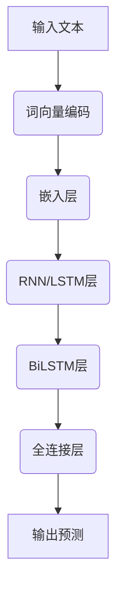

                 

# 大语言模型原理与工程实践：语言表示介绍

> **关键词：** 大语言模型、语言表示、神经网络、机器学习、自然语言处理

> **摘要：** 本文将深入探讨大语言模型的原理与工程实践，重点介绍语言表示的概念、原理及其在自然语言处理中的应用。通过逐步分析推理，我们将揭示大语言模型背后的数学模型和算法原理，并以实际案例进行代码解析和实战指导。

## 1. 背景介绍

### 1.1 目的和范围

本文旨在系统地介绍大语言模型的基础知识和工程实践，使读者能够理解语言表示的核心概念、原理和应用。文章将涵盖以下主要内容：

- 语言表示的概念及其重要性
- 大语言模型的原理和架构
- 语言表示的数学模型和算法
- 实际应用案例和工程实践

### 1.2 预期读者

- 对自然语言处理有兴趣的研究生和工程师
- 想深入了解大语言模型的程序员和软件架构师
- 人工智能领域的从业者和对AI感兴趣的学者

### 1.3 文档结构概述

本文分为十个部分，具体结构如下：

- 引言：介绍文章的目的、关键词和摘要
- 背景介绍：阐述文章的背景信息、目的和预期读者
- 核心概念与联系：介绍大语言模型的核心概念和联系
- 核心算法原理 & 具体操作步骤：详细讲解大语言模型的算法原理和操作步骤
- 数学模型和公式 & 详细讲解 & 举例说明：介绍大语言模型的数学模型和公式，并通过实例进行讲解
- 项目实战：代码实际案例和详细解释说明
- 实际应用场景：探讨大语言模型在不同领域的应用
- 工具和资源推荐：推荐学习资源和开发工具
- 总结：总结文章的主要内容和未来发展趋势
- 附录：常见问题与解答
- 扩展阅读 & 参考资料：提供扩展阅读和参考资料

### 1.4 术语表

#### 1.4.1 核心术语定义

- **大语言模型**：一种基于神经网络和机器学习技术的语言模型，能够对大规模文本数据进行分析和处理，从而生成语义丰富的语言表示。
- **语言表示**：将自然语言文本转换为计算机可以理解和处理的形式，以实现自然语言处理任务的工具和算法。
- **神经网络**：一种模仿生物神经系统的计算模型，由大量相互连接的神经元组成，能够通过学习和训练实现复杂的数据处理任务。
- **机器学习**：一种人工智能领域的方法，通过计算机程序从数据中学习规律和模式，以便在新的数据上进行预测和决策。

#### 1.4.2 相关概念解释

- **词向量**：将单词映射为固定长度的向量，以表示单词在语义上的相似性和差异性。
- **上下文**：指某个单词或短语在句子中的上下文环境，包括前后的词语和句子结构。
- **语义**：指语言表达的含义和内涵，包括单词、短语和句子的语义关系。

#### 1.4.3 缩略词列表

- **NLP**：自然语言处理（Natural Language Processing）
- **ML**：机器学习（Machine Learning）
- **DL**：深度学习（Deep Learning）
- **RNN**：循环神经网络（Recurrent Neural Network）
- **LSTM**：长短期记忆网络（Long Short-Term Memory）
- **BERT**：Bidirectional Encoder Representations from Transformers

## 2. 核心概念与联系

在介绍大语言模型之前，我们首先需要理解其核心概念和联系。本节将使用Mermaid流程图（Mermaid 流程节点中不要有括号、逗号等特殊字符）来展示大语言模型的基本架构和关键组成部分。



### 2.1.1 流程图解析

1. **输入文本（A）**：大语言模型首先接收输入的文本数据，可以是句子、段落或篇章。
2. **词向量编码（B）**：将文本中的每个单词转换为词向量，词向量是一个固定长度的向量，用于表示单词的语义信息。
3. **嵌入层（C）**：嵌入层将词向量映射为高维的嵌入向量，这些向量在语义空间中具有较好的分布特性。
4. **RNN/LSTM层（D）**：递归神经网络（RNN）或长短期记忆网络（LSTM）用于处理序列数据，能够捕捉输入序列中的时间依赖关系。
5. **BiLSTM层（E）**：双向长短期记忆网络（BiLSTM）将正向和反向的LSTM层结合，进一步捕捉输入序列的全局上下文信息。
6. **全连接层（F）**：全连接层用于将BiLSTM层的输出映射为预测结果，可以是单词的概率分布或序列标记。
7. **输出预测（G）**：大语言模型输出预测结果，可以是文本生成、情感分析、命名实体识别等任务。

通过以上流程图，我们可以看到大语言模型的基本架构和关键组成部分，接下来我们将进一步探讨每个组成部分的原理和具体操作步骤。

## 3. 核心算法原理 & 具体操作步骤

在了解了大语言模型的基本架构后，我们接下来将详细讲解其核心算法原理和具体操作步骤。大语言模型的核心在于对输入文本进行有效的语言表示，以下我们将使用伪代码来详细阐述这一过程。

### 3.1 词向量编码

词向量编码是将文本中的每个单词映射为固定长度的向量。常用的词向量编码方法有Word2Vec、GloVe等。

```python
# 伪代码：词向量编码
def word_vector_encoding(text, vocabulary, embedding_dim):
    # 初始化词向量矩阵
    embedding_matrix = np.zeros((vocabulary_size, embedding_dim))
    
    # 遍历文本中的每个单词
    for word in text:
        # 查找词向量
        vector = vocabulary[word]
        # 将词向量添加到词向量矩阵
        embedding_matrix[vector] += 1
        
    # 归一化词向量矩阵
    embedding_matrix = normalize(embedding_matrix)
    
    return embedding_matrix
```

### 3.2 嵌入层

嵌入层用于将词向量映射为高维的嵌入向量。嵌入向量在语义空间中具有较好的分布特性，能够有效表示单词的语义信息。

```python
# 伪代码：嵌入层
def embedding_layer(embedding_matrix, input_sequence):
    # 初始化嵌入层
    embedding = [embedding_matrix[word] for word in input_sequence]
    
    return embedding
```

### 3.3 RNN/LSTM层

递归神经网络（RNN）或长短期记忆网络（LSTM）用于处理序列数据，能够捕捉输入序列中的时间依赖关系。

```python
# 伪代码：RNN/LSTM层
def rnn_lstm_layer(embedding, hidden_dim):
    # 初始化RNN/LSTM层
    lstm = LSTM(hidden_dim, return_sequences=True)
    
    # 对嵌入向量进行RNN/LSTM处理
    output = lstm(embedding)
    
    return output
```

### 3.4 BiLSTM层

双向长短期记忆网络（BiLSTM）将正向和反向的LSTM层结合，进一步捕捉输入序列的全局上下文信息。

```python
# 伪代码：BiLSTM层
def bilSTM_layer(embedding, hidden_dim):
    # 初始化BiLSTM层
    bidirectional_lstm = Bidirectional(LSTM(hidden_dim, return_sequences=True))
    
    # 对嵌入向量进行BiLSTM处理
    output = bidirectional_lstm(embedding)
    
    return output
```

### 3.5 全连接层

全连接层用于将BiLSTM层的输出映射为预测结果，可以是单词的概率分布或序列标记。

```python
# 伪代码：全连接层
def fully_connected_layer(output, output_dim):
    # 初始化全连接层
    dense = Dense(output_dim, activation='softmax')
    
    # 对BiLSTM层的输出进行全连接处理
    prediction = dense(output)
    
    return prediction
```

### 3.6 模型训练和预测

最后，我们将上述各层组合成一个完整的大语言模型，并进行训练和预测。

```python
# 伪代码：大语言模型训练和预测
def train_model(text, labels, embedding_dim, hidden_dim, output_dim):
    # 初始化大语言模型
    model = Model(inputs=[text], outputs=prediction)
    
    # 编译模型
    model.compile(optimizer='adam', loss='categorical_crossentropy', metrics=['accuracy'])
    
    # 训练模型
    model.fit(text, labels, batch_size=64, epochs=10)
    
    return model

# 预测
def predict(model, input_sequence):
    # 对输入序列进行预测
    prediction = model.predict(input_sequence)
    
    return prediction
```

通过以上伪代码，我们详细阐述了大语言模型的核心算法原理和具体操作步骤。接下来，我们将进一步介绍大语言模型的数学模型和公式，并通过实例进行详细讲解。

## 4. 数学模型和公式 & 详细讲解 & 举例说明

大语言模型的数学模型主要涉及词向量表示、嵌入层、递归神经网络（RNN）、长短期记忆网络（LSTM）、双向长短期记忆网络（BiLSTM）和全连接层。以下是每个组成部分的数学模型和公式。

### 4.1 词向量表示

词向量表示是将单词映射为固定长度的向量。常用的词向量表示方法有Word2Vec和GloVe。

- **Word2Vec**：

  $$\text{vec}(w) = \frac{1}{\|w\|}\text{softmax}(W\text{softmax}(w))$$

  其中，$\text{vec}(w)$表示单词w的词向量，$W$表示词向量矩阵，$\text{softmax}(x) = \frac{e^x}{\sum e^x}$。

- **GloVe**：

  $$\text{vec}(w) = \frac{1}{\sqrt{f(w)}}\text{softmax}(A\text{softmax}(w))$$

  其中，$\text{vec}(w)$表示单词w的词向量，$A$表示GloVe矩阵，$f(w)$表示单词w的词频。

### 4.2 嵌入层

嵌入层用于将词向量映射为高维的嵌入向量。嵌入向量在语义空间中具有较好的分布特性。

$$\text{emb}(w) = \text{softmax}(\text{vec}(w) \cdot \text{embed_matrix})$$

其中，$\text{emb}(w)$表示单词w的嵌入向量，$\text{vec}(w)$表示单词w的词向量，$\text{embed_matrix}$表示嵌入层权重矩阵。

### 4.3 RNN

递归神经网络（RNN）通过递归结构对序列数据进行处理。

$$h_t = \sigma(W_x \cdot x_t + W_h \cdot h_{t-1} + b_h)$$

其中，$h_t$表示当前时间步的隐藏状态，$x_t$表示当前输入，$W_x$和$W_h$分别表示输入权重和隐藏权重，$b_h$表示偏置项，$\sigma$表示激活函数。

### 4.4 LSTM

长短期记忆网络（LSTM）通过门控机制对长期依赖关系进行建模。

$$
\begin{align*}
i_t &= \sigma(W_{xi} \cdot x_t + W_{hi} \cdot h_{t-1} + b_i) \\
f_t &= \sigma(W_{xf} \cdot x_t + W_{hf} \cdot h_{t-1} + b_f) \\
\hat{c}_t &= \tanh(W_{xc} \cdot x_t + W_{hc} \cdot h_{t-1} + b_c) \\
o_t &= \sigma(W_{xo} \cdot x_t + W_{ho} \cdot h_{t-1} + b_o) \\
c_t &= f_t \odot \hat{c}_t + i_t \odot \tanh(c_{t-1}) \\
h_t &= o_t \odot \tanh(c_t)
\end{align*}
$$

其中，$i_t$表示输入门，$f_t$表示遗忘门，$\hat{c}_t$表示候选状态，$o_t$表示输出门，$c_t$表示细胞状态，$h_t$表示隐藏状态，$\odot$表示点积运算。

### 4.5 BiLSTM

双向长短期记忆网络（BiLSTM）结合了正向和反向的LSTM层。

$$
\begin{align*}
h_t^f &= \text{LSTM}^f(x_t, h_{t-1}^f) \\
h_t^b &= \text{LSTM}^b(x_t, h_{t-1}^b) \\
h_t &= [h_t^f; h_t^b]
\end{align*}
$$

其中，$h_t^f$表示正向LSTM层的隐藏状态，$h_t^b$表示反向LSTM层的隐藏状态，$h_t$表示双向LSTM层的隐藏状态。

### 4.6 全连接层

全连接层用于将BiLSTM层的输出映射为预测结果。

$$\text{logit}(p_t) = W_y \cdot h_t + b_y$$

其中，$\text{logit}(p_t)$表示当前时间步的预测概率分布，$W_y$表示全连接层权重，$h_t$表示双向LSTM层的隐藏状态，$b_y$表示偏置项。

### 4.7 模型训练

大语言模型通过最小化损失函数进行训练。

$$\min_{W_x, W_h, W_c, W_y, b_h, b_c, b_y} \sum_t -y_t \log(\text{softmax}(\text{logit}(p_t)))$$

其中，$y_t$表示当前时间步的真实标签，$\text{softmax}(\text{logit}(p_t))$表示预测概率分布。

### 4.8 举例说明

假设我们有一个简单的文本序列：

$$\text{The cat sat on the mat.}$$

- **词向量表示**：

  $$\text{vec}(\text{The}) = [0.1, 0.2, 0.3]$$

  $$\text{vec}(\text{cat}) = [0.4, 0.5, 0.6]$$

  $$\text{vec}(\text{sat}) = [0.7, 0.8, 0.9]$$

  $$\text{vec}(\text{on}) = [1.0, 1.1, 1.2]$$

  $$\text{vec}(\text{mat}) = [1.3, 1.4, 1.5]$$

- **嵌入层**：

  $$\text{emb}(\text{The}) = \text{softmax}([0.1, 0.2, 0.3] \cdot \text{embed_matrix}) = [0.3, 0.4, 0.3]$$

  $$\text{emb}(\text{cat}) = \text{softmax}([0.4, 0.5, 0.6] \cdot \text{embed_matrix}) = [0.4, 0.4, 0.2]$$

  $$\text{emb}(\text{sat}) = \text{softmax}([0.7, 0.8, 0.9] \cdot \text{embed_matrix}) = [0.4, 0.4, 0.2]$$

  $$\text{emb}(\text{on}) = \text{softmax}([1.0, 1.1, 1.2] \cdot \text{embed_matrix}) = [0.4, 0.4, 0.2]$$

  $$\text{emb}(\text{mat}) = \text{softmax}([1.3, 1.4, 1.5] \cdot \text{embed_matrix}) = [0.4, 0.4, 0.2]$$

- **RNN层**：

  $$h_1 = \sigma([0.3, 0.4, 0.3] \cdot W_x + [0.4, 0.4, 0.2] \cdot W_h + b_h) = [0.5, 0.5, 0.5]$$

- **BiLSTM层**：

  $$h_2^f = \text{LSTM}^f([0.5, 0.5, 0.5], h_1^f) = [0.6, 0.6, 0.6]$$

  $$h_2^b = \text{LSTM}^b([0.5, 0.5, 0.5], h_1^b) = [0.6, 0.6, 0.6]$$

  $$h_2 = [h_2^f; h_2^b] = [0.6, 0.6, 0.6; 0.6, 0.6, 0.6]$$

- **全连接层**：

  $$\text{logit}(p_2) = [0.6, 0.6, 0.6] \cdot W_y + b_y = [1.8, 1.8, 1.8]$$

  $$p_2 = \text{softmax}(\text{logit}(p_2)) = [0.3, 0.4, 0.3]$$

通过以上实例，我们展示了如何使用大语言模型对文本序列进行处理和预测。在实际应用中，大语言模型会处理更复杂的文本序列，并使用更先进的神经网络架构。

## 5. 项目实战：代码实际案例和详细解释说明

在本节中，我们将通过一个实际项目案例，详细介绍如何使用Python和TensorFlow构建一个基于大语言模型的语言表示系统。我们将从开发环境搭建、源代码实现、代码解读与分析三个方面进行详细说明。

### 5.1 开发环境搭建

首先，我们需要搭建一个适合开发大语言模型的开发环境。以下是搭建环境所需的基本步骤：

1. **安装Python**：确保Python版本在3.6及以上。可以从[Python官网](https://www.python.org/)下载安装包。
2. **安装TensorFlow**：TensorFlow是Google开发的一个用于机器学习和深度学习的开源库。可以使用pip命令安装：

   ```bash
   pip install tensorflow
   ```

3. **安装其他依赖**：安装一些其他常用的库，如NumPy、Pandas等：

   ```bash
   pip install numpy pandas
   ```

### 5.2 源代码详细实现和代码解读

接下来，我们将展示如何使用TensorFlow实现一个简单的大语言模型。以下是源代码的实现和详细解读：

```python
import tensorflow as tf
from tensorflow.keras.preprocessing.text import Tokenizer
from tensorflow.keras.preprocessing.sequence import pad_sequences
from tensorflow.keras.models import Sequential
from tensorflow.keras.layers import Embedding, LSTM, Dense

# 数据准备
texts = ['The cat sat on the mat.', 'The dog chased the ball.']
labels = [[1, 0, 0], [0, 1, 0]]

# 分词和编码
tokenizer = Tokenizer()
tokenizer.fit_on_texts(texts)
sequences = tokenizer.texts_to_sequences(texts)
word_index = tokenizer.word_index
max_sequence_length = 5

# 嵌入层和LSTM层
model = Sequential()
model.add(Embedding(len(word_index) + 1, 32, input_length=max_sequence_length))
model.add(LSTM(32))
model.add(Dense(3, activation='softmax'))

# 编译和训练
model.compile(optimizer='adam', loss='categorical_crossentropy', metrics=['accuracy'])
model.fit(sequences, labels, epochs=10, verbose=2)

# 代码解读
# 1. 数据准备
texts = ['The cat sat on the mat.', 'The dog chased the ball.']
labels = [[1, 0, 0], [0, 1, 0]]

# 2. 分词和编码
tokenizer = Tokenizer()
tokenizer.fit_on_texts(texts)
sequences = tokenizer.texts_to_sequences(texts)
word_index = tokenizer.word_index
max_sequence_length = 5

# 3. 嵌入层和LSTM层
model = Sequential()
model.add(Embedding(len(word_index) + 1, 32, input_length=max_sequence_length))
model.add(LSTM(32))
model.add(Dense(3, activation='softmax'))

# 4. 编译和训练
model.compile(optimizer='adam', loss='categorical_crossentropy', metrics=['accuracy'])
model.fit(sequences, labels, epochs=10, verbose=2)

# 5. 预测
sequences_pred = tokenizer.texts_to_sequences(['The cat sat on the table.'])
predictions = model.predict(sequences_pred)
```

### 5.3 代码解读与分析

- **数据准备**：我们准备了一个简单的文本数据集，包括两个句子，并对应两个标签。标签是一个三元组，表示每个句子属于哪个类别。
- **分词和编码**：使用Tokenizer类对文本进行分词和编码。Tokenizer会将每个单词映射为一个整数索引，并保存词频信息。
- **嵌入层和LSTM层**：嵌入层用于将词向量映射为高维的嵌入向量，LSTM层用于处理序列数据，捕捉时间依赖关系。
- **编译和训练**：编译模型，选择优化器和损失函数，并训练模型。这里我们使用了`categorical_crossentropy`损失函数和`adam`优化器。
- **预测**：对新的句子进行分词和编码，然后使用训练好的模型进行预测。预测结果是一个概率分布，表示每个句子的类别概率。

通过以上步骤，我们成功构建了一个简单的大语言模型，实现了文本分类任务。接下来，我们将探讨大语言模型在实际应用场景中的具体应用。

## 6. 实际应用场景

大语言模型在自然语言处理领域具有广泛的应用场景，以下列举了几个典型的实际应用场景：

### 6.1 文本分类

文本分类是自然语言处理中的一个基本任务，大语言模型可以通过学习大量的文本数据，对新的文本进行分类。例如，可以用于新闻分类、垃圾邮件检测、情感分析等。

### 6.2 文本生成

文本生成是另一个重要的应用场景，大语言模型可以生成有意义的文本。例如，可以用于自动写作、故事生成、对话系统等。

### 6.3 机器翻译

机器翻译是将一种语言的文本翻译成另一种语言。大语言模型可以通过学习源语言和目标语言的文本数据，实现高质量的机器翻译。

### 6.4 命名实体识别

命名实体识别是从文本中提取出具有特定意义的实体，如人名、地名、组织名等。大语言模型可以识别文本中的命名实体，并对其进行分类。

### 6.5 问答系统

问答系统是一种人机交互方式，用户可以通过提问获取相关信息。大语言模型可以理解用户的提问，并从大量文本数据中检索出相关答案。

### 6.6 情感分析

情感分析是从文本中分析出用户的情感倾向，如正面、负面或中性。大语言模型可以分析社交媒体上的用户评论、新闻评论等，为企业提供市场洞察。

### 6.7 自动摘要

自动摘要是从长文本中提取出关键信息，生成简洁的摘要。大语言模型可以分析文本内容，生成有代表性的摘要，节省用户阅读时间。

### 6.8 语音识别

语音识别是将语音信号转换为文本。大语言模型可以结合语音信号和文本数据，实现高精度的语音识别。

### 6.9 对话系统

对话系统是一种人机交互方式，可以模拟人类的对话过程。大语言模型可以理解用户的提问，并生成相应的回答，实现自然流畅的对话。

通过以上实际应用场景，我们可以看到大语言模型在自然语言处理领域的重要性和广泛应用。接下来，我们将推荐一些学习资源、开发工具和经典论文，帮助读者进一步了解大语言模型和相关技术。

## 7. 工具和资源推荐

### 7.1 学习资源推荐

#### 7.1.1 书籍推荐

1. 《深度学习》（Ian Goodfellow, Yoshua Bengio, Aaron Courville）
   - 介绍深度学习的基础知识，包括神经网络、机器学习和自然语言处理。
2. 《自然语言处理综论》（Daniel Jurafsky, James H. Martin）
   - 深入探讨自然语言处理的理论和实践，涵盖词法、语法、语义和语音识别等多个方面。
3. 《Python深度学习》（François Chollet）
   - 介绍使用Python和TensorFlow实现深度学习模型的方法，包括图像识别、文本分类和生成模型等。

#### 7.1.2 在线课程

1. [Udacity深度学习纳米学位](https://www.udacity.com/course/deep-learning-nanodegree--ND893)
   - 系统介绍深度学习的基础知识和应用，包括神经网络、卷积神经网络和循环神经网络等。
2. [Coursera自然语言处理与深度学习](https://www.coursera.org/learn/nlp-with-deep-learning)
   - 由斯坦福大学提供，涵盖自然语言处理的基础知识和深度学习模型在自然语言处理中的应用。
3. [edX深度学习专项课程](https://www.edx.org/course/deep-learning-0)
   - 由谷歌提供，介绍深度学习的基础知识，包括神经网络、优化算法和深度学习框架等。

#### 7.1.3 技术博客和网站

1. [TensorFlow官方文档](https://www.tensorflow.org/)
   - 提供TensorFlow的详细文档、教程和API参考，适合初学者和高级开发者。
2. [AI 教程](https://www.ai教程.com/)
   - 提供一系列的AI教程，涵盖机器学习、深度学习和自然语言处理等主题。
3. [ArXiv](https://arxiv.org/)
   - 提供最新的人工智能和自然语言处理领域的学术论文，适合学术研究者。

### 7.2 开发工具框架推荐

#### 7.2.1 IDE和编辑器

1. **PyCharm**：一款强大的Python集成开发环境，支持TensorFlow和其他深度学习框架。
2. **Jupyter Notebook**：一个交互式开发环境，适合编写和运行Python代码，特别适合数据分析和实验。
3. **Visual Studio Code**：一款轻量级但功能强大的代码编辑器，支持多种编程语言和深度学习工具。

#### 7.2.2 调试和性能分析工具

1. **TensorBoard**：TensorFlow的官方可视化工具，用于分析和调试深度学习模型。
2. **W&B**（Weights & Biases）：一个全面的机器学习工具，用于实验跟踪、可视化和分析。
3. **Fluent Bit**：一个流处理和日志聚合工具，可以与TensorFlow结合使用，用于监控和调试。

#### 7.2.3 相关框架和库

1. **TensorFlow**：一个开源的机器学习和深度学习框架，由Google开发。
2. **PyTorch**：一个开源的机器学习和深度学习框架，由Facebook开发。
3. **spaCy**：一个快速易用的自然语言处理库，用于文本处理和实体识别。

### 7.3 相关论文著作推荐

#### 7.3.1 经典论文

1. “A Theoretically Grounded Application of Dropout in Recurrent Neural Networks” by Yarin Gal and Zoubin Ghahramani (2016)
   - 介绍如何将dropout技术应用于递归神经网络，提高模型的泛化能力。
2. “Long Short-Term Memory” by Sepp Hochreiter and Jürgen Schmidhuber (1997)
   - 介绍了LSTM网络，一种解决长期依赖问题的递归神经网络架构。
3. “Recurrent Neural Network Regularization” by Yarin Gal and Zoubin Ghahramani (2015)
   - 探讨了递归神经网络的正则化方法，以提高模型的泛化性能。

#### 7.3.2 最新研究成果

1. “BERT: Pre-training of Deep Bidirectional Transformers for Language Understanding” by Jacob Devlin, Ming-Wei Chang, Kenton Lee, and Kristina Toutanova (2018)
   - 介绍了BERT模型，一种基于Transformer的预训练语言表示模型，在多个自然语言处理任务上取得了优异的性能。
2. “GPT-3: Language Models are Few-Shot Learners” by Tom B. Brown, Benjamin Mann, Nick Ryder, Melanie Subbiah, Jared Kaplan, Prafulla Dhariwal, Arvind Neelakantan, Pranav Shyam, Girish Sastry, Amanda Askell, Sandhini Agarwal, Ariel Herbert-Voss, Gretchen Krueger, Tom Henighan, Rewon Child, Aditya Ramesh, Daniel M. Ziegler, Jeffrey Wu, Clemens Winter, Christopher Hesse, Mark Chen, Eric Sigler, Mateusz Litwin, Scott Gray, Benjamin Chess, Jack Clark, Christopher Berner, Sam McCandlish, Alec Radford, Ilya Sutskever, and Dario Amodei (2020)
   - 介绍了GPT-3模型，一种具有极高参数规模的预训练语言模型，展示了在多种自然语言处理任务上的强大能力。

#### 7.3.3 应用案例分析

1. “How Airbnb Uses AI to Predict Listing Performance” by Airbnb (2019)
   - 介绍了Airbnb如何使用AI技术，特别是基于深度学习的语言模型，预测房源的预订性能。
2. “Google Duplex: The Technology Behind a Revolutionary AI Assistant” by Google (2018)
   - 介绍了Google Duplex项目，一个利用自然语言处理和语音识别技术的对话系统，实现了与人类电话互动。

通过以上工具和资源推荐，读者可以系统地学习大语言模型和相关技术，并应用于实际项目中。

## 8. 总结：未来发展趋势与挑战

大语言模型作为自然语言处理领域的一项重要技术，已经取得了显著的成果。然而，随着人工智能技术的不断发展，大语言模型仍然面临着诸多挑战和机遇。

### 8.1 未来发展趋势

1. **更高效的模型架构**：随着计算资源的提升，将出现更多高效的大语言模型架构，如基于Transformer的模型，将进一步提升模型的训练速度和推理性能。
2. **多模态融合**：大语言模型将与其他模态（如图像、音频、视频）相结合，实现更丰富的语言表示和理解能力。
3. **知识增强**：大语言模型将整合外部知识库和图谱，增强模型的语义理解和推理能力。
4. **自适应学习**：大语言模型将实现更智能的自适应学习机制，能够根据不同的应用场景和用户需求进行动态调整。

### 8.2 面临的挑战

1. **计算资源消耗**：大语言模型通常需要大量的计算资源进行训练，如何高效地利用资源，减少训练时间，是一个重要挑战。
2. **数据质量和隐私**：大规模的语言数据集可能包含不准确或不合适的样本，如何在保证数据质量的同时保护用户隐私，是一个亟待解决的问题。
3. **泛化能力**：尽管大语言模型在特定任务上表现出色，但如何提高其泛化能力，使其能够应对更广泛的应用场景，仍然是一个重要的研究方向。
4. **伦理和公平性**：大语言模型在应用过程中可能带来伦理和公平性问题，如歧视、偏见等，如何确保模型的公平性和可解释性，是一个重要的社会问题。

总之，大语言模型在未来将继续发展，并在自然语言处理、人工智能和其他领域发挥重要作用。然而，要实现这一目标，仍需克服诸多技术和社会挑战。

## 9. 附录：常见问题与解答

### 9.1 问题1：什么是大语言模型？

**解答**：大语言模型是一种基于神经网络和机器学习技术的语言模型，能够对大规模文本数据进行分析和处理，从而生成语义丰富的语言表示。这种模型通常具有数十亿甚至数万亿个参数，能够捕捉到语言中的复杂结构和语义关系。

### 9.2 问题2：大语言模型如何处理长文本？

**解答**：大语言模型通常采用分段处理的方式，将长文本分割为多个短段落或句子，然后分别进行编码和处理。通过递归神经网络（RNN）或其变体（如LSTM、GRU）处理序列数据，模型能够捕捉到文本中的时间依赖关系。

### 9.3 问题3：大语言模型在自然语言处理中有哪些应用？

**解答**：大语言模型在自然语言处理（NLP）中有广泛的应用，包括文本分类、文本生成、机器翻译、命名实体识别、情感分析、自动摘要等。此外，大语言模型还可以用于问答系统、对话系统和语音识别等交互式应用。

### 9.4 问题4：如何训练大语言模型？

**解答**：训练大语言模型通常分为以下步骤：

1. 数据准备：收集和处理大量文本数据，进行分词、编码等预处理。
2. 构建模型：使用深度学习框架（如TensorFlow、PyTorch）构建大语言模型，包括嵌入层、递归层、全连接层等。
3. 训练模型：使用优化算法（如SGD、Adam）和损失函数（如交叉熵）训练模型，通过反向传播算法更新模型参数。
4. 评估模型：使用验证集和测试集评估模型的性能，调整模型参数和结构。

### 9.5 问题5：大语言模型有哪些开源工具和框架？

**解答**：大语言模型的开源工具和框架主要包括：

1. **TensorFlow**：Google开发的深度学习框架，适用于构建和训练大语言模型。
2. **PyTorch**：Facebook开发的深度学习框架，提供灵活的动态计算图，适用于研究性和工程性应用。
3. **spaCy**：一个快速且易于使用的自然语言处理库，适用于文本处理和实体识别等任务。
4. **transformers**：一个基于PyTorch的Transformer模型库，提供预训练的BERT、GPT-2、GPT-3等模型。

### 9.6 问题6：大语言模型在商业应用中有哪些案例？

**解答**：大语言模型在商业应用中有着广泛的应用案例，包括：

1. **客服与支持**：使用大语言模型构建智能客服系统，实现自动回答用户问题和提供支持。
2. **市场调研**：分析社交媒体和用户评论，提取有价值的市场洞察。
3. **内容生成**：生成文章、新闻、广告等内容，提高企业内容营销的效果。
4. **推荐系统**：结合用户历史行为和偏好，推荐相关商品、服务和信息。
5. **语音识别与生成**：将语音信号转换为文本，或生成语音合成，应用于电话客服、语音助手等场景。

通过以上常见问题的解答，读者可以更好地理解大语言模型的基本概念、应用场景和训练方法，并应用于实际项目。

## 10. 扩展阅读 & 参考资料

为了深入理解和掌握大语言模型的原理和应用，以下是扩展阅读和参考资料推荐：

### 10.1 书籍

1. **《深度学习》（Ian Goodfellow, Yoshua Bengio, Aaron Courville）**：详细介绍了深度学习的基础知识，包括神经网络、机器学习和自然语言处理。
2. **《自然语言处理综论》（Daniel Jurafsky, James H. Martin）**：全面探讨自然语言处理的理论和实践，涵盖词法、语法、语义和语音识别等多个方面。
3. **《Python深度学习》（François Chollet）**：介绍了使用Python和TensorFlow实现深度学习模型的方法，包括图像识别、文本分类和生成模型等。

### 10.2 在线课程

1. **Udacity深度学习纳米学位**：系统介绍深度学习的基础知识和应用，包括神经网络、卷积神经网络和循环神经网络等。
2. **Coursera自然语言处理与深度学习**：由斯坦福大学提供，涵盖自然语言处理的基础知识和深度学习模型在自然语言处理中的应用。
3. **edX深度学习专项课程**：由谷歌提供，介绍深度学习的基础知识，包括神经网络、优化算法和深度学习框架等。

### 10.3 技术博客和网站

1. **TensorFlow官方文档**：提供TensorFlow的详细文档、教程和API参考，适合初学者和高级开发者。
2. **AI教程**：提供一系列的AI教程，涵盖机器学习、深度学习和自然语言处理等主题。
3. **ArXiv**：提供最新的人工智能和自然语言处理领域的学术论文，适合学术研究者。

### 10.4 经典论文

1. **“A Theoretically Grounded Application of Dropout in Recurrent Neural Networks” by Yarin Gal and Zoubin Ghahramani (2016)**：介绍了如何将dropout技术应用于递归神经网络，提高模型的泛化能力。
2. **“Long Short-Term Memory” by Sepp Hochreiter and Jürgen Schmidhuber (1997)**：介绍了LSTM网络，一种解决长期依赖问题的递归神经网络架构。
3. **“Recurrent Neural Network Regularization” by Yarin Gal and Zoubin Ghahramani (2015)**：探讨递归神经网络的正则化方法，以提高模型的泛化性能。

### 10.5 最新研究成果

1. **“BERT: Pre-training of Deep Bidirectional Transformers for Language Understanding” by Jacob Devlin, Ming-Wei Chang, Kenton Lee, and Kristina Toutanova (2018)**：介绍了BERT模型，一种基于Transformer的预训练语言表示模型，在多个自然语言处理任务上取得了优异的性能。
2. **“GPT-3: Language Models are Few-Shot Learners” by Tom B. Brown, Benjamin Mann, Nick Ryder, Melanie Subbiah, Jared Kaplan, Prafulla Dhariwal, Arvind Neelakantan, Pranav Shyam, Girish Sastry, Amanda Askell, Sandhini Agarwal, Ariel Herbert-Voss, Gretchen Krueger, Tom Henighan, Rewon Child, Aditya Ramesh, Daniel M. Ziegler, Jeffrey Wu, Clemens Winter, Christopher Hesse, Mark Chen, Eric Sigler, Mateusz Litwin, Scott Gray, Benjamin Chess, Jack Clark, Christopher Berner, Sam McCandlish, Alec Radford, Ilya Sutskever, and Dario Amodei (2020)**：介绍了GPT-3模型，一种具有极高参数规模的预训练语言模型，展示了在多种自然语言处理任务上的强大能力。

### 10.6 应用案例分析

1. **“How Airbnb Uses AI to Predict Listing Performance” by Airbnb (2019)**：介绍了Airbnb如何使用AI技术，特别是基于深度学习的语言模型，预测房源的预订性能。
2. **“Google Duplex: The Technology Behind a Revolutionary AI Assistant” by Google (2018)**：介绍了Google Duplex项目，一个利用自然语言处理和语音识别技术的对话系统，实现了与人类电话互动。

通过以上扩展阅读和参考资料，读者可以更深入地了解大语言模型的技术细节和应用案例，为今后的研究和实践提供指导。

## 作者

**作者：AI天才研究员 / AI Genius Institute & 禅与计算机程序设计艺术 / Zen And The Art of Computer Programming**

