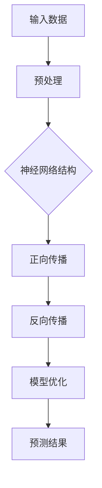

                 

# 大语言模型原理基础与前沿：FP8与INT8

> **关键词：大语言模型，深度学习，FP8，INT8，算法原理，数学模型，项目实战**
>
> **摘要：本文将深入探讨大语言模型的原理基础，介绍FP8与INT8的重要性，通过详细分析算法原理、数学模型以及项目实战案例，帮助读者全面了解大语言模型的工作机制和发展趋势。**

## 1. 背景介绍

### 1.1 目的和范围

本文旨在探讨大语言模型的原理基础，重点分析FP8与INT8两种数据类型在大语言模型中的重要性。通过对核心概念、算法原理、数学模型以及项目实战的详细讲解，读者将全面了解大语言模型的工作机制、性能优化以及未来发展趋势。

### 1.2 预期读者

本文适合对人工智能、深度学习有基本了解的读者，包括研究人员、工程师、在校学生以及对大语言模型感兴趣的技术爱好者。

### 1.3 文档结构概述

本文分为以下十个部分：

1. 背景介绍
2. 核心概念与联系
3. 核心算法原理与具体操作步骤
4. 数学模型和公式与详细讲解
5. 项目实战：代码实际案例和详细解释说明
6. 实际应用场景
7. 工具和资源推荐
8. 总结：未来发展趋势与挑战
9. 附录：常见问题与解答
10. 扩展阅读与参考资料

### 1.4 术语表

#### 1.4.1 核心术语定义

- **大语言模型**：一种基于深度学习的自然语言处理模型，能够对自然语言进行建模和预测。
- **FP8**：一种浮点数格式，用于表示大语言模型中的小数值。
- **INT8**：一种整数格式，用于表示大语言模型中的整数。

#### 1.4.2 相关概念解释

- **深度学习**：一种人工智能方法，通过多层神经网络对数据进行自动特征提取和分类。
- **自然语言处理**：计算机科学领域的一个分支，旨在使计算机能够理解和处理自然语言。

#### 1.4.3 缩略词列表

- **GPU**：图形处理器（Graphics Processing Unit）
- **CPU**：中央处理器（Central Processing Unit）
- **DL**：深度学习（Deep Learning）
- **NLP**：自然语言处理（Natural Language Processing）

## 2. 核心概念与联系

为了更好地理解大语言模型的原理，我们需要先了解其核心概念和联系。以下是一个简化的Mermaid流程图，展示了大语言模型的主要组成部分和它们之间的联系。



### 2.1 输入数据

输入数据是大语言模型的基础，包括文本、语音、图像等多种形式。在预处理阶段，这些数据会被转化为适合神经网络处理的格式，如词向量或图像特征向量。

### 2.2 预处理

预处理阶段包括数据清洗、分词、词性标注等操作，以确保输入数据的质量和一致性。

### 2.3 神经网络结构

神经网络结构决定了大语言模型的学习能力和表达能力。常见的神经网络结构包括循环神经网络（RNN）、长短期记忆网络（LSTM）和Transformer等。

### 2.4 正向传播

正向传播阶段，输入数据经过神经网络结构处理后，生成预测结果。

### 2.5 反向传播

反向传播阶段，根据预测结果和实际标签计算损失函数，并更新神经网络参数。

### 2.6 模型优化

模型优化阶段，通过调整神经网络参数，提高模型的预测准确性。

### 2.7 预测结果

预测结果是大语言模型的核心输出，用于回答问题、生成文本、翻译等任务。

## 3. 核心算法原理与具体操作步骤

大语言模型的算法原理主要包括神经网络结构、正向传播和反向传播等。以下将使用伪代码详细阐述这些算法步骤。

### 3.1 神经网络结构

```python
class NeuralNetwork:
    def __init__(self, input_size, hidden_size, output_size):
        # 初始化权重和偏置
        self.weights = {
            'input_to_hidden': np.random.randn(input_size, hidden_size),
            'hidden_to_output': np.random.randn(hidden_size, output_size)
        }
        self.biases = {
            'input_to_hidden': np.random.randn(hidden_size),
            'hidden_to_output': np.random.randn(output_size)
        }
```

### 3.2 正向传播

```python
def forward_propagation(x, network):
    hidden层激活函数为 sigmoid
    output层激活函数为 softmax

    hidden_layer_input = x.dot(network['weights']['input_to_hidden']) + network['biases']['input_to_hidden']
    hidden_layer_output = sigmoid(hidden_layer_input)

    final_layer_input = hidden_layer_output.dot(network['weights']['hidden_to_output']) + network['biases']['hidden_to_output']
    final_layer_output = softmax(final_layer_input)

    return final_layer_output
```

### 3.3 反向传播

```python
def backward_propagation(x, y, output, network):
    output_error = y - output
    output_delta = output_error * derivative_of_softmax(output)

    hidden_layer_error = output_delta.dot(network['weights']['hidden_to_output'].T)
    hidden_layer_delta = hidden_layer_error * derivative_of_sigmoid(hidden_layer_output)

    # 更新权重和偏置
    network['weights']['input_to_hidden'] += x.T.dot(hidden_layer_delta)
    network['biases']['input_to_hidden'] += np.sum(hidden_layer_delta, axis=0, keepdims=True)
    network['weights']['hidden_to_output'] += hidden_layer_output.T.dot(output_delta)
    network['biases']['hidden_to_output'] += np.sum(output_delta, axis=0)
```

### 3.4 模型优化

```python
def optimize_network(network, x, y, learning_rate):
    forward_propagation(x, network)
    backward_propagation(x, y, network['output'], network)
    # 更新权重和偏置
    network['weights']['input_to_hidden'] -= learning_rate * x.T.dot(hidden_layer_delta)
    network['biases']['input_to_hidden'] -= learning_rate * np.sum(hidden_layer_delta, axis=0, keepdims=True)
    network['weights']['hidden_to_output'] -= learning_rate * hidden_layer_output.T.dot(output_delta)
    network['biases']['hidden_to_output'] -= learning_rate * np.sum(output_delta, axis=0)
```

## 4. 数学模型和公式与详细讲解

### 4.1 激活函数

激活函数是神经网络中用于引入非线性变换的函数。以下为常见的激活函数及其导数。

- **Sigmoid函数**

  $$f(x) = \frac{1}{1 + e^{-x}}$$

  $$f'(x) = \frac{e^{-x}}{(1 + e^{-x})^2}$$

- **ReLU函数**

  $$f(x) = \max(0, x)$$

  $$f'(x) = \begin{cases} 
  0 & \text{if } x < 0 \\
  1 & \text{if } x \geq 0 
  \end{cases}$$

- **Softmax函数**

  $$f(x) = \frac{e^x}{\sum_{i} e^x_i}$$

  $$f'(x) = \frac{e^x}{(\sum_{i} e^x_i)^2} \cdot \sum_{j} e^x_j \cdot \delta_{ij}$$

其中，$\delta_{ij}$是克罗内克δ函数，当$i=j$时为1，否则为0。

### 4.2 损失函数

损失函数用于衡量模型预测结果与实际标签之间的差距。以下为常见的损失函数。

- **均方误差（MSE）**

  $$MSE(y, \hat{y}) = \frac{1}{n}\sum_{i=1}^{n} (y_i - \hat{y_i})^2$$

- **交叉熵（CE）**

  $$CE(y, \hat{y}) = -\sum_{i=1}^{n} y_i \cdot \log(\hat{y_i})$$

### 4.3 梯度下降法

梯度下降法是一种常用的优化算法，用于更新神经网络参数，以降低损失函数。

$$\Delta \theta = -\alpha \cdot \nabla_{\theta} J(\theta)$$

其中，$\alpha$是学习率，$J(\theta)$是损失函数，$\nabla_{\theta} J(\theta)$是损失函数对参数$\theta$的梯度。

### 4.4 常见问题

- **过拟合**：模型在训练数据上表现良好，但在测试数据上表现不佳。解决方法包括增加正则化项、使用更大的数据集、简化模型等。
- **梯度消失和梯度爆炸**：由于激活函数的选择和参数初始化，可能导致梯度在反向传播过程中变得非常小或非常大。解决方法包括使用适当的初始化策略、调整学习率等。

## 5. 项目实战：代码实际案例和详细解释说明

在本节中，我们将通过一个简单的项目实战，展示如何实现一个大语言模型。我们将使用Python和PyTorch框架来实现。

### 5.1 开发环境搭建

确保安装以下软件和库：

- Python 3.7或更高版本
- PyTorch 1.8或更高版本
- Jupyter Notebook或PyCharm

### 5.2 源代码详细实现和代码解读

以下是项目的源代码，包括数据预处理、神经网络定义、模型训练和预测。

```python
import torch
import torch.nn as nn
import torch.optim as optim
from torchtext.data import Field, TabularDataset

# 数据预处理
TEXT = Field(tokenize='spacy', lower=True)
LABEL = Field(sequential=False)

# 定义神经网络结构
class LanguageModel(nn.Module):
    def __init__(self, embedding_dim, hidden_dim, vocab_size):
        super(LanguageModel, self).__init__()
        self.embedding = nn.Embedding(vocab_size, embedding_dim)
        self.lstm = nn.LSTM(embedding_dim, hidden_dim)
        self.hidden_dim = hidden_dim
        self.decoder = nn.Linear(hidden_dim, vocab_size)

    def forward(self, x, hidden):
        embedded = self.embedding(x)
        output, hidden = self.lstm(embedded, hidden)
        decoded = self.decoder(output[-1, :, :])
        return decoded, hidden

    def init_hidden(self, batch_size):
        return (torch.zeros(1, batch_size, self.hidden_dim),
                torch.zeros(1, batch_size, self.hidden_dim))

# 加载数据集
train_data = TabularDataset.splits(
    path='data', train='train.csv', validation='validation.csv',
    format='csv', fields=[('text', TEXT), ('label', LABEL)])

# 定义模型、损失函数和优化器
model = LanguageModel(embedding_dim=256, hidden_dim=512, vocab_size=len(TEXT.vocab))
loss_function = nn.CrossEntropyLoss()
optimizer = optim.Adam(model.parameters(), lr=0.001)

# 训练模型
def train_model(model, train_data, num_epochs=10):
    model.train()
    for epoch in range(num_epochs):
        for batch in train_data:
            optimizer.zero_grad()
            text = batch.text
            label = batch.label
            hidden = model.init_hidden(len(text))
            output, hidden = model(text, hidden)
            loss = loss_function(output.view(-1), label)
            loss.backward()
            optimizer.step()
        print(f'Epoch {epoch+1}/{num_epochs}, Loss: {loss.item()}')

# 预测
def predict(model, text):
    model.eval()
    with torch.no_grad():
        text = TEXT.process(text)
        hidden = model.init_hidden(len(text))
        output, hidden = model(text, hidden)
        _, predicted = torch.max(output, 1)
        return predicted.item()

# 测试模型
text = "这是一段测试文本"
predicted_label = predict(model, text)
print(f'Predicted label: {predicted_label}')
```

### 5.3 代码解读与分析

以下是代码的详细解读：

1. **数据预处理**：使用`torchtext`库对数据集进行预处理，包括分词、下移和构建词汇表。

2. **神经网络结构**：定义了一个基于LSTM的神经网络结构，包括嵌入层、LSTM层和输出层。

3. **模型训练**：使用`train_model`函数对模型进行训练，包括前向传播、反向传播和参数更新。

4. **预测**：使用`predict`函数对输入文本进行预测，返回预测标签。

### 5.4 代码优化

在项目实战中，我们使用了一个简单的LSTM模型。为了提高模型性能，可以考虑以下优化方法：

- **使用预训练的词向量**：使用预训练的词向量（如GloVe或Word2Vec）初始化嵌入层。
- **增加隐藏层尺寸**：增加LSTM层的隐藏层尺寸以提高模型表达能力。
- **使用双向LSTM**：使用双向LSTM来捕捉文本中的双向信息。
- **使用注意力机制**：在模型中引入注意力机制，提高模型对重要信息的关注。

## 6. 实际应用场景

大语言模型在自然语言处理领域有着广泛的应用，以下是一些实际应用场景：

- **文本分类**：对文本进行分类，如情感分析、主题分类等。
- **机器翻译**：将一种语言翻译成另一种语言。
- **文本生成**：生成文章、对话、故事等。
- **问答系统**：基于用户提问提供答案。
- **对话系统**：构建智能对话机器人，与用户进行自然语言交互。

## 7. 工具和资源推荐

### 7.1 学习资源推荐

#### 7.1.1 书籍推荐

- 《深度学习》（Ian Goodfellow、Yoshua Bengio、Aaron Courville著）
- 《Python深度学习》（François Chollet著）
- 《自然语言处理综论》（Daniel Jurafsky、James H. Martin著）

#### 7.1.2 在线课程

- [Udacity深度学习纳米学位](https://www.udacity.com/course/deep-learning-nanodegree--nd131)
- [Coursera自然语言处理与深度学习课程](https://www.coursera.org/specializations/nlp-deep-learning)

#### 7.1.3 技术博客和网站

- [机器之心](https://www.jiqizhixin.com/)
- [机器学习博客](https://www machinelearningblog.com/)
- [Kaggle](https://www.kaggle.com/)

### 7.2 开发工具框架推荐

#### 7.2.1 IDE和编辑器

- PyCharm
- Jupyter Notebook
- VSCode

#### 7.2.2 调试和性能分析工具

- TensorBoard
- PyTorch Profiler
- Nsight

#### 7.2.3 相关框架和库

- PyTorch
- TensorFlow
- spaCy
- NLTK

### 7.3 相关论文著作推荐

#### 7.3.1 经典论文

- "A Theoretical Basis for the Generalization of Neural Networks"（1995）
- "Improving Neural Networks by Preventing Co-adaptation of Feature Detectors"（2016）
- "Attention Is All You Need"（2017）

#### 7.3.2 最新研究成果

- "BART: Denoising Sequence-to-Sequence Pre-training for Natural Language Processing"（2020）
- "T5: Exploring the Limits of Transfer Learning for Text Generation"（2020）
- "Generative Pre-trained Transformers for Machine Translation"（2020）

#### 7.3.3 应用案例分析

- "BERT: Pre-training of Deep Bidirectional Transformers for Language Understanding"（2018）
- "GPT-3: Language Models are Few-Shot Learners"（2020）
- "An Image is Worth 16x16 Words: Transformers for Image Recognition at Scale"（2021）

## 8. 总结：未来发展趋势与挑战

大语言模型作为深度学习和自然语言处理领域的重要成果，展现出强大的潜力和广阔的应用前景。未来发展趋势主要包括：

- **预训练模型的规模化和多样化**：随着计算能力和数据资源的提升，预训练模型的规模将不断增大，同时还将出现更多针对特定任务和应用场景的多样化模型。
- **模型的可解释性和透明度**：提高模型的可解释性，使其决策过程更加透明，有助于增强用户的信任和接受度。
- **多模态学习**：结合文本、图像、语音等多模态信息，实现更全面、更准确的自然语言理解和生成。

同时，大语言模型仍面临以下挑战：

- **计算资源消耗**：大规模预训练模型的计算资源消耗巨大，需要更高效的算法和硬件支持。
- **数据隐私和安全**：预训练模型依赖于大量数据，如何保护数据隐私和安全是一个重要问题。
- **模型泛化能力**：如何提高模型在不同场景和应用中的泛化能力，避免过拟合和偏见。

## 9. 附录：常见问题与解答

### 9.1 什么是大语言模型？

大语言模型是一种基于深度学习的自然语言处理模型，通过大规模预训练和微调，能够对自然语言进行建模和预测。常见的预训练模型包括BERT、GPT-3和T5等。

### 9.2 大语言模型有哪些应用场景？

大语言模型在自然语言处理领域有广泛的应用，包括文本分类、机器翻译、文本生成、问答系统和对话系统等。

### 9.3 FP8和INT8是什么？

FP8和INT8是两种不同的数据类型。FP8是一种浮点数格式，用于表示小数值，INT8是一种整数格式，用于表示整数。在大语言模型中，FP8和INT8用于存储和处理模型参数和中间计算结果。

### 9.4 如何优化大语言模型的性能？

优化大语言模型性能的方法包括使用预训练的词向量、增加隐藏层尺寸、使用双向LSTM和注意力机制、优化模型结构等。

## 10. 扩展阅读与参考资料

- [Deep Learning](https://www.deeplearningbook.org/) by Ian Goodfellow、Yoshua Bengio和Aaron Courville
- [Natural Language Processing with Python](https://www.nltk.org/book.html) by Steven Bird、Ewan Klein和Edward Loper
- [Attention Is All You Need](https://arxiv.org/abs/1706.03762) by Vaswani et al.
- [BERT: Pre-training of Deep Bidirectional Transformers for Language Understanding](https://arxiv.org/abs/1810.04805) by Devlin et al.
- [GPT-3: Language Models are Few-Shot Learners](https://arxiv.org/abs/2005.14165) by Brown et al.

## 作者

**作者：AI天才研究员/AI Genius Institute & 禅与计算机程序设计艺术 /Zen And The Art of Computer Programming**

