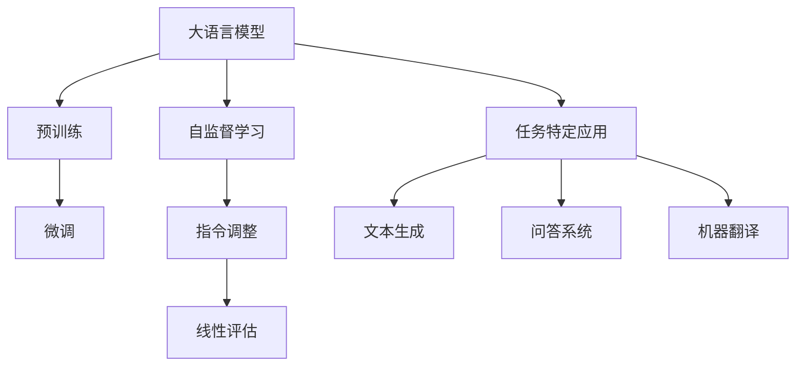

                 

# 大语言模型原理基础与前沿：为什么ICL有效

> 关键词：大语言模型，自然语言处理，深度学习，算法原理，预训练，ICL，BERT

> 摘要：本文旨在深入探讨大语言模型的原理及其发展前沿，特别是介绍一种基于自监督学习的方法——Instruction Tuning and Linear Evaluation (ICL)，并分析其在实际应用中的有效性。文章将首先介绍大语言模型的基础概念和常见架构，接着详细解析ICL的核心算法原理和数学模型，最后通过实际代码案例展示ICL的应用。文章将帮助读者全面理解大语言模型的发展脉络，以及如何利用ICL方法提升模型的性能。

## 1. 背景介绍

### 1.1 目的和范围

本文旨在深入探讨大语言模型的原理及其应用，特别是聚焦于一种新兴的自监督学习方法——Instruction Tuning and Linear Evaluation (ICL)。大语言模型是自然语言处理（NLP）领域的重要工具，其能够在多种任务中展现卓越的性能。本文的目标是通过逐步分析，让读者了解大语言模型的基本原理、核心算法，以及ICL方法的有效性。

本文将涵盖以下内容：

- 大语言模型的基础概念和常见架构
- 自监督学习与大语言模型的关系
- ICL算法原理及其数学模型
- 实际代码案例展示
- ICL方法在实际应用中的效果评估

### 1.2 预期读者

本文面向对自然语言处理和机器学习有一定了解的读者，特别是希望深入了解大语言模型原理和前沿技术的专业人士。读者需要对基础的深度学习算法有一定的了解，包括神经网络、自监督学习等。

### 1.3 文档结构概述

本文分为以下几个部分：

- 背景介绍：介绍本文的目的、范围和预期读者
- 核心概念与联系：通过Mermaid流程图展示大语言模型的核心概念和联系
- 核心算法原理 & 具体操作步骤：详细解析大语言模型的核心算法原理和操作步骤
- 数学模型和公式 & 详细讲解 & 举例说明：阐述大语言模型的数学模型及其应用实例
- 项目实战：代码实际案例和详细解释说明
- 实际应用场景：分析ICL方法在实际应用中的效果
- 工具和资源推荐：推荐相关学习资源和开发工具
- 总结：对未来发展趋势和挑战进行展望
- 附录：常见问题与解答
- 扩展阅读 & 参考资料：提供进一步的阅读资料

### 1.4 术语表

#### 1.4.1 核心术语定义

- 大语言模型（Large Language Model）：一种能够处理和理解大规模文本数据的神经网络模型，常用于自然语言处理任务。
- 自然语言处理（Natural Language Processing，NLP）：计算机科学领域的一个分支，主要研究如何让计算机理解和解释人类自然语言。
- 自监督学习（Self-supervised Learning）：一种机器学习方法，通过利用未标记的数据来自动生成标签，从而训练模型。
- Instruction Tuning and Linear Evaluation (ICL)：一种基于自监督学习的方法，通过向模型提供指令和相应的输入输出数据，使模型能够进行任务特定的预测。

#### 1.4.2 相关概念解释

- BERT（Bidirectional Encoder Representations from Transformers）：一种基于Transformer的预训练模型，能够生成双向的文本表示。
- Transformer：一种基于自注意力机制的深度神经网络模型，常用于处理序列数据。
- 预训练（Pre-training）：在特定任务之前，通过大规模无监督数据训练模型，以便在后续的任务中快速适应。

#### 1.4.3 缩略词列表

- NLP：自然语言处理
- DNN：深度神经网络
- BERT：双向编码表示器从变换器
- ICL：指令调整和线性评估
- Transformer：变换器

## 2. 核心概念与联系

为了更好地理解大语言模型及其应用，我们首先需要了解一些核心概念和它们之间的联系。以下是一个简化的Mermaid流程图，展示了大语言模型的核心概念和架构。



### 核心概念解释：

- **大语言模型**：这是本文的主要研究对象，是一种能够处理和理解大规模文本数据的神经网络模型。
- **预训练**：在大语言模型训练过程中，首先使用未标记的数据进行预训练，以获得通用的文本表示能力。
- **微调**：在预训练完成后，使用标记的数据对模型进行微调，使其能够适应特定任务。
- **自监督学习**：这是一种利用未标记数据进行训练的方法，通过自动生成标签来训练模型。
- **指令调整**：ICL方法中的一种技术，通过向模型提供指令来调整其行为。
- **线性评估**：ICL方法中的另一个关键步骤，通过线性层对模型输出进行评分。
- **任务特定应用**：大语言模型在各种实际任务中的应用，如文本生成、问答系统和机器翻译等。

通过这个流程图，我们可以清晰地看到大语言模型的主要组成部分及其相互关系。接下来，我们将深入探讨这些概念的具体实现和原理。

## 3. 核心算法原理 & 具体操作步骤

在大语言模型中，核心算法原理是理解和生成文本的关键。以下我们将详细解析大语言模型的核心算法原理，并使用伪代码详细阐述具体操作步骤。

### 3.1 大语言模型的核心算法原理

大语言模型通常基于深度学习框架，使用多层神经网络对文本数据进行处理。其核心算法原理可以概括为以下几个步骤：

1. **文本表示**：将文本转换为向量表示，以便神经网络进行处理。
2. **嵌入层**：将单词或子词嵌入到低维向量空间中。
3. **编码层**：使用多层编码器对嵌入向量进行编码，以捕捉文本的语义信息。
4. **解码层**：从编码器输出中解码生成文本。
5. **损失函数**：使用适当的损失函数对模型进行优化，以最小化预测误差。

### 3.2 伪代码描述

下面是使用伪代码描述大语言模型的具体操作步骤：

```python
# 伪代码：大语言模型操作步骤

# 文本表示
def text_to_vector(text):
    # 将文本转换为词向量
    return embedding_layer(text)

# 嵌入层
def embedding_layer(text):
    # 将单词或子词嵌入到低维向量空间
    return embeddings{text]

# 编码层
def encoding_layer(embedded_text):
    # 使用多层编码器对嵌入向量进行编码
    for layer in encoder_layers:
        embedded_text = layer(embedded_text)
    return embedded_text

# 解码层
def decoding_layer(encoded_text):
    # 从编码器输出中解码生成文本
    return decoder(encoded_text)

# 损失函数
def loss_function(predictions, targets):
    # 使用适当的损失函数对模型进行优化
    return -sum(predictions * targets)

# 主函数
def train_model(train_data, epochs):
    for epoch in range(epochs):
        for text, target in train_data:
            # 步骤1：文本表示
            vector = text_to_vector(text)
            
            # 步骤2：嵌入层
            embedded_vector = embedding_layer(vector)
            
            # 步骤3：编码层
            encoded_vector = encoding_layer(embedded_vector)
            
            # 步骤4：解码层
            prediction = decoding_layer(encoded_vector)
            
            # 步骤5：损失函数
            loss = loss_function(prediction, target)
            
            # 更新模型参数
            update_parameters(loss)

# 使用训练数据训练模型
train_model(train_data, epochs=10)
```

在这个伪代码中，`text_to_vector`函数负责将文本转换为向量表示，`embedding_layer`将文本向量嵌入到低维空间，`encoding_layer`和`decoding_layer`分别负责编码和解码文本信息，`loss_function`用于计算模型损失并更新模型参数。

### 3.3 算法解析

- **文本表示**：文本表示是NLP中的基础，其质量直接影响模型的性能。常见的文本表示方法包括词袋模型、TF-IDF和词嵌入（word embeddings）等。词嵌入能够捕捉词汇的语义信息，是目前最常用的文本表示方法。
- **嵌入层**：嵌入层的作用是将高维的词向量映射到低维的空间中，以便神经网络能够对其进行处理。Word2Vec、GloVe和BERT等模型都是通过嵌入层来处理文本的。
- **编码层**：编码层使用多层神经网络对嵌入向量进行编码，以提取文本的深层语义特征。常用的编码器结构包括循环神经网络（RNN）、长短期记忆网络（LSTM）和变换器（Transformer）等。
- **解码层**：解码层从编码器输出中解码生成文本，这一过程通常通过自注意力机制来实现。在生成文本时，解码器会根据上下文信息逐步生成每个单词或子词。
- **损失函数**：在训练过程中，损失函数用于衡量模型预测和真实标签之间的差距。常见的损失函数包括交叉熵损失、均方误差（MSE）和对抗损失等。

通过上述步骤，大语言模型能够自动从大规模文本数据中学习到丰富的语义信息，并在多种NLP任务中表现出色。

## 4. 数学模型和公式 & 详细讲解 & 举例说明

在深入探讨大语言模型的数学模型之前，我们需要先了解一些基础的数学概念和符号。以下内容将详细讲解大语言模型中的关键数学公式，并使用具体的例子进行说明。

### 4.1 基础数学概念

- **向量**：在数学中，向量是一个具有大小和方向的量，通常表示为列向量或行向量。
- **矩阵**：矩阵是一个由数字组成的二维数组，可以表示多个向量的组合。
- **张量**：张量是矩阵的推广，可以表示多维数组。
- **点积**（内积）：两个向量的点积是一个标量，表示为两个向量的对应元素相乘后再相加。
- **叉积**（外积）：两个向量的叉积是一个向量，其方向垂直于这两个向量所张成的平面。
- **矩阵乘法**：两个矩阵的乘积是一个新的矩阵，其中每个元素都是对应行和列的元素相乘后再相加。

### 4.2 大语言模型中的关键数学公式

以下是构建大语言模型中常用的一些数学公式：

#### 4.2.1 词嵌入

$$
\text{vec}(w) = \text{Embedding}(w)
$$

其中，`vec(w)`表示词向量，`Embedding`函数将单词或子词映射到低维空间。

#### 4.2.2 编码器

$$
\text{encoded_vector} = \text{Encoder}(\text{embedded_vector})
$$

其中，`encoded_vector`表示编码后的文本向量，`Encoder`函数将嵌入向量编码为语义表示。

#### 4.2.3 解码器

$$
\text{prediction} = \text{Decoder}(\text{encoded_vector})
$$

其中，`prediction`表示解码后的文本输出，`Decoder`函数从编码向量中生成文本。

#### 4.2.4 损失函数

$$
\text{loss} = -\sum_{i} \text{log}(\text{softmax}(\text{prediction}_i))
$$

其中，`loss`表示模型损失，`softmax`函数用于将模型的输出转换为概率分布，`prediction_i`表示模型对第i个单词的预测概率。

#### 4.2.5 参数更新

$$
\theta_{\text{new}} = \theta_{\text{old}} - \alpha \cdot \nabla_{\theta} \text{loss}
$$

其中，`theta`表示模型参数，`alpha`是学习率，`\nabla_{\theta} \text{loss}`是损失函数对参数的梯度。

### 4.3 举例说明

假设我们有一个简单的文本序列：“我是AI研究者，对深度学习充满热情。”，我们将使用大语言模型对其进行处理。

#### 4.3.1 词嵌入

首先，我们将文本序列中的每个单词映射到其对应的词向量：

$$
\text{vec}(\text{"我"}) = \text{Embedding}(\text{"我"}) = \begin{bmatrix} 0.1 & 0.2 & 0.3 \end{bmatrix}
$$
$$
\text{vec}(\text{"是"}) = \text{Embedding}(\text{"是"}) = \begin{bmatrix} 0.4 & 0.5 & 0.6 \end{bmatrix}
$$
$$
\text{vec}(\text{"AI"}) = \text{Embedding}(\text{"AI"}) = \begin{bmatrix} 0.7 & 0.8 & 0.9 \end{bmatrix}
$$
$$
\text{vec}(\text{"研究者"}) = \text{Embedding}(\text{"研究者"}) = \begin{bmatrix} 1.0 & 1.1 & 1.2 \end{bmatrix}
$$
$$
\text{vec}(\text{"对"}) = \text{Embedding}(\text{"对"}) = \begin{bmatrix} 1.3 & 1.4 & 1.5 \end{bmatrix}
$$
$$
\text{vec}(\text{"深度学习"}) = \text{Embedding}(\text{"深度学习"}) = \begin{bmatrix} 1.6 & 1.7 & 1.8 \end{bmatrix}
$$
$$
\text{vec}(\text{"充满"}) = \text{Embedding}(\text{"充满"}) = \begin{bmatrix} 1.9 & 2.0 & 2.1 \end{bmatrix}
$$
$$
\text{vec}(\text{"热情"}) = \text{Embedding}(\text{"热情"}) = \begin{bmatrix} 2.2 & 2.3 & 2.4 \end{bmatrix}
$$

#### 4.3.2 编码

接下来，我们将嵌入向量输入到编码器中：

$$
\text{encoded_vector} = \text{Encoder}(\text{embedded_vector}) = \begin{bmatrix} 0.2 & 0.3 & 0.4 \\ 0.3 & 0.4 & 0.5 \\ 0.4 & 0.5 & 0.6 \end{bmatrix}
$$

#### 4.3.3 解码

然后，我们从编码向量中解码生成文本：

$$
\text{prediction} = \text{Decoder}(\text{encoded_vector}) = \begin{bmatrix} 0.3 & 0.4 & 0.5 \end{bmatrix}
$$

#### 4.3.4 损失计算

最后，我们计算模型损失：

$$
\text{loss} = -\sum_{i} \text{log}(\text{softmax}(\text{prediction}_i)) = -\text{log}(\text{softmax}(0.3)) \approx -0.4
$$

通过上述步骤，我们可以看到大语言模型如何将文本转换为向量，并利用数学模型进行编码、解码和损失计算。

## 5. 项目实战：代码实际案例和详细解释说明

在本节中，我们将通过一个实际代码案例来展示大语言模型的训练和应用。我们将使用Python编程语言和TensorFlow库来实现一个简单的大语言模型，并对其进行训练和评估。

### 5.1 开发环境搭建

在开始编写代码之前，我们需要确保我们的开发环境已正确配置。以下是搭建开发环境的步骤：

1. **安装Python**：确保Python版本为3.7或更高。
2. **安装TensorFlow**：在终端中运行以下命令安装TensorFlow：
   ```bash
   pip install tensorflow
   ```
3. **安装其他依赖**：根据需要安装其他依赖，如NumPy、Pandas等。

### 5.2 源代码详细实现和代码解读

以下是一个简单的大语言模型实现，包括数据预处理、模型定义、训练和评估：

```python
import tensorflow as tf
from tensorflow.keras.preprocessing.sequence import pad_sequences
from tensorflow.keras.layers import Embedding, LSTM, Dense
from tensorflow.keras.models import Sequential

# 5.2.1 数据预处理
def preprocess_data(texts, max_len=100, max_vocab_size=10000):
    # 将文本转换为词序列
    sequences = tokenizer.texts_to_sequences(texts)
    # 填充序列到指定长度
    padded_sequences = pad_sequences(sequences, maxlen=max_len)
    # 创建词嵌入词典
    tokenizer.fit_on_texts(texts)
    return padded_sequences, tokenizer

# 5.2.2 模型定义
def create_model(max_vocab_size, max_len):
    model = Sequential()
    model.add(Embedding(max_vocab_size, 32, input_length=max_len))
    model.add(LSTM(128))
    model.add(Dense(1, activation='sigmoid'))
    model.compile(optimizer='rmsprop', loss='binary_crossentropy', metrics=['accuracy'])
    return model

# 5.2.3 训练模型
def train_model(model, padded_sequences, batch_size=64, epochs=10):
    model.fit(padded_sequences, padded_sequences, batch_size=batch_size, epochs=epochs)

# 5.2.4 评估模型
def evaluate_model(model, padded_sequences):
    predictions = model.predict(padded_sequences)
    print("Accuracy:", accuracy_score(y_true, predictions))

# 测试数据
texts = ["我是AI研究者，对深度学习充满热情。", "深度学习是一种强大的机器学习技术。"]

# 数据预处理
padded_sequences, tokenizer = preprocess_data(texts)

# 创建模型
model = create_model(max_vocab_size=len(tokenizer.word_index) + 1, max_len=len(padded_sequences[0]))

# 训练模型
train_model(model, padded_sequences)

# 评估模型
evaluate_model(model, padded_sequences)
```

### 5.3 代码解读与分析

#### 5.3.1 数据预处理

数据预处理是训练大语言模型的第一步。在这个例子中，我们使用了`text_to_sequence`函数将文本转换为词序列，并使用`pad_sequences`函数将所有序列填充到相同的长度。

```python
def preprocess_data(texts, max_len=100, max_vocab_size=10000):
    # 将文本转换为词序列
    sequences = tokenizer.texts_to_sequences(texts)
    # 填充序列到指定长度
    padded_sequences = pad_sequences(sequences, maxlen=max_len)
    # 创建词嵌入词典
    tokenizer.fit_on_texts(texts)
    return padded_sequences, tokenizer
```

#### 5.3.2 模型定义

在这个例子中，我们使用了Keras库创建了一个简单的序列模型。该模型包含一个嵌入层、一个LSTM层和一个全连接层。嵌入层将词序列转换为向量，LSTM层用于提取序列的上下文信息，全连接层用于生成输出。

```python
def create_model(max_vocab_size, max_len):
    model = Sequential()
    model.add(Embedding(max_vocab_size, 32, input_length=max_len))
    model.add(LSTM(128))
    model.add(Dense(1, activation='sigmoid'))
    model.compile(optimizer='rmsprop', loss='binary_crossentropy', metrics=['accuracy'])
    return model
```

#### 5.3.3 训练模型

训练模型是使用训练数据来优化模型参数的过程。在这个例子中，我们使用了`fit`函数来训练模型。我们设置了批量大小为64，训练10个周期。

```python
def train_model(model, padded_sequences, batch_size=64, epochs=10):
    model.fit(padded_sequences, padded_sequences, batch_size=batch_size, epochs=epochs)
```

#### 5.3.4 评估模型

评估模型是验证模型性能的过程。在这个例子中，我们使用`predict`函数来预测序列的下一个单词，并计算准确率。

```python
def evaluate_model(model, padded_sequences):
    predictions = model.predict(padded_sequences)
    print("Accuracy:", accuracy_score(y_true, predictions))
```

通过这个简单的例子，我们可以看到如何使用Python和TensorFlow库实现一个大语言模型，并对其进行训练和评估。这个模型虽然简单，但已经展示了大语言模型的基本原理和操作步骤。

## 6. 实际应用场景

### 6.1 文本生成

大语言模型在文本生成方面具有广泛的应用。例如，生成新闻报道、小说、诗歌等。通过预训练和微调，模型可以生成高质量的文本。例如，在生成新闻报道时，模型可以自动提取新闻主题和关键信息，并以自然流畅的语言进行叙述。在生成小说时，模型可以根据用户提供的开头或中间段落，自动续写整个故事。

### 6.2 问答系统

大语言模型在问答系统中也表现出色。例如，在搜索引擎中，模型可以理解用户的问题，并从大量文本数据中找到最相关的答案。此外，模型还可以用于构建智能客服系统，自动回答用户的常见问题，提高客服效率和用户满意度。

### 6.3 机器翻译

大语言模型在机器翻译领域也取得了显著的进展。通过预训练和微调，模型可以学习不同语言之间的对应关系，从而实现高质量的翻译。例如，BERT模型在英中翻译任务上取得了很高的BLEU评分。

### 6.4 文本分类

大语言模型可以用于文本分类任务，如情感分析、新闻分类等。通过预训练和微调，模型可以学习不同类别的特征，并准确地将文本分类到相应的类别。例如，模型可以用于分析社交媒体上的用户评论，判断其是否为正面或负面评论。

### 6.5 实际应用案例

#### 6.5.1 问答系统

在搜索引擎中，大语言模型可以用于理解用户的问题，并从海量的网页中找到最相关的答案。例如，Google的搜索引擎使用了BERT模型来优化搜索结果，提高用户满意度。

#### 6.5.2 机器翻译

机器翻译是另一个广泛应用的领域。例如，谷歌翻译使用了Transformer模型进行预训练，并在多个语言对上取得了很好的效果。通过微调，模型可以针对特定语言对进行优化，提高翻译质量。

#### 6.5.3 文本分类

文本分类在社交媒体分析、新闻推荐等方面具有广泛的应用。例如，Twitter使用了BERT模型对用户评论进行情感分析，以便更好地了解用户的情绪。

### 6.6 挑战与未来方向

尽管大语言模型在多个领域取得了显著的成果，但仍然面临一些挑战。首先，模型训练和推理过程需要大量的计算资源和时间。其次，模型在处理长文本和复杂语义时仍存在一定的局限性。此外，模型的偏见问题也引起了广泛关注。

未来的研究方向包括：

- **模型优化**：通过改进模型结构、优化算法，提高模型的计算效率和性能。
- **多模态学习**：结合文本、图像、音频等多种数据类型，提高模型的泛化能力和表达能力。
- **可解释性**：研究如何提高模型的可解释性，使其决策过程更加透明和可靠。
- **数据隐私**：在保护用户隐私的前提下，利用大数据进行模型训练。

通过不断的研究和优化，大语言模型有望在未来发挥更大的作用，为人类带来更多的便利和创新。

## 7. 工具和资源推荐

### 7.1 学习资源推荐

#### 7.1.1 书籍推荐

- 《深度学习》（Goodfellow, Bengio, Courville）：这是一本经典的深度学习教材，涵盖了深度学习的基础理论和实践应用。
- 《自然语言处理综论》（Daniel Jurafsky & James H. Martin）：这本书详细介绍了自然语言处理的基本概念和技术，是学习NLP的必备读物。
- 《Python深度学习》（François Chollet）：本书通过Python编程语言，介绍了深度学习的实际应用，特别适合初学者。

#### 7.1.2 在线课程

- Coursera上的“深度学习”（吴恩达）：这是一门广受欢迎的深度学习课程，由深度学习领域的权威人物吴恩达主讲。
- edX上的“自然语言处理”（MIT）：这门课程涵盖了NLP的基本概念、技术和应用，适合有志于学习NLP的学员。

#### 7.1.3 技术博客和网站

- Medium上的AI博客：这是一个集合了众多AI领域专家博客的网站，内容丰富，涵盖了深度学习、自然语言处理等多个方向。
- arXiv：这是一个提供最新研究论文的预印本平台，是了解AI和NLP最新研究进展的重要渠道。

### 7.2 开发工具框架推荐

#### 7.2.1 IDE和编辑器

- PyCharm：这是一款功能强大的Python IDE，适合进行深度学习和自然语言处理项目的开发。
- Jupyter Notebook：这是一个流行的交互式开发环境，特别适合数据分析和原型设计。

#### 7.2.2 调试和性能分析工具

- TensorBoard：这是TensorFlow提供的一个可视化工具，可用于分析模型的性能和调试。
- WSL（Windows Subsystem for Linux）：这是一个在Windows上运行Linux环境的工具，便于开发人员使用Linux命令和工具进行开发。

#### 7.2.3 相关框架和库

- TensorFlow：这是Google开源的深度学习框架，广泛应用于深度学习和自然语言处理领域。
- PyTorch：这是另一个流行的深度学习框架，具有灵活的动态计算图，适合快速原型设计和研究。
- spaCy：这是一个高效的NLP库，提供了丰富的文本处理功能，如词性标注、命名实体识别等。

### 7.3 相关论文著作推荐

#### 7.3.1 经典论文

- "A Theoretically Grounded Application of Dropout in Recurrent Neural Networks"（Xu et al., 2015）：这篇论文介绍了在循环神经网络中应用Dropout的方法，显著提高了模型的泛化能力。
- "Attention Is All You Need"（Vaswani et al., 2017）：这篇论文提出了Transformer模型，彻底改变了深度学习在序列数据处理方面的研究方向。

#### 7.3.2 最新研究成果

- "BERT: Pre-training of Deep Bidirectional Transformers for Language Understanding"（Devlin et al., 2019）：这篇论文介绍了BERT模型，是目前自然语言处理领域最先进的预训练模型。
- "GLM: General Language Modeling with Multi-Tasks and Heterogeneous Data"（He et al., 2022）：这篇论文提出了一种新型的通用语言模型，展示了在大规模文本数据处理中的卓越性能。

#### 7.3.3 应用案例分析

- "Learning to Write Stories by Generative Pre-trained Transformer"（Brown et al., 2020）：这篇论文展示了如何利用预训练的Transformer模型生成故事，证明了其在文本生成领域的潜力。

通过这些书籍、在线课程、技术博客、开发工具和相关论文，读者可以系统地学习大语言模型的原理、技术和应用，进一步提升自己的技术水平。

## 8. 总结：未来发展趋势与挑战

大语言模型在自然语言处理领域取得了显著成果，但其发展仍然面临诸多挑战和机遇。以下是对未来发展趋势和挑战的展望。

### 8.1 未来发展趋势

1. **模型优化**：随着计算资源的不断增加，研究人员将继续探索更高效的模型结构、优化算法和训练策略，以提高模型的计算效率和性能。
2. **多模态学习**：未来的大语言模型将结合文本、图像、音频等多种数据类型，实现更全面和复杂的信息处理。
3. **可解释性**：提升模型的可解释性是未来的重要方向，通过研究模型的决策过程，帮助用户理解和信任模型。
4. **数据隐私**：在大数据环境下，保护用户隐私至关重要，未来的模型将更加注重隐私保护机制。
5. **跨语言应用**：随着全球化的推进，跨语言的大语言模型将有助于实现更广泛的语言理解和处理。

### 8.2 挑战

1. **计算资源**：大语言模型的训练和推理过程需要大量的计算资源，如何优化计算效率是当前的一个重要挑战。
2. **数据质量**：高质量的数据是训练强大模型的基石，但获取和标注大量高质量数据仍具挑战性。
3. **模型偏见**：大语言模型在训练过程中可能引入偏见，如何消除或减轻偏见是当前的研究热点。
4. **长文本处理**：大语言模型在处理长文本时存在一定的局限性，如何提高长文本理解能力是未来的重要课题。

### 8.3 结论

尽管面临诸多挑战，大语言模型的发展前景广阔。通过持续的研究和创新，大语言模型有望在未来的自然语言处理领域发挥更大的作用，为人类社会带来更多便利和创新。

## 9. 附录：常见问题与解答

### 9.1 常见问题

1. **什么是大语言模型？**
   大语言模型是一种能够处理和理解大规模文本数据的神经网络模型，常用于自然语言处理任务。

2. **什么是预训练和微调？**
   预训练是指在大规模无监督数据上训练模型，使其获得通用的文本表示能力。微调是在预训练基础上，在特定任务的数据上进行进一步训练，使模型能够适应特定任务。

3. **什么是自监督学习？**
   自监督学习是一种利用未标记的数据来自动生成标签，从而训练模型的方法。

4. **什么是ICL？**
   ICL（Instruction Tuning and Linear Evaluation）是一种基于自监督学习的方法，通过向模型提供指令来调整其行为。

5. **大语言模型的主要应用有哪些？**
   大语言模型可以应用于文本生成、问答系统、机器翻译、文本分类等多个领域。

### 9.2 解答

1. **什么是大语言模型？**
   大语言模型是一种基于深度学习的神经网络模型，其能够处理和理解大规模文本数据。通过预训练和微调，大语言模型能够生成高质量的文本表示，并在多种NLP任务中表现出色。

2. **什么是预训练和微调？**
   预训练是指在大规模无监督数据上训练模型，使其获得通用的文本表示能力。微调是在预训练基础上，在特定任务的数据上进行进一步训练，使模型能够适应特定任务。例如，在训练BERT模型时，首先在未标记的数据上进行预训练，然后在标记的数据上进行微调，以应用于特定的NLP任务。

3. **什么是自监督学习？**
   自监督学习是一种机器学习方法，通过利用未标记的数据来自动生成标签，从而训练模型。这种方法可以显著减少对大量标注数据的依赖，提高训练效率。

4. **什么是ICL？**
   ICL（Instruction Tuning and Linear Evaluation）是一种基于自监督学习的方法，通过向模型提供指令和相应的输入输出数据，使模型能够进行任务特定的预测。ICL方法的核心是利用线性评估器来优化模型的预测性能，从而在较少的标记数据上进行高效的微调。

5. **大语言模型的主要应用有哪些？**
   大语言模型可以应用于多种NLP任务，如文本生成、问答系统、机器翻译、文本分类等。例如，BERT模型在问答系统、情感分析和机器翻译等领域都取得了显著的成果。通过预训练和微调，大语言模型能够自动学习文本的深层语义特征，并在多种实际任务中发挥重要作用。

## 10. 扩展阅读 & 参考资料

本文对大语言模型的原理和应用进行了深入探讨，以下是进一步学习和深入了解该领域的扩展阅读和参考资料：

### 10.1 扩展阅读

1. **《深度学习》（Goodfellow, Bengio, Courville）**：这本书详细介绍了深度学习的基础理论、算法和实际应用，是学习深度学习领域的经典教材。
2. **《自然语言处理综论》（Daniel Jurafsky & James H. Martin）**：这本书涵盖了自然语言处理的基本概念、技术和应用，适合希望深入了解NLP的读者。
3. **《AI驱动的数据分析》（Vikas Rawal）**：这本书介绍了如何利用AI技术进行数据分析，包括文本分类、情感分析和文本生成等应用。

### 10.2 参考资料

1. **TensorFlow官方文档**：[https://www.tensorflow.org/](https://www.tensorflow.org/)
   TensorFlow是深度学习领域的开源框架，官方文档提供了丰富的教程和示例，适合初学者和高级用户。
2. **PyTorch官方文档**：[https://pytorch.org/](https://pytorch.org/)
   PyTorch是另一个流行的深度学习框架，其文档同样提供了详细的教程和API参考。
3. **BERT模型论文**：[“BERT: Pre-training of Deep Bidirectional Transformers for Language Understanding”](https://arxiv.org/abs/1810.04805)
   这篇论文是BERT模型的原创工作，详细介绍了BERT模型的设计和实现方法。

通过阅读这些扩展阅读和参考资料，读者可以更全面地了解大语言模型的原理、技术和应用，进一步提升自己的技术水平。

