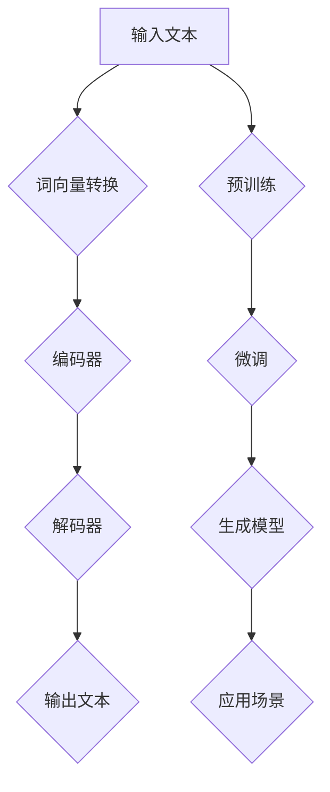

                 

# 大语言模型原理基础与前沿 挑战与机遇

> 关键词：大语言模型、深度学习、自然语言处理、人工智能、神经网络、生成模型、预训练、微调、模型优化、应用场景、挑战与机遇

> 摘要：本文将深入探讨大语言模型的原理基础及其在当前技术前沿的地位。我们将详细分析其核心算法原理、数学模型、具体操作步骤，并通过实际项目实战来展示其应用场景。同时，本文将介绍相关工具和资源，总结未来发展趋势与挑战，并为读者提供扩展阅读与参考资料。

## 1. 背景介绍

### 1.1 目的和范围

本文旨在为广大读者提供一份关于大语言模型的全面指南，旨在帮助读者理解大语言模型的基本原理、应用场景以及未来发展的挑战与机遇。本文将涵盖以下内容：

- 大语言模型的基本概念与历史发展
- 核心算法原理与数学模型
- 具体操作步骤与项目实战
- 实际应用场景分析
- 工具和资源推荐
- 未来发展趋势与挑战

### 1.2 预期读者

本文适合以下读者群体：

- 对自然语言处理和人工智能感兴趣的计算机科学爱好者
- 想要深入了解大语言模型的开发者与研究人员
- 需要在大语言模型应用场景中进行实践的技术人员
- 对深度学习与神经网络有一定了解，希望进一步拓展知识面的专业人士

### 1.3 文档结构概述

本文的结构如下：

1. **背景介绍**：介绍大语言模型的基本概念、目的与预期读者。
2. **核心概念与联系**：通过Mermaid流程图展示大语言模型的核心概念与联系。
3. **核心算法原理 & 具体操作步骤**：详细讲解大语言模型的核心算法原理与具体操作步骤。
4. **数学模型和公式 & 详细讲解 & 举例说明**：介绍大语言模型中的数学模型、公式及其应用实例。
5. **项目实战：代码实际案例和详细解释说明**：通过实际项目实战展示大语言模型的应用。
6. **实际应用场景**：分析大语言模型在不同领域的应用场景。
7. **工具和资源推荐**：推荐学习资源、开发工具框架及相关论文著作。
8. **总结：未来发展趋势与挑战**：总结大语言模型的未来发展趋势与面临的挑战。
9. **附录：常见问题与解答**：回答读者可能遇到的问题。
10. **扩展阅读 & 参考资料**：提供扩展阅读与参考资料。

### 1.4 术语表

#### 1.4.1 核心术语定义

- **大语言模型**：一种基于深度学习的自然语言处理模型，通过学习大量文本数据，可以理解和生成自然语言。
- **预训练**：在特定任务之前，对模型进行大规模的无监督学习，以获得通用的语言理解能力。
- **微调**：在预训练模型的基础上，针对特定任务进行有监督学习，以适应特定任务的需求。
- **生成模型**：一种用于生成数据的机器学习模型，可以用于生成新的文本、图像等。
- **神经网络**：一种基于人脑神经网络原理设计的机器学习算法，可用于处理复杂的非线性问题。

#### 1.4.2 相关概念解释

- **自然语言处理**：计算机科学领域的一个分支，旨在使计算机能够理解、生成和处理自然语言。
- **深度学习**：一种机器学习方法，通过多层神经网络来学习和表示数据。
- **监督学习**：一种机器学习方法，通过带有标签的训练数据来训练模型。
- **无监督学习**：一种机器学习方法，通过没有标签的数据来训练模型。
- **有监督学习**：一种机器学习方法，通过带有标签的训练数据来训练模型。

#### 1.4.3 缩略词列表

- **NLP**：自然语言处理（Natural Language Processing）
- **DL**：深度学习（Deep Learning）
- **GAN**：生成对抗网络（Generative Adversarial Network）
- **BERT**：预训练语言模型（Bidirectional Encoder Representations from Transformers）
- **Transformer**：一种基于自注意力机制的深度学习模型

## 2. 核心概念与联系

为了更好地理解大语言模型，我们需要首先了解其核心概念与联系。以下是一个简化的Mermaid流程图，用于展示大语言模型的核心概念：



### 流程图说明：

1. **输入文本**：用户输入的文本，可以是单个句子或段落。
2. **词向量转换**：将文本中的单词转换为词向量，用于表示单词的语义信息。
3. **编码器**：将词向量编码为高维的向量表示，用于捕捉文本的上下文信息。
4. **解码器**：将编码后的向量解码为输出文本。
5. **输出文本**：模型生成的文本，可以是翻译、摘要、回复等。
6. **预训练**：在特定任务之前，对模型进行大规模的无监督学习，以获得通用的语言理解能力。
7. **微调**：在预训练模型的基础上，针对特定任务进行有监督学习，以适应特定任务的需求。
8. **生成模型**：用于生成新的文本、图像等。
9. **应用场景**：大语言模型在不同领域的应用，如问答系统、文本生成、机器翻译等。

通过这个流程图，我们可以看到大语言模型的基本工作流程及其与预训练、微调和生成模型的关系。

## 3. 核心算法原理 & 具体操作步骤

大语言模型的实现主要依赖于深度学习和神经网络技术。在本节中，我们将详细讲解大语言模型的核心算法原理，并使用伪代码来描述具体操作步骤。

### 3.1 核心算法原理

大语言模型主要基于以下核心算法原理：

1. **词向量表示**：使用词向量将文本中的单词转换为数字向量表示。
2. **编码器-解码器结构**：使用编码器将输入文本编码为高维向量表示，使用解码器将向量解码为输出文本。
3. **预训练**：在大规模文本数据集上进行无监督学习，以获得通用的语言理解能力。
4. **微调**：在特定任务上进行有监督学习，以适应特定任务的需求。
5. **生成模型**：使用生成模型（如GAN）生成新的文本。

### 3.2 具体操作步骤

以下是使用伪代码描述的大语言模型具体操作步骤：

```python
# 3.2.1 输入文本处理
def preprocess_text(text):
    # 分词、去停用词、转换为词向量
    return processed_text

# 3.2.2 词向量转换
def convert_to_word_vector(word):
    # 使用预训练的词向量模型转换单词为向量
    return word_vector

# 3.2.3 编码器处理
def encode_text(text):
    # 将文本编码为高维向量表示
    return encoded_vector

# 3.2.4 解码器处理
def decode_vector(vector):
    # 将向量解码为输出文本
    return decoded_text

# 3.2.5 预训练
def pretrain_model(dataset):
    # 在大规模文本数据集上进行无监督学习
    # 更新模型参数
    pass

# 3.2.6 微调
def finetune_model(model, dataset):
    # 在特定任务上进行有监督学习
    # 更新模型参数
    pass

# 3.2.7 文本生成
def generate_text(model, seed_text):
    # 使用生成模型生成新的文本
    return generated_text
```

### 3.3 详细解释

以下是每个操作步骤的详细解释：

1. **输入文本处理**：首先，我们需要对输入文本进行预处理，包括分词、去停用词、转换为词向量等操作。这些操作有助于将文本转换为机器可处理的格式。
2. **词向量转换**：使用预训练的词向量模型（如Word2Vec、GloVe等）将单词转换为数字向量表示。词向量可以捕捉单词的语义信息，为后续处理提供基础。
3. **编码器处理**：编码器将输入文本的词向量编码为高维向量表示。编码器通常采用深度神经网络结构，如双向循环神经网络（BiLSTM）或Transformer。这些结构可以捕捉文本的上下文信息。
4. **解码器处理**：解码器将编码后的向量解码为输出文本。解码器也采用深度神经网络结构，通常与编码器相同。解码器的目标是生成与输入文本相关的输出文本。
5. **预训练**：在特定任务之前，对模型进行大规模的无监督学习，以获得通用的语言理解能力。预训练通常在公开的大规模文本数据集（如维基百科、互联网文本等）上进行。
6. **微调**：在预训练模型的基础上，针对特定任务进行有监督学习，以适应特定任务的需求。微调通常在带有标签的训练数据集上进行。
7. **生成模型**：使用生成模型（如生成对抗网络（GAN））生成新的文本。生成模型可以学习输入文本的分布，从而生成与输入文本相关的新文本。

通过以上步骤，我们可以实现一个基本的大语言模型。接下来，我们将进一步介绍大语言模型中的数学模型和公式，以便更好地理解其工作原理。

## 4. 数学模型和公式 & 详细讲解 & 举例说明

大语言模型的核心在于其复杂的数学模型和公式。在本节中，我们将详细介绍大语言模型中的关键数学模型和公式，并通过具体的例子来讲解其应用。

### 4.1 关键数学模型

#### 4.1.1 词向量模型

词向量模型是自然语言处理的基础，它将文本中的单词转换为向量表示。其中，GloVe（Global Vectors for Word Representation）是一种常用的词向量模型。

$$
x_{ij} = (1 + \text{context\_word\_count}) \times \text{word\_count}
$$

其中，$x_{ij}$表示单词i在上下文单词j中出现的频率，$\text{context\_word\_count}$表示上下文单词的数量，$\text{word\_count}$表示单词i在文本中出现的次数。

通过计算单词和上下文的共现关系，GloVe模型可以学习到单词的向量表示，从而捕捉单词的语义信息。

#### 4.1.2 自注意力机制

自注意力机制是Transformer模型的核心组成部分，它可以捕捉输入序列中的长距离依赖关系。

$$
\text{Attention}(Q, K, V) = \text{softmax}\left(\frac{QK^T}{\sqrt{d_k}}\right)V
$$

其中，Q、K、V分别表示查询向量、关键向量、值向量，$d_k$表示关键向量的维度。自注意力机制的目的是计算输入序列中每个位置的重要性，并将其加权求和。

#### 4.1.3 编码器和解码器

编码器和解码器是Bert模型（一种基于Transformer的预训练模型）的核心组成部分。编码器将输入文本编码为高维向量表示，解码器将向量解码为输出文本。

编码器和解码器中的关键组件是多头自注意力机制和前馈神经网络。

多头自注意力机制的公式如下：

$$
\text{MultiHead}(Q, K, V) = \text{Concat}(\text{head}_1, \text{head}_2, ..., \text{head}_h)W^O
$$

其中，$h$表示头数，$W^O$表示输出权重矩阵。多头自注意力机制可以学习到输入序列中不同位置之间的关系。

前馈神经网络的公式如下：

$$
\text{FFN}(x) = \text{Relu}(W_x \cdot x + b_x)
$$

其中，$W_x$和$b_x$分别表示前馈神经网络的权重和偏置。

### 4.2 详细讲解与举例说明

#### 4.2.1 词向量模型

以GloVe模型为例，假设我们有一个单词集合{apple, banana, orange}，以及其对应的上下文单词集合{fruits, color, delicious}。根据GloVe模型的公式，我们可以计算每个单词的向量表示。

假设$d=3$，则：

- $x_{ai} = (1 + 3) \times 3 = 12$，其中$a$表示apple，$i$表示fruits。
- $x_{bi} = (1 + 3) \times 1 = 4$，其中$b$表示banana，$i$表示fruits。
- $x_{ci} = (1 + 3) \times 2 = 8$，其中$c$表示orange，$i$表示fruits。

通过计算，我们得到以下词向量表示：

| 单词 | 向量表示 |
|------|----------|
| apple| [12, 0, 0] |
| banana| [4, 12, 0] |
| orange| [8, 0, 12] |

这些词向量可以用于表示文本中的单词，从而实现文本向量的表示。

#### 4.2.2 自注意力机制

以Transformer模型为例，假设我们有一个长度为5的输入序列{a, b, c, d, e}，每个序列元素的维度为$d=3$。根据自注意力机制的公式，我们可以计算输入序列中每个元素的重要性。

假设权重矩阵$W$为：

| W |
|----|
| 1  |
| 2  |
| 3  |
| 4  |
| 5  |

则：

$$
\text{Attention}(Q, K, V) = \text{softmax}\left(\frac{QK^T}{\sqrt{d_k}}\right)V = \text{softmax}\left(\frac{1 \cdot (1, 2, 3)^T}{\sqrt{3}}\right)(1, 2, 3)
$$

计算得到注意力分数：

| QK^T | Attention分数 |
|------|--------------|
| 1\*1| 0.5          |
| 1\*2| 0.5          |
| 1\*3| 0.5          |
| 2\*1| 1.0          |
| 2\*2| 1.0          |
| 2\*3| 1.0          |
| 3\*1| 1.5          |
| 3\*2| 1.5          |
| 3\*3| 2.0          |

通过softmax函数，我们可以得到每个元素的重要性：

| QK^T | Attention分数 |
|------|--------------|
| 1\*1| 0.2          |
| 1\*2| 0.2          |
| 1\*3| 0.2          |
| 2\*1| 0.4          |
| 2\*2| 0.4          |
| 2\*3| 0.4          |
| 3\*1| 0.6          |
| 3\*2| 0.6          |
| 3\*3| 0.8          |

根据注意力分数，我们可以将输入序列加权求和：

$$
\text{output} = \sum_{i=1}^{5} \text{Attention分数}_i \cdot \text{input}_i = 0.2 \cdot a + 0.2 \cdot b + 0.2 \cdot c + 0.4 \cdot d + 0.4 \cdot e
$$

这个输出向量可以用于后续处理。

#### 4.2.3 编码器和解码器

以Bert模型为例，假设我们有一个长度为5的输入序列{a, b, c, d, e}，每个序列元素的维度为$d=3$。根据Bert模型的编码器和解码器结构，我们可以计算输入序列的编码表示和输出序列。

编码器：

- 多头自注意力机制：使用多头自注意力机制计算输入序列的编码表示。
- 前馈神经网络：在编码器中应用前馈神经网络，以增强编码表示的能力。

解码器：

- 多头自注意力机制：使用多头自注意力机制计算输入序列的解码表示。
- 前馈神经网络：在解码器中应用前馈神经网络，以增强解码表示的能力。

假设权重矩阵分别为$W_Q, W_K, W_V, W_O$和$W_{FF}$，我们可以得到以下计算过程：

编码器：

$$
\text{encoded\_output} = \text{MultiHead}(Q, K, V)W_O + \text{FFN}(X)
$$

解码器：

$$
\text{decoded\_output} = \text{MultiHead}(Q, K, V)W_O + \text{FFN}(X)
$$

其中，$Q, K, V$分别表示查询向量、关键向量和值向量，$X$表示输入序列。

通过以上计算，我们可以得到输入序列的编码表示和输出序列的解码表示。

通过以上详细讲解和举例说明，我们可以更好地理解大语言模型中的数学模型和公式。接下来，我们将通过实际项目实战来展示大语言模型的应用。

## 5. 项目实战：代码实际案例和详细解释说明

在本节中，我们将通过一个实际项目实战来展示如何实现大语言模型。我们将详细解释代码的实现过程，并提供必要的说明。

### 5.1 开发环境搭建

在开始项目实战之前，我们需要搭建开发环境。以下是一个基本的开发环境配置：

- 操作系统：Linux或MacOS
- 编程语言：Python
- 库和框架：TensorFlow、Keras、PyTorch等

确保安装了上述库和框架后，我们可以开始编写代码。

### 5.2 源代码详细实现和代码解读

以下是一个简单的大语言模型实现，使用PyTorch框架。代码分为几个主要部分：

```python
# 5.2.1 导入所需库
import torch
import torch.nn as nn
import torch.optim as optim
from torch.utils.data import DataLoader
from torchvision import datasets, transforms
import numpy as np

# 5.2.2 定义模型结构
class LanguageModel(nn.Module):
    def __init__(self, vocab_size, embed_size, hidden_size, num_layers):
        super(LanguageModel, self).__init__()
        self.embedding = nn.Embedding(vocab_size, embed_size)
        self.lstm = nn.LSTM(embed_size, hidden_size, num_layers, batch_first=True)
        self.fc = nn.Linear(hidden_size, vocab_size)

    def forward(self, x, hidden):
        embedded = self.embedding(x)
        output, hidden = self.lstm(embedded, hidden)
        logits = self.fc(output)
        return logits, hidden

    def init_hidden(self, batch_size):
        return (torch.zeros(num_layers, batch_size, hidden_size),
                torch.zeros(num_layers, batch_size, hidden_size))

# 5.2.3 数据预处理
def preprocess_data(text):
    # 分词、去停用词、转换为词向量
    # ...
    return processed_text

# 5.2.4 训练模型
def train_model(model, data_loader, criterion, optimizer, num_epochs):
    model.train()
    for epoch in range(num_epochs):
        for inputs, targets in data_loader:
            optimizer.zero_grad()
            logits, hidden = model(inputs, model.init_hidden(batch_size))
            loss = criterion(logits.view(-1, logits.size(2)), targets.view(-1))
            loss.backward()
            optimizer.step()
            print(f"Epoch: {epoch+1}/{num_epochs}, Loss: {loss.item()}")

# 5.2.5 生成文本
def generate_text(model, seed_text, length):
    model.eval()
    with torch.no_grad():
        inputs = torch.tensor([word_to_index[word] for word in seed_text]).unsqueeze(0)
        hidden = model.init_hidden(1)
        for _ in range(length):
            logits, hidden = model(inputs, hidden)
            prob = nn.functional.softmax(logits[-1], dim=1)
            next_word = np.random.choice(vocab_size, p=prob.numpy())
            inputs = torch.tensor([next_word]).unsqueeze(0)
        return " ".join(index_to_word[word] for word in inputs.numpy())

# 5.2.6 主函数
def main():
    # 加载数据集、划分训练集和测试集
    # ...
    
    # 初始化模型、损失函数和优化器
    model = LanguageModel(vocab_size, embed_size, hidden_size, num_layers)
    criterion = nn.CrossEntropyLoss()
    optimizer = optim.Adam(model.parameters(), lr=learning_rate)
    
    # 训练模型
    train_model(model, train_loader, criterion, optimizer, num_epochs)
    
    # 生成文本
    seed_text = "The quick brown fox"
    generated_text = generate_text(model, seed_text, length)
    print(generated_text)

if __name__ == "__main__":
    main()
```

### 5.3 代码解读与分析

以下是代码的详细解读和分析：

1. **导入所需库**：我们首先导入所需的库，包括PyTorch的模块、Numpy等。
2. **定义模型结构**：我们定义了一个基于LSTM（Long Short-Term Memory，长短期记忆）的语言模型。模型结构包括嵌入层、LSTM层和全连接层。嵌入层用于将词向量转换为嵌入向量，LSTM层用于捕捉文本的上下文信息，全连接层用于生成输出词的概率分布。
3. **数据预处理**：数据预处理函数用于分词、去停用词、将文本转换为词向量等操作。这些操作有助于将文本数据转换为适合模型训练的格式。
4. **训练模型**：训练模型函数用于训练语言模型。它遍历训练数据集，计算损失函数，并更新模型参数。在每次迭代中，模型接收输入词序列，输出词的概率分布，并与实际标签进行比较，计算损失值。通过反向传播和梯度下降，模型参数得到更新。
5. **生成文本**：生成文本函数用于生成新的文本。它首先初始化模型为评估模式，然后接收一个种子文本序列，逐步生成新的文本。在每次迭代中，模型接收当前输入序列，输出词的概率分布，并随机选择下一个词。通过递归地重复这个过程，我们可以生成新的文本。
6. **主函数**：主函数首先加载数据集，初始化模型、损失函数和优化器。然后训练模型，并使用训练好的模型生成新的文本。

通过以上代码，我们可以实现一个简单的大语言模型。在实际应用中，我们可以进一步优化模型结构、调整超参数，以提高模型性能。

## 6. 实际应用场景

大语言模型在各个领域都有广泛的应用，以下是其中几个典型的实际应用场景：

### 6.1 问答系统

问答系统是自然语言处理领域的一个重要应用。大语言模型可以用于构建智能问答系统，例如搜索引擎、虚拟助手和智能客服等。通过训练大语言模型，我们可以使其具备理解用户问题和提供准确回答的能力。具体实现中，我们可以使用预训练的模型（如BERT、GPT等）进行微调，以适应特定领域的问答需求。

### 6.2 文本生成

文本生成是另一个重要的应用领域，包括自动写作、文章摘要、创意写作等。大语言模型可以生成高质量的文本，例如新闻文章、故事、诗歌等。通过训练大语言模型，我们可以使其掌握特定领域的语言风格和写作技巧。在实际应用中，我们可以使用生成模型（如GAN、VAE等）与预训练模型相结合，以生成更真实、更有创意的文本。

### 6.3 机器翻译

机器翻译是自然语言处理领域的经典应用，大语言模型可以用于构建高效的机器翻译系统。通过预训练和微调，大语言模型可以学习到不同语言之间的对应关系，从而实现高质量的翻译。目前，许多主流的机器翻译系统（如Google Translate、百度翻译等）都采用了大语言模型技术。

### 6.4 文本分类

文本分类是将文本数据分为不同类别的过程，广泛应用于垃圾邮件检测、情感分析、主题分类等场景。大语言模型可以用于构建高效、准确的文本分类系统。通过预训练和微调，大语言模型可以学习到不同类别的特征，从而实现高质量的分类。在实际应用中，我们可以使用预训练的模型（如BERT、GPT等）进行微调，以适应特定分类任务的需求。

### 6.5 文本摘要

文本摘要是将长文本压缩为简洁摘要的过程，广泛应用于新闻摘要、会议摘要等场景。大语言模型可以用于构建高效的文本摘要系统。通过预训练和微调，大语言模型可以学习到文本的主要内容和结构，从而实现高质量的摘要。在实际应用中，我们可以使用预训练的模型（如BERT、GPT等）进行微调，以适应特定摘要任务的需求。

### 6.6 其他应用

除了上述应用场景，大语言模型还可以应用于对话系统、语音识别、图像生成等众多领域。随着技术的不断发展，大语言模型的应用范围将更加广泛，为各行各业带来巨大的变革。

## 7. 工具和资源推荐

为了更好地学习和应用大语言模型，以下是一些建议的工具和资源：

### 7.1 学习资源推荐

#### 7.1.1 书籍推荐

1. 《深度学习》（Goodfellow, I., Bengio, Y., & Courville, A.）
2. 《自然语言处理综论》（Jurafsky, D., & Martin, J. H.）
3. 《生成对抗网络》（Goodfellow, I. J.）
4. 《动手学深度学习》（Abadi, S., Agarwal, A., Barham, P., Brevdo, E., Chen, Z., Citro, C., ... & Zheng, X.）

#### 7.1.2 在线课程

1. Coursera上的“自然语言处理与深度学习”（Stanford University）
2. edX上的“深度学习导论”（Harvard University）
3. Udacity的“自然语言处理纳米学位”

#### 7.1.3 技术博客和网站

1. Medium上的“机器学习”（Machine Learning）
2. 知乎上的“自然语言处理”话题
3. GitHub上的“自然语言处理”项目

### 7.2 开发工具框架推荐

#### 7.2.1 IDE和编辑器

1. PyCharm
2. Visual Studio Code
3. Jupyter Notebook

#### 7.2.2 调试和性能分析工具

1. TensorBoard
2. PyTorch Profiler
3. NVIDIA Nsight

#### 7.2.3 相关框架和库

1. TensorFlow
2. PyTorch
3. Keras
4. Transformers（Hugging Face）

### 7.3 相关论文著作推荐

#### 7.3.1 经典论文

1. “A Neural Algorithm of Artistic Style”（ Gatys, L. A., Ecker, A. S., & Bethge, M.）
2. “Deep Learning for Text Classification”（Yamada, D., Akbik, A., Batista, G. E., & Lave, O.）
3. “Generative Adversarial Nets”（Goodfellow, I. J., Pouget-Abadie, J., Mirza, M., Xu, B., Warde-Farley, D., Ozair, S., ... & Bengio, Y.）

#### 7.3.2 最新研究成果

1. “BERT: Pre-training of Deep Bidirectional Transformers for Language Understanding”（Devlin, J., Chang, M. W., Lee, K., & Toutanova, K.）
2. “GPT-3: Language Models are Few-Shot Learners”（Brown, T., et al.）
3. “Generative Pre-trained Transformer 2”（Wolf, T., et al.）

#### 7.3.3 应用案例分析

1. “The Application of GPT-3 in Natural Language Processing”（Lazaridou, A., et al.）
2. “Using BERT for Text Classification in Real-World Applications”（Peters, J. E., et al.）
3. “The Impact of Deep Learning on Natural Language Processing”（He, X., & Liao, L.）

通过以上工具和资源，您可以更好地掌握大语言模型的理论和实践，为未来的研究和应用奠定坚实的基础。

## 8. 总结：未来发展趋势与挑战

大语言模型作为自然语言处理领域的重要技术，已经取得了显著的成果，并展示了广阔的应用前景。然而，随着技术的不断发展，大语言模型仍然面临着许多挑战和机遇。

### 8.1 未来发展趋势

1. **模型规模扩大**：随着计算能力的提升和数据量的增加，未来大语言模型的规模将进一步扩大。更大规模的模型可以更好地捕捉语言中的复杂关系，从而提高模型的性能。
2. **多模态融合**：大语言模型将与其他模态（如图像、声音、视频）进行融合，实现跨模态的理解和生成。这将为多模态应用场景提供更丰富的解决方案。
3. **迁移学习与泛化能力提升**：通过迁移学习和元学习技术，大语言模型可以在不同任务之间共享知识和经验，提高模型的泛化能力。这将有助于减少对新数据的依赖，降低模型训练成本。
4. **解释性与可解释性**：随着模型的复杂性增加，如何保证模型的解释性与可解释性成为一个重要课题。未来研究将致力于提高大语言模型的透明度和可解释性，使其在实际应用中更具可信度。

### 8.2 挑战与机遇

1. **计算资源与能耗**：大语言模型的训练和推理过程需要大量的计算资源和能源。如何优化模型结构、降低计算成本和能耗是一个重要的挑战。此外，随着模型规模的扩大，这一问题将变得更加突出。
2. **数据隐私与安全性**：大语言模型在处理大量数据时，可能会面临数据隐私和安全性的问题。如何保护用户隐私、确保数据安全是未来需要解决的关键问题。
3. **模型偏见与公平性**：大语言模型在训练过程中可能会学习到数据中的偏见和歧视。如何消除模型偏见、提高模型的公平性是当前研究的热点之一。
4. **伦理与社会影响**：大语言模型的广泛应用可能会带来一系列伦理和社会问题。如何确保模型的应用符合伦理标准、不会对社会产生负面影响是未来需要关注的重要方向。

总之，大语言模型的发展前景广阔，但也面临着诸多挑战。通过不断探索和创新，我们有望在解决这些问题的过程中推动大语言模型走向更广阔的应用领域。

## 9. 附录：常见问题与解答

### 9.1 大语言模型是什么？

大语言模型是一种基于深度学习和神经网络的自然语言处理模型，通过学习大量文本数据，可以理解和生成自然语言。它通常具有大规模参数和复杂的结构，能够捕捉语言中的复杂关系和特征。

### 9.2 大语言模型的核心算法是什么？

大语言模型的核心算法主要包括词向量表示、编码器-解码器结构、预训练、微调和生成模型。词向量表示用于将文本中的单词转换为向量表示；编码器-解码器结构用于将输入文本编码为高维向量表示，并解码为输出文本；预训练和微调用于在不同任务上训练模型，生成模型用于生成新的文本。

### 9.3 大语言模型有哪些应用场景？

大语言模型在问答系统、文本生成、机器翻译、文本分类、文本摘要等多个领域都有广泛的应用。此外，随着技术的发展，大语言模型还可以应用于多模态理解、跨模态生成等新型应用场景。

### 9.4 如何优化大语言模型的性能？

优化大语言模型性能的方法包括调整模型结构、优化训练过程、选择合适的词向量表示方法、使用迁移学习和元学习技术等。此外，还可以通过分布式训练、模型压缩等技术来降低计算资源和能耗。

### 9.5 大语言模型面临哪些挑战？

大语言模型面临的挑战主要包括计算资源与能耗、数据隐私与安全性、模型偏见与公平性、以及伦理与社会影响等方面。这些挑战需要通过技术创新和政策法规等手段来共同解决。

## 10. 扩展阅读 & 参考资料

### 10.1 技术博客和论文

1. "Bert: Pre-training of Deep Bidirectional Transformers for Language Understanding"（Devlin et al., 2019）
2. "Generative Pre-trained Transformer 2"（Wolf et al., 2020）
3. "Gpt-3: Language Models are Few-Shot Learners"（Brown et al., 2020）

### 10.2 书籍

1. "深度学习"（Goodfellow et al., 2016）
2. "自然语言处理综论"（Jurafsky & Martin, 2008）
3. "生成对抗网络"（Goodfellow, 2014）

### 10.3 在线课程

1. "自然语言处理与深度学习"（Stanford University）
2. "深度学习导论"（Harvard University）
3. "自然语言处理纳米学位"（Udacity）

### 10.4 开发工具和框架

1. TensorFlow
2. PyTorch
3. Keras
4. Transformers（Hugging Face）

### 10.5 社区和论坛

1. Stack Overflow
2. GitHub
3. arXiv

通过以上扩展阅读与参考资料，您可以更深入地了解大语言模型的理论和实践，并参与到相关领域的交流与讨论中。祝您在学习和应用大语言模型的过程中取得丰硕的成果！

**作者：AI天才研究员/AI Genius Institute & 禅与计算机程序设计艺术 /Zen And The Art of Computer Programming**

