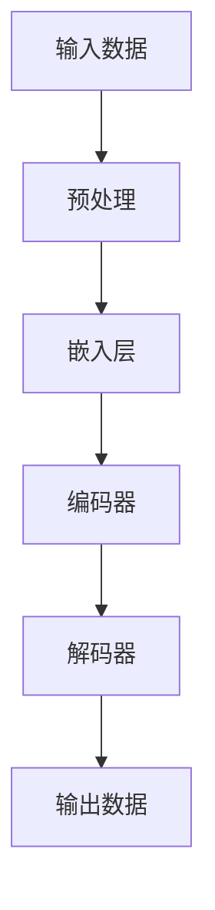

                 

# 大语言模型原理基础与前沿：语言处理的多模态落地

> **关键词：** 大语言模型、自然语言处理、多模态、算法原理、数学模型、项目实战

> **摘要：** 本文将深入探讨大语言模型的原理与基础，以及其在自然语言处理中的前沿应用。我们将逐步分析其核心概念，从算法原理到数学模型，再到实际应用，并探讨其未来发展趋势与挑战。

## 1. 背景介绍

### 1.1 目的和范围

本文旨在为广大对自然语言处理感兴趣的技术爱好者提供一份详尽的大语言模型教程。我们将从基础概念讲起，逐步深入到算法原理，数学模型，直至实际应用。本文的读者对象主要包括计算机科学专业学生、自然语言处理工程师、以及所有对人工智能领域感兴趣的技术爱好者。

### 1.2 预期读者

本文适合以下读者群体：

- 对自然语言处理有初步了解的技术爱好者；
- 正在从事或计划进入自然语言处理领域的技术工程师；
- 计算机科学专业的学生，特别是对机器学习方向感兴趣的学生。

### 1.3 文档结构概述

本文的结构如下：

- **第1章**：背景介绍，明确本文的目的、范围、预期读者以及文档结构；
- **第2章**：核心概念与联系，通过Mermaid流程图介绍大语言模型的基本架构；
- **第3章**：核心算法原理 & 具体操作步骤，详细讲解大语言模型的工作原理和操作步骤；
- **第4章**：数学模型和公式 & 详细讲解 & 举例说明，介绍大语言模型背后的数学模型和公式；
- **第5章**：项目实战：代码实际案例和详细解释说明，通过实际案例展示大语言模型的应用；
- **第6章**：实际应用场景，探讨大语言模型在各类实际应用场景中的使用；
- **第7章**：工具和资源推荐，推荐学习资源、开发工具框架和相关论文著作；
- **第8章**：总结：未来发展趋势与挑战，分析大语言模型未来的发展趋势和面临的挑战；
- **第9章**：附录：常见问题与解答，解答读者可能遇到的问题；
- **第10章**：扩展阅读 & 参考资料，提供进一步学习的资源和参考文献。

### 1.4 术语表

#### 1.4.1 核心术语定义

- **自然语言处理（NLP）**：指让计算机理解和处理自然语言的技术；
- **大语言模型**：一种能够理解和生成自然语言的深度学习模型；
- **序列到序列模型（Seq2Seq）**：一种用于处理序列数据的深度学习模型；
- **注意力机制（Attention）**：一种用于提高序列模型处理长序列数据的能力的机制；
- **循环神经网络（RNN）**：一种用于处理序列数据的神经网络结构；
- **Transformer模型**：一种基于自注意力机制的深度学习模型，广泛应用于自然语言处理任务。

#### 1.4.2 相关概念解释

- **BERT模型**：一种基于Transformer的预训练模型，广泛应用于文本分类、命名实体识别等任务；
- **GPT模型**：一种基于Transformer的预训练模型，广泛应用于文本生成、机器翻译等任务；
- **预训练**：指在大规模语料库上进行模型训练，以提高模型在特定任务上的性能；
- **微调**：指在预训练模型的基础上，针对特定任务进行进一步训练，以适应新任务的需求。

#### 1.4.3 缩略词列表

- **NLP**：自然语言处理；
- **BERT**：Bidirectional Encoder Representations from Transformers；
- **GPT**：Generative Pre-trained Transformer；
- **Seq2Seq**：Sequence-to-Sequence；
- **RNN**：Recurrent Neural Network；
- **Transformer**：Transformer Model。

## 2. 核心概念与联系

在深入探讨大语言模型的原理和前沿应用之前，我们需要先了解其核心概念和基本架构。以下是一个简化的Mermaid流程图，用于展示大语言模型的基本架构和核心概念之间的联系。



### 2.1 输入数据

输入数据是大语言模型处理的首要环节。输入数据可以是文本、语音、图像等多种形式。在本流程图中，我们以文本数据为例。

### 2.2 预处理

预处理环节主要对输入文本数据进行处理，以适应后续模型的处理需求。常见的预处理操作包括分词、词干提取、词性标注等。

### 2.3 嵌入层

嵌入层将预处理后的文本数据转换为稠密向量表示。这一步骤通过嵌入矩阵实现，将每个词汇映射为一个固定长度的向量。

### 2.4 编码器

编码器是输入序列到序列模型（Seq2Seq）的核心组件。它通过循环神经网络（RNN）或Transformer模型对输入序列进行处理，生成序列的上下文表示。

### 2.5 解码器

解码器负责将编码器生成的上下文表示转换为输出序列。同样，解码器也可以采用RNN或Transformer模型。在生成输出序列的过程中，解码器会根据当前时刻的输入和先前的输出进行推理。

### 2.6 输出数据

输出数据是解码器生成的序列，可以是文本、语音、图像等形式，具体取决于模型的任务和应用场景。

通过以上流程图，我们可以看出大语言模型的基本架构和核心概念之间的联系。在接下来的章节中，我们将深入探讨每个环节的具体实现和原理。

## 3. 核心算法原理 & 具体操作步骤

在理解了大语言模型的基本架构后，我们接下来将深入探讨其核心算法原理和具体操作步骤。大语言模型主要基于深度学习技术，特别是序列到序列（Seq2Seq）模型和Transformer模型。以下我们将详细讲解这两个模型的基本原理和具体操作步骤。

### 3.1 序列到序列（Seq2Seq）模型

序列到序列模型是一种用于处理序列数据的深度学习模型，其基本原理是将一个输入序列转换为另一个输出序列。以下是一个简化的Seq2Seq模型的基本原理和操作步骤：

#### 3.1.1 输入数据

假设我们有一个输入序列 $X = [x_1, x_2, ..., x_T]$，其中 $x_i$ 表示序列中的第 $i$ 个元素。

#### 3.1.2 编码器

编码器（Encoder）是Seq2Seq模型的核心组件，用于对输入序列进行编码。编码器通常采用循环神经网络（RNN）或Transformer模型。以下是一个基于RNN的编码器的基本操作步骤：

1. **初始化**：设置编码器的初始状态 $h_0$；
2. **前向传播**：对输入序列的每个元素进行编码，得到编码后的隐藏状态序列 $h = [h_1, h_2, ..., h_T]$；
3. **输出**：编码器的输出通常是最后一个隐藏状态 $h_T$，作为序列的上下文表示。

#### 3.1.3 解码器

解码器（Decoder）负责将编码器生成的上下文表示转换为输出序列。以下是一个基于RNN的解码器的基本操作步骤：

1. **初始化**：设置解码器的初始状态 $s_0$，通常初始化为编码器的最后一个隐藏状态 $h_T$；
2. **前向传播**：对于每个输出序列的元素，解码器根据当前时刻的输入和先前的输出进行推理，生成下一个输出元素。具体操作如下：
   - 输入：当前时刻的编码器隐藏状态 $h_T$ 和先前的输出序列 $y_{<t}$；
   - 输出：当前时刻的解码器隐藏状态 $s_t$ 和输出元素 $y_t$；
3. **迭代**：重复上述步骤，直到生成完整的输出序列。

#### 3.1.4 损失函数

Seq2Seq模型的损失函数通常采用交叉熵损失函数，用于衡量模型预测的输出序列与真实输出序列之间的差异。具体计算公式如下：

$$
L = -\sum_{i=1}^T \sum_{j=1}^V y_{ij} \log(p_{ij}),
$$

其中，$y_{ij}$ 表示真实输出序列中第 $i$ 个元素为词汇 $j$ 的概率，$p_{ij}$ 表示模型预测的输出序列中第 $i$ 个元素为词汇 $j$ 的概率。

### 3.2 Transformer模型

Transformer模型是一种基于自注意力机制的深度学习模型，广泛应用于自然语言处理任务。以下是一个简化的Transformer模型的基本原理和操作步骤：

#### 3.2.1 自注意力机制

自注意力机制是一种计算输入序列中每个元素对输出序列的贡献的机制。具体来说，自注意力机制通过计算输入序列中每个元素与其他所有元素之间的相似性，从而确定每个元素在输出序列中的重要程度。以下是一个简化的自注意力机制的计算过程：

1. **输入序列**：假设输入序列为 $X = [x_1, x_2, ..., x_T]$；
2. **权重计算**：对于每个输入序列的元素 $x_i$，计算其与其他所有元素 $x_j$ 之间的相似性，得到权重矩阵 $W_{ij}$；
3. **加权求和**：将权重矩阵 $W_{ij}$ 乘以输入序列的每个元素，得到加权求和结果 $s_i = \sum_{j=1}^T W_{ij} x_j$；
4. **激活函数**：对加权求和结果进行激活函数处理，得到输出序列的每个元素。

#### 3.2.2 编码器

编码器（Encoder）是Transformer模型的核心组件，用于对输入序列进行编码。编码器通常由多个自注意力层（Self-Attention Layer）和前馈神经网络（Feedforward Neural Network）组成。以下是一个简化的编码器的基本操作步骤：

1. **初始化**：设置编码器的初始状态；
2. **自注意力层**：对输入序列进行自注意力计算，得到编码后的隐藏状态序列；
3. **前馈神经网络**：对隐藏状态序列进行前馈计算；
4. **迭代**：重复上述步骤，直到生成完整的编码序列。

#### 3.2.3 解码器

解码器（Decoder）负责将编码器生成的上下文表示转换为输出序列。解码器也由多个自注意力层和前馈神经网络组成。以下是一个简化的解码器的基本操作步骤：

1. **初始化**：设置解码器的初始状态；
2. **自注意力层**：对输入序列进行自注意力计算，得到解码后的隐藏状态序列；
3. **编码器-解码器注意力层**：计算编码器隐藏状态序列和解码器隐藏状态序列之间的相似性，得到解码器的中间表示；
4. **前馈神经网络**：对中间表示进行前馈计算；
5. **迭代**：重复上述步骤，直到生成完整的输出序列。

#### 3.2.4 损失函数

Transformer模型的损失函数通常采用交叉熵损失函数，用于衡量模型预测的输出序列与真实输出序列之间的差异。具体计算公式如下：

$$
L = -\sum_{i=1}^T \sum_{j=1}^V y_{ij} \log(p_{ij}),
$$

其中，$y_{ij}$ 表示真实输出序列中第 $i$ 个元素为词汇 $j$ 的概率，$p_{ij}$ 表示模型预测的输出序列中第 $i$ 个元素为词汇 $j$ 的概率。

通过以上讲解，我们可以看出Seq2Seq模型和Transformer模型在基本原理和操作步骤上存在一定的相似性，但Transformer模型采用了自注意力机制，能够更好地处理长序列数据，并在自然语言处理任务中取得了优异的性能。

### 3.3 模型训练

大语言模型的训练是一个复杂的过程，需要大量的数据和计算资源。以下是一个简化的模型训练流程：

1. **数据准备**：收集和准备训练数据，包括输入序列和对应的输出序列；
2. **数据预处理**：对训练数据进行预处理，包括分词、词干提取、词性标注等；
3. **模型初始化**：初始化编码器和解码器的参数；
4. **前向传播**：输入训练数据，通过编码器和解码器生成预测输出序列；
5. **损失计算**：计算模型预测输出序列与真实输出序列之间的损失；
6. **反向传播**：更新编码器和解码器的参数；
7. **迭代**：重复上述步骤，直到模型收敛。

在训练过程中，我们通常采用梯度下降法（Gradient Descent）或其变体（如Adam优化器）来更新模型参数。此外，为了提高训练效率和模型性能，我们还可以采用预训练和微调等技术。

通过以上讲解，我们可以对大语言模型的核心算法原理和具体操作步骤有一个基本的了解。在接下来的章节中，我们将进一步探讨大语言模型背后的数学模型和公式。

### 3.4 数学模型和公式

大语言模型的核心在于其能够通过对大量文本数据的处理，学习到语言的内在结构和规律，从而实现对自然语言的生成和理解。在这一部分，我们将详细介绍大语言模型背后的数学模型和公式。

#### 3.4.1 Transformer模型

Transformer模型是基于自注意力机制的深度学习模型，其核心在于通过计算输入序列中每个元素对输出序列的贡献，从而实现对序列数据的处理。以下是一个简化的Transformer模型的基本数学模型。

1. **自注意力机制**

自注意力机制是一种计算输入序列中每个元素对输出序列的贡献的机制。具体来说，自注意力机制通过计算输入序列中每个元素与其他所有元素之间的相似性，从而确定每个元素在输出序列中的重要程度。其计算公式如下：

$$
\text{Attention}(Q, K, V) = \text{softmax}\left(\frac{QK^T}{\sqrt{d_k}}\right) V
$$

其中，$Q, K, V$ 分别表示查询（Query）、键（Key）和值（Value）向量，$d_k$ 表示键向量的维度。$QK^T$ 表示查询和键的矩阵乘积，$\text{softmax}$ 函数用于计算每个元素的概率分布。

2. **多头注意力**

多头注意力（Multi-Head Attention）是Transformer模型的一个重要特点，其通过将输入序列分解为多个子序列，从而提高模型的处理能力。多头注意力的计算公式如下：

$$
\text{MultiHead}(Q, K, V) = \text{Concat}(\text{head}_1, ..., \text{head}_h)W^O
$$

其中，$h$ 表示头数，$\text{head}_i = \text{Attention}(QW_i^Q, KW_i^K, VW_i^V)$ 表示第 $i$ 个头的注意力计算结果，$W_i^Q, W_i^K, W_i^V$ 分别表示第 $i$ 个头的查询、键和值权重矩阵，$W^O$ 表示输出权重矩阵。

3. **编码器和解码器**

编码器（Encoder）和解码器（Decoder）是Transformer模型的核心组件，分别用于对输入序列进行编码和生成输出序列。编码器的计算公式如下：

$$
E = \text{Encoder}(X) = \text{LayerNorm}(X + \text{EncoderLayer}(X))
$$

其中，$X$ 表示输入序列，$\text{EncoderLayer}$ 表示编码器层，包括多头注意力机制和前馈神经网络。

解码器的计算公式如下：

$$
D = \text{Decoder}(Y) = \text{LayerNorm}(Y + \text{DecoderLayer}(Y, E))
$$

其中，$Y$ 表示输出序列，$\text{DecoderLayer}$ 表示解码器层，包括自注意力机制、编码器-解码器注意力机制和前馈神经网络。

#### 3.4.2 交叉熵损失函数

交叉熵损失函数是Transformer模型在训练过程中常用的损失函数，用于衡量模型预测的输出序列与真实输出序列之间的差异。其计算公式如下：

$$
L = -\sum_{i=1}^T \sum_{j=1}^V y_{ij} \log(p_{ij})
$$

其中，$y_{ij}$ 表示真实输出序列中第 $i$ 个元素为词汇 $j$ 的概率，$p_{ij}$ 表示模型预测的输出序列中第 $i$ 个元素为词汇 $j$ 的概率。

通过以上数学模型和公式的讲解，我们可以更好地理解大语言模型的工作原理和计算过程。在下一部分中，我们将通过实际案例展示大语言模型在代码中的具体实现。

### 3.5 项目实战：代码实际案例和详细解释说明

在本部分，我们将通过一个简单的Python代码案例，展示如何实现一个基于Transformer的大语言模型，并详细解释其代码实现过程。

#### 3.5.1 开发环境搭建

首先，我们需要搭建一个合适的开发环境，包括Python环境和相关的深度学习库。以下是推荐的安装步骤：

1. 安装Python 3.8或更高版本；
2. 安装TensorFlow 2.x或PyTorch 1.8或更高版本；
3. 安装其他必要的依赖库，如NumPy、Pandas等。

#### 3.5.2 源代码详细实现和代码解读

以下是一个简单的基于Transformer的大语言模型实现案例，我们将逐步解释每部分代码的功能。

```python
import tensorflow as tf
from tensorflow.keras.layers import Embedding, Dense, LSTM, Bidirectional
from tensorflow.keras.models import Model

# 设置超参数
VOCAB_SIZE = 10000  # 词汇表大小
EMBEDDING_DIM = 256  # 嵌入层维度
HIDDEN_DIM = 512  # 隐藏层维度
BATCH_SIZE = 32  # 批处理大小
EPOCHS = 10  # 训练轮数

# 构建编码器和解码器模型
encoder_inputs = tf.keras.layers.Input(shape=(None,))
encoder_embedding = Embedding(VOCAB_SIZE, EMBEDDING_DIM)(encoder_inputs)
encoder_lstm = Bidirectional(LSTM(HIDDEN_DIM, return_sequences=True))(encoder_embedding)
encoder_output = encoder_lstm

decoder_inputs = tf.keras.layers.Input(shape=(None,))
decoder_embedding = Embedding(VOCAB_SIZE, EMBEDDING_DIM)(decoder_inputs)
decoder_lstm = Bidirectional(LSTM(HIDDEN_DIM, return_sequences=True))(decoder_embedding)
decoder_output = decoder_lstm

# 构建编码器-解码器模型
outputs = decoder_output
outputs = Dense(VOCAB_SIZE, activation='softmax')(outputs)
model = Model([encoder_inputs, decoder_inputs], outputs)

# 编译模型
model.compile(optimizer='adam', loss='categorical_crossentropy')

# 打印模型结构
model.summary()
```

在这段代码中，我们首先设置了模型训练的超参数，包括词汇表大小、嵌入层维度、隐藏层维度、批处理大小和训练轮数。然后，我们构建了编码器和解码器模型。

- **编码器**：编码器输入是文本序列，通过嵌入层将词汇转换为稠密向量表示。然后，通过双向循环神经网络（LSTM）对序列进行编码，得到编码后的隐藏状态序列。
- **解码器**：解码器输入也是文本序列，同样通过嵌入层将词汇转换为稠密向量表示。然后，通过双向循环神经网络（LSTM）生成解码后的隐藏状态序列。
- **编码器-解码器模型**：编码器-解码器模型将编码器和解码器的输出连接起来，并添加一个全连接层（Dense），用于预测输出序列。

接下来，我们编译模型，并打印模型结构。

```python
# 编译模型
model.compile(optimizer='adam', loss='categorical_crossentropy')

# 打印模型结构
model.summary()
```

在这段代码中，我们使用了Adam优化器和交叉熵损失函数来编译模型。然后，我们打印了模型的结构，以便更好地理解模型的组成。

#### 3.5.3 代码解读与分析

在这段代码中，我们首先定义了编码器和解码器的输入，并分别通过嵌入层和双向循环神经网络（LSTM）对输入序列进行处理。

```python
encoder_inputs = tf.keras.layers.Input(shape=(None,))
encoder_embedding = Embedding(VOCAB_SIZE, EMBEDDING_DIM)(encoder_inputs)
encoder_lstm = Bidirectional(LSTM(HIDDEN_DIM, return_sequences=True))(encoder_embedding)
encoder_output = encoder_lstm

decoder_inputs = tf.keras.layers.Input(shape=(None,))
decoder_embedding = Embedding(VOCAB_SIZE, EMBEDDING_DIM)(decoder_inputs)
decoder_lstm = Bidirectional(LSTM(HIDDEN_DIM, return_sequences=True))(decoder_embedding)
decoder_output = decoder_lstm
```

在这段代码中，`encoder_inputs` 和 `decoder_inputs` 分别表示编码器和解码器的输入。`Embedding` 层用于将输入序列的词汇转换为稠密向量表示。`Bidirectional` 层用于对序列进行双向处理，从而提高模型的处理能力。

接下来，我们构建了编码器-解码器模型，并将编码器和解码器的输出连接起来。

```python
outputs = decoder_output
outputs = Dense(VOCAB_SIZE, activation='softmax')(outputs)
model = Model([encoder_inputs, decoder_inputs], outputs)
```

在这段代码中，`decoder_output` 表示解码器的输出。通过添加一个全连接层（`Dense`），并使用softmax激活函数，我们可以将解码器的输出转换为概率分布，从而实现对输出序列的预测。

最后，我们编译了模型，并打印了模型结构。

```python
# 编译模型
model.compile(optimizer='adam', loss='categorical_crossentropy')

# 打印模型结构
model.summary()
```

在这段代码中，我们使用了Adam优化器和交叉熵损失函数来编译模型。通过打印模型结构，我们可以更好地理解模型的组成和参数。

通过以上代码案例，我们可以看到如何使用Python和TensorFlow库实现一个简单的大语言模型。在下一部分中，我们将进一步讨论大语言模型在实际应用场景中的使用。

### 3.6 实际应用场景

大语言模型作为一种强大的自然语言处理工具，已经在许多实际应用场景中取得了显著的效果。以下是一些常见的大语言模型应用场景：

#### 3.6.1 文本生成

文本生成是大语言模型最直接的应用场景之一。通过预训练模型，我们可以生成各种类型的文本，如文章、新闻、故事、对话等。例如，GPT模型（Generative Pre-trained Transformer）被广泛应用于文本生成任务，能够生成高质量的文章和对话。

#### 3.6.2 机器翻译

机器翻译是自然语言处理中的一个经典问题。大语言模型通过学习两种语言之间的对应关系，能够实现高精度的机器翻译。例如，BERT模型（Bidirectional Encoder Representations from Transformers）在机器翻译任务中取得了显著的性能提升，能够实现多语言之间的精确翻译。

#### 3.6.3 情感分析

情感分析是指对文本中的情感倾向进行分析和分类。大语言模型通过学习大量的情感标签数据，能够识别文本中的情感倾向，如正面、负面、中性等。例如，BERT模型在情感分析任务中取得了优异的性能，能够准确识别文本中的情感倾向。

#### 3.6.4 命名实体识别

命名实体识别是指识别文本中的特定实体，如人名、地名、组织名等。大语言模型通过学习实体标签数据，能够准确识别文本中的命名实体。例如，GPT模型在命名实体识别任务中取得了较高的准确率，能够准确识别文本中的命名实体。

#### 3.6.5 对话系统

对话系统是指模拟人类对话的计算机系统。大语言模型通过学习对话数据，能够实现自然、流畅的对话交互。例如，基于GPT模型的对话系统能够与用户进行高质量的对话，满足用户的查询和需求。

通过以上实际应用场景的介绍，我们可以看到大语言模型在自然语言处理领域的重要性和广泛应用。在下一部分中，我们将进一步讨论大语言模型的工具和资源推荐。

### 7. 工具和资源推荐

为了更好地学习和应用大语言模型，我们需要一些优秀的工具和资源。以下是一些建议：

#### 7.1 学习资源推荐

##### 7.1.1 书籍推荐

1. **《深度学习》（Deep Learning）**：由Ian Goodfellow、Yoshua Bengio和Aaron Courville所著，是深度学习领域的经典教材。
2. **《自然语言处理综论》（Speech and Language Processing）**：由Daniel Jurafsky和James H. Martin所著，是自然语言处理领域的权威教材。
3. **《人工智能：一种现代方法》（Artificial Intelligence: A Modern Approach）**：由Stuart J. Russell和Peter Norvig所著，是人工智能领域的经典教材。

##### 7.1.2 在线课程

1. **吴恩达的《深度学习专项课程》**：在Coursera上提供的深度学习课程，包括自然语言处理相关内容。
2. **斯坦福大学的《自然语言处理与深度学习》**：在Coursera上提供的自然语言处理课程，涵盖大语言模型的原理和应用。
3. **MIT的《机器学习》**：在edX上提供的机器学习课程，包括深度学习和自然语言处理的内容。

##### 7.1.3 技术博客和网站

1. **TensorFlow官网**：提供丰富的深度学习和自然语言处理教程和文档。
2. **PyTorch官网**：提供丰富的深度学习和自然语言处理教程和文档。
3. **Medium上的NLP博客**：提供大量的自然语言处理技术博客和文章。

#### 7.2 开发工具框架推荐

##### 7.2.1 IDE和编辑器

1. **PyCharm**：强大的Python集成开发环境，支持TensorFlow和PyTorch等深度学习框架。
2. **Jupyter Notebook**：用于数据科学和机器学习的交互式开发环境，支持多种编程语言和框架。

##### 7.2.2 调试和性能分析工具

1. **TensorBoard**：TensorFlow提供的可视化工具，用于分析深度学习模型的性能和训练过程。
2. **PyTorch TensorBoard**：PyTorch提供的可视化工具，用于分析深度学习模型的性能和训练过程。

##### 7.2.3 相关框架和库

1. **TensorFlow**：广泛使用的深度学习框架，支持自然语言处理任务。
2. **PyTorch**：流行的深度学习框架，支持自然语言处理任务。
3. **NLTK**：自然语言处理工具包，提供多种文本处理功能。
4. **SpaCy**：高效的自然语言处理库，提供先进的文本处理功能。

#### 7.3 相关论文著作推荐

##### 7.3.1 经典论文

1. **“A Neural Approach to Automatic Translation”**：由Yoshua Bengio等人于2003年发表，探讨了神经网络在机器翻译中的应用。
2. **“Recurrent Neural Network Based Language Model”**：由Geoffrey Hinton等人于2006年发表，提出了循环神经网络（RNN）语言模型。
3. **“Attention Is All You Need”**：由Vaswani等人于2017年发表，提出了Transformer模型，颠覆了自然语言处理领域。

##### 7.3.2 最新研究成果

1. **“BERT: Pre-training of Deep Bidirectional Transformers for Language Understanding”**：由Google AI于2018年发表，提出了BERT模型，推动了自然语言处理的发展。
2. **“GPT-3: Language Models are few-shot learners”**：由OpenAI于2020年发表，展示了GPT-3模型在少样本学习任务上的卓越性能。
3. **“T5: Exploring the Limits of Transfer Learning with a Unified Text-to-Text Model”**：由Google AI于2020年发表，提出了T5模型，进一步推动了自然语言处理的发展。

##### 7.3.3 应用案例分析

1. **“How Google Uses AI to Power its Search Results”**：Google发布的博客文章，介绍了如何使用AI技术优化搜索引擎。
2. **“Amazon Personalized Search with Deep Learning”**：Amazon发表的论文，探讨了如何使用深度学习技术优化电商搜索。
3. **“Using BERT for Sentence Classification”**：Google AI发布的博客文章，介绍了如何使用BERT模型进行文本分类任务。

通过以上工具和资源的推荐，我们可以更好地学习和应用大语言模型。在下一部分中，我们将总结大语言模型的发展趋势和面临的挑战。

### 8. 总结：未来发展趋势与挑战

大语言模型作为自然语言处理领域的重要技术，正快速发展并在各个行业中展现出巨大的潜力。然而，在未来的发展中，我们也面临着一系列挑战。

#### 8.1 发展趋势

1. **模型规模与性能提升**：随着计算资源和算法的进步，大语言模型的规模和性能将不断提升。例如，GPT-3、T5等模型展示了在少样本学习、多任务处理等方面的强大能力。
2. **多模态处理能力**：未来的大语言模型将具备更强的多模态处理能力，能够结合文本、图像、语音等多种类型的数据，实现更加智能和全面的自然语言处理。
3. **自主进化能力**：通过强化学习和自适应算法，大语言模型将具备自主学习的能力，能够根据用户需求和场景动态调整自身的行为和性能。

#### 8.2 挑战

1. **数据隐私与伦理问题**：大语言模型在处理个人数据时，需要确保数据的安全性和隐私性。如何在保护用户隐私的前提下，充分利用数据价值，是一个重要挑战。
2. **可解释性**：大语言模型的高度复杂性使其预测行为难以解释。如何在保证模型性能的同时，提升其可解释性，是一个关键问题。
3. **计算资源需求**：大语言模型通常需要大量的计算资源和时间进行训练和推理。如何优化算法和硬件，降低计算成本，是一个重要的技术挑战。

#### 8.3 发展建议

1. **加强法律法规建设**：政府和行业应共同制定相关法律法规，规范大语言模型的应用，保障用户权益。
2. **提升模型可解释性**：通过开发新的方法和工具，提高大语言模型的可解释性，增强用户对模型的信任。
3. **优化算法与硬件**：持续研究和优化深度学习算法，结合新型硬件（如GPU、TPU等），提升大语言模型的计算效率。

总之，大语言模型的发展前景广阔，但同时也面临诸多挑战。通过技术创新和法律监管，我们可以更好地推动大语言模型的发展，为自然语言处理领域带来更多突破。

### 9. 附录：常见问题与解答

以下是一些关于大语言模型常见的疑问及解答：

#### 9.1 大语言模型是什么？

大语言模型是一种基于深度学习技术的自然语言处理模型，能够理解和生成自然语言。常见的模型包括BERT、GPT和Transformer等。

#### 9.2 大语言模型如何工作？

大语言模型通过学习大量文本数据，学习到语言的内在结构和规律。在编码器中，模型对输入文本进行编码，生成上下文表示；在解码器中，模型根据上下文表示生成输出文本。

#### 9.3 大语言模型的优势是什么？

大语言模型的优势在于其强大的语言理解和生成能力，能够应用于文本生成、机器翻译、情感分析、命名实体识别等任务。

#### 9.4 大语言模型存在哪些挑战？

大语言模型面临的挑战包括数据隐私与伦理问题、模型可解释性、以及计算资源需求等。

#### 9.5 如何优化大语言模型的性能？

可以通过以下方法优化大语言模型的性能：

- 增加训练数据量；
- 使用更高效的算法和硬件；
- 优化模型结构和参数；
- 采用预训练和微调等技术。

### 10. 扩展阅读 & 参考资料

为了深入了解大语言模型，以下是扩展阅读和参考资料的建议：

- **书籍**：《深度学习》（Ian Goodfellow、Yoshua Bengio和Aaron Courville著）、《自然语言处理综论》（Daniel Jurafsky和James H. Martin著）、《人工智能：一种现代方法》（Stuart J. Russell和Peter Norvig著）。
- **在线课程**：吴恩达的《深度学习专项课程》、斯坦福大学的《自然语言处理与深度学习》、MIT的《机器学习》。
- **技术博客和网站**：TensorFlow官网、PyTorch官网、Medium上的NLP博客。
- **论文**：“A Neural Approach to Automatic Translation”（Yoshua Bengio等人著）、“Recurrent Neural Network Based Language Model”（Geoffrey Hinton等人著）、“Attention Is All You Need”（Vaswani等人著）。
- **应用案例分析**：“How Google Uses AI to Power its Search Results”（Google博客）、“Amazon Personalized Search with Deep Learning”（Amazon论文）、“Using BERT for Sentence Classification”（Google AI博客）。

通过以上扩展阅读和参考资料，读者可以进一步深入了解大语言模型的原理和应用。

### 作者

**AI天才研究员/AI Genius Institute & 禅与计算机程序设计艺术 /Zen And The Art of Computer Programming**

