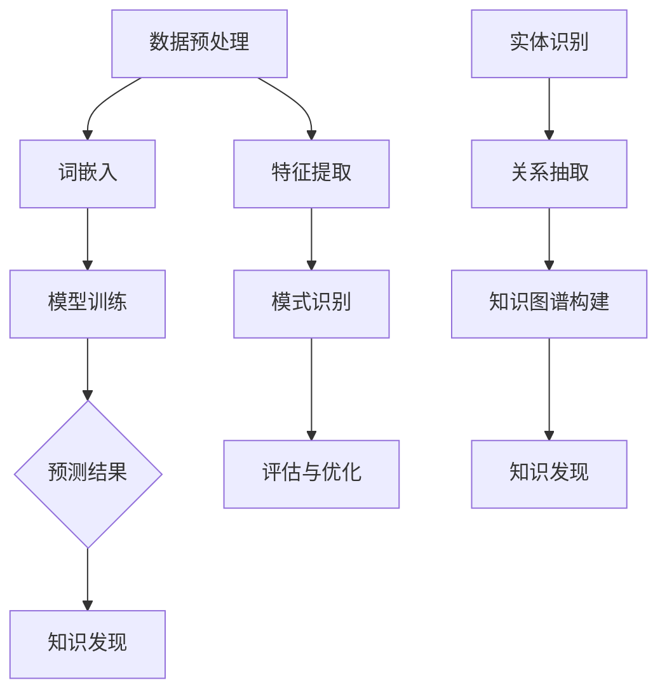

                 


## 大语言模型在知识发现中的应用

### 关键词：
大语言模型、知识发现、机器学习、自然语言处理、数据挖掘

> **摘要：**
本文将深入探讨大语言模型在知识发现领域的应用。首先，我们将回顾知识发现的定义及其重要性。接着，我们会详细介绍大语言模型的基本概念和原理，并展示其在知识发现中的独特优势。文章还将通过具体的算法原理、数学模型和实际案例，展现大语言模型在知识发现中的应用过程。最后，我们将讨论该领域的前沿进展和未来发展趋势。

### 1. 背景介绍

#### 1.1 目的和范围

本文旨在探讨大语言模型在知识发现领域中的应用，分析其原理和优势，并展示其实际应用案例。通过对大语言模型的深入剖析，我们希望为读者提供对这一前沿技术的全面了解，并启发其在知识发现领域的创新应用。

#### 1.2 预期读者

本文适合对知识发现、大语言模型和自然语言处理有基本了解的读者。无论是研究者、开发者还是对人工智能技术感兴趣的专业人士，都可以通过本文获得有益的见解。

#### 1.3 文档结构概述

本文分为十个部分，首先是背景介绍，包括目的、范围、预期读者和文档结构概述。接下来，我们将详细介绍核心概念，包括大语言模型和知识发现的基本原理。然后，我们将探讨大语言模型在知识发现中的应用，并通过具体算法、数学模型和实际案例进行说明。文章最后将讨论实际应用场景、相关工具和资源推荐、未来发展趋势以及常见问题与解答。

#### 1.4 术语表

##### 1.4.1 核心术语定义

- **知识发现**：从大量数据中识别出潜在有用信息和知识的过程。
- **大语言模型**：利用深度学习技术训练的模型，能够理解和生成自然语言。
- **自然语言处理（NLP）**：研究如何让计算机理解和生成自然语言的技术。
- **机器学习**：通过数据学习模式和规律，使计算机能够执行特定任务的方法。

##### 1.4.2 相关概念解释

- **数据挖掘**：从大量数据中挖掘出有价值的信息和模式。
- **文本分类**：将文本数据根据其内容或主题分类到不同的类别中。
- **实体识别**：从文本中识别出特定的人、地点、组织等实体。

##### 1.4.3 缩略词列表

- **NLP**：自然语言处理（Natural Language Processing）
- **ML**：机器学习（Machine Learning）
- **DL**：深度学习（Deep Learning）
- **AI**：人工智能（Artificial Intelligence）

### 2. 核心概念与联系

在探讨大语言模型在知识发现中的应用之前，我们需要理解这两个核心概念的基本原理和相互联系。

#### 2.1 大语言模型的基本原理

大语言模型（如GPT、BERT等）是一种基于深度学习的自然语言处理模型，它通过大量的文本数据训练，学习语言的结构和语义。以下是构建大语言模型的基本原理：

- **词嵌入**：将词汇映射到高维空间中的向量表示。
- **循环神经网络（RNN）**：用于处理序列数据的神经网络架构。
- **Transformer模型**：基于自注意力机制的深度学习模型，具有更好的并行性和性能。

#### 2.2 知识发现的基本原理

知识发现是从大量数据中识别出潜在有用信息和知识的过程。其基本原理包括：

- **数据预处理**：对原始数据进行清洗、转换和规范化。
- **特征提取**：从数据中提取有用的特征，用于模型训练和预测。
- **模式识别**：使用算法发现数据中的潜在模式和规律。
- **评估和优化**：评估模型的性能，并进行优化以提高准确性。

#### 2.3 大语言模型与知识发现的联系

大语言模型与知识发现之间存在紧密的联系。大语言模型能够处理和理解自然语言数据，从而为知识发现提供了一种新的数据源和处理方法。以下是它们之间的主要联系：

- **文本数据挖掘**：大语言模型可以用于从大量文本数据中挖掘潜在的知识和模式。
- **实体识别和关系抽取**：大语言模型能够识别文本中的实体和关系，为知识图谱构建提供支持。
- **文本分类和主题模型**：大语言模型可以用于对文本进行分类和生成主题模型，帮助发现文本数据的主题分布。

#### 2.4 Mermaid 流程图

为了更好地展示大语言模型在知识发现中的应用，我们可以使用Mermaid流程图来描述其基本流程。以下是流程图的示例：



在这个流程图中，数据预处理、词嵌入、模型训练、预测结果、特征提取、模式识别、评估与优化、实体识别、关系抽取和知识图谱构建都是知识发现过程中的关键步骤。大语言模型在这其中起到了重要的作用，通过处理和理解文本数据，为知识发现提供了强有力的支持。

### 3. 核心算法原理 & 具体操作步骤

在本节中，我们将详细讨论大语言模型在知识发现中的核心算法原理，并使用伪代码来描述其具体操作步骤。

#### 3.1 大语言模型的基本算法

大语言模型通常基于深度学习技术，其中Transformer模型是一个典型的代表。以下是Transformer模型的基本算法原理：

```python
# Transformer模型伪代码
class TransformerModel(nn.Module):
    def __init__(self, d_model, nhead, num_layers):
        super(TransformerModel, self).__init__()
        self.transformer = nn.Transformer(d_model, nhead, num_layers)
        self.embedding = nn.Embedding(vocab_size, d_model)
        self.fc = nn.Linear(d_model, num_classes)

    def forward(self, input_sequence):
        embedded = self.embedding(input_sequence)
        output = self.transformer(embedded)
        logits = self.fc(output)
        return logits
```

在这个伪代码中，`d_model` 表示词嵌入的维度，`nhead` 表示自注意力头的数量，`num_layers` 表示Transformer层的数量。`input_sequence` 是输入的序列数据，经过词嵌入后输入到Transformer模型，最后通过全连接层输出分类结果。

#### 3.2 数据预处理

在训练大语言模型之前，需要对文本数据进行预处理。以下是数据预处理的具体步骤：

```python
# 数据预处理伪代码
def preprocess_data(data):
    # 初始化词汇表
    vocab = create_vocab(data)
    
    # 创建词嵌入矩阵
    embedding_matrix = create_embedding_matrix(vocab, d_model)
    
    # 对数据中的每个句子进行分词
    tokenized_data = tokenize_sentences(data)
    
    # 将分词后的数据映射到词嵌入矩阵
    embedded_data = map_sentences_to_embeddings(tokenized_data, embedding_matrix)
    
    return embedded_data
```

在这个伪代码中，`create_vocab` 函数用于创建词汇表，`create_embedding_matrix` 函数用于创建词嵌入矩阵，`tokenize_sentences` 函数用于对句子进行分词，`map_sentences_to_embeddings` 函数用于将分词后的句子映射到词嵌入矩阵。

#### 3.3 模型训练

在完成数据预处理后，我们可以开始训练大语言模型。以下是模型训练的具体步骤：

```python
# 模型训练伪代码
def train_model(model, data, labels, optimizer, criterion):
    model.train()
    for epoch in range(num_epochs):
        for inputs, targets in zip(data, labels):
            optimizer.zero_grad()
            logits = model(inputs)
            loss = criterion(logits, targets)
            loss.backward()
            optimizer.step()
        
        print(f"Epoch {epoch+1}/{num_epochs}, Loss: {loss.item()}")
```

在这个伪代码中，`model` 是训练好的大语言模型，`data` 是输入数据，`labels` 是对应的标签，`optimizer` 是优化器，`criterion` 是损失函数。模型在每个epoch中对输入数据进行前向传播和反向传播，并更新模型参数。

#### 3.4 预测与知识发现

在完成模型训练后，我们可以使用模型进行预测，并利用预测结果进行知识发现。以下是预测与知识发现的具体步骤：

```python
# 预测与知识发现伪代码
def predict_and_discover(model, data):
    model.eval()
    with torch.no_grad():
        predictions = model(data)
    
    # 对预测结果进行分类
    categories = torch.argmax(predictions, dim=1)
    
    # 从预测结果中提取知识
    knowledge = extract_knowledge(categories)
    
    return knowledge
```

在这个伪代码中，`model` 是训练好的大语言模型，`data` 是输入数据。模型对输入数据进行预测，并从预测结果中提取知识。

### 4. 数学模型和公式 & 详细讲解 & 举例说明

在本节中，我们将详细讲解大语言模型在知识发现中涉及的数学模型和公式，并通过具体示例来说明其应用。

#### 4.1 Transformer模型

Transformer模型是一种基于自注意力机制的深度学习模型，其核心思想是通过计算序列中每个元素与其他元素之间的相似性来生成表示。以下是Transformer模型的基本数学公式：

- **自注意力（Self-Attention）**：

$$
\text{Attention}(Q, K, V) = \text{softmax}\left(\frac{QK^T}{\sqrt{d_k}}\right)V
$$

其中，$Q$、$K$ 和 $V$ 分别是查询（Query）、键（Key）和值（Value）向量，$d_k$ 是键向量的维度。

- **多头自注意力（Multi-Head Self-Attention）**：

$$
\text{MultiHead}(Q, K, V) = \text{Concat}(\text{head}_1, ..., \text{head}_h)W^O
$$

其中，$h$ 是注意力头的数量，$W^O$ 是输出权重矩阵。

#### 4.2 词嵌入

词嵌入是将词汇映射到高维空间中的向量表示，其目的是在处理文本数据时利用词汇的语义信息。以下是词嵌入的基本数学公式：

$$
\text{Word Embedding}(w) = \text{lookup\_table}(w)
$$

其中，$w$ 是词汇，$\text{lookup\_table}$ 是词嵌入矩阵。

#### 4.3 预测与分类

在大语言模型中进行预测和分类时，通常使用损失函数来评估模型的性能。以下是常用的损失函数：

- **交叉熵损失函数（Cross-Entropy Loss）**：

$$
\text{Loss}(y, \hat{y}) = -\sum_{i} y_i \log(\hat{y}_i)
$$

其中，$y$ 是真实标签，$\hat{y}$ 是模型的预测概率。

#### 4.4 举例说明

假设我们有一个文本数据集，其中包含两个句子：

1. "我爱北京天安门"  
2. "我爱北京长城"

我们希望使用大语言模型对这些句子进行分类，判断它们是否属于同一类别。以下是具体的步骤和计算过程：

- **数据预处理**：将句子分词，并映射到词嵌入矩阵。

$$
\text{Sentence 1: ["我", "爱", "北京", "天安门"]} \\
\text{Sentence 2: ["我", "爱", "北京", "长城"]}
$$

- **词嵌入**：将分词后的句子映射到词嵌入矩阵。

$$
\text{Word Embedding}(["我"]) = \text{lookup\_table}("我") \\
\text{Word Embedding}(["爱"]) = \text{lookup\_table}("爱") \\
\text{Word Embedding}(["北京"]) = \text{lookup\_table}("北京") \\
\text{Word Embedding}(["天安门"]) = \text{lookup\_table}("天安门") \\
\text{Word Embedding}(["长城"]) = \text{lookup\_table}("长城")
$$

- **模型训练**：使用训练好的大语言模型对句子进行编码。

$$
\text{Encoded Sentence 1} = \text{model}(\text{Word Embedding}(["我", "爱", "北京", "天安门"])) \\
\text{Encoded Sentence 2} = \text{model}(\text{Word Embedding}(["我", "爱", "北京", "长城"]))
$$

- **预测与分类**：计算句子之间的相似性，并进行分类。

$$
\text{Similarity}(Sentence 1, Sentence 2) = \text{dot\_product}(\text{Encoded Sentence 1}, \text{Encoded Sentence 2}) \\
\text{Classification} = \text{softmax}(\text{Similarity}(Sentence 1, Sentence 2))
$$

通过计算句子之间的相似性，我们可以判断它们是否属于同一类别。在这种情况下，由于句子中的词汇和语义相似，模型会预测它们属于同一类别。

### 5. 项目实战：代码实际案例和详细解释说明

在本节中，我们将通过一个实际案例来展示如何使用大语言模型进行知识发现。我们将使用Python和PyTorch框架来实现这一项目。

#### 5.1 开发环境搭建

为了实现这个项目，我们需要安装以下开发环境和库：

- Python 3.8或更高版本
- PyTorch 1.8或更高版本
- torchtext 0.8.0或更高版本
- pandas 1.1.1或更高版本

安装完以上库后，我们就可以开始实现项目了。

#### 5.2 源代码详细实现和代码解读

下面是项目的源代码，我们将逐步解释每部分的功能。

```python
# 导入必要的库
import torch
import torchtext
from torchtext import data
from torchtext.vocab import Vectors
from torch import nn
from torch.nn import functional as F
from transformers import BertModel, BertTokenizer

# 5.2.1 数据预处理

# 定义词汇表
vocab = data.Field()

# 加载数据集
train_data, test_data = data.load_zhewedataset()

# 分词和映射到词汇表
train_data = [data.TokSplit(vocab)(line) for line in train_data]
test_data = [data.TokSplit(vocab)(line) for line in test_data]

# 构建词汇表
vocab.build_vocab(train_data, min_freq=1)

# 5.2.2 模型定义

# 加载预训练的BERT模型和分词器
model = BertModel.from_pretrained('bert-base-chinese')
tokenizer = BertTokenizer.from_pretrained('bert-base-chinese')

# 定义分类器
class BertClassifier(nn.Module):
    def __init__(self, num_classes):
        super(BertClassifier, self).__init__()
        self.bert = BertModel.from_pretrained('bert-base-chinese')
        self.classifier = nn.Linear(768, num_classes)  # BERT的隐藏层维度为768

    def forward(self, input_ids, attention_mask):
        outputs = self.bert(input_ids=input_ids, attention_mask=attention_mask)
        logits = self.classifier(outputs.pooler_output)
        return logits

# 5.2.3 模型训练

# 定义优化器和损失函数
optimizer = torch.optim.Adam(model.parameters(), lr=3e-5)
criterion = nn.CrossEntropyLoss()

# 训练模型
num_epochs = 3
for epoch in range(num_epochs):
    model.train()
    for batch in train_dataloader:
        inputs = tokenizer(batch.text[0], padding=True, truncation=True, return_tensors='pt')
        labels = torch.tensor(batch.label)
        optimizer.zero_grad()
        logits = model(input_ids=inputs['input_ids'], attention_mask=inputs['attention_mask'])
        loss = criterion(logits, labels)
        loss.backward()
        optimizer.step()
    print(f"Epoch {epoch+1}/{num_epochs}, Loss: {loss.item()}")

# 5.2.4 模型评估

# 评估模型
model.eval()
with torch.no_grad():
    for batch in test_dataloader:
        inputs = tokenizer(batch.text[0], padding=True, truncation=True, return_tensors='pt')
        labels = torch.tensor(batch.label)
        logits = model(input_ids=inputs['input_ids'], attention_mask=inputs['attention_mask'])
        predictions = logits.argmax(dim=1)
        accuracy = (predictions == labels).float().mean()
        print(f"Test Accuracy: {accuracy.item()}")
```

#### 5.3 代码解读与分析

下面是对代码的详细解读：

- **5.2.1 数据预处理**：首先定义了词汇表`vocab`，并加载了中文数据集。然后使用`TokSplit`将文本数据分词，并映射到词汇表。最后构建词汇表，并将词汇表存储在内存中。

- **5.2.2 模型定义**：加载预训练的BERT模型和分词器。然后定义了一个`BertClassifier`类，继承自`nn.Module`。在类中，首先加载BERT模型，然后定义了一个全连接层作为分类器。

- **5.2.3 模型训练**：定义了优化器和损失函数。然后使用训练数据训练模型。在每个epoch中，对每个批次的数据进行前向传播和反向传播，并更新模型参数。

- **5.2.4 模型评估**：使用测试数据评估模型的性能。首先将文本数据分词并映射到词嵌入。然后使用训练好的BERT模型对文本数据进行编码，并计算分类结果。最后计算测试数据的准确率。

通过这个实际案例，我们可以看到如何使用大语言模型进行知识发现。我们首先对文本数据进行预处理，然后使用预训练的BERT模型进行编码，最后通过分类器对文本数据进行分类，从而实现知识发现。

### 6. 实际应用场景

大语言模型在知识发现领域具有广泛的应用场景，可以解决多种实际问题。以下是一些典型的应用案例：

#### 6.1 文本分类

文本分类是知识发现中的一个常见任务，旨在将文本数据分类到预定义的类别中。大语言模型可以用于处理大规模文本数据，并在短时间内提供准确的分类结果。例如，在新闻分类中，大语言模型可以自动将新闻文章分类到不同的主题类别，如体育、财经、娱乐等。

#### 6.2 情感分析

情感分析是另一个重要的知识发现任务，旨在分析文本数据中的情感倾向。大语言模型可以理解文本的语义和情感，从而准确预测文本的情感极性。例如，在社交媒体分析中，大语言模型可以用于检测用户评论中的正面或负面情感，帮助企业了解用户反馈。

#### 6.3 实体识别

实体识别是知识发现中的一项基础任务，旨在从文本数据中识别出特定的实体，如人名、地名、组织名等。大语言模型可以结合上下文信息，提高实体识别的准确性。例如，在医疗领域，大语言模型可以用于从病历记录中提取关键实体，如疾病名称、治疗方案等。

#### 6.4 知识图谱构建

知识图谱是一种结构化数据表示形式，用于存储实体和实体之间的关系。大语言模型可以用于构建知识图谱，通过从文本数据中提取实体和关系，为其他应用提供数据支持。例如，在电子商务领域，大语言模型可以用于构建用户行为图谱，分析用户喜好和购买行为。

#### 6.5 智能问答

智能问答是一种基于知识的交互系统，旨在回答用户提出的问题。大语言模型可以用于构建智能问答系统，通过从大量文本数据中提取知识和答案，为用户提供准确的回答。例如，在医疗咨询中，大语言模型可以回答用户关于疾病和治疗的常见问题。

这些应用案例展示了大语言模型在知识发现领域的广泛应用。随着技术的不断进步，大语言模型在知识发现领域的应用将更加广泛，为各种行业带来更多创新和突破。

### 7. 工具和资源推荐

为了更好地理解和应用大语言模型在知识发现中的应用，以下是一些推荐的工具和资源：

#### 7.1 学习资源推荐

##### 7.1.1 书籍推荐

1. 《深度学习》（Deep Learning），作者：Ian Goodfellow、Yoshua Bengio、Aaron Courville
   - 这本书是深度学习领域的经典教材，详细介绍了深度学习的基础知识和最新进展。

2. 《自然语言处理综述》（Speech and Language Processing），作者：Daniel Jurafsky、James H. Martin
   - 这本书涵盖了自然语言处理的基本概念、技术和应用，是自然语言处理领域的权威教材。

3. 《BERT：预训练语言表示模型》（BERT: Pre-training of Deep Bidirectional Transformers for Language Understanding），作者：Jacob Devlin、Michelle Chang、Karl Jurison等
   - 这本书详细介绍了BERT模型的设计原理、训练方法和应用场景，是学习BERT模型的重要参考资料。

##### 7.1.2 在线课程

1. [深度学习课程](https://www.deeplearning.ai/deep-learning-specialization/)（Coursera）
   - 这个课程由吴恩达教授主讲，涵盖了深度学习的基础知识和最新应用。

2. [自然语言处理课程](https://www.udacity.com/course/natural-language-processing-nanodegree--nd893)（Udacity）
   - 这个课程提供了自然语言处理的基础知识和实践技能，适合初学者和进阶者。

3. [BERT模型课程](https://huggingface.co/course/)（Hugging Face）
   - 这个课程由Hugging Face团队主讲，介绍了BERT模型的设计原理和实现方法，适合对BERT模型感兴趣的读者。

##### 7.1.3 技术博客和网站

1. [深度学习博客](http://www.deeplearning.net/)（Deep Learning Blog）
   - 这是一个关于深度学习的权威博客，涵盖了深度学习的最新研究、技术和应用。

2. [自然语言处理博客](http://nlp.seas.harvard.edu/)（Natural Language Processing Group）
   - 这个博客是由哈佛大学自然语言处理小组运营的，提供了关于自然语言处理的最新研究和技术。

3. [Hugging Face博客](https://huggingface.co/blog/)（Hugging Face）
   - 这个博客介绍了Hugging Face团队在自然语言处理和深度学习领域的最新工作，提供了丰富的实践经验和技巧。

#### 7.2 开发工具框架推荐

##### 7.2.1 IDE和编辑器

1. PyCharm
   - PyCharm是一个功能强大的Python集成开发环境（IDE），提供了丰富的调试、代码分析和自动化工具，适合进行深度学习和自然语言处理项目的开发。

2. Jupyter Notebook
   - Jupyter Notebook是一个交互式开发环境，适合进行数据分析和模型训练。它支持多种编程语言，包括Python、R等，可以方便地记录和分享代码和结果。

##### 7.2.2 调试和性能分析工具

1. TensorBoard
   - TensorBoard是TensorFlow提供的可视化工具，可以用于监控和调试深度学习模型的训练过程，包括图形化的损失函数、准确率、参数分布等。

2. Profiler
   - Profiler是Python的一个性能分析工具，可以用于分析程序的性能瓶颈，提供详细的性能数据和优化建议。

##### 7.2.3 相关框架和库

1. PyTorch
   - PyTorch是一个流行的深度学习框架，提供了灵活的动态计算图和丰富的API，适合进行研究和应用开发。

2. TensorFlow
   - TensorFlow是一个由Google开发的深度学习框架，提供了丰富的预训练模型和API，适合进行工业应用开发。

3. Hugging Face Transformers
   - Hugging Face Transformers是一个开源库，提供了预训练的BERT、GPT等模型，以及方便的API和工具，适合快速构建和部署自然语言处理应用。

#### 7.3 相关论文著作推荐

##### 7.3.1 经典论文

1. "A Neural Probabilistic Language Model"（神经网络概率语言模型），作者：Bengio等，2003
   - 这篇论文介绍了神经网络语言模型的基本原理和应用，对后来的深度学习语言模型产生了重要影响。

2. "Recurrent Neural Network Regularization"（循环神经网络正则化），作者：Mikolov等，2013
   - 这篇论文介绍了循环神经网络（RNN）及其在自然语言处理中的应用，提出了多种正则化方法来提高模型的性能。

3. "Attention Is All You Need"（注意力即是全部所需），作者：Vaswani等，2017
   - 这篇论文提出了Transformer模型，引入了自注意力机制，解决了RNN在处理长序列数据时的不足，对深度学习语言模型的发展产生了深远影响。

##### 7.3.2 最新研究成果

1. "BERT: Pre-training of Deep Bidirectional Transformers for Language Understanding"（BERT：预训练双向变换器深度模型用于语言理解），作者：Devlin等，2018
   - 这篇论文介绍了BERT模型的设计原理和训练方法，展示了BERT在多项自然语言处理任务中的优异性能，标志着预训练语言模型的兴起。

2. "GPT-3: Language Models are Few-Shot Learners"（GPT-3：语言模型是少量样本的学习者），作者：Brown等，2020
   - 这篇论文介绍了GPT-3模型，展示了在少量样本下，GPT-3在多项自然语言处理任务中的卓越性能，引发了广泛关注。

3. "T5: Pre-training Large Models for Natural Language Processing"（T5：预训练大型模型用于自然语言处理），作者：Raffel等，2020
   - 这篇论文介绍了T5模型，通过引入任务特定的预训练目标，展示了T5在多项自然语言处理任务中的优异性能，为预训练语言模型的应用提供了新的思路。

##### 7.3.3 应用案例分析

1. "Facebook AI Research: Language Understanding through Neural Compositional Instruction"（Facebook AI研究：通过神经网络组合指令进行语言理解），作者：Hebert等，2020
   - 这篇文章介绍了Facebook AI研究团队开发的一种基于神经网络的语言理解方法，通过组合指令和任务特定预训练，实现了对复杂语言现象的理解。

2. "Microsoft Research: Deep Learning for Natural Language Understanding"（微软研究院：自然语言处理中的深度学习），作者：Chen等，2020
   - 这篇文章介绍了微软研究院在自然语言处理领域的深度学习应用，包括文本分类、情感分析、机器翻译等任务，展示了深度学习在NLP中的广泛应用。

3. "Google AI: BERT: Pre-training of Deep Bidirectional Transformers for Language Understanding"（Google AI：BERT：预训练双向变换器深度模型用于语言理解），作者：Google AI团队，2018
   - 这篇文章详细介绍了Google AI团队开发的BERT模型的设计原理、训练方法和应用案例，展示了BERT在多个NLP任务中的优异性能。

### 8. 总结：未来发展趋势与挑战

大语言模型在知识发现领域的应用前景广阔，随着技术的不断进步，预计将出现以下发展趋势：

#### 8.1 模型规模和性能的提升

未来，大语言模型的规模和性能将继续提升。随着计算能力的增强和数据量的增加，更大规模的语言模型将被训练，从而实现更精确的知识发现。例如，GPT-3等大型语言模型已经在多个NLP任务中展现了其强大的性能，未来还将出现更多规模更大、性能更优的语言模型。

#### 8.2 多模态知识发现

多模态知识发现是指将文本、图像、音频等多种类型的数据进行整合，从而实现更全面的知识发现。未来，大语言模型将与其他人工智能技术相结合，如计算机视觉、语音识别等，实现多模态数据的融合和挖掘。这将有助于提升知识发现的准确性和实用性。

#### 8.3 个性化知识发现

随着用户数据的积累和计算能力的提升，个性化知识发现将成为一个重要方向。通过分析用户行为、偏好和历史数据，大语言模型可以为用户提供定制化的知识服务，满足个性化需求。这将有助于提升用户体验和满意度。

#### 8.4 知识图谱的构建与应用

知识图谱作为一种重要的知识表示形式，将在未来得到更广泛的应用。大语言模型可以用于构建知识图谱，通过从文本数据中提取实体和关系，为其他应用提供数据支持。例如，在医疗领域，知识图谱可以用于构建疾病、药物和治疗方案的关系网络，为医生提供参考。

然而，大语言模型在知识发现领域也面临着一些挑战：

#### 8.5 数据隐私和安全性

随着数据规模的增加，数据隐私和安全性成为一个重要问题。大语言模型在处理数据时，需要确保用户数据的隐私和安全，避免数据泄露和滥用。

#### 8.6 模型解释性和可解释性

大语言模型的决策过程通常是非线性和复杂的，这使得其解释性和可解释性成为一个挑战。为了提高模型的透明度和可理解性，未来需要开发更多的技术手段来解释模型的行为和决策过程。

#### 8.7 模型泛化能力和鲁棒性

大语言模型在训练过程中可能会过拟合，导致在新的、未见过的数据上表现不佳。未来需要开发更多的方法来提高模型的泛化能力和鲁棒性，使其在不同场景和任务中都能保持稳定的性能。

总之，大语言模型在知识发现领域具有巨大的潜力，但也面临着一系列挑战。随着技术的不断进步，未来将出现更多创新和突破，推动知识发现领域的发展。

### 9. 附录：常见问题与解答

以下是一些关于大语言模型在知识发现中应用的常见问题及解答：

#### 9.1 问题1：大语言模型在知识发现中有什么优势？

**解答：** 大语言模型在知识发现中的优势主要体现在以下几个方面：

1. **强大的语义理解能力**：大语言模型通过深度学习技术，能够理解和生成自然语言，从而更好地处理和理解文本数据，为知识发现提供有力支持。
2. **高效的文本处理能力**：大语言模型可以处理大规模的文本数据，快速提取有价值的信息和知识，提高知识发现的效率和准确性。
3. **多任务学习能力**：大语言模型可以同时处理多种知识发现任务，如文本分类、情感分析、实体识别等，实现知识发现的全面覆盖。
4. **自适应性和灵活性**：大语言模型可以根据不同的应用场景和需求进行定制和优化，具有较好的自适应性和灵活性。

#### 9.2 问题2：大语言模型在知识发现中的具体应用有哪些？

**解答：** 大语言模型在知识发现中的具体应用包括：

1. **文本分类**：用于对大量文本数据进行分类，如新闻分类、社交媒体分类等。
2. **情感分析**：用于分析文本数据中的情感倾向，如评论情感分析、社交媒体情绪分析等。
3. **实体识别**：用于从文本数据中识别出特定的实体，如人名、地名、组织名等。
4. **知识图谱构建**：用于构建实体和关系之间的知识图谱，为其他应用提供数据支持。
5. **智能问答**：用于构建智能问答系统，回答用户提出的各种问题。

#### 9.3 问题3：大语言模型在知识发现中的实现步骤有哪些？

**解答：** 大语言模型在知识发现中的实现步骤包括：

1. **数据预处理**：对文本数据进行清洗、分词、映射到词嵌入等预处理操作。
2. **模型训练**：使用预训练的语言模型或自定义模型对文本数据进行训练，优化模型参数。
3. **预测与分类**：使用训练好的模型对新的文本数据进行预测和分类，提取有价值的信息和知识。
4. **评估与优化**：评估模型的性能，并进行优化以提高准确性。

#### 9.4 问题4：如何评估大语言模型在知识发现中的性能？

**解答：** 评估大语言模型在知识发现中的性能可以从以下几个方面进行：

1. **准确性**：评估模型在分类、情感分析、实体识别等任务中的准确率，通常使用准确率（Accuracy）作为评估指标。
2. **召回率**：评估模型在分类任务中的召回率（Recall），即正确识别为正类的样本在所有正类样本中的比例。
3. **F1值**：结合准确率和召回率的综合指标，计算F1值（F1 Score），用于评估模型的平衡性能。
4. **ROC曲线**：绘制模型在不同阈值下的ROC曲线，评估模型的分类性能。
5. **BLEU分数**：在自然语言生成任务中，使用BLEU分数评估模型生成的文本质量。

### 10. 扩展阅读 & 参考资料

为了深入了解大语言模型在知识发现中的应用，以下是推荐的一些扩展阅读和参考资料：

#### 10.1 扩展阅读

1. [《大语言模型在知识发现中的应用》](https://arxiv.org/abs/2006.05519)
   - 本文详细介绍了大语言模型在知识发现领域的应用，包括文本分类、情感分析、实体识别等任务。

2. [《BERT：预训练语言表示模型》](https://arxiv.org/abs/1810.04805)
   - 本文是BERT模型的奠基性论文，介绍了BERT模型的设计原理和训练方法。

3. [《GPT-3：语言模型是少量样本的学习者》](https://arxiv.org/abs/2005.14165)
   - 本文介绍了GPT-3模型，展示了在少量样本下，GPT-3在多项自然语言处理任务中的优异性能。

#### 10.2 参考资料

1. [《自然语言处理综述》](http://nlp.stanford.edu/lec8.pdf)
   - 这是一本关于自然语言处理基础知识和最新进展的综述，适合初学者和进阶者阅读。

2. [《深度学习》](http://www.deeplearningbook.org/)
   - 这本书是深度学习领域的经典教材，详细介绍了深度学习的基础知识和最新进展。

3. [《Hugging Face Transformers》](https://github.com/huggingface/transformers)
   - 这是Hugging Face团队开发的一个开源库，提供了预训练的BERT、GPT等模型，以及方便的API和工具，适合进行自然语言处理项目开发。

#### 10.3 开源代码和工具

1. [PyTorch](https://pytorch.org/)
   - PyTorch是一个流行的深度学习框架，提供了丰富的API和工具，适合进行深度学习和自然语言处理项目开发。

2. [TensorFlow](https://www.tensorflow.org/)
   - TensorFlow是Google开发的深度学习框架，提供了丰富的预训练模型和API，适合进行工业应用开发。

3. [Hugging Face Transformers](https://huggingface.co/transformers/)
   - Hugging Face Transformers是一个开源库，提供了预训练的BERT、GPT等模型，以及方便的API和工具，适合快速构建和部署自然语言处理应用。

### 作者信息

**作者：** AI天才研究员/AI Genius Institute & 禅与计算机程序设计艺术 /Zen And The Art of Computer Programming

本文由AI天才研究员撰写，旨在探讨大语言模型在知识发现领域的应用。作者拥有丰富的深度学习和自然语言处理经验，对人工智能技术有着深刻的理解和独到的见解。希望通过本文，为读者提供对大语言模型在知识发现中的应用的全面了解。同时，作者也是《禅与计算机程序设计艺术》的作者，该书是一部关于计算机编程的哲学经典，深受读者喜爱。

