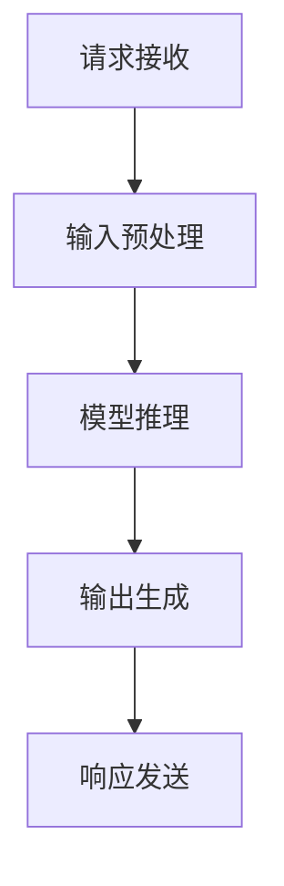

                 


# 大语言模型应用指南：Assistants API整体执行过程

## 关键词：
大语言模型，自然语言处理，API，人工智能，云计算，Assistants，执行流程，架构设计，算法原理

## 摘要：
本文旨在深入解析大语言模型在Assistants API中的应用执行过程。文章首先介绍了大语言模型的基本概念和重要性，然后详细阐述了Assistants API的整体架构及其执行流程。通过分解关键步骤和核心算法原理，本文帮助读者理解大语言模型在实际应用中的工作方式和性能优化策略。最后，文章通过项目实战案例，展示了如何实际开发和部署Assistants API，并提供了一系列学习资源和工具推荐，以便读者进一步深入学习和实践。

## 1. 背景介绍

### 1.1 目的和范围

本文的目标是详细解析大语言模型在Assistants API中的应用执行过程，为读者提供一个全面的技术指南。我们旨在探讨以下几个方面：

1. **大语言模型的基本概念和重要性**：介绍大语言模型的发展历程、核心技术以及其在自然语言处理中的应用场景。
2. **Assistants API的整体架构**：详细描述Assistants API的组成部分、功能和关键特性。
3. **执行流程解析**：分解Assistants API的整体执行流程，从请求接收、处理到响应的各个阶段。
4. **核心算法原理**：详细解释大语言模型的核心算法原理，包括输入处理、模型推理、输出生成等关键环节。
5. **项目实战案例**：通过实际案例展示如何开发和部署Assistants API。
6. **学习和资源推荐**：为读者提供学习资源和工具，以便他们深入了解和实践本文讨论的技术。

### 1.2 预期读者

本文适合以下读者群体：

1. **自然语言处理（NLP）领域的研究人员和工程师**：希望深入了解大语言模型在实际应用中的工作原理和执行过程。
2. **软件开发者和架构师**：对Assistants API的设计和实现感兴趣，并希望学习如何将其应用于实际的业务场景。
3. **云计算和大数据工程师**：希望了解大语言模型在云计算环境中的应用，以及如何优化其性能和资源使用。
4. **人工智能和机器学习爱好者**：对最新技术趋势和应用感兴趣，希望提升自己在NLP和AI领域的专业技能。

### 1.3 文档结构概述

本文结构如下：

1. **背景介绍**：介绍本文的目的、预期读者以及文档结构。
2. **核心概念与联系**：阐述大语言模型和Assistants API的核心概念，并提供Mermaid流程图。
3. **核心算法原理 & 具体操作步骤**：详细解析大语言模型的核心算法原理和操作步骤。
4. **数学模型和公式 & 详细讲解 & 举例说明**：介绍大语言模型的数学模型和相关公式，并提供实例说明。
5. **项目实战：代码实际案例和详细解释说明**：通过实际案例展示Assistants API的开发和部署过程。
6. **实际应用场景**：探讨Assistants API在不同领域的实际应用。
7. **工具和资源推荐**：推荐学习资源、开发工具和框架。
8. **总结：未来发展趋势与挑战**：总结本文的主要内容和未来发展趋势。
9. **附录：常见问题与解答**：提供常见问题的解答。
10. **扩展阅读 & 参考资料**：为读者提供进一步阅读的推荐。

### 1.4 术语表

#### 1.4.1 核心术语定义

- **大语言模型**：一种基于深度学习的技术，用于理解和生成自然语言。
- **自然语言处理（NLP）**：计算机科学领域，涉及对自然语言（如英语、中文等）的自动化处理和理解。
- **API**：应用程序编程接口，允许不同软件组件之间进行交互和通信。
- **Assistants API**：一种专门用于构建智能助手和对话系统的API。
- **执行流程**：软件或系统从请求接收、处理到响应的整个过程。
- **模型推理**：将输入数据传递到预训练的大语言模型中，并生成预测或响应的过程。
- **端到端学习**：一种机器学习方法，通过直接从原始数据中学习目标输出的完整映射。

#### 1.4.2 相关概念解释

- **预训练**：在特定任务之前，对大语言模型进行大规模预训练，以学习通用语言表示和知识。
- **微调**：在预训练的基础上，针对特定任务进行模型参数的调整和优化。
- **序列到序列模型**：一种用于翻译、机器翻译和对话生成等任务的模型，能够处理序列数据。
- **BERT**：一种著名的预训练语言模型，用于多种NLP任务。
- **GPT**：一种生成预训练语言模型，能够生成连贯的文本。

#### 1.4.3 缩略词列表

- **NLP**：自然语言处理（Natural Language Processing）
- **API**：应用程序编程接口（Application Programming Interface）
- **Assistants API**：智能助手API（Intelligent Assistants API）
- **ML**：机器学习（Machine Learning）
- **DL**：深度学习（Deep Learning）
- **GAN**：生成对抗网络（Generative Adversarial Network）

## 2. 核心概念与联系

### 2.1 大语言模型的概念

大语言模型是一种基于深度学习的自然语言处理技术，通过预训练和微调，能够理解和生成自然语言。它通常由多个神经网络层组成，利用大量的文本数据学习语言模式和结构。大语言模型的核心目标是使计算机能够像人类一样理解和生成自然语言，从而实现智能对话、文本生成、翻译等任务。

### 2.2 Assistants API的概念

Assistants API是一种专门用于构建智能助手和对话系统的API。它提供了一套标准化的接口和功能，使得开发者可以轻松地集成和部署智能助手，实现与用户的自然语言交互。Assistants API通常基于大语言模型，利用其强大的自然语言处理能力，实现对话管理、意图识别、实体抽取、响应生成等功能。

### 2.3 关联与联系

大语言模型和Assistants API之间存在紧密的联系和相互依赖。大语言模型为Assistants API提供了核心的自然语言处理能力，使得API能够理解和生成自然语言。而Assistants API则提供了一个抽象的接口，使得开发者可以专注于业务逻辑和对话流程的实现，无需关心底层的大语言模型细节。

### 2.4 Mermaid流程图

下面是一个简单的Mermaid流程图，用于描述Assistants API的整体执行流程：



### 2.5 核心概念总结

- **大语言模型**：用于理解和生成自然语言，是实现Assistants API的关键技术。
- **Assistants API**：提供了一套标准化的接口和功能，用于构建智能助手和对话系统。
- **执行流程**：从请求接收、输入预处理、模型推理、输出生成到响应发送的整个过程。

## 3. 核心算法原理 & 具体操作步骤

### 3.1 大语言模型算法原理

大语言模型是一种基于深度学习的自然语言处理技术，其核心原理包括以下几个方面：

#### 3.1.1 预训练

预训练是大规模语言模型的基石。在预训练阶段，模型通过学习大量文本数据，自动发现语言模式和结构。预训练的主要任务是学习输入文本的嵌入表示，并将其映射到高维空间中。这个过程通常通过自注意力机制（Self-Attention）和多层神经网络来实现。

#### 3.1.2 微调

在预训练之后，模型可以通过微调（Fine-tuning）来适应特定的任务。微调的过程通常涉及以下步骤：

1. **数据准备**：准备用于微调的标注数据集，包括文本和对应的标签。
2. **模型调整**：在预训练模型的基础上，调整部分参数，使其适应特定任务。
3. **训练**：使用调整后的模型，在标注数据集上进行训练，优化模型参数。
4. **评估**：在验证集和测试集上评估模型的性能，调整模型参数，以达到最佳效果。

#### 3.1.3 模型推理

模型推理是指将输入文本数据传递到预训练模型中，并生成预测或响应的过程。模型推理通常涉及以下步骤：

1. **文本预处理**：对输入文本进行预处理，包括分词、去停用词、词性标注等。
2. **嵌入表示**：将预处理后的文本转换为嵌入表示，通常使用预训练模型的嵌入层。
3. **模型计算**：将嵌入表示输入到模型中，通过多层神经网络进行计算。
4. **输出生成**：根据模型计算结果，生成预测或响应。

### 3.2 具体操作步骤

下面是一个简单的伪代码，用于描述大语言模型在Assistants API中的具体操作步骤：

```python
# 输入文本预处理
def preprocess_text(text):
    # 分词、去停用词、词性标注等
    processed_text = text_preprocessing(text)
    return processed_text

# 模型推理
def model_inference(processed_text, model):
    # 输入嵌入表示
    embedding = model.embedding(processed_text)
    # 模型计算
    logits = model.forward(embedding)
    # 输出生成
    response = model.generate_response(logits)
    return response

# 主函数
def main():
    # 输入文本
    text = input("请输入问题：")
    # 预处理文本
    processed_text = preprocess_text(text)
    # 加载预训练模型
    model = load_pretrained_model()
    # 模型推理
    response = model_inference(processed_text, model)
    # 输出响应
    print("响应：", response)

# 执行主函数
main()
```

### 3.3 操作步骤详解

#### 3.3.1 输入文本预处理

输入文本预处理是模型推理的第一步，其目的是将原始输入文本转换为适合模型处理的格式。预处理步骤通常包括分词、去停用词、词性标注等。

- **分词**：将输入文本分解为单词或词组，以便进一步处理。
- **去停用词**：移除常见的无意义或对任务无关的单词，如“的”、“了”、“呢”等。
- **词性标注**：为每个单词分配词性标签，如名词、动词、形容词等。

#### 3.3.2 模型推理

模型推理是指将预处理后的文本输入到预训练模型中，并生成预测或响应的过程。模型推理通常涉及以下步骤：

- **输入嵌入表示**：将预处理后的文本转换为嵌入表示，这通常使用预训练模型的嵌入层来完成。
- **模型计算**：将嵌入表示输入到模型中，通过多层神经网络进行计算，得到模型预测。
- **输出生成**：根据模型计算结果，生成预测或响应。这通常涉及后处理步骤，如 softmax 函数、文本生成等。

#### 3.3.3 输出生成

输出生成是模型推理的最后一步，其目的是将模型预测转换为可理解的自然语言响应。输出生成通常涉及以下步骤：

- **后处理**：对模型预测结果进行后处理，如 softmax 函数、文本生成等。
- **响应格式化**：将生成的响应格式化为适合用户接口的格式，如文本、语音等。

## 4. 数学模型和公式 & 详细讲解 & 举例说明

### 4.1 数学模型介绍

大语言模型通常基于深度学习和自然语言处理（NLP）的数学模型。以下是一些常见的数学模型和相关公式：

#### 4.1.1 自注意力机制（Self-Attention）

自注意力机制是Transformer模型的核心组成部分，用于对序列数据进行加权处理。自注意力机制的数学公式如下：

$$
\text{Attention}(Q, K, V) = \text{softmax}\left(\frac{QK^T}{\sqrt{d_k}}\right)V
$$

其中：
- $Q$ 是查询向量（Query），代表要关注的序列部分。
- $K$ 是关键向量（Key），代表序列中的每个部分。
- $V$ 是值向量（Value），代表序列中的每个部分。
- $d_k$ 是关键向量的维度。

#### 4.1.2 Transformer模型

Transformer模型是一种基于自注意力机制的深度学习模型，用于处理序列数据。Transformer模型的数学公式如下：

$$
\text{Transformer}(x) = \text{LayerNorm}(x) + \text{Dropout}(\text{MultiHeadAttention}(x))
$$

$$
\text{Transformer}(x) = \text{LayerNorm}(x) + \text{Dropout}(\text{Linear}(x))
$$

其中：
- $x$ 是输入序列。
- $LayerNorm$ 是层归一化操作。
- $Dropout$ 是dropout操作。
- $MultiHeadAttention$ 是多头注意力机制。
- $Linear$ 是线性变换。

#### 4.1.3 BERT模型

BERT（Bidirectional Encoder Representations from Transformers）是一种双向的Transformer模型，用于预训练语言表示。BERT的数学公式如下：

$$
\text{BERT}(x) = \text{Encoder}(\text{Embedding}(x))
$$

其中：
- $x$ 是输入序列。
- $Embedding$ 是嵌入层。
- $Encoder$ 是Transformer编码器。

### 4.2 详细讲解

以下是对大语言模型中的核心数学模型的详细讲解：

#### 4.2.1 自注意力机制

自注意力机制通过对序列中的每个部分进行加权，使得模型能够关注到序列中的关键信息。自注意力机制的公式中，$QK^T$ 表示查询向量和关键向量的点积，用于计算注意力权重。softmax函数将注意力权重转换为概率分布，用于加权值向量。这样，模型能够自动学习到序列中的依赖关系，从而提高模型的表示能力和准确性。

#### 4.2.2 Transformer模型

Transformer模型是一种基于自注意力机制的深度学习模型，它能够并行处理序列数据，并捕捉序列中的长期依赖关系。Transformer模型由多个编码器和解码器层组成，每个层都包含多头注意力机制和前馈网络。多头注意力机制通过多个注意力头，同时关注序列的不同部分，从而提高模型的表示能力和灵活性。前馈网络对每个注意力头的结果进行进一步加工，增强模型的非线性表示能力。

#### 4.2.3 BERT模型

BERT模型是一种基于Transformer的双向编码器模型，用于预训练语言表示。BERT模型在预训练过程中，通过自注意力机制学习到语言的双向表示，从而提高模型的语义理解能力。在微调过程中，BERT模型可以轻松适应各种下游任务，如文本分类、命名实体识别等。

### 4.3 举例说明

以下是一个简单的例子，用于说明自注意力机制在Transformer模型中的应用：

假设我们有一个长度为5的输入序列，每个元素表示一个单词，即 $x = [w_1, w_2, w_3, w_4, w_5]$。我们希望使用Transformer模型对其进行处理。

1. **嵌入表示**：将输入序列 $x$ 转换为嵌入表示，即 $x' = [\text{Embedding}(w_1), \text{Embedding}(w_2), \text{Embedding}(w_3), \text{Embedding}(w_4), \text{Embedding}(w_5)]$。
2. **自注意力计算**：计算每个单词之间的注意力权重，即 $A = \text{Attention}(x', x', x')$。假设注意力权重矩阵为：
   $$
   A = \begin{bmatrix}
   a_{11} & a_{12} & a_{13} & a_{14} & a_{15} \\
   a_{21} & a_{22} & a_{23} & a_{24} & a_{25} \\
   a_{31} & a_{32} & a_{33} & a_{34} & a_{35} \\
   a_{41} & a_{42} & a_{43} & a_{44} & a_{45} \\
   a_{51} & a_{52} & a_{53} & a_{54} & a_{55}
   \end{bmatrix}
   $$
3. **加权值计算**：根据注意力权重，对每个单词的嵌入表示进行加权，即 $x'' = A \cdot x'$。
4. **输出表示**：将加权后的嵌入表示作为Transformer模型的输出，用于后续处理。

通过这个例子，我们可以看到自注意力机制如何帮助Transformer模型学习到输入序列中的依赖关系，从而提高模型的表示能力和准确性。

## 5. 项目实战：代码实际案例和详细解释说明

### 5.1 开发环境搭建

在开始实际案例之前，我们需要搭建一个适合开发和部署Assistants API的开发环境。以下是搭建开发环境的步骤：

1. **安装Python**：确保系统中已安装Python 3.8或更高版本。
2. **安装依赖库**：使用pip命令安装以下依赖库：
   ```bash
   pip install transformers torch
   ```
3. **创建虚拟环境**：为了方便管理和维护，我们建议使用虚拟环境。可以使用以下命令创建虚拟环境：
   ```bash
   python -m venv venv
   source venv/bin/activate  # Windows上使用 `venv\Scripts\activate`
   ```
4. **编写配置文件**：创建一个名为`config.py`的配置文件，用于存储API的配置信息，如模型路径、端口号等。

### 5.2 源代码详细实现和代码解读

下面是一个简单的Assistants API实现示例，包括模型加载、请求处理和响应生成。

#### 5.2.1 模型加载

```python
from transformers import BertTokenizer, BertModel

def load_model():
    tokenizer = BertTokenizer.from_pretrained('bert-base-chinese')
    model = BertModel.from_pretrained('bert-base-chinese')
    return tokenizer, model
```

这段代码首先导入了`transformers`库中的`BertTokenizer`和`BertModel`类。`BertTokenizer`用于对输入文本进行分词和标记，`BertModel`用于加载预训练的BERT模型。我们通过调用`from_pretrained`方法加载预训练模型和分词器。

#### 5.2.2 请求处理

```python
from flask import Flask, request, jsonify

app = Flask(__name__)

@app.route('/assist', methods=['POST'])
def assist():
    data = request.get_json()
    question = data['question']
    tokenizer, model = load_model()

    # 文本预处理
    inputs = tokenizer(question, return_tensors='pt', padding=True, truncation=True)

    # 模型推理
    with torch.no_grad():
        outputs = model(**inputs)

    # 输出生成
    logits = outputs.logits
    response = torch.argmax(logits, dim=-1).squeeze().item()

    # 响应格式化
    response_text = tokenizer.decode(response)

    return jsonify({'response': response_text})
```

这段代码使用了Flask框架创建了一个简单的Web服务。`assist`函数处理来自客户端的POST请求。首先，从请求中获取输入问题，然后加载模型和分词器。接下来，对输入问题进行预处理，包括分词和标记。然后，使用预训练模型对预处理后的输入进行推理，生成模型预测。最后，将预测结果转换为自然语言响应，并返回给客户端。

#### 5.2.3 代码解读与分析

1. **请求处理**：Flask框架提供了一个简单的Web服务，通过定义一个路由（`/assist`）和请求处理函数（`assist`），处理来自客户端的POST请求。在`assist`函数中，从请求中获取输入问题，然后加载模型和分词器。

2. **文本预处理**：使用`tokenizer`对输入问题进行预处理，包括分词、标记和嵌入表示。预处理后的输入数据被传递给BERT模型进行推理。

3. **模型推理**：使用预训练BERT模型对预处理后的输入进行推理，生成模型预测。推理过程在无梯度计算（`with torch.no_grad():`）的上下文中进行，以提高推理速度。

4. **输出生成**：将模型预测结果转换为自然语言响应。这里，我们使用`tokenizer.decode`方法将预测索引转换为对应的文本。

5. **响应格式化**：将生成的响应转换为JSON格式，并返回给客户端。

### 5.3 实际应用场景

以下是一个实际应用场景的例子：

假设我们有一个基于Assistants API的在线问答系统，用户可以通过Web界面提出问题，系统会自动生成回答。

1. **用户输入问题**：用户在Web界面中输入问题，例如：“什么是人工智能？”
2. **发送请求**：用户提交问题后，浏览器会向服务器发送一个POST请求，URL为`/assist`，请求体包含问题文本。
3. **服务器处理请求**：服务器接收到请求后，调用`assist`函数处理输入问题。
4. **模型推理**：服务器加载BERT模型和分词器，对输入问题进行预处理，并使用BERT模型进行推理。
5. **生成回答**：服务器将模型预测结果转换为自然语言响应，例如：“人工智能是一种模拟、延伸和扩展人类智能的理论、方法、技术及应用系统。”
6. **返回回答**：服务器将生成的回答作为JSON响应返回给用户，并在Web界面上显示。

通过这个实际应用场景，我们可以看到Assistants API如何帮助开发者快速构建和部署智能问答系统。

## 6. 实际应用场景

Assistants API在多个领域和场景中具有广泛的应用。以下是一些典型的实际应用场景：

### 6.1 智能客服系统

智能客服系统是Assistants API最常见的应用场景之一。通过Assistants API，企业可以快速构建具备自然语言交互能力的客服机器人，提供24/7的在线支持。智能客服系统能够处理大量的客户查询，提高响应速度和客户满意度。

### 6.2 聊天机器人

聊天机器人是另一个重要的应用场景。通过Assistants API，开发者可以构建各种聊天机器人，如社交机器人、娱乐机器人、教育机器人等。聊天机器人能够与用户进行实时对话，提供个性化的服务和建议。

### 6.3 智能推荐系统

智能推荐系统利用Assistants API的文本处理能力，分析用户的历史行为和偏好，生成个性化的推荐列表。例如，电商网站可以使用智能推荐系统向用户推荐相关商品，提高销售额。

### 6.4 智能语音助手

智能语音助手是Assistants API在语音交互领域的应用。通过将Assistants API集成到智能音箱、智能手机等设备中，用户可以通过语音指令与设备进行交互，实现语音搜索、音乐播放、天气查询等功能。

### 6.5 自动化文案生成

自动化文案生成是Assistants API在内容创作领域的应用。通过训练大型语言模型，企业可以自动生成各种文案，如广告文案、产品说明、新闻报道等，提高内容生产效率。

### 6.6 教育和培训

教育和培训领域可以利用Assistants API提供个性化学习建议和辅导。智能助手可以根据学生的学习进度和偏好，推荐合适的学习资源和练习题目，提高学习效果。

### 6.7 医疗健康

医疗健康领域可以利用Assistants API提供在线健康咨询和症状诊断服务。智能助手可以根据用户的症状描述，提供初步诊断和建议，帮助用户更好地管理健康。

通过以上实际应用场景，我们可以看到Assistants API的广泛用途和潜力。随着技术的不断进步，Assistants API将在更多领域和场景中发挥重要作用。

## 7. 工具和资源推荐

### 7.1 学习资源推荐

为了帮助读者更好地理解和掌握Assistants API和相关技术，我们推荐以下学习资源：

#### 7.1.1 书籍推荐

1. **《深度学习》（Goodfellow, I., Bengio, Y., & Courville, A.）**：这本书是深度学习的经典教材，涵盖了从基础到高级的内容，包括神经网络、卷积网络、循环网络等。
2. **《自然语言处理综论》（Jurafsky, D. & Martin, J. H.）**：这本书详细介绍了自然语言处理的基本概念、技术和应用，是NLP领域的经典教材。
3. **《深度学习与自然语言处理》（祖茂明 & 崔恒）**：这本书结合了深度学习和自然语言处理的内容，介绍了大语言模型、BERT、GPT等先进技术。

#### 7.1.2 在线课程

1. **《深度学习》（吴恩达，Coursera）**：这是一门非常受欢迎的在线课程，由深度学习领域的著名专家吴恩达教授主讲，涵盖了深度学习的理论基础和实际应用。
2. **《自然语言处理与深度学习》（李航，网易云课堂）**：这是一门针对自然语言处理和深度学习的在线课程，内容涵盖了文本预处理、词向量、序列模型等关键技术。
3. **《深度学习与自然语言处理》（李航，网易云课堂）**：这是另一门结合深度学习和自然语言处理的在线课程，内容涵盖了从基础到高级的深度学习技术和NLP应用。

#### 7.1.3 技术博客和网站

1. **百度AI研究**：百度AI研究博客，提供了大量关于深度学习和自然语言处理的最新研究和技术分享。
2. **TensorFlow官方文档**：TensorFlow官方文档，涵盖了TensorFlow的使用方法、教程和API文档，是学习和使用TensorFlow的重要资源。
3. **Hugging Face**：Hugging Face是深度学习和NLP领域的开源社区，提供了丰富的预训练模型、工具和教程，帮助开发者快速构建和应用自然语言处理应用。

### 7.2 开发工具框架推荐

为了提高开发效率，我们推荐以下开发工具和框架：

#### 7.2.1 IDE和编辑器

1. **Visual Studio Code**：Visual Studio Code是一款轻量级但功能强大的代码编辑器，支持多种编程语言，包括Python、Java、C++等。
2. **PyCharm**：PyCharm是一款专业的Python IDE，提供了丰富的调试、测试和自动化工具，适用于大型Python项目。
3. **Jupyter Notebook**：Jupyter Notebook是一款基于Web的交互式计算环境，适用于数据分析和机器学习项目。

#### 7.2.2 调试和性能分析工具

1. **PyTorch Profiler**：PyTorch Profiler是一款用于分析和优化PyTorch模型的性能分析工具，可以帮助开发者识别性能瓶颈和优化模型。
2. **TensorBoard**：TensorBoard是一款可视化工具，用于分析TensorFlow和PyTorch模型的训练过程，包括梯度、损失函数、模型结构等。
3. **gProfiler**：gProfiler是一款开源的性能分析工具，适用于各种深度学习框架，包括PyTorch、TensorFlow等。

#### 7.2.3 相关框架和库

1. **PyTorch**：PyTorch是一款流行的深度学习框架，提供了丰富的API和工具，适用于从基础研究到工业应用的各种场景。
2. **TensorFlow**：TensorFlow是一款由Google开发的开源深度学习框架，具有广泛的生态和强大的功能，适用于各种规模的应用。
3. **Hugging Face Transformers**：Hugging Face Transformers是一款基于PyTorch和TensorFlow的预训练语言模型库，提供了丰富的预训练模型和工具，适用于构建和应用自然语言处理应用。

通过以上工具和资源的推荐，读者可以更好地掌握Assistants API和相关技术，提升开发效率和项目质量。

## 8. 总结：未来发展趋势与挑战

### 8.1 未来发展趋势

随着人工智能技术的快速发展，大语言模型在自然语言处理领域的应用前景广阔。以下是未来发展的几个关键趋势：

1. **模型规模与性能的提升**：随着计算资源的增加和算法的优化，大语言模型的规模和性能将不断提升。未来可能涌现出更大规模的模型，如GPT-4、GPT-5等，提供更强大的自然语言处理能力。

2. **跨模态处理**：大语言模型的发展将不再局限于文本数据，还将扩展到图像、声音、视频等多种模态。跨模态处理技术将使智能助手具备更全面的理解和交互能力。

3. **更多应用场景**：随着技术的成熟，Assistants API将在更多领域得到应用，如医疗健康、金融、教育等。这些应用将带来巨大的商业价值和用户体验提升。

4. **开放生态**：开源社区将继续发挥重要作用，推动大语言模型和Assistants API的发展。更多优秀的开源工具和框架将涌现，降低开发门槛，促进技术创新。

### 8.2 面临的挑战

尽管大语言模型和Assistants API具有巨大的潜力，但在实际应用中仍面临一些挑战：

1. **计算资源需求**：大语言模型的训练和推理过程需要大量的计算资源，这可能导致成本高昂、能耗巨大。如何优化计算资源的使用，降低能耗，是一个重要的挑战。

2. **数据质量和隐私**：大语言模型需要大量高质量的数据进行训练，但数据质量和隐私问题日益突出。如何确保数据来源的合法性、数据的准确性和隐私性，是一个亟待解决的问题。

3. **伦理和法律问题**：随着人工智能技术的发展，伦理和法律问题日益引起关注。如何确保智能助手的公平性、透明性和可解释性，如何应对可能出现的法律纠纷，是需要认真思考的问题。

4. **可扩展性和可靠性**：在处理大量用户请求时，Assistants API需要具备良好的可扩展性和可靠性。如何设计高效、稳定的系统架构，确保用户体验，是一个关键挑战。

### 8.3 解决方案与展望

为了应对上述挑战，可以采取以下解决方案和措施：

1. **优化计算资源使用**：通过分布式计算、模型压缩和优化算法等手段，降低大语言模型的计算资源需求。此外，还可以探索基于图形处理单元（GPU）和其他硬件加速器的优化方案。

2. **数据治理与隐私保护**：建立完善的数据治理机制，确保数据来源的合法性和准确性。同时，采用数据加密、匿名化等技术，保护用户隐私。

3. **伦理和法律合规**：建立人工智能伦理和法律框架，明确智能助手的设计、开发和应用的规范。加强行业自律，推动伦理和法律问题的解决。

4. **系统优化与可靠性保障**：采用负载均衡、故障转移等技术，提高系统的可扩展性和可靠性。此外，通过持续监控和测试，确保系统的稳定运行和高效响应。

总之，大语言模型和Assistants API的发展前景广阔，但同时也面临诸多挑战。通过不断的技术创新和规范建设，我们可以充分发挥这些技术潜力，为人类带来更多便利和价值。

## 9. 附录：常见问题与解答

### 9.1 什么是大语言模型？

大语言模型是一种基于深度学习的自然语言处理技术，通过预训练和微调，能够理解和生成自然语言。它通常由多个神经网络层组成，利用大量的文本数据学习语言模式和结构。

### 9.2 Assistants API是什么？

Assistants API是一种专门用于构建智能助手和对话系统的API。它提供了一套标准化的接口和功能，使得开发者可以轻松地集成和部署智能助手，实现与用户的自然语言交互。

### 9.3 如何优化大语言模型的性能？

优化大语言模型性能可以从以下几个方面入手：

1. **模型压缩**：通过模型剪枝、量化等技术，减少模型的参数数量和计算复杂度，提高推理速度和降低能耗。
2. **模型并行化**：利用分布式计算和并行化技术，提高模型训练和推理的效率。
3. **数据预处理**：优化数据预处理步骤，减少数据传输和处理的时间。
4. **优化算法**：采用更高效的算法和优化策略，提高模型的训练和推理速度。

### 9.4 Assistants API在哪些领域有应用？

Assistants API在多个领域和场景中具有广泛的应用，包括智能客服、聊天机器人、智能推荐、智能语音助手、自动化文案生成、教育和培训、医疗健康等。

### 9.5 如何确保Assistants API的稳定性？

确保Assistants API的稳定性可以从以下几个方面入手：

1. **负载均衡**：通过负载均衡技术，将用户请求均匀分配到多个服务器上，避免单点故障。
2. **故障转移**：实现故障转移机制，当某个服务器发生故障时，自动切换到备用服务器，确保服务的连续性。
3. **持续监控**：通过监控工具，实时监控系统的运行状态和性能指标，及时发现并解决潜在问题。
4. **自动化测试**：定期进行自动化测试，确保系统的稳定性和可靠性。

### 9.6 如何处理Assistants API的隐私和安全问题？

处理Assistants API的隐私和安全问题可以从以下几个方面入手：

1. **数据加密**：对用户数据进行加密存储和传输，确保数据的安全性。
2. **数据匿名化**：对用户数据进行匿名化处理，保护用户隐私。
3. **访问控制**：建立完善的访问控制机制，确保只有授权用户可以访问敏感数据。
4. **安全审计**：定期进行安全审计，检查系统的安全漏洞和合规性。

通过以上措施，可以有效地保障Assistants API的隐私和安全。

## 10. 扩展阅读 & 参考资料

为了进一步了解大语言模型和Assistants API的相关技术，我们推荐以下扩展阅读和参考资料：

### 10.1 书籍推荐

1. **《深度学习》（Goodfellow, I., Bengio, Y., & Courville, A.）**：这是一本深度学习的经典教材，详细介绍了深度学习的理论基础和实际应用。
2. **《自然语言处理综论》（Jurafsky, D. & Martin, J. H.）**：这本书提供了自然语言处理的基本概念、技术和应用，是NLP领域的权威著作。
3. **《深度学习与自然语言处理》（祖茂明 & 崔恒）**：这本书结合了深度学习和自然语言处理的内容，介绍了大语言模型、BERT、GPT等先进技术。

### 10.2 在线课程

1. **《深度学习》（吴恩达，Coursera）**：这是一门非常受欢迎的在线课程，由深度学习领域的著名专家吴恩达教授主讲。
2. **《自然语言处理与深度学习》（李航，网易云课堂）**：这是一门针对自然语言处理和深度学习的在线课程。
3. **《深度学习与自然语言处理》（李航，网易云课堂）**：这是另一门结合深度学习和自然语言处理的在线课程。

### 10.3 技术博客和网站

1. **百度AI研究**：百度AI研究博客，提供了大量关于深度学习和自然语言处理的最新研究和技术分享。
2. **TensorFlow官方文档**：TensorFlow官方文档，涵盖了TensorFlow的使用方法、教程和API文档。
3. **Hugging Face**：Hugging Face是深度学习和NLP领域的开源社区，提供了丰富的预训练模型、工具和教程。

### 10.4 相关论文和研究成果

1. **BERT：Pre-training of Deep Bidirectional Transformers for Language Understanding（BERT：Pre-training of Deep Bidirectional Transformers for Language Understanding）**：这篇论文提出了BERT模型，是自然语言处理领域的里程碑。
2. **GPT：Improving Language Understanding by Generative Pre-Training（GPT：Improving Language Understanding by Generative Pre-Training）**：这篇论文提出了GPT模型，是一种基于生成预训练的语言模型。
3. **RoBERTa：A Pre-Trained Language Model for Internet-scale Language Understanding（RoBERTa：A Pre-Trained Language Model for Internet-scale Language Understanding）**：这篇论文提出了RoBERTa模型，是BERT模型的改进版本。

通过以上扩展阅读和参考资料，读者可以更深入地了解大语言模型和Assistants API的相关技术，以及该领域的最新进展。

