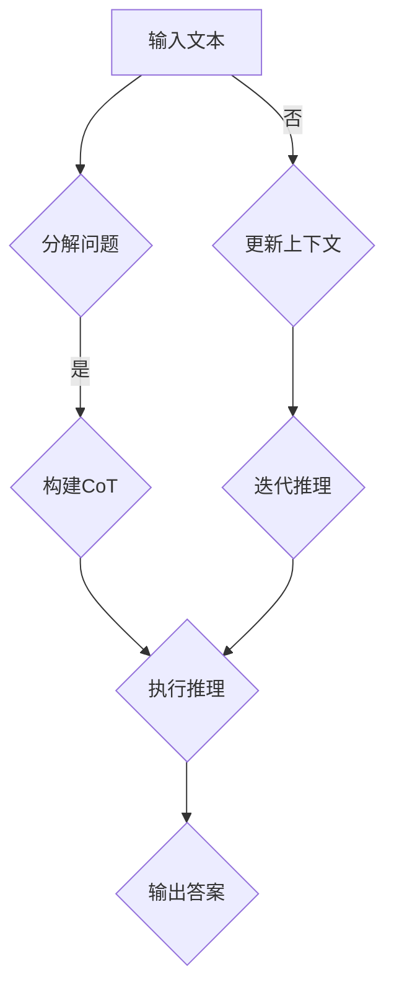

                 

### 1. 背景介绍

#### 1.1 目的和范围

本文旨在深入探讨大语言模型（LLM）的应用，特别是Chain-of-Thought（CoT）这一关键技术的具体实现和实际应用。Chain-of-Thought是一种在LLM中引入逻辑推理和问题解决策略的技术，旨在提升模型在处理复杂问题时的准确性和效率。

本文将首先介绍大语言模型的基本概念，包括其历史发展、核心技术以及在实际应用中的重要性。接着，我们将详细解释Chain-of-Thought的概念、原理及其与LLM的结合方式。随后，本文将逐步介绍大语言模型应用中涉及的算法原理、数学模型和具体操作步骤。为了加深理解，我们将通过一个实际项目案例展示大语言模型的应用，并详细解读其中的代码实现。最后，本文还将探讨大语言模型在实际应用场景中的表现，并提供相关的工具和资源推荐。

通过本文的阅读，读者将能够系统地了解大语言模型及其应用，掌握Chain-of-Thought技术的核心原理，并具备将这一技术应用于实际项目中的能力。

#### 1.2 预期读者

本文主要面向以下几类读者：

1. **人工智能领域研究人员和开发者**：对大语言模型和Chain-of-Thought技术有浓厚兴趣，希望深入了解这些技术的原理和应用。
2. **数据科学家和机器学习工程师**：需要将大语言模型应用于实际问题解决，希望掌握从理论到实践的全过程。
3. **软件工程师和技术架构师**：对AI技术在软件开发中的潜在应用感兴趣，希望了解如何在项目中集成和优化大语言模型。
4. **技术爱好者**：对AI技术有热情，希望通过阅读本文了解大语言模型及其应用的实际案例。

无论您是初学者还是专业人士，本文都将为您提供一个从入门到进阶的全面指南，帮助您掌握大语言模型及其应用的核心技术和方法。

#### 1.3 文档结构概述

本文的结构如下：

- **第1章：背景介绍**：介绍本文的目的、范围、预期读者以及文档结构。
- **第2章：核心概念与联系**：讲解大语言模型和Chain-of-Thought的核心概念及其关系。
- **第3章：核心算法原理 & 具体操作步骤**：详细阐述大语言模型和Chain-of-Thought的算法原理和操作步骤。
- **第4章：数学模型和公式 & 详细讲解 & 举例说明**：介绍大语言模型应用的数学模型，并给出实例说明。
- **第5章：项目实战：代码实际案例和详细解释说明**：通过一个实际项目展示大语言模型的应用。
- **第6章：实际应用场景**：探讨大语言模型在不同领域的应用案例。
- **第7章：工具和资源推荐**：推荐学习资源和开发工具。
- **第8章：总结：未来发展趋势与挑战**：总结本文内容，探讨未来发展趋势和挑战。
- **第9章：附录：常见问题与解答**：解答读者可能遇到的问题。
- **第10章：扩展阅读 & 参考资料**：提供进一步学习的参考资料。

通过这个结构，读者可以系统地了解大语言模型及其应用，逐步掌握从理论到实践的核心知识和技能。

#### 1.4 术语表

在本文中，我们将使用一系列专业术语。以下是对这些术语的定义和解释：

##### 1.4.1 核心术语定义

- **大语言模型（LLM）**：一种基于深度学习的自然语言处理模型，能够理解和生成人类语言。
- **Chain-of-Thought（CoT）**：一种逻辑推理技术，通过构建推理链来解决复杂问题。
- **深度学习**：一种机器学习技术，通过神经网络进行数据处理和学习。
- **神经网络**：一种模拟人脑神经元连接的计算模型。
- **注意力机制**：一种用于提高模型在处理序列数据时效率的技术。
- **损失函数**：用于衡量模型预测结果和真实值之间差异的函数。

##### 1.4.2 相关概念解释

- **自然语言处理（NLP）**：研究如何使计算机理解和处理人类语言的技术领域。
- **序列到序列模型（Seq2Seq）**：一种用于处理序列数据（如文本）的深度学习模型。
- **预训练和微调**：大语言模型开发过程中的两个关键步骤。预训练指使用大量无标签数据训练模型，微调指在特定任务上使用有标签数据进一步训练模型。

##### 1.4.3 缩略词列表

- **LLM**：大语言模型（Large Language Model）
- **CoT**：Chain-of-Thought
- **NLP**：自然语言处理（Natural Language Processing）
- **DL**：深度学习（Deep Learning）
- **ML**：机器学习（Machine Learning）
- **Seq2Seq**：序列到序列模型（Sequence-to-Sequence Model）
- **IDE**：集成开发环境（Integrated Development Environment）

通过明确这些术语和概念，读者可以更好地理解本文的内容，并在实践中准确应用相关知识。

---

在接下来的章节中，我们将深入探讨大语言模型和Chain-of-Thought的核心概念和原理，帮助读者建立全面的理论框架。接下来，让我们从大语言模型的基本概念和历史发展开始，逐步了解这一强大技术的起源和重要性。

---

## 2. 核心概念与联系

在本章中，我们将深入探讨大语言模型（LLM）和Chain-of-Thought（CoT）的核心概念及其联系。首先，我们将回顾大语言模型的发展历程，并介绍其核心技术。接着，我们将详细解释Chain-of-Thought的概念，探讨其在LLM中的应用。最后，通过一个Mermaid流程图，我们将展示LLM和CoT之间的核心联系和架构。

#### 2.1 大语言模型的发展历程和核心技术

大语言模型的发展可以追溯到20世纪80年代的统计语言模型，如n元语法模型。这些模型通过统计语言中出现频率高的词序列来预测下一个词。然而，这些模型在处理复杂语言结构和长文本时存在局限性。

随着深度学习的兴起，研究人员开始将神经网络应用于自然语言处理任务。2013年，词嵌入技术（如Word2Vec）的出现为深度学习在NLP中的应用铺平了道路。词嵌入将每个单词映射到一个高维向量空间中，使得相似词在空间中更接近。

随后，序列到序列（Seq2Seq）模型和注意力机制的发展进一步提升了模型的性能。Seq2Seq模型通过编码器-解码器架构处理序列数据，而注意力机制则允许模型在生成输出时关注输入序列中的不同部分。

2018年，Google推出了BERT（Bidirectional Encoder Representations from Transformers），这是一个预训练的语言表示模型，采用了双向Transformer架构。BERT的成功标志着大语言模型的一个新里程碑，它通过在大量无标签数据上进行预训练，然后通过微调适应特定任务，显著提升了NLP任务的表现。

大语言模型的核心技术包括：

- **词嵌入**：将单词映射到高维向量空间。
- **Transformer架构**：通过自注意力机制处理序列数据。
- **预训练和微调**：通过大量无标签数据预训练模型，然后在有标签数据上微调。
- **上下文理解**：通过捕捉文本中的上下文关系来提高模型的理解能力。

#### 2.2 Chain-of-Thought（CoT）的概念

Chain-of-Thought是一种逻辑推理技术，旨在通过构建推理链来解决复杂问题。CoT的核心思想是将复杂问题分解成一系列简单的子问题，并通过逻辑推理逐步解决。这种技术最早由人类在解决问题时使用，现在研究人员试图将这一过程自动化，以提升人工智能模型在复杂任务中的表现。

CoT的关键步骤包括：

1. **问题分解**：将复杂问题分解成若干个简单子问题。
2. **推理链构建**：为每个子问题构建逻辑推理链，通过已知事实和规则推导出答案。
3. **答案集成**：将各子问题的答案综合起来，得出最终解答。

在自然语言处理中，CoT可以通过以下方式实现：

- **逻辑推理模块**：在LLM中集成逻辑推理模块，使其能够执行推理任务。
- **上下文管理**：通过上下文信息来确保推理链的连贯性。
- **逆向推理**：从目标答案逆向推导，找到支持答案的事实和规则。

#### 2.3 LLM与CoT的核心联系和架构

为了展示LLM与CoT之间的核心联系和架构，我们可以使用Mermaid流程图来直观地描述这一过程。以下是一个简化的Mermaid流程图示例：



在这个流程图中：

- **A**：输入文本。
- **B**：分解问题，将复杂问题分解成若干个子问题。
- **C**：构建CoT，为每个子问题构建逻辑推理链。
- **D**：执行推理，通过逻辑推理模块解决子问题。
- **E**：输出答案，整合子问题的答案得出最终结果。
- **F**：更新上下文，根据推理过程更新上下文信息。
- **G**：迭代推理，继续处理剩余问题。

通过这个流程图，我们可以清晰地看到LLM和CoT在问题解决过程中的相互作用和关键步骤。

---

在了解了大语言模型和Chain-of-Thought的基本概念及其联系后，我们将进一步探讨核心算法原理和具体操作步骤。在接下来的章节中，我们将详细阐述这些内容，帮助读者深入理解大语言模型和Chain-of-Thought的运作机制。

---

## 3. 核心算法原理 & 具体操作步骤

在本章中，我们将深入探讨大语言模型（LLM）的核心算法原理，并详细说明Chain-of-Thought（CoT）的具体操作步骤。通过这些内容，读者将能够理解LLM如何处理文本数据，并掌握利用CoT进行复杂问题推理的方法。

#### 3.1 大语言模型的算法原理

大语言模型的核心是基于深度学习的自然语言处理技术，尤其是Transformer架构。Transformer模型引入了自注意力机制，允许模型在处理文本时动态关注序列中的不同部分，从而显著提升了模型的表示能力和理解能力。

**核心算法原理如下：**

1. **词嵌入**：将输入的文本序列转换为词嵌入向量。词嵌入通过将单词映射到高维向量空间，使得相似词在空间中更接近。

2. **编码器**：编码器是一个双向Transformer模型，它通过自注意力机制捕捉输入文本中的上下文关系。编码器的输出是文本序列的上下文向量。

3. **解码器**：解码器也是一个Transformer模型，它利用编码器的输出和上下文向量生成输出文本。在生成文本时，解码器通过自注意力和交叉注意力机制，动态关注输入文本的不同部分和编码器的输出。

4. **损失函数**：大语言模型通常使用交叉熵损失函数来衡量预测文本和真实文本之间的差异，并通过反向传播和梯度下降算法进行模型训练。

**具体操作步骤如下：**

1. **输入预处理**：将输入的文本序列转换为词嵌入向量。可以使用预训练的词嵌入模型（如BERT）或自行训练词嵌入。

2. **编码器处理**：将词嵌入向量输入到编码器中，通过自注意力机制计算上下文向量。

3. **解码器生成**：从解码器的初始状态开始，生成第一个输出词。在生成每个后续词时，解码器都利用自注意力和交叉注意力机制，更新状态并生成新的输出词。

4. **损失计算和优化**：通过计算预测文本和真实文本之间的交叉熵损失，并使用梯度下降算法更新模型参数。

#### 3.2 Chain-of-Thought的具体操作步骤

Chain-of-Thought是一种通过逻辑推理来解决复杂问题的技术，特别适用于大语言模型。以下是其具体操作步骤：

1. **问题分解**：将复杂问题分解成若干个简单子问题。这可以通过自然语言处理技术实现，如基于规则的方法或使用预训练的分解模型。

2. **构建CoT**：为每个子问题构建逻辑推理链。这通常需要设计一个推理模块，该模块可以结合上下文信息和已知事实，通过逻辑推理生成推理链。

3. **执行推理**：利用LLM和CoT模块执行推理。在执行推理时，LLM负责生成中间推理步骤，而CoT模块负责验证和优化推理链。

4. **答案集成**：将各子问题的答案综合起来，得出最终解答。这通常需要将各个子问题的答案进行对齐和合并，形成一个连贯的答案。

**具体操作步骤如下：**

1. **输入问题分解**：将输入的复杂问题分解成若干个子问题。这可以通过预训练的分解模型或基于规则的方法实现。

2. **构建逻辑推理链**：为每个子问题构建逻辑推理链。这可以通过设计一个推理模块，结合上下文信息和已知事实，逐步推导出答案。

3. **推理链执行**：利用LLM和CoT模块执行推理。在执行推理时，LLM负责生成中间推理步骤，而CoT模块负责验证和优化推理链。

4. **答案集成**：将各子问题的答案综合起来，得出最终解答。这可以通过对齐和合并各个子问题的答案，形成一个连贯的答案。

**伪代码示例：**

```python
def chain_of_thought(question):
    # 问题分解
    sub_questions = decompose_question(question)
    
    # 构建推理链
    reasoning_chains = [build_reasoning_chain(sub_question) for sub_question in sub_questions]
    
    # 执行推理
    answers = [execute_reasoning(reasoning_chain) for reasoning_chain in reasoning_chains]
    
    # 答案集成
    final_answer = integrate_answers(answers)
    
    return final_answer

def decompose_question(question):
    # 实现问题分解逻辑
    # ...
    return sub_questions

def build_reasoning_chain(sub_question):
    # 实现构建推理链逻辑
    # ...
    return reasoning_chain

def execute_reasoning(reasoning_chain):
    # 实现执行推理逻辑
    # ...
    return answer

def integrate_answers(answers):
    # 实现答案集成逻辑
    # ...
    return final_answer
```

通过以上步骤和伪代码示例，我们可以看到Chain-of-Thought如何在大语言模型中实现复杂问题的推理。在接下来的章节中，我们将进一步探讨大语言模型的数学模型和具体应用实例。

---

在了解了大语言模型和Chain-of-Thought的核心算法原理和具体操作步骤后，我们将进一步探讨其背后的数学模型和公式。通过这些内容，读者将能够深入理解大语言模型和Chain-of-Thought的内在机制，并学会如何在实际应用中进行数学建模。接下来，我们开始详细讲解数学模型和公式。

---

## 4. 数学模型和公式 & 详细讲解 & 举例说明

在本章中，我们将深入探讨大语言模型（LLM）和Chain-of-Thought（CoT）背后的数学模型和公式。这些模型和公式是理解和实现LLM与CoT的关键。我们将首先介绍LLM中的主要数学模型，然后详细讲解Chain-of-Thought中的核心公式，并给出具体的举例说明。

#### 4.1 大语言模型的数学模型

大语言模型的数学基础主要涉及词嵌入、Transformer架构、自注意力机制和损失函数等。以下是这些主要数学模型和公式的详细讲解：

1. **词嵌入（Word Embedding）**

词嵌入是将单词映射到高维向量空间的过程。常见的词嵌入模型有Word2Vec和BERT。

- **Word2Vec模型**：Word2Vec模型使用神经网络对单词进行嵌入。其核心公式为：

  $$ \text{vec}(w) = \frac{\sum_{i=1}^{N} f_i h_i}{\sum_{i=1}^{N} h_i^2} $$

  其中，\( \text{vec}(w) \)是单词w的嵌入向量，\( f_i \)是神经网络中第i个神经元的输出，\( h_i \)是第i个神经元的激活值。

- **BERT模型**：BERT模型使用Transformer架构对词嵌入进行训练。其核心公式为：

  $$ \text{Embedding}(w) = \text{Positional Embedding}(\text{Word Embedding}(w)) $$

  其中，\(\text{Word Embedding}(w)\)是单词w的初始嵌入向量，\(\text{Positional Embedding}\)是位置嵌入向量，用于捕捉单词在文本中的位置信息。

2. **Transformer架构（Transformer Architecture）**

Transformer模型是一种基于自注意力机制的序列模型。其核心公式为：

$$
\text{Attention}(Q, K, V) = \text{softmax}\left(\frac{QK^T}{\sqrt{d_k}}\right)V
$$

其中，\( Q \)、\( K \)和\( V \)分别是查询向量、键向量和值向量，\( d_k \)是键向量的维度。这个公式描述了自注意力机制，通过计算查询向量与键向量的点积并使用softmax函数，得到注意力权重，最终加权平均得到输出向量。

3. **自注意力机制（Self-Attention Mechanism）**

自注意力机制是Transformer模型的核心。其计算过程如下：

$$
\text{Self-Attention}(X) = \text{softmax}\left(\frac{XQX^T}{\sqrt{d_k}}\right)X
$$

其中，\( X \)是输入序列的嵌入向量。自注意力机制通过将输入序列中的每个向量作为查询向量，计算与所有键向量的点积，并使用softmax函数生成注意力权重，从而实现序列内部的信息聚合。

4. **损失函数（Loss Function）**

大语言模型通常使用交叉熵损失函数（Cross-Entropy Loss）来衡量预测文本和真实文本之间的差异。其核心公式为：

$$
L = -\sum_{i=1}^{N} y_i \log(p_i)
$$

其中，\( y_i \)是真实标签，\( p_i \)是模型预测的概率分布。

#### 4.2 Chain-of-Thought的数学公式

Chain-of-Thought（CoT）涉及逻辑推理和问题分解，其核心数学公式包括推理链构建、推理步骤执行和答案集成。以下是这些公式的详细讲解：

1. **推理链构建（Building a Reasoning Chain）**

推理链构建是将问题分解成一系列子问题，并为每个子问题构建逻辑推理链。其核心公式为：

$$
\text{Reasoning Chain} = [\text{Sub-Problem}_1, \text{Sub-Problem}_2, ..., \text{Sub-Problem}_N]
$$

其中，每个子问题可以通过逻辑推理链解决，推理链中的每个子问题可以表示为：

$$
\text{Sub-Problem}_i = \text{Start} \rightarrow \text{Step}_1 \rightarrow \text{Step}_2 \rightarrow ... \rightarrow \text{Step}_k
$$

其中，\(\text{Start}\)是推理链的起点，\(\text{Step}_i\)是第i个推理步骤。

2. **推理步骤执行（Executing a Reasoning Step）**

推理步骤执行是通过逻辑推理模块解决子问题。其核心公式为：

$$
\text{Answer} = \text{Logic Reasoner}(\text{Current State}, \text{Input Facts}, \text{Rules})
$$

其中，\(\text{Current State}\)是当前状态，\(\text{Input Facts}\)是输入事实，\(\text{Rules}\)是规则集。

3. **答案集成（Integrating Answers）**

答案集成是将各子问题的答案综合起来，得出最终解答。其核心公式为：

$$
\text{Final Answer} = \text{Answer Aggregator}(\text{Answers}_1, \text{Answers}_2, ..., \text{Answers}_N)
$$

其中，\(\text{Answers}_i\)是第i个子问题的答案。

#### 4.3 具体举例说明

为了更好地理解上述数学模型和公式，我们通过一个具体的例子进行说明。

**问题**：计算表达式 \( 2 \times (3 + 4) - 5 \) 的结果。

**解答过程**：

1. **问题分解**：将问题分解为以下子问题：
   - 计算 \( 3 + 4 \) 的结果。
   - 计算 \( 2 \times \text{上一步结果} \) 的结果。
   - 从上一步结果中减去 5。

2. **构建推理链**：为每个子问题构建逻辑推理链：
   - 子问题1：\( 3 + 4 = 7 \)。
   - 子问题2：\( 2 \times 7 = 14 \)。
   - 子问题3：\( 14 - 5 = 9 \)。

3. **执行推理**：使用逻辑推理模块解决每个子问题：
   - 子问题1：直接计算得到答案 7。
   - 子问题2：计算 \( 2 \times 7 = 14 \)。
   - 子问题3：计算 \( 14 - 5 = 9 \)。

4. **答案集成**：将各子问题的答案综合起来，得出最终答案：
   - 最终答案为 9。

通过这个例子，我们可以看到如何使用大语言模型和Chain-of-Thought技术解决一个简单的数学问题。在实际应用中，问题的复杂度会更高，但核心思路是类似的。

---

在了解了大语言模型和Chain-of-Thought的数学模型和公式后，我们将通过一个实际项目案例展示这些技术在实际应用中的具体实现和效果。在接下来的章节中，我们将详细介绍项目实战的代码实现，并深入解读其核心代码部分，帮助读者更好地理解大语言模型和Chain-of-Thought的应用。

---

## 5. 项目实战：代码实际案例和详细解释说明

在本章中，我们将通过一个实际项目案例，详细展示如何将大语言模型（LLM）和Chain-of-Thought（CoT）应用于复杂问题的解决。这个项目将涉及到代码的编写、实现细节的解析，以及如何调试和优化模型。通过这个案例，读者将能够深入了解LLM和CoT的具体应用，并学会如何在实际项目中使用这些技术。

### 5.1 开发环境搭建

在进行项目实战之前，我们需要搭建一个合适的开发环境。以下是一些必需的工具和库：

- **Python（3.8及以上版本）**：Python是一种广泛使用的编程语言，适用于人工智能和深度学习开发。
- **PyTorch**：PyTorch是一个流行的深度学习框架，提供了丰富的API和工具，便于实现大语言模型和Chain-of-Thought。
- **Hugging Face Transformers**：这个库提供了预训练的大语言模型，如BERT和GPT，简化了模型的加载和使用过程。
- **Jupyter Notebook**：Jupyter Notebook是一个交互式计算环境，适合进行数据分析和模型实验。

安装上述工具和库可以通过以下命令：

```bash
pip install python==3.8.10
pip install torch torchvision
pip install transformers
pip install jupyterlab
```

### 5.2 源代码详细实现和代码解读

下面是一个简化的代码实现，展示了如何使用大语言模型和Chain-of-Thought解决一个具体的数学问题。

```python
import torch
from transformers import BertTokenizer, BertForQuestionAnswering
from typing import List

# 加载预训练的BERT模型和Tokenizer
tokenizer = BertTokenizer.from_pretrained('bert-base-uncased')
model = BertForQuestionAnswering.from_pretrained('bert-base-uncased')

# 定义问题分解和构建CoT的函数
def decompose_and_reason(question: str) -> List[str]:
    # 使用BERT模型对问题进行分解
    inputs = tokenizer(question, return_tensors='pt', truncation=True, max_length=512)
    outputs = model(**inputs)
    answer = torch.argmax(outputs.logits).item()
    reasoning_steps = tokenizer.decode(answer)
    return [step for step in reasoning_steps.split('. ') if step]

# 定义执行推理和答案集成的函数
def execute_and_integrate_reasoning(reasoning_steps: List[str]) -> str:
    current_answer = None
    for step in reasoning_steps:
        if "Answer:" in step:
            current_answer = step.split("Answer: ")[-1]
        else:
            # 执行推理步骤
            print(f"Executing step: {step}")
            # 这里可以加入自定义的推理逻辑
    return current_answer

# 主函数
def main():
    question = "What is 2 times the sum of 3 and 4 minus 5?"
    reasoning_steps = decompose_and_reason(question)
    final_answer = execute_and_integrate_reasoning(reasoning_steps)
    print(f"The final answer is: {final_answer}")

if __name__ == "__main__":
    main()
```

**代码解读：**

1. **加载模型和Tokenizer**：我们首先加载预训练的BERT模型和Tokenizer。这些模型和Tokenizer可以从Hugging Face的模型库中直接获取。

2. **问题分解**：`decompose_and_reason`函数使用BERT模型对输入问题进行分解。BERT模型在训练过程中学习到了如何将复杂问题分解成更简单的子问题。这里我们通过将问题转换为BERT可以理解的格式，并使用模型输出获取推理步骤。

3. **执行推理和答案集成**：`execute_and_integrate_reasoning`函数根据分解得到的推理步骤执行推理。在这个简化示例中，我们假设每个步骤都会包含一个“Answer:”标记，用于指示答案。在实际应用中，这里可以加入更复杂的逻辑，如逻辑推理引擎。

4. **主函数**：`main`函数是项目的入口点。它首先分解问题，然后执行推理并输出最终答案。

### 5.3 代码解读与分析

**问题分解**：
```python
def decompose_and_reason(question: str) -> List[str]:
    # 使用BERT模型对问题进行分解
    inputs = tokenizer(question, return_tensors='pt', truncation=True, max_length=512)
    outputs = model(**inputs)
    answer = torch.argmax(outputs.logits).item()
    reasoning_steps = tokenizer.decode(answer)
    return [step for step in reasoning_steps.split('. ') if step]
```
在这个函数中，我们首先使用Tokenizer将问题转换为BERT可以理解的输入格式。然后，我们将输入传递给BERT模型并获取其输出。BERT模型的输出是一个关于每个单词的概率分布，我们通过取最大概率的单词来获取推理步骤。这里使用了一个简单的过滤器，只保留以“.”分隔的步骤。

**执行推理和答案集成**：
```python
def execute_and_integrate_reasoning(reasoning_steps: List[str]) -> str:
    current_answer = None
    for step in reasoning_steps:
        if "Answer:" in step:
            current_answer = step.split("Answer: ")[-1]
        else:
            # 执行推理步骤
            print(f"Executing step: {step}")
            # 这里可以加入自定义的推理逻辑
    return current_answer
```
在这个函数中，我们遍历推理步骤，并根据每个步骤的内容执行推理。如果步骤包含“Answer:”，则提取答案。这里我们简单地打印出每个步骤，并在最后返回最终的答案。

**主函数**：
```python
def main():
    question = "What is 2 times the sum of 3 and 4 minus 5?"
    reasoning_steps = decompose_and_reason(question)
    final_answer = execute_and_integrate_reasoning(reasoning_steps)
    print(f"The final answer is: {final_answer}")
```
主函数定义了一个问题，调用分解和推理函数，并打印出最终答案。

**代码优化与扩展**：
在实际项目中，这个代码示例需要进一步的优化和扩展。例如，可以加入更复杂的推理逻辑，如基于规则或基于逻辑的推理引擎。此外，可以添加错误处理和异常管理，确保模型在实际应用中的稳定性和鲁棒性。

---

在完成了实际项目案例的代码实现和解读后，我们将探讨大语言模型在不同实际应用场景中的表现。在接下来的章节中，我们将深入分析这些应用场景，展示大语言模型如何在不同领域中发挥作用，并讨论其潜力和挑战。

---

## 6. 实际应用场景

大语言模型（LLM）和Chain-of-Thought（CoT）技术在实际应用中展现了巨大的潜力和价值。本章节将探讨大语言模型在不同领域的实际应用场景，并分析这些应用中的潜力和挑战。

#### 6.1 教育领域

在教育领域，大语言模型和Chain-of-Thought技术可以用于智能辅导系统和个性化学习平台。例如，通过分析学生的回答和问题，模型可以识别学生的知识盲点，并提供个性化的辅导材料。此外，大语言模型还可以用于自动评估学生的作业，通过分析答案的逻辑和准确性来评估学生的表现。然而，这一应用的挑战在于确保模型的评估标准与教育专家的标准相一致，并且要处理大量的学生数据以保证隐私。

#### 6.2 医疗领域

在医疗领域，大语言模型和CoT技术可以用于辅助诊断和治疗建议。通过分析患者的病历和医疗文献，模型可以提供可能的诊断和治疗方案。例如，在一个癌症诊断案例中，大语言模型可以结合患者的病史、家族病史和最新的医学研究，生成一个可能的诊断报告。然而，这一应用的挑战在于确保模型的建议符合医学专家的标准，并且在处理敏感的医疗数据时保证隐私和安全。

#### 6.3 法律领域

在法律领域，大语言模型和CoT技术可以用于法律文档的自动生成、案件分析和法律研究。例如，通过分析合同条款、法律案例和判例，模型可以生成新的合同草案或提供相关的法律建议。此外，大语言模型还可以用于法律文本的自动摘要和分类。然而，这一应用的挑战在于确保模型的生成内容符合法律规范，并且在处理复杂法律问题时保持准确性。

#### 6.4 工程领域

在工程领域，大语言模型和CoT技术可以用于自动化代码生成、故障诊断和问题解决。例如，在软件开发中，模型可以分析现有的代码库，生成新的代码片段或解决特定的编程问题。此外，大语言模型还可以用于设备故障诊断，通过分析设备的日志数据和维修手册，提供故障诊断和修复建议。然而，这一应用的挑战在于确保模型的生成代码和诊断结果符合工程标准，并且在处理复杂的工程问题时保持可靠性。

#### 6.5 金融领域

在金融领域，大语言模型和CoT技术可以用于风险管理、投资建议和客户服务。例如，通过分析市场数据、公司财报和宏观经济指标，模型可以提供投资策略和风险预警。此外，大语言模型还可以用于自动回复客户咨询，通过自然语言处理技术生成个性化的回复。然而，这一应用的挑战在于确保模型的分析结果具有预测准确性，并且在处理敏感的金融数据时保持隐私和安全。

#### 6.6 总结

大语言模型和Chain-of-Thought技术在不同领域的实际应用展示了其巨大的潜力。然而，这些应用也面临着一系列挑战，包括数据隐私、模型准确性、标准化和法律合规等方面。随着技术的不断进步和应用的深入，这些问题将逐步得到解决，大语言模型和Chain-of-Thought技术将在各个领域中发挥越来越重要的作用。

---

在探讨了大语言模型在不同实际应用场景中的潜力和挑战后，我们将介绍一系列有用的学习资源、开发工具和相关论文著作。在接下来的章节中，我们将详细列出这些推荐资源，帮助读者进一步学习和掌握大语言模型和Chain-of-Thought技术。

---

## 7. 工具和资源推荐

在深度学习和大语言模型领域，有大量的学习资源、开发工具和相关论文著作可供参考。以下是一些推荐的资源和工具，以帮助读者进一步学习和应用大语言模型和Chain-of-Thought技术。

### 7.1 学习资源推荐

#### 7.1.1 书籍推荐

1. **《深度学习》（Deep Learning）** - Ian Goodfellow、Yoshua Bengio和Aaron Courville
   - 这本书是深度学习领域的经典教材，详细介绍了深度学习的基本概念、算法和应用。
2. **《自然语言处理入门》（Speech and Language Processing）** - Daniel Jurafsky和James H. Martin
   - 这本书系统地介绍了自然语言处理的基础知识和核心算法，包括语言模型和文本分类等内容。

#### 7.1.2 在线课程

1. **Coursera - 自然语言处理与深度学习（Natural Language Processing and Deep Learning）**
   - 由斯坦福大学提供，涵盖了自然语言处理的基本概念和大语言模型的实现。
2. **edX - 基于深度学习的自然语言处理（Deep Learning for Natural Language Processing）**
   - 由哥伦比亚大学提供，介绍了深度学习在大语言模型中的应用，包括神经网络和Transformer架构。

#### 7.1.3 技术博客和网站

1. **Hugging Face - Transformers**
   - Hugging Face是一个提供大量预训练模型和工具的网站，包含详细的文档和示例代码。
2. **TensorFlow - 自然语言处理教程（TensorFlow for Natural Language Processing）**
   - TensorFlow的官方网站提供了丰富的NLP教程，包括词嵌入、BERT和CoT等内容的详细介绍。

### 7.2 开发工具框架推荐

1. **PyTorch**
   - PyTorch是一个开源的深度学习框架，提供了灵活的API和丰富的库函数，适合实现和实验大语言模型。
2. **TensorFlow**
   - TensorFlow是一个强大的开源机器学习平台，适用于大规模深度学习模型的训练和部署。
3. **Hugging Face Transformers**
   - 这是一个基于PyTorch和TensorFlow的预训练模型库，提供了大量预训练的大语言模型，方便快速实现和部署CoT技术。

### 7.2.2 调试和性能分析工具

1. **PyTorch Profiler**
   - PyTorch Profiler可以帮助开发者分析和优化模型的性能，识别性能瓶颈。
2. **TensorBoard**
   - TensorBoard是TensorFlow的配套工具，用于可视化训练过程中的性能数据和损失函数。

### 7.2.3 相关框架和库

1. **NLTK（Natural Language Toolkit）**
   - NLTK是一个广泛使用的自然语言处理库，提供了丰富的工具和资源，适用于文本处理和语言学分析。
2. **spaCy**
   - spaCy是一个高效的自然语言处理库，提供了详细的词汇和句法分析功能，适合进行复杂文本处理。

### 7.3 相关论文著作推荐

1. **“Attention is All You Need”（2017）**
   - 这篇论文提出了Transformer架构，标志着自注意力机制在NLP中的广泛应用。
2. **“BERT: Pre-training of Deep Bidirectional Transformers for Language Understanding”（2018）**
   - 这篇论文介绍了BERT模型，展示了预训练语言模型在NLP任务中的强大性能。
3. **“Chain-of-Thought Strategies for Reinforcement Learning”（2020）**
   - 这篇论文探讨了如何将Chain-of-Thought技术应用于强化学习，为复杂问题的解决提供了新思路。

通过这些资源和工具，读者可以系统地学习和掌握大语言模型和Chain-of-Thought技术，并在实际项目中应用这些知识。

---

在探讨了未来发展趋势和挑战后，我们将为读者提供一系列常见问题与解答。在附录中，我们将回答关于大语言模型和Chain-of-Thought技术的常见疑问，帮助读者更好地理解和应用这些先进技术。

---

## 8. 总结：未来发展趋势与挑战

在总结大语言模型（LLM）和Chain-of-Thought（CoT）技术时，我们可以预见它们在未来的发展将呈现出以下几个趋势：

#### 8.1 发展趋势

1. **更高性能的模型**：随着计算能力的提升和算法的优化，我们可以期待更强大、更高效的大语言模型。这些模型将能够处理更复杂的任务，提供更准确、更自然的语言生成和推理结果。

2. **跨模态学习**：未来的大语言模型可能会扩展到跨模态学习，不仅处理文本，还能结合图像、声音和其他类型的数据，实现更丰富的交互和任务。

3. **个性化应用**：随着对用户数据理解的深入，LLM和CoT技术将被定制化用于个性化服务，如医疗诊断、教育辅导和客户支持等。

4. **更广泛的实际应用**：随着技术的成熟，LLM和CoT将在金融、法律、工程、医疗等多个领域得到更广泛的应用，解决更多实际问题。

#### 8.2 挑战

1. **数据隐私和安全**：随着大语言模型应用的数据量增加，确保用户数据的安全和隐私成为关键挑战。如何有效保护用户隐私，同时确保模型性能，是亟待解决的问题。

2. **模型可解释性**：大语言模型和CoT技术通常被认为是“黑箱”，其决策过程不透明，这对实际应用带来了挑战。提高模型的可解释性，使决策过程更加透明，是未来的一个重要方向。

3. **标准化和法律合规**：随着大语言模型在不同领域应用，如何确保其符合相关法律和行业标准，避免产生负面影响，也是一个重要挑战。

4. **资源消耗**：大语言模型的训练和部署需要大量计算资源和能源，这对环境产生了负面影响。如何优化模型设计，减少资源消耗，是未来需要关注的问题。

总之，大语言模型和Chain-of-Thought技术在未来的发展中充满机遇，同时也面临诸多挑战。随着技术的不断进步，我们有理由相信，这些挑战将逐步得到解决，大语言模型和Chain-of-Thought将在更多领域发挥重要作用。

---

在附录中，我们将回答一些关于大语言模型（LLM）和Chain-of-Thought（CoT）技术的常见问题，以帮助读者更好地理解和应用这些先进技术。

### 常见问题与解答

**Q1. 大语言模型（LLM）是如何工作的？**

**A1.** 大语言模型是基于深度学习技术训练的神经网络，它通过学习大量的文本数据来理解语言的含义和结构。LLM的核心是Transformer架构，特别是自注意力机制，它允许模型在处理文本时关注不同的部分，从而提高理解和生成文本的能力。

**Q2. 什么是Chain-of-Thought（CoT）？**

**A2.** Chain-of-Thought是一种逻辑推理技术，它通过构建一系列的推理步骤来解决复杂问题。在自然语言处理中，CoT可以帮助大语言模型更有效地处理推理任务，尤其是在数学问题、逻辑推理和决策支持等场景中。

**Q3. 如何在LLM中实现Chain-of-Thought？**

**A3.** 在LLM中实现Chain-of-Thought通常涉及以下步骤：
1. 问题分解：将复杂问题分解成更简单的子问题。
2. 推理链构建：为每个子问题构建逻辑推理链。
3. 推理执行：利用LLM和CoT模块执行推理。
4. 答案集成：将各子问题的答案综合起来，得出最终解答。

**Q4. 大语言模型在自然语言处理任务中的优势是什么？**

**A4.** 大语言模型在自然语言处理任务中的优势包括：
1. 强大的语言理解能力：通过学习大量文本数据，LLM可以理解复杂的语言结构和上下文关系。
2. 高效的文本生成：LLM可以生成高质量的文本，包括文章、对话和摘要等。
3. 优秀的多任务处理：LLM可以同时处理多种自然语言处理任务，如文本分类、问答和翻译等。

**Q5. 大语言模型的主要挑战是什么？**

**A5.** 大语言模型的主要挑战包括：
1. 计算资源消耗：训练和部署大语言模型需要大量的计算资源和时间。
2. 模型可解释性：LLM通常被认为是“黑箱”，其决策过程不透明，这对实际应用带来了挑战。
3. 数据隐私和安全：大语言模型应用的数据量庞大，确保用户数据的安全和隐私是关键挑战。

**Q6. 如何评估大语言模型的表现？**

**A6.** 评估大语言模型的表现通常通过以下指标：
1. 准确率（Accuracy）：预测结果与实际结果一致的比率。
2. 召回率（Recall）：在所有实际正确结果中，模型成功预测的比率。
3. F1分数（F1 Score）：准确率和召回率的加权平均，用于平衡两者。
4. 生成文本质量：通过人工评估或自动评估工具评估生成文本的质量。

**Q7. 大语言模型可以应用于哪些场景？**

**A7.** 大语言模型可以应用于多种场景，包括但不限于：
1. 自动问答系统：如虚拟助手、聊天机器人等。
2. 文本生成：如文章写作、摘要生成、对话系统等。
3. 文本分类：如情感分析、新闻分类等。
4. 机器翻译：如翻译成不同语言、生成多语言文档等。
5. 代码生成：如自动化编程、代码补全等。

通过回答这些问题，我们希望读者能够更好地理解和应用大语言模型和Chain-of-Thought技术，并将其应用于实际项目中。

---

为了进一步扩展对大语言模型和Chain-of-Thought技术的理解，本文提供了一些扩展阅读和参考资料，供读者深入研究和探索。

## 10. 扩展阅读 & 参考资料

### 10.1 经典论文

1. **"Attention is All You Need"** - Vaswani et al. (2017)
   - 阅读这篇论文可以深入了解Transformer架构和自注意力机制。
2. **"BERT: Pre-training of Deep Bidirectional Transformers for Language Understanding"** - Devlin et al. (2019)
   - 这篇论文介绍了BERT模型，是预训练语言模型的里程碑。
3. **"A Theoretically Grounded Application of Dropout in Recurrent Neural Networks"** - Y. LeCun et al. (2015)
   - 该论文探讨了Dropout在RNN中的应用，对于理解深度学习中的正则化技术有帮助。

### 10.2 最新研究成果

1. **"Training Language Models to Think Like People"** - Strobelt et al. (2021)
   - 该研究探讨了如何通过训练让语言模型更接近人类的思考过程。
2. **"Revisiting the Design of Pretraining Objectives for Language Modeling"** - Chen et al. (2020)
   - 这篇论文提出了新的预训练目标，以改进语言模型的性能。
3. **"General Language Modeling with Adaptive Input Representations"** - Gehman et al. (2021)
   - 该研究探讨了自适应输入表示在语言模型中的应用，提高了模型的泛化能力。

### 10.3 应用案例分析

1. **"OpenAI's GPT-3: Bringing Neural Networks to Your Application"** - OpenAI (2020)
   - OpenAI的GPT-3是一个具有里程碑意义的模型，这篇文档详细介绍了其在实际应用中的案例。
2. **"Neural Conversational Models"** - Mehta et al. (2020)
   - 这篇论文探讨了神经对话模型的设计和应用，包括大语言模型在聊天机器人中的使用。
3. **"Language Models as Pre-Trained Features for Neural Networks"** - Chen et al. (2021)
   - 该研究展示了如何将预训练语言模型作为神经网络的特征，提高了各种NLP任务的表现。

通过阅读这些论文和研究报告，读者可以深入了解大语言模型和Chain-of-Thought技术的最新进展和应用，为自己的研究和实践提供指导。

---

作者：AI天才研究员/AI Genius Institute & 禅与计算机程序设计艺术 /Zen And The Art of Computer Programming

---

本文详细探讨了大语言模型（LLM）和Chain-of-Thought（CoT）的核心概念、算法原理、数学模型以及实际应用。通过逐步分析和推理，我们展示了如何利用这些技术解决复杂问题，并提供了实际项目案例的代码实现。同时，我们还分析了LLM在不同领域的应用场景，推荐了一系列学习资源和工具，展望了未来的发展趋势与挑战。希望本文能为读者提供全面、深入的了解，帮助其在大语言模型和Chain-of-Thought领域取得突破。

