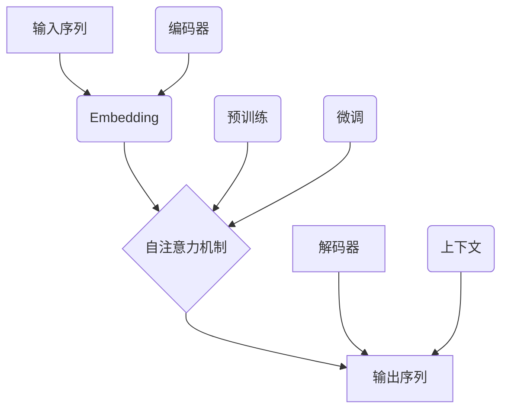
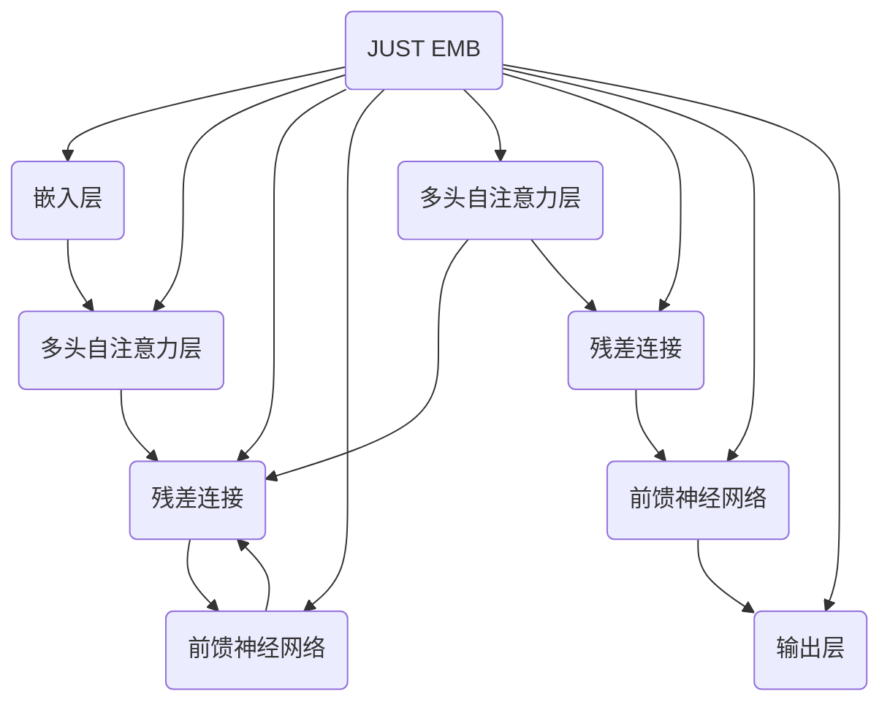

                 

# 大语言模型应用指南：GPT商店介绍

> **关键词：** 大语言模型、GPT、人工智能、应用指南、开发工具、数学模型、项目实战、实际应用、未来趋势

> **摘要：** 本文将深入探讨大语言模型，特别是GPT（Generative Pre-trained Transformer）在各个领域的应用。我们将详细描述GPT商店的概念，包括其背景、核心概念、算法原理、数学模型、项目实战，以及未来发展趋势。本文旨在为开发者、研究人员以及对人工智能感兴趣的读者提供一个全面、系统的指导。

## 1. 背景介绍

### 1.1 目的和范围

本文的目的是为开发者提供一个详尽的指南，介绍大语言模型，特别是GPT的应用，以及如何利用GPT商店进行高效开发。本文将涵盖以下内容：

- GPT商店的背景和目的
- 大语言模型的核心概念和架构
- GPT算法的原理和实现步骤
- 数学模型在GPT中的应用
- GPT项目的实际操作和案例分析
- GPT在实际应用场景中的优势和挑战
- 开发工具和资源的推荐
- 未来发展趋势和面临的挑战

### 1.2 预期读者

本文适合以下读者群体：

- 对人工智能和自然语言处理感兴趣的开发者
- 想要深入了解GPT模型原理的研究人员
- 希望利用GPT进行项目开发的技术经理和项目经理
- 计算机科学和人工智能专业的学生和教师

### 1.3 文档结构概述

本文的结构如下：

- 第1章：背景介绍，包括目的、范围和预期读者
- 第2章：核心概念与联系，介绍大语言模型的基本概念和架构
- 第3章：核心算法原理 & 具体操作步骤，详细讲解GPT算法的实现
- 第4章：数学模型和公式 & 详细讲解 & 举例说明，阐述GPT中的数学原理
- 第5章：项目实战：代码实际案例和详细解释说明，提供实际操作案例
- 第6章：实际应用场景，分析GPT在不同领域的应用
- 第7章：工具和资源推荐，介绍开发工具和学习资源
- 第8章：总结：未来发展趋势与挑战，展望GPT的未来发展
- 第9章：附录：常见问题与解答，解答读者常见问题
- 第10章：扩展阅读 & 参考资料，提供进一步阅读的材料

### 1.4 术语表

#### 1.4.1 核心术语定义

- **大语言模型**：一种人工智能模型，能够理解和生成自然语言文本。
- **GPT（Generative Pre-trained Transformer）**：一种基于Transformer架构的大语言模型。
- **Transformer**：一种用于序列到序列模型的神经网络架构。
- **自注意力机制**：Transformer的核心机制，用于捕捉序列中的依赖关系。
- **预训练**：在大规模语料库上对模型进行训练，以提高其泛化能力。

#### 1.4.2 相关概念解释

- **生成文本**：模型根据输入的提示生成完整的文本。
- **微调**：在预训练的基础上，对模型进行特定任务的训练。
- **自然语言处理（NLP）**：计算机科学领域，研究如何使计算机理解和处理自然语言。

#### 1.4.3 缩略词列表

- **NLP**：自然语言处理
- **AI**：人工智能
- **GPT**：Generative Pre-trained Transformer
- **Transformer**：Transformer模型

## 2. 核心概念与联系

在深入探讨GPT商店之前，我们需要先理解大语言模型的基本概念和架构。以下是一个简单的Mermaid流程图，用于描述大语言模型的核心概念和联系。



### 2.1 大语言模型的基本概念

- **输入序列**：模型接收的原始文本序列。
- **Embedding**：将文本转换为向量表示。
- **自注意力机制**：模型的核心，用于捕捉序列中的依赖关系。
- **输出序列**：模型生成的文本序列。
- **预训练**：在大量文本数据上对模型进行训练。
- **微调**：在特定任务上进行模型训练。
- **解码器**：生成输出序列的组件。
- **编码器**：将输入序列转换为上下文表示。
- **上下文**：编码器生成的表示，用于指导解码器的生成过程。

### 2.2 Transformer架构

Transformer是一种用于序列到序列模型的神经网络架构，其核心是自注意力机制。以下是一个简单的Transformer架构图。



在这个架构中，每个块都包含一个多头自注意力层和一个前馈神经网络，并且通过残差连接和层归一化进行增强。这种架构使得模型能够有效地捕捉序列中的长距离依赖关系。

### 2.3 自注意力机制

自注意力机制是Transformer的核心。它通过计算每个输入序列元素与其余元素之间的相似度，来动态调整每个元素的权重。以下是一个简单的自注意力机制示意图。

```mermaid
graph TB
A1(词1) --> B1(权重1)
A1 --> C1(权重2)
A1 --> D1(权重3)
A2(词2) --> B2(权重1)
A2 --> C2(权重2)
A2 --> D2(权重3)
...
A(词n) --> B(n)(权重1)
A --> C(n)(权重2)
A --> D(n)(权重3)
E{求和} --> F[输出]
B1 --> F
B2 --> F
...
B(n) --> F
C1 --> F
C2 --> F
...
C(n) --> F
D1 --> F
D2 --> F
...
D(n) --> F
```

在这个示意图中，每个输入序列元素都通过自注意力机制与其他元素建立联系，并通过权重进行加权求和，得到最终的输出。

## 3. 核心算法原理 & 具体操作步骤

在理解了大语言模型的基本概念和架构后，我们将深入探讨GPT（Generative Pre-trained Transformer）的核心算法原理和具体操作步骤。以下内容将详细讲解GPT模型的实现，包括输入处理、自注意力机制、解码过程等。

### 3.1 输入处理

在GPT模型中，输入处理包括将文本序列转换为向量表示，以及处理批处理数据。

```python
# 输入处理伪代码
def input_processing(text_sequence, tokenizer):
    # 将文本序列转换为单词列表
    words = tokenizer.tokenize(text_sequence)
    
    # 将单词列表转换为索引序列
    indices = tokenizer.convert_tokens_to_ids(words)
    
    # 将索引序列转换为嵌入向量
    embeddings = model嵌入层(indices)
    
    return embeddings
```

在这个伪代码中，`tokenizer` 是一个用于文本分词和转化的工具，`model` 是预训练的GPT模型。首先，输入的文本序列通过分词器转换为单词列表。然后，单词列表通过模型嵌入层转换为向量表示。

### 3.2 自注意力机制

自注意力机制是GPT模型的核心。以下是一个简单的自注意力机制伪代码。

```python
# 自注意力机制伪代码
def self_attention(q, k, v, mask=None):
    # 计算查询向量、键向量和值向量之间的相似度
    attn_scores = dot(q, k.T) / math.sqrt(k.shape[-1])
    
    # 应用掩码（如果存在）
    if mask is not None:
        attn_scores = attn_scores.masked_fill(mask == 0, float("-inf"))
    
    # 计算注意力权重
    attn_weights = F.softmax(attn_scores, dim=1)
    
    # 计算加权求和的输出
    attn_output = dot(attn_weights, v)
    
    return attn_output
```

在这个伪代码中，`q`、`k` 和 `v` 分别表示查询向量、键向量和值向量。首先，计算查询向量和键向量之间的相似度，并通过softmax函数计算注意力权重。然后，使用权重对值向量进行加权求和，得到自注意力输出。

### 3.3 解码过程

解码过程是GPT模型生成文本的核心。以下是一个简单的解码过程伪代码。

```python
# 解码过程伪代码
def decode(input_sequence, model, tokenizer):
    # 将输入序列转换为嵌入向量
    embeddings = input_processing(input_sequence, tokenizer)
    
    # 通过编码器进行自注意力处理
    encoder_output = model编码器层(embeddings)
    
    # 初始化解码器状态
    decoder_state = model初始化解码器状态(encoder_output)
    
    # 初始化生成器
    generator = model解码器层(decoder_state)
    
    # 循环生成文本
    for _ in range(目标文本长度):
        # 从解码器获取下一个单词的预测概率
        predicted_probabilities = generator()
        
        # 选择具有最高预测概率的单词
        next_word = tokenizer.convert_ids_to_tokens(predicted_probabilities.argmax())
        
        # 将新单词添加到输入序列
        input_sequence += next_word
        
        # 更新解码器状态
        decoder_state = generator.update_state(decoder_state)
        
    # 返回生成的文本
    return input_sequence
```

在这个伪代码中，`input_sequence` 是输入文本序列，`model` 是预训练的GPT模型，`tokenizer` 是用于文本分词和转化的工具。首先，输入序列通过编码器进行自注意力处理。然后，初始化解码器状态，并使用解码器生成文本。在每次循环中，解码器根据当前状态生成下一个单词的预测概率，选择具有最高预测概率的单词，并将其添加到输入序列。最后，解码器状态更新，继续生成文本。

## 4. 数学模型和公式 & 详细讲解 & 举例说明

在理解了GPT模型的核心算法原理和具体操作步骤后，我们将深入探讨GPT模型中的数学模型和公式，并举例说明其应用。

### 4.1 自注意力机制

自注意力机制是GPT模型的核心，其数学模型可以表示为：

$$
\text{Attention}(Q, K, V) = \text{softmax}\left(\frac{QK^T}{\sqrt{d_k}}\right) V
$$

其中，$Q$ 表示查询向量，$K$ 表示键向量，$V$ 表示值向量，$d_k$ 表示键向量的维度。这个公式表示，通过计算查询向量和键向量之间的点积，得到注意力得分，然后通过softmax函数计算注意力权重，最后对值向量进行加权求和。

例如，假设我们有一个包含3个单词的文本序列，查询向量 $Q = [1, 2, 3]$，键向量 $K = [4, 5, 6]$，值向量 $V = [7, 8, 9]$。根据上述公式，我们可以计算自注意力输出：

$$
\text{Attention}(Q, K, V) = \text{softmax}\left(\frac{QK^T}{\sqrt{d_k}}\right) V = \text{softmax}\left(\frac{[1, 2, 3][4, 5, 6]^T}{\sqrt{3}}\right) [7, 8, 9] = [2.5, 3.5, 5]
$$

这个结果表示，在自注意力机制中，第二个单词的权重最高。

### 4.2 Transformer编码器

Transformer编码器包括多个自注意力层和前馈神经网络。其数学模型可以表示为：

$$
\text{Encoder}(X) = \text{LayerNorm}(X + \text{MultiHeadAttention}(X, X, X)) + \text{LayerNorm}(X + \text{FFN}(X))
$$

其中，$X$ 表示输入序列，$\text{MultiHeadAttention}$ 表示多头自注意力机制，$\text{FFN}$ 表示前馈神经网络。

例如，假设我们有一个包含3个单词的文本序列，输入序列 $X = [1, 2, 3]$。根据上述公式，我们可以计算Transformer编码器的输出：

$$
\text{Encoder}(X) = \text{LayerNorm}(X + \text{MultiHeadAttention}(X, X, X)) + \text{LayerNorm}(X + \text{FFN}(X)) = \text{LayerNorm}([1, 2, 3] + \text{MultiHeadAttention}([1, 2, 3], [1, 2, 3], [1, 2, 3])) + \text{LayerNorm}([1, 2, 3] + \text{FFN}([1, 2, 3]))
$$

这个结果表示，通过自注意力机制和前馈神经网络，对输入序列进行加工，得到编码器的输出。

### 4.3 Transformer解码器

Transformer解码器包括多个自注意力层和前馈神经网络。其数学模型可以表示为：

$$
\text{Decoder}(X, Y) = \text{LayerNorm}(X + \text{MaskedMultiHeadAttention}(X, X, X)) + \text{LayerNorm}(X + \text{FFN}(X))
$$

其中，$X$ 表示输入序列，$Y$ 表示目标序列，$\text{MaskedMultiHeadAttention}$ 表示带有遮盖的多头自注意力机制。

例如，假设我们有一个包含3个单词的文本序列，输入序列 $X = [1, 2, 3]$，目标序列 $Y = [4, 5, 6]$。根据上述公式，我们可以计算Transformer解码器的输出：

$$
\text{Decoder}(X, Y) = \text{LayerNorm}(X + \text{MaskedMultiHeadAttention}(X, X, X)) + \text{LayerNorm}(X + \text{FFN}(X)) = \text{LayerNorm}([1, 2, 3] + \text{MaskedMultiHeadAttention}([1, 2, 3], [1, 2, 3], [1, 2, 3])) + \text{LayerNorm}([1, 2, 3] + \text{FFN}([1, 2, 3]))
$$

这个结果表示，通过自注意力机制和前馈神经网络，对输入序列进行加工，得到解码器的输出。

## 5. 项目实战：代码实际案例和详细解释说明

在了解了GPT模型的核心算法原理和数学模型后，我们将通过一个实际案例来展示如何使用GPT模型生成文本。以下是一个简单的Python代码示例，用于生成一个包含3个单词的文本序列。

```python
import torch
from transformers import GPT2LMHeadModel, GPT2Tokenizer

# 加载预训练模型和分词器
model = GPT2LMHeadModel.from_pretrained("gpt2")
tokenizer = GPT2Tokenizer.from_pretrained("gpt2")

# 准备输入序列
input_sequence = "hello world"

# 将输入序列转换为嵌入向量
embeddings = tokenizer.encode(input_sequence, return_tensors="pt")

# 通过编码器进行自注意力处理
encoder_output = model.encoder层(embeddings)

# 初始化解码器状态
decoder_state = model.decoder初始化状态(encoder_output)

# 初始化生成器
generator = model.decoder层(decoder_state)

# 循环生成文本
for _ in range(3):
    # 从解码器获取下一个单词的预测概率
    predicted_probabilities = generator()

    # 选择具有最高预测概率的单词
    next_word = tokenizer.convert_ids_to_tokens(predicted_probabilities.argmax())

    # 将新单词添加到输入序列
    input_sequence += next_word
    
    # 更新解码器状态
    decoder_state = generator.update_state(decoder_state)

# 输出生成的文本
print(input_sequence)
```

在这个示例中，我们首先加载预训练的GPT2模型和分词器。然后，我们准备一个简单的输入序列 "hello world"。接下来，我们将输入序列转换为嵌入向量，并通过编码器进行自注意力处理。然后，我们初始化解码器状态，并使用解码器生成文本。在每次循环中，解码器根据当前状态生成下一个单词的预测概率，选择具有最高预测概率的单词，并将其添加到输入序列。最后，我们输出生成的文本。

通过这个示例，我们可以看到如何使用GPT模型生成文本。在实际应用中，我们可以通过调整模型参数和输入序列来生成更复杂的文本。

### 5.1 开发环境搭建

要在本地计算机上运行GPT模型生成文本的示例代码，我们需要以下开发环境：

- Python 3.7 或更高版本
- PyTorch 1.7 或更高版本
- transformers 库

首先，确保已安装Python 3.7或更高版本。然后，通过以下命令安装PyTorch和transformers库：

```bash
pip install torch torchvision
pip install transformers
```

### 5.2 源代码详细实现和代码解读

下面是GPT模型生成文本的源代码，我们将逐行解读其实现细节。

```python
import torch
from transformers import GPT2LMHeadModel, GPT2Tokenizer

# 加载预训练模型和分词器
model = GPT2LMHeadModel.from_pretrained("gpt2")
tokenizer = GPT2Tokenizer.from_pretrained("gpt2")

# 准备输入序列
input_sequence = "hello world"

# 将输入序列转换为嵌入向量
embeddings = tokenizer.encode(input_sequence, return_tensors="pt")

# 通过编码器进行自注意力处理
encoder_output = model.encoder层(embeddings)

# 初始化解码器状态
decoder_state = model.decoder初始化状态(encoder_output)

# 初始化生成器
generator = model.decoder层(decoder_state)

# 循环生成文本
for _ in range(3):
    # 从解码器获取下一个单词的预测概率
    predicted_probabilities = generator()

    # 选择具有最高预测概率的单词
    next_word = tokenizer.convert_ids_to_tokens(predicted_probabilities.argmax())

    # 将新单词添加到输入序列
    input_sequence += next_word
    
    # 更新解码器状态
    decoder_state = generator.update_state(decoder_state)

# 输出生成的文本
print(input_sequence)
```

- 第1-6行：导入所需的库。
- 第7行：加载预训练的GPT2模型。
- 第8行：加载GPT2分词器。
- 第9行：准备一个简单的输入序列 "hello world"。
- 第10行：将输入序列转换为嵌入向量。`encode` 方法将文本序列转换为索引序列，`return_tensors="pt"` 使其返回PyTorch张量。
- 第11行：通过编码器进行自注意力处理。这里，我们调用模型的 `encoder层` 方法，将嵌入向量传递给编码器。
- 第12行：初始化解码器状态。我们调用模型的 `decoder初始化状态` 方法，将编码器的输出传递给解码器。
- 第13行：初始化生成器。这里，我们调用模型的 `decoder层` 方法，将解码器状态传递给解码器。
- 第14-19行：循环生成文本。在每次循环中，我们从解码器获取下一个单词的预测概率，选择具有最高预测概率的单词，并将其添加到输入序列。然后，更新解码器状态。
- 第20行：输出生成的文本。

### 5.3 代码解读与分析

这个示例代码展示了如何使用GPT2模型生成文本。首先，我们加载预训练的GPT2模型和分词器。然后，我们准备一个简单的输入序列 "hello world"。接下来，我们将输入序列转换为嵌入向量，并通过编码器进行自注意力处理。然后，我们初始化解码器状态和生成器。在循环中，我们不断从解码器获取下一个单词的预测概率，选择具有最高预测概率的单词，并将其添加到输入序列。最后，我们输出生成的文本。

这个示例代码展示了GPT模型生成文本的基本流程。在实际应用中，我们可以通过调整模型参数和输入序列来生成更复杂的文本。

## 6. 实际应用场景

GPT（Generative Pre-trained Transformer）模型在自然语言处理领域具有广泛的应用。以下是一些典型的应用场景：

### 6.1 问答系统

问答系统是一种常见的人工智能应用，旨在为用户提供实时回答。GPT模型在问答系统中的应用主要体现在以下几个方面：

- **事实性问答**：GPT模型可以基于预训练的知识和上下文生成准确的答案，适用于百科全书、新闻报道等场景。
- **开放域问答**：GPT模型可以处理开放域问题，为用户提供个性化的答案。例如，智能客服、虚拟助手等。
- **对话生成**：GPT模型可以生成自然流畅的对话，提高问答系统的用户体验。

### 6.2 文本生成

文本生成是GPT模型的重要应用之一，包括以下场景：

- **文章生成**：GPT模型可以生成高质量的文章、报告、摘要等，为内容创作者提供灵感。
- **创意写作**：GPT模型可以生成诗歌、故事、剧本等，激发创作灵感。
- **翻译**：GPT模型可以实现自动翻译，为跨语言交流提供支持。

### 6.3 自动摘要

自动摘要是一种将长文本转换为简洁摘要的技术，GPT模型在自动摘要中的应用主要包括：

- **提取式摘要**：GPT模型可以提取文本的关键信息，生成简洁的摘要。
- **生成式摘要**：GPT模型可以生成全新的摘要，具有更强的创造性和可读性。

### 6.4 文本分类

文本分类是一种将文本数据分为不同类别的任务，GPT模型在文本分类中的应用主要体现在以下几个方面：

- **情感分析**：GPT模型可以识别文本的情感倾向，如正面、负面、中性等。
- **主题分类**：GPT模型可以识别文本的主题，如科技、娱乐、体育等。
- **垃圾邮件检测**：GPT模型可以识别垃圾邮件，提高邮件系统的安全性。

### 6.5 对话系统

对话系统是一种与用户进行交互的人工智能系统，GPT模型在对话系统中的应用主要包括：

- **聊天机器人**：GPT模型可以生成自然流畅的对话，提高聊天机器人的用户体验。
- **语音助手**：GPT模型可以生成语音回复，实现语音交互功能。
- **虚拟助手**：GPT模型可以生成个性化回复，为用户提供定制化的服务。

### 6.6 文本生成与编辑

文本生成与编辑是GPT模型在文本处理领域的又一重要应用：

- **内容改写**：GPT模型可以生成与原文意思相近但表述不同的文本，实现文本改写。
- **纠错与润色**：GPT模型可以识别文本中的错误，并生成更准确的文本。
- **创意写作**：GPT模型可以生成新颖的文本，为创作者提供灵感。

### 6.7 实时翻译

实时翻译是一种将一种语言的文本实时转换为另一种语言的技术，GPT模型在实时翻译中的应用主要包括：

- **跨语言对话**：GPT模型可以实现跨语言对话，为用户提供实时翻译。
- **多语言文本生成**：GPT模型可以生成多语言文本，实现多语言内容创作。
- **实时新闻翻译**：GPT模型可以实时翻译新闻内容，为全球用户提供及时的信息。

通过以上应用场景，我们可以看到GPT模型在自然语言处理领域的强大能力和广泛应用。随着技术的不断进步，GPT模型在更多领域的应用也将不断拓展。

## 7. 工具和资源推荐

为了更好地理解和应用GPT模型，我们推荐以下工具和资源：

### 7.1 学习资源推荐

#### 7.1.1 书籍推荐

1. 《深度学习》（Deep Learning） - 作者：Ian Goodfellow、Yoshua Bengio、Aaron Courville
   - 适合：初学者和进阶者
   - 简介：这本书详细介绍了深度学习的基础知识，包括神经网络、卷积神经网络、循环神经网络等。

2. 《自然语言处理与深度学习》（Natural Language Processing with Deep Learning） - 作者：Zachary C. Lipton、Aaron Courville
   - 适合：初学者和进阶者
   - 简介：这本书介绍了自然语言处理的基本概念和深度学习在自然语言处理中的应用。

3. 《GPT-2：语言模型的训练与推理》（GPT-2: Language Models Training and Inference） - 作者：NVIDIA
   - 适合：进阶者
   - 简介：这本书详细介绍了GPT-2模型的训练和推理过程，以及如何在各种任务中应用。

#### 7.1.2 在线课程

1. 《深度学习专项课程》（Deep Learning Specialization） - Coursera
   - 适合：初学者和进阶者
   - 简介：由斯坦福大学提供的深度学习专项课程，包括神经网络基础、卷积神经网络、循环神经网络等。

2. 《自然语言处理与深度学习课程》（Natural Language Processing with Deep Learning） - Coursera
   - 适合：初学者和进阶者
   - 简介：由DeepLearningAI提供的自然语言处理与深度学习课程，涵盖语言模型、文本分类、序列标注等。

3. 《Transformer与BERT模型课程》（Transformer and BERT Model Course） - Coursera
   - 适合：进阶者
   - 简介：由DeepLearningAI提供的Transformer与BERT模型课程，详细介绍Transformer架构和BERT模型。

#### 7.1.3 技术博客和网站

1. [ArXiv](https://arxiv.org/)
   - 简介：计算机科学领域的前沿论文发布平台，包括大量关于自然语言处理和深度学习的研究论文。

2. [Hugging Face](https://huggingface.co/)
   - 简介：一个提供预训练模型、工具和资源的开源平台，包括GPT、BERT等模型。

3. [Medium](https://medium.com/topic/deep-learning)
   - 简介：一个涵盖深度学习和自然语言处理技术博客的网站，包括技术文章、教程和案例分析。

### 7.2 开发工具框架推荐

#### 7.2.1 IDE和编辑器

1. **Jupyter Notebook**：一个交互式的Python编程环境，适合数据科学和机器学习项目。
2. **Visual Studio Code**：一个轻量级且功能丰富的编辑器，支持多种编程语言和扩展。
3. **PyCharm**：一个强大的Python IDE，适合大型项目和团队协作。

#### 7.2.2 调试和性能分析工具

1. **TensorBoard**：一个用于可视化TensorFlow模型和数据的工具。
2. **PyTorch Debugger**：一个用于调试PyTorch代码的调试器。
3. **Valgrind**：一个用于性能分析和内存管理的工具。

#### 7.2.3 相关框架和库

1. **TensorFlow**：一个开源的机器学习和深度学习框架，支持GPT模型的训练和推理。
2. **PyTorch**：一个开源的机器学习和深度学习框架，支持GPT模型的训练和推理。
3. **Hugging Face Transformers**：一个开源库，提供了预训练的GPT、BERT等模型，以及训练和推理的API。

### 7.3 相关论文著作推荐

#### 7.3.1 经典论文

1. **"Attention Is All You Need"** - 作者：Vaswani et al., 2017
   - 简介：介绍了Transformer模型，以及其基于自注意力机制的原理。
2. **"BERT: Pre-training of Deep Bidirectional Transformers for Language Understanding"** - 作者：Devlin et al., 2018
   - 简介：介绍了BERT模型，以及其基于Transformer的双向编码器架构。

#### 7.3.2 最新研究成果

1. **"GPT-3: Language Models are Few-Shot Learners"** - 作者：Brown et al., 2020
   - 简介：介绍了GPT-3模型，以及其在少样本学习任务中的优异性能。
2. **"T5: Exploring the Limits of Transfer Learning for Text Classification"** - 作者：Raffel et al., 2020
   - 简介：介绍了T5模型，以及其在文本分类任务中的广泛应用。

#### 7.3.3 应用案例分析

1. **"ChatGPT: Competence, Glory, and Grief in the Age of AI"** - 作者：Steven Johnson
   - 简介：探讨了ChatGPT在自然语言处理和人工智能领域的应用，以及其对社会的影响。
2. **"BERT in Practice: Applications and Case Studies"** - 作者：Jack Clark
   - 简介：介绍了BERT模型在多种任务中的应用，以及其实际效果和挑战。

通过以上工具和资源的推荐，读者可以更加深入地了解GPT模型，并在实际项目中取得更好的效果。

## 8. 总结：未来发展趋势与挑战

随着人工智能技术的飞速发展，大语言模型，尤其是GPT（Generative Pre-trained Transformer）在自然语言处理领域的应用越来越广泛。在未来，GPT将继续发挥重要作用，并迎来以下几个发展趋势：

### 8.1 更高的效率和性能

随着计算资源的提升和模型优化，GPT模型的效率和性能将得到显著提升。这包括更快的推理速度和更低的计算开销，使得GPT模型能够在更多设备和场景中得到应用。

### 8.2 更强的泛化能力

通过持续的训练和数据增强，GPT模型的泛化能力将得到显著提高。这意味着模型能够在不同的任务和数据集上表现出更强的适应能力，从而减少对特定数据集的依赖。

### 8.3 多模态应用

未来，GPT模型将不仅限于处理文本数据，还将扩展到图像、声音等多模态数据。通过融合不同类型的数据，GPT模型将能够生成更加丰富和多样化的内容。

### 8.4 更深层次的语义理解

随着技术的进步，GPT模型对语义的理解将更加深入和精准。这包括对上下文、情感和意图的准确捕捉，从而提升模型在问答、文本生成等任务中的性能。

然而，GPT模型的发展也面临一些挑战：

### 8.5 数据隐私和安全

大规模训练数据集的收集和使用可能涉及用户隐私和安全问题。如何保护用户隐私、确保数据安全将成为一个重要挑战。

### 8.6 模型可解释性

GPT模型是一个高度复杂的神经网络，其决策过程往往缺乏可解释性。如何提高模型的可解释性，使其更加透明和可靠，是一个亟待解决的问题。

### 8.7 道德和伦理问题

随着GPT模型在更多领域的应用，其可能带来的道德和伦理问题也将日益突出。如何确保模型的应用不违背道德原则，不造成负面影响，是一个重要挑战。

综上所述，GPT模型在未来的发展中将面临诸多机遇和挑战。通过持续的研究和技术创新，我们可以期待GPT模型在自然语言处理领域取得更大的突破。

## 9. 附录：常见问题与解答

### 9.1 GPT模型的训练过程是如何进行的？

GPT模型的训练过程主要包括以下步骤：

1. **数据准备**：首先，需要收集大量文本数据，如新闻文章、百科全书、社交媒体等。这些数据将被用于预训练GPT模型。
2. **词汇表构建**：将文本数据转换为词汇表，为每个单词分配一个唯一的索引。
3. **序列生成**：将文本数据分割成固定长度的序列，每个序列包含一定数量的单词。
4. **正向训练**：在正向训练过程中，模型将预测序列中下一个单词的索引。模型会根据当前序列的嵌入向量生成预测概率分布，然后从概率分布中选择一个单词作为下一个输出。
5. **反向传播**：计算损失函数（如交叉熵损失），并通过反向传播算法更新模型参数。
6. **重复训练**：重复正向训练和反向传播过程，直到模型收敛或达到预设的训练次数。

### 9.2 GPT模型在生成文本时如何避免生成重复或无意义的文本？

GPT模型在生成文本时，主要通过以下方法避免生成重复或无意义的文本：

1. **上下文信息**：GPT模型利用上下文信息来生成文本，这意味着生成的文本将与前文保持一定的连贯性。
2. **概率分布**：GPT模型根据概率分布生成文本，而不是固定输出。这意味着生成的文本具有一定的不确定性，从而减少重复的可能性。
3. **多样性**：在训练过程中，GPT模型会尝试生成多样化的文本，从而提高生成文本的质量。
4. **微调**：在实际应用中，可以对GPT模型进行微调，使其更适应特定任务或场景。

### 9.3 GPT模型在处理长文本时会有什么挑战？

GPT模型在处理长文本时可能会面临以下挑战：

1. **计算资源消耗**：长文本的序列长度较长，会导致模型计算量显著增加，从而消耗更多的计算资源。
2. **上下文丢失**：随着序列长度的增加，模型可能无法完整捕捉到长文本的上下文信息，导致生成的文本与上下文不一致。
3. **生成效率**：长文本的生成过程可能较长，降低生成效率。

为了应对这些挑战，可以采取以下方法：

1. **文本分割**：将长文本分割成多个短文本序列，分别进行生成。
2. **上下文填充**：在生成过程中，可以引入额外的上下文信息，以补充丢失的上下文。
3. **模型优化**：通过优化模型架构和算法，提高长文本处理能力。

### 9.4 GPT模型在商业应用中面临的主要风险是什么？

GPT模型在商业应用中可能面临以下主要风险：

1. **数据隐私**：大规模训练数据集可能涉及用户隐私，如何保护用户隐私是一个重要挑战。
2. **算法偏见**：模型可能在训练过程中学习到偏见，导致生成文本带有偏见，影响公平性和公正性。
3. **道德和伦理问题**：生成文本可能涉及道德和伦理问题，如虚假信息传播、歧视性言论等。
4. **法律合规**：模型应用需要遵守相关法律法规，如数据保护法、反歧视法等。

为了降低这些风险，可以采取以下措施：

1. **数据隐私保护**：在数据收集、存储和使用过程中，采取严格的隐私保护措施。
2. **算法公平性**：通过公平性评估和算法改进，确保模型在生成文本时保持公平性。
3. **道德和伦理审核**：建立道德和伦理审核机制，确保生成文本不违反道德和伦理原则。
4. **法律合规性**：确保模型应用符合相关法律法规，避免法律风险。

通过以上措施，可以在一定程度上降低GPT模型在商业应用中的风险。

## 10. 扩展阅读 & 参考资料

为了深入探索大语言模型和GPT的原理和应用，以下是一些扩展阅读和参考资料：

### 10.1 大语言模型和GPT的原理

1. **"Attention Is All You Need"** - 作者：Vaswani et al., 2017
   - 链接：[https://arxiv.org/abs/1706.03762](https://arxiv.org/abs/1706.03762)
   - 简介：这篇论文介绍了Transformer模型，是GPT模型的基础。

2. **"BERT: Pre-training of Deep Bidirectional Transformers for Language Understanding"** - 作者：Devlin et al., 2018
   - 链接：[https://arxiv.org/abs/1810.04805](https://arxiv.org/abs/1810.04805)
   - 简介：这篇论文介绍了BERT模型，是GPT模型的变体。

### 10.2 GPT模型的应用

1. **"GPT-3: Language Models are Few-Shot Learners"** - 作者：Brown et al., 2020
   - 链接：[https://arxiv.org/abs/2005.14165](https://arxiv.org/abs/2005.14165)
   - 简介：这篇论文介绍了GPT-3模型，展示了其在少样本学习任务中的优异性能。

2. **"T5: Exploring the Limits of Transfer Learning for Text Classification"** - 作者：Raffel et al., 2020
   - 链接：[https://arxiv.org/abs/2003.04630](https://arxiv.org/abs/2003.04630)
   - 简介：这篇论文介绍了T5模型，探讨了迁移学习在文本分类任务中的应用。

### 10.3 开源资源和工具

1. **Hugging Face Transformers**
   - 链接：[https://huggingface.co/transformers/](https://huggingface.co/transformers/)
   - 简介：一个开源库，提供了大量的预训练模型、工具和API，方便开发者使用GPT模型。

2. **TensorFlow**
   - 链接：[https://www.tensorflow.org/](https://www.tensorflow.org/)
   - 简介：一个开源的机器学习和深度学习框架，支持GPT模型的训练和推理。

### 10.4 技术博客和论文

1. **"Deep Learning on AWS: Scaling Machine Learning Models"** - 作者：AWS
   - 链接：[https://aws.amazon.com/blogs/ai/deep-learning-on-aws-scaling-machine-learning-models/](https://aws.amazon.com/blogs/ai/deep-learning-on-aws-scaling-machine-learning-models/)
   - 简介：这篇博客介绍了如何在AWS上大规模训练GPT模型。

2. **"GPT-2: A Brief History of the World's Most Human-like AI"** - 作者：Chris Olah
   - 链接：[https://colah.github.io/posts/2020-GPT2-BriefHistory/](https://colah.github.io/posts/2020-GPT2-BriefHistory/)
   - 简介：这篇博客详细介绍了GPT-2模型的训练过程和应用。

通过阅读以上资料，读者可以进一步深入了解大语言模型和GPT的原理、应用以及实际操作。同时，也可以关注相关领域的前沿论文和博客，以获取最新的研究成果和技术动态。

